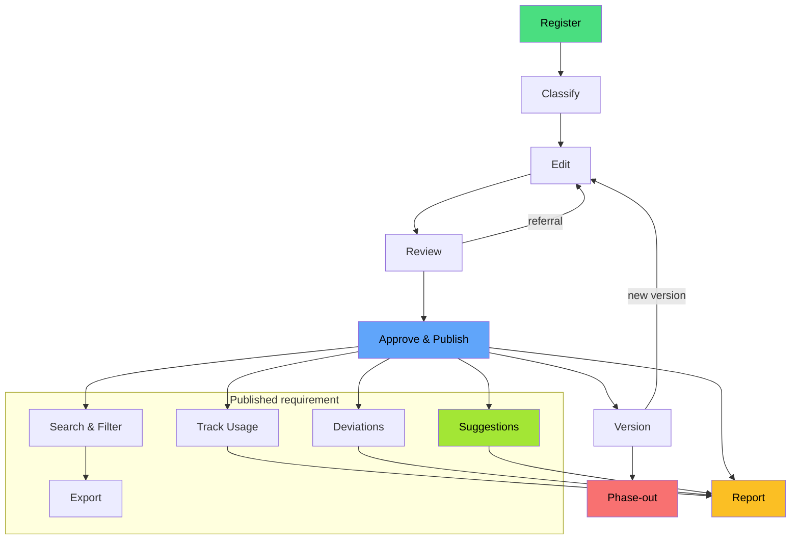
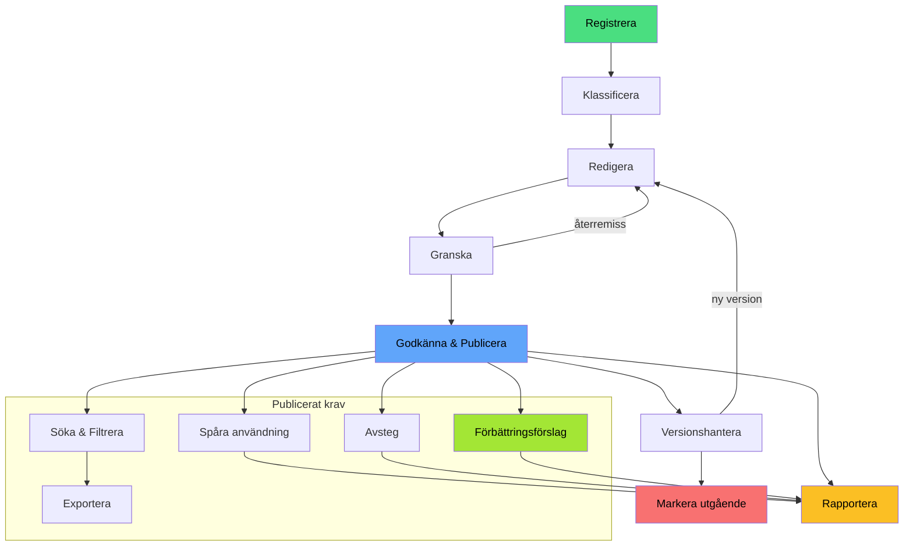

# Requirements Management Web Application

A web application for requirements management that supports the
company's requirements model and requirements process.

<!-- cSpell:disable-next-line -->
*En webbapplikation för kravhantering som stödjer företagets
kravmodell och kravprocess.*

## Requirements Process

- [English](#english)
- [Svenska](#svenska)

### English

There is no English user guide, but the
[Swedish guide](docs/guide/README.md) includes
screenshots that may be helpful.

The application supports the full requirements lifecycle:

1. **Register** — create a new requirement or a new version
2. **Classify** — assign area, category, owner, risk level,
   usage scenarios
3. **Edit** — update requirement text, guidance, and evidence
4. **Review** — submit for review, collect comments, handle
   referrals
5. **Approve & publish** — set decided status and make
   available
6. **Version** — track versions, change history, and validity
7. **Phase-out** — retire requirements without losing history
8. **Search & filter** — find requirements by metadata,
   taxonomy, and context
9. **Export** — produce requirement lists and reports for
   procurement or operations
10. **Track usage** — record where a requirement version is
    applied
11. **Deviations** — register and follow up exceptions linked
    to a requirement
12. **Improvement suggestions** — collect feedback and link
    it to a requirement
13. **Report** — show status, usage, deviations, changes,
    and history

<!-- markdownlint-disable MD013 -->



<!-- markdownlint-enable MD013 -->

<!-- cSpell:disable -->

### Svenska

Se även
[Användarguide](docs/guide/README.md)
för steg-för-steg-instruktioner med skärmdumpar.

Applikationen stödjer hela kravlivscykeln:

1. **Registrera** — skapa ett nytt krav eller en ny version
2. **Klassificera** — tilldela område, kategori, ägare,
   risknivå, användningsscenarier
3. **Redigera** — uppdatera kravtext, vägledning och evidens
4. **Granska** — skicka till granskning, samla kommentarer,
   hantera återremiss
5. **Godkänna och publicera** — sätta beslutad status och
   göra tillgängligt
6. **Versionshantera** — hålla reda på versioner,
   ändringshistorik och giltighet
7. **Markera som utgående** — fasa ut krav utan att förlora
   historik
8. **Söka och filtrera** — hitta krav utifrån metadata,
   taxonomi och kontext
9. **Exportera** — ta fram kravlistor och rapporter för
   upphandling eller förvaltning
10. **Spåra användning** — registrera var en kravversion
    tillämpas
11. **Hantera avsteg** — registrera och följa upp undantag
    kopplade till ett krav
12. **Samla förbättringsförslag** — ta emot synpunkter och
    koppla dem till ett krav
13. **Rapportera** — visa status, användning, avsteg,
    ändringar och historik

<!-- markdownlint-disable MD013 -->



<!-- markdownlint-enable MD013 -->
<!-- cSpell:enable -->

## MCP Server

This project also includes an in-app MCP server for requirements management.

- User guide: [docs/mcp-server-user-guide.md](docs/mcp-server-user-guide.md)
- Contributor guide:
  [docs/mcp-server-contributor-guide.md](docs/mcp-server-contributor-guide.md)

### Learn more

<!-- markdownlint-disable MD013 -->

| Topic | Document |
| :-- | :-- |
| Status transitions | [Lifecycle workflow](docs/lifecycle-workflow.md) |
| Version timestamps | [Version lifecycle dates](docs/version-lifecycle-dates.md) |
| Data model | [Database schema](docs/database-schema.md) |
| Architecture (SV) | [Arkitekturbeskrivning](docs/arkitekturbeskrivning-kravhantering.md) |
| UI behaviour | [Requirements UI](docs/requirements-ui-behaviour.md) |
| Reports | [Reports](docs/reports.md) |
| Admin settings | [Admin center](docs/admin-center.md) |

<!-- markdownlint-enable MD013 -->

## Tech Stack

The repository is in the middle of an approved database migration.

- Target architecture: **Microsoft SQL Server + TypeORM**
- Current checked-in runtime: large **SQLite + Drizzle** implementation still
  being migrated
- Canonical migration reference:
  [docs/sql-server-typeorm-migration-plan.md](docs/sql-server-typeorm-migration-plan.md)
- SQL Server scaffold workflow:
  [docs/sql-server-developer-workflow.md](docs/sql-server-developer-workflow.md)

- **Framework:** [Next.js](https://nextjs.org/) 16 (React 19)
- **Language:** TypeScript 5
- **Styling:** Tailwind CSS 4
- **Approved database target:** Microsoft SQL Server via TypeORM
- **Current migration-state database runtime:** SQLite via Drizzle ORM
- **Current local/CI database runtime:** Separate SQLite proxy service container
- **Internationalization:** next-intl (Swedish & English)
- **App runtime:** Native Next.js self-hosting (`next dev`, `next start`)
- **Production target:** OpenShift-compatible Node container deployment
- **Testing:** Vitest (unit) · Playwright (integration)
- **Linting:** Biome · Pyright · markdownlint · cspell

## Prerequisites

- Node.js >= 24
- npm
- Docker Desktop or another Docker-compatible `docker compose` runtime

## Getting Started

The steps below still describe the current checked-in runtime. For the SQL
Server scaffold that is being introduced for the migration, see
[docs/sql-server-developer-workflow.md](docs/sql-server-developer-workflow.md).

```bash
# Install dependencies
npm install

# Start the local SQLite proxy database service
npm run db:up

# Set up the local database (wait, reset, migrate & seed)
npm run db:setup

# Start the development server
npm run dev
```

The app will be available at `http://localhost:3000`.

For a production-like local run, use:

```bash
npm run start:prodlike
```

`npm run start:prodlike` rebuilds with `NODE_ENV=production` and then starts
the built app on port `3001`.
The production build now requires database-backed UI terminology and
requirement column defaults to load successfully. If `DATABASE_URL` points to
an unavailable or uninitialized database, `npm run build` and
`npm run start:prodlike` will fail instead of falling back to shipped defaults.

## Contributing

See [CONTRIBUTING.md](CONTRIBUTING.md) for development setup,
database management, and coding guidelines.

## License

This project is licensed under the
[MIT License](LICENSE). © 2026 Viscalyx
