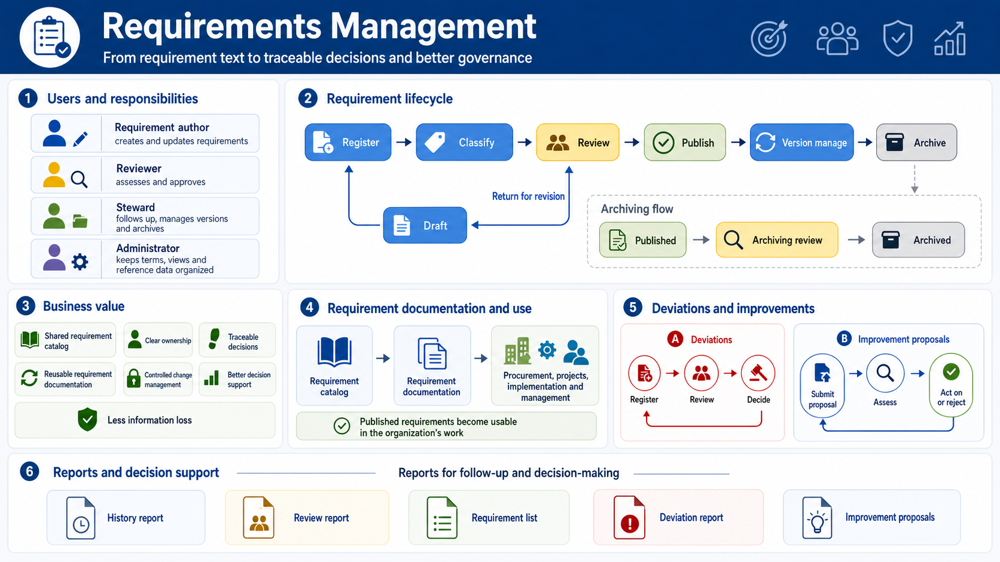
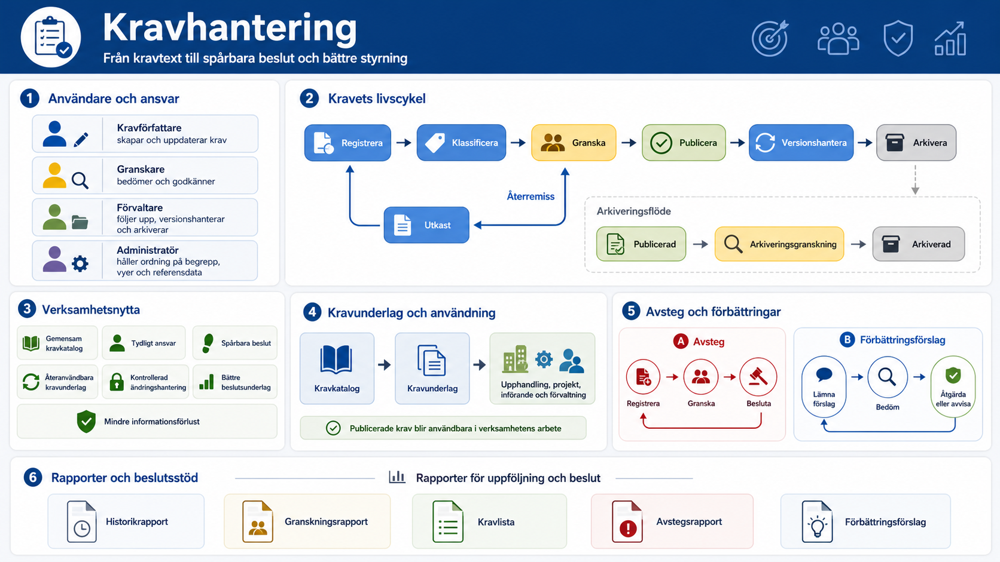
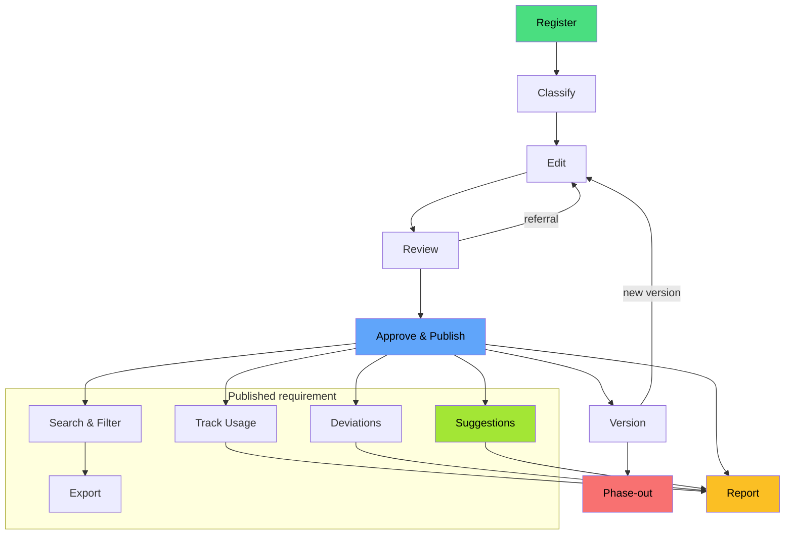
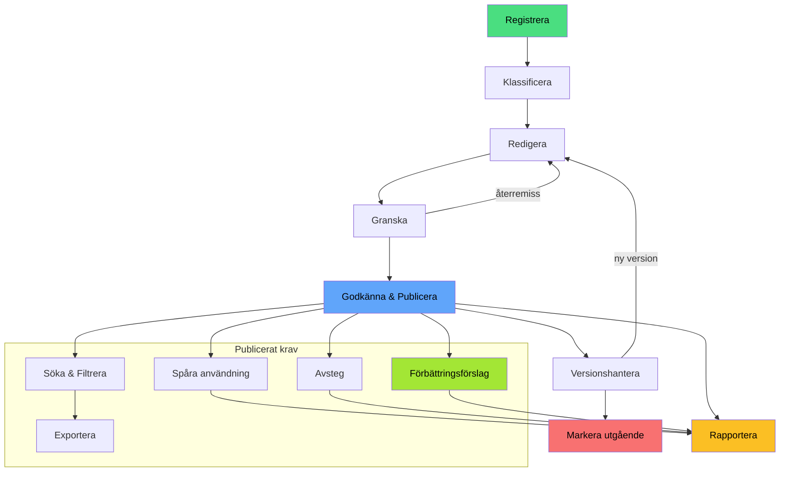

# Requirements Management Web Application

Kravhantering in Swedish, Requirements Management in English. This repository
contains a web application for managing requirements

## High-Level View (English)

>[!TIP]
>Se längre ner för en svensk översikt.



## Högnivåöversikt (Svenska)



## Requirements Process

- [English](#english)
- [Svenska](#svenska)

### English

There is no English user guide, but the
[Swedish guide](docs/user-guide/README.md) includes
screenshots that may be helpful.

The application supports the full requirements lifecycle:

1. **Register** — create a new requirement or a new version
2. **Classify** — assign library requirements to an area,
   category, owner, risk level, and requirement packages
3. **Edit** — update requirement text, guidance, and evidence
4. **Review** — submit for review, collect comments, handle
   referrals
5. **Approve & publish** — set decided status and make
   available
6. **Version** — track versions, change history, and validity
7. **Phase-out** — retire requirements without losing history
8. **Search & filter** — find requirements by metadata,
   taxonomy, and context
9. **Export** — produce requirement lists and reports for
   procurement or operations
10. **Track usage** — record where a requirement version is
    applied
11. **Deviations** — register and follow up exceptions linked
    to a requirement
12. **Improvement suggestions** — collect feedback and link
    it to a requirement
13. **Report** — show status, usage, deviations, changes,
    and history

<!-- markdownlint-disable MD013 -->



<!-- markdownlint-enable MD013 -->

## AI-assisted authoring

In Requirements Management, AI-assisted authoring turns the user’s description
and supporting material into structured requirement candidates, including
requirement text and acceptance criteria. The user reviews, edits, and selects
which candidates to import into the requirements library or a specification;
the AI makes no decisions and publishes nothing automatically.

<!-- markdownlint-disable MD013 -->
![Horizontal infographic titled “AI-assisted authoring.” It presents a five-step workflow from left to right: 1) the user describes a need and selects supporting input, 2) AI generates structured requirement proposals, 3) the user reviews the requirement text, acceptance criteria, and AI analysis, 4) the user edits the content, deselects proposals, and checks classification and standards references, and 5) the user previews and imports approved proposals into a requirement library or requirements document. The same user appears in stages 1, 3, 4, and 5, while AI is shown only as a blue document with sparkles in stage 2. An amber callout emphasizes that the proposals are not yet requirements. A green message explains that proposals enter the regular requirements process only after the user’s review. A control strip at the bottom states that there is no automatic publishing, no AI decision-making, the user chooses which proposals move forward, and all content can be edited before import.](docs/images/ai-assisted-authoring-requirements-management.png)
<!-- markdownlint-enable MD013 -->

<!-- cSpell:disable -->

### Svenska

Se även
[Användarguide](docs/user-guide/README.md)
för steg-för-steg-instruktioner med skärmdumpar.

Applikationen stödjer hela kravlivscykeln:

1. **Registrera** — skapa ett nytt krav eller en ny version
2. **Klassificera** — tilldela bibliotekskrav område,
   kategori, ägare, risknivå och kravpaket
3. **Redigera** — uppdatera kravtext, vägledning och evidens
4. **Granska** — skicka till granskning, samla kommentarer,
   hantera återremiss
5. **Godkänna och publicera** — sätta beslutad status och
   göra tillgängligt
6. **Versionshantera** — hålla reda på versioner,
   ändringshistorik och giltighet
7. **Markera som utgående** — fasa ut krav utan att förlora
   historik
8. **Söka och filtrera** — hitta krav utifrån metadata,
   taxonomi och kontext
9. **Exportera** — ta fram kravlistor och rapporter för
   upphandling eller förvaltning
10. **Spåra användning** — registrera var en kravversion
    tillämpas
11. **Hantera avsteg** — registrera och följa upp undantag
    kopplade till ett krav
12. **Samla förbättringsförslag** — ta emot synpunkter och
    koppla dem till ett krav
13. **Rapportera** — visa status, användning, avsteg,
    ändringar och historik

<!-- markdownlint-disable MD013 -->



<!-- markdownlint-enable MD013 -->
<!-- cSpell:enable -->

## AI-assisterat författande

Kravhantering används AI-assisterat författande för att omvandla användarens
beskrivning och underlag till strukturerade kravkandidater med bland annat
kravtext och acceptanskriterier. Användaren granskar, redigerar och väljer
vilka kandidater som ska importeras till kravbiblioteket eller ett kravunderlag;
AI:n fattar inga beslut och publicerar ingenting automatiskt.

<!-- markdownlint-disable MD013 -->
![Horisontell infografik med rubriken ”AI-assisterat författande”. Den visar ett arbetsflöde i fem steg från vänster till höger: 1) användaren beskriver sitt behov och väljer underlag, 2) AI tar fram strukturerade kravförslag, 3) användaren granskar kravtext, acceptanskriterier och AI-analys, 4) användaren redigerar innehåll, väljer bort förslag och kontrollerar klassning och normreferenser, och 5) användaren förhandsgranskar och importerar godkända förslag till ett kravbibliotek eller kravunderlag. Samma användare visas i steg 1, 3, 4 och 5, medan AI endast visas som ett blått dokument med gnistor i steg 2. Ett orange meddelande betonar att förslagen ännu inte är krav. Ett grönt meddelande förklarar att förslagen förs in i den ordinarie kravprocessen först efter användarens granskning. Längst ned finns en kontrollremsa med budskapen: ingen automatisk publicering, inga AI-beslut, användaren väljer vilka förslag som går vidare och innehållet kan redigeras före import.](docs/images/ai-assisterat-forfattande-kravhantering.png)
<!-- markdownlint-enable MD013 -->

## MCP Server

This project also includes an in-app MCP server for requirements management.

- User guide: [docs/integrations/mcp-server-user-guide.md](docs/integrations/mcp-server-user-guide.md)
- Contributor guide:
  [docs/integrations/mcp-server-contributor-guide.md](docs/integrations/mcp-server-contributor-guide.md)

### Learn more

<!-- markdownlint-disable MD013 -->

| Topic | Document |
| :-- | :-- |
| Status transitions | [Lifecycle workflow](docs/governance/lifecycle-workflow.md) |
| Version timestamps | [Version lifecycle dates](docs/reference/version-lifecycle-dates.md) |
| Data model | [Database schema](docs/reference/database-schema.md) |
| Information assets (SV) | [Informationsmängder](docs/security-privacy/informationsmangder-kravhantering.md) |
| UI behaviour | [Requirements UI](docs/governance/requirements-ui-behaviour.md) |
| Reports | [Reports](docs/reference/reports.md) |
| Admin settings | [Admin center](docs/governance/admin-center.md) |

<!-- markdownlint-enable MD013 -->

## Tech Stack

The application uses **Microsoft SQL Server + TypeORM** as its sole database
stack. See
[docs/development/sql-server-developer-workflow.md](docs/development/sql-server-developer-workflow.md)
for setup, migrations, seeding, and the developer browse workflow.

- **Framework:** [Next.js](https://nextjs.org/) 16 (React 19)
- **Language:** TypeScript 6
- **Styling:** Tailwind CSS 4
- **Database:** Microsoft SQL Server via TypeORM
- **Internationalization:** next-intl (Swedish & English)
- **App runtime:** Native Next.js self-hosting (`next dev`, `next start`)
- **Production target:** OpenShift-compatible Node container deployment
- **Testing:** Vitest (unit) · Playwright (integration)
- **Linting:** Biome · Pyright · markdownlint · cspell

## Prerequisites

- Node.js >= 24
- npm
- Docker Desktop or another Docker-compatible `docker compose` runtime

## Getting Started

### Local development using devcontainers

Start the devcontainers by opening the project in VS Code and accepting the
prompt to "Reopen in Container". The devcontainer includes the local
*SQL Server Developer* container, so you can run the full application and
database stack without any additional setup. It also installs the .NET SDK
and restores the GitVersion local tool from `.config/dotnet-tools.json` with
`dotnet tool restore`, matching the release workflow. `npm run dev`,
`npm run dev:https`, and prodlike builds write `public/build.json` with the
GitVersion `SemVer` value when the local tool is available, so the header title
tooltip shows the same semantic version locally.

### Local development without devcontainers

See [CONTRIBUTING.md](CONTRIBUTING.md) for the contributor checklist and links
to the detailed development workflows. The condensed local flow is:

```bash
npm install
docker compose -f docker-compose.sqlserver.yml up -d
npm run db:setup
npm run dev
```

The app will be available at `http://localhost:3000`.

For a production-like local run, use:

```bash
npm run start:prodlike
```

`npm run start:prodlike` rebuilds with `NODE_ENV=production` and then starts
the built app on port `3001`.

## Security CI

Each pull request to `main` runs an authenticated OWASP ZAP baseline
scan against a disposable copy of the application. See
[docs/security-privacy/security-ci.md][security-ci-doc] for the workflow design,
failure policy, and tuning instructions.

[security-ci-doc]: docs/security-privacy/security-ci.md

## Contributing

See [CONTRIBUTING.md](CONTRIBUTING.md) for the contributor quick start,
checklist, and links to detailed development workflows.

## License

This project is licensed under the
[MIT License](LICENSE). © 2026 Viscalyx
