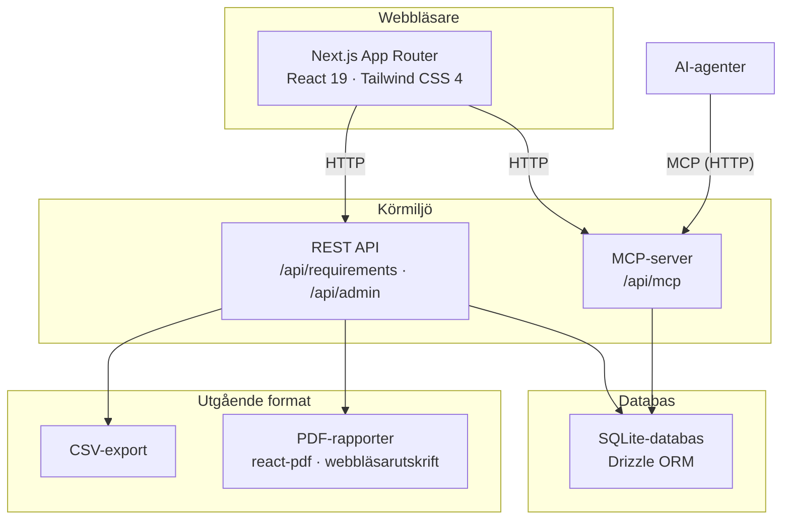
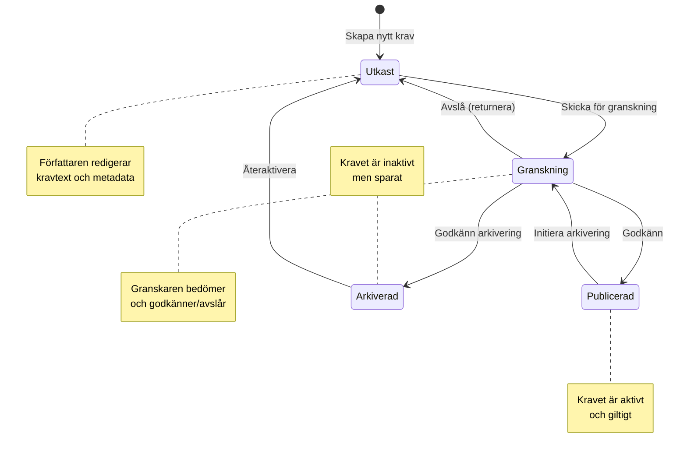
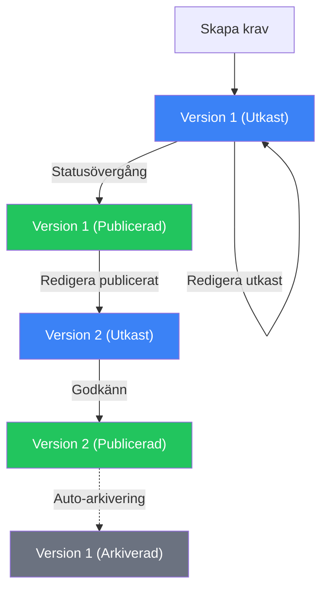
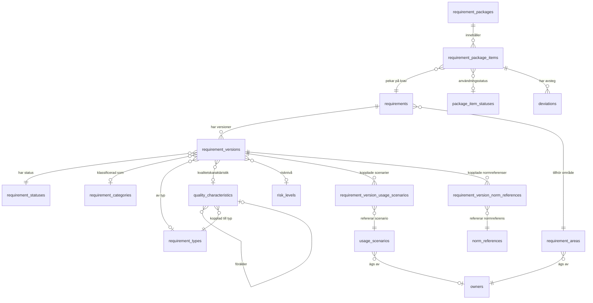

# Arkitekturbeskrivning — Kravhantering

<!-- markdownlint-disable MD013 -->
<!-- cSpell:words Archi applikationskomponenter applikationskod applikationssamband applikationsstruktur applikationstjänster Affärslogiklager batchoperationer behörighetskontroll datan Dataåtkomstlager detaljvy detaljvyn detaljvyer Enkelkolumnssortering Flerkravsrapport granskningsrapport helsidevy Huvudvyn infrastrukturanvändning informationsklassning infrastrukturarkitekt Kalkylbladsliknande kantterminering kodtäckning Kolumnbreddsjustering kombinerad kravförfattare Kravdata Kravfrågor kravinnehåll Kravlistrapport Kravlivscykel Kravlivscykeln kravmetadata kravrelaterade livscykeldatum livscykelhantering Läsåtkomst Navigeringsnav ordnivådifferenser Parameteriserade parameteriserade Pluggbart rapportgenerering referensdatahantering referensdatasidor säkerhetsrubrik statusövergång statusövergångar säkerhetsperspektiv terminologihantering tillståndsmaskin tvåstegs -->
<!-- markdownlint-enable MD013 -->

## Inledning

Denna arkitekturbeskrivning dokumenterar lösningen
**Kravhantering** — ett digitalt system för hantering av
tekniska krav med versionering, livscykelhantering och
tvåspråkigt stöd (svenska och engelska).

Dokumentet följer mallen för
arkitekturbeskrivningar och täcker de perspektiv som är
relevanta för lösningens nuvarande utformning. Varje
perspektiv riktar sig till de intressenter som anges i
respektive avsnitt.

**Konventioner:**

- Tekniska produktnamn (Next.js, Cloudflare, Drizzle
  ORM etc.) skrivs på engelska enligt branschstandard.
- Mermaid-diagram renderas i GitHub-markdown.
- ArchiMate-modeller presenteras i ASCII-notation och
  är avsedda att ersättas med verktygsexport.

---

## 1. Översiktsperspektiv

<!-- markdownlint-disable MD013 -->
**Intressenter:** Arkitekturledningen · verksamhetsarkitekt · huvudarkitekt · förvaltningsledare · projektledare
<!-- markdownlint-enable MD013 -->

### Sammanfattning

Kravhantering är en webbapplikation som ger
organisationen ett gemensamt verktyg för att skapa,
granska, publicera och arkivera tekniska krav. Systemet
är tillgängligt via `kravhantering.{foretag}.se` och
stödjer två språk (svenska och engelska) genomgående —
både i användargränssnittet och i den underliggande
datan.

Lösningen är uppbyggd i fyra huvudlager som samverkar
för att leverera funktionaliteten:



### Nyckelkomponenter

<!-- markdownlint-disable MD013 -->
| Lager | Teknik | Syfte |
| --- | --- | --- |
| Användargränssnitt | Next.js 16, React 19, Tailwind CSS 4 | Tvåspråkig webbapplikation med App Router |
| API-lager | REST-ändpunkter, MCP-server | CRUD, livscykelövergångar, AI-integration |
| Databas | SQLite via Cloudflare D1, Drizzle ORM | Kravdata, versionshistorik, taxonomi |
| Infrastruktur | Cloudflare Workers, OpenNext-adapter | Serverlös drift, global distribution |
<!-- markdownlint-enable MD013 -->

> **Notera:** Cloudflare Workers och Cloudflare D1 är
> nuvarande plattformsval men inte ett arkitekturkrav.
> Lösningen bygger på standardtekniker (Next.js,
> SQLite, Drizzle ORM) och kan driftas på alternativa
> plattformar (t.ex. Vercel, AWS, Azure) med
> anpassning av adapter och databindning.

### ArchiMate — Översikt (ASCII)

<!-- Replace with ArchiMate tool export -->

```text
┌─────────────────────────────────────────────────────────┐
│                   << Motivation >>                      │
│  Mål: Enhetlig kravhantering med full spårbarhet        │
│  Intressenter: Kravförfattare, Granskare, Förvaltare    │
└─────────────────────────────────────────────────────────┘
         │ realiseras av
         ▼
┌─────────────────────────────────────────────────────────┐
│              << Business Layer >>                       │
│                                                         │
│  [Business Process]     [Business Process]              │
│   Kravlivscykel          Rapportgenerering              │
│                                                         │
│  [Business Actor]       [Business Actor]                │
│   Kravförfattare         Granskare                      │
│   Förvaltare             Administratör                  │
└─────────────────────────────────────────────────────────┘
         │ stöds av
         ▼
┌─────────────────────────────────────────────────────────┐
│             << Application Layer >>                     │
│                                                         │
│  [Application Service]        [Application Service]     │
│   Kravkatalog (UI)             REST API                 │
│                                                         │
│  [Application Service]        [Application Service]     │
│   MCP-server (AI)              Rapportmotor             │
│                                                         │
│  [Application Component]                                │
│   RequirementsService (lib/requirements/service.ts)     │
│   Data Access Layer (lib/dal/)                          │
└─────────────────────────────────────────────────────────┘
         │ driftas på
         ▼
┌─────────────────────────────────────────────────────────┐
│             << Technology Layer >>                      │
│                                                         │
│  [Technology Service]    [Technology Service]           │
│   Cloudflare Workers      Cloudflare D1 (SQLite)        │
│                                                         │
│  [Technology Service]    [Technology Service]           │
│   Cloudflare Assets       OpenNext-adapter              │
└─────────────────────────────────────────────────────────┘
```

---

## 2. Verksamhetsprocessperspektiv

<!-- markdownlint-disable MD013 -->
**Intressenter:** Arkitekturledningen · verksamhetsarkitekt · huvudarkitekt · förvaltningsledare
<!-- markdownlint-enable MD013 -->

### Kravlivscykeln

Den centrala verksamhetsprocessen är kravets livscykel
— från utkast till arkivering. Processen följer en
tillståndsmaskin med fyra statusar och definierade
övergångar:



### Tvåstegs arkivering

Arkivering av publicerade krav sker i två steg för
att säkerställa kvalitetskontroll:

1. **Initiering** — En förvaltare begär arkivering.
   Kravet övergår till granskning med en
   arkiveringsflagga (`archive_initiated_at`).
2. **Godkännande** — En granskare bekräftar
   arkiveringen. Kravet får status *Arkiverad* och
   tidsstämpeln `archived_at` sätts.

Arkiveringen kan avbrytas innan godkännande genom att
returnera kravet till *Publicerad*.

### Versionshantering

Varje krav har en stabil identitet (`unique_id`, t.ex.
`INT0001`) och en serie versioner som bildar en
fullständig revisionshistorik:



**Nyckelprinciper:**

- Redigering av ett utkast uppdaterar befintlig version
  (ingen ny rad skapas).
- Redigering av publicerat krav skapar en ny
  utkastversion.
- Statusövergångar ändrar befintlig rad — de skapar
  aldrig nya versioner.
- Vid publicering av ny version arkiveras den
  föregående publicerade versionen automatiskt.

### Aktörer och roller

<!-- markdownlint-disable MD013 -->
| Aktör | Huvudansvar |
| --- | --- |
| Kravförfattare | Skapar och redigerar krav, skickar för granskning |
| Granskare | Godkänner eller avslår krav och arkiveringsförfrågningar |
| Förvaltare | Hanterar livscykel, initierar arkivering, återaktiverar |
| Administratör | Konfigurerar taxonomi, terminologi, kolumnstandard |
<!-- markdownlint-enable MD013 -->

### Rapportprocesser

Systemet stödjer fyra rapporttyper som stöder
gransknings- och beslutsprocesserna:

1. **Historikrapport** — Tidslinje över alla versioner
   av ett krav.
2. **Granskningsrapport** — Jämförelse mellan
   basversion och granskningsversion med
   ordnivådifferenser.
3. **Kravlistrapport** — Tabellrapport över filtrerade
   krav.
4. **Kombinerad granskningsrapport** — Flerkravsrapport
   med innehållsförteckning och sidnumrering.

### ArchiMate — Verksamhetsprocess (ASCII)

<!-- Replace with ArchiMate tool export -->

```text
┌──────────────────────────────────────────────────────────┐
│            << Business Process: Kravlivscykel >>         │
│                                                          │
│  ┌──────────┐    ┌───────────┐    ┌───────────────┐      │
│  │ Författa │───>│  Granska  │───>│  Publicera    │      │
│  │  krav    │    │  krav     │    │  krav         │      │
│  └──────────┘    └───────────┘    └───────────────┘      │
│       │               │ avslå           │                │
│       │<──────────────┘                 │                │
│       │                                 ▼                │
│       │                          ┌──────────────┐        │
│       │                          │  Arkivera    │        │
│       │                          │  krav        │        │
│       │                          └──────────────┘        │
│       │                                 │                │
│       │<────────────────────────────────┘ återaktivera   │
└──────────────────────────────────────────────────────────┘
         │              │              │            │
   [Assigned to]  [Assigned to]  [Assigned to]  [Assigned]
         ▼              ▼              ▼            ▼
  ┌────────────┐ ┌───────────┐ ┌────────────┐ ┌─────────┐
  │ Författare │ │ Granskare │ │ Förvaltare │ │  Admin  │
  │ (Author)   │ │ (Reviewer)│ │ (Manager)  │ │         │
  └────────────┘ └───────────┘ └────────────┘ └─────────┘
```

---

## 3. Applikationsanvändningsperspektiv

<!-- markdownlint-disable MD013 -->
**Intressenter:** Arkitekturledningen · verksamhetsarkitekt · huvudarkitekt · lösningsarkitekt · mjukvaruarkitekt · driftorganisation
<!-- markdownlint-enable MD013 -->

### Hur applikationen används

Kravhantering nås via webbläsare och presenterar
kravkatalogen som primär arbetsyta. Nedan beskrivs de
huvudsakliga användningsmönstren.

### Kravkatalogen — listvyn

Huvudvyn (`/requirements`) visar samtliga krav i en
tabellvy med:

- **Kolumnhantering** — Administratörer anger
  organisationsstandard för vilka kolumner som visas
  och deras ordning. Användare kan anpassa lokalt via
  webbläsarens lagring.
- **Filtrering** — Kravområde, kategori, typ,
  kvalitetskaraktäristik, status, scenario och
  testflagga.
- **Sortering** — Enkelkolumnssortering med
  klick-baserad växling (stigande/fallande).
- **Kolumnbreddsjustering** — Kalkylbladsliknande
  dra-och-släpp med tangentbordsstöd.
- **Radval** — Kryssrutor för batchoperationer
  (t.ex. kombinerad granskningsrapport).

### Detaljvyn

Klick på en rad expanderar en inline-detaljpanel som
visar kravtext, acceptanskriterier, område med ägare,
referenser och scenarier. Alternativt öppnas en
helsidevy (`/requirements/[id]`).

Från detaljvyn kan användaren:

- Utföra statusövergångar via knappar
- Redigera krav (skapar ny version om publicerat)
- Generera och ladda ner rapporter (PDF eller utskrift)
- Visa versionshistorik i sidopanel

### Administrationscenter

Administrationscentret (`/admin`) erbjuder tre flikar:

1. **Terminologi** — Hantera visningsnamn för
   kravrelaterade begrepp (singular, plural, bestämd
   plural) på svenska och engelska.
2. **Kolumner** — Ange standardkolumner och ordning
   för kravlistan organisationsövergripande.
3. **Referensdata** — Navigeringsnav till alla
   referensdatasidor (områden, typer, kategorier,
   kvalitetskaraktäristiker, statusar, scenarier,
   paket).

### Export och rapporter

- **CSV-export** — Filtrerade kravlistor exporteras
  som CSV via `format=csv` på API:et.
- **PDF-rapporter** — Genereras på klientsidan via
  `@react-pdf/renderer` (automatisk nedladdning) eller
  via webbläsarens utskriftsfunktion (HTML/CSS med
  `@media print`).

### Språkväxling

Språkval (svenska/engelska) påverkar hela
applikationen: navigation, etiketter, kravmetadata
i listor och detaljvyer, rapportrubriker och
CSV-kolumnnamn. Språket styrs via URL-prefix
(`/sv/...` eller `/en/...`) och next-intl-middleware.

---

## 4. Applikationssambandsperspektiv

<!-- markdownlint-disable MD013 -->
**Intressenter:** Arkitekturledningen · verksamhetsarkitekt · huvudarkitekt · lösningsarkitekt · mjukvaruarkitekt · driftorganisation
<!-- markdownlint-enable MD013 -->

### Informationsflöden

Applikationen erbjuder tre huvudsakliga gränssnitt för
informationsutbyte:

<!-- markdownlint-disable MD013 -->
| Gränssnitt | Protokoll | Konsument | Syfte |
| --- | --- | --- | --- |
| REST API | HTTP/JSON | Webbapplikation | CRUD, filtrering, statusövergångar |
| MCP-server | HTTP/JSON (Streamable) | AI-agenter | Kravfrågor, mutation, statusövergångar |
| Export | CSV, PDF | Slutanvändare | Rapporter och datautbyte |
<!-- markdownlint-enable MD013 -->

### MCP-integration (AI-agenter)

MCP-servern (`/api/mcp`) exponerar fyra verktyg som
gör det möjligt för AI-agenter att interagera med
kravkatalogen:

1. `requirements_query_catalog` — Lista krav eller
   uppslagstabeller.
2. `requirements_get_requirement` — Hämta detalj,
   specifik version eller fullständig historik.
3. `requirements_manage_requirement` — Skapa,
   redigera, arkivera, radera utkast, återställ.
4. `requirements_transition_requirement` —
   Statusövergångar.

MCP-servern och REST API:et delar samma
`RequirementsService`-lager (`lib/requirements/`)
vilket säkerställer konsekvent affärslogik oavsett
åtkomstkälla.

### Nuvarande integrationslandskap

I nuläget har systemet **inga integrationer mot
externa system**. All data hanteras inom
applikationens egen databas. Nedan beskrivs de
interna applikationssambanden:

### ArchiMate — Applikationssamband (ASCII)

<!-- Replace with ArchiMate tool export -->

```text
┌───────────────────────────────────────────────────────────────┐
│          << Application Cooperation Viewpoint >>              │
│                                                               │
│  ┌────────────┐         ┌────────────────────────────────┐    │
│  │ Webbläsare │────────>│    Next.js App Router (UI)     │    │
│  │ (Användare)│  HTTPS  │    /[locale]/requirements/...  │    │
│  └────────────┘         └──────────┬─────┬───────────────┘    │
│                                    │     │                    │
│  ┌────────────┐         ┌──────────▼──┐  │                    │
│  │ AI-agenter │────────>│  MCP-server │  │                    │
│  │ (MCP-      │  HTTP   │  /api/mcp   │  │                    │
│  │  klienter) │         └──────┬──────┘  │                    │
│  └────────────┘                │         │                    │
│                                ▼         ▼                    │
│                    ┌──────────────────────────┐               │
│                    │   RequirementsService    │               │
│                    │   (Gemensam affärslogik) │               │
│                    └───────────┬──────────────┘               │
│                                │                              │
│                    ┌───────────▼────────────┐                 │
│                    │   Data Access Layer    │                 │
│                    │   (lib/dal/)           │                 │
│                    └───────────┬────────────┘                 │
│                                │                              │
│                    ┌───────────▼────────────┐                 │
│                    │   Cloudflare D1        │                 │
│                    │   (SQLite)             │                 │
│                    └───────────────────────-┘                 │
│                                                               │
│  << Application Interfaces >>                                 │
│  ┌───────────┐  ┌──────────┐  ┌──────────────────────────┐    │
│  │ JSON/REST │  │ CSV      │  │ PDF (react-pdf / print)  │    │
│  └───────────┘  └──────────┘  └──────────────────────────┘    │
└───────────────────────────────────────────────────────────────┘
```

---

## 5. Applikationsstrukturperspektiv

<!-- markdownlint-disable MD013 -->
**Intressenter:** Mjukvaruarkitekt · mjukvaruutveckling
<!-- markdownlint-enable MD013 -->

### Katalogstruktur

Applikationen följer Next.js 16 App Router-konventionen
med locale-baserad routing:

```text
app/
  [locale]/
    requirements/         Kravlista och detaljvy
      [id]/              Enskilt krav
      reports/           Rapportrendering (print/pdf)
    admin/               Administrationscenter
    requirement-areas/         Områdeshantering (CRUD)
    requirement-packages/           Pakethantering
    usage-scenarios/       Scenariohantering
    requirement-statuses/        Statushantering
    requirement-types/           Typhantering
    quality-characteristics/  Kvalitetskaraktäristiker
  api/
    requirements/        REST-ändpunkter
    admin/               Admin-API
    mcp/                 MCP-server
components/              Delade React-komponenter
lib/
  dal/                   Data Access Layer
  requirements/          Affärslogik (service, auth, errors)
  mcp/                   MCP-serverkonfiguration
  reports/               Rapportmallar och datahämtning
drizzle/
  schema.ts              Databasschema (Drizzle ORM)
  seed.ts                Testdata
  migrations/            SQL-migreringar
messages/
  en.json                Engelska översättningar
  sv.json                Svenska översättningar
```

### Skiktad arkitektur

Applikationen implementerar ett tydligt skiktat
mönster:

1. **Presentationslager** — React-komponenter
   (`components/`) och sidokomponenter (`app/`).
2. **Affärslogiklager** — `RequirementsService`
   (`lib/requirements/service.ts`) som exponerar
   fyra huvudoperationer: `queryCatalog`,
   `getRequirement`, `manageRequirement` och
   `transitionRequirement`.
3. **Dataåtkomstlager** — DAL-moduler i `lib/dal/`
   med en modul per databastabell (t.ex.
   `requirements.ts`, `owners.ts`,
   `requirement-areas.ts`).
4. **Databaslager** — Drizzle ORM-schema i
   `drizzle/schema.ts` med 15+ tabeller och
   explicita relationer.

### Datamodell — kärnrelationer

<!-- markdownlint-disable MD013 -->



<!-- markdownlint-enable MD013 -->

> **Tillämpningsbarhet via användningsscenarier.**
> Tabellen `usage_scenarios` hanterar även
> *tillämpningsbarhet* — d.v.s. i vilka kontexter
> eller miljöer ett krav gäller (t.ex. "Alla system",

### Taxonomi och tvåspråkig design

Alla uppslagstabeller (kategorier, typer, statusar,
scenarier, kvalitetskaraktäristiker) lagrar
användarsynliga texter i separata kolumner per språk:
`name_sv` och `name_en`. Applikationen väljer rätt
kolumn baserat på aktivt locale vid frågetillfället.

Kvalitetskaraktäristikerna följer ISO/IEC 25010:2023
med 48 poster i en hierarkisk trädstruktur
(förälder-barn-relationer).

### Effektiv status (beräknas vid fråga)

Eftersom ett krav kan ha flera versioner i olika
statusar beräknas en *effektiv status* vid
listningsfrågor enligt prioritetsordning:
Publicerad > Arkiverad > Granskning > Utkast.

---

## 6. Infrastrukturanvändningsperspektiv

<!-- markdownlint-disable MD013 -->
**Intressenter:** Lösningsarkitekt · infrastrukturarkitekt · driftorganisation
<!-- markdownlint-enable MD013 -->

### Driftplattform

Kravhantering driftas i nuläget på **Cloudflare
Workers** — en serverlös plattform som kör
applikationskod vid Cloudflare:s kantservrar globalt.
Plattformsvalet eliminerar behovet av egen
serverinfrastruktur.

> **Plattformsoberoende:** Cloudflare Workers och
> Cloudflare D1 är utbytbara. Applikationen bygger
> på Next.js och SQLite via Drizzle ORM — tekniker
> som stöds av flertalet molnplattformar. Ett byte
> till exempelvis Vercel, AWS Lambda eller Azure App
> Service kräver anpassning av deploy-adapter och
> databasbindning, men påverkar inte affärslogik
> eller användargränssnitt.

<!-- markdownlint-disable MD013 -->
| Tjänst | Användning |
| --- | --- |
| Cloudflare Workers | Kör Next.js-applikationen via OpenNext-adaptern |
| Cloudflare D1 | SQLite-databas (serverlös, replikerad) |
| Cloudflare Assets | Statiska tillgångar (JS, CSS, bilder) |
<!-- markdownlint-enable MD013 -->

### Byggkedja

Next.js-applikationen paketeras för Cloudflare via
OpenNext-adaptern (`@opennextjs/cloudflare`) som
kompilerar serverfunktionerna till en enda
Worker-fil (`.open-next/worker.js`) och separerar
statiska tillgångar (`.open-next/assets`).

```text
Källkod
  │
  ▼
Next.js build (NODE_ENV=production)
  │
  ▼
OpenNext build (opennextjs/cloudflare)
  │
  ├── .open-next/worker.js    ← Serverfunktioner
  └── .open-next/assets/      ← Statiska filer
  │
  ▼
Wrangler deploy → Cloudflare Workers + Assets
```

### Konfiguration

- **Kompatibilitetsdatum:** 2026-02-13
- **Kompatibilitetsflaggor:** `nodejs_compat`,
  `global_fetch_strictly_public`
- **Anpassad domän:** `kravhantering.{foretag}.se`
- **Observerbarhet:** Aktiverad med 1 % stickprov
  (ett av hundra inkommande förfrågningar loggas).

### Miljöbindningar

| Bindning | Typ | Beskrivning |
| --- | --- | --- |
| `DB` | D1Database | Databasanslutning |
| `IMAGES` | Cloudflare Images | Bildoptimering |
| `ASSETS` | Fetcher | Statiska tillgångar |

---

## 7. Identitets- och behörighetshanteringsperspektiv

<!-- markdownlint-disable MD013 -->
**Intressenter:** Lösningsarkitekt · infrastrukturarkitekt · driftorganisation
<!-- markdownlint-enable MD013 -->

### Nuläge

I nuvarande version saknar systemet integrerad
autentisering och auktorisering. Alla operationer
tillåts via en `AllowAllAuthorizationService`.

Arkitekturen har dock förberetts för framtida
behörighetskontroll genom följande utvidgningspunkter
i `lib/requirements/auth.ts`:

- **`ActorContext`** — Modell för aktörens identitet,
  autentiseringsstatus, roller och källa (anonymous,
  headers, session, token, mcp).
- **`RequestContext`** — Omsluter aktör, förfrågnings-ID,
  källa (REST/MCP) och verktygsnamn.
- **`AuthorizationService`** — Pluggbart gränssnitt
  för att validera åtgärder mot roller.
- **`RequirementsAction`** — Typad åtgärdsmodell som
  täcker alla operationer (`query_catalog`,
  `get_requirement`, `manage_requirement`,
  `transition_requirement`).

### Befintliga säkerhetsmekanismer

- **Content Security Policy (CSP)** — Varje förfrågan
  genererar ett unikt nonce (16 slumpmässiga bytes,
  base64-kodat) för inline-skript. Produktions-CSP
  kräver nonce för alla skript.
- **Middleware** — `middleware.ts` hanterar CSP och
  i18n-routing för varje inkommande förfrågan.

### Önskat läge — Rollbaserad åtkomstkontroll (RBAC)

Systemet planerar införande av RBAC med fyra roller:

<!-- markdownlint-disable MD013 -->
| Roll | Behörigheter |
| --- | --- |
| **Författare** (Author) | Skapa krav, redigera egna krav, övergång Utkast → Granskning |
| **Granskare** (Reviewer) | Övergång Granskning → Publicerad eller Granskning → Utkast |
| **Förvaltare** (Manager) | Arkivera publicerade krav, återaktivera arkiverade krav |
| **Admin** | Alla behörigheter inklusive användar- och rollhantering |
<!-- markdownlint-enable MD013 -->

### Planerad förflyttning (översikt)

Införandet av RBAC planeras i fyra faser:

1. **Transportautentisering** — Bearer-token-validering
   på API- och MCP-ändpunkter.
2. **Tjänsteauktorisering** — Ersätt
   `AllowAllAuthorizationService` med en
   policyimplementation som mappar operationer mot
   roller.
3. **IdP-integration** — Anslutning till extern
   identitetsleverantör (Microsoft Entra ID eller
   Auth0) för JWT-baserad autentisering.
4. **Granskningsloggning** — Utökad loggning av alla
   skrivoperationer med aktör, roll, åtgärd och
   utfall.

---

## 8. Utvecklings- och testperspektiv

<!-- markdownlint-disable MD013 -->
**Intressenter:** Lösningsarkitekt · mjukvaruarkitekt · mjukvaruutvecklare · leverantör
<!-- markdownlint-enable MD013 -->

### Utvecklingsmiljö

Utveckling sker i en **Dev Container** baserad på
Ubuntu 24.04 med följande förinstallerade verktyg:

| Verktyg | Version | Användning |
| --- | --- | --- |
| Node.js | 24+ | Runtime |
| TypeScript | 5.9 (strict) | Typkontroll |
| Biome | 2.4 | Linting och formatering |
| cSpell | 9.7 | Stavningskontroll (sv + en) |
| markdownlint | — | Markdown-kvalitet |
| Wrangler | 4.75 | Cloudflare CLI, lokal D1 |

### Testramverk

<!-- markdownlint-disable MD013 -->
| Ramverk | Typ | Konfiguration |
| --- | --- | --- |
| Vitest 4.1 | Enhetstester, komponenttester | jsdom-miljö, V8-kodtäckning |
| Playwright 1.58 | Integrationstester (E2E) | Chromium, Firefox, WebKit |
| Testing Library | React-komponenttester | `@testing-library/react` |
<!-- markdownlint-enable MD013 -->

### Testkörning

Alla kontroller samlas i ett enda kommando:

```text
npm run check
  ├── type-check      Typkontroll (tsc --noEmit)
  ├── lint:py         Python-typkontroll (Pyright strict)
  ├── format:check    Formateringskontroll (Biome)
  ├── spell:check     Stavningskontroll (cSpell)
  ├── lint            Linting (Biome strict)
  ├── lint:md         Markdown-linting
  └── test            Enhetstester (Vitest)
```

Integrationstester körs separat:

```text
npm run test:integration          Mot utvecklingsserver
npm run test:integration:preview  Mot byggd version
```

### Lokal databashantering

Utvecklare arbetar mot en lokal SQLite-databas via
Wrangler:

```text
npm run db:setup
  ├── Rensa befintlig databas
  ├── Applicera migreringar (Wrangler D1)
  └── Tilldela testdata (drizzle/seed.ts)
```

Testdata innehåller 367 krav fördelade på tio
kravområden med fullständig versionshistorik.

### Kodkvalitetsprinciper

- **TypeScript strict mode** — Inga implicita `any`,
  strikta null-kontroller.
- **Path alias** — `@/*` mappar till projektroten.
- **JUnit-rapporter** — Genereras av både Vitest och
  Playwright för CI-integration.
- **Kodtäckning** — V8-baserad med rapportering i
  text, JSON, HTML, LCOV (Codecov-kompatibel).

---

## 9. Informationssäkerhetsperspektiv

<!-- markdownlint-disable MD013 -->
**Intressenter:** Lösningsarkitekt · infrastrukturarkitekt · driftorganisation
<!-- markdownlint-enable MD013 -->

### Nuvarande säkerhetsåtgärder

Kravhantering implementerar följande
informationssäkerhetsåtgärder i nuvarande version:

#### Skydd mot injektionsattacker

- **Parameteriserade frågor** — Drizzle ORM
  genererar parameteriserade SQL-frågor. Ingen rå
  SQL-interpolering förekommer i applikationen.
- **Content Security Policy** — Nonce-baserad CSP
  per förfrågan förhindrar obehörig skriptkörning
  (XSS). Produktionsmiljön kräver nonce för alla
  inline-skript.

#### Datatillgänglighet och spårbarhet

- **Mjuk radering** — Krav arkiveras med
  `is_archived`-flagga. Ingen data raderas permanent.
- **Fullständig revisionshistorik** — Varje ändring
  av kravinnehåll skapar en ny versionsrad.
  Tidsstämplar spårar skapande (`created_at`),
  redigering (`edited_at`), publicering
  (`published_at`) och arkivering (`archived_at`).
- **Strukturerad loggning** — JSON-formaterade loggar
  med fält för händelse, förfrågnings-ID, aktör,
  källa, krav-ID, versionsnummer och körtid.

#### Transportskydd

- HTTPS genomgående via Cloudflare:s
  kantterminering.
- Utvecklingsmiljön tillåter `unsafe-eval` för HMR
  och WebSocket-anslutningar — denna lättnad gäller
  **inte** i produktion.

### Önskat läge

Med införandet av RBAC (se perspektiv 7) planeras
utökade säkerhetsåtgärder:

- **Granskningsloggning** — Alla skrivoperationer
  loggas med aktör-ID, roller, verktygsnamn,
  operation, krav-ID och utfall (tillåten, nekad,
  lyckad, misslyckad).
- **Token-validering** — JWT-baserad autentisering
  med signaturverifiering vid kantservern.
- **Rollbaserad åtkomstkontroll** — Skrivoperationer
  begränsas till behöriga roller. Läsåtkomst
  tillgänglig för alla autentiserade användare.

---

<!-- markdownlint-disable MD013 -->
<!-- cSpell:words driftplattformar plattformskrav Turso begärandeloggning Självhostad -->
<!-- markdownlint-enable MD013 -->

## 10. Infrastruktur- och nätperspektiv

<!-- markdownlint-disable MD013 -->
**Intressenter:** Lösningsarkitekt · infrastrukturarkitekt · driftorganisation
<!-- markdownlint-enable MD013 -->

### Plattformskrav

Eftersom Cloudflare Workers och Cloudflare D1 är
utbytbara (se perspektiv 1 och 6) beskriver detta
perspektiv de **generella infrastrukturkrav** som
gäller oavsett vilken driftplattform som väljs.

#### Beräkningskapacitet (compute)

- **Serverlös eller containerbaserad körmiljö** som
  kan köra en Node.js-kompatibel Next.js-applikation.
- Stöd för **edge- eller lokalt baserad exekvering**
  — applikationen har inga krav på specifik
  geografisk placering men bör vara nåbar med låg
  latens för målgruppen.
- Inga långvariga bakgrundsprocesser krävs — alla
  förfrågningar är kortlivade (request/response).

#### Databas

- **SQLite-kompatibel databas** — applikationen
  använder Drizzle ORM med SQLite-dialekt.
  Alternativ inkluderar:
  - Cloudflare D1 (nuvarande)
  - Turso (libSQL)
  - LiteFS (Fly.io)
  - Lokal SQLite-fil (vid traditionell hosting)
- Databasen lagrar all kravdata, versionshistorik,
  taxonomi och UI-konfiguration.
- Storleken är begränsad — 367 krav med full
  versionshistorik resulterar i en databas under
  50 MB.

#### Statiska tillgångar

- En **CDN eller statisk filhanterare** för att
  servera JavaScript-buntar, CSS och bilder.
- Vid Cloudflare: Assets-bindning. Vid alternativa
  plattformar: S3 + CloudFront, Vercel Edge
  Network, Azure Blob Storage etc.

#### Nätverkskrav

- **HTTPS** — Obligatoriskt. TLS-terminering kan ske
  vid kantservern eller via en reverse proxy.
- **DNS** — En anpassad domän
  (`kravhantering.{foretag}.se`) med CNAME- eller
  A-post mot driftplattformen.
- **Inga inkommande integrationer** — Systemet
  exponerar REST API och MCP-server men tar inte
  emot callbacks eller webhooks från externa system.
- **Inga utgående integrationer** — I nuläget gör
  applikationen inga anrop till externa tjänster.

#### Observerbarhet

- Plattformen bör stödja **begärandeloggning**
  (minst stickprovsbaserad).
- Applikationen genererar **strukturerade
  JSON-loggar** som kan ledas till valfritt
  loggsystem (t.ex. Grafana Loki, Datadog,
  Azure Monitor).

### Plattformsalternativ

<!-- markdownlint-disable MD013 -->
| Plattform | Compute | Databas | Statiska filer | Adapter |
| --- | --- | --- | --- | --- |
| Cloudflare (nuvarande) | Workers | D1 (SQLite) | Assets | `@opennextjs/cloudflare` |
| Vercel | Serverless Functions | Turso / Neon | Edge Network | Inbyggd Next.js |
| AWS | Lambda@Edge / ECS | RDS SQLite / Turso | S3 + CloudFront | `@opennextjs/aws` |
| Azure | App Service / Functions | Azure SQL / Turso | Blob Storage | Node.js-adapter |
| Självhostad | Node.js-process | Lokal SQLite-fil | Nginx / Caddy | `next start` |
<!-- markdownlint-enable MD013 -->

> **Byte av plattform** kräver anpassning av
> deploy-adapter och databasbindning
> (`lib/db.ts`, `wrangler.jsonc` respektive
> motsvarande konfiguration). Affärslogik,
> användargränssnitt och databasschema förblir
> oförändrade.

---

## Exkluderade perspektiv

Följande perspektiv från arkitekturmallen har
bedömts som ej tillämpligt för denna lösning:

- **Implementering- och förflyttningsperspektiv** —
  Lösningen är nyutvecklad utan migrering från
  befintligt system. Driftsättning hanteras genom
  den valda plattformens CLI-verktyg.
