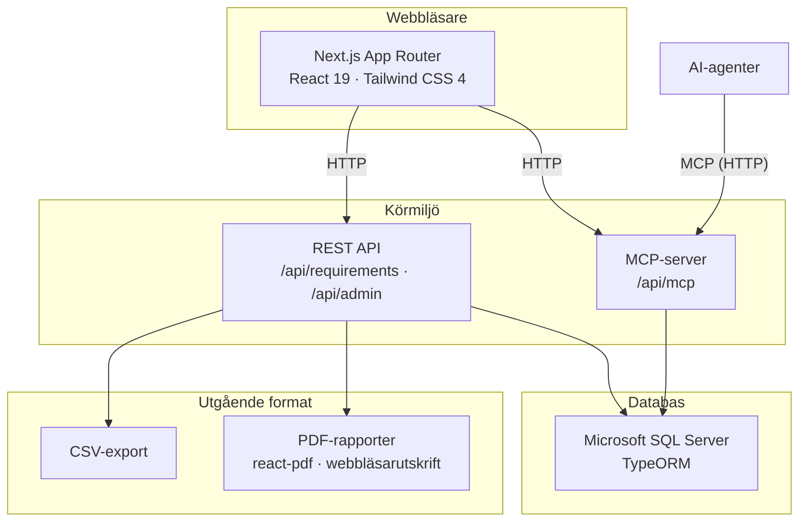
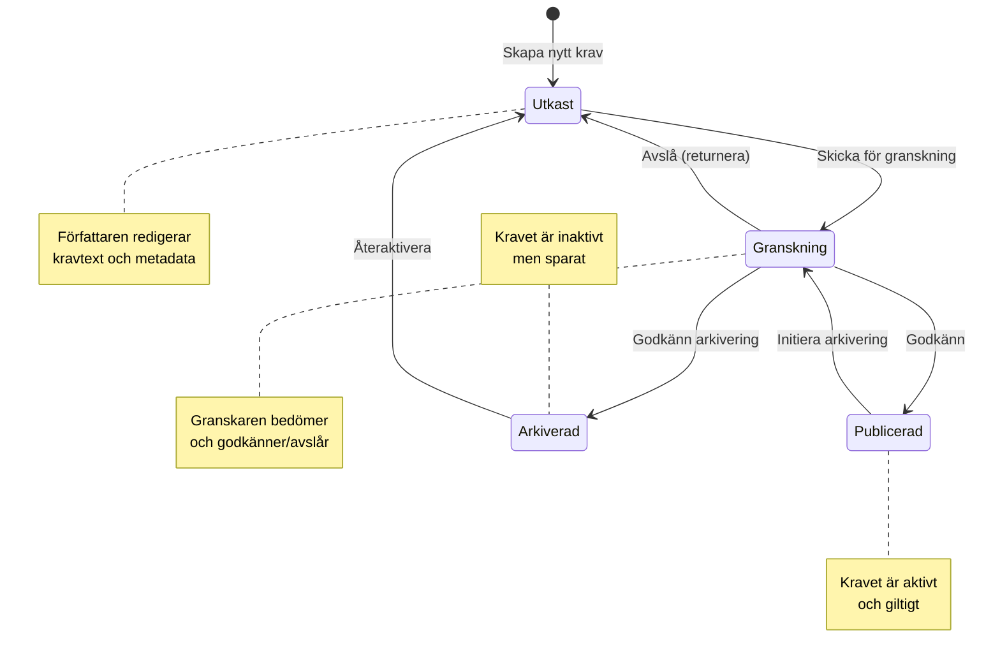
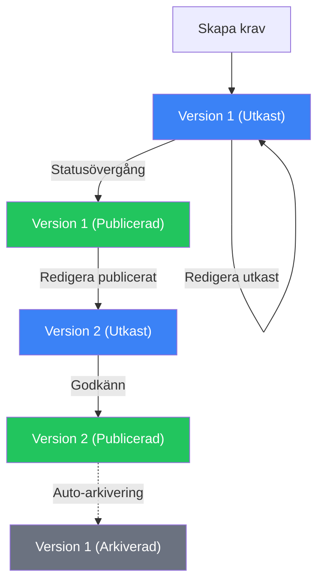
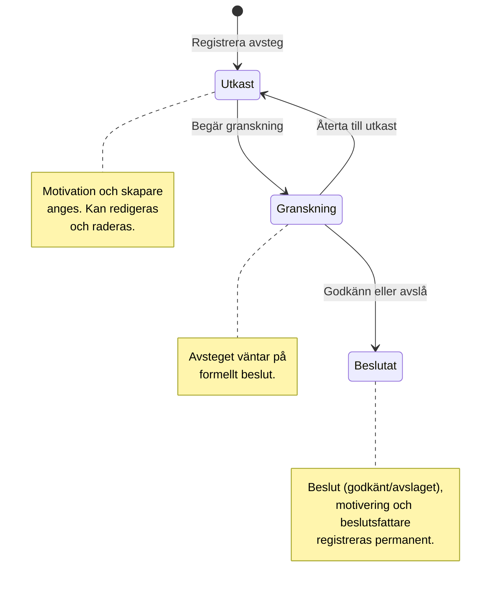
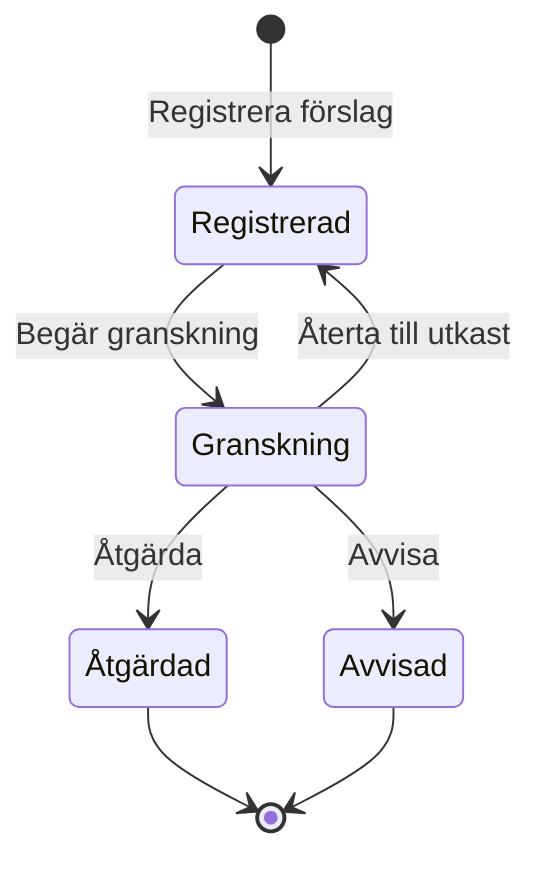

# Arkitekturbeskrivning — Kravhantering

<!-- markdownlint-disable MD013 -->
<!-- cSpell:words Archi applikationskomponenter applikationskod applikationssamband applikationsstruktur applikationstjänster Affärslogiklager Avsteghantering avsteghistorik avstegsstatus batchoperationer behörighetskontroll beslutsfattare Beslutsfattande datan Dataåtkomstlager detaljvy detaljvyn detaljvyer Enkelkolumnssortering Feedbackhantering feedbackhistorik feedbackstatus Flerkravsrapport Förbättringsförslag förbättringsförslag Förbättringsförslagen granskningsrapport helsidevy historiksektion Huvudvyn infrastrukturanvändning informationsklassning infrastrukturarkitekt Kalkylbladsliknande kantterminering kodtäckning Kolumnbreddsjustering kombinerad kravförfattare Kravdata Kravfrågor kravinnehåll Kravlistrapport Kravlivscykel Kravlivscykeln kravmetadata kravnamn kravpakethantering kravpost kravposter kravpostens kravrelaterade livscykeldatum livscykelhantering Läsåtkomst Navigeringsnav ordnivådifferenser Paketvyn Parameteriserade parameteriserade Pluggbart rapportgenerering referensdatahantering referensdatasidor säkerhetsrubrik statusövergång statusövergångar säkerhetsperspektiv terminologihantering tillståndsmaskin trestegsmodell tvåstegs -->
<!-- markdownlint-enable MD013 -->

## Inledning

Denna arkitekturbeskrivning dokumenterar lösningen
**Kravhantering** — ett digitalt system för hantering av
tekniska krav med versionering, livscykelhantering och
tvåspråkigt stöd (svenska och engelska).

Dokumentet följer mallen för
arkitekturbeskrivningar och täcker de perspektiv som är
relevanta för lösningens nuvarande utformning. Varje
perspektiv riktar sig till de intressenter som anges i
respektive avsnitt.

> Migreringsstatus: den godkända målarkitekturen är nu
> **Microsoft SQL Server + TypeORM**. Se
> [sql-server-developer-workflow.md](./sql-server-developer-workflow.md)
> för utvecklingsflödet och
> [database-schema.md](./database-schema.md) för schemat.

**Konventioner:**

- Tekniska produktnamn (Next.js, Microsoft SQL Server, TypeORM
  etc.) skrivs på engelska enligt branschstandard.
- Mermaid-diagram renderas i GitHub-markdown.
- ArchiMate-modeller presenteras i ASCII-notation och
  är avsedda att ersättas med verktygsexport.

---

## 1. Översiktsperspektiv

<!-- markdownlint-disable MD013 -->
**Intressenter:** Arkitekturledningen · verksamhetsarkitekt · huvudarkitekt · förvaltningsledare · projektledare
<!-- markdownlint-enable MD013 -->

### Sammanfattning

Kravhantering är en webbapplikation som ger
organisationen ett gemensamt verktyg för att skapa,
granska, publicera och arkivera tekniska krav. Systemet
är tillgängligt via `kravhantering.{foretag}.se` och
stödjer två språk (svenska och engelska) genomgående —
både i användargränssnittet och i den underliggande
datan.

Lösningen är uppbyggd i fyra huvudlager som samverkar
för att leverera funktionaliteten:



### Nyckelkomponenter

<!-- markdownlint-disable MD013 -->
| Lager | Teknik | Syfte |
| --- | --- | --- |
| Användargränssnitt | Next.js 16, React 19, Tailwind CSS 4 | Tvåspråkig webbapplikation med App Router |
| API-lager | REST-ändpunkter, MCP-server | CRUD, livscykelövergångar, AI-integration |
| Databas | Microsoft SQL Server via TypeORM | Kravdata, versionshistorik, taxonomi |
| Infrastruktur | Node.js-container, ingress/reverse proxy eller annan lastbalanserare och separat databastjänst | Lokal utveckling, CI och framtida OpenShift-drift |
<!-- markdownlint-enable MD013 -->

> **Notera:** Lösningen använder en plattformsneutral Next.js- och
> SQL Server-arkitektur. Lokal utveckling och CI kör appen mot en separat
> SQL Server-container, och samma runtime-kontrakt kan översättas till
> OpenShift med separata containrar för applikation och databas.

### ArchiMate — Översikt (ASCII)

<!-- Replace with ArchiMate tool export -->

```text
┌─────────────────────────────────────────────────────────┐
│                   << Motivation >>                      │
│  Mål: Enhetlig kravhantering med full spårbarhet        │
│  Intressenter: Kravförfattare, Granskare, Förvaltare    │
└─────────────────────────────────────────────────────────┘
         │ realiseras av
         ▼
┌─────────────────────────────────────────────────────────┐
│              << Business Layer >>                       │
│                                                         │
│  [Business Process]     [Business Process]              │
│   Kravlivscykel          Kravpakethantering             │
│                                                         │
│  [Business Process]     [Business Process]              │
│   Avsteghantering        Rapportgenerering              │
│                                                         │
│  [Business Actor]       [Business Actor]                │
│   Kravförfattare         Granskare                      │
│   Förvaltare             Administratör                  │
└─────────────────────────────────────────────────────────┘
         │ stöds av
         ▼
┌─────────────────────────────────────────────────────────┐
│             << Application Layer >>                     │
│                                                         │
│  [Application Service]        [Application Service]     │
│   Kravkatalog (UI)             REST API                 │
│                                                         │
│  [Application Service]        [Application Service]     │
│   MCP-server (AI)              Auth/OIDC-integration    │
│                                                         │
│  [Application Service]        [External Application     │
│   Rapportmotor                 Service]                 │
│                                OIDC-identitetstjänst    │
│                                                         │
│  [Application Component]                                │
│   RequirementsService (lib/requirements/service.ts)     │
│   Data Access Layer (lib/dal/)                          │
└─────────────────────────────────────────────────────────┘
         │ driftas på
         ▼
┌─────────────────────────────────────────────────────────┐
│             << Technology Layer >>                      │
│                                                         │
│  [Technology Service]    [Technology Service]           │
│   Node.js-container       SQL Server DB-tjänst          │
│                                                         │
│  [Technology Service]    [Technology Service]           │
│   Ingress / reverse       Driftplattform                │
│   proxy och              (OpenShift-kompatibel)         │
│   lastbalanserare                                       │
└─────────────────────────────────────────────────────────┘
```

---

## 2. Verksamhetsprocessperspektiv

<!-- markdownlint-disable MD013 -->
**Intressenter:** Arkitekturledningen · verksamhetsarkitekt · huvudarkitekt · förvaltningsledare
<!-- markdownlint-enable MD013 -->

### Kravlivscykeln

Den centrala verksamhetsprocessen är kravets livscykel
— från utkast till arkivering. Processen följer en
tillståndsmaskin med fyra statusar och definierade
övergångar:



### Tvåstegs arkivering

Arkivering av publicerade krav sker i två steg för
att säkerställa kvalitetskontroll:

1. **Initiering** — En förvaltare begär arkivering.
   Kravet övergår till granskning med en
   arkiveringsflagga (`archive_initiated_at`).
2. **Godkännande** — En granskare bekräftar
   arkiveringen. Kravet får status *Arkiverad* och
   tidsstämpeln `archived_at` sätts.

Arkiveringen kan avbrytas innan godkännande genom att
returnera kravet till *Publicerad*.

### Versionshantering

Varje krav har en stabil identitet (`unique_id`, t.ex.
`INT0001`) och en serie versioner som bildar en
fullständig revisionshistorik:



**Nyckelprinciper:**

- Redigering av ett utkast uppdaterar befintlig version
  (ingen ny rad skapas).
- Redigering av publicerat krav skapar en ny
  utkastversion.
- Statusövergångar ändrar befintlig rad — de skapar
  aldrig nya versioner.
- Vid publicering av ny version arkiveras den
  föregående publicerade versionen automatiskt.

### Aktörer och roller

<!-- markdownlint-disable MD013 -->
| Aktör | Huvudansvar |
| --- | --- |
| Kravförfattare | Skapar och redigerar krav, skickar för granskning |
| Granskare | Godkänner eller avslår krav och arkiveringsförfrågningar |
| Förvaltare | Hanterar livscykel, initierar arkivering, återaktiverar |
| Administratör | Konfigurerar taxonomi, terminologi, kolumnstandard |
<!-- markdownlint-enable MD013 -->

### Kravpakethantering

Kravpaket samlar ett urval av krav för en viss
användning — t.ex. en upphandling, ett projekt
eller en förvaltningsperiod. Processen omfattar:

1. **Skapa paket** — Namn, beskrivning och slug
   (URL-vänligt ID) anges.
2. **Lägga till kravposter** — Krav läggs till i
   paketet med en specifik kravversion.
   Varje post får automatiskt statusen
   *Inkluderad* (`Included`).
3. **Statushantering per post** — Varje kravpost
   i paketet har en egen användningsstatus.
   Tillgängliga statusar hanteras i
   uppslagstabellen `package_item_statuses`.
4. **Spåra avsteg** — Om ett krav inte kan uppfyllas
   helt kan ett avsteg registreras (se
   *Avsteghantering* nedan).

### Avsteghantering

Avsteg (deviations) dokumenterar och beslutar om
undantag från enskilda krav i ett kravpaket.
Processen följer en trestegsmodell:



**Steg i detalj:**

1. **Utkast** — Författaren registrerar ett avsteg
   med motivering och valfri skapare. Avsteget kan
   redigeras och raderas i detta steg.
2. **Begärd granskning** — Avsteget skickas för
   beslut. Det kan återtas till utkast om
   komplettering behövs.
3. **Beslutat** — Granskaren godkänner eller avslår
   avsteget. Beslutsmotivering, beslutsfattare och
   tidsstämpel registreras. Beslutet är permanent.

Ett godkänt avsteg möjliggör att kravpostens
användningsstatus ändras till *Avviken*
(`Deviated`). Ett avslaget avsteg lämnar posten
i befintlig status.

### Förbättringsförslag

Förbättringsförslag (ändringsförslag, synpunkter) kopplas till ett
krav och följer en egen livscykel.



**Steg i detalj:**

1. **Registrerad (utkast)** — Förslaget registreras med
   fritext. Det kan redigeras och raderas.
2. **Granskning begärd** — Förslaget skickas för
   bedömning. Det kan återtas till utkast.
3. **Åtgärdad/Avvisad** — Granskaren åtgärdar eller
   avvisar förslaget med motivering.

### Rapportprocesser

Systemet stödjer fyra rapporttyper som stöder
gransknings- och beslutsprocesserna:

1. **Historikrapport** — Tidslinje över alla versioner
   av ett krav.
2. **Granskningsrapport** — Jämförelse mellan
   basversion och granskningsversion med
   ordnivådifferenser.
3. **Kravlistrapport** — Tabellrapport över filtrerade
   krav.
4. **Kombinerad granskningsrapport** — Flerkravsrapport
   med innehållsförteckning och sidnumrering.

### ArchiMate — Verksamhetsprocess (ASCII)

<!-- Replace with ArchiMate tool export -->

```text
┌──────────────────────────────────────────────────────────┐
│            << Business Process: Kravlivscykel >>         │
│                                                          │
│  ┌──────────┐    ┌───────────┐    ┌───────────────┐      │
│  │ Författa │───>│  Granska  │───>│  Publicera    │      │
│  │  krav    │    │  krav     │    │  krav         │      │
│  └──────────┘    └───────────┘    └───────────────┘      │
│       │               │ avslå           │                │
│       │<──────────────┘                 │                │
│       │                                 ▼                │
│       │                          ┌──────────────┐        │
│       │                          │  Arkivera    │        │
│       │                          │  krav        │        │
│       │                          └──────────────┘        │
│       │                                 │                │
│       │<────────────────────────────────┘ återaktivera   │
└──────────────────────────────────────────────────────────┘
         │              │              │            │
   [Assigned to]  [Assigned to]  [Assigned to]  [Assigned]
         ▼              ▼              ▼            ▼
  ┌────────────┐ ┌───────────┐ ┌────────────┐ ┌─────────┐
  │ Författare │ │ Granskare │ │ Förvaltare │ │  Admin  │
  │ (Author)   │ │ (Reviewer)│ │ (Manager)  │ │         │
  └────────────┘ └───────────┘ └────────────┘ └─────────┘
```

---

## 3. Applikationsanvändningsperspektiv

<!-- markdownlint-disable MD013 -->
**Intressenter:** Arkitekturledningen · verksamhetsarkitekt · huvudarkitekt · lösningsarkitekt · mjukvaruarkitekt · driftorganisation
<!-- markdownlint-enable MD013 -->

### Hur applikationen används

Kravhantering nås via webbläsare och presenterar
kravkatalogen som primär arbetsyta. Nedan beskrivs de
huvudsakliga användningsmönstren.

### Kravkatalogen — listvyn

Huvudvyn (`/requirements`) visar samtliga krav i en
tabellvy med:

- **Kolumnhantering** — Administratörer anger
  organisationsstandard för vilka kolumner som visas
  och deras ordning. Användare kan anpassa lokalt via
  webbläsarens lagring.
- **Filtrering** — Kravområde, kategori, typ,
  kvalitetskaraktäristik, status, scenario och
  testflagga.
- **Sortering** — Enkelkolumnssortering med
  klick-baserad växling (stigande/fallande).
- **Kolumnbreddsjustering** — Kalkylbladsliknande
  dra-och-släpp med tangentbordsstöd.
- **Radval** — Kryssrutor för batchoperationer
  (t.ex. kombinerad granskningsrapport).

### Detaljvyn

Klick på en rad expanderar en inline-detaljpanel som
visar kravtext, acceptanskriterier, område med ägare,
referenser och scenarier. Alternativt öppnas en
helsidevy (`/requirements/[id]`).

Från detaljvyn kan användaren:

- Utföra statusövergångar via knappar
- Redigera krav (skapar ny version om publicerat)
- Generera och ladda ner rapporter (PDF eller utskrift)
- Visa versionshistorik i sidopanel

### Paketvyn

Kravpaket nås via `/requirement-packages/[slug]`
och visar samtliga kravposter i paketet med:

- **Postöversikt** — Tabell med kravnamn,
  kravversion, risknivå och användningsstatus.
- **Statushantering** — Varje kravpost har en
  egen status (t.ex. *Inkluderad* eller
  *Avviken*) som kan ändras direkt i vyn.
- **Avsteghantering** — Från en kravpost kan
  användaren registrera, redigera och begära
  granskning av avsteg. En stepper-komponent
  (`DeviationStepper`) visar avstegsstatus
  grafiskt (Utkast → Begärd granskning →
  Beslutat). Beslutsfattande sker via en
  dedikerad dialog (`DeviationDecisionModal`).
- **Avsteghistorik** — Alla avsteg för en
  kravpost visas med senaste avsteget
  framhävt och äldre i en expanderbar
  historiksektion (`DeviationPill`).

### Administrationscenter

Administrationscentret (`/admin`) erbjuder tre flikar:

1. **Terminologi** — Hantera visningsnamn för
   kravrelaterade begrepp (singular, plural, bestämd
   plural) på svenska och engelska.
2. **Kolumner** — Ange standardkolumner och ordning
   för kravlistan organisationsövergripande.
3. **Referensdata** — Navigeringsnav till alla
   referensdatasidor (områden, typer, kategorier,
   kvalitetskaraktäristiker, statusar, scenarier,
   paket).

### Export och rapporter

- **CSV-export** — Filtrerade kravlistor exporteras
  som CSV via `format=csv` på API:et.
- **PDF-rapporter** — Genereras på klientsidan via
  `@react-pdf/renderer` (automatisk nedladdning) eller
  via webbläsarens utskriftsfunktion (HTML/CSS med
  `@media print`).

### Språkväxling

Språkval (svenska/engelska) påverkar hela
applikationen: navigation, etiketter, kravmetadata
i listor och detaljvyer, rapportrubriker och
CSV-kolumnnamn. Språket styrs via URL-prefix
(`/sv/...` eller `/en/...`) och next-intl-middleware.

---

## 4. Applikationssambandsperspektiv

<!-- markdownlint-disable MD013 -->
**Intressenter:** Arkitekturledningen · verksamhetsarkitekt · huvudarkitekt · lösningsarkitekt · mjukvaruarkitekt · driftorganisation
<!-- markdownlint-enable MD013 -->

### Informationsflöden

Applikationen erbjuder tre huvudsakliga gränssnitt för
informationsutbyte samt en teknisk
identitetsintegration:

<!-- markdownlint-disable MD013 -->
| Gränssnitt | Protokoll | Konsument | Syfte |
| --- | --- | --- | --- |
| REST API | HTTP/JSON | Webbapplikation | CRUD, filtrering, statusövergångar |
| MCP-server | HTTP/JSON (Streamable) | AI-agenter | Kravfrågor, mutation, statusövergångar |
| Export | CSV, PDF | Slutanvändare | Rapporter och datautbyte |
| OIDC-integration | HTTPS / OIDC | Extern identitetsleverantör | Inloggning, tokenutbyte, JWKS, utloggning |
<!-- markdownlint-enable MD013 -->

### MCP-integration (AI-agenter)

MCP-servern (`/api/mcp`) exponerar fyra verktyg som
gör det möjligt för AI-agenter att interagera med
kravkatalogen:

1. `requirements_query_catalog` — Lista krav eller
   uppslagstabeller.
2. `requirements_get_requirement` — Hämta detalj,
   specifik version eller fullständig historik.
3. `requirements_manage_requirement` — Skapa,
   redigera, arkivera, radera utkast, återställ.
4. `requirements_transition_requirement` —
   Statusövergångar.

MCP-servern och REST API:et delar samma
`RequirementsService`-lager (`lib/requirements/`)
vilket säkerställer konsekvent affärslogik oavsett
åtkomstkälla.

### OIDC-integration (identitet)

När autentisering är aktiv använder applikationen en
OIDC-kompatibel identitetsleverantör för två tekniska
flöden:

1. **Webbflöde** — `/api/auth/login` och
   `/api/auth/callback` använder Authorization Code +
   PKCE via `openid-client` för discovery, tokenutbyte
   och OIDC-validering.
2. **MCP-flöde** — `/api/mcp` tar emot Bearer-token,
   verifierar JWT mot leverantörens JWKS och kopplar en
   verifierad aktör till förfrågan innan affärslogiken
   anropas.

Detta är en extern teknik- och säkerhetsintegration,
men inte en verksamhetsintegration: kravdata och
historik lagras fortsatt enbart i applikationens egen
SQL Server-databas.

### Nuvarande integrationslandskap

I nuläget har systemet **inga externa
verksamhetsintegrationer**. All kravdata, historik och
referensdata hanteras inom applikationens egen databas.
Den enda externa tekniska integrationen är den
OIDC-baserade identitetsleverantören för inloggning,
tokenutbyte, nyckelhämtning och utloggning. Nedan
beskrivs de interna applikationssambanden:

### ArchiMate — Applikationssamband (ASCII)

<!-- Replace with ArchiMate tool export -->

```text
┌─────────────────────────────────────────────────────────────────────────────┐
│               << Application Cooperation Viewpoint >>                       │
│                                                                             │
│  ┌────────────┐   HTTPS   ┌────────────────────────────────┐                │
│  │ Webbläsare │──────────>│ Next.js App Router (UI + API)  │                │
│  │ (Användare)│           │ /[locale]/... + /api/auth/*    │                │
│  └─────┬──────┘           └──────────┬─────┬───────────────┘                │
│        │ auth request/response       │     │ tokenutbyte, JWKS, logout      │
│        │                             │     │                                │
│        ▼                             │     ▼                                │
│  ┌───────────────────────────────────┴───────────────────────────────┐      │
│  │ << External Application Service >>                                │      │
│  │ OIDC-identitetsleverantör                                         │      │
│  └───────────────────────────────────▲───────────────────────────────┘      │
│                                      │                                      │
│  ┌────────────┐   HTTP    ┌──────────┴──┐                                   │
│  │ AI-agenter │──────────>│ MCP-server  │  JWKS/key retrieval               │
│  │ (MCP-      │           │ /api/mcp    │  för JWT-verifiering              │
│  │  klienter) │           └──────┬──────┘                                   │
│  └────────────┘                  │                                          │
│                                  ▼                                          │
│                      ┌──────────────────────────┐                           │
│                      │   RequirementsService    │                           │
│                      │   (Gemensam affärslogik) │                           │
│                      └───────────┬──────────────┘                           │
│                                  │                                          │
│                      ┌───────────▼────────────┐                             │
│                      │   Data Access Layer    │                             │
│                      │   (lib/dal/)           │                             │
│                      └───────────┬────────────┘                             │
│                                  │                                          │
│                      ┌───────────▼────────────┐                             │
│                      │   SQL Server DB-tjänst │                             │
│                      │   (mssql container)    │                             │
│                      └────────────────────────┘                             │
│                                                                             │
│  << Application Interfaces >>                                               │
│  ┌───────────┐  ┌──────────┐  ┌──────────────────────────┐                  │
│  │ JSON/REST │  │ CSV      │  │ PDF (react-pdf / print)  │                  │
│  └───────────┘  └──────────┘  └──────────────────────────┘                  │
└─────────────────────────────────────────────────────────────────────────────┘
```

Diagrammet markerar OIDC som en extern integration.
Webbläsaren initierar autentiseringsbegäran och tar emot
svaret via applikationens callback, medan applikationsgränsen
ansvarar för tokenutbyte, JWKS-/nyckelhämtning och logout mot
identitetsleverantören.

---

## 5. Applikationsstrukturperspektiv

<!-- markdownlint-disable MD013 -->
**Intressenter:** Mjukvaruarkitekt · mjukvaruutveckling
<!-- markdownlint-enable MD013 -->

### Katalogstruktur

Applikationen följer Next.js 16 App Router-konventionen
med locale-baserad routing:

```text
app/
  [locale]/
    requirements/         Kravlista och detaljvy
      [id]/              Enskilt krav
      reports/           Rapportrendering (print/pdf)
    admin/               Administrationscenter
    requirement-areas/         Områdeshantering (CRUD)
    requirement-packages/           Pakethantering
    usage-scenarios/       Scenariohantering
    requirement-statuses/        Statushantering
    requirement-types/           Typhantering
    quality-characteristics/  Kvalitetskaraktäristiker
  api/
    auth/                Auth-endpoints för inloggning, återanrop, logout, me
    requirements/        REST-ändpunkter
    admin/               Admin-API
    mcp/                 MCP-server
components/              Delade React-komponenter
lib/
  auth/                  OIDC, session, tokenvalidering, CSRF, audit
  dal/                   Data Access Layer
  requirements/          Affärslogik (service, auth, errors)
  mcp/                   MCP-serverkonfiguration
  reports/               Rapportmallar och datahämtning
lib/typeorm/entities/    Databasschema (TypeORM-entiteter)
typeorm/
  migrations/            TypeORM-migreringar
  seed.mjs               Testdata
  migrations/            SQL-migreringar
messages/
  en.json                Engelska översättningar
  sv.json                Svenska översättningar
```

### Skiktad arkitektur

Applikationen implementerar ett tydligt skiktat
mönster:

1. **Presentationslager** — React-komponenter
   (`components/`) och sidokomponenter (`app/`).
2. **Autentiserings- och säkerhetslager** —
   `proxy.ts`, `app/api/auth/*`, `lib/auth/*` och
   auth-delen av `app/api/mcp/route.ts` hanterar
   inloggning, sessioner, tokenvalidering, CSRF och
   säkerhetsloggning.
3. **Affärslogiklager** — `RequirementsService`
   (`lib/requirements/service.ts`) som exponerar
   fyra huvudoperationer: `queryCatalog`,
   `getRequirement`, `manageRequirement` och
   `transitionRequirement`.
4. **Dataåtkomstlager** — DAL-moduler i `lib/dal/`
   med en modul per databastabell (t.ex.
   `requirements.ts`, `owners.ts`,
   `requirement-areas.ts`).
5. **Databaslager** — TypeORM-entiteter under
   `lib/typeorm/entities/` med 15+ tabeller och
   explicita relationer.

### Datamodell — kärnrelationer

```mermaid
erDiagram
    requirements ||--o{ requirement_versions : "har versioner"
    requirements }o--|| requirement_areas : "tillhör område"
    requirement_versions }o--|| requirement_statuses : "har status"
    requirement_versions }o--o| requirement_categories : "klassificerad som"
    requirement_versions }o--o| requirement_types : "av typ"
    requirement_versions }o--o| quality_characteristics : "kvalitetskaraktäristik"
    requirement_versions }o--o| risk_levels : "risknivå"
    requirement_versions ||--o{ requirement_version_usage_scenarios : "kopplade scenarier"
    requirement_version_usage_scenarios }o--|| usage_scenarios : "refererar scenario"
    requirement_versions ||--o{ requirement_version_norm_references : "kopplade normreferenser"
    requirement_version_norm_references }o--|| norm_references : "refererar normreferens"
    requirement_areas }o--|| owners : "ägs av"
    usage_scenarios }o--o| owners : "ägs av"
    quality_characteristics }o--o| quality_characteristics : "förälder"
    quality_characteristics }o--|| requirement_types : "kopplad till typ"
    requirement_packages ||--o{ requirement_package_items : "innehåller"
    requirement_packages ||--o{ package_local_requirements : "innehåller pakets unika krav"
    requirement_package_items }o--|| requirements : "pekar på krav"
    requirement_package_items }o--o| package_item_statuses : "användningsstatus"
    requirement_package_items ||--o{ deviations : "har avsteg"
    package_local_requirements }o--|| requirement_areas : "klassificerat i område"
    package_local_requirements }o--o| requirement_categories : "klassificerat som"
    package_local_requirements }o--o| requirement_types : "av typ"
    package_local_requirements }o--o| quality_characteristics : "kvalitetskaraktäristik"
    package_local_requirements }o--o| risk_levels : "risknivå"
    package_local_requirements }o--o| package_item_statuses : "användningsstatus"
    package_local_requirements }o--o| package_needs_references : "behovsreferens"
    package_local_requirements ||--o{ package_local_requirement_usage_scenarios : "kopplade scenarier"
    package_local_requirement_usage_scenarios }o--|| usage_scenarios : "refererar scenario"
    package_local_requirements ||--o{ package_local_requirement_norm_references : "kopplade normreferenser"
    package_local_requirement_norm_references }o--|| norm_references : "refererar normreferens"
    package_local_requirements ||--o{ package_local_requirement_deviations : "har avsteg"
    requirements ||--o{ improvement_suggestions : "har förbättringsförslag"
```

<!-- markdownlint-disable MD013 -->



<!-- markdownlint-enable MD013 -->

> **Tillämpningsbarhet via användningsscenarier.**
> Tabellen `usage_scenarios` hanterar även
> *tillämpningsbarhet* — d.v.s. i vilka kontexter
> eller miljöer ett krav gäller (t.ex. "Alla system").

### Taxonomi och tvåspråkig design

Alla uppslagstabeller (kategorier, typer, statusar,
scenarier, kvalitetskaraktäristiker) lagrar
användarsynliga texter i separata kolumner per språk:
`name_sv` och `name_en`. Applikationen väljer rätt
kolumn baserat på aktivt locale vid frågetillfället.

Kvalitetskaraktäristikerna följer ISO/IEC 25010:2023
med 48 poster i en hierarkisk trädstruktur
(förälder-barn-relationer).

### Effektiv status (beräknas vid fråga)

Eftersom ett krav kan ha flera versioner i olika
statusar beräknas en *effektiv status* vid
listningsfrågor enligt prioritetsordning:
Publicerad > Arkiverad > Granskning > Utkast.

---

## 6. Infrastrukturanvändningsperspektiv

<!-- markdownlint-disable MD013 -->
**Intressenter:** Lösningsarkitekt · infrastrukturarkitekt · driftorganisation
<!-- markdownlint-enable MD013 -->

### Driftplattform

Kravhantering använder nu en **självhostad Next.js-runtime** med ett tydligt
miljövariabelkontrakt för databasåtkomst. Lokal utveckling och CI kör appen
mot en separat SQL Server-container, och målbilden för produktion är en
containerbaserad deployment på **OpenShift**.

> **Plattformsoberoende:** Applikationen bygger på Next.js, Microsoft SQL
> Server och TypeORM. Det gör att samma affärslogik kan köras lokalt, i CI
> och senare i OpenShift så länge runtime-miljön levererar en Node.js-process
> och ett
> `DATABASE_URL` till en kompatibel databastjänst.

<!-- markdownlint-disable MD013 -->
| Tjänst | Användning |
| --- | --- |
| Next.js app-container | Kör webbapplikationen via `next dev` eller `next start` |
| SQL Server DB-tjänst | Microsoft SQL Server-container för dev/CI |
| Ingress / reverse proxy eller lastbalanserare | Exponerar appen, terminerar TLS, kan fördela trafik mellan instanser utan sticky-session och bevarar host/proto för publika auth-flöden |
<!-- markdownlint-enable MD013 -->

### Byggkedja

Next.js-applikationen byggs och körs nu med den inbyggda Node-runtimekedjan.
Det finns ingen plattformsspecifik adapter i byggflödet.

```text
Källkod
  │
  ▼
Next.js build (NODE_ENV=production)
  │
  ▼
Node.js runtime (`next start`)
  │
  ├── Next.js serverfunktioner
  └── Statiska filer från `.next/`
  │
  ▼
Container deployment / ingress
```

### Konfiguration

- **Databaskontrakt:** `DATABASE_URL`
- **Node-runtime:** 24.x
- **Lokal databastjänst:** `http://db:9000` i devcontainer eller
  `http://127.0.0.1:9000` lokalt
- **Anpassad domän:** `kravhantering.{foretag}.se`
- **Autentiseringskontrakt:** OIDC-issuer, klient-id,
  klienthemlighet, redirect-URI, post-logout-URI,
  sessionslösenord och proxytillit när autentisering
  är aktiv
- **Observerbarhet:** Plattformens loggning och containertelemetri

### Miljöbindningar

<!-- markdownlint-disable MD013 -->
| Bindning | Typ | Beskrivning |
| --- | --- | --- |
| `DATABASE_URL` | URL / anslutningssträng | SQL Server-anslutningssträng (mssql://) |
| `NEXT_SERVER_ACTIONS_ENCRYPTION_KEY` | Sträng | Nyckel för server actions i flerinstansmiljöer |
| `AUTH_*`, `NEXT_PUBLIC_AUTH_ENABLED` | Miljövariabler | OIDC-, sessions- och proxykontrakt för integrerad autentisering |
| `OPENROUTER_API_KEY` | Sträng | AI-integration för kravgenerering |
<!-- markdownlint-enable MD013 -->

---

## 7. Identitets- och behörighetshanteringsperspektiv

<!-- markdownlint-disable MD013 -->
**Intressenter:** Lösningsarkitekt · infrastrukturarkitekt · driftorganisation
<!-- markdownlint-enable MD013 -->

### Nuläge

Nuvarande version har **integrerad autentisering**, men
behörighetsstyrningen i affärslagret är ännu inte fullt
ut finfördelad.

Autentiseringsmodellen består av två separata vägar:

- **Webbgränssnitt** — `/api/auth/login`,
  `/api/auth/callback`, `/api/auth/logout` och
  `/api/auth/me` använder OIDC Authorization Code +
  PKCE. `lib/auth/oidc.ts` och `app/api/auth/*`
  ansvarar för discovery, tokenutbyte och
  sessionsetablering.
- **MCP-gränssnitt** — `/api/mcp` kräver Bearer-token
  när autentisering är aktiv. `lib/auth/mcp-token.ts`
  verifierar signatur, issuer, audience och
  `employeeHsaId` innan en verifierad aktör kopplas
  till förfrågan.

Sessionsmodellen är stateless:

- en kortlivad `login-state`-cookie bär
  PKCE-verifierare, `state`, `nonce` och `returnTo`
- en krypterad `iron-session`-cookie bär verifierad
  användaridentitet, roller och sessionens
  utgångstid

Identitetsmodellen i applikationen utgår från:

- **`sub`** — stabil identitet från leverantören
- **`employeeHsaId`** — verksamhetsnära identitetsnyckel
  som krävs i både webb- och MCP-flöden
- **`roles`** — globala IdP-roller. Nuvarande
  autentiseringskontrakt normaliserar `roles` till
  `Reviewer` och `Admin`. Detta är en avsiktlig
  förenkling av den tekniska rolluppgiften, men inte en
  permanent förenkling av målmodellen. Målmodellen
  innehåller `Author`, `Reviewer`, `Manager` och `Admin`:
  `Reviewer` och `Admin` bevaras som globala roller,
  `Author` ska härledas från uppdrag som ägare eller
  medförfattare via `employeeHsaId`, och `Manager`
  motsvaras i nuläget inte av en egen `roles`-post utan
  tappar sin separata funktionsavgränsning tills
  policybaserad auktorisering införs.

Arkitekturen använder följande utvidgningspunkter i
`lib/requirements/auth.ts`:

- **`ActorContext`** — modell för aktörens identitet,
  autentiseringsstatus, roller och källa
- **`RequestContext`** — omsluter aktör,
  förfrågnings-ID, källa (REST/MCP) och verktygsnamn
- **`AuthorizationService`** — pluggbart gränssnitt för
  att validera åtgärder
- **`RequirementsAction`** — typad åtgärdsmodell för
  operationerna i affärslagret

Det är dock viktigt att skilja på autentisering och
auktorisering: `createDefaultAuthorizationService()`
returnerar fortfarande `AllowAllAuthorizationService`,
vilket innebär att verifierad identitet finns men att
domänspecifik skrivbehörighet ännu inte begränsas fullt
ut i tjänstelagret.

### Befintliga säkerhetsmekanismer

- **OIDC-skydd i webbflödet** — PKCE, `state` och
  `nonce` används i inloggningsflödet. Återanrop
  kräver dessutom `sub`, `given_name`,
  `family_name` och `employeeHsaId` innan session
  skapas.
- **MCP-tokenvalidering** — `/api/mcp` kräver
  Bearer-token och JWT verifieras mot leverantörens
  JWKS innan MCP-anrop tillåts.
- **Content Security Policy (CSP)** — Varje förfrågan
  genererar ett unikt nonce (16 slumpmässiga bytes,
  base64-kodat) för inline-skript. Produktions-CSP
  kräver nonce för alla skript.
- **Proxy** — `proxy.ts` hanterar CSP och
  i18n-routing, omdirigering till inloggning för
  webbförfrågningar, `401` för otillåtna API-anrop och
  borttagning av äldre `x-user-*`-headers när
  autentisering är aktiv.

### Mållägesriktning för behörighetsstyrning

Nuvarande arkitektur har lagt grunden för en striktare
behörighetsmodell genom att identitet, roller,
förfrågningskontext och säkerhetsloggning redan är på
plats. Nästa arkitekturella steg är att ersätta
`AllowAllAuthorizationService` med policybaserad
behörighetsstyrning i affärslagret.

Övergripande riktning:

- **Snäva globala roller** — globala roller bör hållas
  få och användas för tvärgående ansvar, till exempel
  granskning eller administration.
- **Resursnära skrivbehörighet** — rätt att skapa och
  ändra krav bör kopplas till verifierad identitet och
  verksamhetsnära tilldelning, inte enbart till breda
  globala roller.
- **Gemensam policy för REST och MCP** — samma
  `RequirementsService` och `RequestContext` ska bära
  behörighetsbeslut oavsett om anropet kommer från
  webbläsare eller MCP-klient.
- **Spårbarhet** — säkerhetsrelaterade händelser är
  redan separerade i ett eget JSON-baserat auditflöde,
  vilket skapar en naturlig grund för central
  övervakning och uppföljning i produktion.

---

## 8. Utvecklings- och testperspektiv

<!-- markdownlint-disable MD013 -->
**Intressenter:** Lösningsarkitekt · mjukvaruarkitekt · mjukvaruutvecklare · leverantör
<!-- markdownlint-enable MD013 -->

### Utvecklingsmiljö

Utveckling sker i en **Dev Container** baserad på
Ubuntu 24.04 med följande förinstallerade verktyg:

| Verktyg | Version | Användning |
| --- | --- | --- |
| Node.js | 24 | Runtime |
| TypeScript | 5.9 (strict) | Typkontroll |
| Biome | 2.4 | Linting och formatering |
| cSpell | 9.7 | Stavningskontroll (sv + en) |
| dotenv-linter | 4.x | Kontroll av .env-filer |
| markdownlint | — | Markdown-kvalitet |
| Microsoft SQL Server | mssql/server image | Lokal databastjänst |

### Testramverk

<!-- markdownlint-disable MD013 -->
| Ramverk | Typ | Konfiguration |
| --- | --- | --- |
| Vitest 4.1 | Enhetstester, komponenttester | jsdom-miljö, V8-kodtäckning |
| Playwright 1.58 | Integrationstester (E2E) | Chromium, Firefox, WebKit |
| Testing Library | React-komponenttester | `@testing-library/react` |
<!-- markdownlint-enable MD013 -->

### Testkörning

Alla kontroller samlas i ett enda kommando:

```text
npm run check
  ├── type-check      Typkontroll (tsc --noEmit)
  ├── lint:py         Python-typkontroll (Pyright strict)
  ├── dotenv:check    Kontroll av .env-filer
  ├── format:check    Formateringskontroll (Biome)
  ├── spell:check     Stavningskontroll (cSpell)
  ├── lint            Linting (Biome strict)
  ├── lint:md         Markdown-linting
  └── test            Enhetstester (Vitest)
```

Integrationstester körs separat:

```text
npm run test:integration          Mot utvecklingsserver
npm run test:integration:prodlike Mot byggd version
```

### Lokal databashantering

Utvecklare arbetar mot en separat lokal SQL Server-container:

```text
npm run db:up
  └── Starta lokal SQL Server-container

npm run db:setup
  ├── Vänta på databastjänsten
  ├── Rensa befintlig databas
  ├── Applicera migreringar
  └── Tilldela testdata (typeorm/seed.mjs)
```

Testdata innehåller 367 krav fördelade på tio
kravområden med fullständig versionshistorik.

### Kodkvalitetsprinciper

- **TypeScript strict mode** — Inga implicita `any`,
  strikta null-kontroller.
- **Path alias** — `@/*` mappar till projektroten.
- **JUnit-rapporter** — Genereras av både Vitest och
  Playwright för CI-integration.
- **Kodtäckning** — V8-baserad med rapportering i
  text, JSON, HTML, LCOV (Codecov-kompatibel).

---

## 9. Informationssäkerhetsperspektiv

<!-- markdownlint-disable MD013 -->
**Intressenter:** Lösningsarkitekt · infrastrukturarkitekt · driftorganisation
<!-- markdownlint-enable MD013 -->

### ArchiMate — Informationssäkerhet (ASCII)

På hög nivå kan informationssäkerheten i lösningen
ses som ett samspel mellan kantskydd, identitetskontroll,
sessionshantering och spårbar säkerhetsloggning.
Modellen nedan visar kontrollkedjan utan att gå ned i
varje enskild mekanism.

```text
┌──────────────────────────────────────────────────────────────┐
│             << Motivation / Security View >>                 │
│  Mål: Skydda identitet, kravdata och spårbarhet              │
│  Principer: Fail-closed · Begränsad sessionsyta              │
│  Verifierad aktör · Spårbar säkerhetsloggning                │
└──────────────────────────────────────────────────────────────┘
         │ realiseras genom
         ▼
┌──────────────────────────────────────────────────────────────┐
│                  << Business Layer >>                        │
│                                                              │
│  [Business Actor]              [Business Actor]              │
│   Användare                     MCP-klient / AI-agent        │
└──────────────────────────────────────────────────────────────┘
         │ stöds av
         ▼
┌──────────────────────────────────────────────────────────────┐
│                << Application Layer >>                       │
│                                                              │
│  [Application Service]       [Application Service]           │
│   Auth/OIDC-integration       Krav-API / MCP                 │
│                                                              │
│  [Application Service]       [External Application Service]  │
│   Säkerhetsaudit              OIDC-identitetstjänst          │
│                                                              │
│  [Application Component]                                     │
│   proxy.ts + lib/auth/* + RequirementsService                │
└──────────────────────────────────────────────────────────────┘
         │ skyddas av / driftas på
         ▼
┌──────────────────────────────────────────────────────────────┐
│                 << Technology Layer >>                       │
│                                                              │
│  [Technology Service]       [Technology Service]             │
│   Ingress / reverse proxy    Driftplattform / loggning       │
│   med TLS och CSP            och hemlighetshantering         │
│                                                              │
│  [Technology Service]       [Technology Service]             │
│   SQL Server DB-tjänst       Plattformsloggning              │
│   med versionshistorik       (kan vidarebefordra             │
│                              security-audit)                 │
└──────────────────────────────────────────────────────────────┘
```

### Nuvarande säkerhetsåtgärder

Kravhantering implementerar följande
informationssäkerhetsåtgärder i nuvarande version:

#### Skydd mot injektionsattacker

- **Parameteriserade frågor** — TypeORM-repositories och
  QueryBuilder genererar parameteriserade SQL-frågor. Rå
  SQL används endast med bundna parametrar; ingen
  sträng-interpolering av användarinmatning förekommer.
- **Content Security Policy** — Nonce-baserad CSP
  per förfrågan förhindrar obehörig skriptkörning
  (XSS). Produktionsmiljön kräver nonce för alla
  inline-skript.

#### Identitets- och sessionsskydd

- **Integrerad OIDC-autentisering** — Webbflödet
  använder Authorization Code + PKCE via
  `/api/auth/login` och `/api/auth/callback`.
  OIDC-svaret valideras och session skapas först när
  `sub`, `given_name`, `family_name` och
  `employeeHsaId` har verifierats.
- **Stateless sessionsmodell** — En kortlivad
  `login-state`-cookie bär PKCE-verifierare,
  `state`, `nonce` och `returnTo`, medan en separat
  krypterad `iron-session`-cookie bär verifierad
  identitet, roller och utgångstid. Ingen
  serversides sessionslagring krävs.
- **MCP-tokenvalidering** — `/api/mcp` skyddas med
  Bearer-token när autentisering är aktiv. JWT:n
  verifieras mot leverantörens JWKS med kontroll av
  signatur, issuer, audience och `employeeHsaId`
  innan någon verktygskörning tillåts.
- **CSRF-skydd för cookie-baserade mutationer** —
  muterande anrop måste vara same-origin och bära
  `X-Requested-With: XMLHttpRequest`.
- **Header-härdning i proxy** — `proxy.ts` tar bort
  inkommande `x-user-id` och `x-user-roles` när
  autentisering är aktiv, så att äldre header-trust
  inte kan missbrukas.
- **Avvisning av ogiltiga sessioner** — Trasiga eller
  manipulerade sessionscookies leder till att
  förfrågan behandlas som utloggad och loggas som
  `auth.session.rejected`.

#### Datatillgänglighet, spårbarhet och säkerhetsloggning

- **Mjuk radering** — Krav arkiveras med
  `is_archived`-flagga. Ingen data raderas permanent.
- **Fullständig revisionshistorik** — Varje ändring
  av kravinnehåll skapar en ny versionsrad.
  Tidsstämplar spårar skapande (`created_at`),
  redigering (`edited_at`), publicering
  (`published_at`) och arkivering (`archived_at`).
- **Strukturerad loggning** — JSON-formaterade loggar
  med fält för händelse, förfrågnings-ID, aktör,
  källa, krav-ID, versionsnummer och körtid.
- **Separat säkerhetsaudit för auth** —
  `lib/auth/audit.ts` skriver ett JSON-objekt per
  säkerhetshändelse till processens loggström med
  `channel: "security-audit"`. Händelser som
  `auth.login.succeeded`, `auth.logout`,
  `auth.token.rejected`, `auth.mcp.token.accepted`
  och `auth.csrf.rejected` kan därmed särskiljas från
  övriga applikationsloggar.
- **Defensiv redigering av känsliga fält** —
  säkerhetsauditens `detail`-fält filtrerar bort
  tokenvärden, hemligheter, auth-koder,
  PKCE-verifierare, `state` och `nonce` innan loggen
  skrivs.

#### Transportskydd

- HTTPS genomgående via plattformens ingress,
  reverse proxy eller lastbalanserare.
- När autentisering är aktiv måste applikationen även
  kunna nå den externa OIDC-leverantören över TLS för
  discovery, tokenutbyte, nyckelhämtning (JWKS) och
  utloggning.
- Utvecklingsmiljön tillåter `unsafe-eval` för HMR
  och WebSocket-anslutningar — denna lättnad gäller
  **inte** i produktion.

### Krav och vidare säkerhetsinriktning för produktion

För produktionsdrift bör följande betraktas som
arkitekturkrav och säkerhetsinriktning:

- **Fail-closed-konfiguration** — `AUTH_ENABLED=false`
  och `AUTH_OIDC_ALLOW_INSECURE_ISSUER=true` är
  utvecklingshjälpmedel och ska inte användas i en
  verklig driftmiljö.
- **Separat hemlighetshantering per miljö** —
  klienthemlighet, sessionslösenord och andra
  auth-hemligheter ska tillföras som skyddade
  driftparametrar per miljö.
- **Central uppföljning av säkerhetshändelser** —
  loggströmmen märkt `channel: "security-audit"`
  bör routas till central logghantering, SIEM eller
  annan granskningskedja utan att applikationen själv
  byggs om med transportberoenden.
- **Finfördelad behörighetsstyrning i affärslagret** —
  nuvarande `AllowAllAuthorizationService` bör ersättas
  av policystyrd auktorisering så att skrivåtgärder
  kan nekas konsekvent för både REST och MCP.

---

<!-- markdownlint-disable MD013 -->
<!-- cSpell:words driftplattformar plattformskrav begärandeloggning Självhostad -->
<!-- markdownlint-enable MD013 -->

## 10. Infrastruktur- och nätperspektiv

<!-- markdownlint-disable MD013 -->
**Intressenter:** Lösningsarkitekt · infrastrukturarkitekt · driftorganisation
<!-- markdownlint-enable MD013 -->

### Plattformskrav

Eftersom lösningen bygger på ett generellt Next.js- och SQL Server-kontrakt
beskriver detta perspektiv de **generella infrastrukturkrav** som gäller
oavsett om körningen sker lokalt, i CI eller senare i OpenShift.

#### Beräkningskapacitet (compute)

- **Serverlös eller containerbaserad körmiljö** som
  kan köra en Node.js-kompatibel Next.js-applikation.
- Stöd för **edge- eller lokalt baserad exekvering**
  — applikationen har inga krav på specifik
  geografisk placering men bör vara nåbar med låg
  latens för målgruppen.
- Inga långvariga bakgrundsprocesser krävs — alla
  förfrågningar är kortlivade (request/response).
- **Ingen sticky-session krävs för autentisering** —
  autentiserade webbflöden bygger på krypterad
  cookie-session och kan därför köras över flera
  instanser utan delad sessionsdatabas.

#### Databas

- **Microsoft SQL Server-kompatibel databas** — applikationen
  använder TypeORM mot Microsoft SQL Server. Alternativ inkluderar:
  - lokal SQL Server-container (utvecklings- och CI-flöde)
  - managed Azure SQL Database
  - SQL Server i OpenShift-driftmiljön
- Databasen lagrar all kravdata, versionshistorik,
  taxonomi och UI-konfiguration.
- Storleken är begränsad — 367 krav med full
  versionshistorik resulterar i en databas under
  50 MB.

#### Statiska tillgångar

- En **CDN eller statisk filhanterare** för att
  servera JavaScript-buntar, CSS och bilder.
- Vid OpenShift eller annan självhostad drift kan detta
  hanteras av Next.js-appen bakom ingress eller av en
  separat fil-/CDN-lösning.

#### Nätverkskrav

- **HTTPS** — Obligatoriskt. TLS-terminering kan ske
  vid kantservern eller via en reverse proxy.
- **DNS** — En anpassad domän
  (`kravhantering.{foretag}.se`) med CNAME- eller
  A-post mot driftplattformen.
- **Inga externa verksamhetswebhooks** — Systemet tar
  inte emot återanrop eller webhooks från externa
  verksamhetssystem. Däremot används
  `/api/auth/callback` som redirectmål i
  webbläsarbaserad OIDC-inloggning.
- **Utgående identitetsanrop** — När autentisering är
  aktiv gör applikationen HTTPS-anrop till den
  externa OIDC-leverantören för discovery,
  tokenutbyte, JWKS-hämtning och, när tillgängligt,
  utloggning via `end_session_endpoint`.
- **Proxy- och headerbevarande** — Driftplattformen
  måste bevara korrekt värd, schema och
  vidarebefordrade headers så att publika redirect-URI:er
  och post-logout-URI:er fungerar bakom reverse proxy
  eller lastbalanserare.
- **Ingen sessionsaffinitet krävs** — Eftersom
  autentiserad webbsession ligger i en krypterad
  cookie krävs ingen serversides sessionsdatabas och
  inte heller sticky-session hos lastbalanserare.

#### Observerbarhet

- Plattformen bör stödja **begärandeloggning**
  (minst stickprovsbaserad).
- Applikationen genererar **strukturerade
  JSON-loggar** som kan ledas till valfritt
  loggsystem (t.ex. Grafana Loki, Datadog,
  Azure Monitor).
- Säkerhetsrelaterade auth-händelser skrivs som en
  separat JSON-ström märkt
  `channel: "security-audit"`, vilket gör att
  loggplattformen kan filtrera och vidarebefordra
  just dessa poster till SIEM, revisionsspår eller
  annan övervakning utan att blanda ihop dem med
  vanliga applikationsloggar.

### Plattformsalternativ

<!-- markdownlint-disable MD013 -->
| Plattform | Compute | Databas | Statiska filer | Adapter |
| --- | --- | --- | --- | --- |
| Utveckling / CI (nuvarande) | Node.js-process / container | SQL Server-container | Inbyggd Next.js-hantering | `next dev` / `next start` |
| OpenShift (målbild) | Container / Deployment | SQL Server-container eller managed Azure SQL | Ingress / plattformslagring | `next start` |
| Vercel | Serverless Functions | managed SQL Server (extern) | Edge Network | Inbyggd Next.js |
| AWS | ECS / App Runner / Lambda | Amazon RDS for SQL Server | S3 + CloudFront | Node.js-adapter |
| Azure | App Service / Functions | Azure SQL Database | Blob Storage | Node.js-adapter |
| Självhostad | Node.js-process | SQL Server-container | Nginx / Caddy | `next start` |
<!-- markdownlint-enable MD013 -->

> **Byte av plattform** kräver anpassning av
> container-/ingresskonfiguration och databastjänst
> (`lib/db.ts`, `docker-compose.dev.yml` och
> motsvarande miljövariabler). Affärslogik,
> användargränssnitt och databasschema förblir
> oförändrade.
>
> **ER-diagrammet i detta dokument beskriver den nuvarande
> Microsoft SQL Server-modellen.** Om en annan databasmotor (t.ex.
> PostgreSQL) skulle väljas krävs ett separat migrationsprojekt för
> dialekt, schema och driftsansvar innan plattformen kan betraktas som
> kompatibel.

---

## Exkluderade perspektiv

Följande perspektiv från arkitekturmallen har
bedömts som ej tillämpligt för denna lösning:

- **Implementering- och förflyttningsperspektiv** —
  Lösningen är nyutvecklad utan migrering från
  befintligt system. Driftsättning hanteras genom
  den valda plattformens CLI-verktyg.
