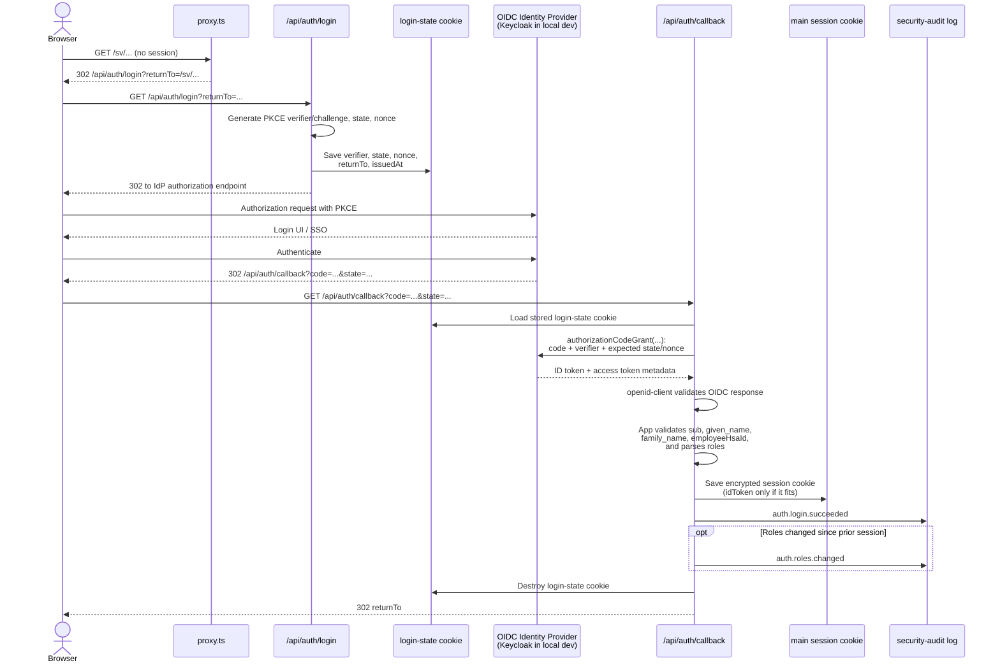
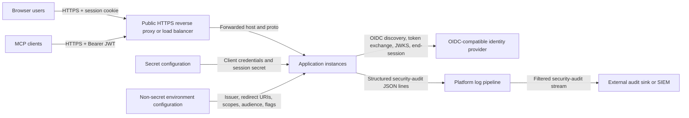

# How Auth Works

This document explains authentication in two separate layers:

- **Implemented now**: behavior verified in the current codebase.
- **Required for production**: the target hosting and IdP setup for the
  eventual production rollout.

It is intentionally not a replacement for the more detailed workflow docs:

- For local Keycloak, test setup, and env-var reference, see
  [auth-developer-workflow.md](./auth-developer-workflow.md).

## Reading guide

- **Implemented now** means the behavior is backed by the current code in
  `proxy.ts`, `app/api/auth/*`, `lib/auth/*`, `lib/mcp/http.ts`, and the
  auth-focused tests.
- **Required for production** means this is the intended deployment contract.
  Some of it is already reflected in config and docs, but it should still be
  read as deployment intent rather than as proof that every production step
  has already landed.
- **Required for production** also includes rollout and operational items that
  are not represented directly in the application code.

## Current auth architecture in the app

- [`proxy.ts`](../proxy.ts) is the front door. When `AUTH_ENABLED=true`, it:
  allows public paths, redirects unauthenticated browser page requests to
  `/api/auth/login`, returns `401` for unauthenticated API requests, and
  requires a Bearer header to be present for `/api/mcp`.
- Browser sign-in uses two separate `iron-session` cookies:
  a short-lived login-state cookie from
  [`lib/auth/login-state.ts`](../lib/auth/login-state.ts) and the main
  encrypted session cookie from
  [`lib/auth/session.ts`](../lib/auth/session.ts).
- `/api/auth/login` and `/api/auth/callback` use
  [`openid-client`](https://github.com/panva/openid-client) for OIDC
  discovery, the authorization-code exchange, PKCE handling, and OIDC
  validation.
- `/api/auth/me` exposes only safe session fields to the UI. It never returns
  raw tokens.
- `/api/auth/logout` destroys the local session and, when the discovered IdP
  advertises it, redirects through the IdP `end_session_endpoint`.
- `/api/mcp` uses Bearer JWTs instead of the browser session cookie. Token
  validation happens in [`lib/auth/mcp-token.ts`](../lib/auth/mcp-token.ts).
- [`lib/auth/audit.ts`](../lib/auth/audit.ts) emits one JSON security event
  per auth-relevant action.

### Browser login flow

<!-- markdownlint-disable MD013 -->

<!-- markdownlint-enable MD013 -->

- The redirect into `/api/auth/login` is usually triggered by `proxy.ts`, not
  by the page itself.
- The login-state cookie is separate from the main session cookie and has a
  much shorter lifetime. Its only job is to carry the PKCE verifier, `state`,
  `nonce`, `returnTo`, and `issuedAt` across the IdP round-trip.
- In [`app/api/auth/callback/route.ts`](../app/api/auth/callback/route.ts),
  the callback URL is rebuilt from the configured public redirect URI before
  the code exchange. This avoids host/origin mismatches when Next.js is
  running behind a proxy or under a different bind address.
- After `openid-client` validates the OIDC response, app code still requires
  `sub`, `given_name`, `family_name`, and `employeeHsaId`. Missing or invalid
  claims fail the login.
- Browser-role parsing uses `AUTH_OIDC_ROLES_CLAIM` from
  [`lib/auth/config.ts`](../lib/auth/config.ts), defaulting to `roles`.
- The stored session is intentionally small: `sub`, `hsaId`, name fields,
  verified email when available, roles, and `accessTokenExpiresAt`.
  The raw access token is not stored. The raw ID token is stored only when it
  fits within the cookie budget, because it is used only as an
  `id_token_hint` during logout.
- The main session cookie is `HttpOnly`, `SameSite=Lax`, scoped to `/`, and
  `Secure` in production.

### Session and logout flow

- [`components/AuthMenu.tsx`](../components/AuthMenu.tsx) uses
  `NEXT_PUBLIC_AUTH_ENABLED` as a client-side gate. When auth is enabled it
  calls `/api/auth/me` once on mount to render the signed-in user.
- `/api/auth/me` returns:
  `sub`, `hsaId`, `givenName`, `familyName`, `name`, `email?`, `roles`, and
  `expiresAt`. It never returns the raw ID token or raw access token.
- The sign-in link in `AuthMenu` points to
  `/api/auth/login?returnTo=<locale-prefixed-path>`.
- `POST /api/auth/logout` is the real logout operation. It:
  checks same-origin and `X-Requested-With`, records `auth.logout`,
  destroys the session cookie, discovers the IdP end-session URL when
  possible, and returns a redirect target for the caller.
- `GET /api/auth/logout` is intentionally non-destructive. It only redirects
  locally and does not clear the session.
- If a session cookie is present but invalid or unreadable,
  `proxy.ts` records `auth.session.rejected` and treats the request as signed
  out.

### MCP bearer-token flow

<!-- markdownlint-disable MD013 -->

<!-- markdownlint-enable MD013 -->

- `proxy.ts` only checks that a Bearer token is present for `/api/mcp`.
  Cryptographic verification is done later in
  [`lib/auth/mcp-token.ts`](../lib/auth/mcp-token.ts).
- `verifyMcpBearerToken()` derives the JWKS URL directly from the issuer as
  `${issuer}/.well-known/jwks.json` and caches the resulting
  `RemoteJWKSet`.
- JWT verification checks signature, issuer, audience, and a 30-second clock
  tolerance.
- The required MCP identity claim is `employeeHsaId`. Values prefixed with
  `mcp-client:` are accepted as synthetic service identities; other values
  must match the HSA-id validator.
- The current MCP implementation reads `roles` and `scope` directly from the
  access token payload. On success it attaches a verified actor to the active
  `Request` before the requirements service builds its request context.

### Security controls and audit events

- When auth is enabled, `proxy.ts` strips inbound `x-user-id` and
  `x-user-roles` headers so callers cannot impersonate a user via legacy
  header trust.
- Cookie-authenticated mutating requests go through the same-origin check in
  [`lib/auth/csrf.ts`](../lib/auth/csrf.ts). They must present a same-origin
  `Origin` or `Referer` and `X-Requested-With: XMLHttpRequest`.
- Page responses get a per-request CSP nonce from `proxy.ts`.
- Security audit events are emitted through
  [`lib/auth/audit.ts`](../lib/auth/audit.ts). The current event set is:
  `auth.login.succeeded`, `auth.login.failed`, `auth.logout`,
  `auth.session.rejected`, `auth.token.rejected`,
  `auth.mcp.token.accepted`, `auth.roles.changed`, and
  `auth.csrf.rejected`.
- Audit events intentionally redact sensitive fields such as tokens, secrets,
  authorization codes, PKCE verifiers, `state`, and `nonce`.

### Audit event stream

- Auth audit events are emitted as one JSON object per line through
  `console.info(...)` in [`lib/auth/audit.ts`](../lib/auth/audit.ts), tagged
  with `channel: "security-audit"`.
- Each record contains:
  `ts`, `event`, `outcome`, `actor`, `request`, and optional `detail`.
- `actor` identifies the source (`oidc`, `mcp`, or `anonymous`) and may also
  include `sub`, `hsaId`, and `clientId`.
- `request` includes the HTTP method and path, and may also include
  `requestId` and `userAgent` when those values were present on the incoming
  request.
- `detail` is optional and is redacted defensively so top-level fields such as
  tokens, secrets, authorization codes, PKCE verifiers, `state`, and `nonce`
  are not emitted.
- The audit writer is intentionally transport-free: it does not push directly
  to Kafka, a webhook, a SIEM, or a database. It writes structured events to
  the process log stream and does not buffer them in the app.
- To stream audit events to another system, configure your hosting platform's
  log pipeline to select records where `channel == "security-audit"` and
  forward them to the desired sink, for example a centralized log store, a
  SIEM, a message queue, or a dedicated audit pipeline.
- This routing can be done with whatever logging mechanism the platform
  already provides, such as a container log driver, a host or node log agent,
  a sidecar collector, or a managed platform log-forwarding service.
- Because the audit records are separate JSON lines with a stable channel tag,
  they can be split and forwarded independently from normal application logs.

## Required for production

This section describes the deployment shape the app expects in production.
Treat it as the target contract for a reverse-proxied, multi-instance
deployment and for the existing IdP. Where this section and the current code
differ, this section should be read as target deployment intent rather than
current implementation.

### Target production setup on a hosted deployment

At a high level, the production-facing connections look like this:

<!-- markdownlint-disable MD013 -->

<!-- markdownlint-enable MD013 -->

- Use a separate IdP tenant or client registration for each environment:
  `dev`, `test`, and `prod`.
- Provide per-environment secret configuration for
  `AUTH_OIDC_CLIENT_ID`, `AUTH_OIDC_CLIENT_SECRET`, and
  `AUTH_SESSION_COOKIE_PASSWORD`.
- Provide the remaining auth settings through non-secret environment
  configuration:
  `AUTH_ENABLED=true`, `NEXT_PUBLIC_AUTH_ENABLED=true`,
  `AUTH_OIDC_ISSUER_URL`, `AUTH_OIDC_REDIRECT_URI`,
  `AUTH_OIDC_POST_LOGOUT_REDIRECT_URI`, `AUTH_OIDC_SCOPES`,
  `AUTH_OIDC_ROLES_CLAIM`, `AUTH_OIDC_API_AUDIENCE`,
  `AUTH_SESSION_COOKIE_NAME`, `AUTH_SESSION_TTL_SECONDS`, and
  `AUTH_TRUST_PROXY=true`.
- Terminate TLS at the public reverse proxy or load balancer and preserve
  forwarded host/proto information so redirects and origin checks use the
  public HTTPS origin. The same edge layer may also distribute traffic across
  multiple app replicas; because the session is carried in the encrypted
  cookie, the app does not require sticky sessions.
- Allow the application instances to reach the IdP over `443`.
- Pre-register the exact redirect URI and post-logout URI for every
  environment. Public hostname changes require an IdP update as well.
- Keep the production posture fail-closed:
  `AUTH_ENABLED` must not be set to `false`, and the prodlike escape hatches
  `AUTH_ALLOW_DISABLE_IN_PRODUCTION` and `AUTH_OIDC_ALLOW_INSECURE_ISSUER`
  must remain unset or `false`.
- Keep the session model stateless. The app expects an encrypted cookie-based
  session, not a server-side session store, and it does not require sticky
  sessions between replicas.
- If MCP is enabled in production, provision a separate confidential client
  for the service-to-service `client_credentials` flow and set
  `AUTH_OIDC_API_AUDIENCE` explicitly when its access-token `aud` differs from
  the browser client.

### Required contract for an OIDC-compatible IdP

#### Browser client

- Support OIDC Authorization Code + PKCE for the browser-facing web client.
- Register the app as a confidential client with a client id and client
  secret.
- Expose a discovery document at the configured issuer URL. The app expects
  `/.well-known/openid-configuration` under `AUTH_OIDC_ISSUER_URL`.
- Expose authorization, token, and JWKS endpoints. An
  `end_session_endpoint` is strongly preferred so logout can also terminate
  the IdP session.
- Issue ID tokens that include the required claims:
  `sub`, `given_name`, `family_name`, and `employeeHsaId`.
- Emit reviewer/admin role information in a way that resolves to the
  canonical app roles `Reviewer` and `Admin`. For the least friction, emit
  those exact values on a `roles` claim.
- Do not model authoring rights as IdP roles. The application derives
  authoring rights from area and package assignments matched on
  `employeeHsaId`.

#### MCP service client

- Support a separate confidential client that can obtain access tokens via
  `client_credentials`.
- Issue signed JWT access tokens that can be verified against the IdP JWKS.
  Opaque access tokens are not sufficient for the current MCP implementation.
- Ensure MCP access tokens match the configured issuer and audience.
- Include `sub` and `employeeHsaId` on the MCP access token.
- The current MCP implementation may also consume `roles` and/or `scope`.
  If role-based behavior is needed there, emit the canonical app roles on a
  `roles` claim.

#### Identity semantics

- The claim name `employeeHsaId` is fixed by the application contract.
- `employeeHsaId` is treated as person-stable for the same person over time.
- The exact redirect URIs and post-logout URIs must be registered for each
  deployed environment.
- The IdP must be reachable from the hosting environment over TLS.

### Additional required-for-production items

- Tenant handover, redirect-URI registration runbooks, and the remaining
  production identity-provider readiness work belong to the production
  rollout.
- Future environment questions such as per-environment tenant ownership, MCP
  client credential rotation, and pre-production smoke verification against
  the real IdP are also part of production readiness.
- This document describes the current runtime behavior plus the contract the
  deployment needs to satisfy.
