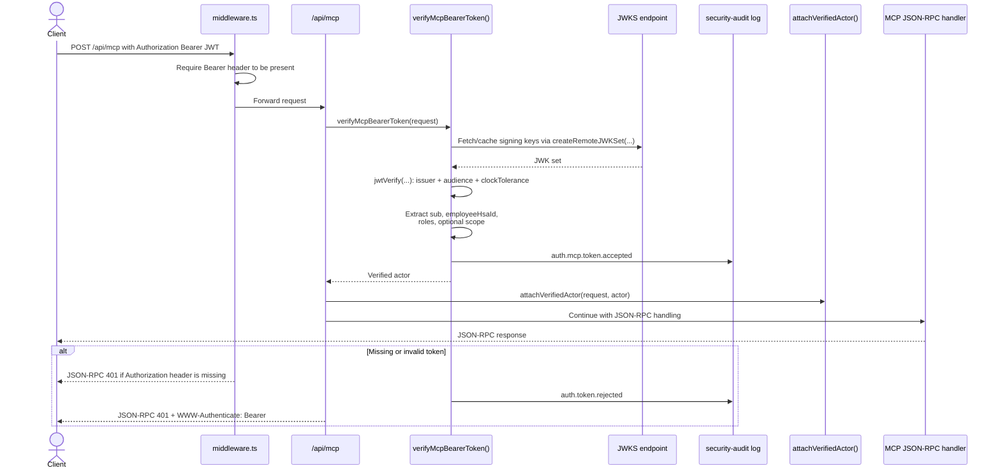
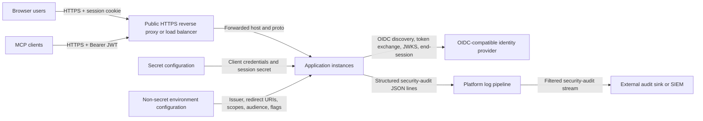

# How Auth Works

This document explains authentication in two separate layers:

- **Implemented now**: behavior verified in the current codebase.
- **Required for production**: the target hosting and IdP setup for the
  eventual production rollout.

It is intentionally not a replacement for the more detailed workflow docs:

- For local Keycloak, integration-test CI dependency, test setup, and
  env-var reference, see
  [auth-developer-workflow.md](./auth-developer-workflow.md).

## Reading guide

- **Implemented now** means the behavior is backed by the current code in
  `middleware.ts`, `app/api/auth/*`, `lib/auth/*`, `lib/mcp/http.ts`, and the
  auth-focused tests.
- **Required for production** means this is the intended deployment contract.
  Some of it is already reflected in config and docs, but it should still be
  read as deployment intent rather than as proof that every production step
  has already landed.
- **Required for production** also includes rollout and operational items that
  are not represented directly in the application code.

## Current auth architecture in the app

- [`middleware.ts`](../middleware.ts) is the front door. Auth is always on, so it:
  allows public paths, redirects unauthenticated browser page requests to
  `/api/auth/login`, returns `401` for unauthenticated API requests, and
  requires a Bearer header to be present for `/api/mcp`.
- Browser sign-in uses two separate `iron-session` cookies:
  a short-lived login-state cookie from
  [`lib/auth/login-state.ts`](../lib/auth/login-state.ts) and the main
  encrypted session cookie from
  [`lib/auth/session.ts`](../lib/auth/session.ts).
- `/api/auth/login` and `/api/auth/callback` use
  [`openid-client`](https://github.com/panva/openid-client) for OIDC
  discovery, the authorization-code exchange, PKCE handling, and OIDC
  validation.
- `/api/auth/me` exposes only safe session fields to the UI. It never returns
  raw tokens, and expired browser sessions are reported as unauthenticated.
- `/api/auth/logout` destroys the local session and, when the discovered IdP
  advertises it, redirects through the IdP `end_session_endpoint`.
- `/api/mcp` uses Bearer JWTs instead of the browser session cookie. Token
  validation happens in [`lib/auth/mcp-token.ts`](../lib/auth/mcp-token.ts).
- [`lib/auth/audit.ts`](../lib/auth/audit.ts) emits one JSON security event
  per auth-relevant action.

### Browser login flow

<!-- markdownlint-disable MD013 -->

<!-- markdownlint-enable MD013 -->

- The redirect into `/api/auth/login` is usually triggered by `middleware.ts`, not
  by the page itself.
- The login-state cookie is separate from the main session cookie and has a
  much shorter lifetime. Its only job is to carry the PKCE verifier, `state`,
  `nonce`, `returnTo`, and `issuedAt` across the IdP round-trip.
- If `/api/auth/callback` cannot read that login-state cookie, browser
  navigations are redirected to `/auth/error` instead of seeing raw JSON.
  JSON clients that explicitly ask for `application/json` still receive a
  structured error. The server log includes sanitized diagnostics for TLS,
  Secure-cookie handling, callback host configuration, and the stable
  `login_state_cookie_missing` code.
- Browser error redirects use the public origin from `AUTH_OIDC_REDIRECT_URI`,
  not the inbound request URL. This keeps failed callback paths from exposing
  internal bind hosts such as `0.0.0.0:3000` when standalone Next.js runs
  behind nginx or another reverse proxy.
- In [`app/api/auth/callback/route.ts`](../app/api/auth/callback/route.ts),
  the callback URL is rebuilt from the configured public redirect URI before
  the code exchange. This avoids host/origin mismatches when Next.js is
  running behind a proxy or under a different bind address.
- After `openid-client` validates the OIDC response, app code still requires
  `sub`, `given_name`, `family_name`, and `employeeHsaId`. Missing or invalid
  claims fail the login.
- Browser-role parsing uses `AUTH_OIDC_ROLES_CLAIM` from
  [`lib/auth/config.ts`](../lib/auth/config.ts), defaulting to `roles`.
- The stored session is intentionally small: `sub`, `hsaId`, name fields,
  verified email when available, roles, and `accessTokenExpiresAt`.
  The raw access token is not stored. The raw ID token is stored only when it
  fits within the cookie budget, because it is used only as an
  `id_token_hint` during logout.
- The main session cookie is `HttpOnly`, `SameSite=Lax`, scoped to `/`, and
  `Secure` in production.

### Session and logout flow

- [`components/AuthMenu.tsx`](../components/AuthMenu.tsx) calls `/api/auth/me`
  once on mount to render the signed-in user and aborts that request if the
  menu unmounts before the response settles.
- [`components/AuthExpiryGuard.tsx`](../components/AuthExpiryGuard.tsx) also
  calls `/api/auth/me` on mount. It warns signed-in users two minutes before
  `expiresAt`, lets them authenticate again immediately, and redirects through
  `/api/auth/login?returnTo=<current-path>` when the session expires.
- `/api/auth/me` returns:
  `sub`, `hsaId`, `givenName`, `familyName`, `name`, `email?`, `roles`, and
  `expiresAt`. It never returns the raw ID token or raw access token.
- `lib/http/api-fetch.ts` emits a browser auth-required event when same-origin
  API calls return `401`, so unexpected invalid-session responses use the same
  sign-in flow instead of leaving the user on a stale page.
- The sign-in link in `AuthMenu` points to
  `/api/auth/login?returnTo=<locale-prefixed-path>`.
- `POST /api/auth/logout` is the real logout operation. It:
  checks same-origin and `X-Requested-With`, records `auth.logout`,
  destroys the session cookie, discovers the IdP end-session URL when
  possible, and returns a redirect target for the caller.
- `AuthMenu` follows the redirect target only for successful logout responses.
  Failed logout attempts keep the user on the current page and show an inline
  alert.
- `GET /api/auth/logout` is intentionally non-destructive. It only redirects
  locally and does not clear the session.
- If a session cookie is present but past `accessTokenExpiresAt`,
  `middleware.ts` records `auth.session.expired` and treats the request as
  signed out. Invalid or unreadable cookies still record
  `auth.session.rejected`.

### MCP bearer-token flow

<!-- markdownlint-disable MD013 -->

<!-- markdownlint-enable MD013 -->

- `middleware.ts` only checks that a Bearer token is present for `/api/mcp`.
  Cryptographic verification is done later in
  [`lib/auth/mcp-token.ts`](../lib/auth/mcp-token.ts).
- Missing-header and invalid-token failures use a JSON-RPC error body so MCP
  clients receive the same response shape at both auth gates.
- `verifyMcpBearerToken()` uses OIDC discovery metadata to read the issuer's
  `jwks_uri` and caches the resulting `RemoteJWKSet`.
- JWT verification checks signature, issuer, audience, and a 30-second clock
  tolerance.
- The required MCP identity is `employeeHsaId`. Values must match the HSA-id
  validator: two uppercase country-code letters, 10 digits, `-`, and an
  alphanumeric suffix, with a maximum length of 31 characters. The configured
  local MCP service client emits `SE5560000001-mcp1`; a missing claim means the
  IdP realm must be reset or re-imported from the current realm JSON.
- The current MCP implementation reads `roles` and `scope` directly from the
  access token payload. On success it attaches a verified actor to the active
  `Request` before the requirements service builds its request context.

### Security controls and audit events

- Identity is derived only from the verified iron-session cookie (browser
  flow) or a verified `Authorization: Bearer` JWT (MCP flow). The app does
  not accept `x-user-id` or `x-user-roles` request headers as a stand-in
  for a logged-in user, and `middleware.ts` strips both headers from every
  inbound request before any handler runs so a caller cannot use them to
  impersonate a user.
- Cookie-authenticated mutating requests go through the same-origin check in
  [`lib/auth/csrf.ts`](../lib/auth/csrf.ts). They must present a same-origin
  `Origin` or `Referer` and `X-Requested-With: XMLHttpRequest`.
  `lib/auth/csrf.ts` and `middleware.ts` compare only the URL origin
  (scheme + host + port) of `AUTH_OIDC_REDIRECT_URI`; path and query values are
  ignored. `X-Forwarded-Proto` and `X-Forwarded-Host` are ignored for this
  check.
  `middleware.ts` enforces this centrally for mutating REST API requests after
  authentication has succeeded, excluding `/api/mcp`, which uses Bearer-token
  auth. Route-level checks remain as defense-in-depth through
  `lib/http/secure-mutation-route.ts`: app-owned `POST`, `PUT`, `PATCH`, and
  `DELETE` REST routes build `RequestContext`, require an authenticated actor,
  validate params and JSON bodies, run a declared `admin`, `requirements`, or
  `custom` authorization policy, and only then call route-specific handler
  work. `/api/auth/logout` uses `secureLogoutMutationRoute` because logout is
  an auth endpoint with CSRF and audit but no business authorization policy.
  `/api/mcp` remains the documented exception because it is guarded by Bearer
  JWT verification and MCP tool schemas instead of the REST mutation wrapper.
- Page responses get a per-request CSP nonce from `middleware.ts`.
- Security audit events are emitted through
  [`lib/auth/audit.ts`](../lib/auth/audit.ts). The current event set is:
  `auth.login.succeeded`, `auth.login.failed`, `auth.logout`,
  `auth.session.expired`, `auth.session.rejected`, `auth.token.rejected`,
  `auth.mcp.token.accepted`, `auth.roles.changed`,
  `auth.csrf.rejected`, `auth.authorization.denied`,
  `requirements.high_risk_mutation.succeeded`,
  `admin.privileged_action.succeeded`,
  `access_review.created`, `access_review.item_decided`,
  `access_review.cancelled`, `access_review.completed`,
  `access_review.exported`,
  `privacy.erasure.previewed`, `privacy.erasure.executed`,
  `privacy.data_subject_export.generated`.
- Audit events intentionally redact sensitive fields such as tokens, secrets,
  authorization codes, PKCE verifiers, `state`, and `nonce`. When a top-level
  detail key is redacted, the audit writer also emits a structured
  `detail-key-redacted` breadcrumb with the source event, actor source, and
  redacted key name.
- Privacy erasure and data subject access export security events are emitted to
  the platform security-log stream. Privacy erasure execution also writes a
  database action-log row for Admin review. Both include the handler
  identity, request id, grouped counts or delivery metadata, and a
  non-reversible target fingerprint. They must not include the raw target
  HSA-ID in event detail. Retention or redaction of handler identity in
  external security logs is handled by the platform logging policy because
  removing it can reduce traceability.
- Privileged Admin Center taxonomy and status-catalog mutations emit
  `admin.privileged_action.succeeded` only after the mutation succeeds. The
  detail contains operation, resource type, optional resource id, item counts,
  edited field names, request source, session roles and privileged IdP roles;
  it does not log raw target names, e-mail addresses, HSA-IDs, secrets or
  submitted values.

### Audit event stream

- Auth audit events are emitted as one JSON object per line through
  `console.info(...)` in [`lib/auth/audit.ts`](../lib/auth/audit.ts), tagged
  with `channel: "security-audit"`.
- Each record contains:
  `ts`, `event`, `outcome`, `actor`, `request`, and optional `detail`.
- `actor` identifies the source (`oidc`, `mcp`, or `anonymous`) and may also
  include `sub`, `hsaId`, and `clientId`.
- `request` includes the HTTP method and path without query strings or
  fragments, and may also include `requestId`, `userAgent`, and a validated
  `ip` when those values were present on the incoming request. `ip` is derived
  from the first valid `X-Forwarded-For` candidate and should only be trusted
  when that header is controlled by the reverse proxy or ingress path.
- `detail` is optional and is redacted defensively so top-level fields such as
  tokens, secrets, authorization codes, PKCE verifiers, `state`, and `nonce`
  are not emitted. Redaction breadcrumbs use the same `security-audit` channel
  and carry `breadcrumb: "detail-key-redacted"` instead of an audit `event`.
- Requirements authorization denials and high-risk business mutations use the
  same stream. Their `detail` payloads carry stable identifiers, counts, and
  action names only; free-text requirement content, motivations, and suggestion
  text are not emitted.
- Application action-log rows in `action_audit_events` are separate from
  this stream. They are database records for successful app-owned mutations and
  authorization denials, include request/correlation IDs and optional validated
  client IP, and can be viewed by Admins at `/{locale}/admin/audit-log`.
- The audit writer is intentionally transport-free: it does not push directly
  to Kafka, a webhook, a SIEM, or a database. It writes structured events to
  the process log stream and does not buffer them in the app.
- To stream audit events to another system, configure your hosting platform's
  log pipeline to select records where `channel == "security-audit"` and
  forward them to the desired sink, for example a centralized log store, a
  SIEM, a message queue, or a dedicated audit pipeline.
- This routing can be done with whatever logging mechanism the platform
  already provides, such as a container log driver, a host or node log agent,
  a sidecar collector, or a managed platform log-forwarding service.
- Because the audit records are separate JSON lines with a stable channel tag,
  they can be split and forwarded independently from normal application logs.

## Required for production

This section describes the deployment shape the app expects in production.
Treat it as the target contract for a reverse-proxied, multi-instance
deployment and for the existing IdP. Where this section and the current code
differ, this section should be read as target deployment intent rather than
current implementation.

### Target production setup on a hosted deployment

At a high level, the production-facing connections look like this:

<!-- markdownlint-disable MD013 -->

<!-- markdownlint-enable MD013 -->

- Use a separate IdP tenant or client registration for each environment:
  `dev`, `test`, and `prod`.
- Provide per-environment secret configuration for
  `AUTH_OIDC_CLIENT_ID`, `AUTH_OIDC_CLIENT_SECRET`, and
  `AUTH_SESSION_COOKIE_PASSWORD`.
- Provide the remaining auth settings through non-secret environment
  configuration:
  `AUTH_OIDC_ISSUER_URL`, `AUTH_OIDC_REDIRECT_URI`,
  `AUTH_OIDC_POST_LOGOUT_REDIRECT_URI`, `AUTH_OIDC_SCOPES`,
  `AUTH_OIDC_ROLES_CLAIM`, `AUTH_OIDC_API_AUDIENCE`,
  `AUTH_SESSION_COOKIE_NAME`, and `AUTH_SESSION_TTL_SECONDS`.
- Terminate TLS at the public reverse proxy or load balancer and set
  `AUTH_OIDC_REDIRECT_URI` and `AUTH_OIDC_POST_LOGOUT_REDIRECT_URI` to the
  public HTTPS host. CSRF origin checks in `lib/auth/csrf.ts` and
  `middleware.ts` compare only the URL origin (scheme + host + port) of
  `AUTH_OIDC_REDIRECT_URI`, not its path or query, and ignore inbound
  `X-Forwarded-*` headers. The same edge layer may also distribute traffic
  across multiple app replicas; because the session is carried in the encrypted
  cookie, the app does not require sticky sessions.
- Allow the application instances to reach the IdP over `443`.
- Pre-register the exact redirect URI and post-logout URI for every
  environment. Public hostname changes require both app configuration and IdP
  updates.
- Auth is mandatory in every build target. The insecure-issuer allowance
  is now a build-target constant that is `true` only for `dev` and `local-prod`.
  The `local-prod` target (booted via `npm run start:prodlike` on port
  `3001`) authenticates against a dedicated dev-only Keycloak client
  (`kravhantering-prodlike`) wired up in [`.env.prodlike`](../.env.prodlike);
  see the
  [Prodlike local client](./auth-developer-workflow.md#prodlike-local-client-kravhantering-prodlike)
  section in the developer workflow for the full client/redirect/secret
  contract. These auth-related build-target constants (including the
  insecure-issuer allowance) are baked into the bundle when the build target is
  selected, so changing them requires rebuilding for that target (for example
  rebuilding the `local-prod` bundle that backs `npm run start:prodlike`) — they
  are not runtime environment variables that can be toggled on a deployed
  instance.
- Keep the session model stateless. The app expects an encrypted cookie-based
  session, not a server-side session store, and it does not require sticky
  sessions between replicas. Browser access tokens are not stored for periodic
  introspection.
- If MCP is enabled in production, provision a separate confidential client
  for the service-to-service `client_credentials` flow and set
  `AUTH_OIDC_API_AUDIENCE` explicitly when its access-token `aud` differs from
  the browser client.

### Required contract for an OIDC-compatible IdP

#### Browser client

- Support OIDC Authorization Code + PKCE for the browser-facing web client.
- Register the app as a confidential client with a client id and client
  secret.
- Expose a discovery document at the configured issuer URL. The app expects
  `/.well-known/openid-configuration` under `AUTH_OIDC_ISSUER_URL`.
- Expose authorization, token, and JWKS endpoints. An
  `end_session_endpoint` is strongly preferred so logout can also terminate
  the IdP session.
- For immediate invalidation before `accessTokenExpiresAt`, prefer standard
  OIDC front-channel logout, back-channel logout, or equivalent provider
  session notifications in production. If the production IdP cannot support
  those hooks, keep using the stateless session model and bound stale access by
  shortening token/session lifetimes instead of storing browser access tokens.
- Issue ID tokens that include the required claims:
  `sub`, `given_name`, `family_name`, and `employeeHsaId`.
- For Keycloak realms, keep the underlying user attribute named `hsaId` and
  map it to the token claim `employeeHsaId`. Newer Keycloak admin consoles
  expose that field through the realm user-profile configuration.
- Emit global role information in a way that resolves to the canonical app
  roles `Reviewer`, `Admin`, and `PrivacyOfficer`. For the least friction,
  emit those exact values on a `roles` claim. `PrivacyOfficer` is only for
  personal data erasure work and does not imply `Admin`.
- Do not model authoring rights as IdP roles. The application derives
  authoring rights from area and specification assignments matched on
  `employeeHsaId`.

#### MCP service client

- Support a separate confidential client that can obtain access tokens via
  `client_credentials`.
- Issue signed JWT access tokens that can be verified against the IdP JWKS.
  Opaque access tokens are not sufficient for the current MCP implementation.
- Ensure MCP access tokens match the configured issuer and audience.
- Include `sub` and a real-format `employeeHsaId` on every MCP access token.
  If a local or prodlike token lacks the claim, update the Keycloak realm
  configuration or reset the local IdP so the current realm JSON is imported.
- The current MCP implementation may also consume `roles` and/or `scope`.
  If role-based behavior is needed there, emit the canonical app roles on a
  `roles` claim.

#### Identity semantics

- The claim name `employeeHsaId` is fixed by the application contract.
- `employeeHsaId` is treated as person-stable for the same person over time.
- The exact redirect URIs and post-logout URIs must be registered for each
  deployed environment.
- The IdP must be reachable from the hosting environment over TLS.

### Additional required-for-production items

- Tenant handover, redirect-URI change process, MCP service-token approval
  and pre-production smoke verification against the real IdP belong to the
  production rollout.
- Day-2 auth credential rotation is handled by the RHEL 10 production
  upgrade and rollback guide.
- This document describes the current runtime behavior plus the contract the
  deployment needs to satisfy.
