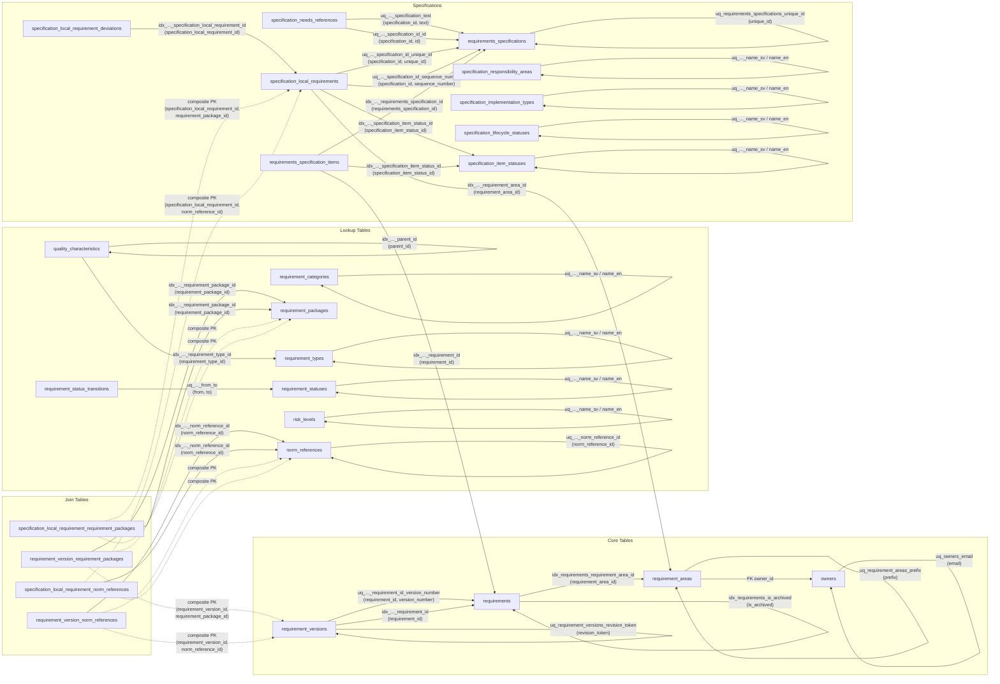

# Database Schema Documentation

This document describes the complete database schema for
**Kravkatalog** — a requirements management system built
on Microsoft SQL Server using TypeORM.

The schema is defined by TypeORM entities under
[`lib/typeorm/entities/`](../lib/typeorm/entities/). Migrations live in
[`typeorm/migrations/`](../typeorm/migrations/) and seed data in
[`typeorm/seed.mjs`](../typeorm/seed.mjs). The developer setup, browse
workflow, and CLI reference live in
[sql-server-developer-workflow.md](./sql-server-developer-workflow.md).

---

## Table of Contents

1. [Database Naming Standard](#database-naming-standard)
2. [Entity-Relationship Diagram](#entity-relationship-diagram)
3. [Lookup / Taxonomy Tables](#lookup--taxonomy-tables)
4. [UI Settings Tables](#ui-settings-tables)
5. [Core Domain Tables](#core-domain-tables)
6. [Join / Bridge Tables](#join--bridge-tables)
7. [Status Workflow](#status-workflow)

---

## Database Naming Standard

Apply these rules to all schema objects.

### 1. Global Rules
<!-- cSpell:ignore categorised behaviour -->
- Use **US English** for all identifiers (tables, columns,
  constraints, indexes) — e.g. `categorized`, not `categorised`;
  `behavior`, not `behaviour`
- Use lowercase `snake_case`
- Use ASCII only for identifiers (`a-z`, `0-9`, `_`)
- Do not quote identifiers
- Avoid reserved keywords
- Do not mix naming styles

### 2. Tables

- Plural nouns, `snake_case`
- Examples: `users`, `orders`, `order_items`

### 3. Columns

- Singular, descriptive, `snake_case`
- No abbreviations
- Boolean prefix: `is_`, `has_`, `can_`
- Examples: `email`, `total_amount`, `is_active`

### 4. Primary Key

- Column name: `id`
- Exactly one primary key per table

### 5. Foreign Keys

- Format: `<referenced_table_singular>_id`
- Example: `user_id` references `users(id)`

### 6. Timestamps

- `created_at`, `updated_at`, `deleted_at` (optional)

### 7. Indexes & Constraints

- Primary key: `pk_<table>`
- Foreign key: `fk_<table>_<column>`
- Unique: `uq_<table>_<column>`
- Index: `idx_<table>_<column>`
- Check: `chk_<table>_<column>`

### 8. Data Values and Locale

- Text values **may contain Swedish characters**
  (`å`, `ä`, `ö`) and other Unicode.
- Ensure database/app uses **UTF-8** (or equivalent
  Unicode) encoding for stored text.

### Accepted Exceptions

<!-- markdownlint-disable MD013 -->
| Rule | Exception | Rationale |
| ---- | --------- | --------- |
| 4 | `requirement_version_requirement_packages` uses composite PK `(requirement_version_id, requirement_package_id)` instead of a single `id` | Standard practice for many-to-many join tables; adding a surrogate `id` would add no value. |
| 4 | `requirement_version_norm_references` uses composite PK `(requirement_version_id, norm_reference_id)` instead of a single `id` | Same rationale as the requirement-packages join table above. |
| 4 | `specification_local_requirement_requirement_packages` uses composite PK `(specification_local_requirement_id, requirement_package_id)` instead of a single `id` | Same rationale as the version-based requirement-packages join table above. |
| 4 | `specification_local_requirement_norm_references` uses composite PK `(specification_local_requirement_id, norm_reference_id)` instead of a single `id` | Same rationale as the version-based norm-references join table above. |
| Localized columns | `norm_references.name`, `norm_references.type`, `norm_references.issuer` are single-language columns | Norm references are external legal/regulatory documents (e.g. laws, ISO standards) with proper names in their source language. Localizing them would be factually incorrect — "SFS 2018:218" and "Riksdagen" do not have per-locale translations. |
| Versioning | `requirement_version_norm_references` stores only FK IDs, not snapshots of mutable `norm_references` fields (`name`, `type`, `reference`, `version`, `issuer`, `uri`) | Norm references are shared external documents whose metadata should reflect the latest known state across all requirement versions. Snapshotting would create stale duplicates of external metadata that the system does not own. If point-in-time fidelity is needed in the future, a dedicated snapshot table can be added without breaking the current schema. |
<!-- markdownlint-enable MD013 -->

---

## Entity-Relationship Diagram

```mermaid
erDiagram
    owners {
        integer id PK
        text first_name
        text last_name
        text email UK
        text created_at
        text updated_at
    }

    requirement_areas {
        integer id PK
        text prefix UK "e.g. INT, SAK, PRE"
        text name
        text description
        integer owner_id FK
        integer next_sequence
        text created_at
        text updated_at
    }

    requirement_categories {
        integer id PK
        text name_sv UK
        text name_en UK
    }

    requirement_types {
        integer id PK
        text name_sv UK
        text name_en UK
    }

    quality_characteristics {
        integer id PK
        text name_sv
        text name_en
        integer requirement_type_id FK
        integer parent_id FK "self-referencing"
    }

    requirement_statuses {
        integer id PK
        text name_sv UK
        text name_en UK
        integer sort_order
        text color
        integer is_system "boolean"
    }

    risk_levels {
        integer id PK
        text name_sv UK
        text name_en UK
        integer sort_order
        text color
    }

    requirement_status_transitions {
        integer id PK
        integer from_requirement_status_id FK
        integer to_requirement_status_id FK
    }

    ui_terminology {
        integer id PK
        text key UK
        text singular_sv
        text plural_sv
        text definite_plural_sv
        text singular_en
        text plural_en
        text definite_plural_en
        text updated_at
    }

    requirement_list_column_defaults {
        integer id PK
        text column_id UK
        integer sort_order UK
        integer is_default_visible "boolean"
        text updated_at
    }

    requirements {
        integer id PK
        text unique_id UK "e.g. INT0001"
        integer requirement_area_id FK
        integer sequence_number
        integer is_archived "boolean"
        text created_at
    }

    requirement_versions {
        integer id PK
        text revision_token UK "uniqueidentifier"
        integer requirement_id FK
        integer version_number
        text description
        text acceptance_criteria
        integer requirement_category_id FK
        integer requirement_type_id FK
        integer quality_characteristic_id FK
        integer risk_level_id FK
        integer requirement_status_id FK
        integer is_testing_required "boolean"
        text verification_method
        text created_at
        text edited_at
        text published_at
        text archive_initiated_at
        text archived_at
        text created_by
    }

    norm_references {
        integer id PK
        text norm_reference_id UK
        text name
        text type
        text reference
        text version
        text issuer
        text uri
        text created_at
        text updated_at
    }

    requirement_packages {
        integer id PK
        text name_sv
        text name_en
        text description_sv
        text description_en
        integer owner_id FK
    }

    requirement_version_requirement_packages {
        integer requirement_version_id FK, PK
        integer requirement_package_id FK, PK
    }

    requirement_version_norm_references {
        integer requirement_version_id FK, PK
        integer norm_reference_id FK, PK
    }

    specification_responsibility_areas {
        integer id PK
        text name_sv UK
        text name_en UK
    }

    specification_implementation_types {
        integer id PK
        text name_sv UK
        text name_en UK
    }

    specification_lifecycle_statuses {
        integer id PK
        text name_sv UK
        text name_en UK
    }

    specification_item_statuses {
        integer id PK
        text name_sv UK
        text name_en UK
        text description_sv
        text description_en
        text color
        integer sort_order
    }

    requirements_specifications {
        integer id PK
        text unique_id UK
        text name
        integer local_requirement_next_sequence
        integer specification_responsibility_area_id FK
        integer specification_implementation_type_id FK
        integer specification_lifecycle_status_id FK
        text business_needs_reference
        text created_at
        text updated_at
    }

    specification_needs_references {
        integer id PK
        integer specification_id FK
        text text
        text created_at
    }

    specification_local_requirements {
        integer id PK
        integer specification_id FK
        text unique_id
        integer sequence_number
        integer requirement_area_id FK
        text description
        text acceptance_criteria
        integer requirement_category_id FK
        integer requirement_type_id FK
        integer quality_characteristic_id FK
        integer risk_level_id FK
        integer is_testing_required
        text verification_method
        integer needs_reference_id FK
        integer specification_item_status_id FK
        text note
        text status_updated_at
        text created_at
        text updated_at
    }

    specification_local_requirement_requirement_packages {
        integer specification_local_requirement_id PK, FK
        integer requirement_package_id PK, FK
    }

    specification_local_requirement_norm_references {
        integer specification_local_requirement_id PK, FK
        integer norm_reference_id PK, FK
    }

    specification_local_requirement_deviations {
        integer id PK
        integer specification_local_requirement_id FK
        text motivation
        integer is_review_requested
        integer decision
        text decision_motivation
        text decided_by
        text decided_at
        text created_by
        text created_at
        text updated_at
    }

    requirements_specification_items {
        integer id PK
        integer requirements_specification_id FK
        integer requirement_id FK
        integer requirement_version_id FK
        integer needs_reference_id FK
        integer specification_item_status_id FK
        text note
        text status_updated_at
        text unused_1
        text created_at
    }

    deviations {
        integer id PK
        integer specification_item_id FK
        text motivation
        integer is_review_requested
        integer decision
        text decision_motivation
        text decided_by
        text decided_at
        text created_by
        text created_at
        text updated_at
    }

    %% Relationships
    owners |o--o{ requirement_areas : "owns"
    requirement_areas ||--o{ requirements : "has many"
    requirements ||--o{ requirement_versions : "has many versions"
    requirement_versions }o--|| requirement_statuses : "has status"
    requirement_versions }o--o| requirement_categories : "categorized as"
    requirement_versions }o--o| requirement_types : "typed as"
    requirement_versions }o--o| quality_characteristics : "sub-typed as"
    requirement_versions }o--o| risk_levels : "risk level"
    requirement_versions ||--o{ requirement_version_requirement_packages : "linked via"
    requirement_packages ||--o{ requirement_version_requirement_packages : "linked via"
    requirement_versions ||--o{ requirement_version_norm_references : "linked via"
    norm_references ||--o{ requirement_version_norm_references : "linked via"
    owners |o--o{ requirement_packages : "owns"
    requirement_types ||--o{ quality_characteristics : "has many"
    quality_characteristics ||--o{ quality_characteristics : "parent-child"
    requirement_statuses ||--o{ requirement_status_transitions : "from"
    requirement_statuses ||--o{ requirement_status_transitions : "to"
    requirements_specifications ||--o{ specification_needs_references : "stores needs references"
    requirements_specifications ||--o{ requirements_specification_items : "contains"
    requirements_specifications ||--o{ specification_local_requirements : "contains local"
    specification_responsibility_areas ||--o{ requirements_specifications : "responsibility area"
    specification_implementation_types ||--o{ requirements_specifications : "implementation type"
    specification_lifecycle_statuses ||--o{ requirements_specifications : "lifecycle status"
    specification_item_statuses ||--o{ requirements_specification_items : "usage status"
    specification_item_statuses ||--o{ specification_local_requirements : "usage status"
    specification_needs_references ||--o{ requirements_specification_items : "scoped needs reference"
    specification_needs_references ||--o{ specification_local_requirements : "scoped needs reference"
    requirements ||--o{ requirements_specification_items : "included in"
    requirement_versions ||--o{ requirements_specification_items : "pinned version"
    requirements_specification_items ||--o{ deviations : "has deviations"
    requirement_areas ||--o{ specification_local_requirements : "classified in"
    requirement_categories ||--o{ specification_local_requirements : "categorized as"
    requirement_types ||--o{ specification_local_requirements : "typed as"
    quality_characteristics ||--o{ specification_local_requirements : "sub-typed as"
    risk_levels ||--o{ specification_local_requirements : "risk level"
    specification_local_requirements ||--o{ specification_local_requirement_requirement_packages : "linked via"
    requirement_packages ||--o{ specification_local_requirement_requirement_packages : "linked via"
    specification_local_requirements ||--o{ specification_local_requirement_norm_references : "linked via"
    norm_references ||--o{ specification_local_requirement_norm_references : "linked via"
    specification_local_requirements ||--o{ specification_local_requirement_deviations : "has deviations"

    improvement_suggestions {
        integer id PK
        integer requirement_id FK
        integer requirement_version_id FK
        text content
        text created_by
        integer is_review_requested
        text review_requested_at
        integer resolution
        text resolution_motivation
        text resolved_by
        text resolved_at
        text created_at
        text updated_at
    }

    requirements ||--o{ improvement_suggestions : "has suggestions"
    requirement_versions ||--o{ improvement_suggestions : "version suggestions"
```

<!-- markdownlint-disable MD013 -->

<!-- markdownlint-enable MD013 -->

---

## Lookup / Taxonomy Tables

These tables store reference data (categories, types,
statuses). All user-facing text columns are localized
with `_sv` (Swedish) and `_en` (English) suffixes.

These are business-domain reference-data tables. UI configuration is documented
separately under [UI Settings Tables](#ui-settings-tables).

### `requirement_categories`

High-level classification of a requirement's origin.

| Column | Type | Description |
| -------- | ------ | ------------- |
| `id` | integer PK | Auto-increment primary key |
| `name_sv` | text, unique | Swedish display name |
| `name_en` | text, unique | English display name |

**Seed values:** Verksamhetskrav (Business requirement),
IT-krav (IT requirement),
Leverantörskrav (Supplier requirement).

---

### `requirement_types`

Whether a requirement is functional or non-functional.

| Column | Type | Description |
| -------- | ------ | ------------- |
| `id` | integer PK | Auto-increment primary key |
| `name_sv` | text, unique | Swedish display name |
| `name_en` | text, unique | English display name |

**Seed values:** Funktionellt (Functional), Icke-funktionellt (Non-functional).

---

### `quality_characteristics`

Quality characteristics from **ISO/IEC 25010:2023**.
Forms a self-referencing tree: top-level categories
(e.g. "Security") have children (e.g. "Confidentiality",
"Integrity").

<!-- markdownlint-disable MD013 -->
| Column | Type | Description |
| -------- | ------ | ------------- |
| `id` | integer PK | Auto-increment primary key |
| `name_sv` | text | Swedish display name |
| `name_en` | text | English display name |
| `requirement_type_id` | integer FK → `requirement_types.id` | Which type this category belongs to |
| `parent_id` | integer FK → `quality_characteristics.id` | Parent category (NULL for top-level) |
<!-- markdownlint-enable MD013 -->

**Indexes:**
`idx_quality_characteristics_requirement_type_id`,
`idx_quality_characteristics_parent_id`.

---

### `requirement_statuses`

Workflow statuses governing the lifecycle of a requirement version.

<!-- markdownlint-disable MD013 -->
| Column | Type | Description |
| -------- | ------ | ------------- |
| `id` | integer PK | Auto-increment primary key |
| `name_sv` | text, unique | Swedish display name |
| `name_en` | text, unique | English display name |
| `sort_order` | integer | Display ordering |
| `color` | text | Hex color code for UI badges |
| `is_system` | boolean (integer) | `true` for built-in statuses that cannot be deleted |
<!-- markdownlint-enable MD013 -->

**Seed values:**

| id | Swedish | English | Color |
| ---- | --------- | --------- | ------- |
| 1 | Utkast | Draft | `#3b82f6` (blue) |
| 2 | Granskning | Review | `#eab308` (yellow) |
| 3 | Publicerad | Published | `#22c55e` (green) |
| 4 | Arkiverad | Archived | `#6b7280` (gray) |

---

### `requirement_status_transitions`

Defines the allowed state-machine transitions between statuses.

<!-- markdownlint-disable MD013 -->
| Column | Type | Description |
| -------- | ------ | ------------- |
| `id` | integer PK | Auto-increment primary key |
| `from_requirement_status_id` | integer FK → `requirement_statuses.id` | Source status |
| `to_requirement_status_id` | integer FK → `requirement_statuses.id` | Target status |
<!-- markdownlint-enable MD013 -->

**Unique constraint:**
`uq_requirement_status_transitions_from_to` on
`(from_requirement_status_id, to_requirement_status_id)`.

**Seed transitions:**

| From | To |
| ------ | ---- |
| Utkast (1) | Granskning (2) |
| Granskning (2) | Publicerad (3) |
| Granskning (2) | Utkast (1) |
| Publicerad (3) | Granskning (2) |
| Granskning (2) | Arkiverad (4) |

---

### Status Workflow

The seeded requirement workflow is:

`Utkast` → `Granskning` → `Publicerad`

Archiving uses a two-step review process:

`Publicerad` → `Granskning` (archiving review)
→ `Arkiverad`

The schema also allows `Granskning` → `Utkast`
(reject back to draft).

---

### `risk_levels`

Classifies the risk associated with a requirement.

| Column | Type | Description |
| ------------ | --------------- | ----------------------------- |
| `id` | integer PK | Auto-increment primary key |
| `name_sv` | text, unique | Swedish display name |
| `name_en` | text, unique | English display name |
| `sort_order` | integer | Display ordering |
| `color` | text | Hex color code for UI badges |

**Seed values:**

| id | Swedish | English | Color |
| ---- | ------- | ------- | ------------------- |
| 1 | Låg | Low | `#22c55e` (green) |
| 2 | Medel | Medium | `#eab308` (yellow) |
| 3 | Hög | High | `#ef4444` (red) |

---

### `requirement_packages`

Describes requirement packages (for example "Mobile use",
"Data migration", or "Cloud operations") that requirement versions can
be linked to.

> **Applicability / Tillämpningsbarhet.**
> Requirement packages also serve as the mechanism for
> expressing *applicability* — i.e. in which contexts or
> environments a requirement applies. Instead of a
> separate applicability table, create requirement packages
> such as "All systems", "Protected data", or
> "Public services" and link them to requirement
> versions via `requirement_version_requirement_packages`.
> The many-to-many relation lets a single requirement
> apply to multiple contexts.

<!-- markdownlint-disable MD013 -->
| Column | Type | Description |
| -------- | ------ | ------------- |
| `id` | integer PK | Auto-increment primary key |
| `name_sv` | text | Swedish name |
| `name_en` | text | English name |
| `description_sv` | text | Swedish description |
| `description_en` | text | English description |
| `owner_id` | integer FK → `owners.id` | Responsible owner (nullable) |
| `created_at` | text (ISO 8601) | Creation timestamp |
| `updated_at` | text (ISO 8601) | Last-modified timestamp |
<!-- markdownlint-enable MD013 -->

**Seed values:**

| id | Swedish | English |
| ---- | ------- | ------- |
| 1 | Mobil användning | Mobile use |
| 2 | Datamigrering | Data migration |
| 3 | Integration med andra system | Integration with other systems |
| 4 | Ärendehantering | Case management |
| 5 | Användarvänlighet | Usability |
| 6 | Molndrift | Cloud operations |
| 7 | Normal drift | Normal operations |
| 8 | Hög belastning | High load |
| 9 | Katastrofåterställning | Disaster recovery |

---

### `norm_references`

External normative references such as laws, ISO standards,
regulatory directives, and RFCs. Requirement versions can
be linked to norm references via the
`requirement_version_norm_references` join table.

Column names are **not** localized — see
[Accepted Exceptions](#accepted-exceptions).

<!-- markdownlint-disable MD013 -->
| Column | Type | Description |
| -------- | ------ | ------------- |
| `id` | integer PK | Auto-increment primary key |
| `norm_reference_id` | text, unique | Stable external identifier (e.g. `SFS 2018:218`, `ISO/IEC 27001:2022`) |
| `name` | text | Full display name of the reference |
| `type` | text | Classification (e.g. Lag, Standard, Föreskrift, Direktiv) |
| `reference` | text | Citation string |
| `version` | text | Edition or version year (nullable) |
| `issuer` | text | Issuing organization |
| `uri` | text | URL to the official document (nullable) |
| `created_at` | text (ISO 8601) | Creation timestamp |
| `updated_at` | text (ISO 8601) | Last-modified timestamp |
<!-- markdownlint-enable MD013 -->

**Unique index:**
`uq_norm_references_norm_reference_id`.

<!-- cSpell:disable-next-line -->
**Seed values:**

<!-- markdownlint-disable MD013 -->
| id | norm\_reference\_id | name | type | issuer |
| --- | --- | --- | --- | --- |
| 1 | SFS 2018:218 | Lag (2018:218) med kompletterande bestämmelser till EU:s dataskyddsförordning | Lag | Riksdagen |
| 2 | ISO/IEC 27001:2022 | Ledningssystem för informationssäkerhet | Standard | ISO/IEC |
| 3 | MSBFS 2020:6 | Föreskrifter om informationssäkerhet för statliga myndigheter | Föreskrift | MSB |
| 4 | RFC 6749 | The OAuth 2.0 Authorization Framework | Standard | IETF |
| 5 | ISO/IEC 25010:2023 | Kvalitetskrav och utvärdering av system och mjukvara (SQuaRE) | Standard | ISO/IEC |
| 6 | EU 2022/2555 | NIS2-direktivet | Direktiv | Europeiska unionens råd och Europaparlamentet |
<!-- markdownlint-enable MD013 -->

---

### `specification_responsibility_areas`

Classifies the organizational responsibility context for
a requirements specification (e.g. management object, project,
assignment).

| Column | Type | Description |
| -------- | ------ | ------------- |
| `id` | integer PK | Auto-increment primary key |
| `name_sv` | text, unique | Swedish display name |
| `name_en` | text, unique | English display name |

**Seed values:** Förvaltningsobjekt (Management object),
Projekt (Project), Uppdrag (Assignment),
Leveransområde (Delivery area),
Tjänsteområde (Service area).

---

### `specification_implementation_types`

Describes how a requirements specification will be implemented
(e.g. procurement, development).

| Column | Type | Description |
| -------- | ------ | ------------- |
| `id` | integer PK | Auto-increment primary key |
| `name_sv` | text, unique | Swedish display name |
| `name_en` | text, unique | English display name |

**Seed values:** Upphandling (Procurement),
Utveckling (Development).

### `specification_lifecycle_statuses`

Describes the lifecycle phase of a requirements specification
(e.g. procurement, implementation, development, management).

| Column | Type | Description |
| -------- | ------ | ------------- |
| `id` | integer PK | Auto-increment primary key |
| `name_sv` | text, unique | Swedish display name |
| `name_en` | text, unique | English display name |

**Seed values:** Upphandling (Procurement),
Införande (Implementation), Utveckling (Development),
Förvaltning (Management).

---

### `specification_item_statuses`

Lookup table for usage/implementation status of individual
requirements within a specification (e.g. included, in progress,
implemented, verified).

| Column | Type | Description |
| -------- | ------ | ------------- |
| `id` | integer PK | Auto-increment primary key |
| `name_sv` | text, unique | Swedish display name |
| `name_en` | text, unique | English display name |
| `description_sv` | text | Swedish description (nullable) |
| `description_en` | text | English description (nullable) |
| `color` | text | Hex color code for UI badges |
| `sort_order` | integer | Display ordering |

<!-- markdownlint-disable MD013 -->

**Seed values:** Inkluderad (Included, #94a3b8),
Pågående (In Progress, #f59e0b),
Implementerad (Implemented, #3b82f6),
Verifierad (Verified, #22c55e),
Avviken (Deviated, #ef4444),
Ej tillämpbar (Not Applicable, #6b7280).

<!-- markdownlint-enable MD013 -->

---

## UI Settings Tables

These tables store contributor- and admin-managed UI configuration.

They are not business-domain reference data. They control terminology and
organization-wide UI defaults used by the app, CSV export, and MCP
human-readable output.

### `ui_terminology`

Localized UI terminology overrides for the term families managed from the admin
center.

<!-- markdownlint-disable MD013 -->
| Column | Type | Description |
| -------- | ------ | ------------- |
| `id` | integer PK | Auto-increment primary key |
| `key` | text, unique | Stable terminology key used in the app overlay layer |
| `singular_sv` | text | Swedish singular form |
| `plural_sv` | text | Swedish plural form |
| `definite_plural_sv` | text | Swedish definite plural form |
| `singular_en` | text | English singular form |
| `plural_en` | text | English plural form |
| `definite_plural_en` | text | English definite plural form |
| `updated_at` | text (ISO 8601) | Last-modified timestamp |
<!-- markdownlint-enable MD013 -->

**Purpose:**

- contributor/admin-managed naming
- bilingual label overrides for the UI
- shared human-readable terminology for CSV export
- shared human-readable terminology for MCP responses

**Unique index:**
`uq_ui_terminology_key`.

---

### `requirement_list_column_defaults`

Organization-wide default layout for the requirements list.

<!-- markdownlint-disable MD013 -->
| Column | Type | Description |
| -------- | ------ | ------------- |
| `id` | integer PK | Auto-increment primary key |
| `column_id` | text, unique | Stable requirement-list column identifier |
| `sort_order` | integer, unique | Organization-wide default position in the list |
| `is_default_visible` | boolean (integer) | Whether the column is visible by default |
| `updated_at` | text (ISO 8601) | Last-modified timestamp |
<!-- markdownlint-enable MD013 -->

**Purpose:**

- organization-wide default column order
- organization-wide default visible column set
- baseline settings layered underneath per-browser visibility and width
  overrides

**Unique indexes:**
`uq_requirement_list_column_defaults_column_id`,
`uq_requirement_list_column_defaults_sort_order`.

---

## Core Domain Tables

### `owners`

People who can be assigned as responsible owners for requirement areas.
Managed via the area owners reference data page.

<!-- markdownlint-disable MD013 -->
| Column | Type | Description |
| -------- | ------ | ------------- |
| `id` | integer PK | Auto-increment primary key |
| `first_name` | text | First name |
| `last_name` | text | Last name |
| `email` | text, unique | Email address |
| `created_at` | text (ISO 8601) | Creation timestamp |
| `updated_at` | text (ISO 8601) | Last-modified timestamp |
<!-- markdownlint-enable MD013 -->

**Unique index:** `uq_owners_email`.

**Seed data:**

<!-- markdownlint-disable MD013 MD034 -->
| id | first\_name | last\_name | email |
| --- | --- | --- | --- |
| 1 | Anna | Johansson | anna.johansson@example.com |
| 2 | Erik | Lindberg | erik.lindberg@example.com |
| 3 | Maria | Svensson | maria.svensson@example.com |
<!-- markdownlint-enable MD013 MD034 -->

These owners are assigned to requirement areas via `owner_id`:
Anna (1) → Integration, Prestanda, Lagring, Loggning, Data;
Erik (2) → Säkerhet, Behörighet, Identitet;
Maria (3) → Användbarhet, Drift.

---

### `requirement_areas`

Groups requirements into logical domains
(e.g. Integration, Security, Performance). Each area
has a unique prefix used to generate human-readable
requirement IDs.

<!-- markdownlint-disable MD013 -->
| Column | Type | Description |
| -------- | ------ | ------------- |
| `id` | integer PK | Auto-increment primary key |
| `prefix` | text, unique | Short code (e.g. `INT`, `SÄK`, `PRE`) used in `unique_id` |
| `name` | text | Area display name |
| `description` | text | Purpose of the area |
| `owner_id` | integer FK → `owners.id` | Responsible owner (nullable) |
| `next_sequence` | integer (default 1) | Next sequence number to assign within this area |
| `created_at` | text (ISO 8601) | Creation timestamp |
| `updated_at` | text (ISO 8601) | Last-modified timestamp |
<!-- markdownlint-enable MD013 -->

**Owner:** `owner_id` is a foreign key to the `owners` table. The owner is
assigned via the area reference data management page and is displayed alongside
the area in the requirement detail views and create/edit form.

---

### `requirements`

The **stable identity** of a requirement. Contains only
the immutable properties; all mutable content lives in
`requirement_versions`.

<!-- markdownlint-disable MD013 -->
| Column | Type | Description |
| -------- | ------ | ------------- |
| `id` | integer PK | Auto-increment primary key |
| `unique_id` | text, unique | Human-readable ID composed of `{area.prefix}{sequence_number zero-padded}` (e.g. `INT0001`) |
| `requirement_area_id` | integer FK → `requirement_areas.id` | The area this requirement belongs to |
| `sequence_number` | integer | Monotonically increasing number within the area |
| `is_archived` | boolean (integer, default false) | Soft-delete flag |
| `created_at` | text (ISO 8601) | Creation timestamp |
<!-- markdownlint-enable MD013 -->

**Indexes:**
`idx_requirements_requirement_area_id`,
`idx_requirements_is_archived`.

---

### `requirement_versions`

A **full snapshot** of a requirement at a specific
version. Published edits create a new draft version row;
draft edits update the latest draft in place under a revision-token
precondition.

<!-- markdownlint-disable MD013 -->
| Column | Type | Description |
| -------- | ------ | ------------- |
| `id` | integer PK | Auto-increment primary key |
| `revision_token` | uniqueidentifier | Opaque optimistic-concurrency token; changes whenever the version row changes |
| `requirement_id` | integer FK → `requirements.id` | Parent requirement |
| `version_number` | integer | Monotonically increasing version within the requirement |
| `description` | text | The requirement specification text |
| `acceptance_criteria` | text | How to verify the requirement is fulfilled |
| `requirement_category_id` | integer FK → `requirement_categories.id` | Business / IT / Supplier classification (nullable) |
| `requirement_type_id` | integer FK → `requirement_types.id` | Functional / Non-functional (nullable) |
| `quality_characteristic_id` | integer FK → `quality_characteristics.id` | ISO 25010 quality characteristic (nullable) |
| `risk_level_id` | integer FK → `risk_levels.id` | Risk level classification (nullable) |
| `requirement_status_id` | integer FK → `requirement_statuses.id` | Current lifecycle status (1=Draft, 2=Review, 3=Published, 4=Archived). The UI may render a derived label — see [UI status labels](lifecycle-workflow.md#ui-status-labels). |
| `is_testing_required` | boolean (integer, default false) | Whether the requirement must be verified by test |
| `verification_method` | text | How to verify the requirement (nullable; only meaningful when `is_testing_required` is true) |
| `created_at` | text (ISO 8601) | When this version was created |
| `edited_at` | text (ISO 8601) | Last content edit timestamp (nullable) |
| `published_at` | text (ISO 8601) | When status changed to Published (nullable) |
| `archive_initiated_at` | text (ISO 8601) | When archiving was initiated — set when status moves from Published to Review for archiving (nullable). When set, the UI swaps the status badge label to "Arkiveringsgranskning" / "Archiving Review" — see [UI status labels](lifecycle-workflow.md#ui-status-labels). |
| `archived_at` | text (ISO 8601) | When status changed to Archived (nullable) |
| `created_by` | text | User or system that created this version (nullable) |
<!-- markdownlint-enable MD013 -->

**Unique constraints:**
`uq_requirement_versions_requirement_id_version_number`
on `(requirement_id, version_number)`;
`uq_requirement_versions_revision_token` on `revision_token`.
**Indexes:** `idx_requirement_versions_requirement_id`.

**Lifecycle invariant:** `created_at` < `published_at`
< `archived_at` (when applicable).

**Effective status (filtering):** When listing requirements
the system computes a priority-based effective status per
requirement: Published > Archived > Review > Draft. See
[version-lifecycle-dates.md](version-lifecycle-dates.md#effective-status-filtering)
for details. When an archived requirement gets a replacement
Draft or Review version, `requirements.is_archived` stays
`true` until that newer version is published.

---

### `requirements_specifications`

A named collection of requirements assembled for a
specific procurement or project.

<!-- markdownlint-disable MD013 -->
| Column | Type | Description |
| -------- | ------ | ------------- |
| `id` | integer PK | Auto-increment primary key |
| `unique_id` | text, unique | Stable specification identifier used in URLs and APIs |
| `name` | text | Display name for the specification |
| `local_requirement_next_sequence` | integer NOT NULL DEFAULT 1 | Next sequence number reserved for specification-local requirement IDs such as `KRAV0001` |
| `specification_responsibility_area_id` | integer FK → `specification_responsibility_areas.id` | Responsibility area classification (nullable) |
| `specification_implementation_type_id` | integer FK → `specification_implementation_types.id` | Implementation type classification (nullable) |
| `specification_lifecycle_status_id` | integer FK → `specification_lifecycle_statuses.id` | Lifecycle status classification (nullable) |
| `business_needs_reference` | text | Optional free-text reference to the underlying business need |
| `created_at` | text (ISO 8601) | Creation timestamp |
| `updated_at` | text (ISO 8601) | Last-modified timestamp |
<!-- markdownlint-enable MD013 -->

**Seed note:** Specification `ETJANST-UPP-2026` has
`local_requirement_next_sequence = 3` because the seed
includes `KRAV0001` and `KRAV0002`.

---

### `specification_needs_references`

Reusable needs-reference texts stored per specification.

<!-- markdownlint-disable MD013 -->
| Column | Type | Description |
| -------- | ------ | ------------- |
| `id` | integer PK | Auto-increment primary key |
| `specification_id` | integer FK → `requirements_specifications.id` | Owning specification |
| `text` | text | Stored needs-reference label |
| `created_at` | text (ISO 8601) | Creation timestamp |
<!-- markdownlint-enable MD013 -->

**Unique indexes:**
`uq_specification_needs_references_specification_text`,
`uq_specification_needs_references_specification_id_id`.

---

### `specification_local_requirements`

Specification-scoped requirements that are stored outside the
global requirements library. They share the same
classification fields as library requirements but are
edited directly in specification context without the normal
version/review/publication lifecycle.

<!-- markdownlint-disable MD013 -->
| Column | Type | Description |
| -------- | ------ | ------------- |
| `id` | integer PK | Auto-increment primary key |
| `specification_id` | integer FK → `requirements_specifications.id` (CASCADE DELETE) | Owning specification |
| `unique_id` | text | Specification-scoped visible requirement ID in the format `KRAV####`; duplicates across specifications are allowed |
| `sequence_number` | integer | Monotonic specification-local sequence number used to derive `unique_id` and never reused within the same specification |
| `requirement_area_id` | integer FK → `requirement_areas.id` | Required area classification |
| `description` | text NOT NULL | Requirement text |
| `acceptance_criteria` | text | Acceptance criteria |
| `requirement_category_id` | integer FK → `requirement_categories.id` | Category classification (nullable) |
| `requirement_type_id` | integer FK → `requirement_types.id` | Type classification (nullable) |
| `quality_characteristic_id` | integer FK → `quality_characteristics.id` | Quality-characteristic classification (nullable) |
| `risk_level_id` | integer FK → `risk_levels.id` | Risk level (nullable) |
| `is_testing_required` | integer NOT NULL DEFAULT 0 | Whether the requirement is marked as verifiable |
| `verification_method` | text | Verification method |
| `needs_reference_id` | integer FK → `specification_needs_references.(specification_id, id)` | Optional specification-scoped needs reference |
| `specification_item_status_id` | integer FK → `specification_item_statuses.id` | Usage/implementation status (nullable, SET NULL on status delete) |
| `note` | text | Optional specification-scoped note |
| `status_updated_at` | text (ISO 8601) | When the usage status last changed |
| `created_at` | text (ISO 8601) | Creation timestamp |
| `updated_at` | text (ISO 8601) | Last-modified timestamp |
<!-- markdownlint-enable MD013 -->

**Unique indexes:**
`uq_specification_local_requirements_specification_id_unique_id`,
`uq_specification_local_requirements_specification_id_sequence_number`.

**Indexes:**
`idx_specification_local_requirements_specification_id`,
`idx_specification_local_requirements_requirement_area_id`,
`idx_specification_local_requirements_specification_item_status_id`.

**Seed note:** `ETJANST-UPP-2026` contains two seeded
specification-local requirements and therefore demonstrates the
ID format, join tables, and delete semantics for this
feature.

---

## Join / Bridge Tables

### `requirement_version_requirement_packages`

Many-to-many link between requirement versions and requirement packages.

<!-- markdownlint-disable MD013 -->
| Column | Type | Description |
| -------- | ------ | ------------- |
| `requirement_version_id` | integer FK → `requirement_versions.id` | Composite PK part 1 |
| `requirement_package_id` | integer FK → `requirement_packages.id` (`ON DELETE CASCADE`) | Composite PK part 2 |
<!-- markdownlint-enable MD013 -->

**Primary key:**
`(requirement_version_id, requirement_package_id)`.

**Indexes:**
`idx_requirement_version_requirement_packages_requirement_package_id`
on `(requirement_package_id)` — reverse-lookup index for
requirement-package-to-requirement queries.

---

### `requirement_version_norm_references`

Many-to-many link between requirement versions and norm
references. Deleting a requirement version cascades to
remove its norm-reference links.

<!-- markdownlint-disable MD013 -->
| Column | Type | Description |
| -------- | ------ | ------------- |
| `requirement_version_id` | integer FK → `requirement_versions.id` | Composite PK part 1 (CASCADE DELETE) |
| `norm_reference_id` | integer FK → `norm_references.id` | Composite PK part 2 |
<!-- markdownlint-enable MD013 -->

**Primary key:**
`(requirement_version_id, norm_reference_id)`.

**Named foreign keys:**
<!-- markdownlint-disable MD013 -->
`fk_requirement_version_norm_references_requirement_version_id`
(on delete CASCADE),
`fk_requirement_version_norm_references_norm_reference_id`.
<!-- markdownlint-enable MD013 -->

**Indexes:**
<!-- cSpell:disable-next-line -->
`idx_requirement_version_norm_references_norm_reference_id`
on `(norm_reference_id)` — reverse-lookup index for
norm-reference-to-requirement queries.

---

### `specification_local_requirement_requirement_packages`

Many-to-many link between specification-local requirements and
requirement packages.

<!-- markdownlint-disable MD013 -->
| Column | Type | Description |
| -------- | ------ | ------------- |
| `specification_local_requirement_id` | integer FK → `specification_local_requirements.id` | Composite PK part 1 (CASCADE DELETE) |
| `requirement_package_id` | integer FK → `requirement_packages.id` | Composite PK part 2 |
<!-- markdownlint-enable MD013 -->

**Primary key:**
`(specification_local_requirement_id, requirement_package_id)`.

**Named foreign keys:**
`fk_specification_local_requirement_requirement_packages_specification_local_requirement_id`
(on delete CASCADE),
`fk_specification_local_requirement_requirement_packages_requirement_package_id`.

**Index:**
`idx_specification_local_requirement_requirement_packages_requirement_package_id`.

---

### `specification_local_requirement_norm_references`

Many-to-many link between specification-local requirements and
norm references.

<!-- markdownlint-disable MD013 -->
| Column | Type | Description |
| -------- | ------ | ------------- |
| `specification_local_requirement_id` | integer FK → `specification_local_requirements.id` | Composite PK part 1 (CASCADE DELETE) |
| `norm_reference_id` | integer FK → `norm_references.id` | Composite PK part 2 |
<!-- markdownlint-enable MD013 -->

**Primary key:**
`(specification_local_requirement_id, norm_reference_id)`.

**Named foreign keys:**
`fk_specification_local_requirement_norm_references_specification_local_requirement_id`
(on delete CASCADE),
`fk_specification_local_requirement_norm_references_norm_reference_id`.

**Index:**
`idx_specification_local_requirement_norm_references_norm_reference_id`.

---

### `requirements_specification_items`

Links individual requirements (pinned to a specific version) into a specification.

<!-- markdownlint-disable MD013 -->
| Column | Type | Description |
| -------- | ------ | ------------- |
| `id` | integer PK | Auto-increment primary key |
| `requirements_specification_id` | integer FK → `requirements_specifications.id` | Parent specification |
| `requirement_id` | integer FK → `requirements.id` | The requirement being included |
| `requirement_version_id` | integer FK → `requirement_versions.id` | Pinned version snapshot |
| `needs_reference_id` | integer FK → `specification_needs_references.(specification_id, id)` | Optional specification-scoped needs reference |
| `specification_item_status_id` | integer FK → `specification_item_statuses.id` | Usage/implementation status (nullable) |
| `note` | text | Optional free-text note (nullable) |
| `status_updated_at` | text (ISO 8601) | When the usage status was last changed (nullable) |
| `unused_1` | text | Retired legacy column kept for migration compatibility |
| `created_at` | text (ISO 8601) | When the item was added |
<!-- markdownlint-enable MD013 -->

**Unique index:** `uq_requirements_specification_items_specification_requirement`.

**Indexes:**
`idx_requirements_specification_items_requirements_specification_id`,
`idx_requirements_specification_items_requirement_id`,
`idx_requirements_specification_items_specification_item_status_id`.

---

### `specification_local_requirement_deviations`

Formal deviations recorded against specification-local
requirements. The workflow mirrors `deviations`, but the
target is a specification-local requirement rather than a
library requirement pinned into a specification.

<!-- markdownlint-disable MD013 -->
| Column | Type | Description |
| -------- | ------ | ------------- |
| `id` | integer PK | Auto-increment primary key |
| `specification_local_requirement_id` | integer FK → `specification_local_requirements.id` (CASCADE DELETE) | The local requirement this deviation applies to |
| `motivation` | text NOT NULL | Why the specification-local requirement cannot be fulfilled |
| `is_review_requested` | integer NOT NULL DEFAULT 0 | 0 = draft, 1 = submitted for review |
| `decision` | integer | Null = pending, 1 = approved, 2 = rejected |
| `decision_motivation` | text | Rationale for the decision |
| `decided_by` | text | Who recorded the decision |
| `decided_at` | text (ISO 8601) | When the decision was recorded |
| `created_by` | text | Who registered the deviation |
| `created_at` | text (ISO 8601) | When registered |
| `updated_at` | text (ISO 8601) | When last updated |
<!-- markdownlint-enable MD013 -->

**Index:**
`idx_specification_local_requirement_deviations_specification_local_requirement_id`.

---

### `deviations`

Formal deviations from mandatory requirements within a
specification. Each deviation has a motivation and may receive
a decision (approved or rejected) with its own rationale.

<!-- markdownlint-disable MD013 -->
| Column | Type | Description |
| -------- | ------ | ------------- |
| `id` | integer PK | Auto-increment primary key |
| `specification_item_id` | integer FK → `requirements_specification_items.id` (CASCADE DELETE) | The specification item this deviation applies to |
| `motivation` | text NOT NULL | Why this mandatory requirement cannot be fulfilled |
| `is_review_requested` | integer NOT NULL DEFAULT 0 | 0 = draft, 1 = submitted for review |
| `decision` | integer | Null = pending, 1 = approved, 2 = rejected |
| `decision_motivation` | text | Rationale behind the approval or rejection |
| `decided_by` | text | Who recorded the decision |
| `decided_at` | text (ISO 8601) | When the decision was recorded |
| `created_by` | text | Who registered the deviation |
| `created_at` | text (ISO 8601) | When registered (default: now) |
| `updated_at` | text (ISO 8601) | When last updated (default: now) |
<!-- markdownlint-enable MD013 -->

**Index:** `idx_deviations_specification_item_id`.

### `improvement_suggestions`

Improvement suggestions and change proposals linked to a
requirement. Each suggestion follows a lifecycle:
draft → review requested → resolved or dismissed.

<!-- markdownlint-disable MD013 -->
| Column | Type | Description |
| -------- | ------ | ------------- |
| `id` | integer PK | Auto-increment primary key |
| `requirement_id` | integer FK → `requirements.id` (CASCADE DELETE) | The requirement this suggestion applies to |
| `requirement_version_id` | integer FK → `requirement_versions.id` (SET NULL) | Optional: the specific version being reviewed |
| `content` | text NOT NULL | The suggestion text |
| `created_by` | text | Who submitted the suggestion |
| `is_review_requested` | integer NOT NULL DEFAULT 0 | 0 = draft, 1 = submitted for review |
| `review_requested_at` | text (ISO 8601) | When review was requested (null = draft) |
| `resolution` | integer | Null = pending, 1 = resolved, 2 = dismissed |
| `resolution_motivation` | text | Rationale for resolving or dismissing |
| `resolved_by` | text | Who resolved/dismissed the suggestion |
| `resolved_at` | text (ISO 8601) | When the resolution was recorded |
| `created_at` | text (ISO 8601) | When registered (default: now) |
| `updated_at` | text (ISO 8601) | When last updated (default: now) |
<!-- markdownlint-enable MD013 -->

**Indexes:** `idx_improvement_suggestions_requirement_id`,
`idx_improvement_suggestions_requirement_version_id`.

**Triggers:**

- `enforce_requirement_version_match_insert` — BEFORE INSERT: when
  `requirement_version_id` is not null, aborts if the referenced version does
  not belong to the same `requirement_id`.
- `enforce_requirement_version_match_update` — BEFORE UPDATE: same guard as
  above, applied on updates.

---

## Indexes & Constraints Reference

Every index and unique constraint in the schema, with
its purpose and the table/column(s) it covers.

### Unique Indexes

<!-- markdownlint-disable MD013 -->
| Index Name | Table | Column(s) | Purpose |
| ---------- | ----- | --------- | ------- |
| `uq_requirement_areas_prefix` | `requirement_areas` | `prefix` | Ensures each area has a distinct short code (e.g. `INT`, `PRE`) |
| `uq_requirement_categories_name_sv` | `requirement_categories` | `name_sv` | Prevents duplicate Swedish category names |
| `uq_requirement_categories_name_en` | `requirement_categories` | `name_en` | Prevents duplicate English category names |
| `uq_requirement_types_name_sv` | `requirement_types` | `name_sv` | Prevents duplicate Swedish type names |
| `uq_requirement_types_name_en` | `requirement_types` | `name_en` | Prevents duplicate English type names |
| `uq_requirement_statuses_name_sv` | `requirement_statuses` | `name_sv` | Prevents duplicate Swedish status names |
| `uq_requirement_statuses_name_en` | `requirement_statuses` | `name_en` | Prevents duplicate English status names |
| `uq_risk_levels_name_sv` | `risk_levels` | `name_sv` | Prevents duplicate Swedish risk level names |
| `uq_risk_levels_name_en` | `risk_levels` | `name_en` | Prevents duplicate English risk level names |
| `uq_requirement_status_transitions_from_to` | `requirement_status_transitions` | `(from_requirement_status_id, to_requirement_status_id)` | Prevents duplicate transition rules |
| `uq_ui_terminology_key` | `ui_terminology` | `key` | Prevents duplicate terminology overlays for the same UI term family |
| `uq_requirement_list_column_defaults_column_id` | `requirement_list_column_defaults` | `column_id` | Ensures each requirement-list column has one org-managed default row |
| `uq_requirement_list_column_defaults_sort_order` | `requirement_list_column_defaults` | `sort_order` | Ensures each default list position is assigned to exactly one column |
| `uq_requirements_unique_id` | `requirements` | `unique_id` | Ensures each requirement has a distinct human-readable ID |
| `uq_requirement_versions_requirement_id_version_number` | `requirement_versions` | `(requirement_id, version_number)` | Ensures version numbers are unique per requirement |
| `uq_requirement_versions_revision_token` | `requirement_versions` | `revision_token` | Ensures each opaque edit token identifies one version row |
| `uq_specification_responsibility_areas_name_sv` | `specification_responsibility_areas` | `name_sv` | Prevents duplicate Swedish responsibility area names |
| `uq_specification_responsibility_areas_name_en` | `specification_responsibility_areas` | `name_en` | Prevents duplicate English responsibility area names |
| `uq_owners_email` | `owners` | `email` | Prevents duplicate owner email addresses |
| `uq_specification_implementation_types_name_sv` | `specification_implementation_types` | `name_sv` | Prevents duplicate Swedish implementation type names |
| `uq_specification_implementation_types_name_en` | `specification_implementation_types` | `name_en` | Prevents duplicate English implementation type names |
| `uq_specification_lifecycle_statuses_name_sv` | `specification_lifecycle_statuses` | `name_sv` | Prevents duplicate Swedish lifecycle status names |
| `uq_specification_lifecycle_statuses_name_en` | `specification_lifecycle_statuses` | `name_en` | Prevents duplicate English lifecycle status names |
| `uq_specification_item_statuses_name_sv` | `specification_item_statuses` | `name_sv` | Prevents duplicate Swedish usage status names |
| `uq_specification_item_statuses_name_en` | `specification_item_statuses` | `name_en` | Prevents duplicate English usage status names |
| `uq_requirements_specifications_unique_id` | `requirements_specifications` | `unique_id` | Ensures each specification has a stable unique identifier |
| `uq_specification_needs_references_specification_text` | `specification_needs_references` | `(specification_id, text)` | Prevents duplicate needs-reference texts inside the same specification |
| `uq_specification_needs_references_specification_id_id` | `specification_needs_references` | `(specification_id, id)` | Supports composite foreign-key validation for specification-scoped needs references |
| `uq_specification_local_requirements_specification_id_unique_id` | `specification_local_requirements` | `(specification_id, unique_id)` | Ensures each specification-local requirement display ID stays unique within its specification while allowing duplicates across specifications |
| `uq_specification_local_requirements_specification_id_sequence_number` | `specification_local_requirements` | `(specification_id, sequence_number)` | Prevents sequence reuse inside a specification |
| `uq_requirements_specification_items_specification_requirement` | `requirements_specification_items` | `(requirements_specification_id, requirement_id)` | Prevents linking the same requirement into a specification more than once |
| `uq_norm_references_norm_reference_id` | `norm_references` | `norm_reference_id` | Ensures each norm reference has a distinct external identifier |
<!-- markdownlint-enable MD013 -->

### Non-Unique Indexes

<!-- markdownlint-disable MD013 -->
| Index Name | Table | Column(s) | Purpose |
| ---------- | ----- | --------- | ------- |
| `idx_quality_characteristics_requirement_type_id` | `quality_characteristics` | `requirement_type_id` | Speed up lookups of categories belonging to a type |
| `idx_quality_characteristics_parent_id` | `quality_characteristics` | `parent_id` | Speed up tree traversal (parent → children) |
| `idx_requirements_requirement_area_id` | `requirements` | `requirement_area_id` | Speed up listing requirements by area |
| `idx_requirements_is_archived` | `requirements` | `is_archived` | Speed up filtering active vs archived requirements |
| `idx_requirement_versions_requirement_id` | `requirement_versions` | `requirement_id` | Speed up fetching all versions of a requirement |
| `idx_specification_local_requirements_specification_id` | `specification_local_requirements` | `specification_id` | Speed up listing specification-local requirements per specification |
| `idx_specification_local_requirements_requirement_area_id` | `specification_local_requirements` | `requirement_area_id` | Speed up area-based summaries/filtering for specification-local requirements |
| `idx_specification_local_requirements_specification_item_status_id` | `specification_local_requirements` | `specification_item_status_id` | Speed up usage-status filtering for specification-local requirements |
| `idx_requirements_specification_items_requirements_specification_id` | `requirements_specification_items` | `requirements_specification_id` | Speed up listing items in a specification |
| `idx_requirements_specification_items_requirement_id` | `requirements_specification_items` | `requirement_id` | Speed up finding which specifications contain a requirement |
| `idx_requirements_specification_items_specification_item_status_id` | `requirements_specification_items` | `specification_item_status_id` | Speed up filtering items by usage status |
| `idx_requirement_version_requirement_packages_requirement_package_id` | `requirement_version_requirement_packages` | `requirement_package_id` | Speed up lookups of requirement versions by requirement package |
| `idx_requirement_version_norm_references_norm_reference_id` | `requirement_version_norm_references` | `norm_reference_id` | Speed up lookups of requirement versions by norm reference |
| `idx_specification_local_requirement_requirement_packages_requirement_package_id` | `specification_local_requirement_requirement_packages` | `requirement_package_id` | Speed up lookups of specification-local requirements by requirement package |
| `idx_specification_local_requirement_norm_references_norm_reference_id` | `specification_local_requirement_norm_references` | `norm_reference_id` | Speed up lookups of specification-local requirements by norm reference |
| `idx_deviations_specification_item_id` | `deviations` | `specification_item_id` | Speed up lookups of deviations by specification item |
| `idx_specification_local_requirement_deviations_specification_local_requirement_id` | `specification_local_requirement_deviations` | `specification_local_requirement_id` | Speed up lookups of deviations by specification-local requirement |
| `idx_improvement_suggestions_requirement_id` | `improvement_suggestions` | `requirement_id` | Speed up lookups of suggestions by requirement |
| `idx_improvement_suggestions_requirement_version_id` | `improvement_suggestions` | `requirement_version_id` | Speed up lookups of suggestions by requirement version |
<!-- markdownlint-enable MD013 -->

### Named Foreign Key Constraints

Every foreign key is declared on TypeORM `@ManyToOne` /
`@JoinColumn` decorators with an explicit
`foreignKeyConstraintName` and explicit `onDelete` /
`onUpdate` referential actions. Migration `0001`
created the constraints, and migration `0003` made
the `ON DELETE` / `ON UPDATE` clauses explicit on
every constraint so the SQL emitted by the migration
matches the entity intent. Default semantics for
referential actions are `NO ACTION`.

The drift guard in
`tests/unit/entities-migration-fk-actions.test.ts`
fails if any FK in the migration source does not emit
both clauses or disagrees with the entity declaration.

The following table lists every named FK constraint:

<!-- markdownlint-disable MD013 -->
| Constraint Name | Table | Column(s) | References | On Delete | On Update |
| --------------- | ----- | --------- | ---------- | --------- | --------- |
| `fk_requirement_areas_owner_id` | `requirement_areas` | `owner_id` | `owners.id` | NO ACTION | NO ACTION |
| `fk_requirements_specifications_specification_implementation_type_id` | `requirements_specifications` | `specification_implementation_type_id` | `specification_implementation_types.id` | NO ACTION | NO ACTION |
| `fk_requirements_specifications_specification_responsibility_area_id` | `requirements_specifications` | `specification_responsibility_area_id` | `specification_responsibility_areas.id` | NO ACTION | NO ACTION |
| `fk_requirements_specifications_specification_lifecycle_status_id` | `requirements_specifications` | `specification_lifecycle_status_id` | `specification_lifecycle_statuses.id` | NO ACTION | NO ACTION |
| `fk_specification_needs_references_specification_id` | `specification_needs_references` | `specification_id` | `requirements_specifications.id` | CASCADE | NO ACTION |
| `fk_requirement_status_transitions_to_requirement_status_id` | `requirement_status_transitions` | `to_requirement_status_id` | `requirement_statuses.id` | NO ACTION | NO ACTION |
| `fk_requirement_status_transitions_from_requirement_status_id` | `requirement_status_transitions` | `from_requirement_status_id` | `requirement_statuses.id` | NO ACTION | NO ACTION |
| `fk_quality_characteristics_requirement_type_id` | `quality_characteristics` | `requirement_type_id` | `requirement_types.id` | NO ACTION | NO ACTION |
| `fk_requirements_requirement_area_id` | `requirements` | `requirement_area_id` | `requirement_areas.id` | NO ACTION | NO ACTION |
| `fk_specification_local_requirements_specification_id` | `specification_local_requirements` | `specification_id` | `requirements_specifications.id` | CASCADE | NO ACTION |
| `fk_specification_local_requirements_specification_id_needs_reference_id` | `specification_local_requirements` | `(specification_id, needs_reference_id)` | `specification_needs_references.(specification_id, id)` | NO ACTION | NO ACTION |
| `fk_specification_local_requirements_requirement_area_id` | `specification_local_requirements` | `requirement_area_id` | `requirement_areas.id` | NO ACTION | NO ACTION |
| `fk_specification_local_requirements_requirement_category_id` | `specification_local_requirements` | `requirement_category_id` | `requirement_categories.id` | NO ACTION | NO ACTION |
| `fk_specification_local_requirements_requirement_type_id` | `specification_local_requirements` | `requirement_type_id` | `requirement_types.id` | NO ACTION | NO ACTION |
| `fk_specification_local_requirements_quality_characteristic_id` | `specification_local_requirements` | `quality_characteristic_id` | `quality_characteristics.id` | NO ACTION | NO ACTION |
| `fk_specification_local_requirements_risk_level_id` | `specification_local_requirements` | `risk_level_id` | `risk_levels.id` | NO ACTION | NO ACTION |
| `fk_specification_local_requirements_specification_item_status_id` | `specification_local_requirements` | `specification_item_status_id` | `specification_item_statuses.id` | SET NULL | NO ACTION |
| `fk_specification_local_requirement_deviations_specification_local_requirement_id` | `specification_local_requirement_deviations` | `specification_local_requirement_id` | `specification_local_requirements.id` | CASCADE | NO ACTION |
| `fk_specification_local_requirement_norm_references_specification_local_requirement_id` | `specification_local_requirement_norm_references` | `specification_local_requirement_id` | `specification_local_requirements.id` | CASCADE | NO ACTION |
| `fk_specification_local_requirement_norm_references_norm_reference_id` | `specification_local_requirement_norm_references` | `norm_reference_id` | `norm_references.id` | NO ACTION | NO ACTION |
| `fk_specification_local_requirement_requirement_packages_specification_local_requirement_id` | `specification_local_requirement_requirement_packages` | `specification_local_requirement_id` | `specification_local_requirements.id` | CASCADE | NO ACTION |
| `fk_specification_local_requirement_requirement_packages_requirement_package_id` | `specification_local_requirement_requirement_packages` | `requirement_package_id` | `requirement_packages.id` | NO ACTION | NO ACTION |
| `fk_requirement_versions_requirement_id` | `requirement_versions` | `requirement_id` | `requirements.id` | NO ACTION | NO ACTION |
| `fk_requirement_versions_requirement_status_id` | `requirement_versions` | `requirement_status_id` | `requirement_statuses.id` | NO ACTION | NO ACTION |
| `fk_requirement_versions_requirement_type_id` | `requirement_versions` | `requirement_type_id` | `requirement_types.id` | NO ACTION | NO ACTION |
| `fk_requirement_versions_requirement_category_id` | `requirement_versions` | `requirement_category_id` | `requirement_categories.id` | NO ACTION | NO ACTION |
| `fk_requirement_versions_quality_characteristic_id` | `requirement_versions` | `quality_characteristic_id` | `quality_characteristics.id` | NO ACTION | NO ACTION |
| `fk_requirement_versions_risk_level_id` | `requirement_versions` | `risk_level_id` | `risk_levels.id` | NO ACTION | NO ACTION |
| `fk_requirement_version_norm_references_requirement_version_id` | `requirement_version_norm_references` | `requirement_version_id` | `requirement_versions.id` | CASCADE | NO ACTION |
| `fk_requirement_version_norm_references_norm_reference_id` | `requirement_version_norm_references` | `norm_reference_id` | `norm_references.id` | NO ACTION | NO ACTION |
| `fk_requirement_version_requirement_packages_requirement_version_id` | `requirement_version_requirement_packages` | `requirement_version_id` | `requirement_versions.id` | NO ACTION | NO ACTION |
| `fk_requirement_version_requirement_packages_requirement_package_id` | `requirement_version_requirement_packages` | `requirement_package_id` | `requirement_packages.id` | CASCADE | NO ACTION |
| `fk_requirements_specification_items_requirements_specification_id` | `requirements_specification_items` | `requirements_specification_id` | `requirements_specifications.id` | NO ACTION | NO ACTION |
| `fk_requirements_specification_items_requirements_specification_id_needs_reference_id` | `requirements_specification_items` | `(requirements_specification_id, needs_reference_id)` | `specification_needs_references.(specification_id, id)` | NO ACTION | NO ACTION |
| `fk_requirements_specification_items_requirement_id` | `requirements_specification_items` | `requirement_id` | `requirements.id` | NO ACTION | NO ACTION |
| `fk_requirements_specification_items_requirement_version_id` | `requirements_specification_items` | `requirement_version_id` | `requirement_versions.id` | NO ACTION | NO ACTION |
| `fk_requirements_specification_items_specification_item_status_id` | `requirements_specification_items` | `specification_item_status_id` | `specification_item_statuses.id` | NO ACTION | NO ACTION |
| `fk_deviations_specification_item_id` | `deviations` | `specification_item_id` | `requirements_specification_items.id` | CASCADE | NO ACTION |
| `fk_improvement_suggestions_requirement_id` | `improvement_suggestions` | `requirement_id` | `requirements.id` | CASCADE | NO ACTION |
| `fk_improvement_suggestions_requirement_version_id` | `improvement_suggestions` | `requirement_version_id` | `requirement_versions.id` | SET NULL | NO ACTION |
| `fk_requirement_packages_owner_id` | `requirement_packages` | `owner_id` | `owners.id` | NO ACTION | NO ACTION |
<!-- markdownlint-enable MD013 -->

### Index Relationship Diagram

<!-- cSpell:disable -->
<!-- markdownlint-disable MD013 -->

<!-- markdownlint-enable MD013 -->
<!-- cSpell:enable -->
