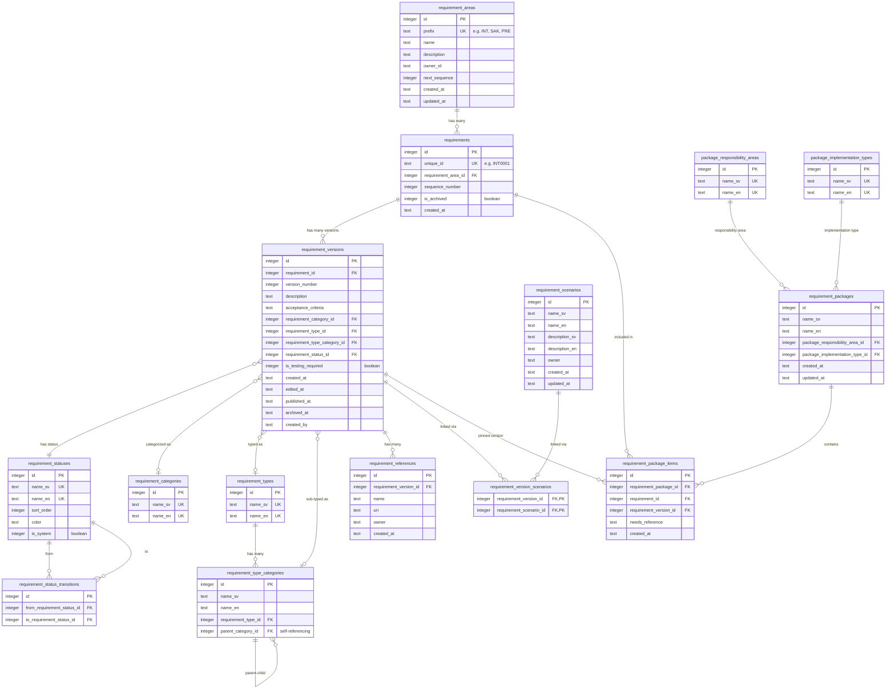
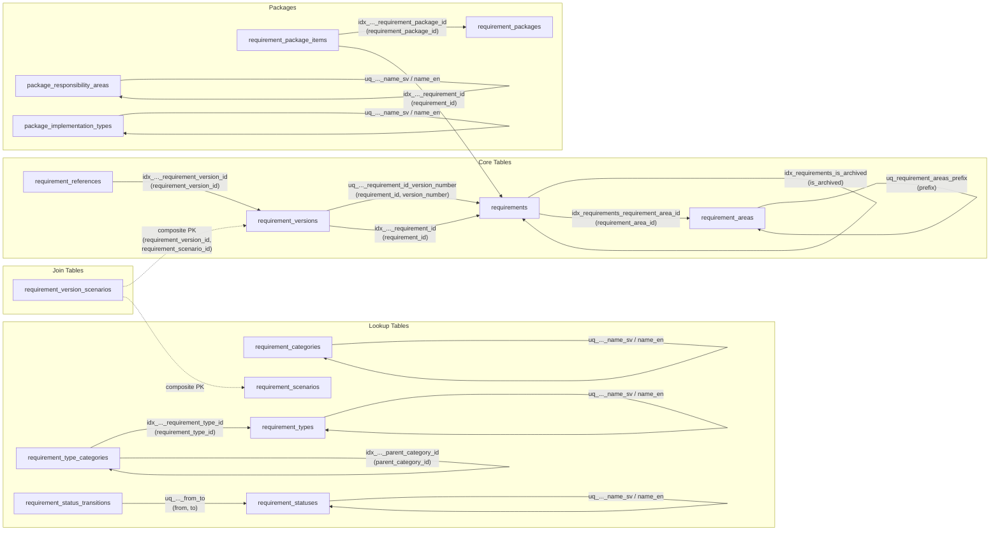

# Database Schema Documentation

This document describes the complete database schema for
**Kravkatalog** — a requirements management system built
on SQLite (Cloudflare D1) using Drizzle ORM.

The schema is defined in [`drizzle/schema.ts`](../drizzle/schema.ts).

---

## Table of Contents

1. [Database Naming Standard](#database-naming-standard)
2. [Entity-Relationship Diagram](#entity-relationship-diagram)
3. [Lookup / Taxonomy Tables](#lookup--taxonomy-tables)
4. [Core Domain Tables](#core-domain-tables)
5. [Join / Bridge Tables](#join--bridge-tables)
6. [Status Workflow](status-workflow)

---

## Database Naming Standard

Apply these rules to all schema objects.

### 1. Global Rules
<!-- cSpell:ignore categorised behaviour -->
- Use **US English** for all identifiers (tables, columns,
  constraints, indexes) — e.g. `categorized`, not `categorised`;
  `behavior`, not `behaviour`
- Use lowercase `snake_case`
- Use ASCII only for identifiers (`a-z`, `0-9`, `_`)
- Do not quote identifiers
- Avoid reserved keywords
- Do not mix naming styles

### 2. Tables

- Plural nouns, `snake_case`
- Examples: `users`, `orders`, `order_items`

### 3. Columns

- Singular, descriptive, `snake_case`
- No abbreviations
- Boolean prefix: `is_`, `has_`, `can_`
- Examples: `email`, `total_amount`, `is_active`

### 4. Primary Key

- Column name: `id`
- Exactly one primary key per table

### 5. Foreign Keys

- Format: `<referenced_table_singular>_id`
- Example: `user_id` references `users(id)`

### 6. Timestamps

- `created_at`, `updated_at`, `deleted_at` (optional)

### 7. Indexes & Constraints

- Primary key: `pk_<table>`
- Foreign key: `fk_<table>_<column>`
- Unique: `uq_<table>_<column>`
- Index: `idx_<table>_<column>`
- Check: `chk_<table>_<column>`

### 8. Data Values and Locale

- Text values **may contain Swedish characters**
  (`å`, `ä`, `ö`) and other Unicode.
- Ensure database/app uses **UTF-8** (or equivalent
  Unicode) encoding for stored text.

### Accepted Exceptions

<!-- markdownlint-disable MD013 -->
| Rule | Exception | Rationale |
| ---- | --------- | --------- |
| 4 | `requirement_version_scenarios` uses composite PK `(requirement_version_id, requirement_scenario_id)` instead of a single `id` | Standard practice for many-to-many join tables; adding a surrogate `id` would add no value. SQLite does not support adding a PK via `ALTER TABLE`. |
<!-- markdownlint-enable MD013 -->

---

## Entity-Relationship Diagram

---

## Lookup / Taxonomy Tables

These tables store reference data (categories, types,
statuses). All user-facing text columns are localized
with `_sv` (Swedish) and `_en` (English) suffixes.

### `requirement_categories`

High-level classification of a requirement's origin.

| Column | Type | Description |
| -------- | ------ | ------------- |
| `id` | integer PK | Auto-increment primary key |
| `name_sv` | text, unique | Swedish display name |
| `name_en` | text, unique | English display name |

**Seed values:** Verksamhetskrav (Business requirement),
IT-krav (IT requirement),
Leverantörskrav (Supplier requirement).

---

### `requirement_types`

Whether a requirement is functional or non-functional.

| Column | Type | Description |
| -------- | ------ | ------------- |
| `id` | integer PK | Auto-increment primary key |
| `name_sv` | text, unique | Swedish display name |
| `name_en` | text, unique | English display name |

**Seed values:** Funktionellt (Functional), Icke-funktionellt (Non-functional).

---

### `requirement_type_categories`

Quality characteristics from **ISO/IEC 25010:2023**.
Forms a self-referencing tree: top-level categories
(e.g. "Security") have children (e.g. "Confidentiality",
"Integrity").

<!-- markdownlint-disable MD013 -->
| Column | Type | Description |
| -------- | ------ | ------------- |
| `id` | integer PK | Auto-increment primary key |
| `name_sv` | text | Swedish display name |
| `name_en` | text | English display name |
| `requirement_type_id` | integer FK → `requirement_types.id` | Which type this category belongs to |
| `parent_category_id` | integer FK → `requirement_type_categories.id` | Parent category (NULL for top-level) |
<!-- markdownlint-enable MD013 -->

**Indexes:**
`idx_requirement_type_categories_requirement_type_id`,
`idx_requirement_type_categories_parent_category_id`.

---

### `requirement_statuses`

Workflow statuses governing the lifecycle of a requirement version.

<!-- markdownlint-disable MD013 -->
| Column | Type | Description |
| -------- | ------ | ------------- |
| `id` | integer PK | Auto-increment primary key |
| `name_sv` | text, unique | Swedish display name |
| `name_en` | text, unique | English display name |
| `sort_order` | integer | Display ordering |
| `color` | text | Hex color code for UI badges |
| `is_system` | boolean (integer) | `true` for built-in statuses that cannot be deleted |
<!-- markdownlint-enable MD013 -->

**Seed values:**

| id | Swedish | English | Color |
| ---- | --------- | --------- | ------- |
| 1 | Utkast | Draft | `#3b82f6` (blue) |
| 2 | Granskning | Review | `#eab308` (yellow) |
| 3 | Publicerad | Published | `#22c55e` (green) |
| 4 | Arkiverad | Archived | `#6b7280` (gray) |

---

### `requirement_status_transitions`

Defines the allowed state-machine transitions between statuses.

<!-- markdownlint-disable MD013 -->
| Column | Type | Description |
| -------- | ------ | ------------- |
| `id` | integer PK | Auto-increment primary key |
| `from_requirement_status_id` | integer FK → `requirement_statuses.id` | Source status |
| `to_requirement_status_id` | integer FK → `requirement_statuses.id` | Target status |
<!-- markdownlint-enable MD013 -->

**Unique constraint:**
`uq_requirement_status_transitions_from_to` on
`(from_requirement_status_id, to_requirement_status_id)`.

**Seed transitions:**

| From | To |
| ------ | ---- |
| Utkast (1) | Granskning (2) |
| Granskning (2) | Publicerad (3) |
| Granskning (2) | Utkast (1) |
| Publicerad (3) | Arkiverad (4) |

---

### `requirement_scenarios`

Describes operational scenarios (e.g. "High load",
"Disaster recovery") that requirement versions can be
linked to.

| Column | Type | Description |
| -------- | ------ | ------------- |
| `id` | integer PK | Auto-increment primary key |
| `name_sv` | text | Swedish name |
| `name_en` | text | English name |
| `description_sv` | text | Swedish description |
| `description_en` | text | English description |
| `owner` | text | Responsible party |
| `created_at` | text (ISO 8601) | Creation timestamp |
| `updated_at` | text (ISO 8601) | Last-modified timestamp |

---

### `package_responsibility_areas`

Classifies the organizational responsibility context for
a requirement package (e.g. management object, project,
assignment).

| Column | Type | Description |
| -------- | ------ | ------------- |
| `id` | integer PK | Auto-increment primary key |
| `name_sv` | text, unique | Swedish display name |
| `name_en` | text, unique | English display name |

**Seed values:** Förvaltningsobjekt (Management object),
Projekt (Project), Uppdrag (Assignment),
Leveransområde (Delivery area),
Tjänsteområde (Service area).

---

### `package_implementation_types`

Describes how a requirement package will be implemented
(e.g. procurement, development).

| Column | Type | Description |
| -------- | ------ | ------------- |
| `id` | integer PK | Auto-increment primary key |
| `name_sv` | text, unique | Swedish display name |
| `name_en` | text, unique | English display name |

**Seed values:** Upphandling (Procurement),
Utveckling (Development).

---

## Core Domain Tables

### `requirement_areas`

Groups requirements into logical domains
(e.g. Integration, Security, Performance). Each area
has a unique prefix used to generate human-readable
requirement IDs.

<!-- markdownlint-disable MD013 -->
| Column | Type | Description |
| -------- | ------ | ------------- |
| `id` | integer PK | Auto-increment primary key |
| `prefix` | text, unique | Short code (e.g. `INT`, `SÄK`, `PRE`) used in `unique_id` |
| `name` | text | Area display name |
| `description` | text | Purpose of the area |
| `owner_id` | text | Identifier of the responsible owner |
| `next_sequence` | integer (default 1) | Next sequence number to assign within this area |
| `created_at` | text (ISO 8601) | Creation timestamp |
| `updated_at` | text (ISO 8601) | Last-modified timestamp |
<!-- markdownlint-enable MD013 -->

---

### `requirements`

The **stable identity** of a requirement. Contains only
the immutable properties; all mutable content lives in
`requirement_versions`.

<!-- markdownlint-disable MD013 -->
| Column | Type | Description |
| -------- | ------ | ------------- |
| `id` | integer PK | Auto-increment primary key |
| `unique_id` | text, unique | Human-readable ID composed of `{area.prefix}{sequence_number zero-padded}` (e.g. `INT0001`) |
| `requirement_area_id` | integer FK → `requirement_areas.id` | The area this requirement belongs to |
| `sequence_number` | integer | Monotonically increasing number within the area |
| `is_archived` | boolean (integer, default false) | Soft-delete flag |
| `created_at` | text (ISO 8601) | Creation timestamp |
<!-- markdownlint-enable MD013 -->

**Indexes:**
`idx_requirements_requirement_area_id`,
`idx_requirements_is_archived`.

---

### `requirement_versions`

A **full snapshot** of a requirement at a specific
version. Every edit creates a new version row, enabling
complete audit history.

<!-- markdownlint-disable MD013 -->
| Column | Type | Description |
| -------- | ------ | ------------- |
| `id` | integer PK | Auto-increment primary key |
| `requirement_id` | integer FK → `requirements.id` | Parent requirement |
| `version_number` | integer | Monotonically increasing version within the requirement |
| `description` | text | The requirement specification text |
| `acceptance_criteria` | text | How to verify the requirement is fulfilled |
| `requirement_category_id` | integer FK → `requirement_categories.id` | Business / IT / Supplier classification (nullable) |
| `requirement_type_id` | integer FK → `requirement_types.id` | Functional / Non-functional (nullable) |
| `requirement_type_category_id` | integer FK → `requirement_type_categories.id` | ISO 25010 quality characteristic (nullable) |
| `requirement_status_id` | integer FK → `requirement_statuses.id` | Current lifecycle status (1=Draft, 2=Review, 3=Published, 4=Archived) |
| `is_testing_required` | boolean (integer, default false) | Whether the requirement must be verified by test |
| `created_at` | text (ISO 8601) | When this version was created |
| `edited_at` | text (ISO 8601) | Last content edit timestamp (nullable) |
| `published_at` | text (ISO 8601) | When status changed to Published (nullable) |
| `archived_at` | text (ISO 8601) | When status changed to Archived (nullable) |
| `created_by` | text | User or system that created this version (nullable) |
<!-- markdownlint-enable MD013 -->

**Unique constraint:**
`uq_requirement_versions_requirement_id_version_number`
on `(requirement_id, version_number)`.
**Indexes:** `idx_requirement_versions_requirement_id`.

**Lifecycle invariant:** `created_at` < `published_at`
< `archived_at` (when applicable).

**Effective status (filtering):** When listing requirements
the system computes a priority-based effective status per
requirement: Published > Archived > Review > Draft. See
[version-lifecycle-dates.md](version-lifecycle-dates.md#effective-status-filtering)
for details. When an archived requirement gets a replacement
Draft or Review version, `requirements.is_archived` stays
`true` until that newer version is published.

---

### `requirement_references`

External references (documents, URLs, standards) linked
to a specific requirement version.

<!-- markdownlint-disable MD013 -->
| Column | Type | Description |
| -------- | ------ | ------------- |
| `id` | integer PK | Auto-increment primary key |
| `requirement_version_id` | integer FK → `requirement_versions.id` | The version this reference belongs to |
| `name` | text | Display name (e.g. "OWASP API Security Top 10") |
| `uri` | text | URL or identifier (nullable) |
| `owner` | text | Responsible party (nullable) |
| `created_at` | text (ISO 8601) | Creation timestamp |
<!-- markdownlint-enable MD013 -->

**Index:** `idx_requirement_references_requirement_version_id`.

---

### `requirement_packages`

A named collection of requirements assembled for a
specific procurement or project.

<!-- markdownlint-disable MD013 -->
| Column | Type | Description |
| -------- | ------ | ------------- |
| `id` | integer PK | Auto-increment primary key |
| `name_sv` | text | Swedish package name |
| `name_en` | text | English package name |
| `package_responsibility_area_id` | integer FK → `package_responsibility_areas.id` | Responsibility area classification (nullable) |
| `package_implementation_type_id` | integer FK → `package_implementation_types.id` | Implementation type classification (nullable) |
| `created_at` | text (ISO 8601) | Creation timestamp |
| `updated_at` | text (ISO 8601) | Last-modified timestamp |
<!-- markdownlint-enable MD013 -->

---

## Join / Bridge Tables

### `requirement_version_scenarios`

Many-to-many link between requirement versions and scenarios.

<!-- markdownlint-disable MD013 -->
| Column | Type | Description |
| -------- | ------ | ------------- |
| `requirement_version_id` | integer FK → `requirement_versions.id` | Composite PK part 1 |
| `requirement_scenario_id` | integer FK → `requirement_scenarios.id` | Composite PK part 2 |
<!-- markdownlint-enable MD013 -->

**Primary key:**
`(requirement_version_id, requirement_scenario_id)`.

---

### `requirement_package_items`

Links individual requirements (pinned to a specific version) into a package.

<!-- markdownlint-disable MD013 -->
| Column | Type | Description |
| -------- | ------ | ------------- |
| `id` | integer PK | Auto-increment primary key |
| `requirement_package_id` | integer FK → `requirement_packages.id` | Parent package |
| `requirement_id` | integer FK → `requirements.id` | The requirement being included |
| `requirement_version_id` | integer FK → `requirement_versions.id` | Pinned version snapshot |
| `needs_reference` | text | Business justification for including this requirement (nullable) |
| `created_at` | text (ISO 8601) | When the item was added |
<!-- markdownlint-enable MD013 -->

**Indexes:**
`idx_requirement_package_items_requirement_package_id`,
`idx_requirement_package_items_requirement_id`.

---

## Indexes & Constraints Reference

Every index and unique constraint in the schema, with
its purpose and the table/column(s) it covers.

### Unique Indexes

<!-- markdownlint-disable MD013 -->
| Index Name | Table | Column(s) | Purpose |
| ---------- | ----- | --------- | ------- |
| `uq_requirement_areas_prefix` | `requirement_areas` | `prefix` | Ensures each area has a distinct short code (e.g. `INT`, `PRE`) |
| `uq_requirement_categories_name_sv` | `requirement_categories` | `name_sv` | Prevents duplicate Swedish category names |
| `uq_requirement_categories_name_en` | `requirement_categories` | `name_en` | Prevents duplicate English category names |
| `uq_requirement_types_name_sv` | `requirement_types` | `name_sv` | Prevents duplicate Swedish type names |
| `uq_requirement_types_name_en` | `requirement_types` | `name_en` | Prevents duplicate English type names |
| `uq_requirement_statuses_name_sv` | `requirement_statuses` | `name_sv` | Prevents duplicate Swedish status names |
| `uq_requirement_statuses_name_en` | `requirement_statuses` | `name_en` | Prevents duplicate English status names |
| `uq_requirement_status_transitions_from_to` | `requirement_status_transitions` | `(from_requirement_status_id, to_requirement_status_id)` | Prevents duplicate transition rules |
| `uq_requirements_unique_id` | `requirements` | `unique_id` | Ensures each requirement has a distinct human-readable ID |
| `uq_requirement_versions_requirement_id_version_number` | `requirement_versions` | `(requirement_id, version_number)` | Ensures version numbers are unique per requirement |
| `uq_package_responsibility_areas_name_sv` | `package_responsibility_areas` | `name_sv` | Prevents duplicate Swedish responsibility area names |
| `uq_package_responsibility_areas_name_en` | `package_responsibility_areas` | `name_en` | Prevents duplicate English responsibility area names |
| `uq_package_implementation_types_name_sv` | `package_implementation_types` | `name_sv` | Prevents duplicate Swedish implementation type names |
| `uq_package_implementation_types_name_en` | `package_implementation_types` | `name_en` | Prevents duplicate English implementation type names |
<!-- markdownlint-enable MD013 -->

### Non-Unique Indexes

<!-- markdownlint-disable MD013 -->
| Index Name | Table | Column(s) | Purpose |
| ---------- | ----- | --------- | ------- |
| `idx_requirement_type_categories_requirement_type_id` | `requirement_type_categories` | `requirement_type_id` | Speed up lookups of categories belonging to a type |
| `idx_requirement_type_categories_parent_category_id` | `requirement_type_categories` | `parent_category_id` | Speed up tree traversal (parent → children) |
| `idx_requirements_requirement_area_id` | `requirements` | `requirement_area_id` | Speed up listing requirements by area |
| `idx_requirements_is_archived` | `requirements` | `is_archived` | Speed up filtering active vs archived requirements |
| `idx_requirement_versions_requirement_id` | `requirement_versions` | `requirement_id` | Speed up fetching all versions of a requirement |
| `idx_requirement_references_requirement_version_id` | `requirement_references` | `requirement_version_id` | Speed up fetching references for a version |
| `idx_requirement_package_items_requirement_package_id` | `requirement_package_items` | `requirement_package_id` | Speed up listing items in a package |
| `idx_requirement_package_items_requirement_id` | `requirement_package_items` | `requirement_id` | Speed up finding which packages contain a requirement |
<!-- markdownlint-enable MD013 -->

### Index Relationship Diagram

<!-- markdownlint-disable MD013 -->

<!-- markdownlint-enable MD013 -->
