# Database Schema Documentation

This document describes the complete database schema for
**Kravbibliotek** — a requirements management system built
on Microsoft SQL Server using TypeORM.

The schema is defined by TypeORM entities under
[`lib/typeorm/entities/`](../lib/typeorm/entities/). Migrations live in
[`typeorm/migrations/`](../typeorm/migrations/) and seed profiles in
[`typeorm/seed.mjs`](../typeorm/seed.mjs). Required seed data contains system
and lookup rows; demo seed data contains optional examples and test fixtures.
The developer setup, browse workflow, and CLI reference live in
[sql-server-developer-workflow.md](./sql-server-developer-workflow.md).

---

## Table of Contents

1. [Database Naming Standard](#database-naming-standard)
2. [Entity-Relationship Diagram](#entity-relationship-diagram)
3. [Lookup / Taxonomy Tables](#lookup--taxonomy-tables)
4. [UI Settings Tables](#ui-settings-tables)
5. [Core Domain Tables](#core-domain-tables)
6. [Access Review Tables](#access-review-tables)
7. [Application Action Log Tables](#application-action-log-tables)
8. [Join / Bridge Tables](#join--bridge-tables)
9. [Requirement Version Status Workflow](#requirement-version-status-workflow)

---

## Database Naming Standard

Apply these rules to all schema objects.

### 1. Global Rules
<!-- cSpell:ignore categorised behaviour -->
- Use **US English** for all identifiers (tables, columns,
  constraints, indexes) — e.g. `categorized`, not `categorised`;
  `behavior`, not `behaviour`
- Use lowercase `snake_case`
- Use ASCII only for identifiers (`a-z`, `0-9`, `_`)
- Do not quote identifiers
- Avoid reserved keywords
- Do not mix naming styles

### 2. Tables

- Plural nouns, `snake_case`
- Examples: `users`, `orders`, `order_items`

### 3. Columns

- Singular, descriptive, `snake_case`
- No abbreviations
- Boolean prefix: `is_`, `has_`, `can_`
- Examples: `email`, `total_amount`, `is_active`

### 4. Primary Key

- Column name: `id`
- Exactly one primary key per table

### 5. Foreign Keys

- Format: `<referenced_table_singular>_id`
- Example: `user_id` references `users(id)`

### 6. Timestamps

- `created_at`, `updated_at`, `deleted_at` (optional)

### 7. Indexes & Constraints

- Primary key: `pk_<table>`
- Foreign key: `fk_<table>_<column>`
- Unique: `uq_<table>_<column>`
- Index: `idx_<table>_<column>`
- Check: `chk_<table>_<column>`

### 8. Data Values and Locale

- Text values **may contain Swedish characters**
  (`å`, `ä`, `ö`) and other Unicode.
- Ensure database/app uses **UTF-8** (or equivalent
  Unicode) encoding for stored text.

### Accepted Exceptions

<!-- markdownlint-disable MD013 -->
| Rule | Exception | Rationale |
| ---- | --------- | --------- |
| 4 | `requirement_version_requirement_packages` uses composite PK `(requirement_version_id, requirement_package_id)` instead of a single `id` | Standard practice for many-to-many join tables; adding a surrogate `id` would add no value. |
| 4 | `requirement_version_norm_references` uses composite PK `(requirement_version_id, norm_reference_id)` instead of a single `id` | Same rationale as the requirement-packages join table above. |
| 4 | `requirement_area_co_authors` uses composite PK `(area_id, hsa_id)` instead of a single `id` | The live co-author assignment is naturally keyed by requirement area plus durable HSA-ID; a surrogate `id` would not improve identity or lookup semantics. |
| 4 | `specification_co_authors` uses composite PK `(specification_id, hsa_id)` instead of a single `id` | The live co-author assignment is naturally keyed by specification plus durable HSA-ID; a surrogate `id` would not improve identity or lookup semantics. |
| 4 | `requirement_responsibility_people` uses HSA-ID as the primary key instead of a single `id` | Kravansvarsperson is keyed by the durable HSA-ID used by all live responsibility assignments. |
| 4 | `requirement_package_co_authors` uses composite PK `(requirement_package_id, hsa_id)` instead of a single `id` | The live co-author assignment is naturally keyed by requirement package plus durable HSA-ID; a surrogate `id` would not improve identity or lookup semantics. |
| 4 | `requirement_selection_question_sequences` uses `area_id` as its PK instead of a single `id` | The sequence row is intentionally named after the requirement area it allocates codes for, making the one-row-per-area contract clear while leaving room for future schema changes. |
| 4 | `specification_local_requirement_requirement_packages` uses composite PK `(specification_local_requirement_id, requirement_package_id)` instead of a single `id` | Same rationale as the version-based requirement-packages join table above. |
| 4 | `specification_local_requirement_norm_references` uses composite PK `(specification_local_requirement_id, norm_reference_id)` instead of a single `id` | Same rationale as the version-based norm-references join table above. |
| Localized columns | `norm_references.name`, `norm_references.type`, `norm_references.issuer` are single-language columns | Norm references are external legal/regulatory documents (e.g. laws, ISO standards) with proper names in their source language. Localizing them would be factually incorrect — "SFS 2018:218" and "Riksdagen" do not have per-locale translations. |
| Versioning | `requirement_version_norm_references` stores only FK IDs, not snapshots of mutable `norm_references` fields (`name`, `type`, `reference`, `version`, `issuer`, `uri`, `is_archived`) | Norm references are shared external documents whose metadata should reflect the latest known state across all requirement versions. Snapshotting would create stale duplicates of external metadata that the system does not own. If point-in-time fidelity is needed in the future, a dedicated snapshot table can be added without breaking the current schema. |
<!-- markdownlint-enable MD013 -->

---

## Entity-Relationship Diagram

<!-- markdownlint-disable MD013 -->
```mermaid
erDiagram
    requirement_areas {
        integer id PK
        text prefix UK "e.g. INT, SAK, PRE"
        text name
        text description
        text owner_hsa_id FK
        integer next_sequence
        text created_at
        text updated_at
    }

    requirement_categories {
        integer id PK
        text name_sv UK
        text name_en UK
    }

    requirement_types {
        integer id PK
        text name_sv UK
        text name_en UK
    }

    quality_characteristics {
        integer id PK
        text name_sv
        text name_en
        text chapter_id
        integer requirement_type_id FK
        integer parent_id FK "self-referencing"
    }

    requirement_statuses {
        integer id PK
        text name_sv UK
        text name_en UK
        integer sort_order
        text color
        text icon_name
        integer is_system "boolean"
    }

    risk_levels {
        integer id PK
        text name_sv UK
        text name_en UK
        integer sort_order
        text color
        text icon_name
    }

    requirement_status_transitions {
        integer id PK
        integer from_requirement_status_id FK
        integer to_requirement_status_id FK
    }

    requirement_list_column_defaults {
        integer id PK
        text column_id UK
        integer sort_order UK
        integer is_default_visible "boolean"
        text updated_at
    }

    requirements {
        integer id PK
        text unique_id UK "e.g. INT0001"
        integer requirement_area_id FK
        integer sequence_number
        integer is_archived "boolean"
        text created_at
    }

    requirement_versions {
        integer id PK
        text revision_token UK "uniqueidentifier"
        integer requirement_id FK
        integer version_number
        text description
        text acceptance_criteria
        integer requirement_category_id FK
        integer requirement_type_id FK
        integer quality_characteristic_id FK
        integer risk_level_id FK
        integer requirement_status_id FK
        integer is_testing_required "boolean"
        text verification_method
        text created_at
        text edited_at
        text published_at
        text archive_initiated_at
        text archived_at
        text status_updated_at
        integer has_specification_item_history "boolean"
        text created_by
        text created_by_hsa_id
    }

    norm_references {
        integer id PK
        text norm_reference_id UK
        text name
        text type
        text reference
        text version
        text issuer
        text uri
        integer is_archived "boolean"
        text created_at
        text updated_at
    }

    requirement_packages {
        integer id PK
        text name
        text description
        text lead_hsa_id FK
        integer is_archived
        text created_at
        text updated_at
    }

    requirement_responsibility_people {
        text hsa_id PK
        text given_name
        text middle_name
        text surname
        text email
        text last_fetched_at
        text created_at
        text updated_at
    }

    requirement_selection_question_sequences {
        integer area_id PK, FK
        integer next_sequence
    }

    requirement_selection_questions {
        integer id PK
        integer area_id FK
        text question_code UK
        text question_text
        text help_text
        text selection_type
        integer sort_order
        integer is_active
        integer is_archived
        text archived_at
        text created_at
        text updated_at
    }

    requirement_selection_answers {
        integer id PK
        integer question_id FK
        text answer_text
        text description
        integer sort_order
        integer is_no_requirement_selection
        integer is_active
        integer is_archived
        text archived_at
        text created_at
        text updated_at
    }

    requirement_selection_question_visibility_groups {
        integer id PK
        integer question_id FK
        integer sort_order
        text created_at
        text updated_at
    }

    requirement_selection_question_visibility_conditions {
        integer id PK
        integer visibility_group_id FK
        integer parent_question_id FK
        integer answer_id FK
        integer sort_order
        text created_at
        text updated_at
    }

    requirement_selection_answer_packages {
        integer answer_id FK, PK
        integer requirement_package_id FK, PK
    }

    requirement_selection_answer_requirements {
        integer answer_id FK, PK
        integer requirement_id FK, PK
    }

    specification_requirement_selection_answers {
        integer specification_id FK, PK
        integer question_id FK, PK
        integer answer_id FK, PK
        integer is_historical
        text changed_at
        text changed_by_hsa_id
        text changed_by_display_name
    }

    requirement_version_requirement_packages {
        integer requirement_version_id FK, PK
        integer requirement_package_id FK, PK
    }

    requirement_version_norm_references {
        integer requirement_version_id FK, PK
        integer norm_reference_id FK, PK
    }

    specification_governance_object_types {
        integer id PK
        text name_sv UK
        text name_en UK
    }

    specification_implementation_types {
        integer id PK
        text name_sv UK
        text name_en UK
    }

    specification_lifecycle_statuses {
        integer id PK
        text name_sv UK
        text name_en UK
    }

    specification_item_statuses {
        integer id PK
        text name_sv UK
        text name_en UK
        text description_sv
        text description_en
        text color
        text icon_name
        integer sort_order
    }

    requirements_specifications {
        integer id PK
        text unique_id UK
        text name
        integer local_requirement_next_sequence
        integer specification_governance_object_type_id FK
        integer specification_implementation_type_id FK
        integer specification_lifecycle_status_id FK
        text business_needs_reference
        text responsible_hsa_id FK
        integer can_responsible_generate_ai "boolean"
        text created_at
        text updated_at
    }

    specification_needs_references {
        integer id PK
        integer specification_id FK
        text text
        text description
        text created_at
        text updated_at
    }

    specification_local_requirements {
        integer id PK
        integer specification_id FK
        text unique_id
        integer sequence_number
        text description
        text acceptance_criteria
        integer requirement_category_id FK
        integer requirement_type_id FK
        integer quality_characteristic_id FK
        integer risk_level_id FK
        integer is_testing_required
        text verification_method
        integer needs_reference_id FK
        integer specification_item_status_id FK
        text note
        text status_updated_at
        text created_at
        text updated_at
    }

    specification_local_requirement_requirement_packages {
        integer specification_local_requirement_id PK, FK
        integer requirement_package_id PK, FK
    }

    specification_local_requirement_norm_references {
        integer specification_local_requirement_id PK, FK
        integer norm_reference_id PK, FK
    }

    specification_local_requirement_deviations {
        integer id PK
        integer specification_local_requirement_id FK
        text motivation
        integer is_review_requested
        integer decision
        text decision_motivation
        text decided_by
        text decided_by_hsa_id
        text decided_at
        text created_by
        text created_by_hsa_id
        text created_at
        text updated_at
    }

    requirements_specification_items {
        integer id PK
        integer requirements_specification_id FK
        integer requirement_id FK
        integer requirement_version_id FK
        integer needs_reference_id FK
        integer specification_item_status_id FK
        text note
        text status_updated_at
        text unused_1
        text created_at
    }

    deviations {
        integer id PK
        integer specification_item_id FK
        text motivation
        integer is_review_requested
        integer decision
        text decision_motivation
        text decided_by
        text decided_by_hsa_id
        text decided_at
        text created_by
        text created_by_hsa_id
        text created_at
        text updated_at
    }

    requirement_area_co_authors {
        integer area_id PK, FK
        text hsa_id PK, FK
        integer can_generate_ai "boolean"
        text created_at
        text created_by_hsa_id
        text created_by_display_name
    }

    specification_co_authors {
        integer specification_id PK, FK
        text hsa_id PK, FK
        integer can_generate_ai "boolean"
        text created_at
        text created_by_hsa_id
        text created_by_display_name
    }

    requirement_package_co_authors {
        integer requirement_package_id PK, FK
        text hsa_id PK, FK
        text created_at
        text created_by_hsa_id
        text created_by_display_name
    }

    access_review_runs {
        integer id PK
        text status
        text period_start
        text period_end
        text due_at
        text created_at
        text updated_at
        text created_by_hsa_id
        text created_by_display_name
        text reviewer_hsa_id
        text reviewer_display_name
        text external_evidence_reference
        text completed_at
        text completed_by_hsa_id
        text completed_by_display_name
    }

    access_review_items {
        integer id PK
        integer run_id FK
        text source_key
        text source_table
        text principal_hsa_id
        text principal_display_name
        text scope_type
        text scope_key
        text scope_label
        text permission_type
        integer can_generate_ai "boolean"
        text decision
        text decided_at
        text decided_by_hsa_id
        text decided_by_display_name
        text comment
        text created_at
    }

    action_audit_events {
        bigint id PK
        datetime occurred_at
        text actor_hsa_id
        text actor_display_name
        text actor_kind
        text actor_client_id
        text action
        text target_kind
        text target_id
        text target_unique_id
        text decision
        text denial_reason
        text request_id
        text correlation_id
        text client_ip
        text details_json
    }

    archiving_retention_policies {
        integer id PK
        text policy_key UK
        text information_set
        text action
        integer age_days
        text status_condition
        integer is_enabled "boolean"
        text decision_reference
        text last_run_at
        text created_at
        text updated_at
    }

    archiving_retention_runs {
        integer id PK
        integer policy_id FK
        text status
        text started_at
        text completed_at
        text executed_by_hsa_id
        text executed_by_display_name
        text preview_token
        integer candidate_count
        integer archived_count
        integer deleted_count
        integer skipped_count
        integer exception_count
    }

    archiving_retention_exceptions {
        integer id PK
        integer policy_id FK
        text source_key
        text subject_table
        text subject_id
        text reason
        text created_by_hsa_id
        text created_by_display_name
        text created_at
        text expires_at
    }

    %% Relationships
    requirement_responsibility_people ||--o{ requirement_areas : "owns areas"
    requirement_responsibility_people ||--o{ requirement_area_co_authors : "assigned to areas"
    requirement_responsibility_people ||--o{ requirements_specifications : "leads specifications"
    requirement_responsibility_people ||--o{ specification_co_authors : "assigned to specifications"
    requirement_responsibility_people ||--o{ requirement_packages : "leads packages"
    requirement_responsibility_people ||--o{ requirement_package_co_authors : "assigned to packages"
    requirement_areas ||--o{ requirement_area_co_authors : "has co-authors"
    requirement_areas ||--o{ requirements : "has many"
    requirements ||--o{ requirement_versions : "has many versions"
    requirement_versions }o--|| requirement_statuses : "requirement version status"
    requirement_versions }o--o| requirement_categories : "categorized as"
    requirement_versions }o--o| requirement_types : "typed as"
    requirement_versions }o--o| quality_characteristics : "sub-typed as"
    requirement_versions }o--o| risk_levels : "risk level"
    requirement_versions ||--o{ requirement_version_requirement_packages : "linked via"
    requirement_packages ||--o{ requirement_version_requirement_packages : "linked via"
    requirement_packages ||--o{ requirement_package_co_authors : "has co-authors"
    requirement_versions ||--o{ requirement_version_norm_references : "linked via"
    norm_references ||--o{ requirement_version_norm_references : "linked via"
    requirement_types ||--o{ quality_characteristics : "has many"
    quality_characteristics ||--o{ quality_characteristics : "parent-child"
    requirement_statuses ||--o{ requirement_status_transitions : "from"
    requirement_statuses ||--o{ requirement_status_transitions : "to"
    requirement_areas ||--|| requirement_selection_question_sequences : "allocates KUF codes"
    requirement_areas ||--o{ requirement_selection_questions : "owns"
    requirement_selection_questions ||--o{ requirement_selection_answers : "has answers"
    requirement_selection_questions ||--o{ requirement_selection_question_visibility_groups : "has visibility groups"
    requirement_selection_question_visibility_groups ||--o{ requirement_selection_question_visibility_conditions : "has conditions"
    requirement_selection_questions ||--o{ requirement_selection_question_visibility_conditions : "parent question"
    requirement_selection_answers ||--o{ requirement_selection_question_visibility_conditions : "trigger answer"
    requirement_selection_answers ||--o{ requirement_selection_answer_packages : "links packages"
    requirement_packages ||--o{ requirement_selection_answer_packages : "selected by answers"
    requirement_selection_answers ||--o{ requirement_selection_answer_requirements : "links requirements"
    requirements ||--o{ requirement_selection_answer_requirements : "selected by answers"
    requirements_specifications ||--o{ specification_requirement_selection_answers : "stores selections"
    requirement_selection_questions ||--o{ specification_requirement_selection_answers : "historical question"
    requirement_selection_answers ||--o{ specification_requirement_selection_answers : "historical answer"
    requirements_specifications ||--o{ specification_needs_references : "stores needs references"
    requirements_specifications ||--o{ specification_co_authors : "has co-authors"
    requirements_specifications ||--o{ requirements_specification_items : "contains"
    requirements_specifications ||--o{ specification_local_requirements : "contains local"
    specification_governance_object_types ||--o{ requirements_specifications : "governance object type"
    specification_implementation_types ||--o{ requirements_specifications : "implementation type"
    specification_lifecycle_statuses ||--o{ requirements_specifications : "specification lifecycle status"
    specification_item_statuses ||--o{ requirements_specification_items : "usage status"
    specification_item_statuses ||--o{ specification_local_requirements : "usage status"
    specification_needs_references ||--o{ requirements_specification_items : "scoped needs reference"
    specification_needs_references ||--o{ specification_local_requirements : "scoped needs reference"
    requirements ||--o{ requirements_specification_items : "included in"
    requirement_versions ||--o{ requirements_specification_items : "pinned version"
    requirements_specification_items ||--o{ deviations : "has deviations"
    requirement_categories ||--o{ specification_local_requirements : "categorized as"
    requirement_types ||--o{ specification_local_requirements : "typed as"
    quality_characteristics ||--o{ specification_local_requirements : "sub-typed as"
    risk_levels ||--o{ specification_local_requirements : "risk level"
    specification_local_requirements ||--o{ specification_local_requirement_requirement_packages : "linked via"
    requirement_packages ||--o{ specification_local_requirement_requirement_packages : "linked via"
    specification_local_requirements ||--o{ specification_local_requirement_norm_references : "linked via"
    norm_references ||--o{ specification_local_requirement_norm_references : "linked via"
    specification_local_requirements ||--o{ specification_local_requirement_deviations : "has deviations"
    access_review_runs ||--o{ access_review_items : "snapshots assignments"
    archiving_retention_policies ||--o{ archiving_retention_runs : "records executions"
    archiving_retention_policies ||--o{ archiving_retention_exceptions : "has exceptions"

    improvement_suggestions {
        integer id PK
        integer requirement_id FK
        integer requirement_version_id FK
        text content
        text created_by
        text created_by_hsa_id
        integer is_review_requested
        text review_requested_at
        integer resolution
        text resolution_motivation
        text resolved_by
        text resolved_by_hsa_id
        text resolved_at
        text created_at
        text updated_at
    }

    requirements ||--o{ improvement_suggestions : "has suggestions"
    requirement_versions ||--o{ improvement_suggestions : "version suggestions"
```
<!-- markdownlint-enable MD013 -->

---

## Lookup / Taxonomy Tables

These tables store app-owned reference data. Taxonomy tables cover
classifications such as categories, types and risk levels, while status tables
cover requirement version statuses, usage statuses and lifecycle statuses. All
user-facing text columns are localized with `_sv` (Swedish) and `_en`
suffixes.

These are business-domain reference-data tables. UI configuration is documented
separately under [UI Settings Tables](#ui-settings-tables).

### `requirement_categories`

High-level classification of a requirement's origin.

| Column | Type | Description |
| -------- | ------ | ------------- |
| `id` | integer PK | Auto-increment primary key |
| `name_sv` | text, unique | Swedish display name |
| `name_en` | text, unique | English display name |

**Seed values:** Verksamhetskrav (Business requirement),
IT-krav (IT requirement),
Leverantörskrav (Supplier requirement).

---

### `requirement_types`

Whether a requirement is functional or non-functional.

| Column | Type | Description |
| -------- | ------ | ------------- |
| `id` | integer PK | Auto-increment primary key |
| `name_sv` | text, unique | Swedish display name |
| `name_en` | text, unique | English display name |

**Seed values:** Funktionellt (Functional), Icke-funktionellt (Non-functional).

---

### `quality_characteristics`

Quality characteristics from **ISO/IEC 25010:2023**.
Forms a self-referencing tree: top-level categories
(e.g. "Security") have children (e.g. "Confidentiality",
"Integrity").

<!-- markdownlint-disable MD013 -->
| Column | Type | Description |
| -------- | ------ | ------------- |
| `id` | integer PK | Auto-increment primary key |
| `name_sv` | text | Swedish display name |
| `name_en` | text | English display name |
| `chapter_id` | text | ISO/IEC 25010 chapter number (e.g. `3.1.1`) |
| `requirement_type_id` | integer FK → `requirement_types.id` | Which type this category belongs to |
| `parent_id` | integer FK → `quality_characteristics.id` | Parent category (NULL for top-level) |
<!-- markdownlint-enable MD013 -->

The seed catalog contains 49 ISO/IEC 25010:2023 quality-characteristic rows.

**Indexes:**
`idx_quality_characteristics_requirement_type_id`,
`idx_quality_characteristics_parent_id`.

---

### `requirement_statuses`

Requirement version statuses governing the lifecycle of a requirement version.

<!-- markdownlint-disable MD013 -->
| Column | Type | Description |
| -------- | ------ | ------------- |
| `id` | integer PK | Auto-increment primary key |
| `name_sv` | text, unique | Swedish display name |
| `name_en` | text, unique | English display name |
| `sort_order` | integer | Display ordering |
| `color` | text | Hex color code for UI badges |
| `icon_name` | text | Allowed lucide icon name (nullable) |
| `is_system` | boolean (integer) | `true` for built-in requirement version statuses that cannot be deleted |
<!-- markdownlint-enable MD013 -->

**Seed values:**

| id | Swedish | English | Color | Icon |
| ---- | --------- | --------- | ------- | ------ |
| 1 | Utkast | Draft | `#3b82f6` (blue) | `PenLine` |
| 2 | Granskning | Review | `#eab308` (yellow) | `Eye` |
| 3 | Publicerad | Published | `#22c55e` (green) | `CheckCircle2` |
| 4 | Arkiverad | Archived | `#6b7280` (gray) | `Archive` |

---

### `requirement_status_transitions`

Defines the allowed state-machine transitions between requirement version statuses.

<!-- markdownlint-disable MD013 -->
| Column | Type | Description |
| -------- | ------ | ------------- |
| `id` | integer PK | Auto-increment primary key |
| `from_requirement_status_id` | integer FK → `requirement_statuses.id` | Source requirement version status |
| `to_requirement_status_id` | integer FK → `requirement_statuses.id` | Target requirement version status |
<!-- markdownlint-enable MD013 -->

**Unique constraint:**
`uq_requirement_status_transitions_from_to` on
`(from_requirement_status_id, to_requirement_status_id)`.

**Seed transitions:**

| From | To |
| ------ | ---- |
| Utkast (1) | Granskning (2) |
| Granskning (2) | Publicerad (3) |
| Granskning (2) | Utkast (1) |
| Publicerad (3) | Granskning (2) |
| Granskning (2) | Arkiverad (4) |

---

### Requirement Version Status Workflow

The seeded requirement workflow is:

`Utkast` → `Granskning` → `Publicerad`

Archiving uses a two-step review process:

`Publicerad` → `Granskning` (archiving review)
→ `Arkiverad`

The schema also allows `Granskning` → `Utkast`
(reject back to draft).

---

### `risk_levels`

Classifies the risk associated with a requirement.

| Column | Type | Description |
| ------------ | --------------- | ----------------------------- |
| `id` | integer PK | Auto-increment primary key |
| `name_sv` | text, unique | Swedish display name |
| `name_en` | text, unique | English display name |
| `sort_order` | integer | Display ordering |
| `color` | text | Hex color code for UI badges |
| `icon_name` | text | Allowed lucide icon name (nullable) |

**Seed values:**

| id | Swedish | English | Color | Icon |
| ---- | ------- | ------- | ------------------- | ------ |
| 1 | Låg | Low | `#22c55e` (green) | `ArrowDownLeft` |
| 2 | Medel | Medium | `#eab308` (yellow) | `AlertCircle` |
| 3 | Hög | High | `#ef4444` (red) | `AlertTriangle` |

---

### `requirement_responsibility_people`

Stores HSA-ID-keyed person information used by live requirement responsibility
assignments. The table is not an application user table; it exists to avoid
duplicating names and e-mail addresses across active owner, lead and co-author
assignments.

<!-- markdownlint-disable MD013 -->
| Column | Type | Description |
| -------- | ------ | ------------- |
| `hsa_id` | text PK | Durable HSA-ID for the responsibility person |
| `given_name` | text | Given name from the HSA lookup, or the migration placeholder until refreshed |
| `middle_name` | text | Middle name from the HSA lookup (nullable) |
| `surname` | text | Surname from the HSA lookup (nullable) |
| `email` | text | E-mail address from the HSA lookup (nullable) |
| `last_fetched_at` | text (ISO 8601) | Last successful HSA lookup timestamp, null for migration placeholders |
| `created_at` | text (ISO 8601) | Creation timestamp |
| `updated_at` | text (ISO 8601) | Last refresh timestamp |
<!-- markdownlint-enable MD013 -->

Rows are created or refreshed only in authorized edit/save flows. Read-only
views join to this table and do not perform HSA lookups.

---

### `requirement_packages`

Describes requirement packages (for example "Mobile use",
"Data migration", or "Cloud operations") that requirement versions can
be linked to.

> **Applicability / Tillämpningsbarhet.**
> Requirement packages also serve as the mechanism for
> expressing *applicability* — i.e. in which contexts or
> environments a requirement applies. Instead of a
> separate applicability table, create requirement packages
> such as "All systems", "Protected data", or
> "Public services" and link them to requirement
> versions via `requirement_version_requirement_packages`.
> The many-to-many relation lets a single requirement
> apply to multiple contexts.

<!-- markdownlint-disable MD013 -->
| Column | Type | Description |
| -------- | ------ | ------------- |
| `id` | integer PK | Auto-increment primary key |
| `name` | text | Authored package name |
| `description` | text | Authored package description (nullable) |
| `lead_hsa_id` | text FK → `requirement_responsibility_people.hsa_id` | Requirement-package lead HSA-ID |
| `is_archived` | integer | Soft archive flag |
| `created_at` | text (ISO 8601) | Creation timestamp |
| `updated_at` | text (ISO 8601) | Last-modified timestamp |
<!-- markdownlint-enable MD013 -->

**Indexes:**
`idx_requirement_packages_lead_hsa_id`,
`idx_requirement_packages_is_archived`.

**Seed values:**

| id | Name | Lead |
| ---- | ------- | ---- |
| 1 | Mobil användning | Anna Johansson |
| 2 | Datamigrering | Anna Johansson |
| 3 | Integration med andra system | Erik Lindberg |
| 4 | Ärendehantering | Erik Lindberg |
| 5 | Användarvänlighet | Fatima Hassan |
| 6 | Molndrift | Fatima Hassan |
| 7 | Normal drift | Anna Johansson |
| 8 | Hög belastning | Erik Lindberg |
| 9 | Katastrofåterställning | Fatima Hassan |

---

### `requirement_selection_question_sequences`

Tracks the next `{AREA}-KUF###` sequence per requirement area.

<!-- markdownlint-disable MD013 -->
| Column | Type | Description |
| -------- | ------ | ------------- |
| `area_id` | integer FK → `requirement_areas.id` (CASCADE DELETE), PK | Requirement area |
| `next_sequence` | integer | Next sequence number to assign |
<!-- markdownlint-enable MD013 -->

**Demo seed:** `npm run db:seed:demo` adds sequence rows with
`next_sequence = 2` for `SÄK`, `INT`, `ANV`, `RAP`, and `KVA`, and
`next_sequence = 5` for `DRF`, matching the seeded `DRF-KUF001` through
`DRF-KUF004` questions.

### `requirement_selection_questions`

Question definitions maintained under requirement-library stewardship. Questions
are always optional; there is no required flag and no unanswered-question
validation.

<!-- markdownlint-disable MD013 -->
| Column | Type | Description |
| -------- | ------ | ------------- |
| `id` | integer PK | Auto-increment primary key |
| `area_id` | integer FK → `requirement_areas.id` | Immutable requirement-area ownership |
| `question_code` | text, unique | Stable `{AREA}-KUF###` code |
| `question_text` | text | User-facing question |
| `help_text` | text | Optional guidance |
| `selection_type` | text | `single` or `multiple` |
| `sort_order` | integer | Display ordering within the area |
| `is_active` | integer | Active flag |
| `is_archived` | integer | Soft archive flag |
| `archived_at` | text (ISO 8601) | When the question was archived for retention aging |
| `created_at` | text (ISO 8601) | Creation timestamp |
| `updated_at` | text (ISO 8601) | Last-modified timestamp |
<!-- markdownlint-enable MD013 -->

**Indexes and constraints:** `uq_requirement_selection_questions_question_code`,
`idx_requirement_selection_questions_area_sort_order`,
`idx_requirement_selection_questions_state`,
`idx_requirement_selection_questions_archived_at`,
`chk_requirement_selection_questions_selection_type`,
`chk_requirement_selection_questions_state`.

**Demo seed:** the demo profile contains nine active stewardship questions:
`SÄK-KUF001`, `INT-KUF001`, `DRF-KUF001`, `DRF-KUF002`, `DRF-KUF003`,
`DRF-KUF004`, `ANV-KUF001`, `RAP-KUF001`, and `KVA-KUF001`.

### `requirement_selection_answers`

Answer options for a requirement-selection question. A special
`is_no_requirement_selection` answer represents "Utan kravurval" and cannot be
combined with requirement or package links. New answer options are active by
default. Active answers may temporarily have no current links; the UI reports
that derived health state as `Saknar kravurval`.

<!-- markdownlint-disable MD013 -->
| Column | Type | Description |
| -------- | ------ | ------------- |
| `id` | integer PK | Auto-increment primary key |
| `question_id` | integer FK → `requirement_selection_questions.id` (CASCADE DELETE) | Owning question |
| `answer_text` | text | User-facing answer text |
| `description` | text | Optional explanation |
| `sort_order` | integer | Display ordering within the question |
| `is_no_requirement_selection` | integer | Marks the answer as selecting no requirements |
| `is_active` | integer | Active flag |
| `is_archived` | integer | Soft archive flag |
| `archived_at` | text (ISO 8601) | When the answer was archived for retention aging |
| `created_at` | text (ISO 8601) | Creation timestamp |
| `updated_at` | text (ISO 8601) | Last-modified timestamp |
<!-- markdownlint-enable MD013 -->

**Indexes and constraints:**
`idx_requirement_selection_answers_question_sort_order`,
`idx_requirement_selection_answers_state`,
`idx_requirement_selection_answers_archived_at`,
`chk_requirement_selection_answers_state`.

**Demo seed:** the demo profile contains 31 active answer options. They cover
package-only selections, explicit published-requirement selections, mixed
package and requirement selections, and four `Utan kravurval` answers without
links.

### `requirement_selection_question_visibility_groups`

Condition groups that make a requirement-selection question visible only when
at least one group matches. A question without groups is a standalone
requirement selection question.

<!-- markdownlint-disable MD013 -->
| Column | Type | Description |
| -------- | ------ | ------------- |
| `id` | integer PK | Auto-increment primary key |
| `question_id` | integer FK → `requirement_selection_questions.id` (CASCADE DELETE) | Child question controlled by the group |
| `sort_order` | integer | Display and evaluation ordering for stewardship |
| `created_at` | text (ISO 8601) | Creation timestamp |
| `updated_at` | text (ISO 8601) | Last-modified timestamp |
<!-- markdownlint-enable MD013 -->

**Index:** `idx_requirement_selection_question_visibility_groups_question_id`.

### `requirement_selection_question_visibility_conditions`

Answer-level conditions inside a visibility group. Within a group, every
referenced parent question must have at least one of its listed answers
selected. Different groups are alternatives.

<!-- markdownlint-disable MD013 -->
| Column | Type | Description |
| -------- | ------ | ------------- |
| `id` | integer PK | Auto-increment primary key |
| `visibility_group_id` | integer FK → `requirement_selection_question_visibility_groups.id` (CASCADE DELETE) | Owning group |
| `parent_question_id` | integer FK → `requirement_selection_questions.id` | Parent question whose answer controls visibility |
| `answer_id` | integer FK → `requirement_selection_answers.id` | Trigger answer on the parent question |
| `sort_order` | integer | Ordering inside the group |
| `created_at` | text (ISO 8601) | Creation timestamp |
| `updated_at` | text (ISO 8601) | Last-modified timestamp |
<!-- markdownlint-enable MD013 -->

**Indexes and constraints:**
`uq_requirement_selection_question_visibility_conditions_answer`,
`idx_requirement_selection_question_visibility_conditions_group_id`,
`idx_requirement_selection_question_visibility_conditions_parent_question_id`,
`idx_requirement_selection_question_visibility_conditions_answer_id`.

**Demo seed:** `KVA-KUF001` is visible when `INT-KUF001` has one of
`REST-API eller API Gateway`, `Asynkrona meddelanden eller webhooks`, or
`Filimport eller datamigrering` selected. The `DRF` demo hierarchy starts with
`DRF-KUF001` for deployment model: `DRF-KUF002` is shown for
`Egen drift/on-premises` or `Hybrid drift`, `DRF-KUF003` is shown for
`Molndrift` or `Hybrid drift`, and `DRF-KUF004` is shown when a high-availability
answer is selected in either availability follow-up question.

### `requirement_selection_answer_packages`

Many-to-many link from an answer to requirement packages.
Archiving, deleting, or retention-deleting a package removes these links first
and logs system-derived cleanup; package links do not block unused-package
retention.

<!-- markdownlint-disable MD013 -->
| Column | Type | Description |
| -------- | ------ | ------------- |
| `answer_id` | integer FK → `requirement_selection_answers.id` (CASCADE DELETE), PK part 1 | Answer |
| `requirement_package_id` | integer FK → `requirement_packages.id` (CASCADE DELETE), PK part 2 | Requirement package |
<!-- markdownlint-enable MD013 -->

**Index:** `idx_requirement_selection_answer_packages_package_id`.

### `requirement_selection_answer_requirements`

Many-to-many link from an answer to published library requirements.
When a linked requirement no longer has a published version, the explicit answer
link is removed and cleanup is logged. Saved specification answers remain
historical only when their question or answer is made inactive/archived, not
because cleanup removed links.

<!-- markdownlint-disable MD013 -->
| Column | Type | Description |
| -------- | ------ | ------------- |
| `answer_id` | integer FK → `requirement_selection_answers.id` (CASCADE DELETE), PK part 1 | Answer |
| `requirement_id` | integer FK → `requirements.id`, PK part 2 | Library requirement |
<!-- markdownlint-enable MD013 -->

**Index:** `idx_requirement_selection_answer_requirements_requirement_id`.

### `specification_requirement_selection_answers`

Saved requirement-selection answers for a requirements specification. Inactive
or archived question/answer changes mark existing saved rows as
`is_historical = 1`, preserving history while removing the answer from progress
and from the requirement-selection filter source. `Utan kravurval` saved
answers count as answered but do not contribute requirement filters.

<!-- markdownlint-disable MD013 -->
| Column | Type | Description |
| -------- | ------ | ------------- |
| `specification_id` | integer FK → `requirements_specifications.id` (CASCADE DELETE), PK part 1 | Requirements specification |
| `question_id` | integer FK → `requirement_selection_questions.id`, PK part 2 | Historical question reference |
| `answer_id` | integer FK → `requirement_selection_answers.id`, PK part 3 | Historical answer reference |
| `is_historical` | integer | Whether the saved answer is preserved as historical context instead of current selection context |
| `changed_at` | text (ISO 8601) | Last change timestamp |
| `changed_by_hsa_id` | text | Actor HSA-ID snapshot |
| `changed_by_display_name` | text | Actor display-name snapshot |
<!-- markdownlint-enable MD013 -->

**Indexes:** `idx_specification_requirement_selection_answers_historical`,
`idx_specification_requirement_selection_answers_changed_by_hsa_id`,
`idx_specification_requirement_selection_answers_answer_id`.

**Demo seed:** `ETJANST-UPP-2026`, `KH-INFOR`, `INTPLATT-UPP-2026`, and
`GDPR-FORV-2026` have saved requirement-selection answers. `GDPR-FORV-2026`
also includes one historical saved answer with `is_historical = 1`.

---

### `norm_references`

External normative references such as laws, ISO standards,
regulatory directives, and RFCs. Requirement versions can
be linked to norm references via the
`requirement_version_norm_references` join table.

Column names are **not** localized — see
[Accepted Exceptions](#accepted-exceptions).

<!-- markdownlint-disable MD013 -->
| Column | Type | Description |
| -------- | ------ | ------------- |
| `id` | integer PK | Auto-increment primary key |
| `norm_reference_id` | text, unique | Stable external identifier (e.g. `SFS 2018:218`, `ISO/IEC 27001:2022`) |
| `name` | text | Full display name of the reference |
| `type` | text | Classification (e.g. Lag, Standard, Föreskrift, Direktiv) |
| `reference` | text | Citation string |
| `version` | text | Edition or version year (nullable) |
| `issuer` | text | Issuing organization |
| `uri` | text | URL to the official document (nullable) |
| `is_archived` | integer boolean | Whether the norm reference is hidden from new requirement links |
| `created_at` | text (ISO 8601) | Creation timestamp |
| `updated_at` | text (ISO 8601) | Last-modified timestamp |
<!-- markdownlint-enable MD013 -->

**Unique index:**
`uq_norm_references_norm_reference_id`.

<!-- cSpell:disable-next-line -->
**Seed values:**

<!-- markdownlint-disable MD013 -->
| id | norm\_reference\_id | name | type | issuer |
| --- | --- | --- | --- | --- |
| 1 | SFS 2018:218 | Lag (2018:218) med kompletterande bestämmelser till EU:s dataskyddsförordning | Lag | Riksdagen |
| 2 | ISO/IEC 27001:2022 | Ledningssystem för informationssäkerhet | Standard | ISO/IEC |
| 3 | MSBFS 2020:6 | Föreskrifter om informationssäkerhet för statliga myndigheter | Föreskrift | MSB |
| 4 | RFC 6749 | The OAuth 2.0 Authorization Framework | Standard | IETF |
| 5 | ISO/IEC 25010:2023 | Kvalitetskrav och utvärdering av system och mjukvara (SQuaRE) | Standard | ISO/IEC |
| 6 | EU 2022/2555 | NIS2-direktivet | Direktiv | Europeiska unionens råd och Europaparlamentet |
<!-- markdownlint-enable MD013 -->

---

### `specification_governance_object_types`

Classifies the governance object type for a requirements specification
(e.g. management object, project, assignment).

| Column | Type | Description |
| -------- | ------ | ------------- |
| `id` | integer PK | Auto-increment primary key |
| `name_sv` | text, unique | Swedish display name |
| `name_en` | text, unique | English display name |

**Seed values:** Förvaltningsobjekt (Management object),
Projekt (Project), Uppdrag (Assignment),
Leveransområde (Delivery area),
Tjänsteområde (Service area).

---

### `specification_implementation_types`

Describes how a requirements specification will be implemented
(e.g. procurement, development).

| Column | Type | Description |
| -------- | ------ | ------------- |
| `id` | integer PK | Auto-increment primary key |
| `name_sv` | text, unique | Swedish display name |
| `name_en` | text, unique | English display name |

**Seed values:** Upphandling (Procurement),
Utveckling (Development).

### `specification_lifecycle_statuses`

Describes the lifecycle phase of a requirements specification
(e.g. procurement, implementation, development, management).

| Column | Type | Description |
| -------- | ------ | ------------- |
| `id` | integer PK | Auto-increment primary key |
| `name_sv` | text, unique | Swedish display name |
| `name_en` | text, unique | English display name |

**Seed values:** Upphandling (Procurement),
Införande (Implementation), Utveckling (Development),
Förvaltning (Management).

---

### `specification_item_statuses`

Fixed lookup table for usage status of individual
requirements within a specification (e.g. included, in progress,
implemented, verified). Seed IDs 1-6 are the supported system catalog;
the rows are editable for labels, descriptions, color, icon, and allowed
sort order, but usage statuses are not created or deleted.

| Column | Type | Description |
| -------- | ------ | ------------- |
| `id` | integer PK | Auto-increment primary key |
| `name_sv` | text, unique | Swedish display name |
| `name_en` | text, unique | English display name |
| `description_sv` | text | Swedish description (nullable) |
| `description_en` | text | English description (nullable) |
| `color` | text | Hex color code for UI badges |
| `icon_name` | text | Allowed lucide icon name (nullable) |
| `sort_order` | integer | Display ordering |

<!-- markdownlint-disable MD013 -->

**Seed values:**

| id | Swedish | English | Color | Icon |
| ---- | ------- | ------- | ------------------- | ------ |
| 1 | Inkluderad | Included | `#94a3b8` | `Circle` |
| 2 | Pågående | In Progress | `#f59e0b` | `Play` |
| 3 | Implementerad | Implemented | `#3b82f6` | `CheckCircle2` |
| 4 | Verifierad | Verified | `#22c55e` | `ShieldCheck` |
| 5 | Avviken | Deviated | `#ef4444` | `AlertTriangle` |
| 6 | Ej tillämpbar | Not Applicable | `#6b7280` | `XCircle` |

<!-- markdownlint-enable MD013 -->

---

## UI Settings Tables

These tables store contributor- and admin-managed UI configuration.

They are not business-domain reference data. They control organization-wide UI
defaults used by the app.

### `requirement_list_column_defaults`

Organization-wide default layout for the requirements list.

<!-- markdownlint-disable MD013 -->
| Column | Type | Description |
| -------- | ------ | ------------- |
| `id` | integer PK | Auto-increment primary key |
| `column_id` | text, unique | Stable requirement-list column identifier |
| `sort_order` | integer, unique | Organization-wide default position in the list |
| `is_default_visible` | boolean (integer) | Whether the column is visible by default |
| `updated_at` | text (ISO 8601) | Last-modified timestamp |
<!-- markdownlint-enable MD013 -->

**Purpose:**

- organization-wide default column order
- organization-wide default visible column set
- baseline settings layered underneath per-browser visibility and width
  overrides

**Unique indexes:**
`uq_requirement_list_column_defaults_column_id`,
`uq_requirement_list_column_defaults_sort_order`.

---

## Core Domain Tables

### Actor Identity Policy

Human actor writes store both a display-name snapshot and a durable HSA-ID.
The display name is for UI/reporting at the time of the action; the HSA-ID is
the identity key used for authorization, separation of duties, and personal
data erasure matching. New workflows must stamp these values from the verified
`RequestContext.actor`, not from client-submitted name fields.

Description and other free-text columns are governed by UI help text that
forbids names or other details that can identify a living person. The privacy
erasure workflow therefore does not scan or rewrite free-text descriptions.

### `requirement_areas`

Groups requirements into logical domains
(e.g. Integration, Security, Performance). Each requirement area
has a unique prefix used to generate human-readable
requirement IDs.

<!-- markdownlint-disable MD013 -->
| Column | Type | Description |
| -------- | ------ | ------------- |
| `id` | integer PK | Auto-increment primary key |
| `prefix` | text, unique | Short code (e.g. `INT`, `SÄK`, `PRE`) used in `unique_id` |
| `name` | text | Requirement area display name |
| `description` | text | Purpose of the requirement area |
| `owner_hsa_id` | text FK → `requirement_responsibility_people.hsa_id` | Responsible owner's HSA-ID |
| `next_sequence` | integer (default 1) | Next sequence number to assign within this requirement area |
| `created_at` | text (ISO 8601) | Creation timestamp |
| `updated_at` | text (ISO 8601) | Last-modified timestamp |
<!-- markdownlint-enable MD013 -->

**Owner:** `owner_hsa_id` is required and stores the responsible person's
HSA-ID. The current name and e-mail presentation comes from
`requirement_responsibility_people`. New requirement areas are created with an
editable HSA-ID field. Existing requirement areas show the current HSA-ID as
read-only and use a dedicated owner-change dialog to replace it.

---

### `requirements`

The **stable identity** of a requirement. Contains only
the immutable properties; all mutable content lives in
`requirement_versions`.

<!-- markdownlint-disable MD013 -->
| Column | Type | Description |
| -------- | ------ | ------------- |
| `id` | integer PK | Auto-increment primary key |
| `unique_id` | text, unique | Human-readable ID composed of `{area.prefix}{sequence_number zero-padded}` (e.g. `INT0001`) |
| `requirement_area_id` | integer FK → `requirement_areas.id` | The area this requirement belongs to |
| `sequence_number` | integer | Monotonically increasing number within the area |
| `is_archived` | boolean (integer, default false) | Soft-delete flag |
| `created_at` | text (ISO 8601) | Creation timestamp |
<!-- markdownlint-enable MD013 -->

**Indexes:**
`idx_requirements_requirement_area_id`,
`idx_requirements_is_archived`.

---

### `requirement_versions`

A **full snapshot** of a requirement at a specific
version. Published edits create a new draft version row;
draft edits update the latest draft in place under a revision-token
precondition.

<!-- markdownlint-disable MD013 -->
| Column | Type | Description |
| -------- | ------ | ------------- |
| `id` | integer PK | Auto-increment primary key |
| `revision_token` | uniqueidentifier | Opaque optimistic-concurrency token; changes whenever the version row changes |
| `requirement_id` | integer FK → `requirements.id` | Parent requirement |
| `version_number` | integer | Monotonically increasing version within the requirement |
| `description` | text | The requirement text |
| `acceptance_criteria` | text | How to verify the requirement is fulfilled |
| `requirement_category_id` | integer FK → `requirement_categories.id` | Business / IT / Supplier classification (nullable) |
| `requirement_type_id` | integer FK → `requirement_types.id` | Functional / Non-functional (nullable) |
| `quality_characteristic_id` | integer FK → `quality_characteristics.id` | ISO 25010 quality characteristic (nullable) |
| `risk_level_id` | integer FK → `risk_levels.id` | Risk level classification (nullable) |
| `requirement_status_id` | integer FK → `requirement_statuses.id` | Current requirement version status (1=Draft, 2=Review, 3=Published, 4=Archived). The UI may render a derived label — see [UI status labels](lifecycle-workflow.md#ui-status-labels). |
| `is_testing_required` | boolean (integer, default false) | Whether the requirement must be verified by test |
| `verification_method` | text | How to verify the requirement (nullable; only meaningful when `is_testing_required` is true) |
| `created_at` | text (ISO 8601) | When this version was created |
| `edited_at` | text (ISO 8601) | Last content edit timestamp (nullable) |
| `published_at` | text (ISO 8601) | When status changed to Published (nullable) |
| `archive_initiated_at` | text (ISO 8601) | When archiving was initiated — set when status moves from Published to Review for archiving (nullable). When set, the UI swaps the status badge label to "Arkiveringsgranskning" / "Archiving Review" — see [UI status labels](lifecycle-workflow.md#ui-status-labels). |
| `archived_at` | text (ISO 8601) | When status changed to Archived (nullable) |
| `status_updated_at` | text (ISO 8601) | When `requirement_status_id` last changed; used by Admin Archiving to identify stale Draft/Review/Archived versions without touching `edited_at` |
| `has_specification_item_history` | boolean (integer, default false) | Durable marker set when the version has ever been linked to a requirement application |
| `created_by` | text | Display-name snapshot for the actor that created this version (nullable) |
| `created_by_hsa_id` | text | HSA-ID for the actor that created this version (nullable after privacy erasure) |
<!-- markdownlint-enable MD013 -->

**Unique constraints:**
`uq_requirement_versions_requirement_id_version_number`
on `(requirement_id, version_number)`;
`uq_requirement_versions_revision_token` on `revision_token`;
`uq_requirement_versions_archive_initiated_requirement_id`
on `requirement_id` where `archive_initiated_at IS NOT NULL`;
`uq_requirement_versions_published_requirement_id`
on `requirement_id` where `requirement_status_id = 3`.
**Indexes:** `idx_requirement_versions_requirement_id`,
`idx_requirement_versions_created_by_hsa_id`,
`idx_requirement_versions_status_updated_at`,
`idx_requirement_versions_has_specification_item_history`.

**Lifecycle invariant:** `created_at` < `published_at`
< `archived_at` (when applicable). Filtered unique indexes
also enforce at most one Published version and at most one
archiving-in-progress version per requirement.

**Effective requirement status (filtering):** When listing requirements
the system computes a priority-based effective requirement status per
requirement: Published > Archived > Review > Draft. See
[version-lifecycle-dates.md](version-lifecycle-dates.md#effective-requirement-status-filtering)
for details. When an archived requirement gets a replacement
Draft or Review version, `requirements.is_archived` stays
`true` until that newer version is published.

---

### `requirements_specifications`

A named collection of requirements assembled for a
specific procurement or project.

<!-- markdownlint-disable MD013 -->
| Column | Type | Description |
| -------- | ------ | ------------- |
| `id` | integer PK | Auto-increment primary key |
| `unique_id` | text, unique | Stable specification identifier used in URLs and APIs |
| `name` | text | Display name for the specification |
| `local_requirement_next_sequence` | integer NOT NULL DEFAULT 1 | Next sequence number reserved for specification-local requirement IDs such as `KRAV0001` |
| `specification_governance_object_type_id` | integer FK → `specification_governance_object_types.id` | Governance object type classification (nullable) |
| `specification_implementation_type_id` | integer FK → `specification_implementation_types.id` | Implementation type classification (nullable) |
| `specification_lifecycle_status_id` | integer FK → `specification_lifecycle_statuses.id` | Specification lifecycle status classification (nullable) |
| `business_needs_reference` | text | Optional free-text reference to the underlying business need |
| `responsible_hsa_id` | text FK → `requirement_responsibility_people.hsa_id` | HSA-ID for the live specification lead (nullable) |
| `can_responsible_generate_ai` | integer NOT NULL DEFAULT 0 | Whether the specification lead assignment may use live AI-assisted authoring |
| `created_at` | text (ISO 8601) | Creation timestamp |
| `updated_at` | text (ISO 8601) | Last-modified timestamp |
<!-- markdownlint-enable MD013 -->

`unique_id` is the stable slug used in specification URLs and API
payloads. New and updated values must be uppercase ASCII letters,
digits, and single hyphens between segments, for example
`ETJANST-UPP-2026`. Leading, trailing, or repeated hyphens are invalid,
and numeric-only values are rejected because numeric URL segments are
reserved for database-ID lookups.

**Seed note:** Specification `ETJANST-UPP-2026` has
`local_requirement_next_sequence = 3` because the seed
includes `KRAV0001` and `KRAV0002`.

**Index:** `idx_requirements_specifications_responsible_hsa_id`.

---

### `specification_needs_references`

Reusable needs-reference labels and descriptions stored per specification.

<!-- markdownlint-disable MD013 -->
| Column | Type | Description |
| -------- | ------ | ------------- |
| `id` | integer PK | Auto-increment primary key |
| `specification_id` | integer FK → `requirements_specifications.id` | Owning specification |
| `text` | text | Stored needs-reference label |
| `description` | text nullable | Optional context for the need, decision, case, or source behind the label |
| `created_at` | text (ISO 8601) | Creation timestamp |
| `updated_at` | text (ISO 8601) | Last label or description update timestamp |
<!-- markdownlint-enable MD013 -->

**Unique indexes:**
`uq_specification_needs_references_specification_text`,
`uq_specification_needs_references_specification_id_id`.

---

### `specification_local_requirements`

Specification-scoped requirements that are stored outside the
global requirements library. They share most classification
fields with library requirements but do not belong to a
requirement area. They are
edited directly in specification context without the normal
version/review/publication lifecycle.

<!-- markdownlint-disable MD013 -->
| Column | Type | Description |
| -------- | ------ | ------------- |
| `id` | integer PK | Auto-increment primary key |
| `specification_id` | integer FK → `requirements_specifications.id` (CASCADE DELETE) | Owning specification |
| `unique_id` | text | Specification-scoped visible requirement ID in the format `KRAV####`; duplicates across specifications are allowed |
| `sequence_number` | integer | Monotonic specification-local sequence number used to derive `unique_id` and never reused within the same specification |
| `description` | text NOT NULL | Requirement text |
| `acceptance_criteria` | text | Acceptance criteria |
| `requirement_category_id` | integer FK → `requirement_categories.id` | Category classification (nullable) |
| `requirement_type_id` | integer FK → `requirement_types.id` | Type classification (nullable) |
| `quality_characteristic_id` | integer FK → `quality_characteristics.id` | Quality-characteristic classification (nullable) |
| `risk_level_id` | integer FK → `risk_levels.id` | Risk level (nullable) |
| `is_testing_required` | integer NOT NULL DEFAULT 0 | Whether the requirement is marked as verifiable |
| `verification_method` | text | Verification method |
| `needs_reference_id` | integer FK → `specification_needs_references.(specification_id, id)` | Optional specification-scoped needs reference |
| `specification_item_status_id` | integer FK → `specification_item_statuses.id` | Required usage status, defaults to Included (ID 1) |
| `note` | text | Optional specification-scoped note |
| `status_updated_at` | text (ISO 8601) | When the usage status last changed |
| `created_at` | text (ISO 8601) | Creation timestamp |
| `updated_at` | text (ISO 8601) | Last-modified timestamp |
<!-- markdownlint-enable MD013 -->

`specification_item_status_id` is required. UI, API, DAL, and database
workflows reject clearing an assigned usage status to null.

**Unique indexes:**
`uq_specification_local_requirements_specification_id_unique_id`,
`uq_specification_local_requirements_specification_id_sequence_number`.

**Indexes:**
`idx_specification_local_requirements_specification_id`,
`idx_specification_local_requirements_specification_item_status_id`.

**Seed note:** `ETJANST-UPP-2026` contains two seeded
specification-local requirements and therefore demonstrates the
ID format, join tables, and delete semantics for this
feature.

---

## Access Review Tables

Access review tables store recurring review evidence for app-managed
permissions. A run snapshots active assignments at creation time; later changes
to live assignments do not rewrite historical review evidence.

### `access_review_runs`

One recurring access-review round with status, period, due date, assigned
reviewer, and external evidence reference for IdP/repository review records.

<!-- markdownlint-disable MD013 -->
| Column | Type | Description |
| -------- | ------ | ------------- |
| `id` | integer PK | Auto-increment primary key |
| `status` | text | Review status: `draft`, `in_review`, `completed`, or `cancelled` |
| `period_start` | text (ISO 8601) | Start of the review period |
| `period_end` | text (ISO 8601) | End of the review period |
| `due_at` | text (ISO 8601) | Date/time when review evidence is due |
| `created_at` | text (ISO 8601) | Creation timestamp |
| `updated_at` | text (ISO 8601) | Last-modified timestamp |
| `created_by_hsa_id` | text | HSA-ID for the Admin that created the run (nullable after privacy erasure) |
| `created_by_display_name` | text | Display-name snapshot for the creator |
| `reviewer_hsa_id` | text | HSA-ID for the assigned reviewer (nullable after privacy erasure) |
| `reviewer_display_name` | text | Display-name snapshot for the assigned reviewer |
| `external_evidence_reference` | text | Reference to external IdP/repository/client-access review evidence |
| `completed_at` | text (ISO 8601) | Completion timestamp (nullable) |
| `completed_by_hsa_id` | text | HSA-ID for the Admin that completed the run (nullable after privacy erasure) |
| `completed_by_display_name` | text | Display-name snapshot for the completing Admin |
<!-- markdownlint-enable MD013 -->

**Indexes:** `idx_access_review_runs_status`,
`idx_access_review_runs_due_at`, `idx_access_review_runs_reviewer_hsa_id`.

**Check constraint:** `chk_access_review_runs_status` limits `status` to the
review lifecycle values above.

**Seed note:** Local privacy seed data includes two completed access-review
runs for `SE5560000001-linneab`: one where that HSA identity created the run
and one created by another user where that HSA identity is the reviewer. The
same fixture also covers completed-by and item decision/principal snapshots for
Admin Privacy preview coverage.

### `access_review_items`

Point-in-time snapshot of one app-managed assignment in an access-review run.

<!-- markdownlint-disable MD013 -->
| Column | Type | Description |
| -------- | ------ | ------------- |
| `id` | integer PK | Auto-increment primary key |
| `run_id` | integer FK → `access_review_runs.id` (CASCADE DELETE) | Owning review run |
| `source_key` | text | Stable collector source key, for example `requirement_area_co_authors.hsa_id` |
| `source_table` | text | Logical table/source captured by the collector |
| `principal_hsa_id` | text | Reviewed principal HSA-ID (nullable after privacy erasure) |
| `principal_display_name` | text | Display-name snapshot for the reviewed principal |
| `scope_type` | text | Scope family, for example `requirement_area` or `requirements_specification` |
| `scope_key` | text | Stable scope identifier inside the source family |
| `scope_label` | text | Human-readable scope label |
| `permission_type` | text | App permission type such as requirement area owner, co-author, or specification lead |
| `can_generate_ai` | integer NOT NULL DEFAULT 0 | Whether the assignment had app-managed AI permission at snapshot time |
| `decision` | text | Review decision: `pending`, `approved`, `revoke_required`, `changed`, or `not_applicable` |
| `decided_at` | text (ISO 8601) | Decision timestamp (nullable) |
| `decided_by_hsa_id` | text | HSA-ID for the actor that recorded the decision (nullable after privacy erasure) |
| `decided_by_display_name` | text | Display-name snapshot for the deciding actor |
| `comment` | text | Optional review note |
| `created_at` | text (ISO 8601) | Snapshot creation timestamp |
<!-- markdownlint-enable MD013 -->

**Indexes:** `idx_access_review_items_run_id_decision`,
`idx_access_review_items_principal_hsa_id`,
`idx_access_review_items_source_key`, `idx_access_review_items_decided_by_hsa_id`.

**Check constraint:** `chk_access_review_items_decision` limits `decision` to
the review decision values above.

## Application Action Log Tables

Application action-log rows are stored in the database and are separate from
the platform `security-audit` JSON log stream. They capture successful
app-owned mutations and authorization denials for Admin review, filtering, and
CSV export.

### `action_audit_events`

Durable application-level action-log event. Rows intentionally have no
foreign keys so they survive lifecycle deletes, archiving, and privacy erasure
of related business data.

<!-- markdownlint-disable MD013 -->
| Column | Type | Description |
| -------- | ------ | ------------- |
| `id` | bigint PK | Auto-increment primary key |
| `occurred_at` | datetime2(3) | Event timestamp |
| `actor_hsa_id` | nvarchar(64) | Actor HSA-ID for human users, nullable for MCP/system actors and after privacy erasure |
| `actor_display_name` | nvarchar(max) | Actor display-name snapshot, can be anonymized through privacy erasure |
| `actor_kind` | nvarchar(32) | `user`, `mcp_client`, or `system` |
| `actor_client_id` | nvarchar(255) | MCP/client identifier when applicable |
| `action` | nvarchar(64) | Dot-separated action name such as `requirement.create` |
| `target_kind` | nvarchar(64) | Logical target family |
| `target_id` | nvarchar(255) | Stable target identifier when available |
| `target_unique_id` | nvarchar(255) | Human-readable target unique ID when available |
| `decision` | nvarchar(16) | `allowed` or `denied` |
| `denial_reason` | nvarchar(255) | Sanitized denial reason for denied events |
| `request_id` | nvarchar(64) | Request ID from existing tracing |
| `correlation_id` | nvarchar(64) | Correlation ID from existing tracing |
| `client_ip` | nvarchar(45) | Validated client IP from `X-Forwarded-For`, nullable when unavailable or invalid |
| `details_json` | nvarchar(max) | Bounded structured metadata only; no prompts, requirement text, comments, tokens, secrets, e-mail, target HSA-ID, or free text |
<!-- markdownlint-enable MD013 -->

**Indexes:** `idx_action_audit_events_occurred_at`,
`idx_action_audit_events_actor_hsa_id_occurred_at`,
`idx_action_audit_events_target_occurred_at`,
`idx_action_audit_events_action_occurred_at`,
`idx_action_audit_events_client_ip_occurred_at`.

**Check constraints:** `chk_action_audit_events_actor_kind` and
`chk_action_audit_events_decision`.

**Privacy note:** Erasure preserves the action-log row but may anonymize or switch
`actor_hsa_id` and `actor_display_name`. This is an explicit exception to
strict append-only identity fidelity so data-subject rights can be exercised
without deleting action, target, time, decision, request ID, or correlation ID.
`client_ip` is operational forensic metadata and is not handled by the Privacy
preview/export/erasure workflow in this slice.

**Seed note:** Development seed data includes allowed, denied, human, and MCP
action-log rows, including validated client IPs and `SE5560000001-linneab` actor
snapshots for privacy preview/export coverage.

### `archiving_retention_policies`

Archiving retention policies that define which app-owned information set can be
previewed and executed for gallring. Policies may require JSON export before
the delete run, but the policy action itself is deletion.

<!-- markdownlint-disable MD013 -->
| Column | Type | Description |
| -------- | ------ | ------------- |
| `id` | integer PK | Auto-increment primary key |
| `policy_key` | text | Stable policy key used by the hard-coded retention source definitions |
| `information_set` | text | Human-readable information set covered by the policy |
| `action` | text | Retention action. V1 uses `delete`; export requirements are candidate metadata, not a separate policy action. |
| `age_days` | integer | Minimum age before rows become candidates |
| `status_condition` | text | Human-readable status condition for candidate selection |
| `is_enabled` | boolean (integer) | Whether the policy may be previewed and executed |
| `decision_reference` | text | Reference to the documented management decision |
| `last_run_at` | text (ISO 8601) | Last successful retention execution timestamp |
| `created_at` | text (ISO 8601) | Creation timestamp |
| `updated_at` | text (ISO 8601) | Last-updated timestamp |
<!-- markdownlint-enable MD013 -->

**Unique indexes:** `uq_archiving_retention_policies_policy_key`.
**Indexes:** `idx_archiving_retention_policies_enabled`.

Seeded policies:

- `unused_taxonomy_delete` — deletes unused requirement areas, requirement
  packages and norm references after 730 days.
- `old_requirement_versions_delete` — deletes old Draft, Review or Archived
  requirement versions after 365 days when they have no requirements
  specification history.
- `obsolete_specifications_delete` — requires anonymized JSON export and then
  deletes requirements specifications outside `Förvaltning` after 730 days.
- `archived_requirement_selection_delete` — deletes archived
  requirement-selection questions and answers after 365 days when no saved
  requirements-specification answers still reference them.

### `archiving_retention_runs`

Execution receipts for Admin Archiving retention runs. Rows contain counts and
operator identity snapshots, but not raw target HSA-ID values or free-text
payloads from affected business records.

<!-- markdownlint-disable MD013 -->
| Column | Type | Description |
| -------- | ------ | ------------- |
| `id` | integer PK | Auto-increment primary key |
| `policy_id` | integer FK → `archiving_retention_policies.id` (CASCADE DELETE) | Policy that was executed |
| `status` | text | Execution status; v1 stores `completed` |
| `started_at` | text (ISO 8601) | Execution start timestamp |
| `completed_at` | text (ISO 8601) | Execution completion timestamp |
| `executed_by_hsa_id` | text | HSA-ID for the PrivacyOfficer that executed the run |
| `executed_by_display_name` | text | Display-name snapshot for the executing officer |
| `preview_token` | text | Hash of the preview used to guard against stale execution |
| `candidate_count` | integer | Number of rows in the accepted preview |
| `archived_count` | integer | Number of rows selected for archive export |
| `deleted_count` | integer | Number of rows selected for deletion |
| `skipped_count` | integer | Number of rows skipped because they no longer matched at execution |
| `exception_count` | integer | Active exceptions at preview time |
<!-- markdownlint-enable MD013 -->

**Indexes:** `idx_archiving_retention_runs_policy_id`,
`idx_archiving_retention_runs_started_at`.

### `archiving_retention_exceptions`

Legal-hold or management exceptions that exclude one source row from a
specific retention policy. Exceptions may expire automatically via
`expires_at`.

<!-- markdownlint-disable MD013 -->
| Column | Type | Description |
| -------- | ------ | ------------- |
| `id` | integer PK | Auto-increment primary key |
| `policy_id` | integer FK → `archiving_retention_policies.id` (CASCADE DELETE) | Policy that the exception applies to |
| `source_key` | text | Source definition key such as `requirement_versions.created_by` |
| `subject_table` | text | Source table for the affected row |
| `subject_id` | text | Stable source row identifier |
| `reason` | text | Documented exception reason |
| `created_by_hsa_id` | text | HSA-ID for the officer that created the exception |
| `created_by_display_name` | text | Display-name snapshot for the officer |
| `created_at` | text (ISO 8601) | Creation timestamp |
| `expires_at` | text (ISO 8601) | Optional exception expiry timestamp |
<!-- markdownlint-enable MD013 -->

**Unique indexes:** `uq_archiving_retention_exceptions_subject`.
**Indexes:** `idx_archiving_retention_exceptions_policy_source`.

---

## Join / Bridge Tables

### `requirement_area_co_authors`

Live co-author assignments for requirement areas. Rows are keyed by HSA-ID
directly and do not reference `owners`.

<!-- markdownlint-disable MD013 -->
| Column | Type | Description |
| -------- | ------ | ------------- |
| `area_id` | integer FK → `requirement_areas.id` (CASCADE DELETE), PK part 1 | Requirement area assignment |
| `hsa_id` | text FK → `requirement_responsibility_people.hsa_id`, PK part 2 | HSA-ID for the co-author |
| `can_generate_ai` | integer NOT NULL DEFAULT 0 | Whether this assignment may use live AI-assisted authoring |
| `created_at` | text (ISO 8601) | Assignment creation timestamp |
| `created_by_hsa_id` | text | HSA-ID of the actor that created the assignment (nullable after privacy erasure) |
| `created_by_display_name` | text | Display-name snapshot for the actor that created the assignment |
<!-- markdownlint-enable MD013 -->

**Indexes:** `idx_requirement_area_co_authors_hsa_id`,
`idx_requirement_area_co_authors_created_by_hsa_id`.

### `specification_co_authors`

Live co-author assignments for requirements specifications. Rows are keyed by
HSA-ID directly and do not reference `owners`.

<!-- markdownlint-disable MD013 -->
| Column | Type | Description |
| -------- | ------ | ------------- |
| `specification_id` | integer FK → `requirements_specifications.id` (CASCADE DELETE), PK part 1 | Specification assignment |
| `hsa_id` | text FK → `requirement_responsibility_people.hsa_id`, PK part 2 | HSA-ID for the co-author |
| `can_generate_ai` | integer NOT NULL DEFAULT 0 | Whether this assignment may use live AI-assisted authoring |
| `created_at` | text (ISO 8601) | Assignment creation timestamp |
| `created_by_hsa_id` | text | HSA-ID of the actor that created the assignment (nullable after privacy erasure) |
| `created_by_display_name` | text | Display-name snapshot for the actor that created the assignment |
<!-- markdownlint-enable MD013 -->

**Indexes:** `idx_specification_co_authors_hsa_id`,
`idx_specification_co_authors_created_by_hsa_id`.

### `requirement_package_co_authors`

Live co-author assignments for requirement packages. Package co-authors are
tracked for access review and privacy handling, but do not carry AI generation
permission.

<!-- markdownlint-disable MD013 -->
| Column | Type | Description |
| -------- | ------ | ------------- |
| `requirement_package_id` | integer FK → `requirement_packages.id` (CASCADE DELETE), PK part 1 | Requirement package assignment |
| `hsa_id` | text FK → `requirement_responsibility_people.hsa_id`, PK part 2 | HSA-ID for the co-author |
| `created_at` | text (ISO 8601) | Assignment creation timestamp |
| `created_by_hsa_id` | text | HSA-ID of the actor that created the assignment (nullable after privacy erasure) |
| `created_by_display_name` | text | Display-name snapshot for the actor that created the assignment |
<!-- markdownlint-enable MD013 -->

**Indexes:** `idx_requirement_package_co_authors_hsa_id`,
`idx_requirement_package_co_authors_created_by_hsa_id`.

### `requirement_version_requirement_packages`

Many-to-many link between requirement versions and requirement packages.

<!-- markdownlint-disable MD013 -->
| Column | Type | Description |
| -------- | ------ | ------------- |
| `requirement_version_id` | integer FK → `requirement_versions.id` | Composite PK part 1 |
| `requirement_package_id` | integer FK → `requirement_packages.id` (`ON DELETE CASCADE`) | Composite PK part 2 |
<!-- markdownlint-enable MD013 -->

**Primary key:**
`(requirement_version_id, requirement_package_id)`.

**Indexes:**
`idx_requirement_version_requirement_packages_requirement_package_id`
on `(requirement_package_id)` — reverse-lookup index for
requirement-package-to-requirement queries.

---

### `requirement_version_norm_references`

Many-to-many link between requirement versions and norm
references. Deleting a requirement version cascades to
remove its norm-reference links.

<!-- markdownlint-disable MD013 -->
| Column | Type | Description |
| -------- | ------ | ------------- |
| `requirement_version_id` | integer FK → `requirement_versions.id` | Composite PK part 1 (CASCADE DELETE) |
| `norm_reference_id` | integer FK → `norm_references.id` | Composite PK part 2 |
<!-- markdownlint-enable MD013 -->

**Primary key:**
`(requirement_version_id, norm_reference_id)`.

**Named foreign keys:**
<!-- markdownlint-disable MD013 -->
`fk_requirement_version_norm_references_requirement_version_id`
(on delete CASCADE),
`fk_requirement_version_norm_references_norm_reference_id`.
<!-- markdownlint-enable MD013 -->

**Indexes:**
<!-- cSpell:disable-next-line -->
`idx_requirement_version_norm_references_norm_reference_id`
on `(norm_reference_id)` — reverse-lookup index for
norm-reference-to-requirement queries.

---

### `specification_local_requirement_requirement_packages`

Many-to-many link between specification-local requirements and
requirement packages.

<!-- markdownlint-disable MD013 -->
| Column | Type | Description |
| -------- | ------ | ------------- |
| `specification_local_requirement_id` | integer FK → `specification_local_requirements.id` | Composite PK part 1 (CASCADE DELETE) |
| `requirement_package_id` | integer FK → `requirement_packages.id` | Composite PK part 2 |
<!-- markdownlint-enable MD013 -->

**Primary key:**
`(specification_local_requirement_id, requirement_package_id)`.

**Named foreign keys:**
`fk_specification_local_requirement_requirement_packages_specification_local_requirement_id`
(on delete CASCADE),
`fk_specification_local_requirement_requirement_packages_requirement_package_id`.

**Index:**
`idx_specification_local_requirement_requirement_packages_requirement_package_id`.

---

### `specification_local_requirement_norm_references`

Many-to-many link between specification-local requirements and
norm references.

<!-- markdownlint-disable MD013 -->
| Column | Type | Description |
| -------- | ------ | ------------- |
| `specification_local_requirement_id` | integer FK → `specification_local_requirements.id` | Composite PK part 1 (CASCADE DELETE) |
| `norm_reference_id` | integer FK → `norm_references.id` | Composite PK part 2 |
<!-- markdownlint-enable MD013 -->

**Primary key:**
`(specification_local_requirement_id, norm_reference_id)`.

**Named foreign keys:**
`fk_specification_local_requirement_norm_references_specification_local_requirement_id`
(on delete CASCADE),
`fk_specification_local_requirement_norm_references_norm_reference_id`.

**Index:**
`idx_specification_local_requirement_norm_references_norm_reference_id`.

---

### `requirements_specification_items`

Links individual requirements (pinned to a specific version) into a specification.

<!-- markdownlint-disable MD013 -->
| Column | Type | Description |
| -------- | ------ | ------------- |
| `id` | integer PK | Auto-increment primary key |
| `requirements_specification_id` | integer FK → `requirements_specifications.id` | Parent specification |
| `requirement_id` | integer FK → `requirements.id` | The requirement being included |
| `requirement_version_id` | integer FK → `requirement_versions.id` | Pinned version snapshot |
| `needs_reference_id` | integer FK → `specification_needs_references.(specification_id, id)` | Optional specification-scoped needs reference |
| `specification_item_status_id` | integer FK → `specification_item_statuses.id` | Required usage status, defaults to Included (ID 1) |
| `note` | text | Optional free-text note (nullable) |
| `status_updated_at` | text (ISO 8601) | When the usage status was last changed (nullable) |
| `unused_1` | text | Retired legacy column kept for migration compatibility |
| `created_at` | text (ISO 8601) | When the item was added |
<!-- markdownlint-enable MD013 -->

`specification_item_status_id` is required. UI, API, DAL, and database
workflows reject clearing an assigned usage status to null.

**Unique index:** `uq_requirements_specification_items_specification_requirement`.

**Indexes:**
`idx_requirements_specification_items_requirements_specification_id`,
`idx_requirements_specification_items_requirement_id`,
`idx_requirements_specification_items_specification_item_status_id`.

---

### `specification_local_requirement_deviations`

Formal deviations recorded against specification-local
requirements. The workflow mirrors `deviations`, but the
target is a specification-local requirement rather than a
library requirement pinned into a specification.

<!-- markdownlint-disable MD013 -->
| Column | Type | Description |
| -------- | ------ | ------------- |
| `id` | integer PK | Auto-increment primary key |
| `specification_local_requirement_id` | integer FK → `specification_local_requirements.id` (CASCADE DELETE) | The local requirement this deviation applies to |
| `motivation` | text NOT NULL | Why the specification-local requirement cannot be fulfilled |
| `is_review_requested` | integer NOT NULL DEFAULT 0 | 0 = draft, 1 = submitted for review |
| `decision` | integer | Null = pending, 1 = approved, 2 = rejected |
| `decision_motivation` | text | Rationale for the decision |
| `decided_by` | text | Display-name snapshot for the actor that recorded the decision |
| `decided_by_hsa_id` | text | HSA-ID for the actor that recorded the decision (nullable after privacy erasure) |
| `decided_at` | text (ISO 8601) | When the decision was recorded |
| `created_by` | text | Display-name snapshot for the actor that registered the deviation |
| `created_by_hsa_id` | text | HSA-ID for the actor that registered the deviation (nullable after privacy erasure) |
| `created_at` | text (ISO 8601) | When registered |
| `updated_at` | text (ISO 8601) | When last updated |
<!-- markdownlint-enable MD013 -->

**Index:**
`idx_specification_local_requirement_deviations_specification_local_requirement_id`,
`idx_specification_local_requirement_deviations_created_by_hsa_id`,
`idx_specification_local_requirement_deviations_decided_by_hsa_id`.

---

### `deviations`

Formal deviations from mandatory requirements within a
specification. Each deviation has a motivation and may receive
a decision (approved or rejected) with its own rationale.

<!-- markdownlint-disable MD013 -->
| Column | Type | Description |
| -------- | ------ | ------------- |
| `id` | integer PK | Auto-increment primary key |
| `specification_item_id` | integer FK → `requirements_specification_items.id` (CASCADE DELETE) | The requirement application this deviation applies to |
| `motivation` | text NOT NULL | Why this mandatory requirement cannot be fulfilled |
| `is_review_requested` | integer NOT NULL DEFAULT 0 | 0 = draft, 1 = submitted for review |
| `decision` | integer | Null = pending, 1 = approved, 2 = rejected |
| `decision_motivation` | text | Rationale behind the approval or rejection |
| `decided_by` | text | Display-name snapshot for the actor that recorded the decision |
| `decided_by_hsa_id` | text | HSA-ID for the actor that recorded the decision (nullable after privacy erasure) |
| `decided_at` | text (ISO 8601) | When the decision was recorded |
| `created_by` | text | Display-name snapshot for the actor that registered the deviation |
| `created_by_hsa_id` | text | HSA-ID for the actor that registered the deviation (nullable after privacy erasure) |
| `created_at` | text (ISO 8601) | When registered (default: now) |
| `updated_at` | text (ISO 8601) | When last updated (default: now) |
<!-- markdownlint-enable MD013 -->

**Indexes:** `idx_deviations_specification_item_id`,
`idx_deviations_created_by_hsa_id`,
`idx_deviations_decided_by_hsa_id`.

### `improvement_suggestions`

Improvement suggestions and change proposals linked to a
requirement. Each suggestion follows a lifecycle:
draft → review requested → resolved or dismissed.

<!-- markdownlint-disable MD013 -->
| Column | Type | Description |
| -------- | ------ | ------------- |
| `id` | integer PK | Auto-increment primary key |
| `requirement_id` | integer FK → `requirements.id` (CASCADE DELETE) | The requirement this suggestion applies to |
| `requirement_version_id` | integer FK → `requirement_versions.id` (SET NULL) | Optional: the specific version being reviewed |
| `content` | text NOT NULL | The suggestion text |
| `created_by` | text | Display-name snapshot for the actor that submitted the suggestion |
| `created_by_hsa_id` | text | HSA-ID for the actor that submitted the suggestion (nullable after privacy erasure) |
| `is_review_requested` | integer NOT NULL DEFAULT 0 | 0 = draft, 1 = submitted for review |
| `review_requested_at` | text (ISO 8601) | When review was requested (null = draft) |
| `resolution` | integer | Null = pending, 1 = resolved, 2 = dismissed |
| `resolution_motivation` | text | Rationale for resolving or dismissing |
| `resolved_by` | text | Display-name snapshot for the actor that resolved/dismissed |
| `resolved_by_hsa_id` | text | HSA-ID for the actor that resolved/dismissed (nullable after privacy erasure) |
| `resolved_at` | text (ISO 8601) | When the resolution was recorded |
| `created_at` | text (ISO 8601) | When registered (default: now) |
| `updated_at` | text (ISO 8601) | When last updated (default: now) |
<!-- markdownlint-enable MD013 -->

**Indexes:** `idx_improvement_suggestions_requirement_id`,
`idx_improvement_suggestions_requirement_version_id`,
`idx_improvement_suggestions_created_by_hsa_id`,
`idx_improvement_suggestions_resolved_by_hsa_id`.

**Triggers:**

- `enforce_requirement_version_match_insert` — BEFORE INSERT: when
  `requirement_version_id` is not null, aborts if the referenced version does
  not belong to the same `requirement_id`.
- `enforce_requirement_version_match_update` — BEFORE UPDATE: same guard as
  above, applied on updates.

---

## Indexes & Constraints Reference

Every index and unique constraint in the schema, with
its purpose and the table/column(s) it covers.

### Unique Indexes

<!-- markdownlint-disable MD013 -->
| Index Name | Table | Column(s) | Purpose |
| ---------- | ----- | --------- | ------- |
| `uq_requirement_areas_prefix` | `requirement_areas` | `prefix` | Ensures each area has a distinct short code (e.g. `INT`, `PRE`) |
| `uq_requirement_categories_name_sv` | `requirement_categories` | `name_sv` | Prevents duplicate Swedish category names |
| `uq_requirement_categories_name_en` | `requirement_categories` | `name_en` | Prevents duplicate English category names |
| `uq_requirement_types_name_sv` | `requirement_types` | `name_sv` | Prevents duplicate Swedish type names |
| `uq_requirement_types_name_en` | `requirement_types` | `name_en` | Prevents duplicate English type names |
| `uq_requirement_statuses_name_sv` | `requirement_statuses` | `name_sv` | Prevents duplicate Swedish requirement version status names |
| `uq_requirement_statuses_name_en` | `requirement_statuses` | `name_en` | Prevents duplicate English requirement version status names |
| `uq_risk_levels_name_sv` | `risk_levels` | `name_sv` | Prevents duplicate Swedish risk level names |
| `uq_risk_levels_name_en` | `risk_levels` | `name_en` | Prevents duplicate English risk level names |
| `uq_requirement_status_transitions_from_to` | `requirement_status_transitions` | `(from_requirement_status_id, to_requirement_status_id)` | Prevents duplicate transition rules |
| `uq_requirement_list_column_defaults_column_id` | `requirement_list_column_defaults` | `column_id` | Ensures each requirement-list column has one org-managed default row |
| `uq_requirement_list_column_defaults_sort_order` | `requirement_list_column_defaults` | `sort_order` | Ensures each default list position is assigned to exactly one column |
| `uq_archiving_retention_policies_policy_key` | `archiving_retention_policies` | `policy_key` | Ensures each retention policy has one stable configuration row |
| `uq_archiving_retention_exceptions_subject` | `archiving_retention_exceptions` | `(policy_id, source_key, subject_table, subject_id)` | Ensures one active exception record per policy/source subject |
| `uq_requirements_unique_id` | `requirements` | `unique_id` | Ensures each requirement has a distinct human-readable ID |
| `uq_requirement_versions_requirement_id_version_number` | `requirement_versions` | `(requirement_id, version_number)` | Ensures version numbers are unique per requirement |
| `uq_requirement_versions_revision_token` | `requirement_versions` | `revision_token` | Ensures each opaque edit token identifies one version row |
| `uq_requirement_versions_archive_initiated_requirement_id` | `requirement_versions` | `requirement_id` where `archive_initiated_at IS NOT NULL` | Ensures a requirement has at most one archiving-in-progress version |
| `uq_requirement_versions_published_requirement_id` | `requirement_versions` | `requirement_id` where `requirement_status_id = 3` | Ensures a requirement has at most one Published version |
| `uq_requirement_selection_questions_question_code` | `requirement_selection_questions` | `question_code` | Ensures question code uniqueness for stewardship questions |
| `uq_requirement_selection_question_visibility_conditions_answer` | `requirement_selection_question_visibility_conditions` | `visibility_group_id, parent_question_id, answer_id` | Prevents duplicate trigger answers in the same visibility group |
| `uq_specification_governance_object_types_name_sv` | `specification_governance_object_types` | `name_sv` | Prevents duplicate Swedish governance object type names |
| `uq_specification_governance_object_types_name_en` | `specification_governance_object_types` | `name_en` | Prevents duplicate English governance object type names |
| `uq_specification_implementation_types_name_sv` | `specification_implementation_types` | `name_sv` | Prevents duplicate Swedish implementation type names |
| `uq_specification_implementation_types_name_en` | `specification_implementation_types` | `name_en` | Prevents duplicate English implementation type names |
| `uq_specification_lifecycle_statuses_name_sv` | `specification_lifecycle_statuses` | `name_sv` | Prevents duplicate Swedish specification lifecycle status names |
| `uq_specification_lifecycle_statuses_name_en` | `specification_lifecycle_statuses` | `name_en` | Prevents duplicate English specification lifecycle status names |
| `uq_specification_item_statuses_name_sv` | `specification_item_statuses` | `name_sv` | Prevents duplicate Swedish usage status names |
| `uq_specification_item_statuses_name_en` | `specification_item_statuses` | `name_en` | Prevents duplicate English usage status names |
| `uq_requirements_specifications_unique_id` | `requirements_specifications` | `unique_id` | Ensures each specification has a stable unique identifier |
| `uq_specification_needs_references_specification_text` | `specification_needs_references` | `(specification_id, text)` | Prevents duplicate needs-reference texts inside the same specification |
| `uq_specification_needs_references_specification_id_id` | `specification_needs_references` | `(specification_id, id)` | Supports composite foreign-key validation for specification-scoped needs references |
| `uq_specification_local_requirements_specification_id_unique_id` | `specification_local_requirements` | `(specification_id, unique_id)` | Ensures each specification-local requirement display ID stays unique within its specification while allowing duplicates across specifications |
| `uq_specification_local_requirements_specification_id_sequence_number` | `specification_local_requirements` | `(specification_id, sequence_number)` | Prevents sequence reuse inside a specification |
| `uq_requirements_specification_items_specification_requirement` | `requirements_specification_items` | `(requirements_specification_id, requirement_id)` | Prevents linking the same requirement into a specification more than once |
| `uq_norm_references_norm_reference_id` | `norm_references` | `norm_reference_id` | Ensures each norm reference has a distinct external identifier |
<!-- markdownlint-enable MD013 -->

### Non-Unique Indexes

<!-- markdownlint-disable MD013 -->
| Index Name | Table | Column(s) | Purpose |
| ---------- | ----- | --------- | ------- |
| `idx_requirement_areas_owner_hsa_id` | `requirement_areas` | `owner_hsa_id` | Speed up requirement-area owner privacy and authorization lookups |
| `idx_quality_characteristics_requirement_type_id` | `quality_characteristics` | `requirement_type_id` | Speed up lookups of categories belonging to a type |
| `idx_quality_characteristics_parent_id` | `quality_characteristics` | `parent_id` | Speed up tree traversal (parent → children) |
| `idx_requirements_requirement_area_id` | `requirements` | `requirement_area_id` | Speed up listing requirements by area |
| `idx_requirements_is_archived` | `requirements` | `is_archived` | Speed up filtering active vs archived requirements |
| `idx_requirement_versions_requirement_id` | `requirement_versions` | `requirement_id` | Speed up fetching all versions of a requirement |
| `idx_requirement_versions_created_by_hsa_id` | `requirement_versions` | `created_by_hsa_id` | Speed up privacy erasure and actor-history lookups |
| `idx_requirement_versions_status_updated_at` | `requirement_versions` | `status_updated_at` | Speed up Admin Archiving candidate checks for stale Draft, Review and Archived versions |
| `idx_requirement_versions_has_specification_item_history` | `requirement_versions` | `has_specification_item_history` | Speed up filtering versions that have never belonged to a requirements specification |
| `idx_requirements_specifications_responsible_hsa_id` | `requirements_specifications` | `responsible_hsa_id` | Speed up specification lead assignment and privacy lookups |
| `idx_requirement_area_co_authors_hsa_id` | `requirement_area_co_authors` | `hsa_id` | Speed up assignment authorization and privacy lookups |
| `idx_requirement_area_co_authors_created_by_hsa_id` | `requirement_area_co_authors` | `created_by_hsa_id` | Speed up privacy erasure of historical assignment creators |
| `idx_specification_co_authors_hsa_id` | `specification_co_authors` | `hsa_id` | Speed up assignment authorization and privacy lookups |
| `idx_specification_co_authors_created_by_hsa_id` | `specification_co_authors` | `created_by_hsa_id` | Speed up privacy erasure of historical assignment creators |
| `idx_requirement_package_co_authors_hsa_id` | `requirement_package_co_authors` | `hsa_id` | Speed up package co-author privacy and access-review lookups |
| `idx_requirement_package_co_authors_created_by_hsa_id` | `requirement_package_co_authors` | `created_by_hsa_id` | Speed up privacy erasure of historical package assignment creators |
| `idx_specification_local_requirements_specification_id` | `specification_local_requirements` | `specification_id` | Speed up listing specification-local requirements per specification |
| `idx_specification_local_requirements_specification_item_status_id` | `specification_local_requirements` | `specification_item_status_id` | Speed up usage-status filtering for specification-local requirements |
| `idx_requirements_specification_items_requirements_specification_id` | `requirements_specification_items` | `requirements_specification_id` | Speed up listing items in a specification |
| `idx_requirements_specification_items_requirement_id` | `requirements_specification_items` | `requirement_id` | Speed up finding which specifications contain a requirement |
| `idx_requirements_specification_items_specification_item_status_id` | `requirements_specification_items` | `specification_item_status_id` | Speed up filtering items by usage status |
| `idx_requirement_version_requirement_packages_requirement_package_id` | `requirement_version_requirement_packages` | `requirement_package_id` | Speed up lookups of requirement versions by requirement package |
| `idx_requirement_packages_lead_hsa_id` | `requirement_packages` | `lead_hsa_id` | Speed up requirement package lead privacy and authorization lookups |
| `idx_requirement_packages_is_archived` | `requirement_packages` | `is_archived` | Speed up active package lists |
| `idx_requirement_selection_questions_area_sort_order` | `requirement_selection_questions` | `area_id, sort_order` | Speed up stewardship question lists per area |
| `idx_requirement_selection_questions_state` | `requirement_selection_questions` | `is_active, is_archived` | Speed up active question filters |
| `idx_requirement_selection_questions_archived_at` | `requirement_selection_questions` | `is_archived, archived_at` | Speed up retention previews for archived questions |
| `idx_requirement_selection_answers_question_sort_order` | `requirement_selection_answers` | `question_id, sort_order` | Speed up answer lists per question |
| `idx_requirement_selection_answers_state` | `requirement_selection_answers` | `is_active, is_archived` | Speed up active answer filters |
| `idx_requirement_selection_answers_archived_at` | `requirement_selection_answers` | `is_archived, archived_at` | Speed up retention previews for archived answers |
| `idx_requirement_selection_question_visibility_groups_question_id` | `requirement_selection_question_visibility_groups` | `question_id, sort_order` | Speed up loading visibility groups for child questions |
| `idx_requirement_selection_question_visibility_conditions_group_id` | `requirement_selection_question_visibility_conditions` | `visibility_group_id, sort_order` | Speed up loading conditions for a visibility group |
| `idx_requirement_selection_question_visibility_conditions_parent_question_id` | `requirement_selection_question_visibility_conditions` | `parent_question_id` | Speed up dependency checks from parent questions |
| `idx_requirement_selection_question_visibility_conditions_answer_id` | `requirement_selection_question_visibility_conditions` | `answer_id` | Speed up dependency checks from trigger answers |
| `idx_requirement_selection_answer_packages_package_id` | `requirement_selection_answer_packages` | `requirement_package_id` | Speed up package-to-answer lookups |
| `idx_requirement_selection_answer_requirements_requirement_id` | `requirement_selection_answer_requirements` | `requirement_id` | Speed up requirement-to-answer lookups |
| `idx_specification_requirement_selection_answers_historical` | `specification_requirement_selection_answers` | `specification_id, is_historical` | Speed up current saved-answer selection context for available requirements |
| `idx_specification_requirement_selection_answers_changed_by_hsa_id` | `specification_requirement_selection_answers` | `changed_by_hsa_id` | Speed up privacy erasure of saved-answer actors |
| `idx_specification_requirement_selection_answers_answer_id` | `specification_requirement_selection_answers` | `answer_id` | Speed up saved-answer cleanup by answer |
| `idx_requirement_version_norm_references_norm_reference_id` | `requirement_version_norm_references` | `norm_reference_id` | Speed up lookups of requirement versions by norm reference |
| `idx_specification_local_requirement_requirement_packages_requirement_package_id` | `specification_local_requirement_requirement_packages` | `requirement_package_id` | Speed up lookups of specification-local requirements by requirement package |
| `idx_specification_local_requirement_norm_references_norm_reference_id` | `specification_local_requirement_norm_references` | `norm_reference_id` | Speed up lookups of specification-local requirements by norm reference |
| `idx_deviations_specification_item_id` | `deviations` | `specification_item_id` | Speed up lookups of deviations by requirement application |
| `idx_specification_local_requirement_deviations_specification_local_requirement_id` | `specification_local_requirement_deviations` | `specification_local_requirement_id` | Speed up lookups of deviations by specification-local requirement |
| `idx_specification_local_requirement_deviations_created_by_hsa_id` | `specification_local_requirement_deviations` | `created_by_hsa_id` | Speed up privacy erasure of local deviation creators |
| `idx_specification_local_requirement_deviations_decided_by_hsa_id` | `specification_local_requirement_deviations` | `decided_by_hsa_id` | Speed up privacy erasure of local deviation decision makers |
| `idx_deviations_created_by_hsa_id` | `deviations` | `created_by_hsa_id` | Speed up privacy erasure of deviation creators |
| `idx_deviations_decided_by_hsa_id` | `deviations` | `decided_by_hsa_id` | Speed up privacy erasure of deviation decision makers |
| `idx_improvement_suggestions_requirement_id` | `improvement_suggestions` | `requirement_id` | Speed up lookups of suggestions by requirement |
| `idx_improvement_suggestions_requirement_version_id` | `improvement_suggestions` | `requirement_version_id` | Speed up lookups of suggestions by requirement version |
| `idx_improvement_suggestions_created_by_hsa_id` | `improvement_suggestions` | `created_by_hsa_id` | Speed up privacy erasure of suggestion creators |
| `idx_improvement_suggestions_resolved_by_hsa_id` | `improvement_suggestions` | `resolved_by_hsa_id` | Speed up privacy erasure of suggestion resolvers |
| `idx_access_review_runs_status` | `access_review_runs` | `status` | Speed up filtering review runs by lifecycle status |
| `idx_access_review_runs_due_at` | `access_review_runs` | `due_at` | Speed up overdue and next-due review queries |
| `idx_access_review_runs_reviewer_hsa_id` | `access_review_runs` | `reviewer_hsa_id` | Speed up assigned-reviewer access checks and privacy lookups |
| `idx_access_review_items_run_id_decision` | `access_review_items` | `(run_id, decision)` | Speed up review progress counts and pending-item checks |
| `idx_access_review_items_principal_hsa_id` | `access_review_items` | `principal_hsa_id` | Speed up privacy lookup for reviewed principals |
| `idx_access_review_items_source_key` | `access_review_items` | `source_key` | Speed up source-family review evidence queries |
| `idx_access_review_items_decided_by_hsa_id` | `access_review_items` | `decided_by_hsa_id` | Speed up privacy lookup for decision actors |
| `idx_action_audit_events_occurred_at` | `action_audit_events` | `occurred_at` | Speed up recent action-log browsing |
| `idx_action_audit_events_actor_hsa_id_occurred_at` | `action_audit_events` | `(actor_hsa_id, occurred_at)` | Speed up actor filtering and privacy erasure/export lookup |
| `idx_action_audit_events_target_occurred_at` | `action_audit_events` | `(target_kind, target_id, occurred_at)` | Speed up target-focused audit review |
| `idx_action_audit_events_action_occurred_at` | `action_audit_events` | `(action, occurred_at)` | Speed up action-name filtering |
| `idx_action_audit_events_client_ip_occurred_at` | `action_audit_events` | `(client_ip, occurred_at)` | Speed up client-IP filtering during audit review |
| `idx_archiving_retention_policies_enabled` | `archiving_retention_policies` | `is_enabled` | Speed up listing executable retention policies |
| `idx_archiving_retention_runs_policy_id` | `archiving_retention_runs` | `policy_id` | Speed up latest-run lookups per retention policy |
| `idx_archiving_retention_runs_started_at` | `archiving_retention_runs` | `started_at` | Speed up retention execution history ordering |
| `idx_archiving_retention_exceptions_policy_source` | `archiving_retention_exceptions` | `(policy_id, source_key)` | Speed up filtering legal-hold exceptions during preview |
<!-- markdownlint-enable MD013 -->

### Named Foreign Key Constraints

Every foreign key is declared on TypeORM `@ManyToOne` /
`@JoinColumn` decorators with an explicit
`foreignKeyConstraintName` and explicit `onDelete` /
`onUpdate` referential actions. Migration `0001`
created the constraints, and migration `0003` made
the `ON DELETE` / `ON UPDATE` clauses explicit on
every constraint so the SQL emitted by the migration
matches the entity intent. Default semantics for
referential actions are `NO ACTION`.

The drift guard in
`tests/unit/entities-migration-fk-actions.test.ts`
fails if any FK in the migration source does not emit
both clauses or disagrees with the entity declaration.

The following table lists every named FK constraint:

<!-- markdownlint-disable MD013 -->
| Constraint Name | Table | Column(s) | References | On Delete | On Update |
| --------------- | ----- | --------- | ---------- | --------- | --------- |
| `fk_requirement_areas_owner_hsa_id` | `requirement_areas` | `owner_hsa_id` | `requirement_responsibility_people.hsa_id` | NO ACTION | NO ACTION |
| `fk_requirement_area_co_authors_area_id` | `requirement_area_co_authors` | `area_id` | `requirement_areas.id` | CASCADE | NO ACTION |
| `fk_requirement_area_co_authors_hsa_id` | `requirement_area_co_authors` | `hsa_id` | `requirement_responsibility_people.hsa_id` | NO ACTION | NO ACTION |
| `fk_requirements_specifications_specification_implementation_type_id` | `requirements_specifications` | `specification_implementation_type_id` | `specification_implementation_types.id` | NO ACTION | NO ACTION |
| `fk_requirements_specifications_specification_governance_object_type_id` | `requirements_specifications` | `specification_governance_object_type_id` | `specification_governance_object_types.id` | NO ACTION | NO ACTION |
| `fk_requirements_specifications_specification_lifecycle_status_id` | `requirements_specifications` | `specification_lifecycle_status_id` | `specification_lifecycle_statuses.id` | NO ACTION | NO ACTION |
| `fk_requirements_specifications_responsible_hsa_id` | `requirements_specifications` | `responsible_hsa_id` | `requirement_responsibility_people.hsa_id` | NO ACTION | NO ACTION |
| `fk_specification_co_authors_specification_id` | `specification_co_authors` | `specification_id` | `requirements_specifications.id` | CASCADE | NO ACTION |
| `fk_specification_co_authors_hsa_id` | `specification_co_authors` | `hsa_id` | `requirement_responsibility_people.hsa_id` | NO ACTION | NO ACTION |
| `fk_requirement_packages_lead_hsa_id` | `requirement_packages` | `lead_hsa_id` | `requirement_responsibility_people.hsa_id` | NO ACTION | NO ACTION |
| `fk_requirement_package_co_authors_requirement_package_id` | `requirement_package_co_authors` | `requirement_package_id` | `requirement_packages.id` | CASCADE | NO ACTION |
| `fk_requirement_package_co_authors_hsa_id` | `requirement_package_co_authors` | `hsa_id` | `requirement_responsibility_people.hsa_id` | NO ACTION | NO ACTION |
| `fk_specification_needs_references_specification_id` | `specification_needs_references` | `specification_id` | `requirements_specifications.id` | CASCADE | NO ACTION |
| `fk_requirement_status_transitions_to_requirement_status_id` | `requirement_status_transitions` | `to_requirement_status_id` | `requirement_statuses.id` | NO ACTION | NO ACTION |
| `fk_requirement_status_transitions_from_requirement_status_id` | `requirement_status_transitions` | `from_requirement_status_id` | `requirement_statuses.id` | NO ACTION | NO ACTION |
| `fk_quality_characteristics_requirement_type_id` | `quality_characteristics` | `requirement_type_id` | `requirement_types.id` | NO ACTION | NO ACTION |
| `fk_requirements_requirement_area_id` | `requirements` | `requirement_area_id` | `requirement_areas.id` | NO ACTION | NO ACTION |
| `fk_specification_local_requirements_specification_id` | `specification_local_requirements` | `specification_id` | `requirements_specifications.id` | CASCADE | NO ACTION |
| `fk_specification_local_requirements_specification_id_needs_reference_id` | `specification_local_requirements` | `(specification_id, needs_reference_id)` | `specification_needs_references.(specification_id, id)` | NO ACTION | NO ACTION |
| `fk_specification_local_requirements_requirement_category_id` | `specification_local_requirements` | `requirement_category_id` | `requirement_categories.id` | NO ACTION | NO ACTION |
| `fk_specification_local_requirements_requirement_type_id` | `specification_local_requirements` | `requirement_type_id` | `requirement_types.id` | NO ACTION | NO ACTION |
| `fk_specification_local_requirements_quality_characteristic_id` | `specification_local_requirements` | `quality_characteristic_id` | `quality_characteristics.id` | NO ACTION | NO ACTION |
| `fk_specification_local_requirements_risk_level_id` | `specification_local_requirements` | `risk_level_id` | `risk_levels.id` | NO ACTION | NO ACTION |
| `fk_specification_local_requirements_specification_item_status_id` | `specification_local_requirements` | `specification_item_status_id` | `specification_item_statuses.id` | NO ACTION | NO ACTION |
| `fk_specification_local_requirement_deviations_specification_local_requirement_id` | `specification_local_requirement_deviations` | `specification_local_requirement_id` | `specification_local_requirements.id` | CASCADE | NO ACTION |
| `fk_specification_local_requirement_norm_references_specification_local_requirement_id` | `specification_local_requirement_norm_references` | `specification_local_requirement_id` | `specification_local_requirements.id` | CASCADE | NO ACTION |
| `fk_specification_local_requirement_norm_references_norm_reference_id` | `specification_local_requirement_norm_references` | `norm_reference_id` | `norm_references.id` | NO ACTION | NO ACTION |
| `fk_specification_local_requirement_requirement_packages_specification_local_requirement_id` | `specification_local_requirement_requirement_packages` | `specification_local_requirement_id` | `specification_local_requirements.id` | CASCADE | NO ACTION |
| `fk_specification_local_requirement_requirement_packages_requirement_package_id` | `specification_local_requirement_requirement_packages` | `requirement_package_id` | `requirement_packages.id` | NO ACTION | NO ACTION |
| `fk_requirement_versions_requirement_id` | `requirement_versions` | `requirement_id` | `requirements.id` | NO ACTION | NO ACTION |
| `fk_requirement_versions_requirement_status_id` | `requirement_versions` | `requirement_status_id` | `requirement_statuses.id` | NO ACTION | NO ACTION |
| `fk_requirement_versions_requirement_type_id` | `requirement_versions` | `requirement_type_id` | `requirement_types.id` | NO ACTION | NO ACTION |
| `fk_requirement_versions_requirement_category_id` | `requirement_versions` | `requirement_category_id` | `requirement_categories.id` | NO ACTION | NO ACTION |
| `fk_requirement_versions_quality_characteristic_id` | `requirement_versions` | `quality_characteristic_id` | `quality_characteristics.id` | NO ACTION | NO ACTION |
| `fk_requirement_versions_risk_level_id` | `requirement_versions` | `risk_level_id` | `risk_levels.id` | NO ACTION | NO ACTION |
| `fk_requirement_version_norm_references_requirement_version_id` | `requirement_version_norm_references` | `requirement_version_id` | `requirement_versions.id` | CASCADE | NO ACTION |
| `fk_requirement_version_norm_references_norm_reference_id` | `requirement_version_norm_references` | `norm_reference_id` | `norm_references.id` | NO ACTION | NO ACTION |
| `fk_requirement_version_requirement_packages_requirement_version_id` | `requirement_version_requirement_packages` | `requirement_version_id` | `requirement_versions.id` | NO ACTION | NO ACTION |
| `fk_requirement_version_requirement_packages_requirement_package_id` | `requirement_version_requirement_packages` | `requirement_package_id` | `requirement_packages.id` | CASCADE | NO ACTION |
| `fk_requirement_selection_question_sequences_area_id` | `requirement_selection_question_sequences` | `area_id` | `requirement_areas.id` | CASCADE | NO ACTION |
| `fk_requirement_selection_questions_area_id` | `requirement_selection_questions` | `area_id` | `requirement_areas.id` | NO ACTION | NO ACTION |
| `fk_requirement_selection_answers_question_id` | `requirement_selection_answers` | `question_id` | `requirement_selection_questions.id` | CASCADE | NO ACTION |
| `fk_requirement_selection_question_visibility_groups_question_id` | `requirement_selection_question_visibility_groups` | `question_id` | `requirement_selection_questions.id` | CASCADE | NO ACTION |
| `fk_requirement_selection_question_visibility_conditions_visibility_group_id` | `requirement_selection_question_visibility_conditions` | `visibility_group_id` | `requirement_selection_question_visibility_groups.id` | CASCADE | NO ACTION |
| `fk_requirement_selection_question_visibility_conditions_parent_question_id` | `requirement_selection_question_visibility_conditions` | `parent_question_id` | `requirement_selection_questions.id` | NO ACTION | NO ACTION |
| `fk_requirement_selection_question_visibility_conditions_answer_id` | `requirement_selection_question_visibility_conditions` | `answer_id` | `requirement_selection_answers.id` | NO ACTION | NO ACTION |
| `fk_requirement_selection_answer_packages_answer_id` | `requirement_selection_answer_packages` | `answer_id` | `requirement_selection_answers.id` | CASCADE | NO ACTION |
| `fk_requirement_selection_answer_packages_requirement_package_id` | `requirement_selection_answer_packages` | `requirement_package_id` | `requirement_packages.id` | CASCADE | NO ACTION |
| `fk_requirement_selection_answer_requirements_answer_id` | `requirement_selection_answer_requirements` | `answer_id` | `requirement_selection_answers.id` | CASCADE | NO ACTION |
| `fk_requirement_selection_answer_requirements_requirement_id` | `requirement_selection_answer_requirements` | `requirement_id` | `requirements.id` | NO ACTION | NO ACTION |
| `fk_specification_requirement_selection_answers_specification_id` | `specification_requirement_selection_answers` | `specification_id` | `requirements_specifications.id` | CASCADE | NO ACTION |
| `fk_specification_requirement_selection_answers_question_id` | `specification_requirement_selection_answers` | `question_id` | `requirement_selection_questions.id` | NO ACTION | NO ACTION |
| `fk_specification_requirement_selection_answers_answer_id` | `specification_requirement_selection_answers` | `answer_id` | `requirement_selection_answers.id` | NO ACTION | NO ACTION |
| `fk_requirements_specification_items_requirements_specification_id` | `requirements_specification_items` | `requirements_specification_id` | `requirements_specifications.id` | NO ACTION | NO ACTION |
| `fk_requirements_specification_items_requirements_specification_id_needs_reference_id` | `requirements_specification_items` | `(requirements_specification_id, needs_reference_id)` | `specification_needs_references.(specification_id, id)` | NO ACTION | NO ACTION |
| `fk_requirements_specification_items_requirement_id` | `requirements_specification_items` | `requirement_id` | `requirements.id` | NO ACTION | NO ACTION |
| `fk_requirements_specification_items_requirement_version_id` | `requirements_specification_items` | `requirement_version_id` | `requirement_versions.id` | NO ACTION | NO ACTION |
| `fk_requirements_specification_items_specification_item_status_id` | `requirements_specification_items` | `specification_item_status_id` | `specification_item_statuses.id` | NO ACTION | NO ACTION |
| `fk_deviations_specification_item_id` | `deviations` | `specification_item_id` | `requirements_specification_items.id` | CASCADE | NO ACTION |
| `fk_improvement_suggestions_requirement_id` | `improvement_suggestions` | `requirement_id` | `requirements.id` | CASCADE | NO ACTION |
| `fk_improvement_suggestions_requirement_version_id` | `improvement_suggestions` | `requirement_version_id` | `requirement_versions.id` | SET NULL | NO ACTION |
| `fk_access_review_items_run_id` | `access_review_items` | `run_id` | `access_review_runs.id` | CASCADE | NO ACTION |
| `fk_archiving_retention_runs_policy_id` | `archiving_retention_runs` | `policy_id` | `archiving_retention_policies.id` | CASCADE | NO ACTION |
| `fk_archiving_retention_exceptions_policy_id` | `archiving_retention_exceptions` | `policy_id` | `archiving_retention_policies.id` | CASCADE | NO ACTION |
<!-- markdownlint-enable MD013 -->

### Index Relationship Diagram

```mermaid
graph LR
    subgraph Lookup Tables
        RC[requirement_categories]
        RT[requirement_types]
        RTC[quality_characteristics]
        RS[requirement_statuses]
        RST[requirement_status_transitions]
        RPKG[requirement_packages]
        RSQS[requirement_selection_question_sequences]
        RSQ[requirement_selection_questions]
        RSA[requirement_selection_answers]
        RSQVG[requirement_selection_question_visibility_groups]
        RSQVC[requirement_selection_question_visibility_conditions]
        RL[risk_levels]
        NR[norm_references]
    end

    subgraph Core Tables
        RRP[requirement_responsibility_people]
        RA[requirement_areas]
        R[requirements]
        RV[requirement_versions]
        IS[improvement_suggestions]
    end

    subgraph Specifications
        PGOT[specification_governance_object_types]
        PIT[specification_implementation_types]
        PLS[specification_lifecycle_statuses]
        PIS[specification_item_statuses]
        RP[requirements_specifications]
        PNR[specification_needs_references]
        PLR[specification_local_requirements]
        RPI[requirements_specification_items]
        SRSA[specification_requirement_selection_answers]
        D[deviations]
        PLRD[specification_local_requirement_deviations]
    end

    subgraph Join Tables
        RAC[requirement_area_co_authors]
        SCA[specification_co_authors]
        RPCA[requirement_package_co_authors]
        RVS[requirement_version_requirement_packages]
        RSAP[requirement_selection_answer_packages]
        RSAR[requirement_selection_answer_requirements]
        RVNR[requirement_version_norm_references]
        PLRPKG[specification_local_requirement_requirement_packages]
        PLRNR[specification_local_requirement_norm_references]
    end

    subgraph Access Reviews
        ARR[access_review_runs]
        ARI[access_review_items]
    end

    subgraph Action Log
        AAE[action_audit_events]
    end

    subgraph Archiving Retention
        PRP[archiving_retention_policies]
        PRR[archiving_retention_runs]
        PRE[archiving_retention_exceptions]
    end

    RA -- "uq_requirement_areas_prefix\n(prefix)" --> RA
    RA -- "FK owner_hsa_id" --> RRP
    RA -- "idx_requirement_areas_owner_hsa_id\n(owner_hsa_id)" --> RRP
    R -- "uq_requirements_unique_id\n(unique_id)" --> R
    R -- "idx_requirements_requirement_area_id\n(requirement_area_id)" --> RA
    R -- "idx_requirements_is_archived\n(is_archived)" --> R

    RV -- "uq_..._requirement_id_version_number\n(requirement_id, version_number)" --> R
    RV -- "uq_requirement_versions_revision_token\n(revision_token)" --> RV
    RV -- "uq_..._archive_initiated_requirement_id\n(requirement_id WHERE archive_initiated_at IS NOT NULL)" --> R
    RV -- "uq_..._published_requirement_id\n(requirement_id WHERE requirement_status_id = 3)" --> R
    RV -- "idx_..._requirement_id\n(requirement_id)" --> R
    RV -- "idx_..._created_by_hsa_id\n(created_by_hsa_id)" --> RV
    RV -- "idx_..._status_updated_at\n(status_updated_at)" --> RV
    RV -- "idx_..._has_specification_item_history\n(has_specification_item_history)" --> RV

    IS -- "idx_..._requirement_id\n(requirement_id)" --> R
    IS -- "idx_..._requirement_version_id\n(requirement_version_id)" --> RV
    IS -- "idx_..._created_by_hsa_id\n(created_by_hsa_id)" --> IS
    IS -- "idx_..._resolved_by_hsa_id\n(resolved_by_hsa_id)" --> IS

    RAC -- "FK area_id" --> RA
    RAC -- "FK hsa_id" --> RRP
    RAC -- "idx_..._hsa_id\n(hsa_id)" --> RRP
    RAC -- "idx_..._created_by_hsa_id\n(created_by_hsa_id)" --> RAC

    RPKG -- "FK lead_hsa_id" --> RRP
    RPKG -- "idx_..._lead_hsa_id\n(lead_hsa_id)" --> RRP
    RPKG -- "idx_..._is_archived\n(is_archived)" --> RPKG
    RPCA -- "FK requirement_package_id" --> RPKG
    RPCA -- "FK hsa_id" --> RRP
    RPCA -- "idx_..._hsa_id\n(hsa_id)" --> RRP
    RPCA -- "idx_..._created_by_hsa_id\n(created_by_hsa_id)" --> RPCA
    RSQS -- "FK area_id" --> RA
    RSQ -- "FK area_id" --> RA
    RSQ -- "uq_..._question_code\n(question_code)" --> RSQ
    RSQ -- "idx_..._area_sort_order\n(area_id, sort_order)" --> RA
    RSQ -- "idx_..._state\n(is_active, is_archived)" --> RSQ
    RSQ -- "idx_..._archived_at\n(is_archived, archived_at)" --> RSQ
    RSA -- "FK question_id" --> RSQ
    RSA -- "idx_..._question_sort_order\n(question_id, sort_order)" --> RSQ
    RSA -- "idx_..._state\n(is_active, is_archived)" --> RSA
    RSA -- "idx_..._archived_at\n(is_archived, archived_at)" --> RSA
    RSQVG -- "FK question_id" --> RSQ
    RSQVG -- "idx_..._question_id\n(question_id, sort_order)" --> RSQ
    RSQVC -- "FK visibility_group_id" --> RSQVG
    RSQVC -- "FK parent_question_id" --> RSQ
    RSQVC -- "FK answer_id" --> RSA
    RSQVC -- "uq_..._answer\n(visibility_group_id, parent_question_id, answer_id)" --> RSQVC
    RSQVC -- "idx_..._group_id\n(visibility_group_id, sort_order)" --> RSQVG
    RSQVC -- "idx_..._parent_question_id\n(parent_question_id)" --> RSQ
    RSQVC -- "idx_..._answer_id\n(answer_id)" --> RSA
    RSAP -- "FK answer_id" --> RSA
    RSAP -- "idx_..._package_id\n(requirement_package_id)" --> RPKG
    RSAR -- "FK answer_id" --> RSA
    RSAR -- "idx_..._requirement_id\n(requirement_id)" --> R

    RVS -- "idx_..._requirement_package_id\n(requirement_package_id)" --> RPKG
    RVNR -- "idx_..._norm_reference_id\n(norm_reference_id)" --> NR

    RTC -- "idx_..._requirement_type_id\n(requirement_type_id)" --> RT
    RTC -- "idx_..._parent_id\n(parent_id)" --> RTC

    RST -- "uq_..._from_to\n(from, to)" --> RS

    RC -- "uq_..._name_sv / name_en" --> RC
    RT -- "uq_..._name_sv / name_en" --> RT
    RS -- "uq_..._name_sv / name_en" --> RS
    RL -- "uq_..._name_sv / name_en" --> RL

    RP -- "uq_requirements_specifications_unique_id\n(unique_id)" --> RP
    RP -- "FK responsible_hsa_id" --> RRP
    RP -- "idx_..._responsible_hsa_id\n(responsible_hsa_id)" --> RRP
    SCA -- "FK specification_id" --> RP
    SCA -- "FK hsa_id" --> RRP
    SCA -- "idx_..._hsa_id\n(hsa_id)" --> RRP
    SCA -- "idx_..._created_by_hsa_id\n(created_by_hsa_id)" --> SCA
    PNR -- "uq_..._specification_text\n(specification_id, text)" --> RP
    PNR -- "uq_..._specification_id_id\n(specification_id, id)" --> RP
    PLR -- "uq_..._specification_id_unique_id\n(specification_id, unique_id)" --> RP
    PLR -- "uq_..._specification_id_sequence_number\n(specification_id, sequence_number)" --> RP
    PLR -- "idx_..._specification_id\n(specification_id)" --> RP
    PLR -- "idx_..._specification_item_status_id\n(specification_item_status_id)" --> PIS
    RPI -- "idx_..._requirements_specification_id\n(requirements_specification_id)" --> RP
    RPI -- "idx_..._requirement_id\n(requirement_id)" --> R
    RPI -- "idx_..._specification_item_status_id\n(specification_item_status_id)" --> PIS
    SRSA -- "FK specification_id" --> RP
    SRSA -- "idx_..._historical\n(specification_id, is_historical)" --> RP
    SRSA -- "idx_..._answer_id\n(answer_id)" --> RSA
    SRSA -- "idx_..._changed_by_hsa_id\n(changed_by_hsa_id)" --> SRSA
    D -- "idx_..._specification_item_id\n(specification_item_id)" --> RPI
    D -- "idx_..._created_by_hsa_id\n(created_by_hsa_id)" --> D
    D -- "idx_..._decided_by_hsa_id\n(decided_by_hsa_id)" --> D
    PLRPKG -- "idx_..._requirement_package_id\n(requirement_package_id)" --> RPKG
    PLRNR -- "idx_..._norm_reference_id\n(norm_reference_id)" --> NR
    PLRD -- "idx_..._specification_local_requirement_id\n(specification_local_requirement_id)" --> PLR
    PLRD -- "idx_..._created_by_hsa_id\n(created_by_hsa_id)" --> PLRD
    PLRD -- "idx_..._decided_by_hsa_id\n(decided_by_hsa_id)" --> PLRD

    ARR -- "idx_..._status\n(status)" --> ARR
    ARR -- "idx_..._due_at\n(due_at)" --> ARR
    ARR -- "idx_..._reviewer_hsa_id\n(reviewer_hsa_id)" --> ARR
    ARI -- "FK run_id" --> ARR
    ARI -- "idx_..._run_id_decision\n(run_id, decision)" --> ARR
    ARI -- "idx_..._principal_hsa_id\n(principal_hsa_id)" --> ARI
    ARI -- "idx_..._source_key\n(source_key)" --> ARI
    ARI -- "idx_..._decided_by_hsa_id\n(decided_by_hsa_id)" --> ARI

    AAE -- "idx_..._occurred_at\n(occurred_at)" --> AAE
    AAE -- "idx_..._actor_hsa_id_occurred_at\n(actor_hsa_id, occurred_at)" --> AAE
    AAE -- "idx_..._target_occurred_at\n(target_kind, target_id, occurred_at)" --> AAE
    AAE -- "idx_..._action_occurred_at\naction, occurred_at" --> AAE
    AAE -- "idx_..._client_ip_occurred_at\n(client_ip, occurred_at)" --> AAE

    PRP -- "uq_..._policy_key\n(policy_key)" --> PRP
    PRP -- "idx_..._enabled\n(is_enabled)" --> PRP
    PRR -- "FK policy_id" --> PRP
    PRR -- "idx_..._started_at\n(started_at)" --> PRR
    PRE -- "FK policy_id" --> PRP
    PRE -- "uq_..._subject\n(policy, source, subject)" --> PRE
    PRE -- "idx_..._policy_source\n(policy_id, source_key)" --> PRP

    PGOT -- "uq_..._name_sv / name_en" --> PGOT
    PIT -- "uq_..._name_sv / name_en" --> PIT
    PLS -- "uq_..._name_sv / name_en" --> PLS
    PIS -- "uq_..._name_sv / name_en" --> PIS

    RVS -. "composite PK\n(requirement_version_id,\nrequirement_package_id)" .-> RV
    RVS -. "composite PK" .-> RPKG

    RAC -. "composite PK\n(area_id,\nhsa_id)" .-> RA
    SCA -. "composite PK\n(specification_id,\nhsa_id)" .-> RP
    RVNR -. "composite PK\n(requirement_version_id,\nnorm_reference_id)" .-> RV
    RVNR -. "composite PK" .-> NR
    PLRPKG -. "composite PK\n(specification_local_requirement_id,\nrequirement_package_id)" .-> PLR
    PLRPKG -. "composite PK" .-> RPKG
    PLRNR -. "composite PK\n(specification_local_requirement_id,\nnorm_reference_id)" .-> PLR
    PLRNR -. "composite PK" .-> NR
    NR -- "uq_..._norm_reference_id\n(norm_reference_id)" --> NR
```

<!-- cSpell:disable -->
<!-- markdownlint-disable MD013 -->

<!-- markdownlint-enable MD013 -->
<!-- cSpell:enable -->
