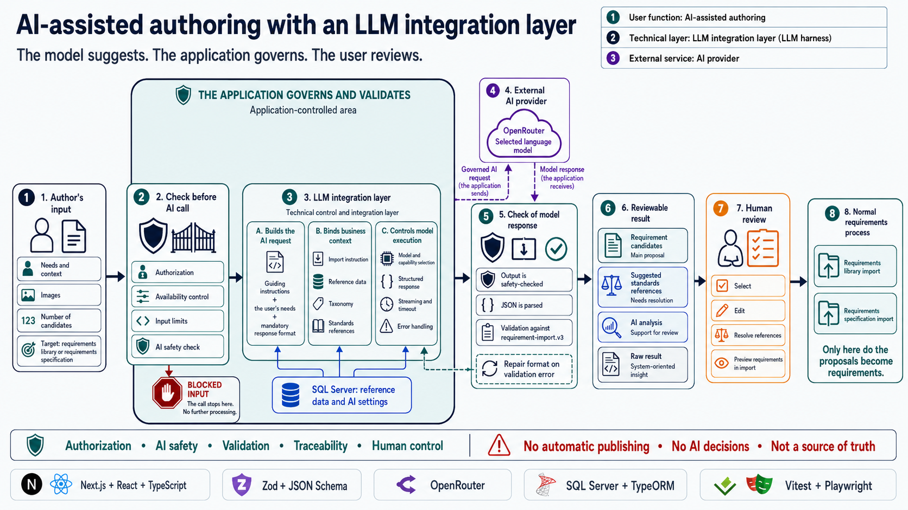

# AI-Assisted Authoring Developer Workflow

This guide is for developers configuring local AI-assisted authoring or changing
its adapters and integration tests. It covers local setup, adapter contracts,
and verification without live provider calls. Behavioral contracts for prompts,
provider requests, taxonomy loading, and generated-requirement validation live in
[reference-data-and-ai.md](../governance/reference-data-and-ai.md).

## Integration Architecture

Every bounded AI request runs through the provider-neutral integration layer in
[ADR 0051](../adr/0051-ai-integrationslager-med-korprofiler-och-adaptrar.md).
An administrator-controlled run profile selects an AI connection and a
verified AI connection model revision before the adapter runs. Application
routes and business services do not select providers, models, transports, or
provider configuration.

The runtime resolver selects one of the three stable profiles.
It rejects disconnected, paused, or derived-blocked profiles
before resolving transient adapter configuration. The exact connection, model
revision, stable profile ID, profile configuration version, adapter version,
and application-owned capability selection are frozen for the run. Missing
fixed minimum capabilities block the profile. Verified validatable JSON
remains mandatory independently of optional strict JSON Schema steering.

Adapter-ready connection and model configuration exists only inside the
resolver's opaque configuration callback; it is not returned on the resolved
profile. The callback remains open until the adapter event stream has been
fully consumed, so provider-secret access stays inside that lifetime boundary.
The integration layer releases and settles that scope before publishing the
single buffered terminal event; teardown failure replaces it with one safe
failed terminal.
Neither the profile source nor the integration layer interprets
provider-specific authentication fields. The integration layer invokes only
the exact registered adapter type-and-version pair and does not retry through
or fall back to another adapter. Multiple registered versions of one adapter
type remain independent selections.

OpenRouter is available alongside a fully registrable controlled
test adapter. Both pass the same run-profile, safety-gate, route, and terminal
outcome contracts. The trust boundary, AI connection lifecycle, encrypted
provider secrets, and external root keyring are governed by
[ADR 0052](../adr/0052-tillitsgrans-och-krypterade-ai-leverantorshemligheter.md).
The three deployment-owned JSON trust maps are explained step by step in the
[AI connection deployment-policy guide](../operations/ai-connection-deployment-policies.md).

The integration layer adds the provider-neutral AI request privacy minimum to
every adapter request. Adapters map deny-data-collection and required
zero-data-retention semantics explicitly; provider-shaped fields stay inside
the adapter. Adapter-boundary tests inspect the final provider request for
generation and repair. Browser and REST bodies cannot supply privacy, provider,
or model overrides. A missing or weaker attestation fails at the trust boundary
before adapter egress.

The import-instruction builder is shared by built-in authoring, REST, and MCP.
Its requirement-package reference data contains only stable ID, name, and
purpose and scope. Do not add lead or responsible-person display names, HSA
IDs, email addresses, or other structured person identifiers. Ordinary
free-text entered by a user is not identity-scrubbed by this rule.

The MCP server exposes import schema, instruction, validation, and execution;
it does not expose a server-hosted AI generation tool. Any AI egress performed
by an external MCP client is client-owned and outside the app's privacy-minimum
enforcement. Document that boundary when MCP tools change.



## Adapter Verification Design Contract

New and changed provider adapters must keep provider variation behind the
adapter seam. The central verification module owns the provider-neutral probe
sequence, capability evidence, and decision to permit saving. Its interface
gives the adapter a fixed task and an explicit capability selection. The adapter
owns request construction, provider protocol variants, response parsing, and
normalization into the shared event contract.

Use the following probe sequence:

1. Verify connection and authentication without assuming model capabilities.
2. Run baseline model access with the intended revision reasoning configuration.
   The fixed response is parsed and validated locally. A failed baseline stops the
   suite; later capabilities and profiles remain not tested.
3. Probe every capability independently. Include only fields and content that
   are necessary for the selected capability. In particular, ordinary
   validatable JSON must not require JSON Schema steering. Every probe uses the
   saved reasoning path and applicable effort; image content belongs only to image
   input, and streaming is enabled only for the streaming probe.
4. Run each stable profile's combined required-capability probe only after the
   independent probes. Combined support must not turn an independently failed
   capability into verified evidence.

Reasoning activity and control probes include a fixed arithmetic task, as do
combined profiles that require reasoning. A request to echo a literal JSON
object can produce valid output with zero reasoning tokens even when explicit
effort is enabled. The model must return the calculated integer in an `answer`
field. Only local validation contains the expected answer; the prompt and
provider-facing schema do not supply it. Correct arithmetic alone does not
establish reasoning activity: separate provider evidence remains mandatory.
Visible analysis remains optional: only its own probe asks
for a summary. Image profiles retain their image-observation task, and strict
schema probes retain the deliberately conflicting extra property.
Valid JSON without observed reasoning is inconclusive capability evidence;
it does not indicate malformed output and must not produce a usable revision.

Catalog metadata and advertised parameters guide what can be attempted; they
are never proof of support. A provider rejection caused by an isolated optional
control is evidence about that capability, not about unrelated capabilities.
Connection, authentication, trust-policy, and baseline failures remain
connection- or model-wide failures.
Safe adapter diagnostics, including a normalized upstream HTTP status, travel
with failed verification results. Raw provider error bodies remain excluded.

OpenRouter verification and runtime requests use `max_completion_tokens` for
the output token limit. Keep reasoning controls, the token limit, and the
privacy minimum together in the shared request builder in
[openrouter-adapter.ts](../../lib/ai/openrouter-adapter.ts).

An adapter may need several request dialects for different provider or server
versions. Keep those variants as internal adapter implementations behind the
same interface and follow these rules:

- Select a dialect from stable provider metadata, an explicit connection
  setting, or a versioned protocol feature. Do not branch on known model IDs,
  display names, or provider-specific model-family lists.
- Build verification and runtime requests through the same dialect-aware
  request builder and parse them through the same response normalizer. A
  verification-only payload path can otherwise produce evidence that runtime
  cannot reproduce.
- Make dialect selection deterministic from the exact frozen connection,
  adapter version, and model-revision inputs. If negotiation is required, bind
  the selected dialect and its inputs to the verified model revision. Extend
  the persisted verification contract when those inputs cannot already be
  reconstructed; never rely on a process-local cache.
- Require a newly verified model revision when a connection setting, adapter
  version, provider protocol version, server configuration, or other dialect
  input changes.
  Introduce a new adapter version when the old and new runtime behavior cannot
  safely share one deterministic selection rule.

The adapter interface is also the test surface. Adapter tests must inspect the
final provider request for baseline, every isolated capability, and supported
combined profiles. Cover every implemented dialect with provider-response
fixtures and prove that unknown model IDs follow the same metadata-driven
rules. A model-specific fixture is acceptable as provider sample data, but its
ID must not be a dispatch key.

## Local Adapter Setup

AI-assisted authoring is available only when an administrator has configured
and enabled a valid profile for that exact action. Local development uses the
same connection, secret, verification, and profile workflow as production.
Start with the database and development server configured through the
[SQL Server developer workflow](sql-server-developer-workflow.md) and an
administrator account from the
[authentication developer workflow](auth-developer-workflow.md). Required seed
leaves AI unconfigured; demo seed supplies only unverified connection drafts.

1. Provision the ignored local provider-secret root keyring:

   ```bash
   node scripts/provision-ai-provider-secret-keyring.mjs
   ```

   Run this from the repository root. The default file is
   `.local/ai-provider-secret-keyring.json`, matching `.env.development`.
   The script validates and preserves an existing keyring. If the application
   uses a different `AI_PROVIDER_SECRET_KEYRING_FILE`, pass that same path with
   `--path`; the provisioning command does not load dotenv files itself.

2. Use the committed `.env.development` egress, data, and TLS policy maps for
   the seeded OpenRouter connection with synthetic demo data. They cover all
   three run types, match the draft demo attestation's `internal` class and
   demo region label, and prohibit personal data, training, and retention.
   The region label is demo metadata, not verified provider geography.
   Use `.env.development.local` for overrides and restart the development
   server after policy changes. Other connections need their own policies as
   described in [AI Connections Operations](../operations/ai-connections.md).
3. In Admin Center under `AI`, register a connection or use the seeded draft.
   Write its provider secret, test and activate that candidate, and attest the
   connection. Run the unified model verification, save the verified model
   revision, and activate the connection. Saving a secret candidate alone does
   not make it available to authoring.
4. Select that compatible revision directly on the stable profiles for
   generation without images, generation with images, and invalid-import repair
   as needed.
5. Confirm the authoring dialog shows only the connection's public name and
   data-policy summary. Missing, suspended, or blocked profiles disable only
   their corresponding action.

Provider credentials are written through the administrator workflow and stored
as encrypted revisions. Do not put provider credentials in environment files or
browser-visible configuration. The authoring UI does not select models or show
provider credits.

The administrator preference for AI-assisted authoring is enabled by default
after migrations; usable profiles still require the setup above. An
administrator can turn generation off in Admin Center under `AI`. That setting
disables AI-assisted authoring across the requirements UI and REST routes.

Verify local setup against the app API:

```bash
scripts/dev-curl.sh -s /api/ai/authoring-profiles | jq .
```

Check top-level `enabled: true` and `available: true` for each intended action
under `profiles`. The action keys are `generate_without_images`,
`generate_with_images`, and `repair_invalid_import_json`. `enabled: true` alone
does not establish that a profile is usable. An unavailable profile reports
`missing`, `suspended`, or `blocked`; inspect that profile's blockers in Admin
Center. If `enabled` is false, check the administrator preference and the
`AI_REQUIREMENT_GENERATION_DISABLED` environment guard described below.

Do not commit provider credentials or the generated root keyring.

If secret verification reports
`The AI connection trust policy blocked the request.`, first check for missing
egress or TLS policies and local overrides of the committed defaults. Follow
the [secret verification troubleshooting steps](../operations/ai-connection-deployment-policies.md#tillitspolicyn-blockerar-verifiering-av-leverantörshemligheten).

## Adapter Test Policy

Automated repository tests and security gates do not call live provider
endpoints. External providers are tested outside the repository; repository
tests use the controlled adapter or mock the adapter-owned transport boundary.

The repo-owned responsibility is to verify the integration boundary:

- adapter request shape, response parsing, timeout handling, and error handling
  with mocked transport calls;
- prompt and taxonomy generation behavior before a provider call is made;
- action-scoped behavior when a profile or encrypted credential is unavailable;
- sanitization so provider keys, prompts, SQL fragments, stack traces, and
  other sensitive details are not written to scan artifacts.

Keep acceptance coverage through the persisted profile source, encrypted
credentials, trust boundary, coordinator, and real authoring route projection.
Adapter deltas must stay quarantined. Only safety-screened, schema-invalid
terminal output may reach the generation route as `validation_error` for repair;
unscreened or partial output must not reach the user. The shared integration
stream has only `completed`, `failed`, and `cancelled` terminal events.

Do not add production provider secrets or live provider calls to CI. A manual
provider smoke test may be run outside CI when changing provider configuration
or investigating an integration incident.

## Provider Failure Contract

The authoring routes project adapter failures into stable response contracts.
JSON responses return `{ code, error }` and SSE error events return
`{ code, message }`. Request and correlation identifiers remain in response
headers rather than error payloads.
Non-streaming provider failures return HTTP `429` for an upstream rate limit
and HTTP `503` otherwise. Once the generation SSE response starts, provider
failures arrive as error events within that response.

Provider failures use these codes:

- `ai_profile_missing`, `ai_profile_suspended`, and `ai_profile_blocked` for an
  action profile that changes between availability lookup and execution;
- `ai_provider_rate_limited` for upstream `429`;
- `ai_provider_unavailable` for unavailable connections and remaining adapter
  failures;
- `ai_provider_invalid_response` for a terminal response that cannot be used
  or preserved for repair.

Known terminal failures also carry an actionable localized message. When the
adapter or coordinator supplies a content-free diagnostic code matching the
safe identifier contract, the response includes it as `technicalCode` and the
authoring error summary shows it for support and troubleshooting. Provider
response bodies, prompts, model output, personal data, secrets, and nested
exception text remain excluded.

Keep provider response parsing bounded and diagnostics content-free. For the
OpenRouter response limits and parsing checks, see
[openrouter-adapter.ts](../../lib/ai/openrouter-adapter.ts).

Caller cancellation produces no provider error payload or provider-failure
diagnostic.

## Security Scan Disable Guard

Full active DAST runs set `AI_REQUIREMENT_GENERATION_DISABLED=1`. This is a
runtime guard for security scans and deployment freeze windows, not an
administrator preference. It has higher precedence than the Admin Center
setting and cannot be bypassed through the UI. Administrators may still save
the persisted preference while the guard is active, but effective generation
stays disabled until the environment variable is removed.

When the environment guard or the persisted Admin Center preference disables
generation, browser and REST AI-assisted authoring keep their public route
contracts but return the sanitized provider-unavailable response before
taxonomy loading or adapter egress starts. MCP has no server-hosted generation
tool; its import-contract tools remain available and open no provider egress.

Security CI must not provision an active provider secret or authoring profile,
so accidental adapter access fails closed even if the guard is removed or
misconfigured.

## Final Provider-Neutral Acceptance

The shared adapter contract runs for both OpenRouter and `controlled_test`.
Coordinator coverage checks resource limits, deadlines, retries, cancellation,
and stream failures independently of provider behavior.
Run the focused acceptance set without an external AI call:

```bash
npm test -- --run \
  lib/__tests__/controlled-test-adapter.test.ts \
  lib/__tests__/openrouter-adapter.test.ts \
  lib/__tests__/ai-run-coordinator.test.ts \
  lib/__tests__/ai-integration-layer.test.ts \
  lib/__tests__/ai-authoring-production-acceptance.test.ts \
  tests/unit/ai-connections-data-model-migration.test.ts \
  lib/__tests__/ai-provider-secret-service.test.ts
```

Production-like Playwright uses the controlled adapter and must not make an
external live AI call. The existing lockstep manual/Playwright cases are
`ADMIN-20` for configuration and safe recovery and `REQ-15` through `REQ-15D`
for authoring, quarantine, repair, cancellation, and profile availability.

For the separate operator procedure using a fixed synthetic live-provider
payload, see
[AI Connections Operations](../operations/ai-connections.md#staging-live-synthetic-probe).

Reasoning activity is mandatory for all three profiles. The `reasoning` revision
configuration is
`{ mode: 'explicit_control', effort: 'low' | 'medium' | 'high' }`
or `{ mode: 'model_default', effort: null }`. The adapter translates it for the
provider and observes activity independently of `aiAnalysis` and token display.
The controlled adapter includes `controlled/default-no-analysis` (rejects
explicit control), `controlled/no-analysis`, and `controlled/no-reasoning`
(valid output without activity evidence). Use these synthetic models to exercise
mandatory reasoning without live provider calls. No profile or run may override
the revision, disable reasoning, or silently switch paths after a failure.
