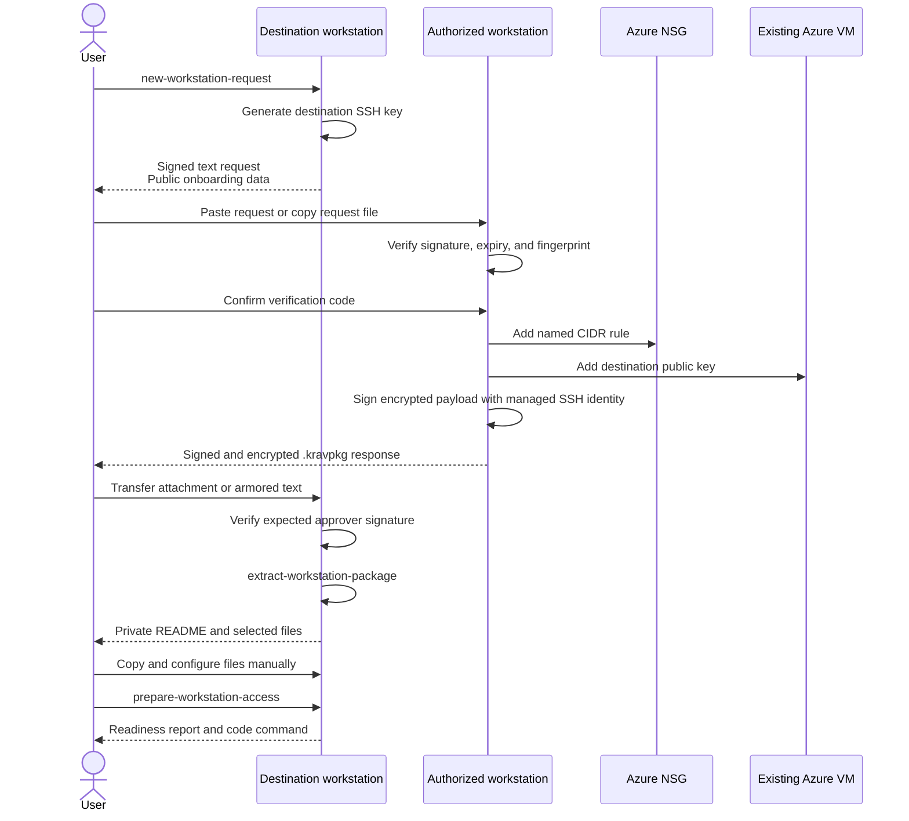

# Azure VM Remote SSH Development

This guide describes the optional disposable Azure VM development environment.
The VM is for one developer, runs the app directly in `/workspace`, and runs
only SQL Server, Keycloak, Kong, and HSA support services in rootless Podman.

Use the devcontainer for normal local work. Use this VM when you need a larger
remote Linux host opened from VS Code Remote SSH.

Run every `azure-dev.ps1` command in this guide directly from a PowerShell 7
session. Open a PowerShell 7 terminal, change to the repository root, and keep
that session open for the workflow. Do not prefix the script commands with
`pwsh`.

Examples labeled `sh` or `bash` require a Bash-compatible shell, such as Cloud
Shell Bash or the VM terminal. Run workstation setup examples labeled
`powershell` in the local PowerShell session.

## Get the tenant ID and subscription ID

The simplest lookup path is Azure Portal Cloud Shell:

1. Open the Azure Portal.
2. Open **Cloud Shell** from the `>_` toolbar icon.
3. Choose **Bash**.
4. List the subscriptions visible to your portal session:

```sh
az account list \
  --query "[].{subscription:name,subscriptionId:id,tenantId:tenantId}" \
  -o table
```

Use the `tenantId` and `subscriptionId` values from the row that contains the
development subscription. Alternatively, in Cloud Shell PowerShell:

```powershell
Connect-AzAccount
Get-AzSubscription | Select-Object Name, Id, TenantId
```

## Login to the Tenant

On the workstation, install Azure CLI if needed, then log it into the tenant.
The setup script uses the subscription ID from the merged Azure development
configuration, so that subscription must be visible in the active Azure CLI
login.

Make sure Azure CLI is using the public Azure cloud, then sign in directly to
the tenant:

```powershell
az cloud set --name AzureCloud
az login --tenant "<tenant-id>"
```

Verify that the development subscription is visible after login:

```powershell
az account list --all `
  --query "[].{name:name,id:id,tenant:tenantId,state:state}" `
  -o table
```

## Step 1: Understand Cost

Review the configured cost drivers after choosing or editing
`.env.azure.development`:

```powershell
./scripts/azure-dev.ps1 estimate-cost
```

This command reads local configuration only. It does not require Azure login,
subscription visibility, resource-group permissions, or provider registration.
It also does not fetch live Azure prices.

The environment can bill for compute, the OS disk, the configured data disk,
static public IP, network traffic, and taxes. The setup, stop, and remove
commands are covered in the setup and management sections below. The data disk
is used for the repository checkout, VM host state, and rootless Podman storage.
`/workspace`, `/var/lib/krav-azure-dev`, and
`/home/vscode/.local/share/containers/storage` are bind mounts into the data
disk. The bootstrap fails if the data disk is missing.

The data disk also holds linked worktrees, VS Code Server data, Codex state,
user caches, and container storage. Use `storage-report` to inspect usage
before cleaning up; see [Storage warnings and diagnostics](#storage-warnings-and-diagnostics).

`/home/vscode` itself remains on the OS disk so SSH login and shell startup do
not depend on mounting the whole home directory. Selected large directories
keep their normal tool-facing paths through bind mounts. Setup fails if the
data disk or a required bind mount is unavailable instead of silently writing
managed development data to the OS disk.

## Step 2: Prepare Azure

Get or choose these values first:

- subscription ID
- tenant ID for login
- Azure region, for example `eastus2`.
- resource group name, for example `rg-krav-dev-personal`
- stable environment ID, for example your username or initials

The Azure region should be a region with the desired VM SKU and a low-latency
path to your location. The setup script does not validate latency.

Make sure to use the same region for the resource group as for the resource
group configured in `.env.azure.development`. The resource group must be
in the same subscription as the VM. The resource group should preferably
be dedicated to this personal development environment.

The resource group name and environment ID should also be specified in the
`.env.azure.development` file.

The personal shortcut is subscription-scope `Contributor`. With that role,
`setup` can create and tag the resource group.

The shared-subscription option is a pre-created resource group plus one of
these resource-group scoped roles:

- a project-specific custom role covering the operations described below
- the built-in `Contributor` role when a custom role is not available

### Create resource group

In a shared subscription, prefer an admin-created resource group and a custom
role scoped to that resource group. Ask the admin to create and tag the group:

```powershell
az group create `
  --subscription "<subscription-id>" `
  --name "<resource-group-name>" `
  --location "eastus2" `
  --tags `
    "managed-by=kravhantering-azure-dev" `
    "environment-id=<stable-environment-id>" `
    "repository=viscalyx/Kravhantering" `
    "purpose=personal-development"
```

The setup flow requires all four tags before it mutates an existing resource
group. If the group exists without them, setup fails closed and prints the
`az group update` command an owner can run.

### Register providers

The custom role needs resource-group deployment, compute,
network, disk, public IP, SSH public-key, Azure Run Command, and optional
DevTestLab schedule actions. Host-key authentication specifically requires
`Microsoft.Compute/virtualMachines/runCommand/action`. The setup command does
not create role assignments and does not use Azure SSH key-pair generation or
`DataActions`.

If your tenant requires explicit provider registration, an owner can check or
register these providers:

```powershell
az provider show --subscription "<subscription-id>" `
  --namespace "Microsoft.Compute" `
  --query registrationState `
  -o tsv

az provider register --subscription "<subscription-id>" `
  --namespace "Microsoft.Compute"

az provider register --subscription "<subscription-id>" `
  --namespace "Microsoft.Network"

az provider register --subscription "<subscription-id>" `
  --namespace "Microsoft.DevTestLab"
```

## Step 3: Install Workstation Prerequisites

Install these tools on the workstation:

- PowerShell 7+ terminal
- Azure CLI
- OpenSSH 8.6 or later on Windows, or OpenSSH 8.5 or later on macOS and Linux,
  plus `ssh-keygen` and `scp`.
- VS Code with Remote SSH
- GitHub CLI when GitHub access is required from the remote environment
- MesloLGS Nerd Font Mono installed on the workstation
- Optional: `age` 1.2.1 or later for encrypted workstation-transfer packages.
  Install it manually as described in [Install age](#install-age).
- Optional: Tailscale CLI for Tailscale cleanup checks

Powerlevel10k is rendered on the workstation even when the shell runs on the
Azure VM. Configure VS Code with:

```json
{
  "terminal.integrated.fontFamily": "MesloLGS Nerd Font Mono"
}
```

On macOS, install the font with:

```sh
brew install --cask font-meslo-lg-nerd-font
```

On Windows or Linux, install the MesloLGS Nerd Font Mono faces from the
[Nerd Fonts downloads](https://www.nerdfonts.com/font-downloads). On Linux,
run `fc-cache -f` after installation. `setup` checks for the font before
creating or changing Azure resources and stops with installation guidance when
it is missing.

Service-principal automation may use `AZURE_TENANT_ID`, `AZURE_CLIENT_ID`,
and `AZURE_CLIENT_SECRET` from the shell or `.env.azure.development.local`.
When all three values are set, real Azure commands log in with the service
principal before checking any existing Azure CLI user login.

### Prepare GitHub authentication

The Azure VM setup does not copy or persist GitHub tokens. Keep both tokens in
the workstation's secure credential store and expose them only in the
environment that launches the Remote SSH connection:

- `GH_TOKEN` supplies the classic personal access token used by the Codex
  GitHub MCP server.
- `COPILOT_GITHUB_TOKEN` supplies the personal-account fine-grained token used
  by GitHub Copilot CLI. Grant it the account-level `Copilot Requests`
  permission.

GitHub Copilot CLI checks `COPILOT_GITHUB_TOKEN` before `GH_TOKEN`, which keeps
the classic token available to Codex without Copilot CLI selecting it. Do not
echo either variable or put its value in the repository, an Azure development
environment file, the SSH config, or a shell profile. Use expiring tokens with
only the permissions each development workflow needs.

A classic personal access token may require separate SAML SSO authorization:
authenticate with the organization identity provider once, open GitHub
**Settings > Developer settings > Personal access tokens**, choose
**Configure SSO** for the token, and then choose **Authorize** for the
organization. See
[GitHub's SAML SSO token authorization guide](https://docs.github.com/authentication/authenticating-with-saml-single-sign-on/authorizing-a-personal-access-token-for-use-with-saml-single-sign-on).

Setup adds `SendEnv` entries for both variables to the managed workstation SSH
host block and configures the VM with
`AcceptEnv GH_TOKEN COPILOT_GITHUB_TOKEN`. OpenSSH transfers the values through
the encrypted SSH session, and the VS Code Server and its child processes
inherit them. The setup scripts never read the values, include them in terminal
or log output, or store them.

Warning: processes in the destination `vscode` user's Remote SSH process tree
can read the forwarded values. Connect only to trusted VMs and workspaces, and
use short-lived, least-privilege tokens.

After changing or rotating either token, restart the remote VS Code Server
before reconnecting from the shell with the new values. Closing a window alone
can leave the server running with its old environment; follow
[the token troubleshooting steps](#vs-code-uses-stale-forwarded-github-tokens).
Verify forwarding in the VM terminal without displaying the values:

```sh
test -n "${GH_TOKEN:-}" &&
  test -n "${COPILOT_GITHUB_TOKEN:-}" &&
  gh auth status
```

### Prepare SSH commit signing

Setup mirrors workstation SSH commit signing when all three effective Git
settings are present for this checkout:

```powershell
git config --get gpg.format
git config --get --bool commit.gpgsign
git config --get user.signingKey
```

The first two commands must print `ssh` and `true`. `user.signingKey` must be an
inline `key::` public key, a public-key file, or a private-key path with a
matching `.pub` file. Setup reads and uploads only the public key. It never
copies the private key.

Load the matching private key into the workstation SSH agent before setup and
before each Remote SSH connection:

```powershell
ssh-add "<signing-private-key-path>"
ssh-add -l
```

The public key must also be registered with GitHub as a signing key when commits
need GitHub's **Verified** badge. Setup cannot change GitHub account signing
keys.

The managed SSH host block enables agent forwarding. A remote process can ask
the forwarded agent to sign while the connection is open, but it cannot read
the private key. Enable this workflow only for a VM you trust.

## Step 4: Configure `.env.azure.development`

Copy the example and edit the required non-secret Azure values:

```powershell
Copy-Item .env.azure.development.example .env.azure.development
```

Required non-secret values:

```env
AZURE_DEV_VM_RESOURCE_GROUP=rg-krav-dev-personal
AZURE_DEV_VM_LOCATION=eastus2
```

The following values are the built-in defaults. The copied example explicitly
sets `AZURE_DEV_VM_DATA_DISK_GIB=256`, overriding the 64 GiB code default; review
that choice before estimating costs or running setup. Keep `AZURE_DEV_VM_NAME`
explicit in the file because lifecycle commands require it even though setup
has a default:

```env
AZURE_DEV_VM_AUTO_STOP_ENABLED=true
AZURE_DEV_VM_AUTO_STOP_TIME=2200
AZURE_DEV_VM_AUTO_STOP_TIME_ZONE=UTC
AZURE_DEV_VM_CONNECTIVITY_MODE=public-ssh
AZURE_DEV_VM_DATA_DISK_GIB=64
AZURE_DEV_VM_ENVIRONMENT_ID=personal
AZURE_DEV_VM_FALLBACK_SIZE=Standard_D8as_v5
AZURE_DEV_VM_IMAGE_OFFER=ubuntu-24_04-lts
AZURE_DEV_VM_IMAGE_PUBLISHER=Canonical
AZURE_DEV_VM_IMAGE_SKU=server
AZURE_DEV_VM_NAME=krav-dev-vm
AZURE_DEV_VM_NAME_PREFIX=krav-dev
AZURE_DEV_VM_SIZE=Standard_D8s_v5
AZURE_DEV_VM_SSH_HOST_ALIAS=kravhantering-azure-dev
```

`AZURE_DEV_VM_DATA_DISK_GIB` sets the size for a new managed data disk. If an
existing disk is smaller, setup expands the managed disk and its ext4
filesystem. If an existing disk is larger, setup warns, preserves that size,
and continues because Azure managed disks cannot be shrunk. Run `remove` and
recreate the disposable environment to use a smaller disk.

The three `AZURE_DEV_VM_IMAGE_*` values identify the Marketplace image family
used only when creating a VM. Setup derives a `latest` URN from them, resolves
and deploys the exact version, and requires Azure to report both an `Active`
image state, Hyper-V generation V2, and Trusted Launch support. Existing VMs
retain their immutable image reference even when these configuration values
change.

Setup detects the initial workstation's current public IPv4 address and creates
a named `/32` rule. It derives the workstation name from the local machine
name. Pass optional `-WorkstationName` or `-Cidr` parameters when either value
needs an explicit override. Explicit network CIDRs also require
`-AllowNetworkCidr`. Additional workstations and networks use the named CIDR
commands documented below. The tool refuses private IPv4 ranges, ranges broader
than `/24`, and broad SSH ranges such as `0.0.0.0/0`.

The parser intentionally supports only `KEY=value`, optional quotes, blank
lines, and full-line comments. It does not evaluate shell expressions,
`export`, variable expansion, or command substitution.

Setup configures global `user.name` and `user.email` values for the remote
`vscode` user before the first VS Code connection. By default, it copies the
effective values from the workstation's Git configuration for this checkout.
Set either value explicitly when the remote identity should differ:

```env
AZURE_DEV_GIT_USER_NAME=<full-name>
AZURE_DEV_GIT_USER_EMAIL=<email-address>
```

Each value resolves independently, so an explicit email can be combined with a
name copied from local Git configuration. Setup stops before changing Azure
resources when it cannot resolve both values.

When local Git does not expose the intended SSH signing key, set a non-secret
public-key override:

```env
AZURE_DEV_GIT_SSH_SIGNING_KEY=~/.ssh/id_ed25519.pub
```

The override accepts the same public forms as `user.signingKey`. Never put
private-key content in an Azure development environment file.

## Step 5: Configure `.env.azure.development.local`

Create this file only when you need per-workstation overrides or secrets:

```powershell
if (-not (Test-Path .env.azure.development.local)) {
  New-Item -ItemType File .env.azure.development.local
}
```

The file is gitignored by the existing `.env.*.local` rule. Put secrets here
only when session environment variables are not practical.

Treat the subscription ID as secret configuration and give it a real value:

```env
AZURE_DEV_VM_SUBSCRIPTION_ID=<subscription-id>
```

The SSH private-key path is also treated as secret configuration. Its code
default is `~/.ssh/kravhantering_azure_dev_ed25519`. Set an override here only
when needed:

```env
AZURE_DEV_VM_SSH_PRIVATE_KEY_PATH=<private-key-path>
```

Set unique passwords for the VM-local SQL Server and Keycloak services before
the first real setup:

```env
MSSQL_SA_PASSWORD=<strong-unique-sql-server-password>
KEYCLOAK_ADMIN_PASSWORD=<strong-unique-keycloak-password>
```

A real `setup` fails before creating or updating Azure resources when either
password is missing. The setup tool uploads only these support-service values
through temporary mode `0600` files; it does not include them in command-line
arguments, logs, or Azure state. `setup -WhatIf` does not require them because
it does not bootstrap the VM. Setup fails if it cannot remove the local
temporary files after transferring them.

Optional Ubuntu Pro attachment:

```env
AZURE_DEV_UBUNTU_PRO_TOKEN=<ubuntu-pro-token>
```

Get the token from the
[Ubuntu Pro dashboard](https://ubuntu.com/pro/dashboard). When the value is
set, setup transfers it in a temporary mode `0600` attach-config file and runs
`pro attach` on the VM. Ubuntu Pro enables the services selected by the
subscription's defaults. When the value is unset, setup does not attach or
detach Ubuntu Pro; a new VM remains unattached. Removing the value on a later
setup does not detach a VM that is already attached.

Choose the values before SQL Server and Keycloak initialize their persistent
data. Changing these variables later does not rotate credentials inside an
existing SQL Server database or Keycloak realm; recreate the disposable
environment or perform the corresponding service credential rotation first.

Optional service-principal login:

Use this when setup should run as the service principal instead of your current
Azure CLI user. Set all three values together:

```env
AZURE_TENANT_ID=<tenantId>
AZURE_CLIENT_ID=<clientId>
AZURE_CLIENT_SECRET=<clientSecret>
```

For real commands, including `setup`, a complete service-principal
configuration is used before any existing `az login` session. If any of the
three values are set, all three must be set. For `-WhatIf`, the script does not
perform `az login --service-principal` because that would mutate the local
Azure CLI session.

### Determine permissions for service principal

Use one of these values for `<role-name-or-id>`:

- the project-specific custom role name or role ID from the Azure admin
- `Contributor` for the built-in role at the resource-group scope

The custom role is preferred in a shared subscription. `Contributor` is simpler
for a personal subscription or a dedicated development resource group, but it
can manage more resource types inside that group than this tool needs.

### Option 1. Create service principal and role assignment

If you are allowed to create app registrations and assign Azure RBAC at the
resource-group scope, create the credentials and role assignment in one command:

```powershell
az ad sp create-for-rbac `
  --name "krav-dev-<stable-environment-id>" `
  --role "<role-name-or-id>" `
  --scopes `
    "/subscriptions/<subscription-id>/resourceGroups/<resource-group-name>" `
  --query "{tenantId:tenant,clientId:appId,clientSecret:password}" `
  -o json
```

Copy the output values into `.env.azure.development.local`:

```env
AZURE_TENANT_ID=<tenantId>
AZURE_CLIENT_ID=<clientId>
AZURE_CLIENT_SECRET=<clientSecret>
```

`clientId` is the service principal application ID, returned as `appId` by
Azure CLI. `clientSecret` is the generated password. Save it immediately; Azure
does not let you read the same secret value later.

### Option 2. Admin-created service principal

If the tenant admin creates the identity before assigning access, ask them to
run:

```powershell
az ad sp create-for-rbac `
  --name "krav-dev-<stable-environment-id>" `
  --query "{tenantId:tenant,clientId:appId,clientSecret:password}" `
  -o json
```

Then assign the role at the resource-group scope:

```powershell
az role assignment create `
  --assignee "<client-id>" `
  --role "<role-name-or-id>" `
  --scope `
    "/subscriptions/<subscription-id>/resourceGroups/<resource-group-name>"
```

Copy the output values into `.env.azure.development.local`:

```env
AZURE_TENANT_ID=<tenantId>
AZURE_CLIENT_ID=<clientId>
AZURE_CLIENT_SECRET=<clientSecret>
```

`clientId` is the service principal application ID, returned as `appId` by
Azure CLI. `clientSecret` is the generated password. Save it immediately; Azure
does not let you read the same secret value later.

### Reset service principal secret

If the secret is lost or expired, reset it and update
`.env.azure.development.local` with the new `clientSecret`:

```powershell
az ad sp credential reset `
  --id "<client-id>" `
  --append `
  --query "{clientSecret:password}" `
  -o json
```

### (Optional) Use ephemeral Tailscale auth key

Optional Tailscale mode:

```env
AZURE_DEV_VM_CONNECTIVITY_MODE=tailscale
AZURE_DEV_TAILSCALE_AUTH_KEY=<ephemeral-auth-key>
AZURE_DEV_TAILSCALE_TAILNET=<tailnet-name>
```

Precedence is:

1. session environment variables
2. `.env.azure.development.local`
3. `.env.azure.development`
4. the effective local Git configuration, for Git identity and SSH signing
5. built-in defaults, which do not provide a Git identity

That means a shell `AZURE_CLIENT_SECRET` overrides the value in
`.env.azure.development.local`. If the shell does not define it, the value from
`.env.azure.development.local` is used.

### (Optional) Customize the Zsh profile

Setup installs Oh My Zsh, Powerlevel10k, `git`, `zsh-autosuggestions`, and
`zsh-syntax-highlighting` for the remote `vscode` user. The tracked
`scripts/azure-dev/templates/zshrc.template.example` contains the default
profile and the local rainbow prompt defaults. Running `p10k configure` on the
VM creates `/home/vscode/.p10k.zsh`, which takes precedence on later shells.
The required MesloLGS Nerd Font Mono remains a workstation prerequisite; the
Azure VM cannot install a font used by the local VS Code terminal renderer.

To customize the profile before setup, copy the example to the ignored local
override and edit it:

```powershell
Copy-Item scripts/azure-dev/templates/zshrc.template.example `
  scripts/azure-dev/templates/zshrc.template
```

`setup` installs `zshrc.template` when it exists. Otherwise, it installs
`zshrc.template.example`. Each setup run reapplies the selected profile to
`/home/vscode/.zshrc`. Keep credentials out of both files; load secrets through
the environment or an external secret manager instead. Bootstrap prepends its
managed storage environment before the Powerlevel10k instant-prompt preamble so
filesystem warnings do not trigger Powerlevel10k's initialization warning. VS
Code injects its shell integration; do not source it manually in the profile.

## Step 6: Run Setup

In the PowerShell session at the repository root, run the read-only Azure
readiness preflight before setup. The script resolves both Azure development
environment files relative to the repository root:

```powershell
./scripts/azure-dev.ps1 setup -WhatIf
```

By default, the script calculates the repository root from its own location.
Use `-RepositoryRoot` to override it when the environment files, local state,
and templates belong to another repository root:

```powershell
./scripts/azure-dev.ps1 setup -WhatIf -RepositoryRoot /path/to/Kravhantering
```

This checks tools, Azure login, subscription visibility, SKU availability,
resource-group ownership tags, SSH CIDR, and the deployment preview. It needs
the Azure permissions described in Step 2, but it must not create Azure
resources, SSH keys, local locks, state, or logs.

Azure what-if can report provider-owned or read-only defaults as changes, for
example NIC `kind`, dynamic private IP, public-IP DDoS settings, disk values
marked `NoEffect`, or standalone managed disks marked `Ignore`. Treat those as
noise when no create, delete, or meaningful update is listed for managed
resources.

After the raw Bicep result, setup prints a conservative interpretation. It
classifies only the known NIC and Public IP provider-default property deletions
as false positives. Every unfamiliar create, delete, or modification remains
actionable. Microsoft documents that ARM What-If can incorrectly report
automatically assigned or default properties as deleted. See the
[ARM template deployment What-If documentation](https://learn.microsoft.com/en-us/azure/azure-resource-manager/templates/deploy-what-if).

For an existing VM, setup reuses its exact Marketplace image reference because
Azure does not allow `imageReference` to change in place. Setup resolves the
latest image from the configured publisher, offer, and SKU only when it creates
a new VM. The resolved exact version must report an `Active` Marketplace image
state, Hyper-V generation V2, and Trusted Launch support or setup fails before
deployment. The configured VM sizes must also report Gen2 support and must not
report `TrustedLaunchDisabled=True`.

When an existing VM's publisher, offer, or SKU differs from configuration,
setup warns that the image family and exact version cannot change in place. It
preserves the existing image and attached disks and continues converging
mutable configuration. Applying the configured image requires backing up
required data and using `remove` followed by `setup`; `remove` deletes the
managed OS and data disks.

New VMs use Trusted Launch with Secure Boot and vTPM enabled. For an existing
Standard Gen2 VM, setup checks the image, current VM size, hibernation, and
guest Secure Boot readiness before deallocating it and enabling the same
security profile. For an eligible Canonical Marketplace Gen1 VM, setup also
checks that the boot disk uses GPT, contains an EFI system partition, and has a
`/boot/efi` entry in `/etc/fstab`. It then converts the VM to Gen2 Trusted
Launch, starts it, and requires SSH readiness before continuing the deployment.
The setup approval explicitly identifies this downtime and the irreversible
Gen1-to-Gen2 conversion. Take a backup or restore point first when the OS disk
contains anything that cannot be recreated.

If guest validation cannot connect, detects DKMS kernel modules that need
manual Secure Boot validation, or finds an incompatible boot layout, setup
warns and preserves the existing security profile. Azure can also reject the
upgrade for platform prerequisites such as an incompatible Backup policy. A
rejected update is non-blocking when Azure has not changed the security type:
setup omits `securityProfile` from Bicep and continues repairing mutable
configuration. Rerunning setup is idempotent; a compliant VM is not
deallocated again.

Azure retains a converted Gen1 VM's original Gen1 Marketplace image reference.
Do not use Azure reimage on that converted VM. Recreating the disposable
environment is still the clean way to receive both the configured Gen2 image
and Trusted Launch. See Microsoft's documentation for
[upgrading Gen1 VMs to Trusted Launch](https://learn.microsoft.com/en-us/azure/virtual-machines/trusted-launch-existing-vm-gen-1)
and
[enabling Trusted Launch on existing Gen2 VMs](https://learn.microsoft.com/en-us/azure/virtual-machines/trusted-launch-existing-vm).

`setup -WhatIf` performs Azure platform readiness discovery and reports the
planned deallocation/security update; it never performs it. It skips the live
SSH guest-readiness probe and explicitly reports that the preview assumes those
checks will pass during real setup.

`setup` queries the existing VM's exact Marketplace image
version. Active images produce no deprecation warning. A scheduled or
non-active image produces a non-blocking warning with the scheduled enforcement
date when Azure provides it. If Marketplace metadata is no longer available,
setup warns that image status could not be verified and continues using the
existing VM and OS disk.

When preflight is clean, run setup to create or repair the environment:

```powershell
./scripts/azure-dev.ps1 setup -Yes
```

`setup` prints a cost summary before it creates resources. It does not estimate
every charge. It does not run the Azure deployment preview; use
`setup -WhatIf` when you want that preview.

Use `-Yes` for non-interactive confirmation. The command creates a dedicated
SSH key if missing, provisions Azure resources, installs the managed SSH config
block with SSH agent forwarding enabled when approved, authenticates the VM
host keys through Azure Run Command, waits for strict SSH, uploads the local
bootstrap and Quadlet templates, the selected Zsh profile, and the Azure
development-tooling files, configures the remote Git identity and SSH commit
signing, reruns the VM bootstrap, and runs smoke validation.
If the VM already exists but was deallocated by `stop` or auto-shutdown, `setup`
starts it before waiting for SSH.

If setup fails after creating resources, it preserves the VM, both disks, and
all resources already created. When Codex convergence can roll back, it restores
the previously active release. Use the failure output to diagnose the host and
rerun `setup`; setup does not tear down the failed VM. Use `remove` only when
deliberate replacement is required.

### SSH host trust

Setup establishes host trust before its first network SSH connection. Lifecycle
commands do not change SSH trust; rerun `setup` when trust needs repair. Through
the authenticated Azure control plane, Azure Run Command
reads the VM's `/etc/ssh/ssh_host_*_key.pub` files. The local workflow validates
the returned public-key wire blobs, then atomically replaces only the managed
alias and resolved-host entries in `~/.ssh/known_hosts`. Other entries,
including hashed entries for unrelated hosts, remain intact.

The first SSH probe and all later setup, bootstrap, validation, and maintenance
SSH or SCP operations use `StrictHostKeyChecking=yes`, the pinned
user `known_hosts` file, no global known-host file, and
`KnownHostsCommand=none`, `VerifyHostKeyDNS=no`, and `UpdateHostKeys=no`.
Missing, malformed, or unavailable Azure evidence stops the workflow before
SSH. A network-presented mismatch stops immediately before remote preparation,
local bootstrap credential-file generation, or upload.

When Azure legitimately recreates the VM or rotates its host keys, rerun
`setup -Yes`. Setup obtains fresh keys independently through Azure Run Command
and replaces only the entries authenticated by that evidence. If Azure Run
Command cannot return valid keys, do not remove `known_hosts` entries manually;
restore VM Agent/control-plane access and retry.

The first setup can take a while. It prepares the data-disk mounts, clones the
repository to `/workspace`, installs development tools and dependencies, builds
HSA support images, and starts the rootless Podman services. Rerunning setup
recreates the managed support containers from the current templates while
preserving their named volumes.

### Storage warnings and diagnostics

An interactive shell performs a fast filesystem check. It stays silent while
both root and the data disk are below 80% use, warns at 80%, and labels the
warning urgent at 90%. The check never blocks commands or removes data.
`storage-report --check` runs only this fast warning check; it does not list
cleanup candidates.

Azure host provisioning installs a copy of the helper in
`/usr/local/bin/storage-report`. To update that copy from the current checkout
without rerunning provisioning, run this on the Azure development VM:

```sh
npm run storage-report:install
```

The installer checks the script's Bash syntax and uses `sudo` when needed to
install it with the same ownership and permissions as provisioning.

Run the read-only detailed report when a warning appears:

```sh
storage-report
```

The report shows filesystem, directory, Docker, Podman, and Git worktree use.
Directory sizing includes `/mnt/krav-azure-dev-data/.worktrees` and the redirected
user temporary directory `/var/tmp/krav-vscode`, backed by
`/mnt/krav-azure-dev-data/home/vscode/tmp`. Registered worktrees are reported by
their actual paths. Missing worktrees receive a
suggestion to review `git worktree prune --dry-run`. If a worktree cannot be
fully measured, its size is shown as unknown and the report continues through
the cleanup suggestions. The report classifies worktrees
with uncommitted or unverified detached work as needing review and prints
candidate removal commands only for clean worktrees whose commits remain on a
branch. Cleanup stays manual. Never prune container volumes; they may contain
the active development database.

### Git worktrees

Create Azure development worktrees directly under the data-disk-root directory:

```sh
git -C /workspace worktree add -b <branch> \
  /mnt/krav-azure-dev-data/.worktrees/<name>
```

Use normal `git -C /workspace worktree list`, `remove`, and `prune` commands.
Git keeps linked-worktree administrative metadata in `/workspace/.git`; only
the linked checkout belongs under the external worktree root.

Setup preserves correctly placed external worktrees on reruns. Repository-local
worktree storage stops setup without moving or deleting content and requires a
rebuild of the disposable environment. Local devcontainers and other non-Azure
environments also use a temporary worktree root outside the repository checkout.

### Codex and GitHub Copilot CLIs in Remote SSH

Setup installs the current stable Codex CLI for `vscode` at
`/home/vscode/.local/bin/codex`, with packages and state under
`/home/vscode/.codex`. GitHub Copilot CLI is installed system-wide.

To update the managed tools on an existing VM, run setup again from the
workstation repository root:

```powershell
./scripts/azure-dev.ps1 setup -Yes
```

Setup uploads the current verified installer helper and converges the latest
stable Codex CLI release. Between setup runs, the supported upstream self-update
path is available without `sudo`:

```sh
codex update
command -v codex
codex --version
codex app-server daemon version
```

The expected command path is `/home/vscode/.local/bin/codex`. New SSH sessions,
Bash login shells, interactive Zsh shells, VS Code Remote SSH server processes,
and extension-host children receive that user-first path. Root and other users
do not receive `/home/vscode/.local/bin`. The Codex IDE extension continues to
use its bundled executable; setup does not configure an extension executable
override.

Setup enables the Codex background server to start on VM boot. After setup,
a new Codex CLI session can use `/agents` without manually starting the server.
An alias or function named `codex` blocks setup because it masks the managed
command; remove that override from your custom shell profile before retrying.

> [!WARNING]
> Avoid using npm to install or update Codex CLI on the Azure development VM.
> It may leave the active Codex CLI version unchanged or create a second,
> independent installation. Multiple installations can cause version drift and
> put the VM out of sync with the Azure provisioning workflow. Use one of the
> update procedures above instead.

Codex service authentication is separate from GitHub authentication. Run
`codex login` and complete its browser flow before first use. The Codex GitHub
MCP server uses the classic token in `GH_TOKEN`. GitHub Copilot CLI uses the
fine-grained token in `COPILOT_GITHUB_TOKEN`; its user must have an active
Copilot plan, and the organization policy must allow Copilot CLI.

Setup also uploads `scripts/azure-dev/templates/codex-config.toml` and merges
its Azure-specific settings into `/home/vscode/.codex/config.toml`. The merge
preserves existing personal settings such as the selected model and MCP
servers. It manages the default permission profile, `/workspace` trust, and
the `kravhantering-development` profile on every setup run, even when the user
configuration already exists.

The profile grants workspace access, including write access to `.git` so Codex
can stage and commit changes and to `.codex` so it can maintain repository-local
configuration. It grants write access to
`/mnt/krav-azure-dev-data/.worktrees` for linked Git worktrees on the data disk.
The profile also grants write access to `~/.codex/skills` and network access
to the loopback services used by development. Other user-level Codex state and
workspace `.agents` remain protected. Host filesystem ownership alone does not
grant sandbox access.

Codex uses the `vscode` user's rootless Podman socket through `CONTAINER_HOST`.
The managed Podman launcher supplies the client runtime directory needed inside
the sandbox. Ordinary SSH terminals and Quadlet services use native Podman;
run commands that are unavailable in remote Podman from an ordinary SSH
terminal. The socket controls the user's existing containers and volumes.

To repair only Podman access from Codex, run these commands as
`vscode` in a regular Remote SSH terminal from `/workspace`:

```bash
python3 scripts/azure-dev/templates/merge-codex-config.py \
  scripts/azure-dev/templates/codex-config.toml \
  "$HOME/.codex/config.toml"
install -m 0755 scripts/azure-dev/templates/podman-client.sh \
  "$HOME/.local/bin/podman"
systemctl --user enable --now podman.socket
CONTAINER_HOST="unix:///run/user/$(id -u)/podman/podman.sock" \
  codex sandbox -P kravhantering-development -C /workspace -- \
  "$HOME/.local/bin/podman" info
```

Then start a new Codex session to load the managed shell environment and
socket permission. An already-running restricted session cannot expand its
own permissions or repair the user configuration outside its writable roots.

Setup does not restart existing terminals or the VS Code Server. After setup
changes command-path policy or repairs Codex configuration, close existing SSH
terminals, reconnect, reload the VS Code Remote SSH window, and start a new
Codex session. Existing processes retain the environment they inherited when
they started.

#### Replacement-only rollout from a legacy VM

Any object at the legacy global launcher `/usr/local/bin/codex` blocks setup.
Setup never deletes, migrates, redirects, or tolerates that launcher. The only
supported rollout is replacement:

1. Preserve all remote-only work and required home state outside the VM.
2. Run `./scripts/azure-dev.ps1 remove` from the workstation. This deletes the
   VM, its OS disk, and its data disk.
3. Run `./scripts/azure-dev.ps1 setup -Yes`.
4. Reconnect with a fresh SSH or VS Code Remote SSH session.
5. Run `codex login` in the replacement environment.

Workstation-local SSH keys are preserved by `remove` unless `-CleanupKeys` is
explicitly supplied. Codex authentication is environment-local and is not
copied from the workstation or deleted VM. There is no supported in-place
migration, automated backup, or legacy fallback installation.

## Step 7: Open and Run the App

Open the VM through VS Code Remote SSH:

```sh
code --remote ssh-remote+kravhantering-azure-dev /workspace
```

For administration tasks, use the generated regular SSH command:

```sh
ssh -i "<private-key-path>" -o IdentitiesOnly=yes \
  -o StrictHostKeyChecking=yes -o GlobalKnownHostsFile=none \
  -o UserKnownHostsFile="$HOME/.ssh/known_hosts" \
  -o KnownHostsCommand=none -o VerifyHostKeyDNS=no -o UpdateHostKeys=no \
  -o SendEnv=GH_TOKEN -o SendEnv=COPILOT_GITHUB_TOKEN \
  vscode@<public-ip-or-tailscale-name>
```

Setup fills in the configured private-key path and resolved remote host. For
Git signing through the workstation agent, connect with the managed SSH alias:

```powershell
ssh kravhantering-azure-dev
```

The managed alias enables agent forwarding as described in
[Prepare SSH commit signing](#prepare-ssh-commit-signing).

Bootstrap explicitly disables direct SSH login as `root`. Connect as `vscode`
and use `sudo` for administrative commands. This restriction applies only to
OpenSSH; Azure control-plane operations, Run Command, VM Access, and Serial
Console remain available for management and recovery. After using an Azure
recovery action that resets or rewrites SSH configuration, rerun `setup` to
restore and validate the managed policy.

Before opening the workspace, choose how VS Code should install the extensions
listed in `.vscode/extensions.json`:

- For automatic installation on every Remote SSH host, set the local VS Code
  User setting `remote.SSH.defaultExtensions` to the active recommendations in
  `.vscode/extensions.json`. This is an application-wide setting and affects
  other SSH hosts.
- To install the extensions only for this remote workspace, connect first and
  run **Extensions: Install Workspace Recommended Extensions** from the Command
  Palette.

Setup prints both options but does not change the application-wide VS Code
setting. The repository file remains the source of truth. The automatic option
installs the extensions while VS Code establishes the first Remote SSH session,
because the matching VS Code Server does not exist before that connection. See
the VS Code documentation for
[always-installed Remote SSH extensions](https://code.visualstudio.com/docs/remote/ssh#_always-installed-extensions).

After VS Code connects, optionally open its integrated terminal and run
`p10k configure` to customize the prompt. The repository defaults are already
active, so this step is not required.

On the VM:

```sh
cd /workspace
npm run dev
```

The app runs directly on the VM host. Containers run only the support services.

Open `http://localhost:3000` in the workstation browser while the SSH connection
is open. The managed SSH block forwards both the app on port `3000` and Keycloak
on port `8080`; both local ports must be available for the login redirects to
work. Use `localhost`, as configured in the development OIDC redirect URLs.
Sign in with a development realm user, for example `ada.admin` / `devpass`.
These app credentials are separate from `KEYCLOAK_ADMIN_PASSWORD`, which
protects the Keycloak administration console. See the
[authentication workflow](auth-developer-workflow.md) for other test users and
authenticated request examples.

## Step 8: Manage the Environment

Set `AZURE_DEV_VM_SUBSCRIPTION_ID`, `AZURE_DEV_VM_RESOURCE_GROUP`, and
`AZURE_DEV_VM_NAME` explicitly before using `start`, `stop`, or `status`.
These commands have no defaults for the Azure target. Configuration precedence
is the current PowerShell session, then `.env.azure.development.local`, then
`.env.azure.development`.

Lifecycle commands reuse a valid Azure CLI login. With a complete configured
service-principal credential triple, they can repair its login automatically.
Otherwise, sign in with Azure CLI before retrying an authentication failure;
the commands never open an interactive login.

Concurrent `start` and `stop` commands from the same checkout wait up to 15
seconds for each other. If a command reports a lock timeout, inspect the
reported owner
and interrupt it only if it is stuck, then retry. Deleting the diagnostic lock
file does not release a running command's lock.

Start the VM:

```powershell
./scripts/azure-dev.ps1 start
```

`start` returns `already-running` when the VM is running. Otherwise it joins
an existing start or submits a start request and waits up to ten minutes for
`running`. If the VM is stopping or deallocating, it first waits up to ten
minutes for that transition to finish, then checks the state again before
starting it. This supports running `start` soon after `stop`.

A timeout or an unexpected downward transition fails without submitting a
second start or rolling back an accepted Azure operation. Use `status` to check
what Azure actually completed before retrying. Pressing Ctrl+C stops local
polling and exits with code `130`; an operation Azure already accepted may
still complete.

Success returns one structured lifecycle result and prints these entry points,
using the configured alias:

```text
SSH: ssh kravhantering-azure-dev
VS Code: code --remote ssh-remote+kravhantering-azure-dev /workspace
```

The VS Code command is printed even when `code` is not installed locally.
`start` does not inspect or change SSH configuration, keys, host trust, or
connection details, and it does not invoke SSH or wait for SSH readiness. Run
`setup` again to repair changed trust or connection preparation.

Stop compute charges:

```powershell
./scripts/azure-dev.ps1 stop
```

`stop` requests deallocation and returns as soon as Azure accepts it. Its
structured result is `requested`, `already-requested` when the VM is already
`deallocating`, or `already-deallocated`. If the state read is unavailable,
`stop` still requests deallocation. A definite missing VM or unrecognized state
fails without changing it.

An accepted request does not prove deallocation is complete. Use `status` to
observe convergence. Compute charges stop when Azure reaches `deallocated`;
managed disks, public IP resources, network traffic, and other retained
resources can still bill.

Show current state:

```powershell
./scripts/azure-dev.ps1 status
```

`status` reports the configured VM's current power state without waiting. Use
it to distinguish `stopped-allocated`, which still incurs compute charges,
from `deallocated`.

Completed real `start` and `stop` attempts append diagnostic records under
`.azure/logs/`. A logging warning does not change the command's outcome; use
Azure state to confirm completion and billing status.

Preview lifecycle plans without reading live VM state:

```powershell
./scripts/azure-dev.ps1 start -WhatIf
./scripts/azure-dev.ps1 stop -WhatIf
```

A preview validates configuration and may inspect the cached Azure CLI
identity. It does not log in, query the live VM, change resources, or write a
lifecycle record.

Refresh only the SSH source CIDR after your public IP changes:

```powershell
./scripts/azure-dev.ps1 set-cidr `
  -AccessName "current"
```

Add another current public IP:

```powershell
./scripts/azure-dev.ps1 add-cidr `
  -AccessName "office"
```

List or remove named CIDRs:

```powershell
./scripts/azure-dev.ps1 list-cidrs
./scripts/azure-dev.ps1 remove-cidr `
  -AccessName "office"
```

Each CIDR is an Azure-visible NSG rule. Setup reads and preserves the live
managed list so that one workstation cannot overwrite another workstation's
access. A `/32` is the default. Explicit `/24` through `/31` ranges require
`-AllowNetworkCidr`. The tool supports at most 64 managed CIDR rules. These
commands use the normalized local hostname as the workstation name by default;
pass `-WorkstationName "<name>"` to override it.

Print or explicitly apply the managed SSH block:

```powershell
./scripts/azure-dev.ps1 ssh-config
./scripts/azure-dev.ps1 ssh-config -Apply
```

Forwarded ports are `3000`, `3001`, `4443`, `1433`, `8080`, `18000`, `9323`,
and `51204`.

## Step 9: Add Another Workstation

Each workstation receives a distinct SSH key. The private key is generated and
stays on the destination workstation. A signed text request moves to an
authorized workstation, and an encrypted response package moves back. Choose
one transfer mode:

- **Connect only** configures direct public SSH without Azure sign-in. It
  cannot start, stop, query status, update CIDR access, run setup, or remove the
  VM. A management workstation must perform those operations.
- **Manage environment** transfers the full Azure management configuration.
  The signed-in Azure identity and Azure RBAC determine effective permissions.

The package transfers configuration, not authorization. Azure RBAC remains
authoritative.



The signed request contains public onboarding data and is not encrypted.
The approving user must compare the displayed fingerprint or verification code
with the destination user through a separate trusted channel; a signature alone
does not rule out replacement of the entire request.

Before creating the request, provision the approving workstation's managed SSH
public key on the destination through a trusted channel. Store it outside the
repository and set its ignored local path in
`.env.azure.development.local`:

```dotenv
AZURE_DEV_WORKSTATION_APPROVER_PUBLIC_KEY_PATH=~/.ssh/kravhantering_azure_dev_approver_ed25519.pub
```

The command rejects a missing, unreadable, or invalid key file before creating
the destination key. The configured key is the sole response trust anchor;
keys or fingerprints carried by a response cannot replace it. Rotating the
approver key invalidates every pending request, so provision the new public key
and create a new request after rotation.

### Create the destination request

On the destination workstation, clone the repository, install the normal
workstation prerequisites, and run interactively:

```powershell
./scripts/azure-dev.ps1 -Command new-workstation-request
```

The mode prompt displays `connect-only` as the default. Non-interactive use
must state the mode:

```powershell
./scripts/azure-dev.ps1 -Command new-workstation-request `
  -IntendedUse connect-only `
  -Yes
```

`-IntendedUse` accepts exactly `connect-only` or `manage-environment`. Changing
the mode after signing requires a new request.

The command creates a dedicated Ed25519 key under the user's `.ssh` directory
and saves the signed request under `.azure/workstation-requests`. Immediately
before printing the armored request, it prominently prints the normalized
workstation name, requested CIDR, private-key path, public-key fingerprint, and
verification code. Temporarily retain those values or keep the console open.

The fingerprint and code detect replacement of the complete signed request
through an out-of-band comparison. The workstation, CIDR, and private-key path
confirm approval and configure the returned package. Transfer only the signed
request through the package channel. The private key never leaves the
destination workstation.

### Install age

The workstation package workflow uses `age` to encrypt and decrypt response
packages. Install `age` 1.2.1 or later manually and ensure that it is available
on `PATH`. The Azure development script never downloads or installs it.

Use the package manager appropriate for the workstation:

```powershell
# Windows, current user without administrator privileges
winget install --id FiloSottile.age --exact --scope user

# macOS or Linux with Homebrew
brew install age
```

On Windows, run the WinGet command from a normal, non-elevated PowerShell
session. The explicit `--scope user` requirement installs the portable package
for the current user. WinGet stores user-scoped portable packages under
`%LOCALAPPDATA%\Microsoft\WinGet\Packages` by default and creates the command
alias on the user's `PATH`. See the
[WinGet scope and portable-package settings](https://learn.microsoft.com/windows/package-manager/winget/settings#scope).

If WinGet is unavailable, as on some Windows Server installations, install
Scoop and `age` for the current user from a normal PowerShell session:

```powershell
Set-ExecutionPolicy -ExecutionPolicy RemoteSigned -Scope CurrentUser
Invoke-RestMethod -Uri https://get.scoop.sh | Invoke-Expression
scoop bucket add extras
scoop install age
```

Scoop installs under the current user's home directory by default and does not
require administrator privileges. It requires PowerShell `FullLanguage` mode
and a current-user execution policy that permits its scripts. See the
[official Scoop installation instructions](https://github.com/ScoopInstaller/Install#readme).
If organizational policy blocks Scoop, download the signed Windows ZIP from
the [official age releases](https://github.com/FiloSottile/age/releases),
extract it into a user-owned directory, and add the directory containing
`age.exe` to the user's `PATH`.

For native Linux package managers, MacPorts, pre-built binaries, and other
supported installation methods, see the
[official age installation instructions](https://github.com/FiloSottile/age#installation).
Confirm the installed version before continuing:

```powershell
age --version
```

### Approve the request

Approve a request file:

```powershell
./scripts/azure-dev.ps1 -Command approve-workstation `
  -RequestPath "<request-file>" `
  -OutputPath "<response-package>.kravpkg"
```

Omit `-RequestPath` to paste the text request interactively. Approval displays
and honors the signed mode, workstation, CIDR, destination private-key path,
public-key fingerprint, and verification code. A change requires a new request.
Approval refuses Tailscale environments before changing the package or
environment because transfer supports public SSH only. It also refuses the
request before package creation or access mutation unless the public half of
the managed `AZURE_DEV_VM_SSH_PRIVATE_KEY_PATH` identity matches the approver
fingerprint bound into the request.

For either mode, the approver may independently include `GH_TOKEN` and
`COPILOT_GITHUB_TOKEN` from the current process. Both are excluded by default.
For manage-environment, the approver may also include the complete ignored
`.env.azure.development.local` and the custom ignored Zsh template.

The approver separately chooses whether the workstation needs Git commit
signing. If selected, approval reads the VM's actual global SSH
`user.signingkey`. Approval stops when the value is absent or malformed. The
package contains only the normalized public signing key and fingerprint. It
never contains a private Git signing key.

Approval temporarily starts a stopped VM when the user confirms, restores its
original power state, adds and verifies the named CIDR and public key, and
creates an ASCII-armored response package encrypted to the destination
workstation's SSH public key and signed with the managed approval identity. The
package can only be decrypted with the private key that remains on the
destination, and the destination accepts it only when the configured approver
public key verifies the signature.

The package contents depend on the signed mode:

- Connect-only omits `.env.azure.development`. Its destination-ready
  `.env.azure.development.local` contains only public SSH connectivity mode,
  host alias, fixed public host, and destination private-key path. It contains
  no Azure scope, VM setup values, service secrets, or Azure credentials.
- Manage-environment contains the complete primary file. The packaged local
  file always contains the configured subscription and destination private-key
  path. If the approver includes the complete local file, packaging upserts
  those destination values without changing the source. Otherwise packaging
  creates a minimal two-value local file.

Transfer the `.kravpkg` response as an attachment or copy its complete armored
text block through a text-only channel. Save copied text as a plain-text
`.kravpkg` file without changing the markers or separating the signature.

### Extract and configure manually

On the destination workstation:

```powershell
./scripts/azure-dev.ps1 -Command extract-workstation-package `
  -PackagePath "<response-package>.kravpkg" `
  -DestinationPath "<private-extraction-directory>"
```

Extraction verifies the configured approver's signature before decrypting the
package into the private destination. If verification fails, check the trusted
approver public key and regenerate the request and response. Unsigned schema-2
`.age` responses are unsupported. On Windows, extraction fails if it cannot
restrict access to the current user.

Open the generated `README.md` and follow its PowerShell 7 commands. Extraction
does not apply configuration or launch VS Code. Copy configuration only when
the destination file is absent; use the provided comparison and merge steps
when it exists, preserving existing local secrets.

Compare the host-key fingerprint as instructed before installing the provided
`known_hosts` entries. Connect-only access uses strict host-key checking. If the
fixed VM address or host keys change, create and approve a new signed request;
there is no Azure lookup or trust-on-first-use fallback.

Packaged token files are plaintext after extraction. Keep an existing local
value and load a packaged value only into the required process or an existing
secure credential system.

When signing is required, restore the corresponding private key through the
external password-vault or secret-recovery workflow and load it into the
destination SSH agent. The README states the expected public fingerprint.
Readiness requires `ssh-add -L` to expose the matching public key. The design
continues to use the VM's single global signing identity and SSH agent
forwarding.

After manual configuration, validate readiness:

```powershell
./scripts/azure-dev.ps1 -Command prepare-workstation-access `
  -DestinationPath "<private-extraction-directory>"
```

Readiness checks the local configuration, destination SSH key, verified host
keys, managed SSH block, and any required signing key. Follow each reported
remediation before connecting. Connect-only checks do not require Azure login;
manage-environment checks also validate Azure prerequisites. Missing GitHub
tokens produce warnings because another launching shell may provide them.
The command does not start the VM, attempt SSH, or launch VS Code.

You decide when the transfer and manual configuration are finished. Then remove
the plaintext extraction directory:

```powershell
./scripts/azure-dev.ps1 -Command cleanup-workstation-package `
  -DestinationPath "<private-extraction-directory>"
```

Cleanup validates the package manifest and asks before deleting that exact
directory. It does not claim secure erasure on SSD storage.

After the encrypted response package reaches the destination workstation,
remove the source copy using the cleanup command printed by
`approve-workstation`.

### Remove workstation access

From another authorized workstation:

```powershell
./scripts/azure-dev.ps1 remove-workstation `
  -WorkstationName "secondary-laptop"
```

The command removes the managed guest key and all CIDRs owned by the
workstation. It refuses to remove the final usable key or CIDR without the
explicit recovery override.

## Step 10: Manage Support Services

On the VM, inspect the support stack as `vscode`:

```sh
systemctl --user status krav-db.service
systemctl --user status krav-idp.service
systemctl --user status krav-kong.service
systemctl --user status krav-hsa-person-lookup-adapter.service
systemctl --user status krav-hsa-directory-mock.service
```

Restart a service:

```sh
systemctl --user restart krav-kong.service
```

Inspect logs:

```sh
journalctl --user -u krav-db.service -n 100
journalctl --user -u krav-kong.service -n 100
```

The VM bootstrap writes a managed block to `/workspace/.env.development.local`
so HSA lookup uses strict mTLS through Kong on `127.0.0.1:18443` with the
role-specific App bundle under `/workspace/.hsa-mtls/app`.

Bootstrap renews persistent HSA certificates within 30 days of expiry and
validates authentication through the support stack. If renewal fails, it
attempts to restore the prior generation and validate recovery. Inspect the
bootstrap output and service logs before retrying a failed renewal.

## Tailscale

Set `AZURE_DEV_VM_CONNECTIVITY_MODE=tailscale` only when the Tailscale account,
auth-key policy, and device cleanup process are ready. This mode uses ordinary
OpenSSH to the VM Tailscale address. It does not use Tailscale SSH.

The bootstrap installs Tailscale. If `/etc/krav-dev/tailscale.env` exists on
the VM with `AZURE_DEV_TAILSCALE_AUTH_KEY`, bootstrap joins the tailnet with
`--ssh=false`. Treat auth keys as secrets and prefer ephemeral, pre-approved
keys. If teardown cannot remove the Tailscale device automatically, delete the
VM device from the Tailscale admin console.

## Step 11: Validate

Setup runs smoke validation for SSH, storage and write access, installed tools,
Git identity and signing when configured, support-service health, database
setup, HSA lookup through Kong, and Playwright browser availability.

Optional heavier checks after the environment is accepted:

```sh
npm run check
npm run test:integration
```

## Step 12: Tear Down

Preview deletion:

```powershell
./scripts/azure-dev.ps1 remove -WhatIf
```

Delete managed Azure resources and owned local state:

```powershell
./scripts/azure-dev.ps1 remove
```

`remove` deletes the VM and both of its managed disks together with the other
selected resources. It is the full managed-resource cost stop. Preserve any
remote-only work before running it; neither disk is a backup boundary.

SSH private and public key files are preserved by default. Use `-CleanupKeys`
only when you intentionally want to remove the generated key pair.

## Troubleshooting

### VS Code uses stale forwarded GitHub tokens

The VS Code Server captures forwarded environment variables when its process
starts. If regular SSH receives the current `GH_TOKEN` and
`COPILOT_GITHUB_TOKEN`, but a VS Code terminal has an old or missing value,
VS Code has reused an existing server process.

Save any remote work and close every VS Code window connected to the VM. From
the workstation, force-stop all VS Code Server processes owned by the remote
user:

```sh
ssh kravhantering-azure-dev '
  pkill -TERM -u "$(id -u)" -f "[.]vscode-server" 2>/dev/null || true
  sleep 2
  pkill -KILL -u "$(id -u)" -f "[.]vscode-server" 2>/dev/null || true
'
```

This ends every VS Code session, extension host, and remote task running as
that user. Confirm that the processes stopped:

```sh
ssh kravhantering-azure-dev '
  if pgrep -u "$(id -u)" -f "[.]vscode-server" >/dev/null; then
    echo "VS Code Server still running"
  else
    echo "VS Code Server stopped"
  fi
'
```

Ensure both variables are set in the workstation shell, then reconnect from
that shell:

```sh
code --remote ssh-remote+kravhantering-azure-dev /workspace
```

Verify the new VS Code terminal without displaying either value:

```sh
for name in GH_TOKEN COPILOT_GITHUB_TOKEN; do
  if printenv "$name" >/dev/null 2>&1; then
    printf '%s=set\n' "$name"
  else
    printf '%s=missing\n' "$name"
  fi
done
```

If Azure recreates the VM or rotates its SSH host keys, refresh trust through
the authenticated Azure control plane:

```powershell
./scripts/azure-dev.ps1 setup -Yes
```

Do not run `ssh-keygen -R` and accept the next network-presented key. If the
refresh reports missing, malformed, or unavailable Azure host-key evidence,
restore Azure VM Agent and Run Command access first. Setup remains stopped
before bootstrap credential generation or upload.

Setup reruns preserve the live infrastructure SSH public key. Additional
workstation keys are managed in the guest's `authorized_keys` without
recreating the VM.

Only recreate the VM when intentionally replacing its infrastructure SSH key:
Azure does not allow changing `osProfile.linuxConfiguration.ssh.publicKeys` on
an existing VM. Removal deletes the VM and managed disks, so back up any data
you need to retain. Preview and then remove the managed environment:

```powershell
./scripts/azure-dev.ps1 remove -WhatIf
./scripts/azure-dev.ps1 remove
```

Then rerun setup so the VM is created with the local SSH key.

If SKU validation fails, set `AZURE_DEV_VM_SIZE` or
`AZURE_DEV_VM_FALLBACK_SIZE` to a size available in the selected region. Use a
4 vCPU and 16 GiB size only with the expectation that the workload may become
memory-bound.

If SQL Server rootless volume validation fails, inspect:

```sh
journalctl --user -u krav-db.service
podman volume inspect krav-sqlserver
```
