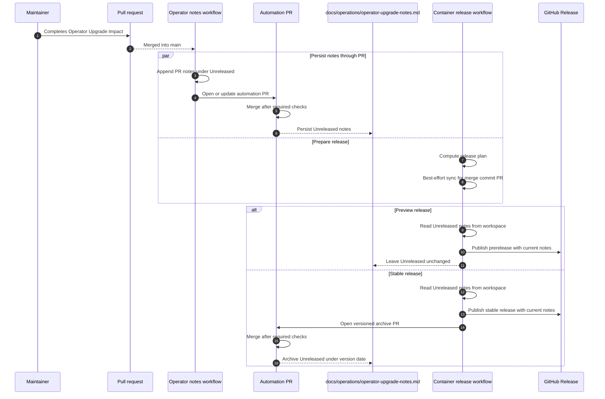

# Trusted Container Publishing

The trusted container flow runs from `.github/workflows/container-release.yml`
for `main`, stable `vX.Y.Z` tags, and manual workflow runs. Preview release
tags such as `vX.Y.Z-preview.N` are created by the `main` run and are excluded
from the tag trigger so the preview tag push does not start a second container
release workflow.

The workflow builds the production `app-runtime` and `db-job` images, the
optional `kravhantering-demo-seed` image, the HSA person lookup adapter and the
test-only `hsa-directory-mock` image, then publishes them to GHCR. The
production image identities are recorded in `container-stack.lock.json`. The
`manifestDigest` is the registry manifest digest used for GitHub Artifact
Attestations, SBOM subjects and GHCR release smoke tests. The `imageId` is the
container image ID used by production operators to verify runtime equivalence
after tag-based pulls, internal-registry mirroring or disconnected image
transport.
The test support identities are recorded separately in
`container-test-support.lock.json`.
The optional demo seed image is recorded in release metadata and release notes,
not in the production or test-support lock files.
The release smoke test starts Podman Compose from verified GHCR manifest digest
references, but production deployment and upgrade guides use tag-style runtime
refs by default and verify them against locked image IDs. The production helper
also accepts tag-and-digest refs when a site explicitly chooses pull-time digest
pinning.

The Buildx publish steps disable BuildKit's default registry provenance
attestations with `--provenance=false`. The workflow publishes provenance and
SBOM evidence explicitly through GitHub Artifact Attestations without pushing
the attestation OCI artifacts back into GHCR. This keeps GitHub Packages from
treating digest-derived attestation tags as the newest installable package
version while keeping the Buildx metadata shape stable enough to record both
`manifestDigest` and `imageId`.

## Reproducibility

The workflow uses the Node version from `.nvmrc` and installs dependencies with
`npm ci` using the npm bundled with that pinned runtime. Do not add
`npm install -g npm@latest` to this workflow. If npm must be upgraded
explicitly, pin the exact npm version and document the reason here.

Stable and preview releases use the semantic version as the primary
`app-runtime` and `db-job` image tag recorded in `container-stack.lock.json`.
Preview releases also publish `main-<short-sha>` and `sha-<full-sha>` image
tag aliases for commit traceability. Preview releases use GitVersion's
`FullSemVer` or `SemVer` value, but Docker image tags and GitHub preview tag
names strip SemVer build metadata from the first `+` onward. For example,
`1.2.0-preview.4+Branch.main.Sha.abcdef` becomes `1.2.0-preview.4`.

Local and release-smoke stack startup honor `--lock-file`. When the stack builds
local images, `run-local-stack.mjs` passes that path to
`generate-stack-lock.mjs` before `generate-compose.mjs` reads it.

## Vendor Image Lock Updates

`.github/workflows/vendor-image-updates.yml` checks nginx, SQL Server,
Keycloak and Kong upstream tags weekly from `main` and can also be run
manually with `workflow_dispatch`. Manual runs may select `all`, `nginx`,
`sqlserver`, `keycloak` or `kong`; the `include-current` input also refreshes
the immutable digest metadata for the current selected lane.

Before writing a lock or companion file, the updater validates and prepares
every file change for that image. A validation or update failure stops the run
before later images are processed, so partial changes cannot enter another
image's branch or PR.

Kong is a vendor-updated HSA integration support image. Its lock under
`containers/kong/` is copied into
`container-hsa-integration-support.lock.json` during container releases and is
used by the test-only `single-node-demo` topology. Kong is not part of the
required production runtime topology.

The HSA person lookup adapter and HSA directory mock are project-owned support
images, not vendor images. The container release workflow builds and publishes
`kravhantering-hsa-person-lookup-adapter` and
`kravhantering-hsa-directory-mock` to GHCR with the same release tags as
`app-runtime` and `db-job`. The adapter is recorded in
`container-hsa-integration-support.lock.json`; the mock is recorded in
`container-test-support.lock.json`. Both images get SBOM and provenance
attestations and are excluded from the vendor-image updater because their
source lives in this repository.

The updater selects the newest candidate tag in each current-or-newer image
lane. A lane is the image name plus the target major line, or the SQL Server
product year. Each selected tag gets an exact-version branch and PR:

- `automation/vendor-image/keycloak-26.6.4-1`
- `automation/vendor-image/keycloak-27.0.0`
- `automation/vendor-image/nginx-1.29.4-alpine`
- `automation/vendor-image/sqlserver-2025-CU3-ubuntu-24.04`
- `automation/vendor-image/kong-3.12.0.0-20260101-ubuntu`

Within a lane, newer patch and minor releases create a new exact-version PR
instead of updating the earlier version branch. For example, a Keycloak
`26.7.1` release creates `automation/vendor-image/keycloak-26.7.1` instead of
rewriting an open `automation/vendor-image/keycloak-26.6.4-1` PR. Later runs
leave an already-open exact-version PR unchanged so reviewer-added tests,
documentation, and other manually required companion changes are not
force-pushed away by automation. When `main` already contains the version
update, when `main` has advanced past an older version, or when an upstream tag
is no longer selected, the workflow closes the stale PR and deletes the branch.

The updater resolves `linux/amd64` registry manifests and records both the
platform manifest digest and the image config digest in the matching
`containers/<image>/image.lock.json` file. Keycloak updates also keep
`docker-compose.idp.yml`, both devcontainer Compose files and the developer
auth documentation on the same tag. Kong updates keep both devcontainer
Compose files digest-pinned, keep
`container-hsa-integration-support.lock.json` synchronized with
`containers/kong/image.lock.json`, and keep the public direct-pull example in
`containers/production/env/release.env.template` plus its release-helper test
assertion aligned with the lock. SQL Server updates keep
`docker-compose.sqlserver.yml` and both devcontainer Compose files on the same
tag. nginx updates keep the public direct-pull example in
`containers/production/env/release.env.template` aligned with the lock; nginx
has no static devcontainer or integration-test Compose reference outside the
generated stack.

The updater workflow does not run the full test suite. It creates or updates
the PR, and the normal PR workflows validate the change. To make those PR
workflows run automatically from automation-created PRs, configure a
`VENDOR_IMAGE_UPDATE_TOKEN` secret from a fine-scoped PAT or GitHub App token
that can push branches and create pull requests. If the secret is absent, the
workflow falls back to `github.token`; that fallback can update branches and
PRs when repository settings allow it, but GitHub may suppress downstream PR
workflow runs that are triggered by the built-in token.

## Release Evidence

The GitHub Release page already shows the release tag, commit and workflow
provenance. The generated release body therefore focuses on the `Container
Images` section with semantic GHCR tags for normal pulls, the immutable GHCR
manifest digest references for `app-runtime` and `db-job` verification, and
the production deployment bundle assets. Stable releases use normal GitHub
Releases; preview releases are marked as pre-releases and are kept as part of
the release evidence.

The `Container Images` section groups entries by container package, adds a
short purpose description for each image, and lists every published tag for
that release. Those tag entries link to the repository package version URL for
the exact tag when the GitHub Packages API is available during release-note
generation, for example
`https://github.com/<owner>/<repo>/pkgs/container/<package>/<version-id>?tag=<tag>`.
If the package-version lookup is unavailable, the notes fall back to the
repository package page.

When a release includes test support metadata, the generated notes also include
`Test Support Container Images`. That section lists
`kravhantering-hsa-directory-mock` separately from the production runtime
images so operators do not mistake it for a required production service.

When a release includes demo seed metadata, the generated notes include
`Demonstration Container Images`. That section lists
`kravhantering-demo-seed` as an explicit opt-in image for disposable demo and
test environments. The image defaults to `seed:demo` and also owns
`demo:clear --confirm-clear-non-required-data`, so applying and clearing demo
data use the same opt-in container boundary. It is not part of the production
deployment bundle or the standard `release.env.template`.

Release notes also include automatic change notes. Stable releases compare
against the previous published stable GitHub Release. Preview releases compare
against the previous published pre-release GitHub Release. When no previous
release of the same kind exists, the workflow does not let GitHub pick another
release kind as the changelog boundary.

The workflow asks GitHub to generate the `What's Changed` section with
`.github/release.yml`. That file groups pull requests by repository labels and
uses `Other Changes` as a catch-all so unlabeled merged work still appears.
Only pull requests labeled `ignore-for-release` are excluded from the generated
section. If GitHub-generated notes are unavailable, the release still publishes
with the runtime evidence below.

Operator upgrade notes are maintained in
`docs/operations/operator-upgrade-notes.md`. A separate merged-pull-request
workflow reads completed Operator Upgrade Impact evidence from the trusted pull
request body and appends it under `## Unreleased` with hidden source markers.
The Operator Upgrade gate and merged-pull-request workflow both skip pull
requests authored by `dependabot[bot]` whose title starts with `build(deps):`;
dependency-only updates therefore do not require or persist operator notes.
Instead of pushing directly to protected `main`, the workflow opens or updates
the `automation/operator-upgrade-notes` PR and enables auto-merge when GitHub
allows it. Configure an `OPERATOR_UPGRADE_NOTES_TOKEN` secret from a
fine-scoped PAT or GitHub App token for the `Viscalyxbot` machine user that can
push branches and create pull requests so the normal PR checks run for that
automation PR. The workflow commits those documentation changes as
`Viscalyxbot <viscalyxbot@viscalyx.se>` before opening or updating the PR, and
the PR title includes the latest source PR number. Stable release archives use
the same token and protected-branch PR pattern, with a version-specific branch.
The automation fails when that secret is absent or cannot authenticate against
the repository; it does not fall back to `github.token`, because that would
hide token expiry and can suppress downstream PR workflow runs. The container
release job also runs a local best-effort sync for the merge commit before
image publication so a preview release can include notes even when the
persistence workflow is still catching up. That fallback only changes the
release workspace; it does not push documentation commits.

Stable releases consume the visible `## Unreleased` notes into the GitHub
Release body and then open or update an automation PR that archives the same
section under `## vX.Y.Z - YYYY-MM-DD`. Required checks run before auto-merge
persists the archive on `main`. Preview releases include current
`## Unreleased` notes but do not archive them.

Each trusted run also writes runtime evidence:

- `container-stack.lock.json` lists the exact image name, tag,
  `manifestDigest`, `imageId`, source and role for `app-runtime`, `db-job`,
  nginx, SQL Server and Keycloak.
- `container-hsa-integration-support.lock.json` lists the exact image name,
  tag, `manifestDigest`, `imageId`, source and role for Kong and the HSA
  person lookup adapter.
- `container-test-support.lock.json` lists the exact image name, tag,
  `manifestDigest`, `imageId`, source and role for the test-only HSA directory
  mock support image.
- `release-metadata.json` records published project image identities, including
  the expected database schema migration `name` and the optional
  `kravhantering-demo-seed` image. The production deployment bundle writes a
  filtered copy that excludes that optional demo image.
- `container-stack.compose.yml` is the generated Compose file that the smoke
  test started.
- `hashes.sha256` contains checksums for saved runtime evidence.
- `public/build.json` contains the app version, commit SHA, build time, image
  tag and expected database schema migration `name` embedded in the tested app
  image.
- `api-docs/hsa-person-lookup/` contains the static Swagger UI for the
  HSA-person lookup REST contract.

The workflow uploads these artifact groups:

- `container-release-runtime-*` for Compose, stack lock, status, build
  metadata and hashes.
- `container-release-metadata-*` for GitVersion, release metadata, release
  notes and SBOM files, including optional demonstration image SBOMs.
- `container-release-playwright-*` for the release-smoke report,
  screenshots, traces and test results.
- `container-release-deployment-*` for the production deployment bundle and
  its flat checksum.

The production deployment bundle includes `bin/kravhantering-images.sh`, a
Bash and jq helper for explicit operator verification. It can verify configured
tag-style `release.env` image refs against locked image IDs, optionally verify
tag-and-digest refs against locked manifest digests, export already present
verified local images into a transport bundle, and load and tag that bundle on
a disconnected host.
The bundled nginx Compose files mount `api-docs/` and serve the HSA-person
lookup Swagger UI at `/api-docs/hsa-person-lookup/` on the same public origin
as the application.

The production deployment bundle is also uploaded to GitHub Releases as:

- `kravhantering-production-deploy-<version>.tar.gz`
- `kravhantering-production-deploy-<version>.tar.gz.sha256`

Markdown files in the deployment bundle bring along local image links. Keep
release-guide diagrams under `docs/images/`. Use `public/` only for content
that the deployed Next.js application intentionally serves at runtime, because
the app-runtime image copies that directory into the container.

See
[rhel10-production-deploy.md](../operations/rhel10-production-deploy.md) for
the enterprise app-node workflow with external SQL Server and external IdP.
See
[rhel10-production-single-node-self-contained-deploy.md](../operations/rhel10-production-single-node-self-contained-deploy.md)
for the self-contained single-node workflow with bundled SQL Server and
Keycloak.
The bundle also includes the matching topology-specific disconnected guides,
upgrade guides and uninstall guides. The disconnected guides document how
operators create a transferable bundle that contains the production deployment
archive, its checksum, exported images, image refs and hashes.

Operator verification of published release evidence is documented in
[Release Artifact And Image Verification](../operations/release-artifact-and-image-verification.md).

## Public GHCR Packages

The packages should be public if users must be able to pull the release
artifacts anonymously:

- `ghcr.io/<owner>/kravhantering-app-runtime`
- `ghcr.io/<owner>/kravhantering-db-job`
- `ghcr.io/<owner>/kravhantering-hsa-person-lookup-adapter` for optional HSA
  integration support
- `ghcr.io/<owner>/kravhantering-hsa-directory-mock` for test-only
  `single-node-demo` support
<!-- cSpell:ignore opencontainers -->
The publish steps attach `org.opencontainers.image.description` as both an
image label and a manifest annotation. GHCR reads labels for normal image
metadata, and its package UI needs the annotation form for images published
through manifest/index-style Buildx outputs.

GHCR visibility is managed outside the workflow through package settings or the
organization defaults for new packages. The workflow does not change package
visibility and does not check the GitHub Packages API after publishing. GitHub
normally makes new packages private on first publication unless the organization
has selected a different default.

GHCR can also show digest-derived `sha256-*` entries for release evidence, such
as registry-pushed attestations or Cosign signature helper artifacts. Those
entries are evidence for the image manifest digest, not runnable `app-runtime`
or `db-job` release images. GitHub Packages sorts package versions by publish
time, so an evidence entry created after the image push can appear above the
semantic version tag and be suggested by the package UI as the latest
command-line install target. The workflow keeps GitHub Artifact Attestations
out of GHCR and does not push Cosign image signatures to GHCR for that reason.
Treat the GitHub Release notes, `container-stack.lock.json`, and the semantic
image tags as the release source of truth; do not use `sha256-*` evidence
entries as production image tags.

GitHub warns that a package made public cannot be made private again. Only make
the packages public when anonymous pulls and review without GitHub
authentication are intentional.

## Tokens and Keys

Image and GitHub Release publishing use the built-in `GITHUB_TOKEN` that GitHub
Actions creates for the run. Normal publishing does not require private deploy
keys or signing keys. Stable operator upgrade note archiving is the exception:
it uses the separately configured `OPERATOR_UPGRADE_NOTES_TOKEN` described
above so its protected-branch PR triggers the required checks.

The repository or organization GitHub Actions setting must allow `GITHUB_TOKEN`
to have write permissions. The workflow requests these permissions:

- `packages: write` to log in to GHCR and push `app-runtime` and
  `db-job`.
- `contents: write` to create preview tags and create or update the GitHub
  Release with artifacts.
- `id-token: write` for GitHub Artifact Attestations.
- `attestations: write` to publish provenance and SBOM attestations.

The GHCR packages must also allow the workflow in this repository to write to
the packages. For new packages, the first publication from the workflow is
usually enough. For packages that already exist, the package's **Manage Actions
access** settings may need to grant this repository write or admin access.

Do not add a registry-pushed `cosign sign` step to this flow unless the
signatures are deliberately stored outside the runnable image packages. Cosign's
default registry storage creates digest-derived signature tags that GHCR can
display as recent package versions.
