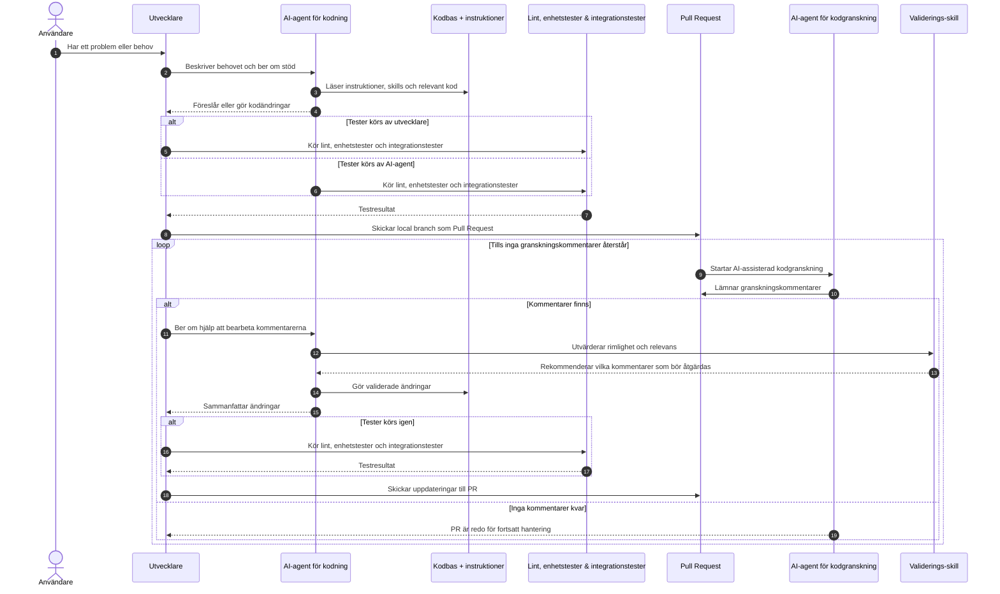

# Utvecklingsverktyg för projektet

Det här dokumentet visar förslag på flöde för utvecklare och listar de
verktyg och åtkomster en utvecklare behöver för att arbeta med Kravhantering.

## Basverktyg

- Git.
- Node.js 24.
- npm.
- En Unix-liknande terminal.
- Docker-kompatibel `docker compose`.
- Modern webbläsare för lokal körning och felsökning.

Node-versionen är låst i `.nvmrc` och `package.json`. Använd samma
huvudversion lokalt, i devcontainer och i CI.

## Rekommenderad utvecklingsmiljö

En utvecklare bör ha ett av följande miljöalternativ:

- VS Code med Dev Containers.
- GitHub Codespaces.
- Red Hat OpenShift Dev Spaces.
- VS Code Remote SSH mot en förberedd RHEL-miljö.

Devcontainer-miljön är den mest kompletta lokala standardmiljön. Den innehåller
projektets vanliga Node-, databas-, auth- och testförutsättningar.

## Editor och tillägg

Rekommenderad editor är VS Code.

Praktiska tillägg:

- Dev Containers.
- SQLTools med MSSQL-stöd.
- Playwright Test for VS Code.
- ESLint/Biome-stöd om teamets editor använder det.
- Markdown-stöd med markdownlint.

Editorn behöver kunna hantera TypeScript, React, Tailwind CSS och Markdown.

## Lokala stödtjänster

Utvecklaren behöver kunna köra eller nå dessa tjänster:

- SQL Server Developer för applikationsdatabasen.
- Keycloak för lokal OIDC-inloggning.
- Kong Gateway för devcontainer-lokal API-management-verifiering.
- HSA-personuppslagsadapter för devcontainer-lokal REST-till-SOAP-verifiering
  av personuppslag via Kong.
- HSA-katalogmock för devcontainer-lokal SOAP-verifiering av `GetHsaPerson`
  bakom adaptern.
- OpenRouter-konto och API-nyckel om AI-stödet ska testas.

I devcontainer, Codespaces och Dev Spaces hanteras SQL Server, Keycloak, Kong,
HSA-personuppslagsadaptern och HSA-katalogmocken som sidotjänster. Vid
host-baserad utveckling krävs lokal Docker Compose-körning.

## Databasverktyg

Utvecklaren behöver ett sätt att läsa den lokala SQL Server-databasen.

Rekommenderat:

- VS Code SQLTools.
- MSSQL-drivrutin för SQLTools.
- Read-only databasanslutning från `npm run db:browse`.

För mer avancerad felsökning kan även SQL Server Management Studio, Azure Data
Studio eller motsvarande SQL Server-klient användas.

Ändringar i databasens schema och data för tester hanteras i kod, inte manuellt
i databasklienten.

## Auth-verktyg

För lokal auth behövs:

- Keycloak Admin Console vid ändringar i den lokala realm-filen.
- Projektets seedade testkonton.
- `scripts/dev-curl.sh` för autentiserade HTTP-anrop mot
  utvecklingsservern.

Vanlig `curl` räcker inte för skyddade routes eftersom auth alltid är aktiv.

## HSA-id-uppslagsverktyg

För lokala HSA-id-uppslag i devcontainer används `HSA_PERSON_LOOKUP_URL` mot
Kong på `http://kong:8000/hsa/person-records/lookup`. Kong skickar vidare till
`hsa-person-lookup-adapter`, som anropar SOAP-slutpunkten `GetHsaPerson` i
HSA-katalogmocken med mTLS.

Använd följande kommandon när personuppslag eller Kong-routning behöver
felsökas:

```sh
npm run devcontainer:kong:status
npm run devcontainer:hsa-mock:status
npm run devcontainer:hsa-mock:verify
```

Mermaid-diagrammen för autentisering mellan app och Kong samt för
Kong-adapter-HSA-flödet finns i
[hsa-person-lookup-integration.md](../integrations/hsa-person-lookup-integration.md).

`npm run dev` genererar även en statisk Swagger UI för REST-kontraktet och
låter Next.js utvecklingsserver exponera den på samma ursprung som
applikationen:

```text
http://localhost:3000/api-docs/hsa-person-lookup
```

## Test- och kvalitetsverktyg

Följande verktyg installeras via projektets npm-beroenden:

- TypeScript.
- Vitest.
- Playwright.
- Biome.
- markdownlint.
- cSpell.
- Pyright.
- Tailwind CSS kanonisk klass-lint.

Playwright behöver egna webbläsare. Devcontainer och Codespaces installerar dem
som en del av miljön. Vid host-baserad utveckling behöver utvecklaren kunna köra
Playwrights installationssteg.

`npm run lint` kör även Tailwind-kontrollen för kanoniska klassnamn. När
kontrollen rapporterar en klass ska utvecklaren normalt ersätta den med den
föreslagna kanoniska formen, till exempel `rounded-4xl` i stället för ett
likvärdigt godtyckligt värde.

## Container- och leveransverktyg

För arbete med bygg, release och produktionslik körning behövs:

- Docker eller Podman.
- Docker Buildx när containeravbildningar byggs lokalt.
- Tillgång till GitHub Actions.
- Tillgång till GHCR eller det containerregister som används av organisationen.
- `gh` CLI om teamet hanterar releaser och workflowkörningar från terminalen.

För RHEL-baserad driftmiljö kan även Podman Compose och systemd behövas i
servermiljön.

## Åtkomster och behörigheter

Utvecklaren kan behöva:

- Läs- och skrivbehörighet till GitHub-projektet.
- Behörighet att läsa GitHub Actions-loggar.
- Behörighet att läsa eller publicera containeravbildningar.
- Åtkomst till projektets hemligheter i vald utvecklingsmiljö.
- Lokal administratörsbehörighet för Docker, Podman eller motsvarande
  containerkörning.

Hemligheter ska ligga i lokala `.env.*.local`-filer, Dev Spaces-Secrets eller
organisationens hemlighetshantering. De ska inte checkas in.

## Agentic engineering

Agentic engineering innebär att utvecklaren använder AI-agenter som praktiskt
stöd i utvecklingsarbetet. Det ersätter inte kodgranskning, ansvariga beslut
eller CI/CD, men kan korta tiden från fråga till verifierad ändring.

Det kan hjälpa utvecklaren med:

- Orientering i kodbasen och snabb sammanfattning av relevanta filer.
- Förslag på ändringar i kod, tester och dokumentation.
- Felsökning av testfel, lint-resultat och CI/CD-loggar.
- Framtagning av testfall för ändrade flöden.
- Uppdatering av dokumentation när funktionalitet, verktyg eller
  driftantaganden ändras.
- Genomgång av PR-kommentarer och förslag på åtgärder.
- Riskgenomgångar för dataskydd, behörighet, audit och säkerhet.
- Förberedelse av releaseanteckningar, handover och tekniska sammanfattningar.

För att vara användbart behöver agentstödet kunna läsa kodbasen, köra lokala
kommandon, se testresultat och arbeta i samma källkodssystem som utvecklaren.
För UI-arbete är tillgång till en lokal webbläsare eller Playwright-vy viktig.
Agentstödet bör också kunna läsa och följa projektets instruktioner, till
exempel `AGENTS.md`, `.github/copilot-instructions.md` och
`.github/instructions/*.md`, samt stödja återanvändbara skills för återkommande
arbetsflöden.

Agenten bör arbeta via vanliga grenar, PR:er och CI/CD-kontroller. Den ska inte
ha direkt åtkomst till produktionshemligheter, produktionsdata eller
produktionsmiljöer. Mänsklig granskning behövs för arkitekturval,
säkerhetsbeslut, dataskyddsbedömningar och releasebeslut.

Rimlig kompetensnivå för en AI-agent i det här projektet:

- Senior nog att förstå TypeScript, React, Next.js App Router, SQL Server,
  TypeORM, Docker och GitHub Actions.
- Van vid att läsa befintlig kod och följa lokala mönster i stället för att
  införa ny arkitektur i onödan.
- Kapabel att skriva och uppdatera unit-, integration- och dokumentationstester.
- Kapabel att tolka CI/CD-loggar, Playwright-resultat, lint-resultat och
  säkerhetsfynd.
- Kapabel att följa repository-instruktioner och använda skills för
  återkommande arbetsflöden.
- Medveten om dataskydd, behörigheter, spår för åtgärdslogg och hantering av
  hemligheter.
- Bäst lämpad som stöd för implementation, felsökning och analys; inte som
  ensam beslutsfattare i arkitektur, säkerhet eller release.

Lämpliga LLM:er att utvärdera:

- OpenAI GPT-5.5 eller senare frontier-modell för bredare analys, designval,
  felsökning och dokumentation.
- GitHub Copilot Business eller Enterprise med organisationens godkända
  basmodell (GPT 5.5 / Opus 4.6 eller senare) om GitHub är valt källkodssystem.
- Anthropic Claude Opus 4.6 eller senare Opus-modell för komplexa
  kod- och agentuppgifter.
- Google Gemini 2.5 Pro eller senare Pro-modell om organisationen använder
  Google Cloud, Vertex AI eller Gemini-baserade utvecklarverktyg.

Välj modell efter uppgift. Använd starkaste modellen för kod för större
ändringar, felsökning över flera filer och CI/CD-problem. Använd snabbare eller
billigare modeller för sammanfattningar, enkla dokumentationsändringar och
avgränsade frågor.

---

## Gemensamma verktyg för kodbasen

Kodbasen behöver gemensamma system som ägs av teamet eller organisationen.

- Källkodssystem med Git-stöd, till exempel GitHub, Azure DevOps Services eller
  Azure DevOps Server.
- Pull request- eller merge request-flöde med kodgranskning och
  AI-assisterad kodgranskning.
- Stöd för paket- och beroendeuppdateringar för kodbasens beroenden.
- Säkerhets- och sårbarhetsskanning för kod, beroenden och
  containerdefinitioner.
- Skanning efter produktionshemligheter. Produktionshemligheter som hamnar i
  kodbasen eller dess historik ska betraktas som röjda.
- CI/CD-motor som kan köra projektets npm-, Playwright- och containersteg.
- Containerregister för `app-runtime`, `db-job` och stödavbildningar.
- Artefaktlagring för releasepaket, rapporter, SBOM och testresultat.
- Hemlighetshantering för OIDC, databas, containerregister och externa
  API-nycklar.
- System för ärenden och backlogg för fel, utvecklingsuppgifter och
  releaseplanering.

Om GitHub inte används behöver motsvarande funktioner finnas i den valda
plattformen.

---

## Funktioner som CI/CD behöver stödja

CI/CD-plattformen behöver kunna köra projektets kvalitetssäkring, byggen och
releaseflöden på ett reproducerbart sätt.

Den behöver stödja:

- Node.js 24 och `npm ci`.
- Körning av `npm run check`.
- Playwright-tester med Playwrights webbläsare.
- Docker eller annan OCI-kompatibel containerbyggare.
- Bygg och publicering av flera containeravbildningar.
- Inloggning mot containerregister.
- Hantering av hemligheter för databas, OIDC, containerregister och externa
  API:er.
- Lagring av testresultat, loggar och rapporter som artefakter.
- Separata flöden för pull request, main-branch och release.
- Manuell start av release- eller driftrelaterade arbetsflöden.
- Taggade releaser och versionsmetadata.
- SBOM, checksummor och releasepaket när leveransflödet kräver det.

För produktionslik verifiering behöver CI/CD också kunna starta beroenden som
SQL Server och Keycloak, eller ansluta till kontrollerade testinstanser.

### Pipelines som körs idag

Följande GitHub Actions-workflows finns idag. Om en annan CI/CD-plattform
används behöver motsvarande pipelines finnas där.

#### Release

- `Container Release` (`.github/workflows/container-release.yml`) körs på
  huvudgrenen, stabila versionstaggar och manuellt. Den bygger och publicerar
  `app-runtime` och `db-job`, skapar SBOM, attesterar artefakter och kör
  release-smoke.
- `Container PR Smoke` (`.github/workflows/container-pr-smoke.yml`) körs på
  pull requests. Den bygger containerstacken, verifierar OCI-arkiv och kör
  release-smoke innan ändringen slås ihop.
- `Vendor Image Updates` (`.github/workflows/vendor-image-updates.yml`) körs
  schemalagt och manuellt. Den kontrollerar låsta nginx-, SQL Server-,
  Keycloak- och Kong-avbildningar och skapar eller uppdaterar PR:er.

#### Tests

- `Build Check` (`.github/workflows/build-check.yml`) körs på pull requests
  och huvudgrenen. Den installerar beroenden och verifierar produktionsbygget.
- `Quality Checks` (`.github/workflows/quality-checks.yml`) körs på pull
  requests och huvudgrenen. Den kör unit-tester och täckningsrapport. Är
  även den
  samlade lint- och formatpipelinen. Den kör formatkontroll, stavningskontroll,
  Biome-lint, Markdown-lint, TypeScript-kontroll, Pyright och dotenv-lint.
- `Integration Tests` (`.github/workflows/integration-tests.yml`) körs på pull
  requests och huvudgrenen. Den kör Playwright mot utvecklingsserver,
  produktionslik server och produktionslik server utan utvecklingsberoenden.
- `Requirement List Performance`
  (`.github/workflows/requirements-list-performance.yml`) körs på pull requests
  och huvudgrenen. Den verifierar SQL Server-baslinjen för kravlistans
  prestanda.

#### Lint

- `Quality Checks` (`.github/workflows/quality-checks.yml`)

#### Security

- `Repository Security` (`.github/workflows/security-repository.yml`) körs på
  pull requests, huvudgrenen, schema och manuellt. Den kör `npm audit` och
  Trivy för sårbarheter och konfigurationsfynd.
- `Security API` (`.github/workflows/security-api.yml`) körs på pull requests,
  huvudgrenen, schema och manuellt. Den testar REST API-kontraktet mot en
  produktionslik lokal app.
- `Security MCP` (`.github/workflows/security-mcp.yml`) körs på pull requests,
  huvudgrenen, schema och manuellt. Den kör seedad MCP-säkerhetsskanning mot en
  produktionslik lokal app.
- `Security DAST` (`.github/workflows/security-dast.yml`) körs på pull
  requests. Den kör dynamisk webbsäkerhetstestning mot en autentiserad
  produktionslik lokal app.
- `SSDLC Gate` (`.github/workflows/ssdlc-gate.yml`) körs på pull requests. Den
  kontrollerar att PR:en har nödvändig SSDLC-evidens.

#### Stöd

- `Copilot Setup Steps` (`.github/workflows/copilot-setup-steps.yml`) används
  för att förbereda GitHub Copilot-agentens miljö. Den är ett stödflöde, inte en
  release-, test-, lint- eller säkerhetsgate.

## Utvecklarflöde

<!-- cSpell:ignore autonumber -->



### Kortfattade förklaringar

1. **Problem eller behov identifieras**
   Flödet börjar med att användaren har ett behov, ett fel, en förbättring
   eller en ny funktion.

2. **Utvecklaren använder en AI-agent för kodning**
   Utvecklaren använder en AI-agent som kan följa kodbasens instruktioner,
   använda skills och förstå relevanta delar av koden.

3. **Kodändringar testas lokalt**
   Antingen utvecklaren eller AI-agenten kör lint, enhetstester och
   integrationstester för att fånga fel tidigt.

4. **Branch skickas som Pull Request**
   När ändringarna verkar fungera skickas den lokala grenen in som en PR.

5. **AI-assisterad kodgranskning startar**
   PR:en granskas av en annan AI-agent än den som användes för kodningen, för
   att minska risken för självbekräftande granskning.

6. **Kommentarer valideras innan ändringar görs**
   Utvecklaren tar granskningskommentarerna och använder AI-assisterad kodning
   tillsammans med en Validerings-skill för att bedöma om kommentarerna är
   rimliga, relevanta och värda att åtgärda.

7. **Ändringar skickas tillbaka till PR**
   Validerade ändringar görs, testas vid behov och skickas tillbaka till
   PR:en. Därefter startar granskningsloopen om tills inga kommentarer återstår.
