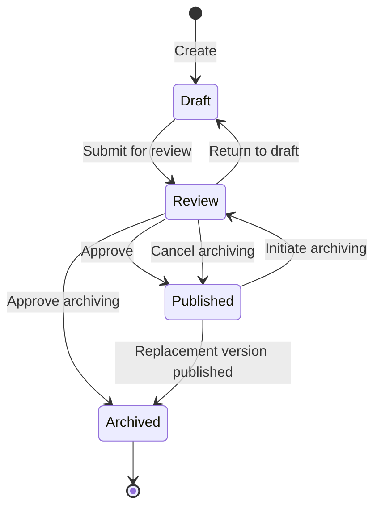
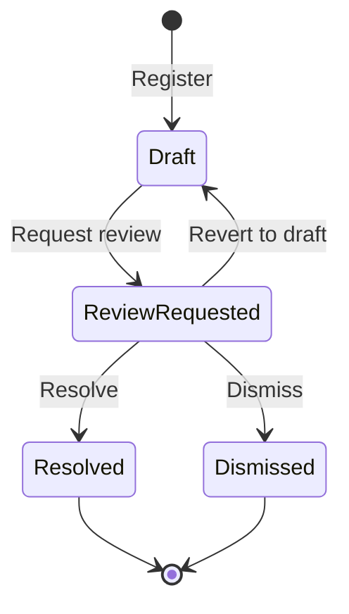
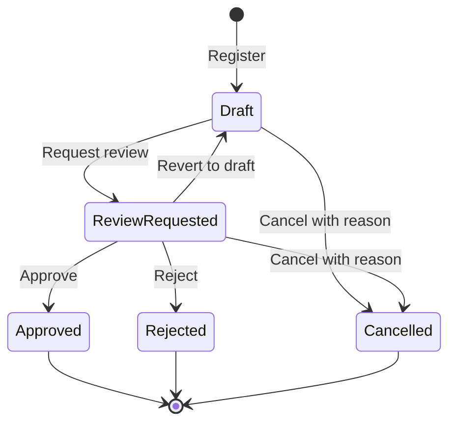

# Lifecycle Workflows

This guide is for requirement authors, reviewers and specification owners
who need to choose valid lifecycle actions and understand their effects.

## Requirement Version Lifecycle

Requirement versions follow a controlled lifecycle:

- **Draft:** Initial state. The requirement is being authored or revised.
  Stale saves are rejected instead of overwriting another author's changes.
- **Review:** The requirement is under review for either publication or
  archiving. These contexts have different actions and labels; see
  [UI status labels](#ui-status-labels).
- **Published:** The requirement is approved and available for use. Publishing
  a replacement automatically archives the previous Published version.
- **Archived:** The requirement version is retired or superseded.

When a published requirement needs changes, a **new
version** is created in Draft status while the previous
Published version remains active until the new version is
published. This re-enters the workflow at Draft, going
through Review and Published again before replacing the
earlier version.

If the requirement belongs to requirement packages, those
packages continue to point at the existing Published version
while the replacement is Draft or Review. When the replacement
is published, the package membership moves to the new
Published version and is removed from the archived
predecessor. Requirement-package links are therefore current
membership, not history markers for earlier versions.

When a Published version is archived without a successor, its
requirement-package link may remain as package history. Practical
package usage, such as adding requirements to a requirements
specification, still excludes archived versions and uses only
Published requirements. Requirement-library package filtering is a
search context instead: archived package-linked requirements can be
shown there when the user includes Archived in the status filter.

Restoring a previous version creates a **new Draft version** from its
content and associations. The source version remains unchanged. The new
version must go through the full Review → Published cycle. Creating a
replacement or restoring a version is therefore not a status transition
of the source version in the diagram above.

### Recovering Concurrent Edits

When a save conflicts with another author's update, the editor keeps the
starting content and unsaved form values. **Compare with latest** fetches
current content without replacing the form. The comparison shows starting,
local and server values for changed fields, including taxonomy and
association selections.

Independent changes carry into a proposed result. Competing changes require
an explicit choice; identical changes do not. Norm-reference and
requirement-package selections are unordered sets: competing sets require a
choice, not a union. Dependent type/quality-characteristic and
verifiable/verification-method values stay together when changes compete.

After resolving conflicts, review and edit the result in the ordinary form.
Saving checks that the compared version has not changed again. If another
update intervenes, compare again with the working result preserved.
Cancelling comparison and unsuccessful fetch/save attempts preserve local
work. Leaving through the editor's actions, global navigation or browser history
requires an explicit discard confirmation when there are unsaved changes.
Reloading or closing the tab uses the browser's unload confirmation.

Review and Archived versions remain protected. Permission changes also block
editing. **Copy unsaved work** remains available, with visible feedback if
copying fails. Copying does not clear the values. Recovery is held in the
open editor; it is not persisted across browser restarts.

### Deleting Drafts

Only the latest version can be deleted, and only while it is a Draft.

Deleted draft version numbers may be reused by a later draft for the
same requirement. If the deleted draft was the only version, the
requirement itself is deleted instead of being archived.

### Two-Step Archiving

Archiving a published requirement is a two-step review
process — it cannot be archived directly:

1. **Initiate archiving** — moves the Published version to archiving Review.
   This is blocked if the requirement already has a newer Draft or Review
   version.
2. **Approve archiving** — archives the version under archiving review and
   marks the requirement as archived.

Alternatively, **Cancel archiving** returns that version to Published and
preserves its original publication date. Approval and cancellation affect
only the version under archiving review, never a newer Draft or Review.

See [version-lifecycle-dates.md](../reference/version-lifecycle-dates.md) for
detailed timestamp rules.

## UI status labels

The requirements list shows an effective requirement status across its
versions; version history shows each version's own status. A requirement
can therefore have a Published version in use while a replacement is Draft
or under publication review.

The labels distinguish publication review from archiving review:

<!-- markdownlint-disable MD013 -->

| Swedish | English | Meaning |
| --- | --- | --- |
| Utkast | Draft | Content is being authored or revised. |
| Granskning | Review | Publication review; publish or return to Draft. |
| Arkiveringsgranskning | Archiving Review | Archiving review; approve or cancel archiving. |
| Publicerad | Published | Approved and available for use. |
| Arkiverad | Archived | Retired or superseded version. |

<!-- markdownlint-enable MD013 -->

## Improvement Suggestion Lifecycle

Improvement suggestions linked to a library requirement follow a separate
lifecycle:

- **Draft:** Initial state. The suggestion can be edited or deleted.
- **Review Requested:** Submitted for assessment. Can be reverted to Draft.
- **Resolved:** The suggestion has been addressed.
- **Dismissed:** The suggestion was evaluated but not acted on.

Resolved and Dismissed are terminal outcomes and require a resolution
motivation. A resolved suggestion may link to the requirement version that
implements it, either when resolving it or once afterwards. The version
must belong to the same requirement; recording that evidence does not
publish the version or reopen the suggestion.

## Deviation Lifecycle

Deviations record a request to deviate from specific requirement content
within a requirements specification. They can belong to a library
requirement application or a specification-local requirement.
A single item can have multiple deviations over time, but only one
undecided request at a time, including drafts and renewal requests.

With agreements, select the current or upcoming agreement containing the
reviewed content. Historical content cannot receive new requests or
review decisions. A confirmed upcoming agreement that replaces or removes
current content also blocks new requests against that current content.

- **Draft:** Initial state. The deviation can be edited.
- **Review Requested:** Submitted for decision. Can be reverted to Draft.
- **Approved:** The deviation has been accepted.
- **Rejected:** The deviation has been denied.
- **Cancelled:** An undecided request is withdrawn with a reason.
  Cancellation preserves the request's history; deletion is rejected even
  for drafts.

Approved, Rejected and Cancelled are terminal request outcomes. A recorded
decision cannot be edited or reopened. Approval or rejection requires a
decision motivation.

### Approval Validity, Renewal and Ending

An approval can include conditions and an optional last valid date.
The date is inclusive in Stockholm time and cannot be
before the decision day. An **applicable approved deviation** is an approval
that has not expired, been superseded or ended for the reviewed content.
The original approved decision remains historical evidence after its
permission ends.

To continue permission, create a renewal referring to the latest approval
of the same content. The renewal follows Draft → Review Requested →
Approved or Rejected. A new approval supersedes the previous approval in
all agreements sharing that content; a pending or rejected renewal does
not extend its validity. After an approval has been explicitly closed,
create a new request instead of renewing the closed approval.

An applicable approval may be explicitly closed with a reason after any
pending renewal is cancelled. Replacing or removing approved content can
require an authorized ending, including a planned ending when a successor
agreement takes effect. Agreement ending can also end permission.
Unchanged content can share an approval across agreements; approval does
not transfer automatically to changed content.

### Deviation Effect on Usage Status

Approving a deviation does **not** automatically change
the usage status. To mark the item as deviated,
the user must manually set the usage status to
"Deviated" (see below). This is only allowed when at
least one applicable approved deviation exists for the item.

## Usage Status

When a requirement is included in a requirements specification
it becomes a **requirement application** with a manually managed
usage status. There is no required sequence between usage statuses.
Authorized users can change status for current content; historical content
and content belonging only to an upcoming agreement cannot receive usage
follow-up. The Deviated status has an additional approval guard.

<!-- markdownlint-disable MD013 -->
| Swedish | English | Description |
| --- | --- | --- |
| Inkluderad | Included | Default. No work started. |
| Pågående | In Progress | Implementation underway. |
| Implementerad | Implemented | Requirement implemented. |
| Verifierad | Verified | Verified and tested. |
| Avviken | Deviated | Requires an applicable approved deviation when selected. |
| Ej tillämpbar | Not Applicable | Not applicable in this context. |
<!-- markdownlint-enable MD013 -->

- Every new requirement application starts with usage status **Included**.
- Status changes are timestamped.
- The usage status is required for every requirement application. It can change
  among these statuses but cannot be cleared.
- **Guard rule:** The **Deviated** status can only be
  set when the requirement application has an applicable approved
  deviation. An expired, superseded or ended approval is insufficient.
  The system rejects the update otherwise.
- Creating or approving a deviation does **not**
  automatically update the usage status.

### Deviation-in-Specification Process

The end-to-end process for handling deviations within a
requirements specification:

1. A requirement application exists in the specification (usage status
   defaults to Included).
2. The user registers a deviation on the item, providing
   a motivation.
3. The deviation goes through
   Draft → Review Requested → Approved or Rejected.
4. If approved, the user may set the usage status
   to **Deviated**. The system validates that an approved
   deviation remains applicable before allowing this.
5. If rejected, the usage status remains
   unchanged and the user may register a new deviation.
6. A requirement application can accumulate multiple deviations for
   historical tracking.
7. Removing an application preserves its deviation history. Cancel
   undecided requests first, and handle applicable approvals through the
   authorized ending workflow. Removal also requires usage status Included.
