<!-- AUTO-GENERERAD — redigera inte manuellt. Kör: npm run generate-guide -->
# Kravhantering — Användarguide

> Guiden genererades automatiskt av Playwright 2026-04-11.
> Alla skärmdumpar visar det svenska gränssnittet.

## Innehållsförteckning

1. [Översikt och navigering](#översikt-och-navigering)
2. [Kravkatalogen](#kravkatalogen)
3. [Skapa ett nytt krav](#skapa-ett-nytt-krav)
4. [Kravdetaljer och statusövergångar](#kravdetaljer-och-statusövergångar)
5. [Kravpaket](#kravpaket)
6. [Avsteg](#avsteg)
7. [Förbättringsförslag](#förbättringsförslag)
8. [Administrationscenter](#administrationscenter)
9. [Referensdatahantering](#referensdatahantering)
10. [Rapporter](#rapporter)

## Översikt och navigering

### Startsida — Kravkatalogen

Kravhantering öppnas i Kravkatalogen som är programmets centrala nav. Härifrån
kan du söka, filtrera och hantera alla krav i systemet.

### Navigationsfält

Det övre navigationsfältet ger åtkomst till alla huvuddelar: **Kravkatalogen**
(Krav), **Kravpaket**, **Admininställningar** (kugghjulsikonen) samt
language-väljare och tema (ljust/mörkt läge).

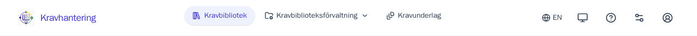

### Språkväljare

Applikationen stödjer svenska och engelska. I bilden har engelska valts, vilket
gör att alla gränssnittstexter — knappar, etiketter, rubriker och navigering —
visas på engelska. Observera att kravegenskaper som kravtext och
acceptanskriterier inte lokaliseras av systemet; dessa skrivs på det språk som
användaren själv väljer för varje krav.

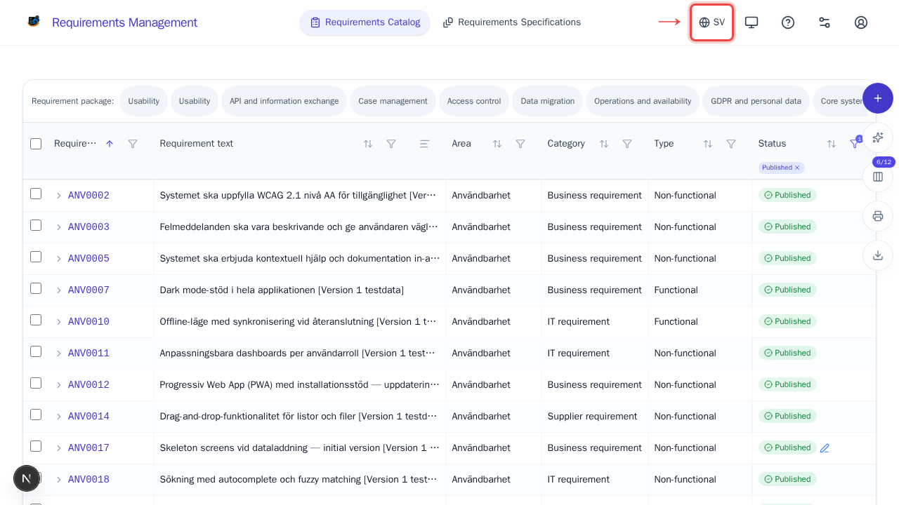

## Kravkatalogen

### Kravkatalogen — Översikt

Kravkatalogen listar alla krav i en sorterbar och filtrerbar tabell. Varje rad
visar nyckeluppgifter som ID, kravtext, område, status och risknivå. Kolumnerna
kan konfigureras efter behov.

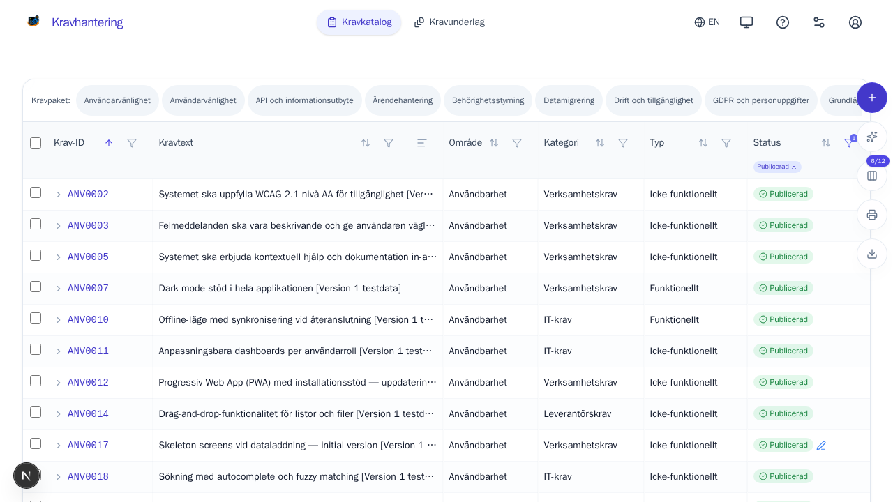

### Kolumnkonfiguration

Klicka på kolumnväljaren (tabellikon) för att visa eller dölja kolumner. Du kan
anpassa vyn efter din arbetsprocess. Inställningarna sparas i webbläsaren.

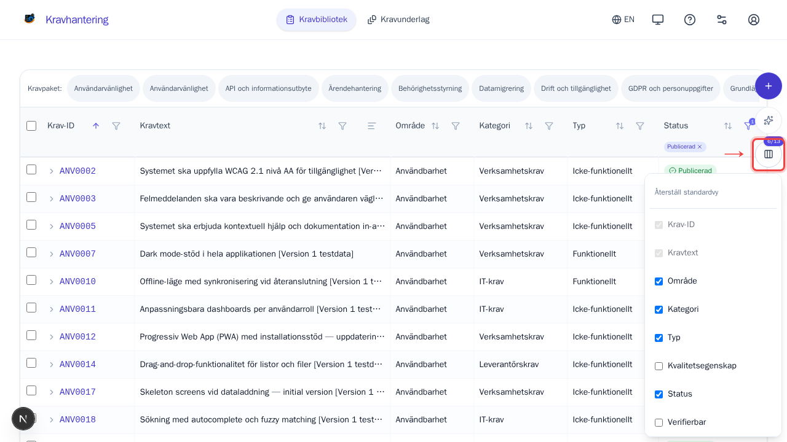

### Filtrering och sortering

Varje kolumn har en sorteringspil (↑↓) och en filterikon (▽) i kolumnrubriken.
Klicka på sorteringspilen för att växla mellan stigande och fallande ordning.
Klicka på filterikonen för att öppna ett textfält där du kan filtrera listan på
det kolumnens värde.

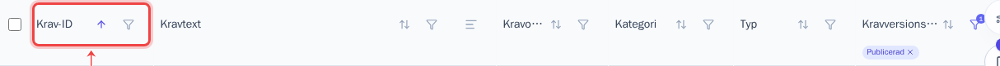

### Filtrering — sökfält ifyllt

Skriv in ett värde i filterfältet för att begränsa listan. Här filtreras på
Krav-ID "IDN0001" vilket visar enbart matchande krav. Tryck Enter eller klicka
utanför för att tillämpa filtret. Tryck Esc för att stänga filterfältet.

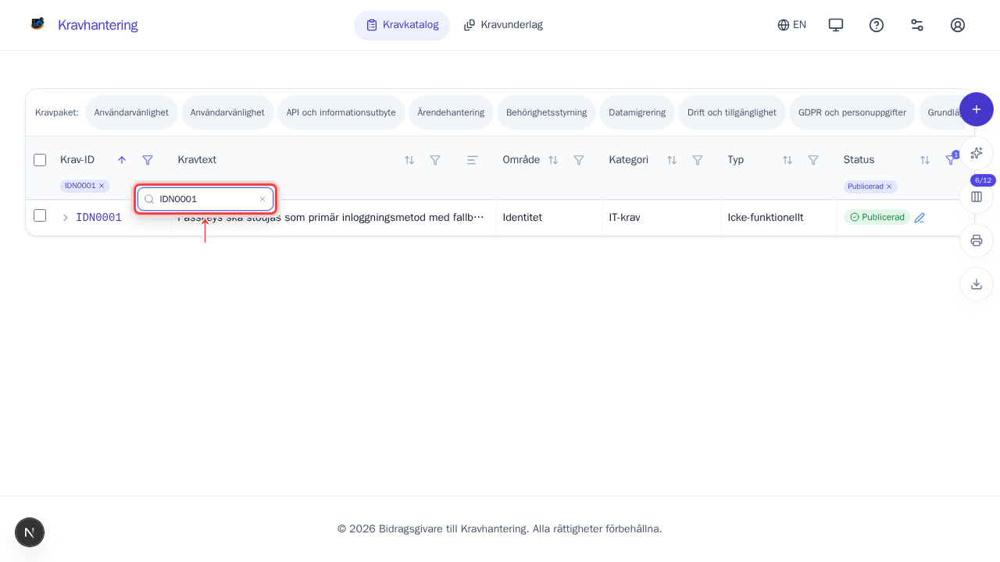

### Inline-detaljvy

Klicka på en rad i kravkatalogen för att öppna inline-detaljvyn direkt i
tabellen. Detta är det primära arbetsflödet — du behöver inte lämna katalogen
för att se eller hantera ett krav.

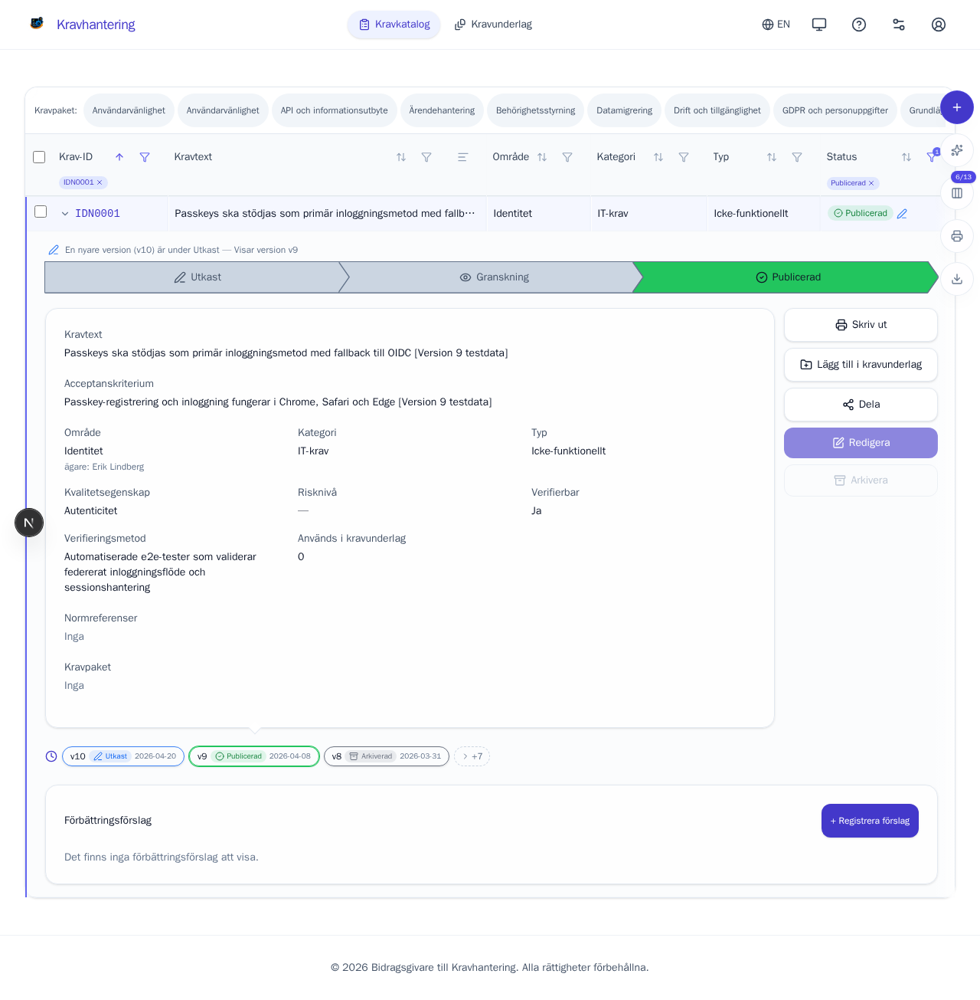

### Detaljpanelen — övre del

Varje krav har en uppsättning egenskaper som beskriver vad det ställer för krav,
hur det klassificeras och var det passar in i organisationens processer. Nedan
följer en översikt av varje egenskap och hur den stödjer kravets livscykel.

<!-- markdownlint-disable MD013 -->
| Egenskap | Beskrivning |
| --- | --- |
| **Krav-ID** | Genereras automatiskt utifrån områdets prefix och ett löpnummer. Det är den stabila identifieraren som används för spårbarhet i kravpaket, rapporter och korsreferenser. Du kan inte redigera det direkt — det tilldelas när kravet skapas. |
| **Område** | Grupperar krav efter domän, till exempel Integration eller Ärendehantering. Området styr ID-prefixet och avgör vilket team som ansvarar för kravet. Det måste anges när kravet skapas och kan inte ändras efteråt. |
| **Kravtext** | Den centrala beskrivningen av vad som ska uppfyllas. Det är huvudinnehållet som intressenter granskar under granskningsfasen och som blir bindande när kravet publiceras. Håll texten tydlig och testbar. |
| **Acceptanskriterier** | Mätbara villkor som måste vara uppfyllda för att kravet ska anses vara uppnått. De är viktiga vid verifiering och testning och hjälper granskare att förstå den exakta avsikten bakom kravtexten. |
| **Kategori** | Klassificerar kravet som Verksamhet, IT eller Leverantör. Det underlättar filtrering i katalogen och gör det enklare att tilldela ansvar till rätt team eller intressentgrupp. |
| **Typ** | Anger om kravet är Funktionellt eller Icke-funktionellt. Båda typerna låser upp fältet för kvalitetsegenskap, men icke-funktionella krav erbjuder ett bredare urval av egenskaper från standarden ISO/IEC 25010 medan funktionella krav har en mindre delmängd. |
| **Kvalitetsegenskap** | Följer standarden ISO/IEC 25010 och låter dig klassificera krav med egenskaper som Säkerhet, Prestandaeffektivitet eller Användbarhet. Icke-funktionella krav har tillgång till hela uppsättningen egenskaper, medan funktionella krav erbjuder en mindre delmängd. Det hjälper till att prioritera och gruppera relaterade krav under granskning och implementeringsplanering. |
| **Risknivå** | Markerar kravet som Låg, Medel eller Hög risk. Högre risknivåer signalerar att kravet behöver mer noggrann granskning, mer rigorös testning och tätare uppföljning under implementeringen. Risknivån spelar även en roll vid begäran om avsteg inom ett kravpaket — ett avsteg för ett krav med hög risk medför större potentiell påverkan och kräver därför en striktare bedömning vid avstegsgranskningen. |
| **Verifierbar** | Anger om kravet kan testas. När du aktiverar detta måste du även ange en verifieringsmetod. Verifieringsmetoden används inom de kravpaket där kravet ingår, till exempel i samband med en upphandling, ett införande eller förvaltning. |
| **Verifieringsmetod** | Beskriver exakt hur kravet ska verifieras — till exempel genom automatiserade tester, manuell inspektion eller användartester. Fältet är obligatoriskt när Verifierbar är aktiverat. Metoden tillämpas inom de kravpaket där kravet används och ger konkret vägledning för hur verifieringen ska genomföras i varje sammanhang. |
| **Användningsscenarier** | Beskriver de sammanhang eller situationer där kravet gäller. Scenarier kan till exempel representera driftsförhållanden som hög belastning eller katastrofåterställning, gruppera funktionella krav som hör ihop eller samla krav kopplade till ett visst lagrum. Varje scenario har en ägare som ansvarar för kraven inom det sammanhanget. Att koppla scenarier hjälper till att avgränsa kravpaket och filtrera krav efter de sammanhang som är relevanta för en viss leverans. |
| **Normreferenser** | Kopplar kravet till externa standarder, lagar eller föreskrifter. Dessa kopplingar stödjer efterlevnadsrevision och gör det möjligt att spåra varje krav tillbaka till sitt rättsliga eller normativa ursprung. |
| **Status** | Visar kravets aktuella livscykelfas — Utkast, Granskning, Publicerad eller Arkiverad. Status hanteras automatiskt genom arbetsflödesåtgärder och styr vilka operationer som är tillgängliga. Se avsnitten Visuell processöversikt och Kravets process nedan för detaljer. |
<!-- markdownlint-enable MD013 -->

### Versionshistorik

Redigering av ett publicerat krav samt återställning av ett arkiverat krav
skapar en ny version. Versionshistoriken visar alla versioner med tidsstämplar,
status och vem som gjorde ändringen. Du kan navigera till äldre versioner för
att se den historiska lydelsen.

När ett krav har fler versioner än vad som ryms i vyn visas en knapp med "+N"
som visar hur många dolda versioner det finns. Klicka på den för att expandera
och se alla versioner.

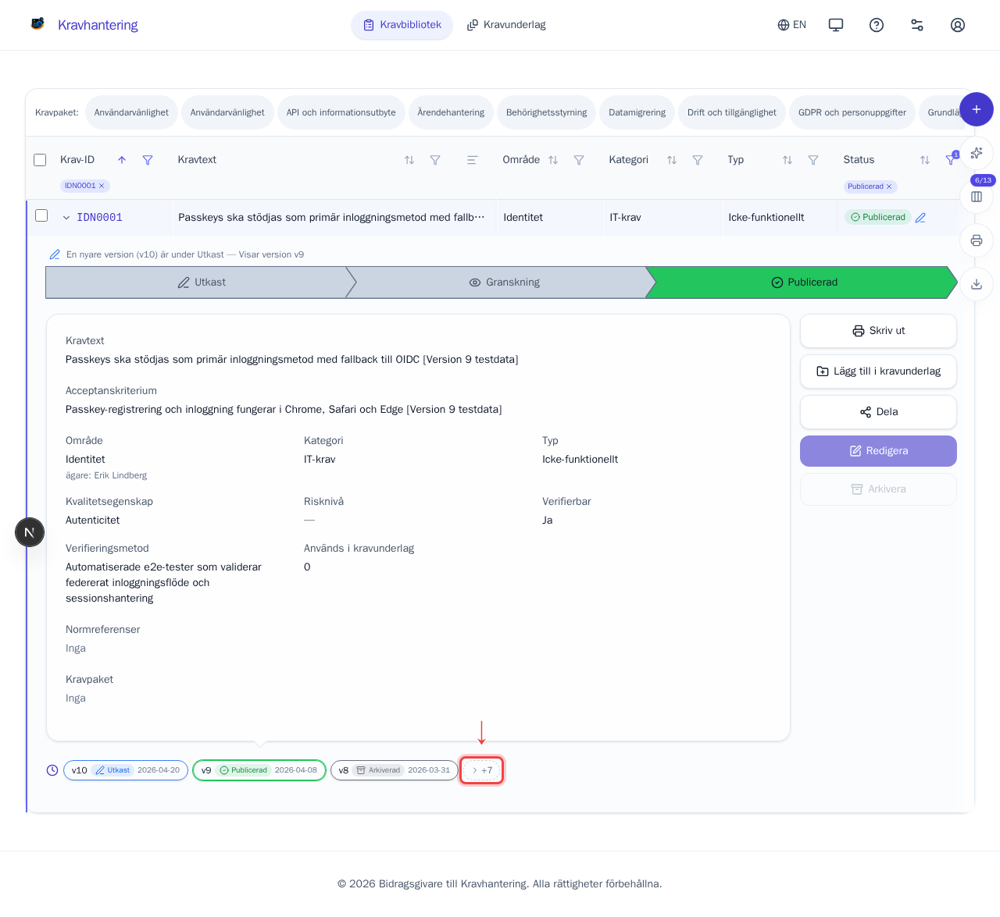

### Versionshistorik — expanderad lista

När versionshistoriken är expanderad visas alla versioner som versionspillar i
rad. Den aktuella versionen är markerad. Klicka på valfri pil för att navigera
till den versionen.

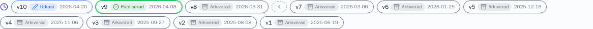

### Versionshistorik — historisk version

Klicka på en versionspil för att visa den versionen av kravet. Den valda
versionen markeras och kravtexten uppdateras för att visa hur kravet såg ut vid
det tillfället. Användbara för revision och spårbarhet.

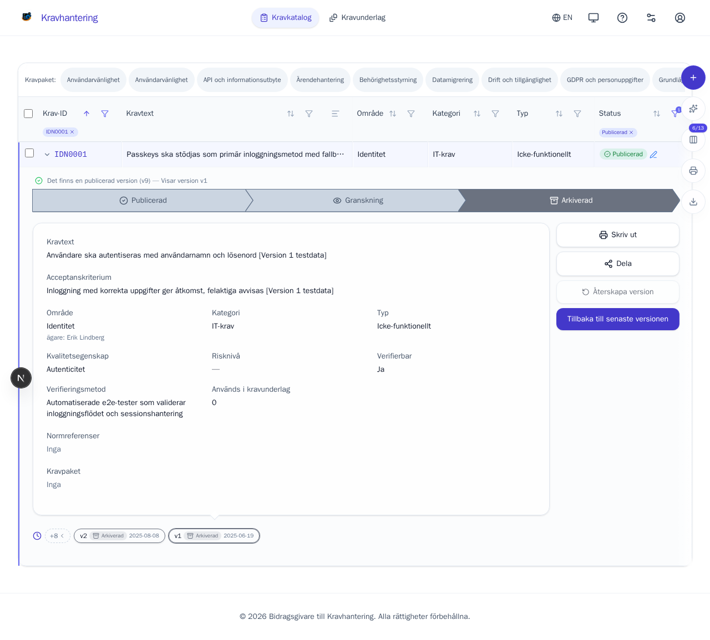

## Skapa ett nytt krav

### Skapa krav — tomt formulär

Navigera till "Skapa nytt krav" via knappen i katalogen. Formuläret innehåller
fält för alla kravegenskaper: kravtext, acceptanskriterier, område, kategori,
typ, risknivå, kvalitetsegenskaper, verifieringsmetod, normreferenser och
användningsscenarier.

### Skapa krav — ifyllt formulär

Fyll i kravtext och acceptanskriterier. Välj sedan område, kategori, typ och
risknivå i respektive rullgardinsmeny. Alla obligatoriska fält markeras med
asterisk (*). Klicka på "Spara" när formuläret är komplett.

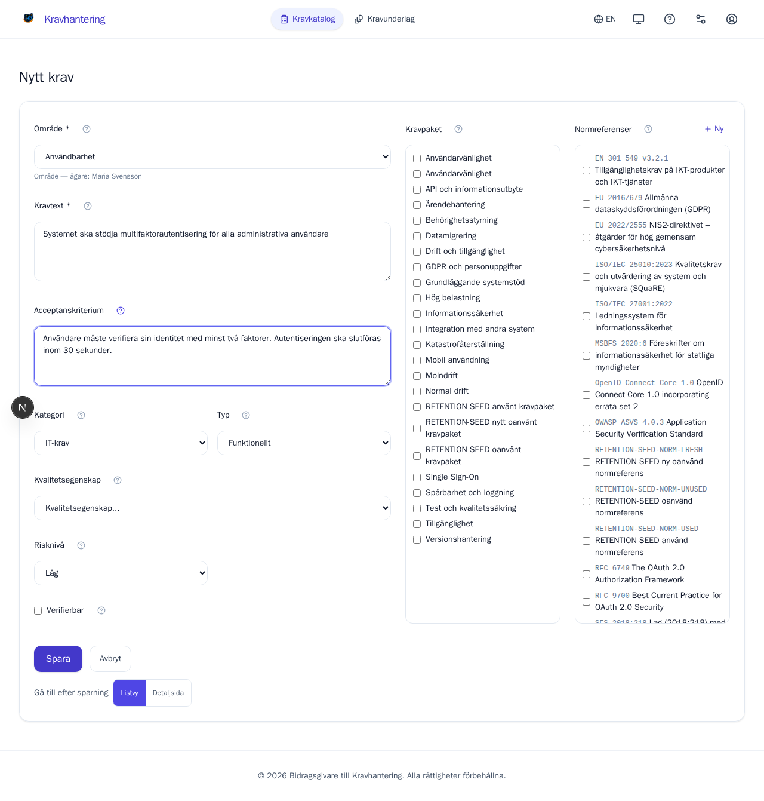

### Krav skapat

Efter att formuläret sparats återgår applikationen till kravkatalogen med det
nyss skapade kravet öppet i inline-detaljvyn. Kravet startar i status
**Utkast**.

## Kravdetaljer och statusövergångar

### Statusstegare

Statusstegaren visar kravets position i livscykeln: **Utkast** → **Granskning**
→ **Publicerad** → **Arkiverad**. Den aktuella statusen är markerad. Knappar för
statusövergångar visas intill stegaren.

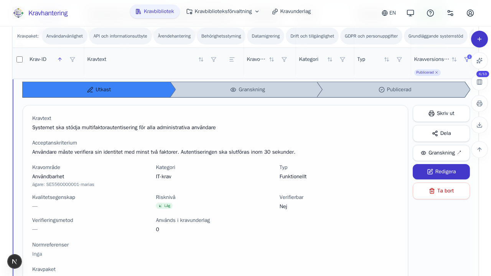

### Status: Utkast

Ett krav i **Utkast**-status har knappen "Granskning ↗" tillgänglig. Klicka på
den för att skicka kravet till granskning. Det innebär att kravet är klart för
kollegial granskning och godkännande.

### Status: Granskning

Kravet är nu i **Granskning**-status. Stegaren uppdateras för att reflektera
detta. Knappen "Publicera ↗" visas för att godkänna och publicera kravet, och "←
Utkast" för att återföra det till utkastläge om ändringar behövs.

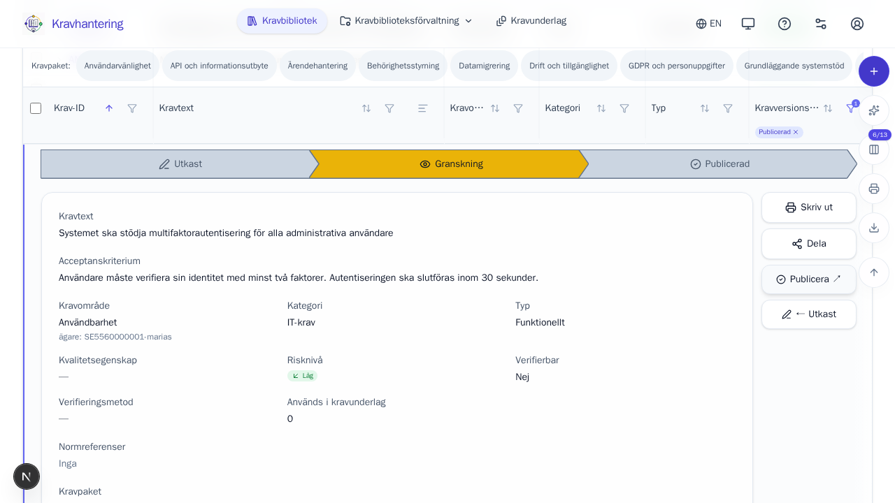

### Publicera — bekräftelsedialog

Innan kravet publiceras visas en bekräftelsedialog. Klicka på "Bekräfta" för att
slutföra publiceringen, eller "Avbryt" för att avbryta.

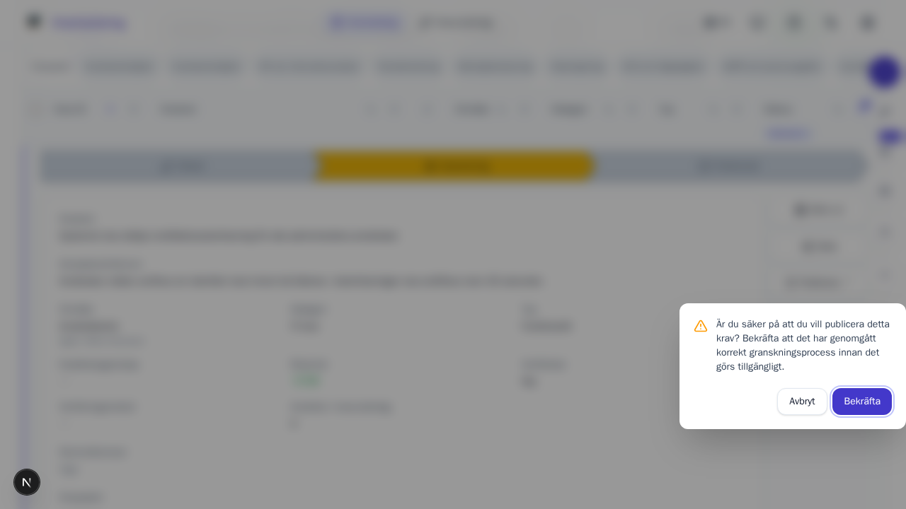

### Status: Publicerad

Kravet är nu **Publicerat** och utgör den aktiva, godkända versionen. Vid
redigering av ett Publicerat krav skapas en ny Utkast-version medan den
publicerade versionen förblir aktiv tills det nya utkastet genomgått
granskningsprocessen.

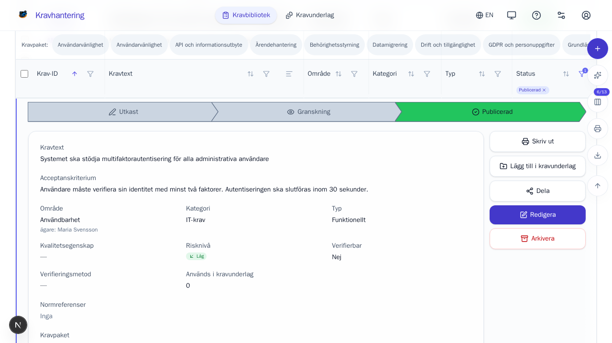

## Kravpaket

Ett **kravpaket** samlar en uppsättning krav som hör ihop inom ramen för ett
specifikt projekt, en leverans eller ett verksamhetsområde. Paketet fungerar som
en spårbar enhet — du kan följa implementationsstatus per krav, begära avsteg
och generera granskningsrapporter direkt från paketet.

### Kravpaketslista

Listan visar paketens namn, ID, livscykelstatus och genomförandeform. Klicka på
ett paket för att se dess detaljer.

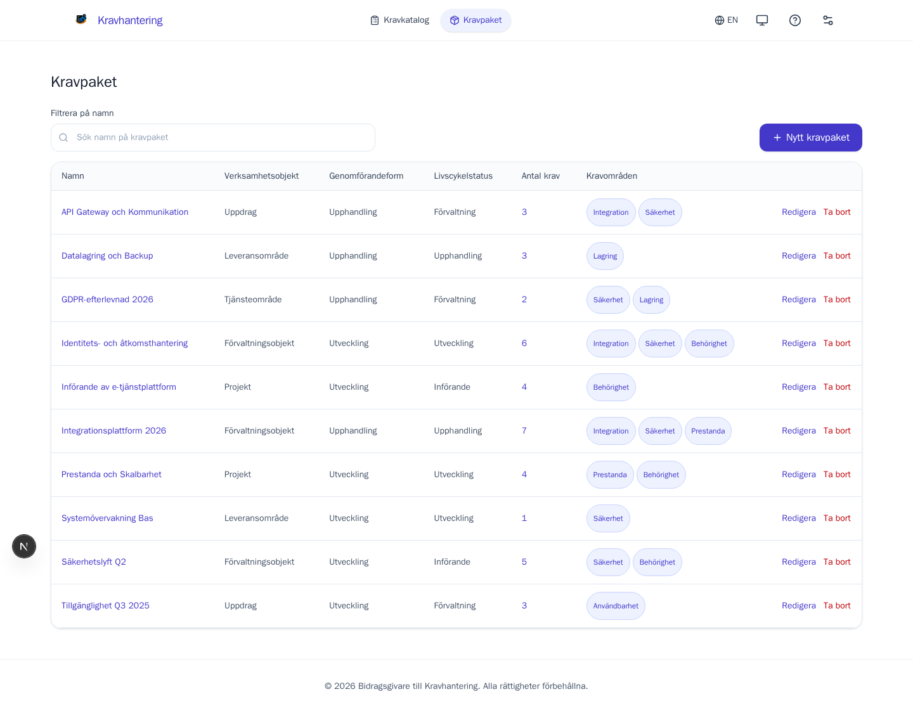

### Sökning bland kravpaket

Filtrera paket genom att skriva i sökrutan. Listan uppdateras i realtid.

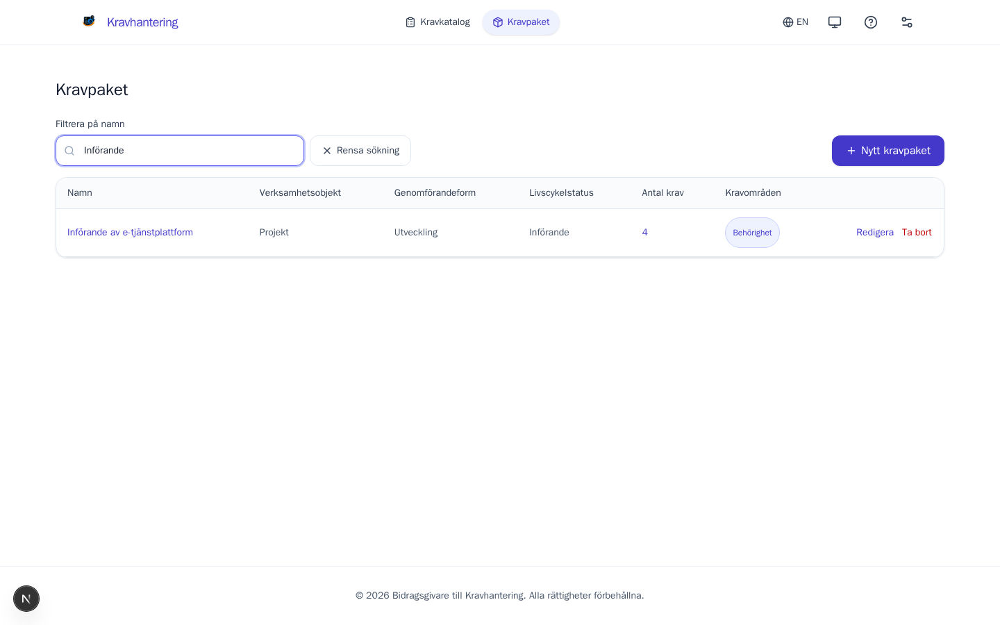

### Skapa nytt kravpaket

Klicka på **"Nytt kravpaket"** för att skapa ett nytt paket. Ange ett namn — ett
unikt ID (slug) genereras automatiskt. Kravpaket används för att samla krav som
hör till ett specifikt projekt eller leverans.

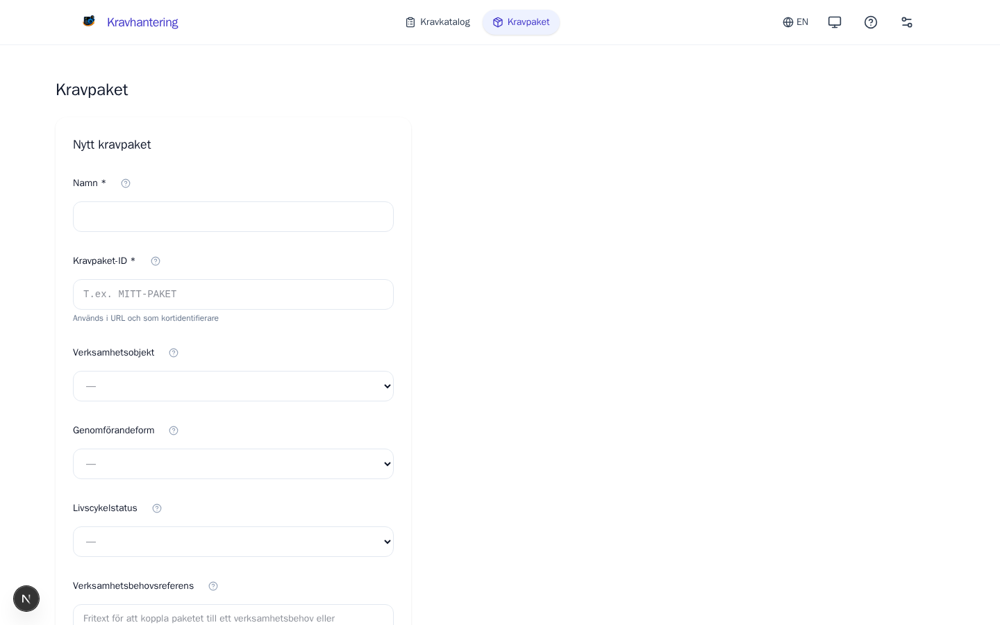

### Kravpaketdetalj — delad vy

Kravpaketdetaljsidan har en delad layout: **vänster panel** listar krav som
ingår i paketet med deras implementationsstatus, och **höger panel** visar
tillgängliga krav att lägga till. Klicka på en rad för att se kravets
fullständiga detaljer.

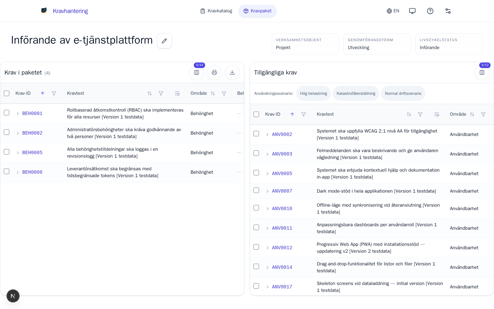

### Välj krav att lägga till

Markera ett eller flera krav i den högra panelen "Tillgängliga krav". Knappen
**"Lägg till valda (N)"** visas i panelens rubrik när minst ett krav är
markerat.

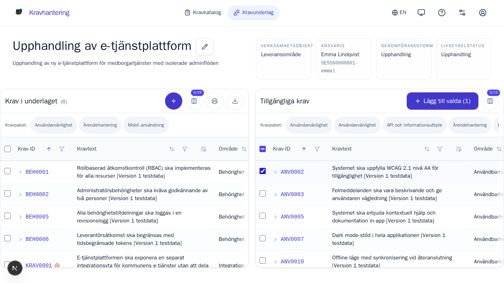

### Lägg till krav — behovsreferens

När du lägger till krav i ett paket kan du koppla en **behovsreferens** till
dem. En behovsreferens är en fritext som beskriver det verksamhetsbehov eller
funktionella krav som kravet ska uppfylla i det här paketet — t.ex. ett
ärendenummer, ett mål eller ett avsnitt i en kravspecifikation. Du kan välja en
befintlig referens eller skriva en ny. Fältet är valfritt.

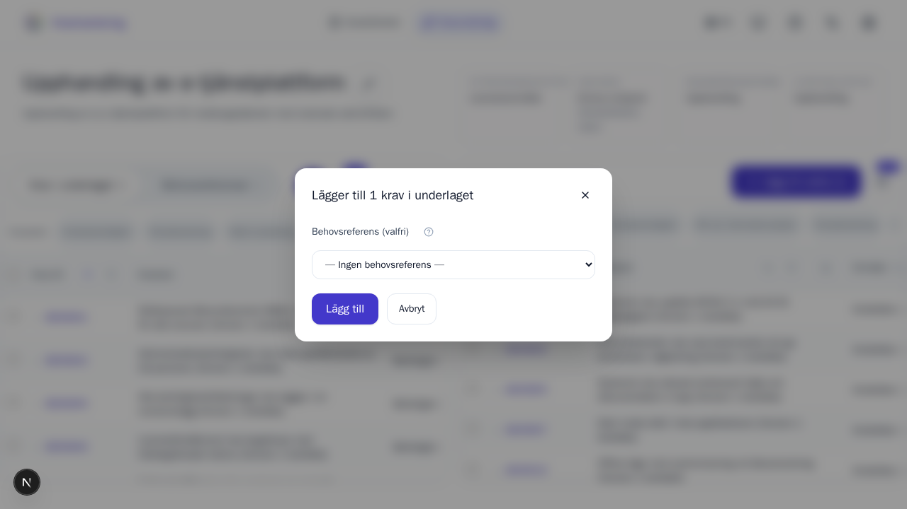

### Redigera kravpaket

Redigeringspanelen låter dig uppdatera paketets namn, verksamhetsreferens,
livscykelstatus, genomförandeform och verksamhetsobjekt. Klicka på "Spara" för
att tillämpa ändringarna.

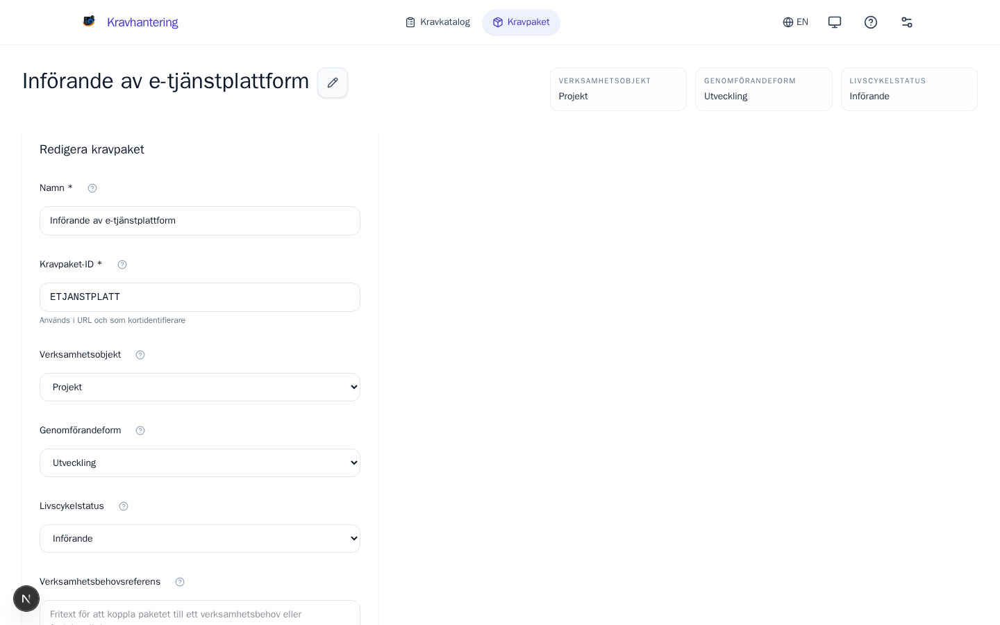

## Avsteg

Ett **avsteg** dokumenterar att ett krav i ett kravpaket inte kan uppfyllas
fullt ut som specificerat, och varför. Avstegsprocessen är trestegsbaserad:
**Utkast** → **Granskning begärd** → **Beslutad** (godkänd eller avslagen).
Nedan visas varje steg i processen.

### Kravpaket — avstegskontext

**Steg 1 — Navigera till kravpaketet.** Avsteg hanteras i kontexten av ett
kravpaket. Klicka på ett paket för att öppna detaljvyn med listan "Krav i
paketet".

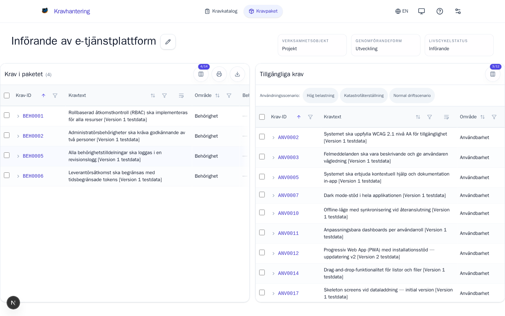

### Krav expanderat i paketkontext

**Steg 2 — Expandera ett krav.** Klicka på en rad i listan för att öppna kravets
detaljpanel. Om inget aktivt avsteg finns visas knappen **"Begär ett avsteg"** —
klicka på den för att starta avstegsprocessen.

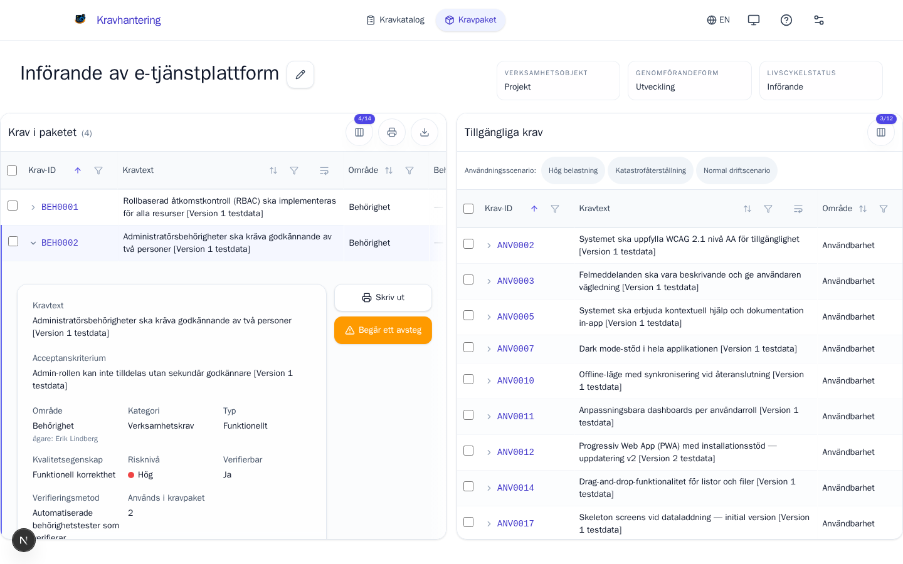

### Formulär för avstegsansökan

**Steg 3 — Fyll i avstegsformuläret.** Ange en motivering som förklarar varför
kravet inte kan uppfyllas som specificerat och vilka kompenserande åtgärder som
vidtas. Fältet "Registrerat av" är valfritt.

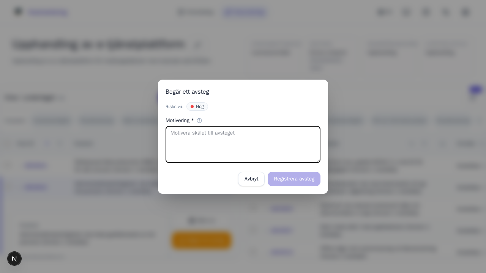

### Avstegsformulär ifyllt

Klicka på **"Registrera avsteg"** för att spara. Motiveringstexten ingår sedan i
avstegsgranskningsrapporten.

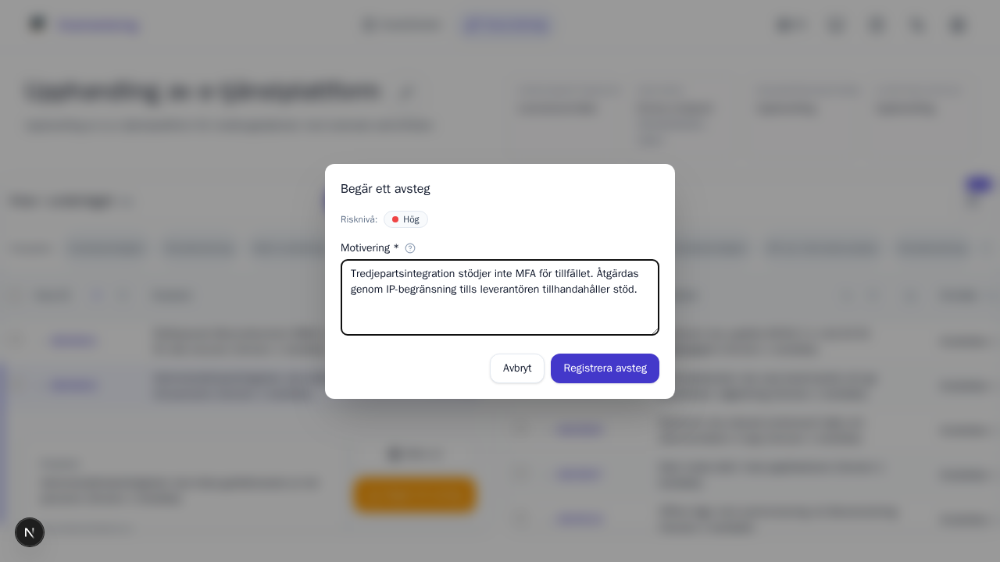

### Avsteg registrerat — Utkast

**Steg 4 — Utkastläge.** Avsteget visas nu i detaljpanelen med sin motivering. I
utkastläget kan det fortfarande redigeras eller tas bort. När det är klart,
klicka **"Granskning ↗"** för att skicka det till granskning.

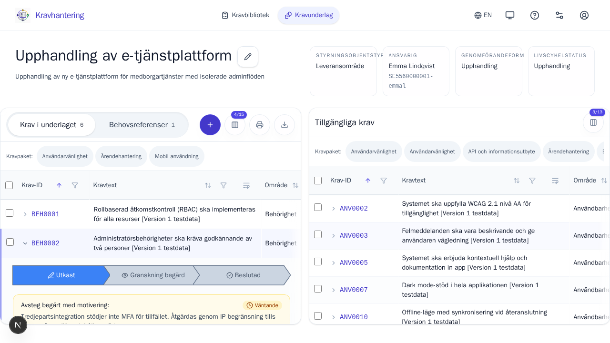

### Avsteg — granskning begärd

**Steg 5 — Granskning begärd.** Avsteget är nu låst för redigering och inväntar
beslut. En behörig granskare klickar **"Beslutad ↗"** för att registrera ett
beslut, eller **"← Utkast"** för att återföra det om komplettering behövs.

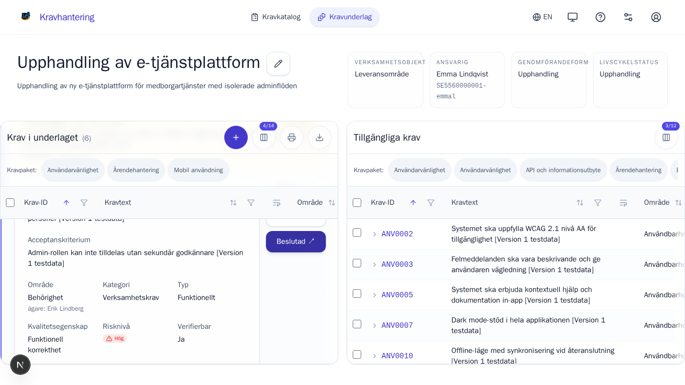

### Registrera beslut

**Steg 6 — Registrera beslut.** Granskaren anger en **beslutsmotivering**, vem
som fattat beslutet och datum. Välj sedan **"Godkänn"** eller **"Avslå"** för
att slutföra beslutet.

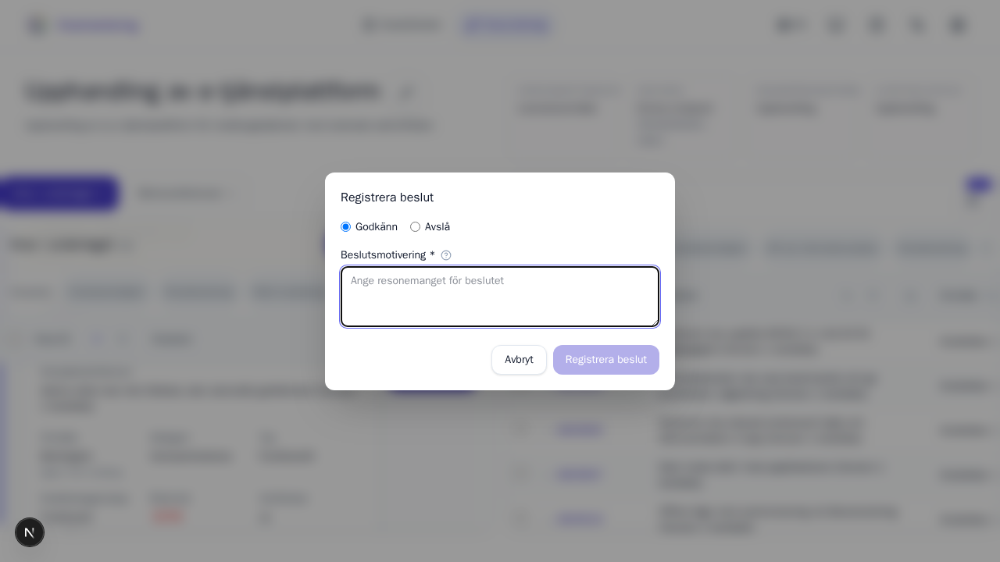

## Förbättringsförslag

### Förbättringsförslag — tom sektion

Längst ned i inline-detaljvyn finns sektionen **Förbättringsförslag**. En
ansvarig för ett kravpaket (upphandling, projekt, förvaltning) kan lämna ett
förslag på förbättring av kravet. Klicka på **"+ Registrera förslag"** för att
öppna formuläret.

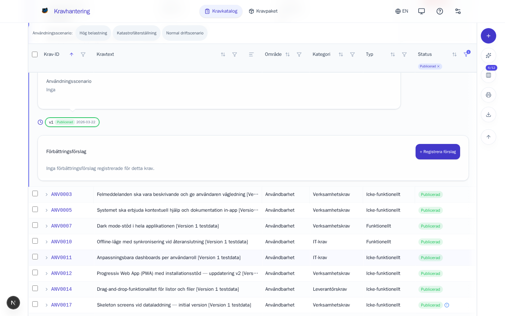

### Formulär för förbättringsförslag

Formuläret öppnas som en modal dialog. Ange förbättringsidén i textfältet och
valfritt ditt namn i "Registrerat av". Klicka på **"Spara"** för att registrera
förslaget.

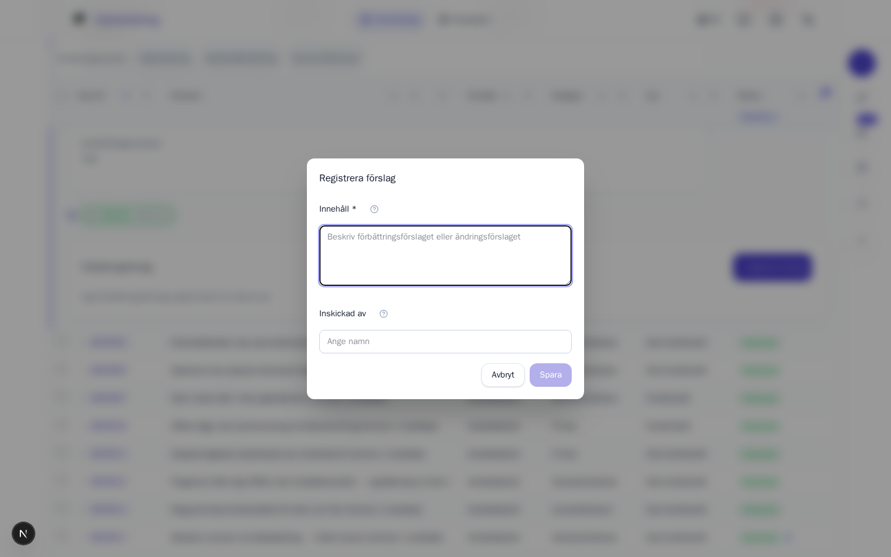

### Förbättringsförslag ifyllt

Förslagstexten beskriver en konkret förbättringsidé. Knappen **"Spara"**
aktiveras när innehållsfältet har text.

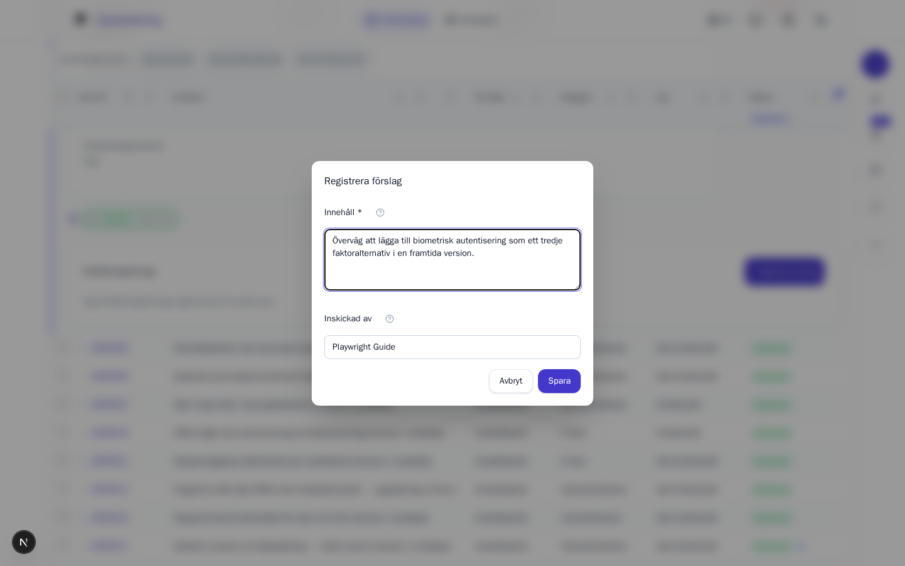

### Förbättringsförslag registrerat

Det registrerade förslaget visas i sektionen med sin arbetsflödesstatus:
**Utkast → Granskning begärd → Granskad**. Förslaget kan redigeras och skickas
för granskning via knappen **"Granskning ↗"**.

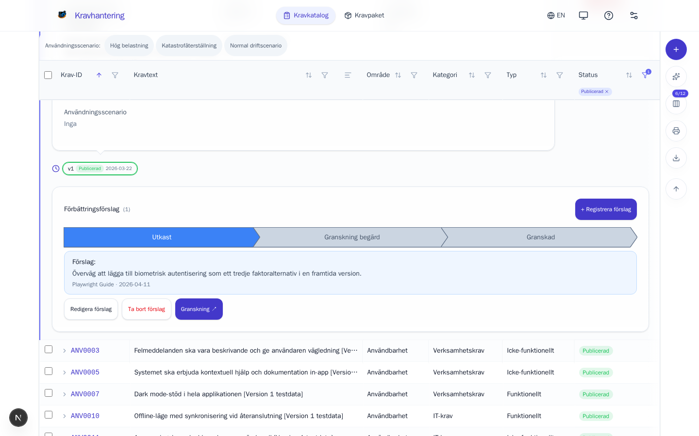

### Flera förbättringsförslag

Ett krav kan ha flera förbättringsförslag från olika intressenter. Varje förslag
hanteras individuellt genom sitt eget arbetsflöde. Listan ger en samlad bild av
alla inkomna synpunkter på kravet.

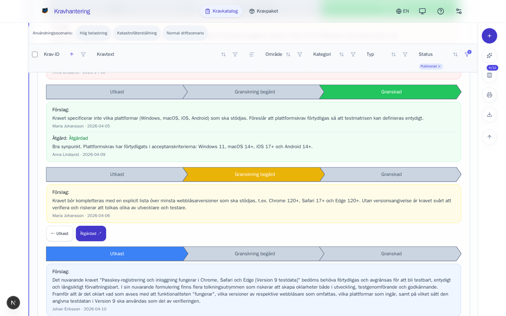

## Administrationscenter

### Admin — Benämningar

Administrationscenterets flik **Benämningar** låter dig anpassa
gränssnittsetiketter för domänspecifika termer. Till exempel kan "Kravtext" byta
namn till en term som passar din organisations vokabulär.

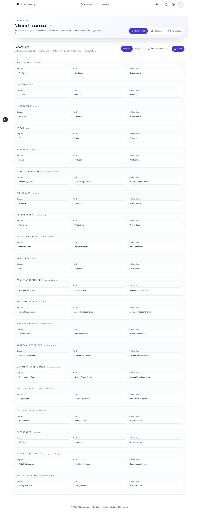

### Admin — Kolumnhantering

Fliken **Kolumner** konfigurerar vilka kolumner som visas som standard i
kravkatalogen och deras ordning. Ändringar gäller för alla användare. Du kan
också ange standardvyer för olika kontexter.

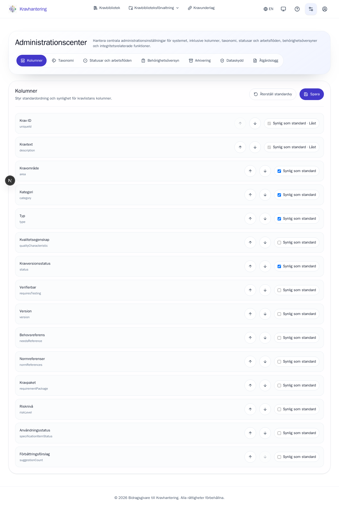

### Admin — Referensdata

Fliken **Referensdata** innehåller länkar till alla taxonomihanteringssidor:
områden, typer, statusar, risknivåer, kvalitetsegenskaper, normreferenser och
användningsscenarier. Här bygger du upp de grunddata som krav refererar till.

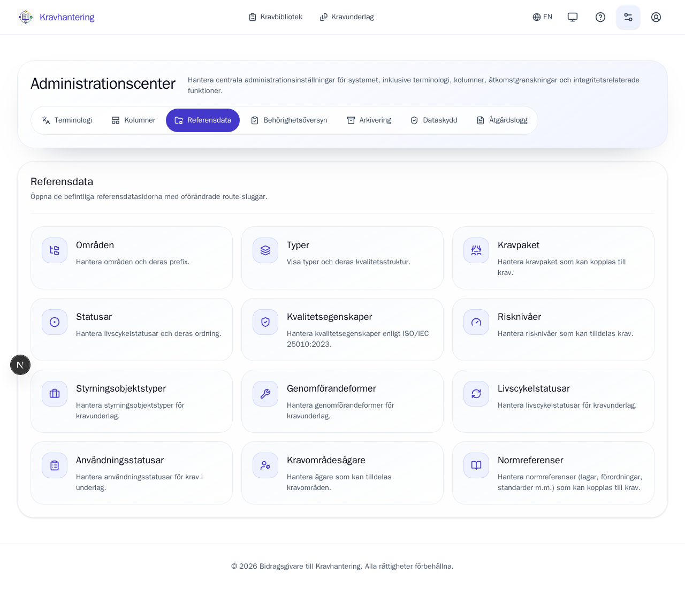

## Referensdatahantering

### Kravområden

Kravområden organiserar krav efter organisatorisk domän. Varje område har en
ägare, ett prefix som används i krav-ID (t.ex. "SÄK" ger ID:n som "SÄK0001") och
en beskrivning.

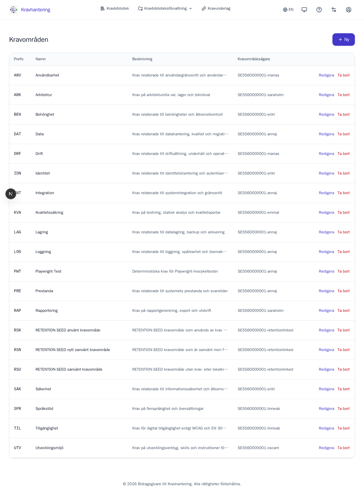

### Kravstatusar

Kravstatusar definierar livscykelstegen. De fyra systemstatusarna (Utkast,
Granskning, Publicerad, Arkiverad) kan inte tas bort eller byta namn — de utgör
ryggraden i arbetsflödet. Övriga statusar kan anpassas.

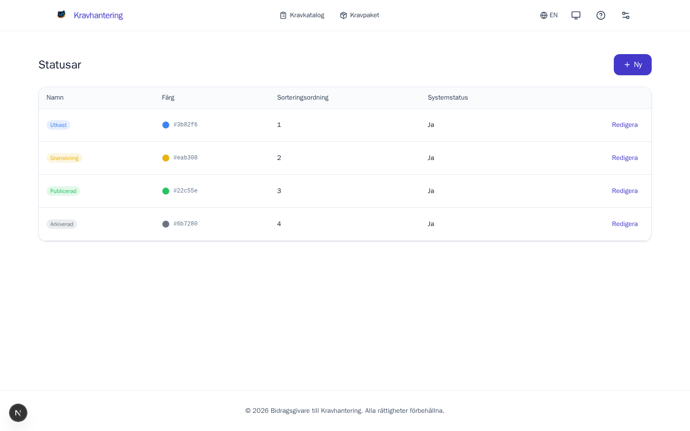

### Risknivåer

Risknivåer klassificerar kravets kritikalitet. Varje nivå kan tilldelas en färg
för visuell identifiering i katalogen och detaljvyer. Färgkodningen gör det
enkelt att snabbt bedöma ett kravs vikt.

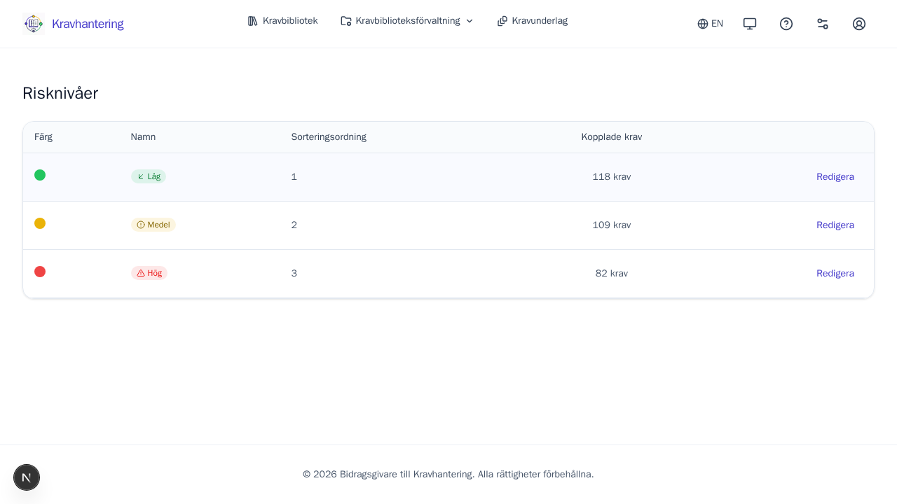

### Kravtyper

Kravtyper kategoriserar kravets karaktär (t.ex. funktionellt, icke-funktionellt,
säkerhetskrav). Typer används för filtrering, rapportering och för att
säkerställa rätt kvalitetsegenskaper kopplas till kravet.

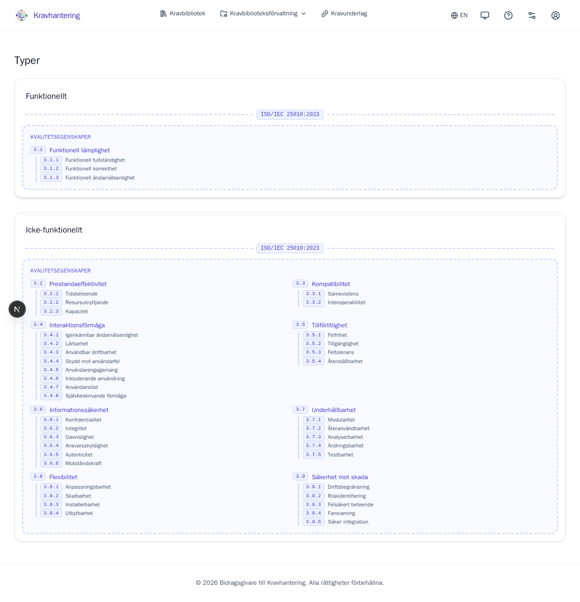

### Kvalitetsegenskaper

Kvalitetsegenskaper är ett hierarkiskt taxonomi som beskriver icke-funktionella
krav (t.ex. tillgänglighet, prestanda, säkerhet). Egenskaperna kopplas till krav
för att säkerställa täckning av kvalitetskraven.

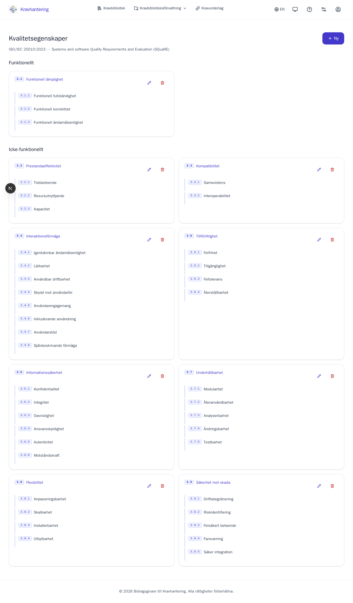

### Normreferenser

Normreferenser är ett bibliotek med externa standarder och regelverk (t.ex.
ISO-standarder, GDPR). Krav kan referera till en eller flera normreferenser för
att tydliggöra vilka regelverk de härstammar från.

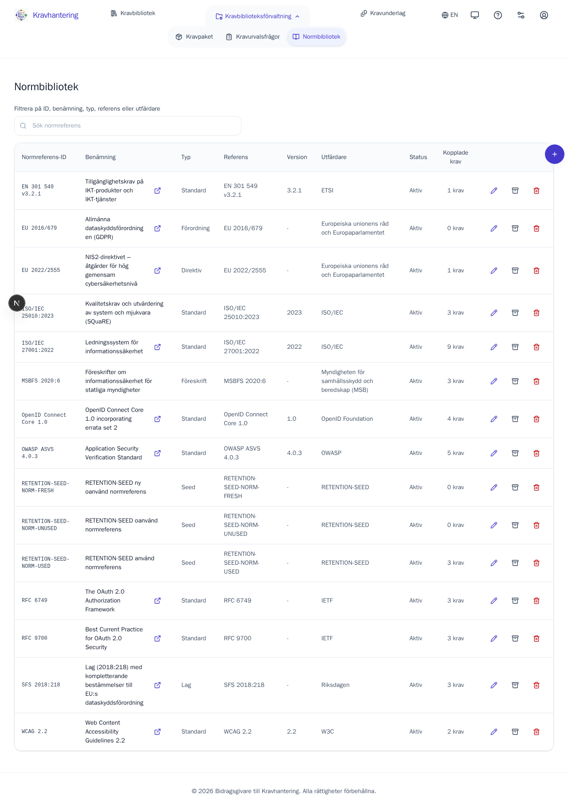

### Ägare

Ägare är de personer eller roller som ansvarar för kravområden. Varje kravområde
tilldelas en ägare som är ansvarig för kravens kvalitet och aktualitet.

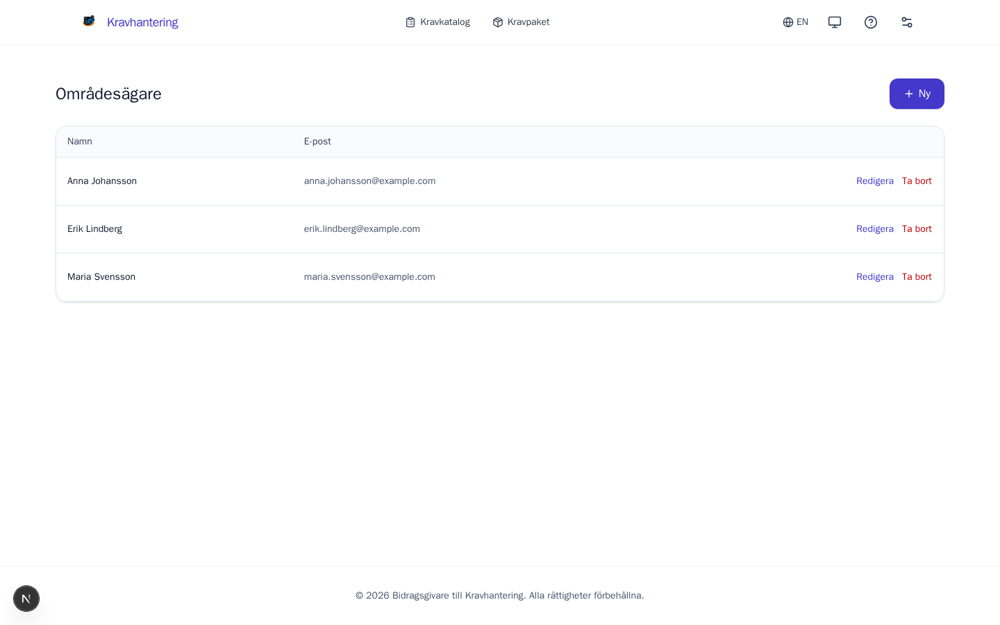

## Rapporter

Systemet erbjuder flera rapporttyper för granskning, spårbarhet och
beslutsunderlag. Rapporter kan genereras som **utskriftsvänliga HTML-sidor**
eller laddas ned som **PDF**. Nedan listas de tillgängliga rapporterna.

### Historikrapport

Visar tidslinjen för alla ändringar av ett enskilt krav. Rapporten listar varje
version i omvänd kronologisk ordning med status, författare, tidsstämplar och
utdrag ur kravtexten. Den publicerade versionen (om den finns) visas överst,
följd av opublicerade versioner markerade som utkast eller granskning.

**Åtkomst:** Rapportmenyn i kravdetaljvyn (alla statusar).

**Rutt:** `/requirements/reports/print/history/[id]` (utskrift) ·
`/requirements/reports/pdf/history/[id]` (PDF)

### Granskningsrapport

Jämför en version i **Granskning** med den senast publicerade eller arkiverade
versionen. Rapporten visar ord-för-ord-skillnader i kravtext och
acceptanskriterier samt förändringar i metadata (kategori, typ,
kvalitetsegenskaper, risknivå, normreferenser, scenarier m.m.). Om ingen
publicerad/arkiverad version finns noteras detta.

**Åtkomst:** Rapportmenyn i kravdetaljvyn (visas enbart när kravet är i status
*Granskning*).

**Rutt:** `/requirements/reports/print/review/[id]` (utskrift) ·
`/requirements/reports/pdf/review/[id]` (PDF)

### Kombinerad granskningsrapport

En samlad rapport för flera krav som har status *Granskning*. Rapporten
genereras genom att markera flera krav i katalogen. Den innehåller en
innehållsförteckning med sidnummer, grupperad efter rapporttyp
(arkiveringsförfrågningar först, sedan granskningsändringar). Varje krav börjar
på en ny sida.

**Åtkomst:** Flytande verktygsfält i kravkatalogen när minst ett markerat krav
har status *Granskning*.

**Rutt:** `/requirements/reports/print/review-combined?ids=...` (utskrift) ·
`/requirements/reports/pdf/review-combined?ids=...` (PDF)

### Granskningsrapport för avsteg

Granskar ett specifikt avsteg kopplat till ett krav i ett kravpaket. Rapporten
visar den kravversion som är kopplad till paketet, avstegets motivering och
kompletterande paketkontext.

**Åtkomst:** Rapportmenyn i kravdetaljvyn i paketkontexten (visas när avsteget
är i status *Granskning begärd* eller *Beslutad*).

**Rutt:**
`/requirements/reports/print/deviation-review/[id]?pkg={slug}&item={itemId}`
(utskrift) · `.../pdf/...` (PDF)

### Kravlista

Skriver ut de krav som för närvarande visas i kravkatalogen som en formaterad
tabell med Krav-ID, kravtext (trunkerad), område och status. Rubriken visar
antal krav och tidsstämpel.

**Åtkomst:** Utskriftsknappen i kravkatalogens verktygsfält (alltid
tillgänglig).

**Rutt:** `/requirements/reports/print/list?ids=...` (utskrift) ·
`/requirements/reports/pdf/list?ids=...` (PDF)

### Kravlista — Kravpaket

Skriver ut kraven som ingår i ett specifikt kravpaket som en formaterad tabell.
Rapporten inkluderar paketets metadata (namn, ID, verksamhetsområde,
genomförandeform, behovsreferens) som rubrik.

**Åtkomst:** Utskriftsknappen i kravpaketdetaljvyns verktygsfält.

**Rutt:** `/requirement-packages/[slug]/reports/print/list?ids=...` (utskrift) ·
PDF genereras direkt i vyn.

### Ändringsförslagshistorik

Listar alla förbättringsförslag grupperade per kravversion i fallande
versionsordning. Varje förslag visar status, innehåll, författare, datum och
eventuella beslutsmotiveringar. Statusfärger: *Utkast* (blå), *Granskning
begärd* (gul), *Beslutad* (grön), *Avvisad* (röd).

**Åtkomst:** Rapportmenyn i kravdetaljvyn eller paketkravdetaljvyn.

**Rutt:** `/requirements/reports/print/suggestion-history/[id]` (utskrift) ·
`/requirements/reports/pdf/suggestion-history/[id]` (PDF)

### Rapportgenerering från katalogen

Markera ett eller flera krav i katalogen för att aktivera rapportknappar i
verktygsfältet. Du kan generera PDF-rapporter för granskningsunderlag,
avstegsöversikter, ändringshistorik och mer.

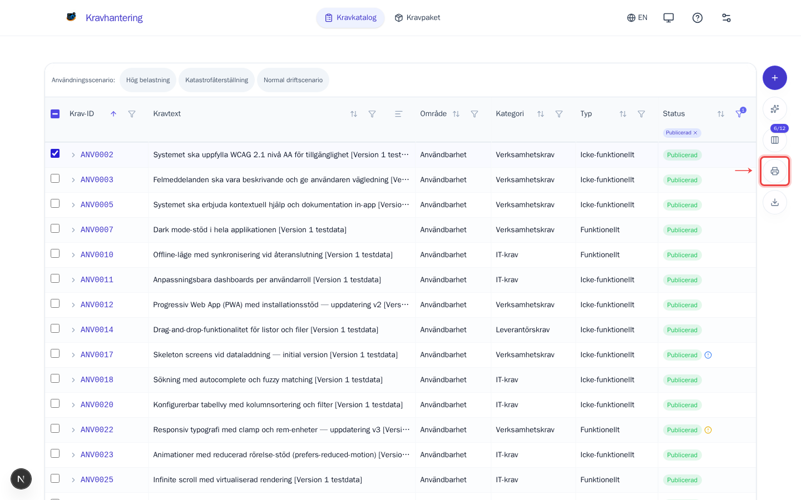

### Rapporter från kravdetaljsidan

Från kravdetaljsidan kan du öppna rapportmenyn för att ladda ned eller skriva
ut: **Ändringshistorik** (alla versioner), **Förbättringsförslagshistorik** och
granskningsunderlag. Rapporterna är formaterade för utskrift och PDF-export.

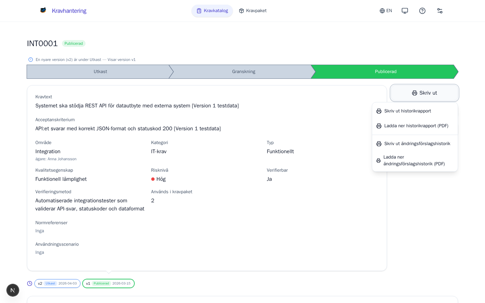
