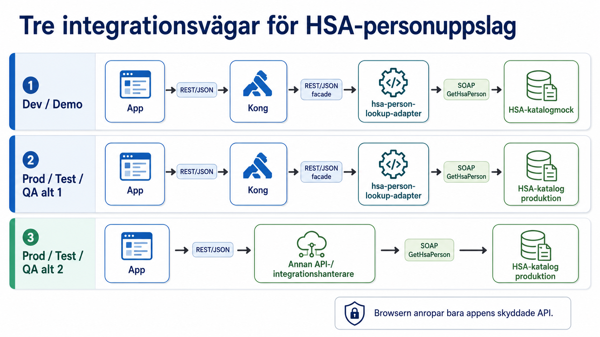
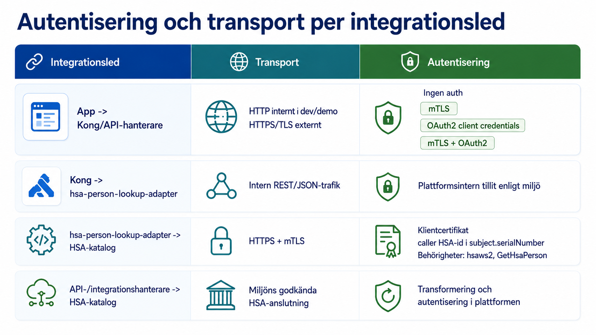
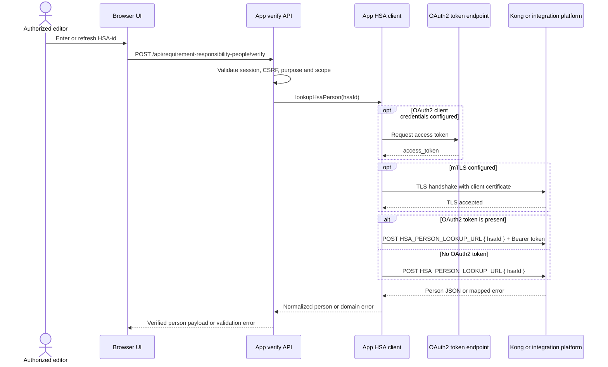
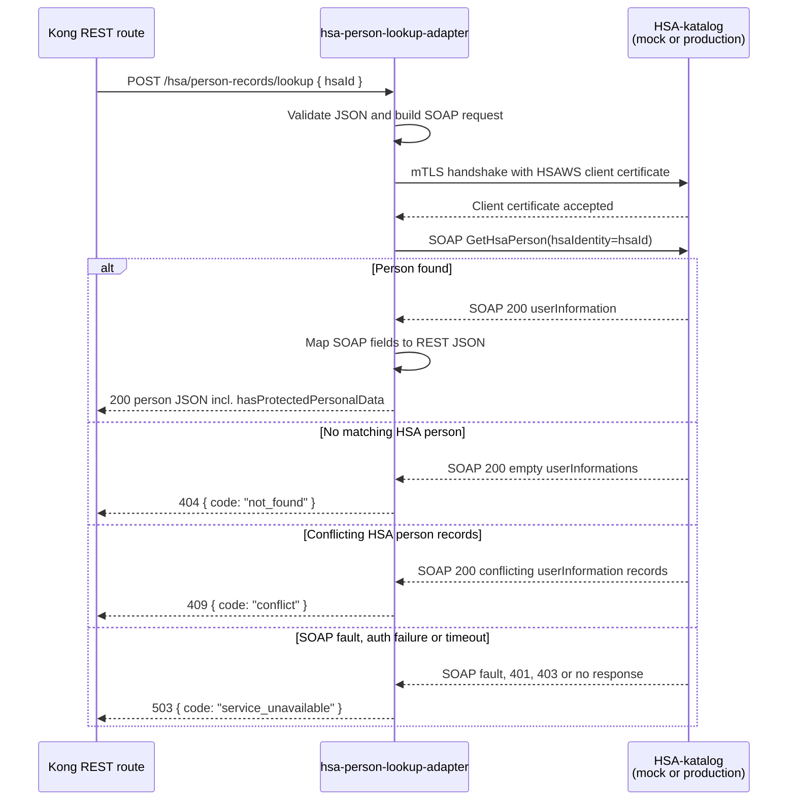
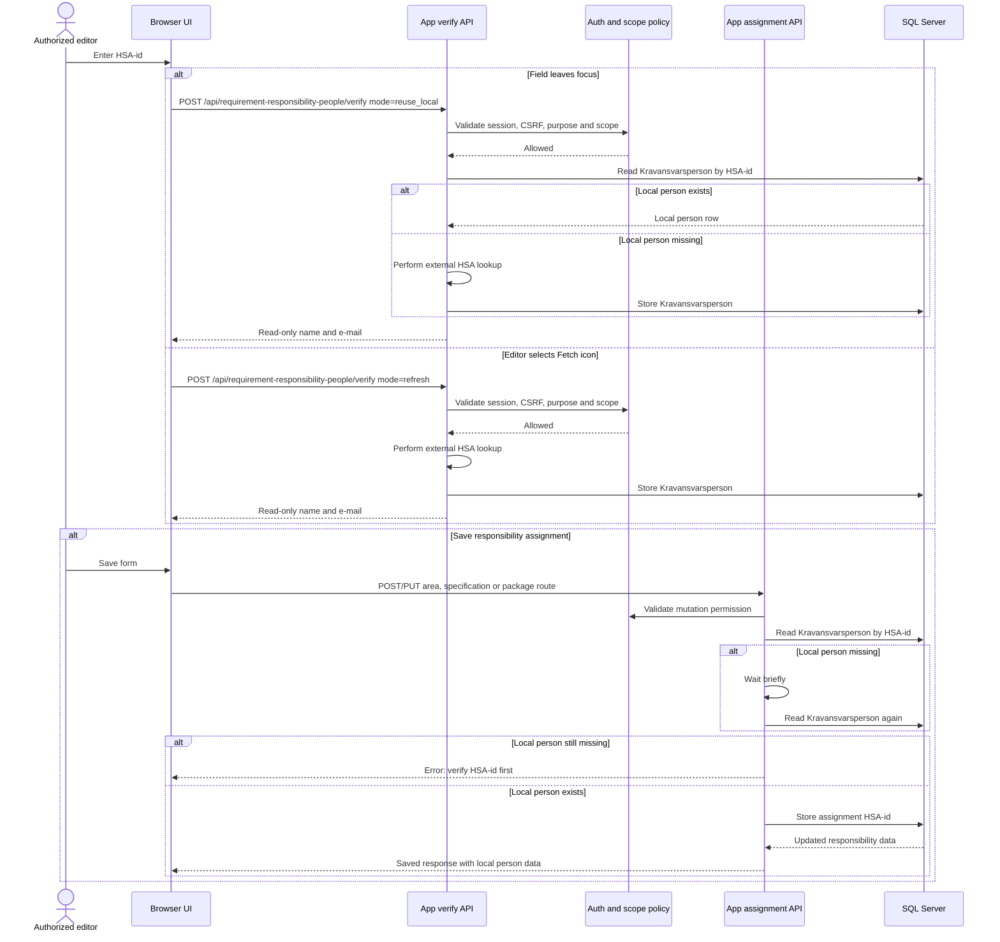

# HSA person lookup integration

This document covers the server-side integration used to fetch person
information for responsibility assignments. Browser sign-in, MCP Bearer-token
authentication, and local Keycloak developer setup are documented separately in
[auth-developer-workflow.md](./auth-developer-workflow.md). Authentication in
this document means the HSA lookup transport authentication between the app,
Kong or an integration platform, the adapter, and the HSA directory.

## Scope

Kravhantering uses HSA person lookup only for live responsibility-assignment
editing surfaces such as requirement-area owners and co-authors, requirement
specification responsible persons and co-authors, and requirement-package
co-authors. The browser never calls Kong or the HSA directory directly. It
only talks to the app's protected same-origin routes.

Read views do not call HSA. Save routes also do not call HSA. Person lookup
happens before save through the app-owned verify route, and the result is
stored as a local `Kravansvarsperson` row keyed by HSA-id.

## Devcontainer and Release Test Support

The devcontainer includes Kong Gateway as the internal `kong` service for
API-management verification, an `hsa-person-lookup-adapter`, and an HSA
directory mock as `hsa-directory-mock`. Kong runs DB-less with
source-controlled configuration from
[containers/kong/kong.yml](../containers/kong/kong.yml). Its proxy and Admin
API are available only on the compose network at `kong:8000` and `kong:8001`;
no Kong ports are forwarded to the host.

The HSA directory mock is also internal-only. It exposes SOAP
`GetHsaPerson` over HTTPS with mTLS on `hsa-directory-mock:8443`. The adapter
exposes the app-facing REST contract on `hsa-person-lookup-adapter:8080` and
uses generated local test certificates to call the mock SOAP endpoint. Kong
exposes only `/hsa/person-records/lookup` and routes it to the adapter.

Use `npm run devcontainer:kong:status` from the workspace to verify that the
devcontainer `app` service can reach the internal Admin API. Use
`npm run devcontainer:hsa-mock:status` to check the mock and adapter directly,
or `npm run devcontainer:hsa-mock:verify` to post the REST person lookup
through Kong at `http://kong:8000/hsa/person-records/lookup`.

The release bundle also includes a test-only `single-node-demo` overlay that
starts Kong, the adapter, and the HSA directory mock on the internal
single-node network. That overlay supports release-smoke and disposable demo
environments. It is not the required production HSA integration path.

## Runtime configuration

The app calls the configured person lookup endpoint through
`HSA_PERSON_LOOKUP_URL`. In devcontainer and `single-node-demo` this points at
Kong on the internal Compose network. Production environments should point at
the approved environment-specific Kong route or integration-platform REST
facade. The browser must never receive this endpoint or call it directly.

`HSA_PERSON_LOOKUP_TIMEOUT_MS` controls the app-side timeout. Keep the default
unless the approved integration path for an environment requires a different
timeout.

The devcontainer and `single-node-demo` route is internal to the Compose
network and does not configure app-to-Kong mTLS or OAuth2. If
`HSA_PERSON_LOOKUP_URL` points to an external Kong route or
integrationsplattform, the app can add app-to-platform authentication without
changing the URL knob. Set `HSA_PERSON_LOOKUP_CLIENT_CERT_PATH` and
`HSA_PERSON_LOOKUP_CLIENT_KEY_PATH` for mTLS, optionally with
`HSA_PERSON_LOOKUP_CA_PATH` and `HSA_PERSON_LOOKUP_TLS_SERVER_NAME`. Set
`HSA_PERSON_LOOKUP_OAUTH_CLIENT_ID`,
`HSA_PERSON_LOOKUP_OAUTH_CLIENT_SECRET`, and either
`HSA_PERSON_LOOKUP_OAUTH_TOKEN_URL` or
`HSA_PERSON_LOOKUP_OAUTH_ISSUER_URL` for OAuth2 client credentials. Optional
`HSA_PERSON_LOOKUP_OAUTH_SCOPE` and `HSA_PERSON_LOOKUP_OAUTH_AUDIENCE` are
sent to the token endpoint when configured. Supplying both mTLS and OAuth2
enables mixed mode.

## Verify route

The responsibility-assignment person lookup flow stays server-side. The browser
calls `POST /api/requirement-responsibility-people/verify`, and the app checks
session, CSRF, purpose, and scope before any local read or HSA lookup.

The route has two explicit modes:

- `reuse_local` is used when the editor leaves an HSA-id field. If a local
  `Kravansvarsperson` row already exists, the app reuses it without calling
  HSA. If the row is missing, the app calls `HSA_PERSON_LOOKUP_URL`, normalizes
  the response, and updates or inserts the local person row.
- `refresh` is used by the manual fetch icon. It always calls
  `HSA_PERSON_LOOKUP_URL` and updates or inserts the local person row with the
  returned name components and e-mail.

## Technical API and authentication flows

These diagrams start after the app verify route has decided that a live HSA
lookup is needed. They do not replace the browser OIDC login diagrams in
[auth-how-it-works.md](./auth-how-it-works.md).

### Application to Kong or integration platform

The app authenticates the editor and authorizes the assignment purpose before
this outbound call. The devcontainer path then posts directly to the internal
Kong route. External environments can require mTLS, OAuth2 client credentials,
or both before accepting the same REST request.

<!-- markdownlint-disable MD013 -->

<!-- markdownlint-enable MD013 -->

### Kong, adapter and HSA directory

The repository-supported devcontainer and `single-node-demo` topology keeps
Kong DB-less and plain. Kong exposes only `POST /hsa/person-records/lookup`
and routes that request to `hsa-person-lookup-adapter`. The adapter owns the
REST-to-SOAP transformation and authenticates to the HSA directory with an
HSAWS client certificate. In dev and release smoke the directory is
`hsa-directory-mock`; production can use a real HSA service behind the same
adapter pattern only when that route is approved for the environment.

<!-- markdownlint-disable MD013 -->

<!-- markdownlint-enable MD013 -->

In devcontainer, the app-facing endpoint is the DB-less Kong route
`/hsa/person-records/lookup`, and Kong routes only to
`hsa-person-lookup-adapter`. The adapter calls the HSA directory mock SOAP
endpoint with mTLS. Test and production environments can keep the same
app-facing REST contract while the approved Kong or integration-platform route
handles any transformation needed for the real HSA upstream.

## Responsibility-assignment flow

The save routes require a local `Kravansvarsperson` row for the HSA-id being
assigned. They retry the local read once after a short delay to handle a
verification request that just completed. If the local row is still missing,
the route returns an error asking the editor to verify the HSA-id first.

## Related decisions

- [ADR 0024: HSA-katalogmock som SOAP-upstream](./adr/0024-hsa-katalogmock-som-soap-upstream.md)
- [ADR 0025: Kravansvarsperson för HSA-uppslag](./adr/0025-kravansvarsperson-for-hsa-uppslag.md)
- [ADR 0029: HSA-personuppslag som REST-gräns mot integrationsplattform](./adr/0029-hsa-personuppslag-som-restgrans-mot-integrationsplattform.md)
- [API security](./api-security.md)
