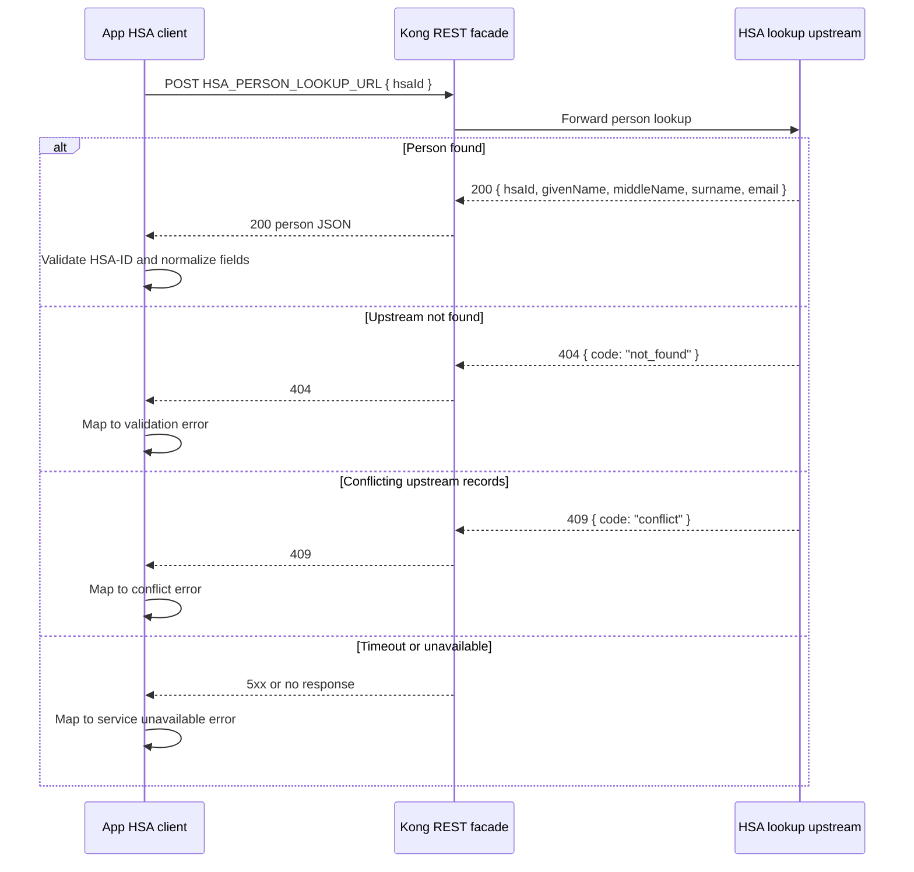
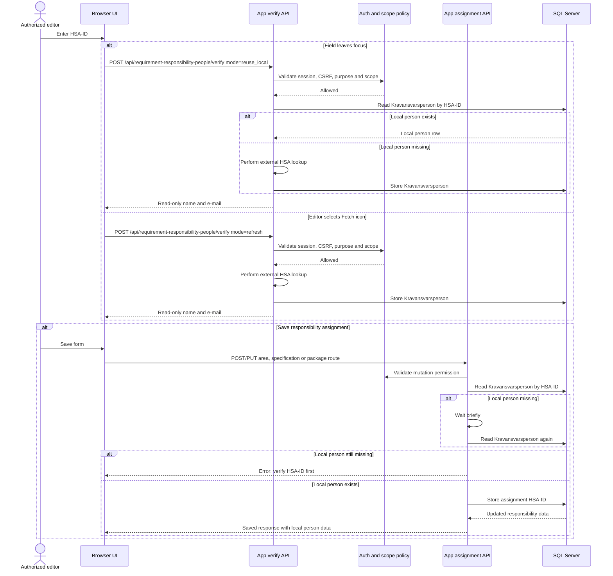

# HSA person lookup integration

This document covers the server-side integration used to fetch person
information for responsibility assignments. Authentication and local Keycloak
developer setup are documented separately in
[auth-developer-workflow.md](./auth-developer-workflow.md).

## Scope

Kravhantering uses HSA person lookup only for live responsibility-assignment
editing surfaces such as requirement-area owners and co-authors, requirement
specification responsible persons and co-authors, and requirement-package
co-authors. The browser never calls Kong or the HSA directory directly. It
only talks to the app's protected same-origin routes.

Read views do not call HSA. Save routes also do not call HSA. Person lookup
happens before save through the app-owned verify route, and the result is
stored as a local `Kravansvarsperson` row keyed by HSA-ID.

## Devcontainer services

The devcontainer includes Kong Gateway as the internal `kong` service for
API-management verification and an HSA directory mock as
`hsa-directory-mock`. Kong runs DB-less with source-controlled configuration
from [containers/kong/kong.yml](../containers/kong/kong.yml). Its proxy and
Admin API are available only on the compose network at `kong:8000` and
`kong:8001`; no Kong ports are forwarded to the host.

The HSA directory mock is also internal-only. It exposes the SOAP
`GetHsaPerson` endpoint and the dev REST person-lookup facade on
`hsa-directory-mock:8080`.

Use `npm run devcontainer:kong:status` from the workspace to verify that the
devcontainer `app` service can reach the internal Admin API. Use
`npm run devcontainer:hsa-mock:status` to check the mock directly, or
`npm run devcontainer:hsa-mock:verify` to post both a SOAP `GetHsaPerson`
request through Kong at `http://kong:8000/svr-hsaws2/hsaws` and a REST person
lookup through Kong at `http://kong:8000/hsa/person-records/lookup`.

## Runtime configuration

The app calls the configured person lookup endpoint through
`HSA_PERSON_LOOKUP_URL`. In devcontainer this points at Kong on the internal
Compose network. Test and production environments should point at the approved
environment-specific Kong route or integration-platform REST facade. The
browser must never receive this endpoint or call it directly.

`HSA_PERSON_LOOKUP_TIMEOUT_MS` controls the app-side timeout. Keep the default
unless the approved integration path for an environment requires a different
timeout.

## Verify route

The responsibility-assignment person lookup flow stays server-side. The browser
calls `POST /api/requirement-responsibility-people/verify`, and the app checks
session, CSRF, purpose, and scope before any local read or HSA lookup.

The route has two explicit modes:

- `reuse_local` is used when the editor leaves an HSA-ID field. If a local
  `Kravansvarsperson` row already exists, the app reuses it without calling
  HSA. If the row is missing, the app calls `HSA_PERSON_LOOKUP_URL`, normalizes
  the response, and updates or inserts the local person row.
- `refresh` is used by the manual fetch icon. It always calls
  `HSA_PERSON_LOOKUP_URL` and updates or inserts the local person row with the
  returned name components and e-mail.

## Technical API flow

This diagram focuses only on the external lookup path after the app has decided
that it needs to call the configured HSA integration endpoint.

In devcontainer, `Kong REST facade` is the DB-less Kong route
`/hsa/person-records/lookup`, and `HSA lookup upstream` is the HSA directory
mock's REST facade. Test and production environments can keep the same
app-facing REST contract while the approved Kong or integration-platform route
handles any transformation needed for the real HSA upstream.

## Responsibility-assignment flow

The save routes require a local `Kravansvarsperson` row for the HSA-ID being
assigned. They retry the local read once after a short delay to handle a
verification request that just completed. If the local row is still missing,
the route returns an error asking the editor to verify the HSA-ID first.

## Related decisions

- [ADR 0024: HSA-katalogmock som SOAP-upstream](./adr/0024-hsa-katalogmock-som-soap-upstream.md)
- [ADR 0025: Kravansvarsperson för HSA-uppslag](./adr/0025-kravansvarsperson-for-hsa-uppslag.md)
- [API security](./api-security.md)
