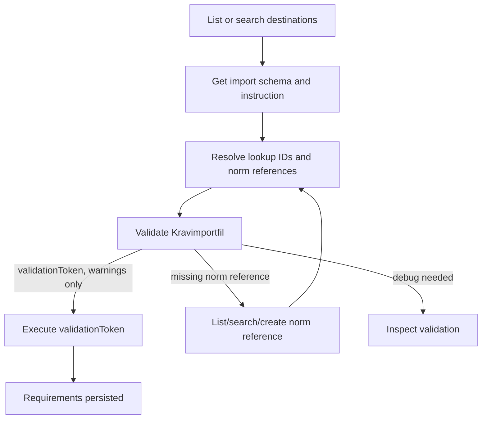
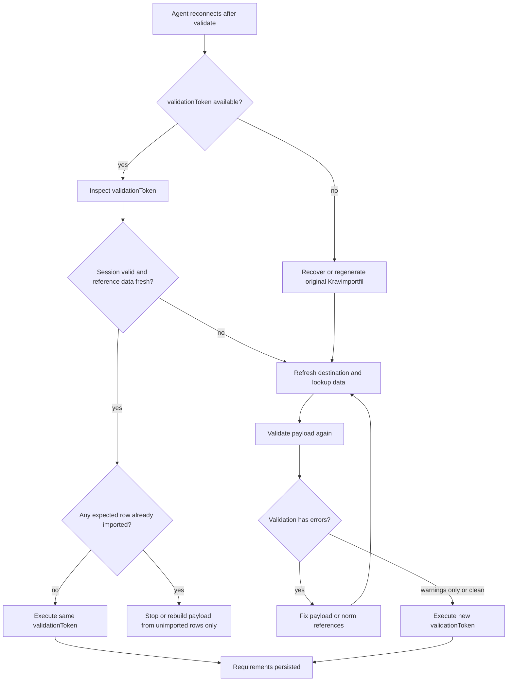

# MCP Server User Guide

## Overview

This project exposes a requirements-management MCP server named
`requirement-management-mcp-server`.

- Transport: stateless Streamable HTTP
- Endpoint: `/api/mcp`
- Local URL: `http://localhost:3000/api/mcp`
- Public identifier for requirements: `uniqueId`
- Read formats: `markdown` or `json`
- Locales: `en` or `sv`

The server is designed for MCP-capable clients such as Visual Studio Code and
GitHub Copilot coding agent. It keeps the tool surface intentionally small so
agents can use it reliably.

## What The Server Exposes

### Tools

#### Requirements

- `requirements_query_catalog`
  List or search requirements and fetch lookup catalogs such as areas,
  categories, types, quality characteristics, priority levels, statuses,
  usage statuses, requirement packages, and transitions. For `categories`,
  `types`, `quality_characteristics`, `priority_levels`, and
  `requirement_packages`, use `operation: "list"` or `operation: "search"` to
  receive unpaginated lookup rows in `structuredContent.result`.
- `requirements_get_import_schema`
  Retrieve the canonical JSON Schema for a `Kravimportfil`. Use this as the
  mandatory file-format contract for generated import JSON. The schema tool is
  locale-free.
- `requirements_get_import_instruction`
  Retrieve the canonical `Importinstruktion` Markdown for a `Kravimportfil`.
  This is Kravhantering guidance and does not override or replace the JSON Schema.
- `requirements_manage_norm_reference`
  List, search, or create Normbibliotek norm references. Use it to resolve
  `normReferenceIds` before import validation; archived norm references are not
  valid for import.
- `requirements_manage_import`
  List/search import destinations, validate a `Kravimportfil`, execute a
  persisted validation session, or inspect full validation details. Validation
  returns a bearer-style `validationToken`; execution imports every unconsumed
  row without errors. Warning rows are importable.
- `requirements_get_requirement`
  Fetch the current requirement detail, a specific version, or full version
  history.
- `requirements_manage_requirement`
  Create, edit, archive, delete the latest draft, or restore a historical
  version. For `operation: "edit"`, first fetch the requirement with
  `view: "history"` and pass `requirement.versions[0].id` and
  `requirement.versions[0].revisionToken` back as
  `requirement.baseVersionId` and `requirement.baseRevisionToken`. A
  successful `operation: "delete_draft"` returns `result.deleted` as an
  ordered deletion ledger. It contains a `draftRequirementVersion` item with
  `requirementUniqueId` and `versionNumber`, followed by a `requirement` item
  when the parent requirement row was also deleted.
- `requirements_transition_requirement`
  Move a requirement through the lifecycle using a target status ID.

#### Requirements specifications (Kravunderlag)

- `requirements_list_specifications`
  List all requirements specifications, optionally filtered by name. Returns
  `specificationId`, `specificationCode`, Swedish and English names, item count,
  governance object type, and implementation type for each specification. Copy
  path:

  ```text
  requirements_list_specifications.specifications[].specificationId -> specificationId
  ```

- `requirements_get_specification_items`
  List requirement applications linked to a specific specification, with
  optional description search. Use the numeric `specificationId` from
  `requirements_list_specifications`. Copy linked requirement IDs from:

  ```text
  requirements_get_specification_items.items[].id -> requirementIds
  ```

- `requirements_list_graduation_target_areas`
  List requirement areas the actor may use when graduating a specific
  unique requirement. Use a returned `areas[].id` as
  `requirementAreaId` for `requirements_graduate_local_requirement`.
- `requirements_add_to_specification`
  Link one or more requirements to a specification. Requirements must have a
  published version; those without are skipped and returned in `skippedIds`.
  Optionally attach an existing `needsReferenceId`, or create a new
  `needsReferenceText` with an optional `needsReferenceDescription`, for all
  added items. New needs-reference text must be unique inside the
  specification. Use `specificationId` to identify the specification. Copy
  requirement IDs from:

  ```text
  requirements_query_catalog.items[].id -> requirementIds
  ```

- `requirements_graduate_local_requirement`
  Copy a unique requirement into a chosen library requirement area as a new Draft
  library requirement, regardless of its usage status. The source unique
  requirement remains unchanged in the specification, and deviations stay with
  that source row.
- `requirements_remove_from_specification`
  Unlink one or more requirements from a specification. The requirements themselves
  are not deleted. Use `specificationId` to identify the specification.

#### Improvement Suggestions

- `requirements_list_improvement_suggestions`
  List improvement suggestions for a specific requirement. Identify the requirement
  by numeric `requirementId` or by `uniqueId` (e.g. `REQ-001`). Returns
  suggestions with lifecycle status and resolution details.
- `requirements_manage_improvement_suggestion`
  Create, edit, delete, request review, revert to draft, resolve, or dismiss
  an improvement suggestion on a requirement. Operations: `create`, `edit`, `delete`,
  `request_review`, `revert_to_draft`, `resolve`, `dismiss`.

### Resources

- `requirements://requirement/{uniqueId}`
  Read-only JSON resource for a requirement.
- `ui://requirements/requirement-detail/{uniqueId}`
  Read-only HTML view for MCP Apps-capable clients.

Add `?version=<number>` to either URI to target a specific version.

## MCP Requirement Import Flow



`requirements_manage_import.validate` stores a SQL-backed validation session for
the configured TTL. Later `execute` and `inspect_validation` calls accept only
the `validationToken`; they do not accept locale, destination, row selectors, or
payload patches. Validation sessions are immutable after `validate`.
Reference-data changes make a session stale and require a new validation call.
If `execute` fails because the stored destination no longer exists or can no
longer accept imported krav, choose a current destination and run `validate`
again.

Use `inspect_validation` when the execute response is lost or uncertain. Build a
corrected `Kravimportfil` only from rows that were not successfully imported,
then run `validate` and `execute` with the new token. Do not copy successfully
imported rows into the corrected payload; the server does not do generic
duplicate detection across validation sessions.

### Recover When The Agent Session Is Lost

If the MCP client, chat, or agent process loses its own session after
`validate` returns but before `execute` runs, treat the `validationToken` as the
handoff state. The persisted validation session is not discoverable by
destination, payload, actor, or row content; `execute` and `inspect_validation`
can recover it only by token.

If the token is still available in the transcript, logs, or user-provided
notes, call `requirements_manage_import.inspect_validation` first. Confirm that
the destination still matches the intended import, `referenceData.isStale` is
`false`, the row set is the expected one, and no expected row already has
`imported: true`. If the inspection is fresh and the rows are unimported, call
`execute` with the same token. If any row is already imported, stop or build a
new `Kravimportfil` from only the unimported rows.

If the token is unavailable, expired, stale, or points at an invalid
destination, the agent cannot execute that persisted validation session. Recover
the original `Kravimportfil` or regenerate it from the source material, refresh
destinations and lookup IDs, validate again, and execute the new
`validationToken`.



## Current Security Status

The MCP route is authenticated. Every request to `/api/mcp` must include an
`Authorization: Bearer <token>` header.

`proxy.ts` checks that the Bearer header is present. The MCP HTTP route then
validates the JWT against the configured issuer JWKS and API audience before any
MCP transport or tool handler runs. Accepted tokens must contain a real-format
`employeeHsaId` claim. The committed local MCP service client emits
`SE5560000001-mcp1`. If a local token lacks that claim, reset or re-import the
local Keycloak realm instead of compensating in application code.

Invalid or missing tokens return `401` with `WWW-Authenticate: Bearer` and a
JSON-RPC error body. MCP does not use browser cookies and is intentionally
excluded from browser CSRF checks. Tool handlers build their actor context only
from the verified token attached at the HTTP edge.

## Run It Locally

The MCP server is part of the Next.js app and uses the same SQL Server +
TypeORM stack. For the full developer setup, see
[sql-server-developer-workflow.md](../development/sql-server-developer-workflow.md).

1. Install dependencies with `npm install`.
2. Start the local SQL Server with `npm run db:up`.
3. Migrate and seed the local database with `npm run db:setup`.
4. Start the app with `npm run dev`.

   To obtain a dev MCP token, first make sure the local IdP is running with
   the current realm JSON (`npm run idp:up` if the realm may be stale), then
   run `node scripts/security/get-mcp-token.mjs`.

5. Configure your MCP client with the non-production Bearer token from
   `scripts/security/get-mcp-token.mjs` for the local issuer/audience and
   connect to `http://localhost:3000/api/mcp`.

The server is implemented inside the Next.js app, so there is no separate MCP
process to start.

## Configure Remote MCP Clients

Use the same Streamable HTTP endpoint shape for any MCP client that can send
the required `Authorization: Bearer <token>` header:

- Local development: `http://localhost:3000/api/mcp`
- Deployed environments: `https://<public-origin>/api/mcp`
- GitHub Codespaces:
  `https://<codespace-name>-3000.app.github.dev/api/mcp`

For Codespaces, port `3000` must be public and the dev server must be running.
See [github-codespaces.md](../development/github-codespaces.md) for the
Codespaces-specific forwarding workflow.

For local development, obtain a dev MCP token with:

```sh
node scripts/security/get-mcp-token.mjs
```

Do not commit tokens to repository files. If a client cannot send the Bearer
header, it cannot use the current protected MCP route.

## Configure Visual Studio Code

Visual Studio Code supports MCP server configuration in `.vscode/mcp.json` for
workspace-scoped usage or in the user profile for global usage.

Create `.vscode/mcp.json` with:

```json
{
  "servers": {
    "requirement-management": {
      "type": "http",
      "url": "http://localhost:3000/api/mcp",
      "headers": {
        "Authorization": "Bearer ${env:MCP_TOKEN}"
      }
    }
  }
}
```

Do not commit real tokens in workspace configuration. Prefer user-level MCP
configuration or secret/env substitution supported by your MCP client; the
`${env:MCP_TOKEN}` pattern above is the safe default. If your client cannot
substitute environment variables, use a placeholder such as
`Bearer <paste-non-production-token-here-do-not-commit>` only in local,
uncommitted configuration.

For a deployed environment, replace the URL with your public HTTPS origin:

```json
{
  "servers": {
    "requirement-management": {
      "type": "http",
      "url": "https://your-domain.example/api/mcp",
      "headers": {
        "Authorization": "Bearer <token>"
      }
    }
  }
}
```

### Use It In Chat

1. Open Copilot Chat in Visual Studio Code.
2. Switch the chat mode to `Agent`.
3. Select `Configure Tools`.
4. Enable the `requirement-management` server or individual tools from it.
5. Ask a natural-language question, or explicitly reference a tool with `#`.

Examples:

- `List the published requirements for the Integration area.` (in Swedish:
  `Lista publicerade krav för integrationsområdet.`)
- `Show requirement INT0001 and include the latest version details.`
- `Show me the properties of the requirement INT0002`
- `Show me all version of the requirement IND0001 and what status each have`
  (fail case, wrong ID)
- `Show me all version of the requirement IDN0001 and what status each have`
- `Show requirement IDN0001`
- `Show me all version of IDN0001`
- `Show me the details of version 2 of IDN0001`
- `Show me requirement ANV0001` (fail case, there is no published version)
- `Use #requirements_query_catalog to list available statuses first, then move`
  `INT0001` to review.
- `Hämta krav ANV0001 med version 1 och flytta det sen till granskning`

More advanced examples:

```text
For requirement IDN0001, return a table with three columns; version numbers,
status and date. Use dates like this:
- Draft: created date
- Published: Published date
- Archived: Archive date
- Review: (no date)
```

```text
Open requirement INT0002 in the MCP app view.
```

```text
För krav-ID IDN0001, returnera en tabell med tre kolumner: versionsnummer,
status och datum. Använd datum enligt följande:
- Utkast skapandedatum
- Publicerad: publiceringsdatum
- Arkiverad: arkiveringsdatum
- Granskning: (inget datum)
```

### MCP Apps In Visual Studio Code

This server returns a requirement view app through
`ui://requirements/requirement-detail/{uniqueId}`. In Visual Studio Code, the
app can render directly in chat when the client supports MCP Apps.

If the app is not rendering:

1. Confirm the server is connected with `MCP: List Servers`.
2. Restart the server from that command if needed.
3. Enable the `chat.mcp.apps.enabled` setting if your VS Code build still
   requires it.

### Useful VS Code Commands

- `MCP: List Servers`
  Start, stop, restart, or inspect the server.
- `MCP: Browse Resources`
  Browse resources exposed by the server.
- `MCP: Reset Cached Tools`
  Refresh the tool list after server changes.

### Troubleshooting In VS Code

- If the server fails to start, open `MCP: List Servers`, select
  `requirement-management`, then choose `Show Output`.
- If the tools do not appear in chat, verify that the chat is in `Agent` mode
  and that the tools are enabled in `Configure Tools`.
- If the requirement app does not appear, the tool result still includes normal
  text and structured data, so the server remains usable even without app
  rendering.
- If VS Code logs repeated messages such as
  `Error connecting to http://localhost:3000/api/mcp for async notifications,
  will retry`, that is
  expected with the current stateless Streamable HTTP implementation. Tool
  calls, resources, and requirement app responses can still work correctly.
  Those messages refer to the optional async notification channel rather than
  normal MCP request/response handling.

## Configure GitHub Copilot Coding Agent

GitHub Copilot coding agent supports MCP tools, but not MCP resources or MCP
Apps. For this server, that means the tools are available, but the
HTML-based requirement view is ignored by the coding agent.

Because coding agent runs remotely, do not point it at
`http://localhost:3000/api/mcp`. Use a reachable HTTPS deployment instead.

Open your repository settings on GitHub:

1. `Settings`
2. `Copilot`
3. `Coding agent`
4. `MCP configuration`

Use a configuration like this:

```json
{
  "mcpServers": {
    "requirement-management": {
      "type": "http",
      "url": "https://your-domain.example/api/mcp",
      "tools": [
        "requirements_query_catalog",
        "requirements_get_requirement",
        "requirements_manage_requirement",
        "requirements_transition_requirement",
        "requirements_list_specifications",
        "requirements_get_specification_items",
        "requirements_list_graduation_target_areas",
        "requirements_add_to_specification",
        "requirements_graduate_local_requirement",
        "requirements_remove_from_specification",
        "requirements_list_improvement_suggestions",
        "requirements_manage_improvement_suggestion"
      ],
      "headers": {
        "Authorization": "$COPILOT_MCP_REQUIREMENT_MANAGEMENT_AUTHORIZATION"
      }
    }
  }
}
```

This explicit allowlist is preferable to `"*"` because coding agent can use the
tools autonomously. The `Authorization` value must contain the full Bearer
header value, usually supplied through a Copilot environment secret.

### Auth Header Example For Coding Agent

Configure headers with Copilot environment variables or secrets prefixed with
`COPILOT_MCP_`.

Example:

```json
{
  "mcpServers": {
    "requirement-management": {
      "type": "http",
      "url": "https://your-domain.example/api/mcp",
      "tools": [
        "requirements_query_catalog",
        "requirements_get_requirement",
        "requirements_manage_requirement",
        "requirements_transition_requirement",
        "requirements_list_specifications",
        "requirements_get_specification_items",
        "requirements_list_graduation_target_areas",
        "requirements_add_to_specification",
        "requirements_graduate_local_requirement",
        "requirements_remove_from_specification",
        "requirements_list_improvement_suggestions",
        "requirements_manage_improvement_suggestion"
      ],
      "headers": {
        "Authorization":
          "$COPILOT_MCP_REQUIREMENT_MANAGEMENT_AUTHORIZATION"
      }
    }
  }
}
```

In that example, the Copilot environment secret value should already contain the
full header value, for example `Bearer <token>`.

## How To Work With The Tools Effectively

### 1. Start With Lookup Data

Before creating or transitioning requirements, ask the agent to fetch lookup
data first:

- areas
- categories
- types
- type categories
- statuses
- usage statuses
- transitions

This is especially useful because transitions use `toStatusId`, and creation or
editing may require IDs for areas and classification fields.

For edits, also fetch the requirement immediately before preparing the edit
with `view: "history"`. Use `requirement.versions[0].id` as
`requirement.baseVersionId` and `requirement.versions[0].revisionToken` as
`requirement.baseRevisionToken`. If the server returns `409 Conflict` with
`reason: "stale_requirement_edit"`, read the returned latest snapshot and
compare before retrying.

### 2. Prefer `uniqueId`

Use stable IDs such as `INT0001` when possible. The server still supports
numeric IDs in some operations, but `uniqueId` is the preferred public
identifier.

### 3. Ask For The View You Need

`requirements_get_requirement` supports three views:

- `detail`
  Current requirement and latest published version context. If no published
  version exists, the server returns an error instead of falling back to draft,
  review, or archived versions.
- `history`
  All versions.
- `version`
  A specific version when used with `versionNumber`.

If you do not pass a `versionNumber`, the server does not default to the newest
draft or review version. It defaults to the published version with the highest
version number.

Examples:

```json
{
  "uniqueId": "INT0001",
  "view": "detail"
}
```

```json
{
  "uniqueId": "INT0001",
  "view": "history"
}
```

```json
{
  "uniqueId": "INT0001",
  "view": "version",
  "versionNumber": 2
}
```

### 4. Use `query_catalog` For Search And Pagination

The server combines requirement search and lookup catalog reads into the same
tool. For requirement lists, it supports:

- `limit`
- `offset`
- `uniqueIdSearch`
- `descriptionSearch`
- `includeArchived`
- `areaIds`
- `categoryIds`
- `typeIds`
- `qualityCharacteristicIds`
- `priorityLevelIds`
- `normReferenceIds`
- `requirementPackageIds`
- `statuses`
- `verifiable`
- `sortBy`
- `sortDirection`

Lookup rows for statuses, priority levels, and usage statuses include
`iconName` when an admin has configured an allowed icon. Requirement list and
detail versions also include status fields such as `statusIconName`,
list-response priority-level fields such as `priorityLevelColor` and
`priorityLevelIconName`, and the detail-response `priorityLevel` object with
its additive `iconName`. These priority-level fields are separate from the
unchanged status fields.

## Example Tasks

### Read-Only

- `List the first 10 requirements that mention login.`
- `Show the version history for SEC0012.`
- `List available requirement transitions.`
- `Show all requirement packages and then tell me which ones are linked to INT0001.`

### Mutating

- `Create a draft requirement for area 3 describing MFA support.`
- `Edit INT0001 and add a reference to the new architecture decision record.`
- `Archive INT0001.`
- `Restore version 2 of INT0001.`
- `Transition INT0001 to published after checking the valid transitions.`

### Requirements specifications

- `List all requirements specifications.`
- `List specifications whose name contains "säkerhet".`
- `Show all requirements in specification SAKLYFT-INFOR-Q2.`
- `Search for requirements about login in specification SAKLYFT-INFOR-Q2.`
- `Add requirements INT0001 and INT0002 to specification SAKLYFT-INFOR-Q2.`
- `Add requirement INT0005 to specification GDPR-FORV-2026 with needs reference text "Behov 4.1".` <!-- markdownlint-disable-line MD013 -->
- `Add requirement INT0005 to specification GDPR-FORV-2026 with needs reference id 12.` <!-- markdownlint-disable-line MD013 -->
- `List graduation target requirement areas for unique requirement 41 in SAKLYFT-INFOR-Q2.`
- `Graduate unique requirement 41 from specification SAKLYFT-INFOR-Q2 into requirement area 3.` <!-- markdownlint-disable-line MD013 -->
- `Remove requirement INT0003 from specification SAKLYFT-INFOR-Q2.`

> **Note:** Specifications are identified in MCP tools by numeric
> `specificationId`. Copy
> `requirements_list_specifications.specifications[].specificationId` ->
> `specificationId`. `specificationCode` is returned for display and lookup by a
> human, but not as the MCP identifier. For `requirements_add_to_specification`,
> copy
> `requirements_query_catalog.items[].id` -> `requirementIds`; use
> `needsReferenceId` only when it comes from that specification's existing
> needs-reference register, or use new `needsReferenceText` plus optional
> `needsReferenceDescription`. For
> `requirements_remove_from_specification`, copy
> `requirements_get_specification_items.items[].id` -> `requirementIds`.
> Requirements must have a published version to be added to a specification.
> Graduation is copy-only: it creates a new Draft library requirement and leaves
> the source unique requirement unchanged. Graduation requires
> authorship of the source specification and ownership or co-authorship of the
> target requirement area. Use `requirements_list_graduation_target_areas` before
> graduating so the target `requirementAreaId` comes from the actor's allowed
> target requirement areas.

## Limitations

- The server is HTTP-only in this project. There is no stdio transport.
- GitHub Copilot coding agent only uses tools from this server. It does not use
  the requirement resource or the requirement app view.
- Status transitions require numeric status IDs. Use the transitions or statuses
  catalogs instead of guessing them.

## Official Client References

- Visual Studio Code MCP setup:
  <https://code.visualstudio.com/docs/copilot/customization/mcp-servers>
- Visual Studio Code MCP configuration reference:
  <https://code.visualstudio.com/docs/copilot/reference/mcp-configuration>
- Visual Studio Code tool usage:
  <https://code.visualstudio.com/docs/copilot/agents/agent-tools>
- GitHub Copilot coding agent MCP integration:
  <https://docs.github.com/en/copilot/how-tos/use-copilot-agents/coding-agent/extend-coding-agent-with-mcp>
- GitHub Copilot coding agent MCP capabilities:
  <https://docs.github.com/en/copilot/concepts/agents/coding-agent/mcp-and-coding-agent>
