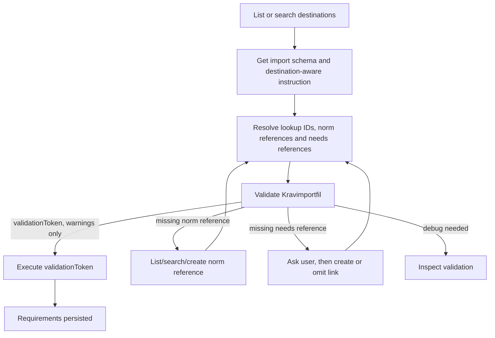
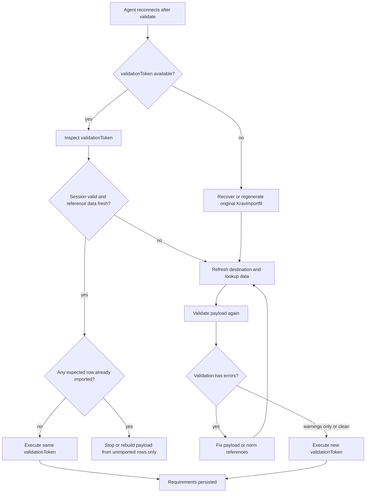

# MCP Server User Guide

## Overview

This guide is for people connecting an MCP client to Kravhantering and using
it to read, manage, or import requirements. The server is named
`requirement-management-mcp-server`.

- Transport: stateless Streamable HTTP
- Endpoint: `/api/mcp`
- Local URL: `http://localhost:3000/api/mcp`
- Public identifier for requirements: `uniqueId`
- Read formats: `markdown` or `json`
- Locales: `en` or `sv`

Use an MCP-capable client that can supply the required Bearer token, such as
Visual Studio Code.

## What The Server Exposes

### Tools

#### Requirements

- `requirements_query_catalog`
  List or search requirements and lookup catalogs such as areas, categories,
  types, quality characteristics, priority levels, statuses, usage statuses,
  requirement packages, and transitions. Pass both `catalog` and `operation`
  (`"list"` or `"search"`). Rows are always returned in
  `structuredContent.result`; search rows include `match` metadata. Numeric
  requirement filter arrays accept at most 200 unique positive integer IDs
  each.
- `requirements_get_import_schema`
  Retrieve the canonical JSON Schema for a `Kravimportfil`. Use this as the
  mandatory file-format contract for generated import JSON. The schema tool is
  locale-free.
- `requirements_get_import_instruction`
  Retrieve the canonical `Importinstruktion` Markdown for a `Kravimportfil`.
  `destination` is required. For kravbiblioteksimport, pass
  `{kind:"requirements_library"}`; no requirement area is needed because the
  instruction does not vary by area. For kravunderlagsimport, pass
  `{kind:"requirements_specification", specificationId}`. If the specification
  is unknown, ask the user and use `requirements_manage_import`
  `list_destinations` or `search_destinations` to resolve it before requesting
  instruction. This is Kravhantering guidance and does not override or replace
  the JSON Schema.

  Requirement-package reference data contains only stable ID, package name,
  and purpose and scope. It excludes package-lead names, HSA IDs, email
  addresses, and other structured person identifiers. The MCP server does not
  offer AI generation or open provider egress. If an MCP client sends the
  instruction or source material to an AI provider, that egress and its privacy
  controls are client-owned; Kravhantering's deny-collection and zero-retention
  minimum applies only to server-owned AI requests.
- `requirements_manage_norm_reference`
  List, search, get, or create Normbibliotek norm references, and list the
  connected library Krav IDs for one norm reference. Use list/search to resolve
  `normReferenceIds` before import validation; archived norm references are not
  valid for import.
- `requirements_manage_needs_reference`
  List, search, get, or create needs references for one requirements
  specification. Use list/search/get to resolve `needsReferenceId` values before
  validating a kravunderlagsimport. Ask the user before creating missing needs
  references.
- `requirements_manage_import`
  List/search import destinations, validate a `Kravimportfil`, execute a
  persisted validation session, or inspect full validation details. Validation
  returns a bearer-style `validationToken`; execution imports every unconsumed
  row without errors. Warning rows are importable.
- `requirements_get_requirement`
  Fetch the current requirement detail, a specific version, or full version
  history. A version whose current status is Published can be read without
  area assignment. Draft, review, and archived versions, including previously
  published versions, require area authorship, `Reviewer`, or `Admin`, as does
  full history. A published parent does not grant access to its newer draft.
  A missing version on a readable requirement returns a not-found tool error.
- `requirements_manage_requirement`
  Create, edit, archive, delete the latest draft, or restore a historical
  version. For `operation: "edit"`, first fetch the requirement with
  `view: "history"` and pass `requirement.versions[0].id` and
  `requirement.versions[0].revisionToken` back as
  `requirement.baseVersionId` and `requirement.baseRevisionToken`.
  `requirement.normReferenceIds` and `requirement.requirementPackageIds` each
  accept at most 200 unique positive integer IDs. A
  successful `operation: "delete_draft"` returns `result.deleted` as an
  ordered deletion ledger. It contains a `draftRequirementVersion` item with
  `requirementUniqueId` and `versionNumber`, followed by a `requirement` item
  when the parent requirement row was also deleted.
- `requirements_transition_requirement`
  Move a requirement through the lifecycle using a target status ID.

#### Requirements specifications (Kravunderlag)

- `requirements_list_specifications`
  List all requirements specifications, optionally filtered by name. Returns
  `specificationId`, `specificationCode`, Swedish and English names, item count,
  governance object type, and implementation type for each specification. Copy
  path:

  ```text
  requirements_list_specifications.specifications[].specificationId -> specificationId
  ```

- `requirements_get_specification_items`
  List one bounded page of requirement applications for a specification. Use
  the numeric `specificationId` from `requirements_list_specifications` and
  optional complete-result filters, locale, sort, direction, cursor, and a
  limit from 1 through 100 (default 50). The response reports page count and
  continuation availability, not an exact total. Continue with
  `pagination.nextCursor`; on `invalid_cursor`, restart without a cursor using
  the same query. Copy stable references for mixed-item actions. Copy an
  `items[].id` into `requirementIds` only when that entry has
  `kind == "library"`; a specification-local ID is not a library requirement
  ID:

  ```text
  requirements_get_specification_items.items[].itemRef -> itemRef
  requirements_get_specification_items.items[kind == "library"].id -> requirementIds
  ```

- `requirements_list_graduation_target_areas`
  List requirement areas the actor may use when graduating a specific
  unique requirement. Use a returned `areas[].id` as
  `requirementAreaId` for `requirements_graduate_local_requirement`.
- `requirements_add_to_specification`
  Link from 1 through 200 unique requirements to a specification. Requirements
  must have a published version; those without are skipped and returned in
  `skippedIds`. Optionally attach an existing `needsReferenceId`, or create a
  new `needsReferenceText` with an optional `needsReferenceDescription`, for
  all added items. New needs-reference text must be unique inside the
  specification. Use `specificationId` to identify the specification. Copy
  requirement IDs from:

  ```text
  requirements_query_catalog.result[].id -> requirementIds
  ```

- `requirements_graduate_local_requirement`
  Copy a unique requirement into a chosen library requirement area as a new Draft
  library requirement, regardless of its usage status. The source unique
  requirement remains unchanged in the specification, and deviations stay with
  that source row.
- `requirements_remove_from_specification`
  Unlink from 1 through 200 unique requirements from a specification. The
  requirements themselves are not deleted. Use `specificationId` to identify
  the specification.

#### Improvement Suggestions

- `requirements_list_improvement_suggestions`
  List improvement suggestions for a specific requirement. Identify the requirement
  by numeric `requirementId` or by `uniqueId` (e.g. `REQ-001`). Returns
  suggestions with lifecycle status and resolution details.
- `requirements_manage_improvement_suggestion`
  Create, edit, delete, request review, revert to draft, resolve, or dismiss
  an improvement suggestion on a requirement. Operations: `create`, `edit`, `delete`,
  `request_review`, `revert_to_draft`, `resolve`, `dismiss`, `attach_implementation`.

### Resources

- `requirements://requirement/{uniqueId}`
  Read-only JSON resource for a requirement.
- `ui://requirements/requirement-detail/{uniqueId}`
  Read-only HTML view for MCP Apps-capable clients.

Add `?version=<number>` to either URI to target a specific version.

## Norm Reference Discovery

Use `requirements_manage_norm_reference` with `operation: "list"` or
`operation: "search"` for normal discovery. These operations return full
Normbibliotek row properties in `structuredContent.result`; search rows may add
`match` metadata. They intentionally do not include connected krav rows, IDs, or
usage counts.

For an exact row, including an archived norm reference, call
`operation: "get"` with exactly one selector:

```json
{ "operation": "get", "id": 7 }
```

or:

```json
{ "operation": "get", "normReferenceId": "ISO-27001" }
```

To inspect connected library Krav, call
`operation: "list_connected_requirement_ids"` with the same selector shape.
The response is:

```json
{
  "requirements": [
    { "id": 2, "uniqueId": "REQ-0002" },
    { "id": 10, "uniqueId": "REQ-0010" }
  ]
}
```

`uniqueId` is the stable Krav-ID. The connected-ID operation includes only
library Krav, deduplicated across linked kravversioner and sorted by `uniqueId`;
kravunderlagslokala krav are not included.

For `operation: "create"`, omit `normReferenceId` to generate an available ID.
A supplied ID is never rewritten: if it already exists, the tool returns
`isError: true` with `error.code: "conflict"` and
`error.reason: "norm_reference_id_exists"`. Choose an unused ID and retry.
If automatic generation returns `norm_reference_id_generation_exhausted`,
supply an unused ID explicitly.

## Needs Reference Discovery

Use `requirements_manage_needs_reference` for kravunderlagsimport when rows
should point to existing or newly created behovsreferenser. First select a
requirements specification with `requirements_manage_import` destination
discovery, then copy:

```text
requirements_manage_import.result[].specificationId -> specificationId
```

Call `operation: "list"` or `operation: "search"` to discover existing rows.
Search rows may add `match` metadata. For an exact row, call:

```json
{
  "operation": "get",
  "specificationId": 8,
  "needsReferenceId": 12
}
```

If a row needs a new behovsreferens, ask the user before creating it. After
approval, call:

```json
{
  "operation": "create",
  "specificationId": 8,
  "text": "Personuppgiftsbehandling behöver tekniskt skydd",
  "description": "Stödjer införande av GDPR artikel 32."
}
```

Then copy the returned ID into the import file:

```text
requirements_manage_needs_reference.result[].id -> requirements[].needsReferenceId
requirements_manage_needs_reference.needsReference.id -> requirements[].needsReferenceId
```

If the user does not approve creation, ask whether importing without the
needs-reference link is acceptable. Stop when the missing link is central to
why the row belongs in the requirements specification. Do not rely on
unresolved `proposedNeedsReferences` being resolved after MCP execute; MCP has
no human import-review step between `validate` and `execute`.

## MCP Requirement Import Flow


```mermaid
flowchart TD
  A[List or search destinations] --> B[Get import schema and destination-aware instruction]
  B --> C[Resolve lookup IDs, norm references and needs references]
  C --> D[Validate Kravimportfil]
  D -->|validationToken, warnings only| E[Execute validationToken]
  D -->|missing norm reference| F[List/search/create norm reference]
  D -->|missing needs reference| I[Ask user, then create or omit link]
  F --> C
  I --> C
  D -->|debug needed| G[Inspect validation]
  E --> H[Requirements persisted]
```

`requirements_manage_import.validate` stores a SQL-backed validation session for
the configured TTL. Later `execute` and `inspect_validation` calls accept only
the `validationToken`; they do not accept locale, destination, row selectors, or
payload patches. Validation sessions are immutable after `validate`.
Reference-data changes make a session stale and require a new validation call.
If `execute` fails because the stored destination no longer exists or can no
longer accept imported krav, choose a current destination and run `validate`
again.

Use `inspect_validation` when the execute response is lost or uncertain. Build a
corrected `Kravimportfil` only from rows that were not successfully imported,
then run `validate` and `execute` with the new token. Do not copy successfully
imported rows into the corrected payload; the server does not do generic
duplicate detection across validation sessions.

### Recover When The Agent Session Is Lost

If the MCP client, chat, or agent process loses its own session after
`validate` returns but before `execute` runs, treat the `validationToken` as the
handoff state. The persisted validation session is not discoverable by
destination, payload, actor, or row content; `execute` and `inspect_validation`
can recover it only by token.

If the token is still available in the transcript, logs, or user-provided
notes, call `requirements_manage_import.inspect_validation` first. Confirm that
the destination still matches the intended import, `referenceData.isStale` is
`false`, the row set is the expected one, and no expected row already has
`imported: true`. If the inspection is fresh and the rows are unimported, call
`execute` with the same token. If any row is already imported, stop or build a
new `Kravimportfil` from only the unimported rows.

If the token is unavailable, expired, stale, or points at an invalid
destination, the agent cannot execute that persisted validation session. Recover
the original `Kravimportfil` or regenerate it from the source material, refresh
destinations and lookup IDs, validate again, and execute the new
`validationToken`.


```mermaid
flowchart TD
  A[Agent reconnects after validate] --> B{validationToken available?}
  B -->|yes| C[Inspect validationToken]
  C --> D{Session valid and reference data fresh?}
  D -->|yes| E{Any expected row already imported?}
  E -->|no| F[Execute same validationToken]
  E -->|yes| G[Stop or rebuild payload from unimported rows only]
  D -->|no| H[Refresh destination and lookup data]
  B -->|no| I[Recover or regenerate original Kravimportfil]
  I --> H
  H --> J[Validate payload again]
  J --> K{Validation has errors?}
  K -->|yes| L[Fix payload or norm references]
  L --> H
  K -->|warnings only or clean| M[Execute new validationToken]
  F --> N[Requirements persisted]
  M --> N
```

## Current Security Status

The MCP route is optional and authenticated. An administrator must enable it
with `MCP_CLIENT_ID`; a disabled endpoint returns `404`. Every request must
include `Authorization: Bearer <token>`. Browser login cookies do not work.

Obtain a token for the approved OAuth service client, API audience, required
scopes, and HSA-id identity from your administrator. For the full token
contract, see [OIDC integration](oidc-identity-provider-integration.md).
Permissions come from the verified token and the actor's assignments.

Missing, invalid, or expired tokens return `401`; obtain a fresh token and
update your client. Authentication configuration failures return `500`, and
identity-provider discovery or key availability failures return `503`; contact
the administrator if these persist. A tool result with `isError: true` is a
failed call even when its only message is `Error: An internal error occurred`.
Do not assume a generic error means a permission denial.

## Run It Locally

The MCP server runs inside the Next.js app; there is no separate MCP process.
Follow the [local developer setup](../development/sql-server-developer-workflow.md)
and [authentication setup](../development/auth-developer-workflow.md) to start
the app, SQL Server, and local identity provider. Ensure the app is configured
with `MCP_CLIENT_ID=kravhantering-mcp` and
`AUTH_MCP_REQUIRED_SCOPES=kravhantering:mcp` before starting it.

Obtain a non-production token with:

```sh
MCP_CLIENT_ID=kravhantering-mcp \
AUTH_MCP_REQUIRED_SCOPES=kravhantering:mcp \
node scripts/security/get-mcp-token.mjs
```

The local client issues five-minute tokens. Renew the token when it expires;
the helper's environment variables do not enable MCP in an already running
app. Do not commit tokens to repository files.

## Configure Remote MCP Clients

Use the URL appropriate for the client:

- Local: `http://localhost:3000/api/mcp`
- Deployed: `https://<public-origin>/api/mcp`
- Codespaces: `https://<codespace-name>-3000.app.github.dev/api/mcp`

For a remote client using Codespaces, port `3000` must be public and the dev
server must be running. See the
[Codespaces forwarding workflow](../development/github-codespaces.md).

## Configure Visual Studio Code

Visual Studio Code supports MCP server configuration in `.vscode/mcp.json` for
workspace-scoped usage or in the user profile for global usage.

Create `.vscode/mcp.json` with:

```json
{
  "servers": {
    "requirement-management": {
      "type": "http",
      "url": "http://localhost:3000/api/mcp",
      "headers": {
        "Authorization": "Bearer ${env:MCP_TOKEN}"
      }
    }
  }
}
```

Do not commit real tokens in workspace configuration. Prefer user-level MCP
configuration or secret/env substitution supported by your MCP client; the
`${env:MCP_TOKEN}` pattern above is the safe default. If your client cannot
substitute environment variables, use a placeholder such as
`Bearer <paste-non-production-token-here-do-not-commit>` only in local,
uncommitted configuration.

For a deployed environment, replace `url` with
`https://your-domain.example/api/mcp` and supply that environment's token.
Set `MCP_TOKEN` in the environment available to VS Code before connecting.

### Use It In Chat

1. Open Copilot Chat in Visual Studio Code.
2. Switch the chat mode to `Agent`.
3. Select `Configure Tools`.
4. Enable the `requirement-management` server or individual tools from it.
5. Ask a natural-language question, or explicitly reference a tool with `#`.

Try `List the published requirements for the Integration area`, or
`Show the version history for INT0001`. Replace example IDs with IDs returned
by the server. To open the app view, ask
`Open requirement INT0001 in the MCP app view`.

### MCP Apps In Visual Studio Code

This server returns a requirement view app through
`ui://requirements/requirement-detail/{uniqueId}`. In Visual Studio Code, the
app can render directly in chat when the client supports MCP Apps.

If the app is not rendering:

1. Confirm the server is connected with `MCP: List Servers`.
2. Restart the server from that command if needed.

### Useful VS Code Commands

- `MCP: List Servers`
  Start, stop, restart, or inspect the server.
- `MCP: Browse Resources`
  Browse resources exposed by the server.
- `MCP: Reset Cached Tools`
  Refresh the tool list after server changes.

### Troubleshooting In VS Code

- If the server fails to start, open `MCP: List Servers`, select
  `requirement-management`, then choose `Show Output`.
- If the tools do not appear in chat, verify that the chat is in `Agent` mode
  and that the tools are enabled in `Configure Tools`.
- If the requirement app does not appear, the tool result still includes normal
  text and structured data, so the server remains usable even without app
  rendering.
- If VS Code logs repeated messages such as
  `Error connecting to http://localhost:3000/api/mcp for async notifications,
  will retry`, that is
  expected with the current stateless Streamable HTTP implementation. Tool
  calls, resources, and requirement app responses can still work correctly.
  Those messages refer to the optional async notification channel rather than
  normal MCP request/response handling.

## GitHub Copilot Cloud Agent And Code Review

GitHub Copilot cloud agent and Copilot code review are unsupported clients for
this server. It requires an OAuth-issued Bearer token, and GitHub currently
lists OAuth-authenticated remote MCP servers as unsupported in these
clients. See the
[GitHub MCP setup limitations](https://docs.github.com/en/copilot/how-tos/copilot-on-github/customize-copilot/configure-mcp-servers).

Use the Visual Studio Code configuration above with a valid token. A static
repository secret cannot acquire or refresh the short-lived access token.

## How To Work With The Tools Effectively

### 1. Start With Lookup Data

Before creating or transitioning requirements, ask the agent to fetch lookup
data first:

- areas
- categories
- types
- type categories
- statuses
- usage statuses
- transitions

This is especially useful because transitions use `toStatusId`, and creation or
editing may require IDs for areas and classification fields.

For edits, also fetch the requirement immediately before preparing the edit
with `view: "history"`. Use `requirement.versions[0].id` as
`requirement.baseVersionId` and `requirement.versions[0].revisionToken` as
`requirement.baseRevisionToken`. If an edit fails because its base is stale,
fetch history again and compare the latest version with your intended edit
before retrying. MCP reports tool failures with `isError: true`.

### 2. Prefer `uniqueId`

Use stable IDs such as `INT0001` when possible. The server still supports
numeric IDs in some operations, but `uniqueId` is the preferred public
identifier.

### 3. Ask For The View You Need

`requirements_get_requirement` supports three views:

- `detail`
  Current requirement and latest published version context. If no published
  version exists, the server returns an error instead of falling back to draft,
  review, or archived versions.
- `history`
  All versions.
- `version`
  A specific version when used with `versionNumber`.

If you do not pass a `versionNumber`, the server does not default to the newest
draft or review version. It defaults to the published version with the highest
version number.

Examples:

```json
{
  "uniqueId": "INT0001",
  "view": "detail"
}
```

```json
{
  "uniqueId": "INT0001",
  "view": "history"
}
```

```json
{
  "uniqueId": "INT0001",
  "view": "version",
  "versionNumber": 2
}
```

### 4. Use `query_catalog` For Structured List And Search

The server combines requirement search and lookup catalog reads into the same
tool. Every call requires `catalog` and `operation`. `operation: "list"` returns
matching rows, and `operation: "search"` requires `search`. MCP text content is
only a short status message; consume `structuredContent`.

For `catalog: "requirements"`, both operations return `result` plus
`pagination` without an exact total. Pages default to 50 rows and `limit`
accepts 1 through 100. Continue with `pagination.nextCursor`; callers may
reduce `limit` during continuation. On `invalid_cursor`, restart without
`cursor` while retaining the normalized filters, locale, and sort. Requirement
search matches `id`, `uniqueId`, `version.description`, and
`version.acceptanceCriteria`. Search rows include `match.matchedFields` without
`match.quality`.

Other catalogs remain non-paginated and return `{ "result": [...] }`. Their
search rows retain both `match.matchedFields` and `match.quality`.

For requirement lists and searches, it supports:

- `search` for `operation: "search"`
- `cursor`
- `limit`
- `includeArchived`
- `areaIds`
- `categoryIds`
- `typeIds`
- `qualityCharacteristicIds`
- `priorityLevelIds`
- `normReferenceIds`
- `requirementPackageIds`
- `statuses`
- `verifiable`
- `sortBy`
- `sortDirection`

Each numeric ID filter array accepts at most 200 unique positive integer IDs.
Split a larger filter into separate paginated calls; duplicate IDs are invalid.

For `quality_characteristics`, `typeId` filters rows to one requirement type.

## Example Tasks

### Read-Only

- `Search requirements that mention login.`
- `Show the version history for SEC0012.`
- `List available requirement transitions.`
- Show all requirement packages and then tell me which ones are linked to
  INT0001.

### Mutating

- `Create a draft requirement for area 3 describing MFA support.`
- `Edit INT0001 and add a reference to the new architecture decision record.`
- `Archive INT0001.`
- `Restore version 2 of INT0001.`
- `Transition INT0001 to published after checking the valid transitions.`

### Requirements specifications

- `List all requirements specifications.`
- `List specifications whose name contains "säkerhet".`
- `Show all requirements in specification SAKLYFT-INFOR-Q2.`
- `Search for requirements about login in specification SAKLYFT-INFOR-Q2.`
- `Add requirements INT0001 and INT0002 to specification SAKLYFT-INFOR-Q2.`
- Add requirement INT0005 to specification GDPR-FORV-2026 with needs reference
  text "Behov 4.1".
- Add requirement INT0005 to specification GDPR-FORV-2026 with needs reference
  id 12.
- List graduation target requirement areas for unique requirement 41 in
  SAKLYFT-INFOR-Q2.
- Graduate unique requirement 41 from specification SAKLYFT-INFOR-Q2 into
  requirement area 3.
- `Remove requirement INT0003 from specification SAKLYFT-INFOR-Q2.`

> **Note:** Specifications are identified in MCP tools by numeric
> `specificationId`. Copy
> `requirements_list_specifications.specifications[].specificationId` ->
> `specificationId`. `specificationCode` is returned for display and lookup by a
> human, but not as the MCP identifier. For `requirements_add_to_specification`,
> copy
> `requirements_query_catalog.result[].id` -> `requirementIds`; use
> `needsReferenceId` only when it comes from that specification's existing
> needs-reference register, or use new `needsReferenceText` plus optional
> `needsReferenceDescription`. For
> `requirements_remove_from_specification`, copy only
> `requirements_get_specification_items.items[kind == "library"].id` ->
> `requirementIds`; use `itemRef` for mixed-item actions.
> Requirements must have a published version to be added to a specification.
> Graduation is copy-only: it creates a new Draft library requirement and leaves
> the source unique requirement unchanged. Graduation requires
> authorship of the source specification and ownership or co-authorship of the
> target requirement area. Use `requirements_list_graduation_target_areas` before
> graduating so the target `requirementAreaId` comes from the actor's allowed
> target requirement areas.

Removal requires usage status **Included** (`specificationItemStatusId: 1`)
for every targeted application. Permission, agreement and deviation checks
still apply. A status conflict explains that Included is required and rolls
back the entire removal request. Refresh specification items before retrying;
library requirements themselves remain in the library.

### Link a suggestion to the implementing version

`requirements_manage_improvement_suggestion` accepts an optional
`implementingRequirementVersionId` with `resolve`. Obtain the row ID from
`requirements_get_requirement` with `view: "history"`, then copy the chosen
`requirement.versions[].id`. The version must belong to the same requirement.

To attach evidence after resolution or publication, call the suggestion tool
with `operation: "attach_implementation"`, `suggestionId`, and
`implementingRequirementVersionId`. This action requires the existing suggestion
management permission, accepts evidence once, and preserves the original
decision's motivation, person, and time. Dismissals cannot carry implementation
evidence. Motivation-only resolutions remain valid.

Suggestion lists return `implementation: null` when no evidence is attached.
Otherwise `recordedAt` identifies the attachment time and `version` contains
the implementing row ID, requirement ID, version number, and current localized
status. `version: null` means the target is deleted or the caller cannot read it.
Do not infer a replacement target from a reused version number.

## Limitations

### Persisted import validation sessions

`requirements_manage_import validate` returns a random validation token. The
token is usable only by the same authenticated, normalized HSA-id principal
that created it; sharing it with another principal produces the same not-found
response as an unknown or expired token. A role change, removed co-author
assignment, or archived destination can stop inspection or execution of a
previously validated import.

The row ceiling is the smaller of the current AI MCP limit and the global
requirement-import budget. The server loads these settings when validating
and executing an import. Discovery may advertise an older AI limit; that
number is informational. Use the current limits reported by the server when
preparing an import.

If the effective budget changes during validation, a conflict asks you to
validate again. If it changes after validation, `execute` returns
`import_budget_stale`; reduce the payload if needed and run `validate` again.
Unavailable settings stop admission and execution; retry when the settings store
recovers.

Admission is bounded by four Admin-managed quotas: unexpired sessions per
principal, unexpired sessions per destination, successful creations per
10-minute principal window, and global reserved bytes. Executed sessions still
count toward session quotas until expiry. Quota failures use stable issue codes:

- `import_validation_principal_session_quota_exceeded`
- `import_validation_creation_rate_exceeded` (includes `retryAfterSeconds`)
- `import_validation_destination_session_quota_exceeded`
- `import_validation_storage_quota_exceeded`

Wait for session expiry, retry after the supplied rate delay, reduce the
payload, or ask an administrator to review the limits. If the administrator
invalidates existing sessions, run `validate` again.

- The server supports HTTP transport only.
- Status transitions require numeric status IDs. Use the transitions or statuses
  catalogs instead of guessing them.

## Official Client References

- Visual Studio Code MCP setup:
  <https://code.visualstudio.com/docs/copilot/customization/mcp-servers>
- Visual Studio Code MCP configuration reference:
  <https://code.visualstudio.com/docs/copilot/reference/mcp-configuration>
- Visual Studio Code tool usage:
  <https://code.visualstudio.com/docs/copilot/agents/agent-tools>
