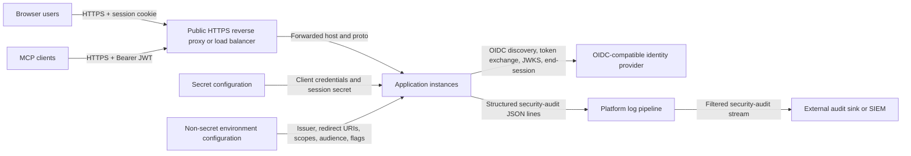

# OIDC Identity Provider Integration

This document describes the deployment contract Kravhantering expects from an
OIDC-compatible identity provider in production or pre-production environments.
For implemented browser, session, MCP-token and audit flows, see
[auth-how-it-works.md](../security-privacy/auth-how-it-works.md). For the
provider handoff checklist and request text, see
[external-idp-handoff.md](./external-idp-handoff.md).

Treat this as the target contract for a reverse-proxied, multi-instance
deployment and for the external IdP. Where this document and the current code
differ, this document should be read as target deployment intent rather than
current implementation.

## Target Production Setup

At a high level, the production-facing connections look like this:

<!-- markdownlint-disable MD013 -->

<!-- markdownlint-enable MD013 -->

- Use a separate IdP tenant or client registration for each environment:
  `dev`, `test`, and `prod`.
- Provide per-environment secret configuration for
  `AUTH_OIDC_CLIENT_ID`, `AUTH_OIDC_CLIENT_SECRET`, and
  `AUTH_SESSION_COOKIE_PASSWORD`.
- Provide the remaining auth settings through non-secret environment
  configuration:
  `AUTH_OIDC_ISSUER_URL`, `AUTH_OIDC_REDIRECT_URI`,
  `AUTH_OIDC_POST_LOGOUT_REDIRECT_URI`, `AUTH_OIDC_SCOPES`,
  `AUTH_OIDC_ROLES_CLAIM`, `AUTH_OIDC_API_AUDIENCE`,
  `AUTH_SESSION_COOKIE_NAME`, and `AUTH_SESSION_TTL_SECONDS`.
- Terminate TLS at the public reverse proxy or load balancer and set
  `AUTH_OIDC_REDIRECT_URI` and `AUTH_OIDC_POST_LOGOUT_REDIRECT_URI` to the
  public HTTPS host. CSRF origin checks in `lib/auth/csrf.ts` and
  `proxy.ts` compare only the URL origin (scheme + host + port) of
  `AUTH_OIDC_REDIRECT_URI`, not its path or query, and ignore inbound
  `X-Forwarded-*` headers. The same edge layer may also distribute traffic
  across multiple app replicas; because the session is carried in the encrypted
  cookie, the app does not require sticky sessions.
- Allow the application instances to reach the IdP over `443`.
- Pre-register the exact redirect URI and post-logout URI for every
  environment. Public hostname changes require both app configuration and IdP
  updates.
- Auth is mandatory in every build target. The insecure-issuer allowance
  is now a build-target constant that is `true` only for `dev` and `local-prod`.
  The `local-prod` target, booted via `npm run start:prodlike` on port `3001`,
  authenticates against a dedicated dev-only Keycloak client
  (`kravhantering-prodlike`) wired up in [`.env.prodlike`](../../.env.prodlike);
  see the
  [Prodlike local client](../development/auth-developer-workflow.md#prodlike-local-client-kravhantering-prodlike)
  section in the developer workflow for the full client/redirect/secret
  contract. These auth-related build-target constants, including the
  insecure-issuer allowance, are baked into the bundle when the build target is
  selected, so changing them requires rebuilding for that target. They are not
  runtime environment variables that can be toggled on a deployed instance.
- Keep the session model stateless. The app expects an encrypted cookie-based
  session, not a server-side session store, and it does not require sticky
  sessions between replicas. Browser access tokens are not stored for periodic
  introspection.
- If MCP is enabled in production, provision a separate confidential client
  for the service-to-service `client_credentials` flow and set
  `AUTH_OIDC_API_AUDIENCE` explicitly when its access-token `aud` differs from
  the browser client.

## IdP Contract

### Browser Client

- Support OIDC Authorization Code + PKCE for the browser-facing web client.
- Register the app as a confidential client with a client id and client secret.
- Expose a discovery document at the configured issuer URL. The app expects
  `/.well-known/openid-configuration` under `AUTH_OIDC_ISSUER_URL`.
- Expose authorization, token, and JWKS endpoints. An
  `end_session_endpoint` is strongly preferred so logout can also terminate
  the IdP session.
- For immediate invalidation before `accessTokenExpiresAt`, prefer standard
  OIDC front-channel logout, back-channel logout, or equivalent provider
  session notifications in production. If the production IdP cannot support
  those hooks, keep using the stateless session model and bound stale access by
  shortening token/session lifetimes instead of storing browser access tokens.
- Issue ID tokens that include the required claims:
  `sub`, `given_name`, `family_name`, and `employeeHsaId`.
- For Keycloak realms, keep the underlying user attribute named `hsaId` and
  map it to the token claim `employeeHsaId`. Newer Keycloak admin consoles
  expose that field through the realm user-profile configuration.
- Emit global role information as a JSON array of exact canonical app role
  strings: `Reviewer`, `Admin`, and `PrivacyOfficer`. The default claim name is
  `roles`. Non-array role claims and unknown values grant no global roles.
  `PrivacyOfficer` is a narrow role for privacy, archiving retention, and
  access-review handling; it does not imply `Admin`.
- Do not model authoring rights as IdP roles. The application derives
  authoring rights from area and specification assignments matched on
  `employeeHsaId`.

### MCP Service Client

- Support a separate confidential client that can obtain access tokens via
  `client_credentials`.
- Issue signed JWT access tokens that can be verified against the IdP JWKS.
  Opaque access tokens are not sufficient for the current MCP implementation.
- Ensure MCP access tokens match the configured issuer and audience.
- Include `sub` and a real-format `employeeHsaId` on every MCP access token.
  The value must match the HSA-id syntax documented in
  [hsa-id.md](../reference/hsa-id.md). If a local or prodlike token lacks the
  claim, update the Keycloak realm configuration or reset the local IdP so the
  current realm JSON is imported.
- The current MCP implementation may also consume `roles` and/or `scope`.
  If role-based behavior is needed there, emit the canonical app roles as a
  JSON array on a `roles` claim.

### Identity Semantics

- The claim name `employeeHsaId` is fixed by the application contract.
- `employeeHsaId` is treated as person-stable for the same person over time.
- Verified session name and e-mail fields may refresh the signed-in actor's
  live requirement-responsibility person row after successful mutations only
  when the signed-in actor's current HSA-id is still linked to a live
  requirement-responsibility assignment. This refresh is asynchronous
  best-effort work: it does not run in the login critical path, does not call
  HSA, and sanitized refresh failures must not fail login or the original
  mutation.
- The exact redirect URIs and post-logout URIs must be registered for each
  deployed environment.
- The IdP must be reachable from the hosting environment over TLS.

## Rollout Items

- Tenant handover, redirect-URI change process, MCP service-token approval and
  pre-production smoke verification against the real IdP belong to the
  production rollout.
- Day-2 auth credential rotation is handled by the RHEL 10 production upgrade
  and rollback guide.
