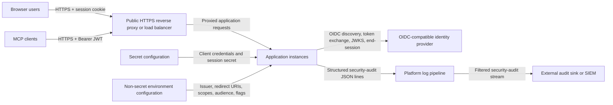

# OIDC Identity Provider Integration

This guide is for operators and identity-provider administrators configuring
Kravhantering in production or pre-production environments. It describes the
hosting requirements and OIDC client and token contracts.
For implemented browser, session, MCP-token and audit flows, see
[auth-how-it-works.md](../security-privacy/auth-how-it-works.md). For the
provider handoff checklist and request text, see
[external-idp-handoff.md](./external-idp-handoff.md).

## Self-Contained Single-Node Identity Profiles

The self-contained single-node topology requires an explicit identity-provider
choice through `IDENTITY_PROVIDER_MODE` in `release.env` and an explicit
`KRAVHANTERING_DEPLOYMENT_ENVIRONMENT` in `app.env` (`production`, `prodlike`,
or `staging`). The Quadlet `render`, `install`, and `verify-host` commands
reject missing, blank, or unsupported values before writing deployable units.
Production accepts only `external` or `hardened-bundled`; a conflicting value
in the shell or `release.env` cannot override the environment in `app.env`.

Supported profiles:

- `bundled` requires deliberate selection with `prodlike` or `staging` in
  `app.env` for QA, demos, automated tests and smoke tests. Its
  shared user and administration ingress is not sufficiently secure for
  production.
- `external` omits the bundled Keycloak service. Configure the application
  contract below against an OIDC-compatible provider selected and operated by
  the deployer.
- `hardened-bundled` is the explicit bundled-Keycloak production option. It
  separates user-facing application access from fail-closed management-only
  access and requires the complete
  [production-hardening appendix](../operations/rhel10-production-single-node-self-contained-deploy.md#appendix-c-production-hardened-bundled-keycloak).

The profile changes how the provider is hosted, not the application roles,
claims, session behavior or provider-neutral OIDC contract in this guide.

## Target Production Setup

At a high level, the production-facing connections look like this:

<!-- markdownlint-disable MD013 -->

```mermaid
flowchart LR
    Browser[Browser users]
    MCP[MCP clients]
    Proxy[Public HTTPS reverse proxy or load balancer]
    App[Application instances]
    Secret[Secret configuration]
    Config[Non-secret environment configuration]
    IdP[OIDC-compatible identity provider]
    Logs[Platform log pipeline]
    Audit[External audit sink or SIEM]

    Browser -->|HTTPS + session cookie| Proxy
    MCP -->|HTTPS + Bearer JWT| Proxy
    Proxy -->|Proxied application requests| App
    Secret -->|Client credentials and session secret| App
    Config -->|Issuer, redirect URIs, scopes, audience, flags| App
    App -->|OIDC discovery, token exchange, JWKS, end-session| IdP
    App -->|Structured security-audit JSON lines| Logs
    Logs -->|Filtered security-audit stream| Audit
```
<!-- markdownlint-enable MD013 -->

- Use a separate IdP tenant or client registration for each environment:
  `dev`, `test`, and `prod`.
- Provide per-environment secret configuration for
  `AUTH_OIDC_CLIENT_ID`, `AUTH_OIDC_CLIENT_SECRET`, and
  `AUTH_SESSION_COOKIE_PASSWORD` (at least 32 characters). All application
  replicas must share the cookie password and cookie settings.
- Inject unique production secrets before deployment. Production preflight and
  application startup reject blank values and shipped development or template
  placeholders. With bundled Keycloak, the application client secret must match
  the realm import while the MCP client uses a separate secret.
- Provide the remaining auth settings through non-secret environment
  configuration:
  `AUTH_OIDC_ISSUER_URL`, `AUTH_OIDC_REDIRECT_URI`,
  `AUTH_OIDC_POST_LOGOUT_REDIRECT_URI`, `AUTH_OIDC_SCOPES`,
  `AUTH_OIDC_ROLES_CLAIM`, `AUTH_OIDC_API_AUDIENCE`,
  `AUTH_SESSION_COOKIE_NAME`, and `AUTH_SESSION_TTL_SECONDS`.
  Secure builds automatically prefix session and derived login-state names
  with `__Host-`, preserve already-prefixed names, and require host-only
  cookies with `Secure` and `Path=/`. A name change requires fresh login and
  retry of interrupted logins; legacy cookies expire naturally. Coordinate
  all instances because older versions may still accept legacy cookies.
  See [cookie-name migration](../security-privacy/auth-how-it-works.md#cookie-name-migration).
- Terminate TLS at the public reverse proxy or load balancer and set
  `AUTH_OIDC_REDIRECT_URI` and `AUTH_OIDC_POST_LOGOUT_REDIRECT_URI` to the
  public HTTPS host. CSRF origin checks compare only the URL origin
  (scheme + host + port) of `AUTH_OIDC_REDIRECT_URI`, not its path or query,
  and ignore inbound
  `X-Forwarded-*` headers. The same edge layer may also distribute traffic
  across multiple app replicas.
- Select the deployed client-address trust model and configure only exact proxy
  CIDRs as described in
  [Access Logging and Client IP Trust](../operations/access-log-and-client-ip-trust.md).
  The application accepts only the canonical address produced by that edge.
- Allow the application instances to reach the IdP over `443`.
- Pre-register the exact redirect URI and post-logout URI for every
  environment. Public hostname changes require both app configuration and IdP
  updates.
- Authentication is mandatory. Production builds require an HTTPS issuer;
  the local development HTTP allowance cannot be enabled through runtime
  environment variables.
- Keep the session model stateless. The app expects an encrypted cookie-based
  session, not a server-side session store, and it does not require sticky
  sessions between replicas. Browser access tokens are not stored for periodic
  introspection.
- If MCP is enabled in production, provision a separate confidential client
  for the service-to-service `client_credentials` flow and set
  `MCP_CLIENT_ID` and `AUTH_MCP_REQUIRED_SCOPES`. Without `MCP_CLIENT_ID`,
  the MCP endpoint is disabled. Set `AUTH_OIDC_API_AUDIENCE` explicitly when
  the access-token `aud` differs from the browser client ID.

## IdP Contract

### Browser Client

- Support OIDC Authorization Code + PKCE for the browser-facing web client.
- Register the app as a confidential client with a client ID and client
  secret, using `client_secret_post` for token-endpoint authentication.
- Expose a discovery document at the configured issuer URL. The app expects
  `/.well-known/openid-configuration` under `AUTH_OIDC_ISSUER_URL`.
- Expose authorization, token, and JWKS endpoints. An
  `end_session_endpoint` is strongly preferred so logout can also terminate
  the IdP session.
  Verify logout both with and without `id_token_hint`: the app omits that
  hint when the ID token would exceed the session-cookie size budget.
- The app does not implement front-channel or back-channel logout receivers,
  token introspection, or browser-token refresh. IdP account or role changes
  therefore do not immediately invalidate an existing application session.
  Bound stale access with access-token and application-session lifetimes.
  Return a positive `expires_in` in the token response; the app uses a
  five-minute expiry when it is missing or invalid.
- Issue ID tokens with non-empty `sub`, `given_name`, and `family_name`, and
  `employeeHsaId` matching the [HSA-id syntax](../reference/hsa-id.md).
  Optional `email` is used only when `email_verified` is the boolean `true`.
- For Keycloak realms, keep the underlying user attribute named `hsaId` and
  map it to the token claim `employeeHsaId`. Newer Keycloak admin consoles
  expose that field through the realm user-profile configuration.
- Emit global role information as a JSON array of exact canonical app role
  strings: `Reviewer`, `Admin`, and `PrivacyOfficer`. The default claim name is
  `roles`. A non-array claim grants no global roles; unknown entries in an
  array are ignored while recognized entries are retained.
  `PrivacyOfficer` is a narrow role for privacy, archiving retention, and
  access-review handling; it does not imply `Admin`.
- Do not model authoring rights as IdP roles. The application derives
  authoring rights from area and specification assignments matched on
  `employeeHsaId`.

### MCP Service Client

- Support a separate confidential client that can obtain access tokens via
  `client_credentials`.
- Issue signed JWT access tokens that can be verified against the IdP JWKS.
  Opaque access tokens are not sufficient for the current MCP implementation.
- Set the protected access-token header type to `at+jwt` and issue tokens with
  a lifetime no greater than `AUTH_MCP_TOKEN_MAX_AGE_SECONDS` (for example,
  `300` seconds, the default). The configured maximum must be an integer
  from `60` through `900` seconds. Keep issuer and application clocks
  synchronized; validation allows 30 seconds of clock skew.
- Ensure MCP access tokens match the configured issuer and API audience and
  emit a top-level `client_id` equal to `MCP_CLIENT_ID`. `azp` is not accepted
  as a substitute and, if present, must also equal `MCP_CLIENT_ID`.
- Include numeric `exp` and `iat`, a non-empty `sub`, and a real-format
  `employeeHsaId` on every MCP access token.
  The value must match the HSA-id syntax documented in
  [hsa-id.md](../reference/hsa-id.md).
- Assign the `kravhantering:mcp` client scope and emit it in the standard
  top-level, space-separated `scope` string. Every scope configured in
  `AUTH_MCP_REQUIRED_SCOPES` is mandatory.
- Emit canonical application roles as a JSON array in the claim configured by
  `AUTH_MCP_ROLES_CLAIM` (default `roles`). Missing or empty arrays grant no
  roles. Malformed, duplicate, or unknown entries make the entire claim grant
  no roles.
- Do not issue browser or ID-token-shaped credentials to this integration.

### Identity Semantics

- The claim name `employeeHsaId` is fixed by the application contract.
- `employeeHsaId` is treated as person-stable for the same person over time.

## Rollout Items

- Tenant handover, redirect-URI change process, MCP service-token approval and
  pre-production smoke verification against the real IdP belong to the
  production rollout.
- Day-2 auth credential rotation is handled by the RHEL 10 production upgrade
  and rollback [guide](../operations/rhel10-production-upgrade.md).
