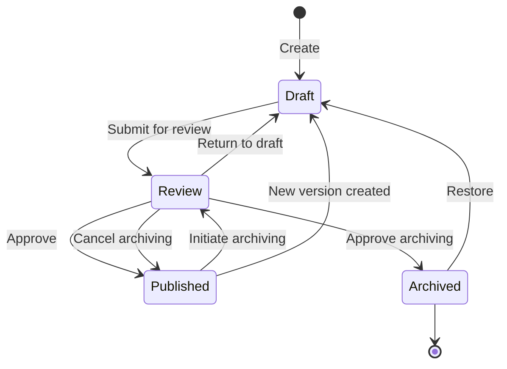
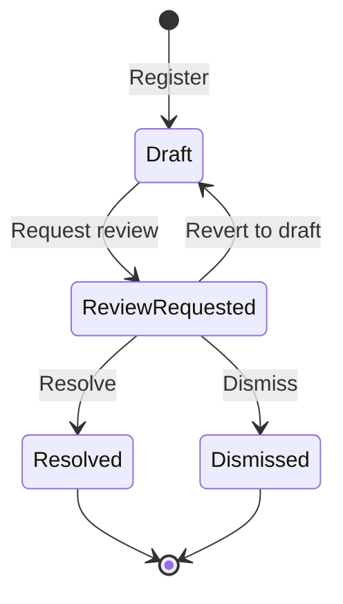
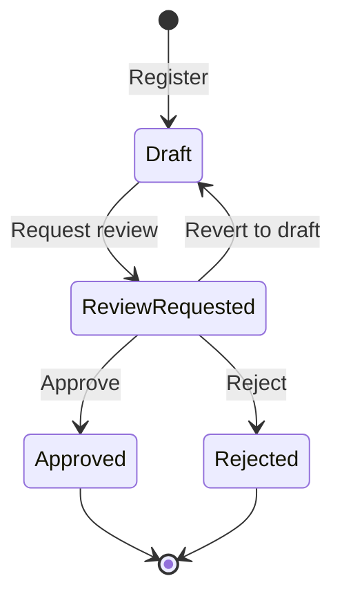

# Lifecycle Workflows

## Requirement Version Lifecycle

Requirement versions follow a controlled lifecycle
enforced by `requirement_status_transitions`:

- **Draft:** Initial state. The requirement is being
  authored or revised. Saving an edit requires the latest version's
  `id` as `baseVersionId` and opaque `revisionToken` as
  `baseRevisionToken`; stale draft saves are rejected instead of
  overwriting newer content.
- **Review:** The requirement is under review. This state
  is used both for publishing review (Draft → Review) and
  archiving review (Published → Review). The system
  distinguishes the two contexts via the
  `archive_initiated_at` flag on the version row.
- **Published:** The requirement is approved and active.
  `published_at` is set. When a new version is published,
  the previously published version is automatically
  archived with `archived_at` set to the same timestamp.
- **Archived:** The requirement is retired or superseded.
  `archived_at` is set.

When a published requirement needs changes, a **new
version** is created in Draft status while the previous
Published version remains active until the new version is
published. This re-enters the workflow at Draft, going
through Review and Published again before replacing the
earlier version.

If an archived version is restored, it always starts at
Draft regardless of the Published status it had prior to
being archived, and must go through the full
Review → Published cycle again.

### Two-Step Archiving

Archiving a published requirement is a two-step review
process — it cannot be archived directly:

1. **Initiate archiving** (`initiateArchiving`) — moves
   the published version from Published to Review and
   sets `archive_initiated_at`. This is blocked if the
   requirement already has a newer Draft or Review version.
2. **Approve archiving** (`approveArchiving`) — moves the
   version from Review to Archived, sets `archived_at`,
   clears `archive_initiated_at`, and marks
   `requirements.is_archived = true`. This operates **only
   on the single version that has `archive_initiated_at`
   set** (the formerly-published version). A newer Draft
   or Review version that may exist for the same
   requirement is never the target and can never be
   archived through this flow.
3. **Cancel archiving** (`cancelArchiving`) — returns the
   version to Published, clears `archive_initiated_at`.
   The original `published_at` is preserved. Like
   `approveArchiving`, this targets only the version with
   `archive_initiated_at` set; a newer Draft or Review
   version is never affected.

All three operations run inside a single `SERIALIZABLE`
transaction with locked precondition reads and conditional
writes, so concurrent archiving attempts on the same
requirement are serialized: at most one succeeds and the
others fail with a conflict error.

While a version is in archiving review (status = Review
*and* `archive_initiated_at` is set), the UI surfaces a
distinct status badge label —
**"Arkiveringsgranskning" / "Archiving Review"** — to
disambiguate it from publication review. The DB row is
unchanged (`requirement_status_id` is still 2 and
`requirement_statuses.name_sv` is still "Granskning"); the
override is presentation-only and lives in
[`lib/requirements/status-label.ts`](../lib/requirements/status-label.ts).
See [UI status labels](#ui-status-labels) below.

See `version-lifecycle-dates.md` for detailed timestamp
rules.

## UI status labels

The status badge in the requirements list, the version
history sidebar, and other UI surfaces derives its label
from a requirement-level effective status combined with
`requirement_versions.archive_initiated_at` (relevant for
Review only). For the requirements list view the effective
status is computed server-side by `EFFECTIVE_STATUS_SQL` in
[`lib/dal/requirements.ts`](../lib/dal/requirements.ts),
which consolidates each requirement's
`requirement_versions.requirement_status_id` rows into a
single status; for the version history sidebar each row's
own `requirement_status_id` is used directly. In both cases
the displayed row's `archive_initiated_at` is what
distinguishes "Granskning" from "Arkiveringsgranskning":

<!-- markdownlint-disable MD013 -->

| UI label (sv / en) | `requirement_status_id` | Extra predicate | DB `requirement_statuses.name_sv` / `name_en` |
| --- | --- | --- | --- |
| Utkast / Draft | 1 (`STATUS_DRAFT`) | — | Utkast / Draft |
| Granskning / Review | 2 (`STATUS_REVIEW`) | `archive_initiated_at IS NULL` | Granskning / Review |
| Arkiveringsgranskning / Archiving Review | 2 (`STATUS_REVIEW`) | `archive_initiated_at IS NOT NULL` | Granskning / Review (UI overrides label only) |
| Publicerad / Published | 3 (`STATUS_PUBLISHED`) | — | Publicerad / Published |
| Arkiverad / Archived | 4 (`STATUS_ARCHIVED`) | — | Arkiverad / Archived |

<!-- markdownlint-enable MD013 -->

"Arkiveringsgranskning" is a **presentation-only override**:
the DB row still stores `requirement_status_id = 2` and
`requirement_statuses.name_sv = 'Granskning'`, and API/MCP
responses still return `status: 2`,
`statusNameSv: 'Granskning'`, plus the raw
`archiveInitiatedAt` field. The override happens in
[`lib/requirements/status-label.ts`](../lib/requirements/status-label.ts)
(consumed by `RequirementsTable` and `VersionHistory`) and is
mirrored by the `isArchiving` prop on `StatusStepper`, which
re-labels the middle chevron in the archiving variant
(Publicerad → Granskning → Arkiverad) to
"Arkiveringsgranskning" / "Archiving Review". The badge and
chevron color stay yellow because the underlying status is
still Review.

## Improvement Suggestion Lifecycle

Improvement suggestions (change proposals, comments) linked to
a requirement follow a separate lifecycle:

- **Draft:** Initial state. The suggestion can be edited or
  deleted. `review_requested_at` is null.
- **Review Requested:** Submitted for assessment.
  `review_requested_at` is set. Can be reverted to draft.
- **Resolved:** The suggestion has been addressed.
  `resolution` = 1, `resolved_at` and `resolved_by` are
  set.
- **Dismissed:** The suggestion was evaluated but not acted
  on. `resolution` = 2, `resolved_at` and `resolved_by`
  are set.

## Deviation Lifecycle

Deviations are linked to requirements specification items
(`requirements_specification_items`). They record a request to
deviate from a requirement within a specific specification. A
single specification item can have multiple deviations over
time.

- **Draft:** Initial state. The deviation can be edited
  or deleted. `is_review_requested` = 0, `decision` is
  null.
- **Review Requested:** Submitted for decision.
  `is_review_requested` = 1. Can be reverted to draft.
- **Approved:** The deviation has been accepted.
  `decision` = 1, `decided_at` and `decided_by` are set.
- **Rejected:** The deviation has been denied.
  `decision` = 2, `decided_at` and `decided_by` are set.

Approved and Rejected are terminal states — a decided
deviation cannot be edited, deleted, or reopened.

### Deviation Effect on Specification Item Status

Approving a deviation does **not** automatically change
the specification item status. To mark the item as deviated,
the user must manually set the specification item status to
"Deviated" (see below). This is only allowed when at
least one approved deviation exists for the item.

## Specification Item Status

When a requirement is included in a requirements specification
it becomes a **specification item** with a manually managed
status. There is no enforced state machine — users can
set any status at any time, with one exception.

<!-- markdownlint-disable MD013 -->
| ID | Swedish | English | Color | Description |
| -- | -------------- | -------------- | ------- | ------------------------------------------- |
| 1 | Inkluderad | Included | #94a3b8 | Default. No work started. |
| 2 | Pågående | In Progress | #f59e0b | Implementation underway. |
| 3 | Implementerad | Implemented | #3b82f6 | Requirement implemented. |
| 4 | Verifierad | Verified | #22c55e | Verified and tested. |
| 5 | Avviken | Deviated | #ef4444 | Approved deviation exists. |
| 6 | Ej tillämpbar | Not Applicable | #6b7280 | Not applicable in this context. |
<!-- markdownlint-enable MD013 -->

- Every new specification item starts with status **Included**
  (1).
- Status changes are recorded with a `status_updated_at`
  timestamp.
- **Guard rule:** The **Deviated** (5) status can only be
  set when the specification item has at least one approved
  deviation. The system rejects the update otherwise.
- Creating or approving a deviation does **not**
  automatically update the specification item status.

### Deviation-in-Specification Process

The end-to-end process for handling deviations within a
requirements specification:

1. A specification item exists in the specification (status defaults
   to Included).
2. The user registers a deviation on the item, providing
   a motivation.
3. The deviation goes through
   Draft → Review Requested → Approved or Rejected.
4. If approved, the user may set the specification item status
   to **Deviated**. The system validates that an approved
   deviation exists before allowing this.
5. If rejected, the specification item status remains
   unchanged and the user may register a new deviation.
6. A specification item can accumulate multiple deviations for
   historical tracking.
7. Deviations are cascade-deleted when the specification item
   is removed from the specification.

---
