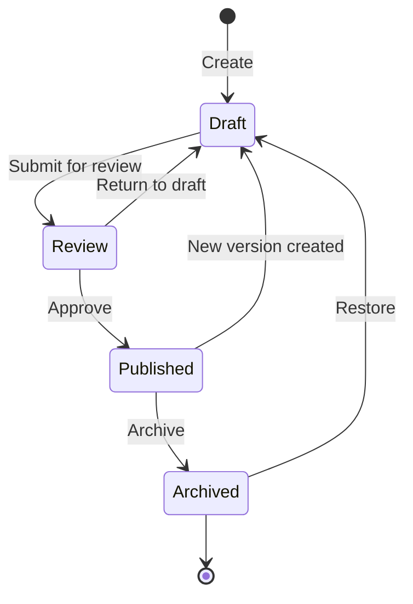

# Lifecycle Workflow

Requirement versions follow a controlled lifecycle enforced by `requirement_status_transitions`:

- **Draft:** Initial state. The requirement is being authored or revised.
- **Review:** The requirement is under review by stakeholders.
- **Published:** The requirement is approved and active. `published_at` is set.
- **Archived:** The requirement is retired/superseded. `archived_at` is set.

When a published requirement needs changes, a **new version**
is created in Draft status while the previous Published
version remains active until the new version is published.
This re-enters the workflow at Draft, going through Review
and Published again before replacing the earlier version.

If an archived version is restored, it always starts at
Draft regardless of the Published status it had prior to
being archived, and must go through the full
Review → Published cycle again.

---
