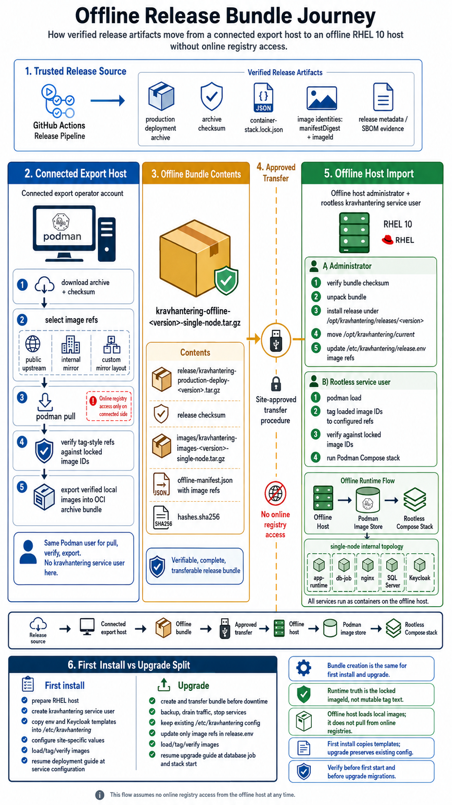

# RHEL 10 Production Disconnected Deployment And Upgrade

<!-- cSpell:words coreutils fLO readlink resolv -->

This guide describes how to prepare and import disconnected release artifacts
for the enterprise RHEL 10 production topology, where each app node runs nginx
and `app-runtime` while SQL Server and the IdP are external services.

Use this guide before starting a first install in a disconnected environment
with [rhel10-production-deploy.md](./rhel10-production-deploy.md), or before
the downtime window for a disconnected planned upgrade with
[rhel10-production-upgrade.md](./rhel10-production-upgrade.md).

The connected export host prepares one app-node disconnected bundle per
release. Use the same bundle on every disconnected app node for that release.



## Connected Export Host

The connected export host only prepares transferable artifacts. Do not create
the `kravhantering` service user there, and do not create production
`/opt/kravhantering` or `/etc/kravhantering` directories there.

The export host needs:

- outbound access to the approved release repository
- outbound access to the approved image registry or mirror
- `podman`, `tar`, `gzip`, `coreutils`, `jq` and `curl`
- one operator account that runs all `podman pull`, verify and export commands

Podman image storage is per user. Pull, verify and export images with the same
connected-host account.

### Create The Disconnected Bundle

Set the release version and download source:

```bash
VERSION=1.2.3 # Change to the version being deployed.
TOPOLOGY=app-node

# Default: internal release repository.
RELEASE_DOWNLOAD_URL="https://release.example.internal/kravhantering/${VERSION}"

# Opt-in: official GitHub release.
# RELEASE_DOWNLOAD_URL="https://github.com/viscalyx/Kravhantering/releases/download/v${VERSION}"

OFFLINE_ROOT="/tmp/kravhantering-offline-${VERSION}-${TOPOLOGY}"
OFFLINE_WORK="/tmp/kravhantering-offline-work-${VERSION}-${TOPOLOGY}"
OFFLINE_BUNDLE="${OFFLINE_ROOT}.tar.gz"
RELEASE_ARCHIVE="kravhantering-production-deploy-${VERSION}.tar.gz"
IMAGE_BUNDLE_NAME="kravhantering-images-${VERSION}-${TOPOLOGY}.tar.gz"

# Start from a clean staging area for this version and topology.
rm -rf -- "$OFFLINE_ROOT" "$OFFLINE_WORK"
mkdir -p "$OFFLINE_ROOT/release" "$OFFLINE_ROOT/images" "$OFFLINE_WORK"
cd "$OFFLINE_ROOT/release"

curl -fLO "${RELEASE_DOWNLOAD_URL}/${RELEASE_ARCHIVE}"
curl -fLO "${RELEASE_DOWNLOAD_URL}/${RELEASE_ARCHIVE}.sha256"
sha256sum -c "${RELEASE_ARCHIVE}.sha256"

tar -xzf "$RELEASE_ARCHIVE" -C "$OFFLINE_WORK" --strip-components=1
cp "$OFFLINE_WORK/env/release.env.template" "$OFFLINE_ROOT/release.env"
```

Set image refs in the staging `release.env` before pulling images. Choose
exactly one of alternatives A, B or C, depending on the repository layout the
connected export host can pull from. Keep tag refs for disconnected import
unless the target Podman hosts can resolve loaded `image:tag@sha256:digest`
refs locally without registry access.

#### Alternative A: Public Upstream Refs

Use this when the connected export host is approved to pull public upstream
refs directly. Derive refs from the release lock:

```bash
update_ref() {
  sed -i "s#^${1}=.*#${1}=${2}#" "$OFFLINE_ROOT/release.env"
}

LOCK_FILE="$OFFLINE_WORK/container-stack.lock.json"
service_image() {
  jq -r --arg name "$1" \
    '.services[] | select(.name == $name) | .image' "$LOCK_FILE"
}
service_tag() {
  jq -r --arg name "$1" \
    '.services[] | select(.name == $name) | .tag' "$LOCK_FILE"
}
service_ref() {
  printf '%s:%s\n' "$(service_image "$1")" "$(service_tag "$1")"
}

update_ref APP_RUNTIME_IMAGE_REF \
  "$(service_ref app-runtime)"
update_ref DB_JOB_IMAGE_REF \
  "$(service_ref db-job)"
update_ref NGINX_IMAGE_REF \
  "$(service_ref nginx)"
```

#### Alternative B: Internal Mirror With Preserved Paths

Use this when the connected export host pulls from an internal mirror that
preserves repository paths. Rewrite only the registry host:

```bash
TARGET_IMAGE_REGISTRY=registry.example.internal
LOCK_FILE="$OFFLINE_WORK/container-stack.lock.json"
service_image() {
  jq -r --arg name "$1" \
    '.services[] | select(.name == $name) | .image' "$LOCK_FILE"
}
service_tag() {
  jq -r --arg name "$1" \
    '.services[] | select(.name == $name) | .tag' "$LOCK_FILE"
}
mirror_ref() {
  local image
  image="$(service_image "$1")"
  printf '%s/%s:%s\n' \
    "$TARGET_IMAGE_REGISTRY" "${image#*/}" "$(service_tag "$1")"
}

update_ref APP_RUNTIME_IMAGE_REF \
  "$(mirror_ref app-runtime)"
update_ref DB_JOB_IMAGE_REF \
  "$(mirror_ref db-job)"
update_ref NGINX_IMAGE_REF \
  "$(mirror_ref nginx)"
```

#### Alternative C: Custom Repository Layout

Use this when the connected export host pulls from an internal mirror with a
custom repository layout. Edit the three `*_IMAGE_REF` values in
`$OFFLINE_ROOT/release.env` manually before continuing.

### Pull, Verify And Export Images

After completing exactly one image-ref alternative above, pull, verify and
export the images with the same connected-host account. Do not prefix the
helper commands with `sudo`; they must use the same Podman image store as the
pull commands. The `bash` invocation also works when `/tmp` is mounted
`noexec`:

```bash
set -a
. "$OFFLINE_ROOT/release.env"
set +a

podman pull "$APP_RUNTIME_IMAGE_REF"
podman pull "$DB_JOB_IMAGE_REF"
podman pull "$NGINX_IMAGE_REF"

bash "$OFFLINE_WORK/bin/kravhantering-images.sh" --topology app-node \
  --lock-file "$OFFLINE_WORK/container-stack.lock.json" \
  --env-file "$OFFLINE_ROOT/release.env" \
  verify

bash "$OFFLINE_WORK/bin/kravhantering-images.sh" --topology app-node \
  --lock-file "$OFFLINE_WORK/container-stack.lock.json" \
  --env-file "$OFFLINE_ROOT/release.env" \
  export --output "$OFFLINE_ROOT/images/$IMAGE_BUNDLE_NAME"
```

Write the bundle manifest, checksums and movable bundle:

```bash
jq -n \
  --arg version "$VERSION" \
  --arg topology "$TOPOLOGY" \
  --arg releaseArchive "release/$RELEASE_ARCHIVE" \
  --arg releaseChecksum "release/${RELEASE_ARCHIVE}.sha256" \
  --arg imageBundle "images/$IMAGE_BUNDLE_NAME" \
  --arg appRuntime "$APP_RUNTIME_IMAGE_REF" \
  --arg dbJob "$DB_JOB_IMAGE_REF" \
  --arg nginx "$NGINX_IMAGE_REF" \
  '{
    schemaVersion: 1,
    kind: "kravhantering-offline-bundle",
    version: $version,
    topology: $topology,
    releaseArchive: $releaseArchive,
    releaseChecksum: $releaseChecksum,
    imageBundle: $imageBundle,
    imageRefs: {
      "app-runtime": $appRuntime,
      "db-job": $dbJob,
      nginx: $nginx
    }
  }' > "$OFFLINE_ROOT/offline-manifest.json"

(
  cd "$OFFLINE_ROOT"
  sha256sum offline-manifest.json \
    "release/$RELEASE_ARCHIVE" \
    "release/${RELEASE_ARCHIVE}.sha256" \
    "images/$IMAGE_BUNDLE_NAME" \
    > hashes.sha256
)

tar -czf "$OFFLINE_BUNDLE" \
  -C "$(dirname "$OFFLINE_ROOT")" "$(basename "$OFFLINE_ROOT")"
(
  cd "$(dirname "$OFFLINE_BUNDLE")"
  sha256sum "$(basename "$OFFLINE_BUNDLE")" \
    > "$(basename "$OFFLINE_BUNDLE").sha256"
)
```

Optional: after the `.tar.gz` and `.sha256` files exist, remove the staging
directories to reclaim `/tmp` space on the connected export host. Keep
`$OFFLINE_BUNDLE` and `${OFFLINE_BUNDLE}.sha256`; those are the files to
transfer:

```bash
test -f "$OFFLINE_BUNDLE"
test -f "${OFFLINE_BUNDLE}.sha256"
rm -rf -- "$OFFLINE_ROOT" "$OFFLINE_WORK"
```

Transfer `$OFFLINE_BUNDLE` and `${OFFLINE_BUNDLE}.sha256` to `/tmp` on every
disconnected app node with the site's approved transfer procedure.

## First Install Import

Before importing, complete
[Prepare RHEL 10 Host](./rhel10-production-deploy.md#prepare-rhel-10-host) on
the disconnected app node. Do not run the regular guide's connected release
download, extraction or image-pull steps.

Unpack and verify the disconnected bundle:

```bash
VERSION=1.2.3 # Change to the version being deployed.
TOPOLOGY=app-node
OFFLINE_BUNDLE="/tmp/kravhantering-offline-${VERSION}-${TOPOLOGY}.tar.gz"
OFFLINE_ROOT="/tmp/kravhantering-offline-${VERSION}-${TOPOLOGY}"
RELEASE_ARCHIVE="kravhantering-production-deploy-${VERSION}.tar.gz"
IMAGE_BUNDLE_NAME="kravhantering-images-${VERSION}-${TOPOLOGY}.tar.gz"

# Start from a clean staging area for this version and topology.
rm -rf -- "$OFFLINE_ROOT"
mkdir -p "$OFFLINE_ROOT"
(
  cd "$(dirname "$OFFLINE_BUNDLE")"
  sha256sum -c "$(basename "$OFFLINE_BUNDLE").sha256"
)
tar -xzf "$OFFLINE_BUNDLE" -C "$OFFLINE_ROOT" --strip-components=1
(cd "$OFFLINE_ROOT" && sha256sum -c hashes.sha256)
(cd "$OFFLINE_ROOT/release" && sha256sum -c "${RELEASE_ARCHIVE}.sha256")
```

Prepare the release directory without switching `current`:

```bash
test ! -e "/opt/kravhantering/releases/${VERSION}" || {
  echo "Release directory already exists:" \
    "/opt/kravhantering/releases/${VERSION}" >&2
  exit 1
}

sudo install -d -o root -g root -m 0755 \
  "/opt/kravhantering/releases/${VERSION}"
sudo tar -xzf "$OFFLINE_ROOT/release/$RELEASE_ARCHIVE" \
  -C "/opt/kravhantering/releases/${VERSION}" \
  --strip-components=1
sudo chcon -R -t container_file_t \
  "/opt/kravhantering/releases/${VERSION}/nginx"
```

Review the imported release before handoff:

```bash
less "/opt/kravhantering/releases/${VERSION}/DEPLOYMENT-MANIFEST.json"
less "/opt/kravhantering/releases/${VERSION}/container-stack.lock.json"
less "$OFFLINE_ROOT/offline-manifest.json"
```

Create a temporary image-ref env from the disconnected manifest. This file is
only for loading and verifying images before the regular deployment guide
copies `/etc/kravhantering/release.env`. By default it preserves the source refs
recorded in the bundle manifest. Set `TARGET_IMAGE_REGISTRY` before running the
block if the disconnected host should use a local or non-resolvable registry
hostname:

```bash
TARGET_IMAGE_REGISTRY="${TARGET_IMAGE_REGISTRY:-}"
MANIFEST="$OFFLINE_ROOT/offline-manifest.json"
IMAGE_ENV="$OFFLINE_ROOT/disconnected-release.env"

source_ref() {
  jq -r --arg name "$1" '.imageRefs[$name]' "$MANIFEST"
}
target_ref() {
  local ref path tag
  ref="$(source_ref "$1")"
  if [ -z "$TARGET_IMAGE_REGISTRY" ]; then
    printf '%s\n' "$ref"
    return
  fi
  tag="${ref##*:}"
  path="${ref%:*}"
  printf '%s/%s:%s\n' "$TARGET_IMAGE_REGISTRY" "${path#*/}" "$tag"
}

{
  printf 'APP_RUNTIME_IMAGE_REF=%s\n' "$(target_ref app-runtime)"
  printf 'DB_JOB_IMAGE_REF=%s\n' "$(target_ref db-job)"
  printf 'NGINX_IMAGE_REF=%s\n' "$(target_ref nginx)"
} > "$IMAGE_ENV"
sudo chgrp kravhantering "$IMAGE_ENV"
chmod 0640 "$IMAGE_ENV"
```

Load, tag and verify the images from the prepared release directory as the
rootless service user:

```bash
sudo -iu kravhantering
VERSION=1.2.3 # Change to the version being deployed.
TOPOLOGY=app-node
OFFLINE_ROOT="/tmp/kravhantering-offline-${VERSION}-${TOPOLOGY}"
IMAGE_BUNDLE_NAME="kravhantering-images-${VERSION}-${TOPOLOGY}.tar.gz"
RELEASE_DIR="/opt/kravhantering/releases/${VERSION}"
IMAGE_ENV="$OFFLINE_ROOT/disconnected-release.env"

cd "$RELEASE_DIR"
bin/kravhantering-images.sh --topology app-node \
  --lock-file container-stack.lock.json \
  --env-file "$IMAGE_ENV" \
  load --bundle "$OFFLINE_ROOT/images/$IMAGE_BUNDLE_NAME"
exit
```

Resume the regular deployment guide at
[Activate the Release](./rhel10-production-deploy.md#activate-the-release).
Use the disconnected handoff notes there: activate
`/opt/kravhantering/current`, copy first-install templates, apply image refs
from `offline-manifest.json`, verify the already loaded images, and then
continue with the normal site-specific configuration.

## Upgrade Import

Create and transfer the disconnected bundle before the downtime window. During
the window, follow the regular upgrade guide for backup, traffic drain and
service stop. Then use this section instead of the connected artifact download,
extraction and image-pull steps.

Unpack and verify the disconnected bundle on every disconnected app node:

```bash
VERSION=1.2.4 # Change to the version being deployed.
TOPOLOGY=app-node
OFFLINE_BUNDLE="/tmp/kravhantering-offline-${VERSION}-${TOPOLOGY}.tar.gz"
OFFLINE_ROOT="/tmp/kravhantering-offline-${VERSION}-${TOPOLOGY}"
RELEASE_ARCHIVE="kravhantering-production-deploy-${VERSION}.tar.gz"
IMAGE_BUNDLE_NAME="kravhantering-images-${VERSION}-${TOPOLOGY}.tar.gz"

# Start from a clean staging area for this version and topology.
rm -rf -- "$OFFLINE_ROOT"
mkdir -p "$OFFLINE_ROOT"
(
  cd "$(dirname "$OFFLINE_BUNDLE")"
  sha256sum -c "$(basename "$OFFLINE_BUNDLE").sha256"
)
tar -xzf "$OFFLINE_BUNDLE" -C "$OFFLINE_ROOT" --strip-components=1
(cd "$OFFLINE_ROOT" && sha256sum -c hashes.sha256)
(cd "$OFFLINE_ROOT/release" && sha256sum -c "${RELEASE_ARCHIVE}.sha256")
```

Prepare the target release directory without switching `current`:

```bash
test ! -e "/opt/kravhantering/releases/${VERSION}" || {
  echo "Release directory already exists:" \
    "/opt/kravhantering/releases/${VERSION}" >&2
  exit 1
}

sudo install -d -o root -g root -m 0755 \
  "/opt/kravhantering/releases/${VERSION}"
sudo tar -xzf "$OFFLINE_ROOT/release/$RELEASE_ARCHIVE" \
  -C "/opt/kravhantering/releases/${VERSION}" \
  --strip-components=1
sudo chcon -R -t container_file_t \
  "/opt/kravhantering/releases/${VERSION}/nginx"
```

Review the imported release before handoff:

```bash
less "/opt/kravhantering/releases/${VERSION}/DEPLOYMENT-MANIFEST.json"
less "/opt/kravhantering/releases/${VERSION}/container-stack.lock.json"
less "$OFFLINE_ROOT/offline-manifest.json"
```

Create a temporary image-ref env from the disconnected manifest. The regular
upgrade guide later applies the same refs to
`/etc/kravhantering/release.env` after it switches `current`:

```bash
TARGET_IMAGE_REGISTRY="${TARGET_IMAGE_REGISTRY:-}"
MANIFEST="$OFFLINE_ROOT/offline-manifest.json"
IMAGE_ENV="$OFFLINE_ROOT/disconnected-release.env"

source_ref() {
  jq -r --arg name "$1" '.imageRefs[$name]' "$MANIFEST"
}
target_ref() {
  local ref path tag
  ref="$(source_ref "$1")"
  if [ -z "$TARGET_IMAGE_REGISTRY" ]; then
    printf '%s\n' "$ref"
    return
  fi
  tag="${ref##*:}"
  path="${ref%:*}"
  printf '%s/%s:%s\n' "$TARGET_IMAGE_REGISTRY" "${path#*/}" "$tag"
}

{
  printf 'APP_RUNTIME_IMAGE_REF=%s\n' "$(target_ref app-runtime)"
  printf 'DB_JOB_IMAGE_REF=%s\n' "$(target_ref db-job)"
  printf 'NGINX_IMAGE_REF=%s\n' "$(target_ref nginx)"
} > "$IMAGE_ENV"
sudo chgrp kravhantering "$IMAGE_ENV"
chmod 0640 "$IMAGE_ENV"
```

Load, tag and verify the images from the prepared release directory as the
rootless service user:

```bash
sudo -iu kravhantering
VERSION=1.2.4 # Change to the version being deployed.
TOPOLOGY=app-node
OFFLINE_ROOT="/tmp/kravhantering-offline-${VERSION}-${TOPOLOGY}"
IMAGE_BUNDLE_NAME="kravhantering-images-${VERSION}-${TOPOLOGY}.tar.gz"
RELEASE_DIR="/opt/kravhantering/releases/${VERSION}"
IMAGE_ENV="$OFFLINE_ROOT/disconnected-release.env"

cd "$RELEASE_DIR"
bin/kravhantering-images.sh --topology app-node \
  --lock-file container-stack.lock.json \
  --env-file "$IMAGE_ENV" \
  load --bundle "$OFFLINE_ROOT/images/$IMAGE_BUNDLE_NAME"
exit
```

Resume the regular upgrade guide at step 6 in
[Planned-Downtime Upgrade](./rhel10-production-upgrade.md#planned-downtime-upgrade).
In step 7, choose the disconnected image-reference path that reads
`offline-manifest.json`; the images are already loaded, so run verification
without pulling from a registry. Then run the database job sequence once for
the release and start each app node with the regular upgrade guide.
