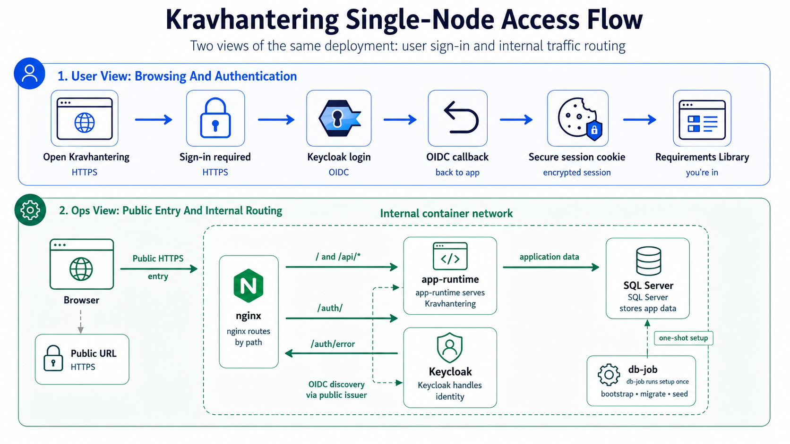

# RHEL 10 Self-Contained Single-Node Deployment From Release Artifacts

<!-- cSpell:words coreutils datawriter firewalld fullchain nameserver privkey -->
<!-- cSpell:words resolv -->
<!-- cSpell:words readlink -->
<!-- cSpell:words ipv4 -->
<!-- cSpell:words serverAuth subjectAltName -->
<!-- cSpell:words authorityKeyIdentifier basicConstraints cRLSign genpkey -->
<!-- cSpell:words keyCertSign pathlen subjectKeyIdentifier -->
<!-- cSpell:words Mountpoint -->
<!-- cSpell:words fcontext graphroot restorecon semanage tempdb -->
<!-- cSpell:words invalid_client_credentials -->
<!-- cSpell:words fromjson mktemp println tojson userprofile -->

This guide describes how to install and operate Kravhantering on one clean
Red Hat Enterprise Linux 10 host from released artifacts only, with nginx,
`app-runtime`, SQL Server and Keycloak as rootless Podman Quadlet services.
`db-job` runs explicitly on the database Quadlet network for release
operations.

>[!WARNING]
>The default bundled Keycloak profile is intentionally easy to operate for
>quality assurance, demos, automated testing, prod-like validation and smoke
>tests. It is not sufficiently secure for production. Do not use bundled
>Keycloak in production unless `IDENTITY_PROVIDER_MODE=hardened-bundled` and
>all controls in [Appendix C](#appendix-c-production-hardened-bundled-keycloak)
>are implemented and verified.

Apply the shared containment defaults, validated override ranges, network
ownership, and host preflight in
[Production Quadlet Containment](production-quadlet-containment.md).

Use this topology when the production site must run without external SQL Server
or external IdP dependencies at runtime. For the enterprise topology with
external SQL Server and external IdP, use
[rhel10-production-deploy.md](./rhel10-production-deploy.md).
For upgrades and rollback, use
[rhel10-production-single-node-self-contained-upgrade.md](./rhel10-production-single-node-self-contained-upgrade.md).
To uninstall a first install of this topology, use
[rhel10-production-single-node-self-contained-uninstall.md](./rhel10-production-single-node-self-contained-uninstall.md).

>[!IMPORTANT]
>For disconnected deployment, first follow
>[rhel10-production-single-node-self-contained-disconnected.md](./rhel10-production-single-node-self-contained-disconnected.md).
>The disconnected guide prepares the transferable bundle, imports the release
>directory and images on the disconnected host, and tells you where to resume
>these regular deployment steps.

## Choose the Identity Provider Profile

Record exactly one choice in `/etc/kravhantering/release.env`. Omitting the
setting preserves `bundled`, the existing default.

<!-- markdownlint-disable MD013 -->
| `IDENTITY_PROVIDER_MODE` | Intended use | Bundled Keycloak | Required action |
| --- | --- | --- | --- |
| `bundled` | QA, demos, automated testing, prod-like validation and smoke tests | Installed with the permissive `/auth/` proxy | Do not use for production. Disposable bootstrap credentials may remain only in these non-production environments. |
| `external` | Production or pre-production with a deployer-selected OIDC-compatible provider | Not installed or required | Configure the external issuer, client, redirects, logout, claims and trust in `app.env`. The deployer operates and secures the provider. |
| `hardened-bundled` | Explicitly approved production use of bundled Keycloak | Installed with separated user-facing and mTLS management ingress | Complete and verify Appendix C before serving users. |
<!-- markdownlint-enable MD013 -->

The mode controls rendered services as well as image verification. In
`external` mode the single-node host still provides nginx, `app-runtime` and
SQL Server, but it renders no Keycloak container, Keycloak volume or identity
network and does not require `KEYCLOAK_IMAGE_REF`.



## Release Inputs

The internal release repository must provide these files from the same release:

- `kravhantering-production-deploy-<version>.tar.gz`
- `kravhantering-production-deploy-<version>.tar.gz.sha256`
- `kravhantering-production-deploy-<version>.tar.gz.sigstore.json`
- `kravhantering-production-deploy-<version>.tar.gz.trusted-root.jsonl`
- `container-stack.lock.json`
- `public/build.json`
- `release-metadata.json`
- SBOM files for `app-runtime` and `db-job`

The site must provide approved runtime image refs for:

- `app-runtime`
- `db-job`
- nginx
- SQL Server
- Keycloak (`bundled` and `hardened-bundled` profiles only)

The optional `single-node-demo` test support overlay adds Kong, the HSA person
lookup adapter and the HSA directory mock from
`container-hsa-integration-support.lock.json` and
`container-test-support.lock.json`. That overlay is only for disposable demo or
release-test environments and must not be used for production.

The GitHub Release notes can also list `kravhantering-demo-seed` under
Demonstration Container Images. That image is a separate opt-in image for
destructive demo seeding in disposable environments. It is not part of
`container-stack.lock.json`, `release.env.template`, or the production
deployment bundle.

Use tag-style `image:tag` values by default, pointing at public upstream
registries or an internal registry mirror. Each configured ref must resolve to
the locked `imageId` in `container-stack.lock.json` when inspected with Podman.
For third-party images, prefer release-specific internal mirror tags instead
of moving public tags such as `stable-alpine` or `2025-latest`. The helper also
accepts `image:tag@sha256:digest` when a site explicitly requires pull-time
digest pinning. The lock file, not the tag text, is the source of truth;
`bin/kravhantering-images.sh verify` fails if a ref now resolves to another
image ID.

## Configuration BoM (Bill of Materials)

Before editing templates, record these site values. The table separates values
that must be planned from defaults or derived values that usually only need
verification.

Rows that reference `keycloak.env`, the Keycloak realm JSON, Keycloak
administrators or the identity-network resolver apply only to `bundled` and
`hardened-bundled`. In `external` mode, record the equivalent client and claim
contract with the external provider owner instead.

<!-- markdownlint-disable MD013 -->
| Name | Applies to | Default / derived value | Plan or record when |
| --- | --- | --- | --- |
| `VERSION` | Release artifact names | No default | Always record the release version to install, for example `1.2.3`. |
| `IDENTITY_PROVIDER_MODE` | Single-node rendered services and nginx identity ingress | `bundled` | Always record the approved choice: `bundled`, `external` or `hardened-bundled`. Production may use only `external` or the fully verified `hardened-bundled` option. |
| `KEYCLOAK_MANAGEMENT_HTTPS_BIND` | Hardened bundled Keycloak management-only listener | No default | Required only for `hardened-bundled`; use an explicit host IPv4 and mapping to container port `9443`, for example `10.20.30.40:9443:9443`. Wildcard and malformed binds fail closed during rendering. |
| `KC_HOSTNAME_ADMIN` | `KC_HOSTNAME_ADMIN` in `keycloak.env`; hardened bundled only | No default | Required for `hardened-bundled`; use the management-only HTTPS origin and `/auth` path. Missing values fail closed during rendering. |
| `APP_HOST` | `PUBLIC_HOSTNAME`, app URLs, `KC_HOSTNAME`, realm redirect/logout settings, realm web origins, TLS certificate SANs and smoke checks | No default | Always record the public DNS name without `https://`, for example `kravhantering.example.internal`. |
| `NEXT_PUBLIC_SITE_URL` | `NEXT_PUBLIC_SITE_URL` in `app.env` | `https://<APP_HOST>` | Verify after choosing `APP_HOST`; plan only if the public URL cannot use the normal scheme and host. |
| `KRAVHANTERING_EXPORT_TEMP_DIR` | Optional absolute spool root in `app.env` | Unset/blank (OS temporary directory) | Set only when generated CSV/PDF files need a dedicated filesystem. Use an existing private directory that grants only the non-root operating-system account running Node.js read/write/search access (for example, app-owned mode `0700`). Whether set or unset, verify the directory from inside `app-runtime` and size it for configured CSV/PDF concurrency times maximum file sizes plus headroom. When unset or blank, this verification of the container operating-system temporary directory is mandatory. |
| `HSA_PERSON_LOOKUP_URL` | `HSA_PERSON_LOOKUP_URL` in `app.env` | No default | Always record the approved server-side HSA person lookup endpoint, normally the environment's Kong or integration-platform REST facade. |
| `HSA_PERSON_LOOKUP_TIMEOUT_MS` | `HSA_PERSON_LOOKUP_TIMEOUT_MS` in `app.env` | `5000` | Plan only if the HSA integration path needs another timeout. |
| `HSA_PERSON_LOOKUP_CLIENT_CERT_PATH`, `HSA_PERSON_LOOKUP_CLIENT_KEY_PATH` | Optional mTLS client credential paths in `app.env` | Blank | Set both when the approved external integration platform requires app-to-platform mTLS. |
| `HSA_PERSON_LOOKUP_CA_PATH`, `HSA_PERSON_LOOKUP_TLS_SERVER_NAME` | Optional mTLS trust and TLS server-name values in `app.env` | Blank | Set only when the approved mTLS route requires a custom CA bundle or TLS server name. |
| `HSA_PERSON_LOOKUP_OAUTH_TOKEN_URL`, `HSA_PERSON_LOOKUP_OAUTH_ISSUER_URL`, `HSA_PERSON_LOOKUP_OAUTH_CLIENT_ID`, `HSA_PERSON_LOOKUP_OAUTH_CLIENT_SECRET`, `HSA_PERSON_LOOKUP_OAUTH_SCOPE`, `HSA_PERSON_LOOKUP_OAUTH_AUDIENCE` | Optional OAuth2 client credentials values in `app.env` | Blank | Set client id, client secret and either token URL or issuer URL when the approved external integration platform requires OAuth2. Add scope or audience only when the token endpoint requires them. |
| `KONG_IMAGE_REF` | `KONG_IMAGE_REF` in `release.env` | No production default | Test-only for `single-node-demo`; choose a tag-style ref from `container-hsa-integration-support.lock.json` when using the demo overlay. |
| `HSA_PERSON_LOOKUP_ADAPTER_IMAGE_REF` | `HSA_PERSON_LOOKUP_ADAPTER_IMAGE_REF` in `release.env` | No production default | Test-only for `single-node-demo`; choose the release tag for the project-owned HSA lookup adapter image when using the demo overlay. |
| `HSA_DIRECTORY_MOCK_IMAGE_REF` | `HSA_DIRECTORY_MOCK_IMAGE_REF` in `release.env` | No production default | Test-only for `single-node-demo`; choose the release tag for the project-owned HSA mock image when using the demo overlay. |
| `DEMO_SEED_IMAGE_REF` | One-shot shell variable, not `release.env` | No production default | Test and development only; choose the optional `kravhantering-demo-seed` release tag or internal mirror only when running destructive demo seed in a disposable database. |
| `KC_HOSTNAME` | `KC_HOSTNAME` in `keycloak.env`; bundled profiles only | `https://<APP_HOST>/auth` | Verify after choosing `APP_HOST`; plan only if Keycloak is deliberately exposed at another public URL. |
| `NGINX_RESOLVER` | `NGINX_RESOLVER` in `release.env` | `10.89.0.1` | Verify from the actual Quadlet network. It can change when the internal network is recreated or assigned another subnet. |
| `NGINX_IDENTITY_RESOLVER` | `NGINX_IDENTITY_RESOLVER` in `release.env`; bundled profiles only | `10.89.1.1` | Verify from the actual identity Quadlet network. Bundled-profile nginx needs both network-scoped resolvers. |
| `NGINX_READINESS_PROBE_CONFIG_FILE` | Every identity-provider profile in `release.env` | `/etc/kravhantering/nginx-readiness-probes.conf` | Required before rendering. Record the exact IPv4 and IPv6 monitoring source CIDRs; see the [readiness probe boundary](./readiness-probe-boundary.md). |
| `MSSQL_SA_PASSWORD` | `MSSQL_SA_PASSWORD` in `sqlserver.env` and `DB_BOOTSTRAP_ADMIN_PASSWORD` in `db-job.env` | No default | Always generate a unique SQL Server `sa` password. Use the same value in both places and follow [Generate Unique Secrets](#generate-unique-secrets). |
| `DB_JOB_PASSWORD` | `DB_PASSWORD` in `db-job.env` | No default | Always generate a unique SQL Server password for the `kravhantering_job` migration/seed login. Follow [Generate Unique Secrets](#generate-unique-secrets). |
| `APP_DB_PASSWORD` | `DB_BOOTSTRAP_APP_PASSWORD` in `db-job.env` and `DB_PASSWORD` in `app.env` | No default | Always generate a unique SQL Server password for the `kravhantering_app` runtime login. Use the same value in both places and follow [Generate Unique Secrets](#generate-unique-secrets). |
| `DB_PASSWORD` | `app.env` and `db-job.env` | Maps to `DB_JOB_PASSWORD` in `db-job.env` and `APP_DB_PASSWORD` in `app.env` | No separate value to plan; verify each file receives the correct password. |
| `DB_PORT` | `DB_PORT` in `app.env` and `db-job.env` | `1433` | Plan only if the Quadlet network or SQL Server service changes. |
| `DB_ENCRYPT` | `DB_ENCRYPT` in `app.env` and `db-job.env` | `true` | Plan only if the SQL Server contract deliberately differs. |
| `DB_TRUST_SERVER_CERTIFICATE` | `DB_TRUST_SERVER_CERTIFICATE` in `app.env` and `db-job.env` | `false` | Keep certificate-chain and service-name verification enabled. Do not use an insecure trust override. |
| `SQLSERVER_SERVICE_HOST` | SQL Server certificate CN and SAN, `DB_HOST` in `app.env` and `db-job.env` | `sqlserver` | Keep the stable Quadlet DNS alias. Issue the SQL Server certificate with `DNS:sqlserver`. |
| `DB_CONNECTION_TIMEOUT_MS` | `DB_CONNECTION_TIMEOUT_MS` in `db-job.env` | `15000` | Plan only if the host, storage or startup timing needs a different connection timeout. |
| `DB_REQUEST_TIMEOUT_MS` | `DB_REQUEST_TIMEOUT_MS` in `db-job.env` | `30000` | Plan only if bootstrap, migrations or required seed need a different SQL statement timeout. |
| `AUTH_OIDC_ISSUER_URL` | `AUTH_OIDC_ISSUER_URL` in `app.env` | `https://<APP_HOST>/auth/realms/kravhantering-production` | Verify after choosing `APP_HOST`; plan only if the realm or public auth path changes. |
| `AUTH_OIDC_CLIENT_ID` | `AUTH_OIDC_CLIENT_ID` in `app.env` and realm JSON app client id | `kravhantering-app` | Plan only if the realm app client id is deliberately changed. |
| `OIDC_APP_CLIENT_SECRET` | `AUTH_OIDC_CLIENT_SECRET` in `app.env` and realm JSON `kravhantering-app` client `secret` | No default | Always generate the app OIDC client secret. Paste the same value in `app.env` and the realm JSON, and follow [Generate Unique Secrets](#generate-unique-secrets). |
| `AUTH_OIDC_REDIRECT_URI` | `AUTH_OIDC_REDIRECT_URI` in `app.env` and realm JSON `redirectUris` | `https://<APP_HOST>/api/auth/callback` | Verify after choosing `APP_HOST`; plan only if the app callback URL changes. |
| `AUTH_OIDC_POST_LOGOUT_REDIRECT_URI` | `AUTH_OIDC_POST_LOGOUT_REDIRECT_URI` in `app.env` and realm JSON `post.logout.redirect.uris` | `https://<APP_HOST>/` | Verify after choosing `APP_HOST`; plan only if the post-logout URL changes. |
| `AUTH_OIDC_ROLES_CLAIM` | `AUTH_OIDC_ROLES_CLAIM` in `app.env` | `roles` | Plan only if the Keycloak mapper emits application roles in another claim. |
| `AUTH_OIDC_SCOPES` | `AUTH_OIDC_SCOPES` in `app.env` | `openid profile email` | Plan only if the realm needs additional scopes to release required claims. |
| `AUTH_OIDC_API_AUDIENCE` | `AUTH_OIDC_API_AUDIENCE` in `app.env` | `kravhantering-app` | Plan only if the app API audience differs from the client id. |
| `AUTH_SESSION_COOKIE_NAME` | `AUTH_SESSION_COOKIE_NAME` in `app.env` | `kravhantering_session` | Plan only if this host serves another deployment on the same browser cookie scope. |
| `SESSION_COOKIE_PASSWORD` | `AUTH_SESSION_COOKIE_PASSWORD` in `app.env` | No default | Always generate with the opaque-secret fallback in [Generate Unique Secrets](#generate-unique-secrets). |
| `AUTH_SESSION_TTL_SECONDS` | `AUTH_SESSION_TTL_SECONDS` in `app.env` | `28800` | Plan only if another absolute browser-session lifetime is approved. |
| `KEYCLOAK_ADMIN_USER` | `KEYCLOAK_ADMIN` in `keycloak.env`; bundled profiles only | No default | Choose an approved Keycloak bootstrap administrator username when using bundled Keycloak. |
| `KEYCLOAK_ADMIN_PASSWORD` | `KEYCLOAK_ADMIN_PASSWORD` in `keycloak.env`; bundled profiles only | No default | Generate a strong unique Keycloak bootstrap administrator password when using bundled Keycloak. Follow [Generate Unique Secrets](#generate-unique-secrets). |
| `MCP_CLIENT_ID` | `MCP_CLIENT_ID` in `app.env` and realm JSON service client id | `kravhantering-mcp` | Plan only if MCP service tokens use a different service-account client id. |
| `MCP_CLIENT_SECRET` | Realm JSON `kravhantering-mcp` client `secret` | No default | Plan only when MCP service tokens are used; generate a secret separate from `OIDC_APP_CLIENT_SECRET`. |
| `MCP_SERVICE_EMPLOYEE_HSA_ID` | Realm JSON MCP service-account user attribute | No default | Plan only when MCP service tokens are used; record the approved service-account `hsaId`. |
| `redirectUris` | Realm JSON `kravhantering-app` client `redirectUris` | `https://<APP_HOST>/api/auth/callback` | Verify it stays aligned with `AUTH_OIDC_REDIRECT_URI`. |
| `webOrigins` | Realm JSON `kravhantering-app` client `webOrigins` | `https://<APP_HOST>` | Verify it stays aligned with the browser origin. |
| `post.logout.redirect.uris` | Realm JSON `kravhantering-app` client attribute | `https://<APP_HOST>/` | Verify it stays aligned with `AUTH_OIDC_POST_LOGOUT_REDIRECT_URI`. |
| `INITIAL_APP_ADMIN` | Optional realm JSON `users` block or post-startup Keycloak user setup | No default | Plan before first sign-in if the site wants a pre-created app administrator; record username, email/name, real `hsaId`, one-time password and launch roles. |
| `OPENROUTER_API_KEY` | `OPENROUTER_API_KEY` in `app.env` | Empty | Plan only if AI requirement generation is approved. |
| `OPENROUTER_MGMT_API_KEY` | `OPENROUTER_MGMT_API_KEY` in `app.env` | Empty | Plan only if AI requirement generation and organization credit display are approved. |
| `NEXT_PUBLIC_DEFAULT_MODEL` | `NEXT_PUBLIC_DEFAULT_MODEL` in `app.env` | Empty | Plan only if the deployment should preselect a public default AI model. |
<!-- markdownlint-enable MD013 -->

For the full HSA person lookup transport and authentication contract, see
[HSA person lookup integration](../integrations/hsa-person-lookup-integration.md).

### Generate Unique Secrets

Use the site's approved secret manager or password generator whenever possible.
Generate one value per secret and store each value in the deployment secret
store before editing `/etc/kravhantering`.

For OIDC client secrets, session-cookie passwords and optional MCP client
secrets, a good command-line fallback is:

```bash
openssl rand -base64 48
```

Run the command separately for each secret. Do not reuse one generated value
for unrelated settings.

For SQL Server login passwords and the Keycloak bootstrap admin password, use
the site's password policy. If the operator must generate one on the host, this
fallback creates a 32-character password with uppercase, lowercase, digit and
symbol characters:

```bash
printf 'S1q!%s\n' "$(openssl rand -hex 14)"
```

Regenerate the password if it contains the relevant user or login name, or if
the site password policy rejects it.

## Prepare RHEL 10 Host

Install the host as a minimal RHEL 10 server. Recommended baseline:

- 8 vCPU and 16 GiB RAM
- separate XFS-backed storage for container data and backups
- registered RHEL repositories
- outbound access to the internal release repository and internal registry
- inbound access only from the load balancer, admin network and approved
  monitoring systems

Install runtime packages as an administrator:

```bash
sudo dnf install -y podman crun tar gzip coreutils jq
podman --version
podman info --format '{{.Host.CgroupsVersion}}'
podman info --format '{{.Host.OCIRuntime.Name}}'
```

The reported cgroup version must be `v2`, and the OCI runtime must be `crun`.
The rootless nginx service uses crun supplementary-group preservation to read
the group-restricted TLS private key without making it world-readable.

Create a dedicated rootless service user:

```bash
sudo useradd --create-home --shell /bin/bash kravhantering
sudo loginctl enable-linger kravhantering
```

Create immutable release and mutable configuration directories:

```bash
sudo install -d -o root -g root -m 0755 /opt/kravhantering/releases
sudo install -d -o root -g root -m 0755 /etc/kravhantering
sudo install -d -o root -g kravhantering -m 0750 /etc/kravhantering/tls
sudo install -d -o root -g kravhantering -m 0750 /etc/kravhantering/keycloak
```

Release files live under `/opt/kravhantering/releases/<version>`.
Site-specific environment files, certificates and realm files live under
`/etc/kravhantering`.

### Podman Volume Storage

The single-node Quadlet units store SQL Server database files in the named
Podman volume `kravhantering-sqlserver-data`, mounted inside the SQL Server
container at `/var/opt/mssql`. Keycloak uses the separate
`kravhantering-keycloak-data` volume for its runtime state. On container start,
Podman initializes both named volumes for the non-root user declared by the
corresponding image. Do not share either volume with another container that
expects different ownership.

Because the stack runs as the rootless `kravhantering` user, default Podman
storage normally places the SQL Server volume data on the host at:

```text
/home/kravhantering/.local/share/containers/storage/volumes/kravhantering-sqlserver-data/_data
```

Confirm the actual path on each host after the volume has been created:

```bash
sudo -iu kravhantering
podman volume inspect kravhantering-sqlserver-data --format '{{ .Mountpoint }}'
exit
```

Treat the inspect output as authoritative when the host uses customized
rootless Podman storage or when `/home/kravhantering` is backed by separate
container storage. Include this location in the site's backup, restore and
volume-snapshot procedures.

#### Change the Rootless Storage Location

If `/home` is intentionally small, quota-limited or mounted with stronger
hardening than the database workload can tolerate, move the rootless Podman
storage root before creating the stack. This keeps the named volume
unchanged while placing images, container layers and named volumes on a larger
site-approved filesystem.

Create and label the new storage root as an administrator. Replace
`/var/lib/kravhantering/podman-storage` with the approved XFS-backed mount
point for this host:

```bash
sudo install -d -o kravhantering -g kravhantering -m 0700 \
  /var/lib/kravhantering/podman-storage
sudo semanage fcontext -a -t container_var_lib_t \
  '/var/lib/kravhantering/podman-storage(/.*)?'
sudo restorecon -Rv /var/lib/kravhantering/podman-storage
```

Create a per-user Podman storage override for the `kravhantering` service
user before starting the Quadlet target for the first time:

```bash
sudo -iu kravhantering
mkdir -p ~/.config/containers
printf '%s\n' \
  '[storage]' \
  'driver = "overlay"' \
  'graphroot = "/var/lib/kravhantering/podman-storage"' \
  > ~/.config/containers/storage.conf
podman info --format '{{ .Store.GraphRoot }}'
exit
```

The `podman info` output must show the new path before the stack creates
volumes. After first start, run `podman volume inspect` again and record the
actual SQL Server mountpoint from the new storage root. If SQL Server data
already exists, do not move only the `_data` directory; use a tested SQL Server
backup and restore, a volume snapshot restore or another approved storage
migration plan.

#### SQL Server Volume Sizing

For initial planning, a Requirements Library with 10,000 requirements and one
or two requirement versions per requirement should normally stay well below
1 GiB for application database rows and indexes when descriptions, acceptance
criteria and verification methods are ordinary short text. Size the filesystem
for SQL Server operations, not only for that logical row estimate: the volume
also holds database files, transaction logs, indexes, system databases and
`tempdb`.

Use 10 GiB as a practical floor for the SQL Server Podman volume on a
production host. Prefer 20-50 GiB when the site expects long version history,
many requirements specifications, local requirements, deviations, improvement
suggestions, action-log rows or long growth periods between maintenance
windows. Keep SQL Server backups and volume snapshots on separate storage.

After a representative import or seed, measure the actual volume usage:

```bash
sudo -iu kravhantering
SQLSERVER_VOLUME_PATH=$(
  podman volume inspect kravhantering-sqlserver-data --format '{{ .Mountpoint }}'
)
du -sh "$SQLSERVER_VOLUME_PATH"
exit
```

The bundled Quadlet units keep bind mounts read-only. Because the stack runs as
the rootless `kravhantering` user and the mounted files are root-owned under
`/opt` and `/etc`, apply SELinux labels as an administrator instead of relying
on Podman `:Z` relabeling at container start.

If this host terminates TLS directly on port 443, allow rootless Podman to bind
that port:

```bash
printf '%s\n' 'net.ipv4.ip_unprivileged_port_start=443' \
  | sudo tee /etc/sysctl.d/90-kravhantering-rootless-ports.conf
sudo sysctl --system
```

Open HTTPS in the host firewall. Use this when any approved client, load
balancer or monitoring source may reach the application over HTTPS:

```bash
sudo firewall-cmd --add-service=https
sudo firewall-cmd --permanent --add-service=https
```

If the site requires a narrower allow-list, add a source-restricted rule
instead of the global HTTPS service. Replace `10.10.1.0/24` with the approved
load-balancer, admin or monitoring subnet:

```bash
HTTPS_SOURCE_CIDR=10.10.1.0/24
FIREWALL_HTTPS_RULE="rule family=\"ipv4\" source address=\"${HTTPS_SOURCE_CIDR}\""
FIREWALL_HTTPS_RULE="${FIREWALL_HTTPS_RULE} service name=\"https\" accept"

sudo firewall-cmd \
  --add-rich-rule="$FIREWALL_HTTPS_RULE"
sudo firewall-cmd \
  --permanent --add-rich-rule="$FIREWALL_HTTPS_RULE"
```

## Install a Release

Use one release-input path:

- Connected deployment downloads and extracts the release in this section.
- Disconnected deployment first prepares
  `/opt/kravhantering/releases/${VERSION}` with
  [First Install Import](./rhel10-production-single-node-self-contained-disconnected.md#first-install-import),
  then resumes this section at [Activate the Release](#activate-the-release).

### Connected Release Input

Download the deployment bundle and checksum from the internal release
repository. Set `RELEASE_DOWNLOAD_URL` to the per-version directory that hosts
the approved release artifacts.

>[!NOTE]
>Sites should use the internal release repository by default. The official
>GitHub release is an explicit opt-in source when that is approved for the
>deployment. GitHub release tags use the `v${VERSION}` path segment.

```bash
VERSION=1.2.3 # Change to the version being deployed.

# Default: internal release repository.
RELEASE_DOWNLOAD_URL="https://release.example.internal/kravhantering/${VERSION}"

# Opt-in: official GitHub release.
# RELEASE_DOWNLOAD_URL="https://github.com/viscalyx/Kravhantering/releases/download/v${VERSION}"

mkdir -p "/tmp/kravhantering-${VERSION}"
cd "/tmp/kravhantering-${VERSION}"

curl -fLO "${RELEASE_DOWNLOAD_URL}/kravhantering-production-deploy-${VERSION}.tar.gz"
curl -fLO "${RELEASE_DOWNLOAD_URL}/kravhantering-production-deploy-${VERSION}.tar.gz.sha256"
curl -fLO "${RELEASE_DOWNLOAD_URL}/kravhantering-production-deploy-${VERSION}.tar.gz.sigstore.json"
curl -fLO "${RELEASE_DOWNLOAD_URL}/kravhantering-production-deploy-${VERSION}.tar.gz.trusted-root.jsonl"
sha256sum -c "kravhantering-production-deploy-${VERSION}.tar.gz.sha256"
```

Verify provenance now, before extraction, by following
[Verify The Deployment Archive](./release-artifact-and-image-verification.md#verify-the-deployment-archive).
Use the exact source commit, source ref, and release tag from the GitHub Release
notes or the approved internal release record. The check must succeed before
extraction; do not continue when it fails. The required SHA-256 check above
remains a separate transfer-integrity control.

Install and label the bundle:

```bash
sudo install -d -o root -g root -m 0755 \
  "/opt/kravhantering/releases/${VERSION}"
sudo tar -xzf "kravhantering-production-deploy-${VERSION}.tar.gz" \
  -C "/opt/kravhantering/releases/${VERSION}" \
  --strip-components=1
sudo chcon -R -t container_file_t \
  "/opt/kravhantering/releases/${VERSION}/nginx" \
  "/opt/kravhantering/releases/${VERSION}/api-docs"
```

### Activate the Release

Connected and disconnected deployments both activate the prepared release here:

```bash
sudo ln -sfn "/opt/kravhantering/releases/${VERSION}" \
  /opt/kravhantering/current
```

Review the release manifest before creating local configuration:

```bash
less /opt/kravhantering/current/DEPLOYMENT-MANIFEST.json
less /opt/kravhantering/current/container-stack.lock.json
```

Copy templates into `/etc/kravhantering` on first install:

```bash
REALM_TEMPLATE=/opt/kravhantering/current/keycloak
REALM_TEMPLATE="${REALM_TEMPLATE}/realm-kravhantering-production.template.json"

sudo install -o root -g kravhantering -m 0640 \
  /opt/kravhantering/current/env/release.env.template \
  /etc/kravhantering/release.env
sudo install -o root -g kravhantering -m 0640 \
  /opt/kravhantering/current/env/app.env.template \
  /etc/kravhantering/app.env
sudo install -o root -g kravhantering -m 0640 \
  /opt/kravhantering/current/env/db-job.env.template \
  /etc/kravhantering/db-job.env
sudo install -o root -g kravhantering -m 0640 \
  /opt/kravhantering/current/env/sqlserver.env.template \
  /etc/kravhantering/sqlserver.env
sudo install -o root -g kravhantering -m 0640 \
  /opt/kravhantering/current/env/keycloak.env.template \
  /etc/kravhantering/keycloak.env
sudo install -o root -g kravhantering -m 0640 \
  "$REALM_TEMPLATE" \
  /etc/kravhantering/keycloak/realm-kravhantering-production.json
```

Edit the copied files with environment-specific values. Do not edit files
under `/opt/kravhantering/current`; they are release artifacts.

## Image References

Set image references in `/etc/kravhantering/release.env` to the site's
approved runtime refs. Use tag-style `image:tag` values by default. Prefer
release-specific internal mirror tags for third-party images.

Choose exactly one image-reference method before running commands in this
section:

- For disconnected deployment, derive refs from the transferred
  `offline-manifest.json`.
- For connected staging only, derive public upstream refs from the release
  lock.
- For an internal registry mirror that preserves repository paths, rewrite only
  the registry host while keeping the locked tags.
- For an internal mirror with a custom repository layout, set the five
  `*_IMAGE_REF` values manually to site-approved tag refs.

The helper also accepts `image:tag@sha256:digest` refs when a site explicitly
requires pull-time digest pinning.

Do not run the connected-staging block for a production site that must pull
third-party images from an internal mirror.

### Disconnected Imported Refs

Use this method only after
[First Install Import](./rhel10-production-single-node-self-contained-disconnected.md#first-install-import)
loads and verifies the disconnected image bundle:

```bash
TOPOLOGY=single-node
# Test/demo only: set TOPOLOGY=single-node-demo.
OFFLINE_ROOT="/tmp/kravhantering-offline-${VERSION}-${TOPOLOGY}"
TARGET_IMAGE_REGISTRY="${TARGET_IMAGE_REGISTRY:-}"
MANIFEST="$OFFLINE_ROOT/offline-manifest.json"

update_ref() {
  sudo sed -i "s#^${1}=.*#${1}=${2}#" /etc/kravhantering/release.env
}
source_ref() {
  jq -r --arg name "$1" '.imageRefs[$name]' "$MANIFEST"
}
target_ref() {
  local ref path tag
  ref="$(source_ref "$1")"
  if [ -z "$TARGET_IMAGE_REGISTRY" ]; then
    printf '%s\n' "$ref"
    return
  fi
  tag="${ref##*:}"
  path="${ref%:*}"
  printf '%s/%s:%s\n' "$TARGET_IMAGE_REGISTRY" "${path#*/}" "$tag"
}

update_ref APP_RUNTIME_IMAGE_REF "$(target_ref app-runtime)"
update_ref DB_JOB_IMAGE_REF "$(target_ref db-job)"
update_ref NGINX_IMAGE_REF "$(target_ref nginx)"
update_ref SQLSERVER_IMAGE_REF "$(target_ref sqlserver)"
update_ref KEYCLOAK_IMAGE_REF "$(target_ref keycloak)"
if [ "$TOPOLOGY" = "single-node-demo" ]; then
  update_ref KONG_IMAGE_REF "$(target_ref kong)"
  update_ref HSA_PERSON_LOOKUP_ADAPTER_IMAGE_REF \
    "$(target_ref hsa-person-lookup-adapter)"
  update_ref HSA_DIRECTORY_MOCK_IMAGE_REF \
    "$(target_ref hsa-directory-mock)"
fi
```

### Connected Staging Public Upstream Refs

For connected staging only, derive the public upstream refs from the release
lock:

```bash
update_ref() {
  sudo sed -i "s#^${1}=.*#${1}=${2}#" /etc/kravhantering/release.env
}

LOCK_FILE=/opt/kravhantering/current/container-stack.lock.json
service_image() {
  jq -r --arg name "$1" \
    '.services[] | select(.name == $name) | .image' "$LOCK_FILE"
}
service_tag() {
  jq -r --arg name "$1" \
    '.services[] | select(.name == $name) | .tag' "$LOCK_FILE"
}
service_ref() {
  printf '%s:%s\n' "$(service_image "$1")" "$(service_tag "$1")"
}

update_ref APP_RUNTIME_IMAGE_REF \
  "$(service_ref app-runtime)"
update_ref DB_JOB_IMAGE_REF \
  "$(service_ref db-job)"
update_ref NGINX_IMAGE_REF \
  "$(service_ref nginx)"
update_ref SQLSERVER_IMAGE_REF \
  "$(service_ref sqlserver)"
update_ref KEYCLOAK_IMAGE_REF \
  "$(service_ref keycloak)"
```

### Internal Mirror With Preserved Repository Paths

If the site pulls from an internal registry mirror that preserves repository
paths, rewrite only the registry host while keeping the locked tags:

```bash
TARGET_IMAGE_REGISTRY=registry.example.internal
LOCK_FILE=/opt/kravhantering/current/container-stack.lock.json
update_ref() {
  sudo sed -i "s#^${1}=.*#${1}=${2}#" /etc/kravhantering/release.env
}

service_image() {
  jq -r --arg name "$1" \
    '.services[] | select(.name == $name) | .image' "$LOCK_FILE"
}
service_tag() {
  jq -r --arg name "$1" \
    '.services[] | select(.name == $name) | .tag' "$LOCK_FILE"
}
mirror_ref() {
  local image
  image="$(service_image "$1")"
  printf '%s/%s:%s\n' \
    "$TARGET_IMAGE_REGISTRY" "${image#*/}" "$(service_tag "$1")"
}

update_ref APP_RUNTIME_IMAGE_REF \
  "$(mirror_ref app-runtime)"
update_ref DB_JOB_IMAGE_REF \
  "$(mirror_ref db-job)"
update_ref NGINX_IMAGE_REF \
  "$(mirror_ref nginx)"
update_ref SQLSERVER_IMAGE_REF \
  "$(mirror_ref sqlserver)"
update_ref KEYCLOAK_IMAGE_REF \
  "$(mirror_ref keycloak)"
```

### Internal Mirror With Custom Repository Layout

If the internal mirror uses a custom repository layout, set the five
`*_IMAGE_REF` values manually to site-approved tag refs, then run the
verification below. Each ref must resolve to the locked `imageId`.

### Verify Selected Refs

After completing exactly one image-reference method above, verify the images as
the service user. Connected deployments pull before verification:

```bash
sudo -iu kravhantering
cd /opt/kravhantering/current
set -a
. /etc/kravhantering/release.env
set +a

podman pull "$APP_RUNTIME_IMAGE_REF"
podman pull "$DB_JOB_IMAGE_REF"
podman pull "$NGINX_IMAGE_REF"
podman pull "$SQLSERVER_IMAGE_REF"
podman pull "$KEYCLOAK_IMAGE_REF"

bin/kravhantering-images.sh --topology single-node \
  --lock-file container-stack.lock.json \
  --env-file /etc/kravhantering/release.env \
  verify

exit
```

Disconnected deployments already load images during import. Verify without
pulling from a registry:

```bash
sudo -iu kravhantering
cd /opt/kravhantering/current
TOPOLOGY=single-node
# Test/demo only: set TOPOLOGY=single-node-demo.

SUPPORT_LOCK_ARGS=()
if [ "$TOPOLOGY" = "single-node-demo" ]; then
  SUPPORT_LOCK_ARGS=(
    --hsa-integration-lock-file container-hsa-integration-support.lock.json
    --test-lock-file container-test-support.lock.json
  )
fi

bin/kravhantering-images.sh --topology "$TOPOLOGY" \
  --lock-file container-stack.lock.json \
  "${SUPPORT_LOCK_ARGS[@]}" \
  --env-file /etc/kravhantering/release.env \
  verify

exit
```

### Optional Test Support Image Refs

Use this only for a disposable `single-node-demo` release-test or demo
environment. Do not use these refs in production.

If you used [Disconnected Imported Refs](#disconnected-imported-refs) with
`TOPOLOGY=single-node-demo`, skip this section. The import and disconnected
verification already set and verify the support image refs from
`offline-manifest.json`.

Set Kong and the adapter refs from
`container-hsa-integration-support.lock.json`, and set the HSA directory mock
ref from `container-test-support.lock.json` after the five production refs are
selected:

```bash
update_ref() {
  sudo sed -i "s#^${1}=.*#${1}=${2}#" /etc/kravhantering/release.env
}

HSA_LOCK_FILE=/opt/kravhantering/current/container-hsa-integration-support.lock.json
TEST_LOCK_FILE=/opt/kravhantering/current/container-test-support.lock.json
support_service_image() {
  jq -r --arg name "$2" \
    '.services[] | select(.name == $name) | .image' "$1"
}
support_service_tag() {
  jq -r --arg name "$2" \
    '.services[] | select(.name == $name) | .tag' "$1"
}
support_service_ref() {
  printf '%s:%s\n' \
    "$(support_service_image "$1" "$2")" \
    "$(support_service_tag "$1" "$2")"
}

update_ref KONG_IMAGE_REF \
  "$(support_service_ref "$HSA_LOCK_FILE" kong)"
update_ref HSA_PERSON_LOOKUP_ADAPTER_IMAGE_REF \
  "$(support_service_ref "$HSA_LOCK_FILE" hsa-person-lookup-adapter)"
update_ref HSA_DIRECTORY_MOCK_IMAGE_REF \
  "$(support_service_ref "$TEST_LOCK_FILE" hsa-directory-mock)"
```

Then pull and verify both lock files together:

```bash
sudo -iu kravhantering
cd /opt/kravhantering/current
set -a
. /etc/kravhantering/release.env
set +a

podman pull "$KONG_IMAGE_REF"
podman pull "$HSA_PERSON_LOOKUP_ADAPTER_IMAGE_REF"
podman pull "$HSA_DIRECTORY_MOCK_IMAGE_REF"

bin/kravhantering-images.sh --topology single-node-demo \
  --lock-file container-stack.lock.json \
  --hsa-integration-lock-file container-hsa-integration-support.lock.json \
  --test-lock-file container-test-support.lock.json \
  --env-file /etc/kravhantering/release.env \
  verify

exit
```

### Optional Demo Seed Image Ref

Use this only for a disposable test or development database that should be
reset to the release's current demo fixtures. Do not add this value to
`/etc/kravhantering/release.env`; keep it as an explicit shell variable for the
one-shot destructive command.

If you used the disconnected `single-node-demo` import and it printed
`DEMO_SEED_IMAGE_REF`, reuse that value and skip the registry pull below.

Pick the tag-style ref from the GitHub Release notes under Demonstration
Container Images, or use the equivalent site-approved internal mirror tag:

```bash
sudo -iu kravhantering
cd /opt/kravhantering/current

DEMO_SEED_IMAGE_REF=ghcr.io/viscalyx/kravhantering-demo-seed:replace-with-release-tag
podman pull "$DEMO_SEED_IMAGE_REF"

exit
```

## Configure Single-Node Services

Replace every placeholder secret, hostname and redirect URI in the copied
files. Keep `/opt/kravhantering/current` immutable; all site-specific values
belong under `/etc/kravhantering`. Run these edits from the administrator
shell, not from the `kravhantering` service-user shell used for image pulls.

### `/etc/kravhantering/release.env`

Set the identity-provider choice first. The unchanged easy default is:

```env
IDENTITY_PROVIDER_MODE=bundled
```

For a deployer-operated external OIDC provider, use:

```env
IDENTITY_PROVIDER_MODE=external
```

For explicitly approved production use of bundled Keycloak, complete
[Appendix C](#appendix-c-production-hardened-bundled-keycloak) and use:

```env
IDENTITY_PROVIDER_MODE=hardened-bundled
KEYCLOAK_MANAGEMENT_HTTPS_BIND=10.20.30.40:9443:9443
```

Replace `10.20.30.40` with the host address reachable only through the
approved management network or VPN. The hardened listener also requires mTLS;
the explicit bind and mTLS are independent controls.

Set `PUBLIC_HOSTNAME` to the public DNS name without `https://`. This must be
the same hostname used by `NEXT_PUBLIC_SITE_URL`, `KC_HOSTNAME`, redirect URIs
and the TLS certificate SAN:

```env
PUBLIC_HOSTNAME=kravhantering.example.internal
```

The single-node application maps `PUBLIC_HOSTNAME` to Podman's host gateway.
Its server-side OIDC requests therefore traverse the same published host port
as browser traffic before nginx forwards the `/auth` route to Keycloak. This
preserves the browser-facing issuer without asking the unprivileged nginx
process to bind container port 443. Podman 4.9 does not expose Quadlet's newer
`AddHost` key, so this narrowly scoped host mapping uses
`PodmanArgs=--add-host`; the helper's generator preflight rejects hosts where
that compatibility form is unavailable.

Set `NGINX_RESOLVER` and, when Keycloak is bundled,
`NGINX_IDENTITY_RESOLVER` to the Podman DNS resolvers
that nginx should use for dynamic `app-runtime` and Keycloak lookups. Podman
DNS is scoped to each network, so single-node nginx needs the edge resolver for
`app-runtime` and the identity resolver for Keycloak. These values might not be
knowable until the networks have been created later in the guide. Keep the
example values temporarily and replace them after the resolver check in
[Start the Single-Node Stack](#start-the-single-node-stack):

```env
NGINX_RESOLVER=10.89.0.1
NGINX_IDENTITY_RESOLVER=10.89.1.1
```

The shown values are common rootless Podman resolver addresses, not fixed
release requirements. nginx uses them to re-resolve upstream container names after
`app-runtime` or Keycloak restarts, instead of keeping a stale container IP.
The resolver can change when the internal Quadlet network is recreated or
assigned another subnet. Before starting nginx, run the resolver
check below and update both resolver values in
`/etc/kravhantering/release.env` if either differs. The `external` profile does
not render an identity network and ignores `NGINX_IDENTITY_RESOLVER`.

SQL Server is only available internally on the
`kravhantering-single-node_database` Podman network. Connect to it as
`sqlserver:1433` from `app-runtime`, `db-job` or temporary administration
containers attached to that network.

### `/etc/kravhantering/sqlserver.env`

Set the SQL Server administrator password and confirm the edition:

```env
ACCEPT_EULA=Y
MSSQL_PID=Standard
MSSQL_SA_PASSWORD=<strong-sqlserver-sa-password>
```

SQL Server requires a strong administrator password. Use at least 8 characters
from at least three of these categories: uppercase letters, lowercase letters,
numbers and non-alphanumeric symbols. Avoid the username, service name,
hostname, product name, dictionary words and reused operational passwords.

Do not keep `DB_CONNECTION_TIMEOUT_MS` or `DB_REQUEST_TIMEOUT_MS` in
`sqlserver.env`. The SQL Server container does not use them; they belong to
`db-job.env` if the site wants explicit client-side timeout values.

### `/etc/kravhantering/db-job.env`

Set `db-job` to connect to the internal SQL Server service and keep the
bootstrap values, because `db-bootstrap` creates the database and principals
through the SQL Server admin login:

```env
DB_HOST=sqlserver
DB_PORT=1433
DB_NAME=kravhantering
DB_CONNECTION_TIMEOUT_MS=15000
DB_REQUEST_TIMEOUT_MS=30000
DB_ENCRYPT=true
DB_TRUST_SERVER_CERTIFICATE=false
NODE_EXTRA_CA_CERTS=/run/kravhantering/sqlserver-ca.crt
DB_USER=kravhantering_job
DB_PASSWORD=<db-job-password>
DB_BOOTSTRAP_ADMIN_USER=sa
DB_BOOTSTRAP_ADMIN_PASSWORD=<same-as-MSSQL_SA_PASSWORD>
DB_BOOTSTRAP_APP_USER=kravhantering_app
DB_BOOTSTRAP_APP_PASSWORD=<app-runtime-password>
```

`DB_CONNECTION_TIMEOUT_MS` is the time allowed to open each SQL Server
connection. Raise it when the SQL Server container is slow to accept
connections after start, or when the host/storage is under heavy load. Lower it
only if failed connection attempts should return faster.

`DB_REQUEST_TIMEOUT_MS` is the time allowed for each SQL statement during
bootstrap, migrations and seed. Raise it when schema changes or seed operations
legitimately take longer on the target host. Lower it only if stuck SQL
statements should fail faster.

Both values are db-job client settings, not SQL Server container settings. The
shown values match the built-in defaults and can be kept unless the site needs
different timeout limits.

`DB_PASSWORD` is the password for the `DB_USER` login, normally
`kravhantering_job`. Choose a unique generated SQL Server login password for
this job-only account. It must satisfy the same SQL Server password policy as
the administrator password and must not contain the login name
`kravhantering_job`. Do not reuse `MSSQL_SA_PASSWORD` or the app runtime
password.

`DB_BOOTSTRAP_APP_PASSWORD` is the password that `db-bootstrap` assigns to the
app runtime login `DB_BOOTSTRAP_APP_USER`, normally `kravhantering_app`. Set it
to a different unique generated SQL Server login password and use the same
value as `DB_PASSWORD` in `app.env`. It must satisfy the same SQL Server
password policy and must not contain the login name `kravhantering_app`.

For a fresh single-node SQL Server container, `sa` is the available admin
login, so `DB_BOOTSTRAP_ADMIN_PASSWORD` must be the same value as
`MSSQL_SA_PASSWORD` in `sqlserver.env`. If the site has deliberately
pre-created a different SQL Server admin login before running `db-bootstrap`,
set `DB_BOOTSTRAP_ADMIN_USER` and `DB_BOOTSTRAP_ADMIN_PASSWORD` to that login
instead.

### `/etc/kravhantering/app.env`

Set the app runtime to use the internal SQL Server service, the app principal
created by `db-bootstrap`, and the public Keycloak issuer through nginx:

```env
NEXT_PUBLIC_SITE_URL=https://kravhantering.example.internal
DB_HOST=sqlserver
DB_PORT=1433
DB_NAME=kravhantering
DB_USER=kravhantering_app
DB_PASSWORD=<same-as-DB_BOOTSTRAP_APP_PASSWORD>
DB_ENCRYPT=true
DB_TRUST_SERVER_CERTIFICATE=false
AUTH_OIDC_ISSUER_URL=https://kravhantering.example.internal/auth/realms/kravhantering-production
AUTH_OIDC_REDIRECT_URI=https://kravhantering.example.internal/api/auth/callback
AUTH_OIDC_POST_LOGOUT_REDIRECT_URI=https://kravhantering.example.internal/
AUTH_OIDC_CLIENT_ID=kravhantering-app
AUTH_OIDC_CLIENT_SECRET=<same-as-realm-kravhantering-app-secret>
AUTH_OIDC_ROLES_CLAIM=roles
AUTH_OIDC_SCOPES=openid profile email
AUTH_OIDC_API_AUDIENCE=kravhantering-app
AUTH_SESSION_COOKIE_NAME=kravhantering_session
AUTH_SESSION_COOKIE_PASSWORD=<at-least-32-random-characters>
AUTH_SESSION_TTL_SECONDS=28800
MCP_CLIENT_ID=kravhantering-mcp
HSA_PERSON_LOOKUP_TIMEOUT_MS=5000
HSA_PERSON_LOOKUP_URL=https://kong.example.internal/hsa/person-records/lookup
HSA_PERSON_LOOKUP_CA_PATH=
HSA_PERSON_LOOKUP_CLIENT_CERT_PATH=
HSA_PERSON_LOOKUP_CLIENT_KEY_PATH=
HSA_PERSON_LOOKUP_TLS_SERVER_NAME=
HSA_PERSON_LOOKUP_OAUTH_TOKEN_URL=
HSA_PERSON_LOOKUP_OAUTH_ISSUER_URL=
HSA_PERSON_LOOKUP_OAUTH_CLIENT_ID=
HSA_PERSON_LOOKUP_OAUTH_CLIENT_SECRET=
HSA_PERSON_LOOKUP_OAUTH_SCOPE=
HSA_PERSON_LOOKUP_OAUTH_AUDIENCE=

NEXT_PUBLIC_DEFAULT_MODEL=
OPENROUTER_API_KEY=
OPENROUTER_MGMT_API_KEY=
```

For `IDENTITY_PROVIDER_MODE=external`, replace the bundled issuer and client
values with the registration supplied by the deployer-selected provider. The
provider must support OIDC Authorization Code with PKCE, discovery, signing
keys, token exchange, user-info and logout. Register the exact application
callback and post-logout URLs shown below and configure the canonical `roles`
and `employeeHsaId` claims described in
[OIDC Identity Provider Integration](../integrations/oidc-identity-provider-integration.md):

```env
AUTH_OIDC_ISSUER_URL=https://idp.example.internal/realms/kravhantering
AUTH_OIDC_CLIENT_ID=kravhantering-app
AUTH_OIDC_CLIENT_SECRET=<external-provider-client-secret>
AUTH_OIDC_REDIRECT_URI=https://kravhantering.example.internal/api/auth/callback
AUTH_OIDC_POST_LOGOUT_REDIRECT_URI=https://kravhantering.example.internal/
AUTH_OIDC_ROLES_CLAIM=roles
AUTH_OIDC_SCOPES=openid profile email
AUTH_OIDC_API_AUDIENCE=kravhantering-app
```

Install any private issuer CA in the app runtime trust path before startup.
Use the bilingual
[External IdP Handoff](../integrations/external-idp-handoff.md) to verify
issuer, client, redirect, logout, claim and trust ownership. Do not copy or
configure `keycloak.env` or the realm import for this mode.

Generate `AUTH_SESSION_COOKIE_PASSWORD` as described in
[Generate Unique Secrets](#generate-unique-secrets) for every profile.

For `bundled` and `hardened-bundled` only, keep `AUTH_OIDC_CLIENT_SECRET`
equal to the `kravhantering-app` client `secret` field in
`/etc/kravhantering/keycloak/realm-kravhantering-production.json`.

The app requires `AUTH_OIDC_CLIENT_SECRET` to be non-empty. For production,
use a high-entropy generated secret as described in
[Generate Unique Secrets](#generate-unique-secrets). In bundled profiles,
paste the exact same value into `app.env` and the realm JSON. In `external`
mode, use the secret from the provider-owned client registration. Use the same
strength for the optional `kravhantering-mcp` client secret, but generate a
separate value for that client.

Keep `AUTH_OIDC_SCOPES=openid profile email` unless the selected provider needs
additional scopes to release required claims. `openid` must always be present.
Keep `AUTH_SESSION_COOKIE_NAME=kravhantering_session` unless this host must
serve another deployment on the same browser cookie scope. Changing the cookie
name signs out existing browser sessions.

Keep `AUTH_SESSION_TTL_SECONDS=28800` for an eight-hour absolute session-cookie
lifetime unless the site has approved another browser-session lifetime. It is
not an idle timeout; the shortest of this value, the Keycloak SSO session
lifetime and the access-token lifetime controls when the user must
re-authenticate.

`MCP_CLIENT_ID=kravhantering-mcp` is used when issuing service-account tokens
for MCP clients. Keep it aligned with the service client in the bundled realm
JSON or external provider registration, or leave the default when MCP service
tokens are not used. It is not a secret.

Set `HSA_PERSON_LOOKUP_URL` to the environment-specific server-side HSA
lookup endpoint. The browser must not call the HSA integration directly; the
app calls this internal Kong or integration-platform REST facade only when an
editable HSA-id needs lookup or refresh. Keep
`HSA_PERSON_LOOKUP_TIMEOUT_MS=5000` unless the approved integration path needs
another timeout. Production lookup, OAuth issuer, and explicit token URLs must
use HTTPS. OIDC discovery accepts only the configured issuer and a token
endpoint on the same origin; use an explicit approved HTTPS token URL when the
token service uses another origin.

Leave the optional `HSA_PERSON_LOOKUP_*` authentication values blank for an
internal same-stack route. When the approved external route requires mTLS, set
both `HSA_PERSON_LOOKUP_CLIENT_CERT_PATH` and
`HSA_PERSON_LOOKUP_CLIENT_KEY_PATH`, plus `HSA_PERSON_LOOKUP_CA_PATH` or
`HSA_PERSON_LOOKUP_TLS_SERVER_NAME` only when required by the platform. When it
requires OAuth2 client credentials, set
`HSA_PERSON_LOOKUP_OAUTH_CLIENT_ID`, `HSA_PERSON_LOOKUP_OAUTH_CLIENT_SECRET`
and either `HSA_PERSON_LOOKUP_OAUTH_TOKEN_URL` or
`HSA_PERSON_LOOKUP_OAUTH_ISSUER_URL`; add
`HSA_PERSON_LOOKUP_OAUTH_SCOPE` or `HSA_PERSON_LOOKUP_OAUTH_AUDIENCE` only
when the token endpoint requires them. Supplying both mTLS and OAuth2 enables
mixed mode. The canonical flow is described in
[HSA person lookup integration](../integrations/hsa-person-lookup-integration.md).

Before rollout, allow only the approved lookup, issuer, explicit token, and
adapter SOAP destinations through the host firewall, approved egress proxy,
controlled DNS and routes, and upstream ACLs. These infrastructure controls
own IP, CIDR, loopback, link-local, private-address, DNS-rebinding, and route
allowlisting; the application does not duplicate them.

Leave `NEXT_PUBLIC_DEFAULT_MODEL`, `OPENROUTER_API_KEY` and
`OPENROUTER_MGMT_API_KEY` empty unless AI requirement generation is approved
for the environment. To enable AI, set `OPENROUTER_API_KEY` to the approved
OpenRouter API key. `NEXT_PUBLIC_DEFAULT_MODEL` is optional; leave it empty if
the deployment should not preselect a site default model. The UI will use the
cheapest available saved favorite first, then this site default if it is
available, and otherwise the first available model. Backend calls that receive
no model fall back to the built-in default. Set `OPENROUTER_MGMT_API_KEY` only
if the app should display organization credit information.
`NEXT_PUBLIC_DEFAULT_MODEL` is public client configuration; do not put secrets
in it.

### `/etc/kravhantering/keycloak.env`

This file applies only to `bundled` and `hardened-bundled`. Skip it for
`external`.

Set Keycloak's public hostname and administrator account:

```env
KC_HEALTH_ENABLED=true
KC_HOSTNAME=https://kravhantering.example.internal/auth
KC_HTTP_ENABLED=true
KC_HTTP_PORT=8080
KC_PROXY_HEADERS=xforwarded
KEYCLOAK_ADMIN=<keycloak-admin-user>
KEYCLOAK_ADMIN_PASSWORD=<keycloak-admin-password>
```

Keep the `KC_*` defaults unless the single-node network or nginx proxy setup
changes. They enable Keycloak health endpoints, keep Keycloak listening on HTTP
port 8080 inside the Podman network, and tell Keycloak to trust the
`X-Forwarded-*` headers sent by nginx. `KC_HOSTNAME` must stay on the same
public host as `PUBLIC_HOSTNAME`, with the `https://` scheme and `/auth` path.

`KEYCLOAK_ADMIN` and `KEYCLOAK_ADMIN_PASSWORD` create the bootstrap Keycloak
administrator when the Keycloak data volume is empty. The username is local to
Keycloak administration; it does not need to match an app user, SQL login or
realm role. Choose any approved admin username and a strong unique password,
store it in the deployment secret store, and do not leave the template
placeholder values in place.

In the non-production `bundled` profile, the Keycloak admin console is
available through nginx at
`https://kravhantering.example.internal/auth/admin/`. This shared path is one
reason that profile is not sufficiently secure for production. The
`hardened-bundled` profile denies the admin console, Admin REST API and master
realm on user-facing application access and exposes them only through the
management-only access described in Appendix C.
The exact application path `/auth/error` remains handled by the app runtime so
failed OIDC callbacks can show the Kravhantering error page even though the
rest of `/auth/` is proxied to Keycloak.

The only values that normally need site-specific changes are:

```env
KC_HOSTNAME=https://kravhantering.example.internal/auth
KEYCLOAK_ADMIN=<keycloak-admin-user>
KEYCLOAK_ADMIN_PASSWORD=<keycloak-admin-password>
```

### `/etc/kravhantering/keycloak/realm-kravhantering-production.json`

This section applies only to `bundled` and `hardened-bundled`. The external
provider owner implements the equivalent client, redirect and claim contract.

Update the imported realm before first Keycloak startup:

- Set the `kravhantering-app` client `secret` to the same value as
  `AUTH_OIDC_CLIENT_SECRET` in `app.env`.
- Set the `kravhantering-app` `redirectUris` entry to
  `https://kravhantering.example.internal/api/auth/callback`.
- Set the `kravhantering-app` `webOrigins` entry to
  `https://kravhantering.example.internal`.
- Set `post.logout.redirect.uris` to
  `https://kravhantering.example.internal/`.
- Set the `kravhantering-mcp` client `secret` to a separate generated secret if
  the MCP service client is used. Do not reuse `AUTH_OIDC_CLIENT_SECRET`.
- Review the hardcoded MCP `employeeHsaId` claim and replace it with the
  approved service identity if needed.

The production realm template already declares `hsaId` as a managed Keycloak
user-profile attribute. Keep that attribute named exactly `hsaId`, with
administrator view/edit permissions, so Keycloak can store it on application
users and the existing protocol mapper can emit it as the `employeeHsaId`
claim. In the Keycloak console, the setting is under **Realm settings**,
**User profile**; after it exists, edit each application user on the user
details page.

Optional: add an initial application administrator user before first Keycloak
startup. This is separate from the `KEYCLOAK_ADMIN` bootstrap account, which
only administers Keycloak. The application user must have a real
`hsaId` attribute and can be assigned all Kravhantering realm roles:

```json
{
  "users": [
    {
      "username": "ada.admin",
      "enabled": true,
      "email": "ada.admin@example.internal",
      "emailVerified": true,
      "firstName": "Ada",
      "lastName": "Admin",
      "attributes": {
        "hsaId": ["SE5560000001-admin1"]
      },
      "credentials": [
        {
          "type": "password",
          "value": "devpass",
          "temporary": false
        }
      ],
      "realmRoles": ["Reviewer", "Admin", "PrivacyOfficer"]
    }
  ]
}
```

Use a one-time password from the deployment secret store and replace it through
normal identity administration after first sign-in. Sites may also skip the
`users` block and create application users through the Keycloak admin console
at `../auth/admin/` after startup.

The realm must keep emitting realm roles as a multivalued `roles` claim and
the user `hsaId` attribute as `employeeHsaId`.

These are the realm JSON values that normally need site-specific changes:

```json
{
  "clients": [
    {
      "clientId": "kravhantering-app",
      "secret": "<same-as-AUTH_OIDC_CLIENT_SECRET>",
      "redirectUris": [
        "https://kravhantering.example.internal/api/auth/callback"
      ],
      "webOrigins": ["https://kravhantering.example.internal"],
      "attributes": {
        "post.logout.redirect.uris": "https://kravhantering.example.internal/"
      }
    },
    {
      "clientId": "kravhantering-mcp",
      "secret": "<production-mcp-client-secret>",
      "protocolMappers": [
        {
          "name": "mcp-service-hsa-id",
          "config": {
            "claim.value": "<approved-service-employeeHsaId>"
          }
        }
      ]
    }
  ]
}
```

### Optional Test and Development Demo Users

The Keycloak instructions in this section apply only to the test-oriented
`bundled` profile. External mode uses provider-owned test identities instead;
`hardened-bundled` must not import these disposable demo users.

Use this only for disposable test or development environments. The release
bundle includes `keycloak/demo-users.not-for-production.json`, generated from
the repository's dev Keycloak realm so new documented test users are carried
into future release artifacts. The users use non-production credentials and
must never be imported into a production realm.

Keycloak imports the realm JSON only when the `keycloak-data` volume is empty.
Before first startup, or before intentionally recreating an empty Keycloak
volume, merge the generated demo users into the realm import file. Demo users
need an administrator-only `kravhanteringDemoUser` user-profile attribute so
the sync and clear commands can identify them without enabling arbitrary
unmanaged Keycloak attributes. The commands below add that attribute only to
the temporary realm copy used for demo-user import.

The temporary copy must be owned by the rootless service user and labeled for a
container write before it is bind-mounted into the merge container. The
`*_CONTAINER_FILE` paths below exist inside the temporary container, not on the
host:

```bash
sudo install -o kravhantering -g kravhantering -m 0640 \
  /etc/kravhantering/keycloak/realm-kravhantering-production.json \
  /tmp/realm-kravhantering-production.json

sudo chcon -t container_file_t /tmp/realm-kravhantering-production.json

tmp_realm="$(mktemp)"

sudo jq '
  def demo_marker_profile_attribute:
    {
      name: "kravhanteringDemoUser",
      displayName: "Kravhantering demo user marker",
      group: "user-metadata",
      validations: {
        length: { max: 4 },
        pattern: {
          pattern: "^true$",
          "error-message": "Invalid demo user marker"
        }
      },
      permissions: { view: ["admin"], edit: ["admin"] },
      multivalued: false
    };

  demo_marker_profile_attribute as $attribute
  | .components["org.keycloak.userprofile.UserProfileProvider"] |=
      map(
        if .providerId == "declarative-user-profile" then
          .config["kc.user.profile.config"][0] |= (
            fromjson
            | .attributes = (
                (.attributes // [])
                | if any(.name == $attribute.name) then .
                  else . + [$attribute]
                  end
              )
            | tojson
          )
        else .
        end
      )
' /tmp/realm-kravhantering-production.json > "$tmp_realm"

sudo install -o kravhantering -g kravhantering -m 0640 \
  "$tmp_realm" /tmp/realm-kravhantering-production.json

rm -f "$tmp_realm"

sudo chcon -t container_file_t /tmp/realm-kravhantering-production.json

sudo -iu kravhantering
cd /opt/kravhantering/current
set -a
. /etc/kravhantering/release.env
set +a

DEMO_USERS_FILE=$PWD/keycloak/demo-users.not-for-production.json
DEMO_USERS_CONTAINER_FILE=/tmp/demo-users.not-for-production.json
SCRIPT_FILE=$PWD/scripts/keycloak-demo-users.mjs
SCRIPT_CONTAINER_FILE=/tmp/keycloak-demo-users.mjs
REALM_FILE=/tmp/realm-kravhantering-production.json
REALM_CONTAINER_FILE=/tmp/realm-kravhantering-production.json

podman run --rm --pull=never --entrypoint node --user 0:0 \
  --volume "$SCRIPT_FILE:$SCRIPT_CONTAINER_FILE:ro" \
  --volume "$DEMO_USERS_FILE:$DEMO_USERS_CONTAINER_FILE:ro" \
  --volume "$REALM_FILE:$REALM_CONTAINER_FILE:rw" \
  "$DB_JOB_IMAGE_REF" \
  "$SCRIPT_CONTAINER_FILE" merge-file \
  --users "$DEMO_USERS_CONTAINER_FILE" \
  --realm-file "$REALM_CONTAINER_FILE"

exit

sudo install -o root -g kravhantering -m 0640 \
  /tmp/realm-kravhantering-production.json \
  /etc/kravhantering/keycloak/realm-kravhantering-production.json
sudo rm -f /tmp/realm-kravhantering-production.json
sudo chcon -R -t container_file_t /etc/kravhantering/keycloak
```

If the Keycloak volume already exists, changing the realm JSON is not enough.
After `keycloak` is running, reconcile the running Keycloak realm as the
`kravhantering` host user. The container reads the Keycloak admin credentials
from `/etc/kravhantering/keycloak.env`. The sync adds, updates and removes
generated demo users, adopts same-username users into the demo set and preserves
unrelated users:

The `STACK_NETWORK` variable is for temporary `podman run` containers that
need internal service-name DNS such as `keycloak` or `sqlserver`. Quadlet
attaches the long-running services to the network automatically. The
`*_CONTAINER_FILE` paths below exist inside the temporary container, not on the
host.

```bash
sudo -iu kravhantering
cd /opt/kravhantering/current
set -a
. /etc/kravhantering/release.env
set +a

STACK_NETWORK="$(
  bin/kravhantering-quadlet.sh print-network \
    --topology single-node --purpose identity
)"
NETWORK_UNIT=kravhantering-single-node-identity-network.service
DEMO_USERS_FILE=$PWD/keycloak/demo-users.not-for-production.json
DEMO_USERS_CONTAINER_FILE=/tmp/demo-users.not-for-production.json
SCRIPT_FILE=$PWD/scripts/keycloak-demo-users.mjs
SCRIPT_CONTAINER_FILE=/tmp/keycloak-demo-users.mjs

if ! systemctl --user cat "$NETWORK_UNIT" >/dev/null; then
  echo "Required Quadlet network unit is missing: $NETWORK_UNIT" >&2
  exit 1
fi
if ! systemctl --user is-active --quiet "$NETWORK_UNIT"; then
  systemctl --user start "$NETWORK_UNIT" || {
    echo "Could not start Quadlet network unit: $NETWORK_UNIT" >&2
    exit 1
  }
fi
if ! podman network exists "$STACK_NETWORK"; then
  echo "Quadlet network is unavailable after starting $NETWORK_UNIT" >&2
  exit 1
fi

podman run --rm --pull=never --network "$STACK_NETWORK" \
  --entrypoint node --user 0:0 \
  --env-file /etc/kravhantering/keycloak.env \
  --volume "$SCRIPT_FILE:$SCRIPT_CONTAINER_FILE:ro" \
  --volume "$DEMO_USERS_FILE:$DEMO_USERS_CONTAINER_FILE:ro" \
  "$DB_JOB_IMAGE_REF" \
  "$SCRIPT_CONTAINER_FILE" demo-users:sync \
  --users "$DEMO_USERS_CONTAINER_FILE" \
  --base-url http://keycloak:8080 \
  --realm kravhantering-production

exit
```

## TLS Materials

Obtain two server certificates from the approved internal CA:

- the public nginx certificate for `APP_HOST`
- the internal SQL Server certificate with CN `sqlserver`, SAN
  `DNS:sqlserver`, and the Server Authentication extended key usage

The SQL Server name is the stable Quadlet network alias used by `DB_HOST`.
Do not add container IDs, host IP addresses, `localhost`, or public app names
to this certificate. The CA bundle may contain more than one issuing chain when
the public and database certificates use different approved CAs.

Before installation, verify the SQL Server certificate, private-key match,
service identity, validity period, and server-auth purpose:

```bash
set -euo pipefail

openssl verify -purpose sslserver -verify_hostname sqlserver \
  -CAfile ca.crt sqlserver-server.crt
openssl x509 -in sqlserver-server.crt -noout \
  -checkhost sqlserver -dates -ext extendedKeyUsage,subjectAltName
CERT_PUBLIC_KEY_SHA256="$(
  openssl x509 -in sqlserver-server.crt -pubkey -noout |
    openssl pkey -pubin -outform DER | sha256sum
)"
PRIVATE_KEY_PUBLIC_SHA256="$(
  openssl pkey -in sqlserver-server.key -pubout -outform DER | sha256sum
)"
test "$CERT_PUBLIC_KEY_SHA256" = "$PRIVATE_KEY_PUBLIC_SHA256"
```

Install the public server certificate, SQL Server certificate, private keys,
and issuing CA bundle:

```bash
sudo install -o root -g kravhantering -m 0640 fullchain.pem \
  /etc/kravhantering/tls/fullchain.pem
sudo install -o root -g kravhantering -m 0640 privkey.pem \
  /etc/kravhantering/tls/privkey.pem
sudo install -o root -g kravhantering -m 0644 ca.crt \
  /etc/kravhantering/tls/ca.crt
sudo install -d -o root -g kravhantering -m 0750 \
  /etc/kravhantering/sqlserver-tls
sudo install -o root -g kravhantering -m 0644 sqlserver-server.crt \
  /etc/kravhantering/sqlserver-tls/server.crt
sudo install -o root -g kravhantering -m 0640 sqlserver-server.key \
  /etc/kravhantering/sqlserver-tls/server.key
```

### Certificate Files

<!-- markdownlint-disable MD013 -->
| File | Used for |
| --- | --- |
| `/etc/kravhantering/tls/fullchain.pem` | Public server certificate chain that nginx presents to browsers, health checks and other HTTPS clients. It contains the server certificate plus the intermediate CA certificates needed to verify it. |
| `/etc/kravhantering/tls/privkey.pem` | Private key for the server certificate. nginx uses it to prove that this node owns the certificate. Keep it restricted; it must not be copied into app containers, logs or support bundles. |
| `/etc/kravhantering/tls/ca.crt` | Public CA bundle that Node.js clients trust through `NODE_EXTRA_CA_CERTS`. It lets `app-runtime` verify Keycloak through nginx and lets app/database-job clients verify SQL Server. |
| `/etc/kravhantering/sqlserver-tls/server.crt` | SQL Server leaf certificate and any required intermediate chain. Its trusted identity is `DNS:sqlserver`. |
| `/etc/kravhantering/sqlserver-tls/server.key` | SQL Server private key. Keep it restricted to root and the `kravhantering` group; never include it in evidence or backups. |
<!-- markdownlint-enable MD013 -->

`fullchain.pem` and `privkey.pem` are mounted by nginx. SQL Server reads its
certificate and key through the release-owned `sqlserver/mssql.conf`, which
also forces encrypted connections. `ca.crt` is mounted by `app-runtime` and
each database-job container through `NODE_EXTRA_CA_CERTS`. Keep both private
keys restricted to `0640`. Although `fullchain.pem` is a public certificate
chain, install it as `0640` as shown above. Install the other public
certificates and `ca.crt` as `0644` so the non-root processes can read them.

For a temporary isolated lab host,
[Appendix A](#appendix-a-local-self-signed-public-tls-certificate) shows how to
create the public nginx certificate files with a local root CA.
[Appendix B](#appendix-b-local-self-signed-microsoft-sql-server-tls-set)
provides a standalone procedure for the SQL Server certificate set. Do not use
either local self-signed flow for a shared production service unless the
deployment explicitly approves the exception.

## SELinux Labels for Bind Mounts

The single-node stack bind-mounts the Keycloak realm file, TLS files and
release-owned nginx configuration into rootless containers. After editing the
realm JSON and installing TLS files, label those paths for container reads:

```bash
sudo chcon -R -t container_file_t /etc/kravhantering/keycloak
sudo chcon -R -t container_file_t /etc/kravhantering/sqlserver-tls
sudo chcon -R -t container_file_t /etc/kravhantering/tls
```

Repeat these commands after replacing the realm JSON or TLS files.

If `/api/ready` fails at OIDC discovery after replacing `ca.crt`, confirm the
CA file mode and restart `app-runtime` so Node.js reloads
`NODE_EXTRA_CA_CERTS`:

```bash
sudo chmod 0644 /etc/kravhantering/tls/ca.crt
sudo chcon -R -t container_file_t /etc/kravhantering/tls

sudo -iu kravhantering
systemctl --user restart kravhantering-app-runtime.service

exit
```

## Start the Single-Node Stack

The single-node topology uses the direct-ingress boundary in
[Access Logging and Client IP Trust](access-log-and-client-ip-trust.md). Its
Nginx overwrites inbound forwarding evidence with the connection peer.

Install the Quadlet files, reload the user systemd manager, and start SQL
Server and Keycloak first:

```bash
sudo -iu kravhantering
cd /opt/kravhantering/current
bin/kravhantering-quadlet.sh install --topology single-node
systemctl --user daemon-reload
systemctl --user start kravhantering-sqlserver.service
journalctl --user-unit kravhantering-sqlserver.service -n 100 --no-pager

set -a
. /etc/kravhantering/release.env
set +a
if [ "${IDENTITY_PROVIDER_MODE:-bundled}" != external ]; then
  systemctl --user start kravhantering-keycloak.service
  journalctl --user-unit kravhantering-keycloak.service -n 100 --no-pager
fi

exit
```

The `STACK_NETWORK` variable is for temporary `podman run` containers that
need internal service-name DNS such as `keycloak` or `sqlserver`. Resolve the
stable Quadlet network name through the helper.

Start the edge network, then discover both nginx resolvers through the Quadlet
helper:

```bash
sudo -iu kravhantering
cd /opt/kravhantering/current
set -a
. /etc/kravhantering/release.env
set +a

systemctl --user start kravhantering-single-node-edge-network.service
EDGE_RESOLVER="$(
  bin/kravhantering-quadlet.sh print-resolver \
    --topology single-node --purpose edge
)"
printf 'Use NGINX_RESOLVER=%s\n' "$EDGE_RESOLVER"
if [ "${IDENTITY_PROVIDER_MODE:-bundled}" != external ]; then
  systemctl --user start kravhantering-single-node-identity-network.service
  IDENTITY_RESOLVER="$(
    bin/kravhantering-quadlet.sh print-resolver \
      --topology single-node --purpose identity
  )"
  printf 'Use NGINX_IDENTITY_RESOLVER=%s\n' "$IDENTITY_RESOLVER"
fi

exit
```

Update the edge value before starting nginx. For a bundled mode, also update
the identity value:

```bash
# Replace these examples with the printed resolver IPs.
EDGE_RESOLVER=10.89.0.1
IDENTITY_RESOLVER=10.89.1.1
sudo sed -i \
  -e "s#^NGINX_RESOLVER=.*#NGINX_RESOLVER=${EDGE_RESOLVER}#" \
  -e "s#^NGINX_IDENTITY_RESOLVER=.*#\
NGINX_IDENTITY_RESOLVER=${IDENTITY_RESOLVER}#" \
  /etc/kravhantering/release.env
```

Validate that SQL Server accepts the bootstrap admin connection before
creating the application database and logins. Because SQL Server is not
published on a host port, run this check from a temporary `db-job` container on
the Quadlet network:

```bash
sudo -iu kravhantering
cd /opt/kravhantering/current
set -a
. /etc/kravhantering/release.env
. /etc/kravhantering/db-job.env
set +a

STACK_NETWORK="$(
  bin/kravhantering-quadlet.sh print-network \
    --topology single-node --purpose database
)"
DB_CA_SOURCE=/etc/kravhantering/tls/ca.crt
DB_CA_TARGET=/run/kravhantering/sqlserver-ca.crt

podman run --rm --network "$STACK_NETWORK" \
  --env-file /etc/kravhantering/db-job.env \
  --volume "${DB_CA_SOURCE}:${DB_CA_TARGET}:ro" \
  --env DB_USER="${DB_BOOTSTRAP_ADMIN_USER:-sa}" \
  --env DB_PASSWORD="$DB_BOOTSTRAP_ADMIN_PASSWORD" \
  --env DB_NAME=master \
  "$DB_JOB_IMAGE_REF" wait

exit
```

Run the database bootstrap, migration and required seed jobs once for the
release:

```bash
sudo -iu kravhantering
cd /opt/kravhantering/current
set -a
. /etc/kravhantering/release.env
set +a

STACK_NETWORK="$(
  bin/kravhantering-quadlet.sh print-network \
    --topology single-node --purpose database
)"
DB_CA_SOURCE=/etc/kravhantering/tls/ca.crt
DB_CA_TARGET=/run/kravhantering/sqlserver-ca.crt
EVIDENCE_DIR="/var/tmp/kravhantering-deploy-${VERSION}-evidence"
mkdir -p "$EVIDENCE_DIR"

podman run --rm --network "$STACK_NETWORK" \
  --env-file /etc/kravhantering/db-job.env \
  --volume "${DB_CA_SOURCE}:${DB_CA_TARGET}:ro" \
  "$DB_JOB_IMAGE_REF" bootstrap
podman run --rm --network "$STACK_NETWORK" \
  --env-file /etc/kravhantering/db-job.env \
  --volume "${DB_CA_SOURCE}:${DB_CA_TARGET}:ro" \
  "$DB_JOB_IMAGE_REF" migration-status \
  > "$EVIDENCE_DIR/migration-status-before-${VERSION}.json"
podman run --rm --network "$STACK_NETWORK" \
  --env-file /etc/kravhantering/db-job.env \
  --volume "${DB_CA_SOURCE}:${DB_CA_TARGET}:ro" \
  "$DB_JOB_IMAGE_REF" migrate --json \
  > "$EVIDENCE_DIR/migration-run-${VERSION}.json"
podman run --rm --network "$STACK_NETWORK" \
  --env-file /etc/kravhantering/db-job.env \
  --volume "${DB_CA_SOURCE}:${DB_CA_TARGET}:ro" \
  "$DB_JOB_IMAGE_REF" migration-status \
  > "$EVIDENCE_DIR/migration-status-after-${VERSION}.json"
podman run --rm --network "$STACK_NETWORK" \
  --env-file /etc/kravhantering/db-job.env \
  --volume "${DB_CA_SOURCE}:${DB_CA_TARGET}:ro" \
  "$DB_JOB_IMAGE_REF" permission-status \
  > "$EVIDENCE_DIR/runtime-permissions-${VERSION}.json"
podman run --rm --network "$STACK_NETWORK" \
  --env-file /etc/kravhantering/db-job.env \
  --volume "${DB_CA_SOURCE}:${DB_CA_TARGET}:ro" \
  "$DB_JOB_IMAGE_REF" seed:required

exit
```

Optional, test and development only: run `seed:demo` before the first full
stack start when the database is disposable and should match the release's
current demo fixtures. This command is destructive: it removes all non-required
database rows before inserting bundled demo data. Skip it for production or any
database that contains data to keep. The optional demo seed image defaults to
`seed:demo` and contains the demo seed modules; the production `db-job` image
does not support demo-data commands.

```bash
sudo -iu kravhantering
cd /opt/kravhantering/current
set -a
. /etc/kravhantering/release.env
set +a

STACK_NETWORK="$(
  bin/kravhantering-quadlet.sh print-network \
    --topology single-node --purpose database
)"
DB_CA_SOURCE=/etc/kravhantering/tls/ca.crt
DB_CA_TARGET=/run/kravhantering/sqlserver-ca.crt
DEMO_SEED_IMAGE_REF=ghcr.io/viscalyx/kravhantering-demo-seed:replace-with-release-tag

podman pull "$DEMO_SEED_IMAGE_REF"
podman run --rm --network "$STACK_NETWORK" \
  --env-file /etc/kravhantering/db-job.env \
  --volume "${DB_CA_SOURCE}:${DB_CA_TARGET}:ro" \
  "$DEMO_SEED_IMAGE_REF"

exit
```

The production `db-job` image still contains only migrations and required seed
code. Demo seed files are not included in the production deployment bundle; use
the separate optional image only for this explicit disposable-environment
command.

The production deployment bundle does not include the CI-only Quadlet smoke
overlay. Run test-support services only through the separate CI smoke workflow;
they are not part of the RHEL production topology.

Reinstall the Quadlet files after correcting `NGINX_RESOLVER` and
`NGINX_IDENTITY_RESOLVER`, then enable and start the long-running-service
target:

```bash
sudo -iu kravhantering
cd /opt/kravhantering/current
bin/kravhantering-quadlet.sh install --topology single-node
systemctl --user daemon-reload
systemctl --user enable --now kravhantering-single-node.target
systemctl --user status kravhantering-single-node.target --no-pager
journalctl --user-unit kravhantering-app-runtime.service -n 100 --no-pager
journalctl --user-unit kravhantering-nginx.service -n 100 --no-pager

exit
```

Verify generated-output temporary storage from inside `app-runtime`. If
`KRAVHANTERING_EXPORT_TEMP_DIR` is unset or blank, the printed path is the
container operating-system temporary directory; the fallback must still have
the required permissions and capacity. The probe runs as the non-root Node.js
account, verifies read/write/search access, and creates and removes a file:

```bash
sudo -iu kravhantering
podman exec -i kravhantering-app-runtime node <<'NODE'
const fs = require('node:fs')
const os = require('node:os')
const path = require('node:path')

const configured = process.env.KRAVHANTERING_EXPORT_TEMP_DIR?.trim()
const directory = configured || os.tmpdir()
fs.accessSync(
  directory,
  fs.constants.R_OK | fs.constants.W_OK | fs.constants.X_OK,
)
const probeDirectory = fs.mkdtempSync(
  path.join(directory, 'kravhantering-storage-check-'),
)
try {
  const probeFile = path.join(probeDirectory, 'probe')
  fs.writeFileSync(probeFile, 'ready', { mode: 0o600 })
} finally {
  fs.rmSync(probeDirectory, { recursive: true })
}
const stats = fs.statfsSync(directory, { bigint: true })
const availableBytes = stats.bavail * stats.bsize
const availableGiB = Number(availableBytes) / 1024 ** 3
console.log(`Temporary directory: ${directory}`)
console.log(`Available: ${availableBytes} bytes (${availableGiB.toFixed(2)} GiB)`)
NODE

exit
```

Do not continue if the probe fails. Confirm that the reported available space
is at least:

```text
(CSV concurrency per node × CSV maximum file bytes)
+ (PDF concurrency per node × PDF maximum file bytes)
+ site-approved filesystem headroom
```

Use the application settings planned for this environment. The built-in
defaults require 650 MiB before filesystem headroom. `/api/ready` repeats the
create/write/remove check, but capacity planning remains an operator check.

The full start command reads the corrected value from
`/etc/kravhantering/release.env`.

Quadlet manages only long-running services. Database jobs remain explicit
release operations run with `podman run --rm` against the printed Quadlet
network. Normal full-stack control uses the target:

```bash
sudo -iu kravhantering
systemctl --user start kravhantering-single-node.target
systemctl --user stop kravhantering-single-node.target

exit
```

Check readiness:

```bash
curl --fail --silent --show-error \
  https://kravhantering.example.internal/api/health
curl --fail --silent --show-error \
  https://kravhantering.example.internal/api/ready
```

### API Documentation Edge Contract

The final public edge must implement the application-defined header contract
for every path below `/api-docs/`. Run
[API Documentation Edge Verification](api-docs-edge-verification.md) against
the final public HTTPS origin after checking readiness.

The canonical procedure covers bundled nginx and any external load balancer,
reverse proxy or CDN. It verifies successful files, redirects, errors, future
documentation ownership and duplicate-header prevention. A failed check blocks
deployment.

If the host uses the temporary self-signed certificate from Appendix A, or the
operator workstation does not yet trust the issuing CA, use `--insecure` for a
manual readiness probe only:

```bash
curl --insecure --fail --silent --show-error \
  https://kravhantering.example.internal/api/health
```

## Operate Individual Services

Run day-2 service control as the rootless service user. Use the target for the
whole topology and generated services for focused maintenance:

```bash
sudo -iu kravhantering
systemctl --user status kravhantering-single-node.target --no-pager
systemctl --user status kravhantering-app-runtime.service --no-pager
systemctl --user status kravhantering-nginx.service --no-pager

exit
```

Restart an existing long-running container when only the process needs to
reload mounted files or reconnect to dependencies:

```bash
sudo -iu kravhantering
systemctl --user restart kravhantering-app-runtime.service
systemctl --user restart kravhantering-nginx.service

exit
```

Use `restart` for cases such as replacing `ca.crt` for `app-runtime` or
reloading nginx after replacing the mounted TLS certificate files. When an
env file, image ref, bind mount, or template value changes, reinstall the
topology before restarting the affected service:

```bash
sudo -iu kravhantering
cd /opt/kravhantering/current
bin/kravhantering-quadlet.sh install --topology single-node
systemctl --user daemon-reload
systemctl --user restart kravhantering-app-runtime.service
systemctl --user restart kravhantering-nginx.service

exit
```

Take down and bring up one service without stopping the whole stack:

```bash
sudo -iu kravhantering
systemctl --user stop kravhantering-nginx.service
systemctl --user start kravhantering-nginx.service

exit
```

For app maintenance, stop nginx first to stop browser traffic, then stop or
recreate `app-runtime`:

```bash
sudo -iu kravhantering
systemctl --user stop kravhantering-nginx.service
systemctl --user restart kravhantering-app-runtime.service
systemctl --user start kravhantering-nginx.service

exit
```

`sqlserver` and `keycloak` are stateful services in this topology. Restart or
recreate them only during a planned maintenance window. Stopping either one
makes login, readiness, and normal application traffic unavailable until the
service is healthy again:

```bash
sudo -iu kravhantering
systemctl --user restart kravhantering-keycloak.service
systemctl --user restart kravhantering-sqlserver.service

exit
```

The realm import file is mainly a first-start bootstrap input. On an initialized
Keycloak data volume, changing
`/etc/kravhantering/keycloak/realm-kravhantering-production.json` and
restarting Keycloak is not a general realm update mechanism; use the Keycloak
admin API or console for running realm changes unless release notes say
otherwise.

Stop and start the target for full-stack maintenance:

```bash
sudo -iu kravhantering
systemctl --user stop kravhantering-single-node.target
systemctl --user start kravhantering-single-node.target

exit
```

The helper's `remove` operation removes unit files but never named volumes.
Delete `kravhantering-sqlserver-data` or `kravhantering-keycloak-data` only
through an explicitly approved destructive uninstall or restore procedure.
The `db-job` image is not a long-running service; run database jobs with the
documented `podman run --rm` commands.

### SQL Server Certificate Renewal, Rotation, and Recovery

Record the SQL Server certificate expiry in the site's certificate inventory.
Renew it early enough to complete approval and a planned restart. Every renewal
must retain CN `sqlserver`, SAN `DNS:sqlserver`, Server Authentication usage,
and an issuing chain present in `/etc/kravhantering/tls/ca.crt`.

Rotate the certificate during a maintenance window:

1. Stage the renewed certificate and key outside `/etc/kravhantering`.
2. Run the verification commands in [TLS Materials](#tls-materials).
3. Save the current certificate and key in the approved secret store as the
   short-lived rollback pair. Never put the key in deployment evidence.
4. Stop `kravhantering-sqlserver.service` before replacing either file.
5. Install both new files with the documented owner, group, modes, and SELinux
   labels while the service remains stopped.
6. Start `kravhantering-sqlserver.service` only after both files are complete.
   SQL Server reads the mounted files only at process start.
7. Run `db-job wait` with the CA mount, then check `/api/ready`. Record the old
   and new certificate serials and expiry dates as evidence.

When the issuing CA changes, install a CA bundle containing both old and new
chains, restart `app-runtime`, verify both trust paths, rotate the SQL Server
leaf certificate, and remove the old CA only after every client uses the new
chain. Restart `app-runtime` again after removing the old CA because Node.js
loads `NODE_EXTRA_CA_CERTS` at process start.

If the new certificate prevents SQL Server startup or verified connections,
stop SQL Server, restore the previous certificate and key as a complete pair
from the secret store, restore the previous CA bundle when it also changes, and
reapply labels. Start SQL Server only after both certificate files are complete,
then restart `app-runtime`. If no valid rollback pair exists, stop the
application, request a replacement `DNS:sqlserver` certificate from the
approved CA, install it, and repeat the verification sequence. The SQL Server
data volume does not contain the bind-mounted certificate files; database
restore alone does not recover them.

The production smoke workflow exercises issuance, renewal, rotation, and
recovery. It rotates to a newly issued `DNS:sqlserver` leaf, installs a leaf
with the wrong DNS identity, requires a certificate identity error, restores
the saved certificate and key, and proves verified database and application
connections recover. Its lifecycle and certificate evidence files record each
successful transition without recording private key material.

## Upgrade And Rollback

Use the standalone
[RHEL 10 self-contained single-node planned-downtime upgrade guide](./rhel10-production-single-node-self-contained-upgrade.md)
to upgrade or roll back the self-contained single-node topology. This
deployment guide keeps the first-install and day-2 single-node operations in
one place.

Use
[RHEL 10 self-contained single-node uninstall](./rhel10-production-single-node-self-contained-uninstall.md)
to reverse a first install. Do not use the upgrade rollback checklist as an
uninstall procedure.

## Troubleshooting Readiness

- If `/api/health` works from the host but not from a remote client, check
  firewalld and confirm HTTPS is allowed on port 443 for the approved source
  networks.
- If troubleshooting requires restarting a container, use the service-control
  patterns in [Operate Individual Services](#operate-individual-services) and
  prefer restarting only the affected service. For example, restart the app
  runtime after changing mounted app trust material:

  ```bash
  sudo -iu kravhantering
  systemctl --user restart kravhantering-app-runtime.service

  exit
  ```

  `app-runtime` and `nginx` are stateless in this topology and are normally the
  safest services to restart. `sqlserver` and `keycloak` are stateful and
  should be restarted only during a planned maintenance window. Do not run
  `podman volume rm` or `podman system prune --volumes` unless an approved
  restore or uninstall procedure explicitly calls for deleting the SQL Server
  and Keycloak named data volumes.
- If `/api/ready` returns `503` and app logs show
  `NODE_EXTRA_CA_CERTS` permission denied, fix the CA trust mount:

  ```bash
  sudo chmod 0644 /etc/kravhantering/tls/ca.crt
  sudo chcon -R -t container_file_t /etc/kravhantering/tls

  sudo -iu kravhantering
  systemctl --user restart kravhantering-app-runtime.service

  exit
  ```

- If `AUTH_OIDC_CLIENT_SECRET` was corrected in
  `/etc/kravhantering/app.env` but readiness still fails and Keycloak logs
  `invalid_client_credentials` for `kravhantering-app`, compare the secret in
  the file with the secret still stored in the running `app-runtime` container
  environment. The commands below print only length and SHA-256 hash values, not
  the secret itself:

  ```bash
  sudo -iu kravhantering
  cd /opt/kravhantering/current

  app_secret="$(
    sed -n 's/^AUTH_OIDC_CLIENT_SECRET=//p' \
      /etc/kravhantering/app.env | head -n1
  )"

  running_secret="$(
    podman inspect kravhantering-app-runtime \
      --format '{{range .Config.Env}}{{println .}}{{end}}' |
      sed -n 's/^AUTH_OIDC_CLIENT_SECRET=//p' |
      head -n1
  )"

  printf 'app.env length=%s sha256=%s\n' \
    "${#app_secret}" \
    "$(printf '%s' "$app_secret" | sha256sum | cut -d ' ' -f1)"

  printf 'running app-runtime length=%s sha256=%s\n' \
    "${#running_secret}" \
    "$(printf '%s' "$running_secret" | sha256sum | cut -d ' ' -f1)"

  exit
  ```

  If the values differ, restart the Quadlet service so Podman recreates
  `app-runtime` with the changed environment file. Stop nginx first, then
  restart both stateless services. Do not remove `sqlserver`, `keycloak`, or
  any named volumes:

  ```bash
  sudo -iu kravhantering
  systemctl --user stop kravhantering-nginx.service
  systemctl --user restart kravhantering-app-runtime.service
  systemctl --user start kravhantering-nginx.service

  podman ps --format '{{.Names}}\t{{.Status}}' |
    grep -E 'app-runtime|nginx|keycloak|sqlserver'

  curl -sk https://kravhantering.example.internal/api/ready

  exit
  ```

  The expected readiness response is `{"status":"ready"}`. After recreation,
  the running `app-runtime` environment should match
  `/etc/kravhantering/app.env`, and Keycloak should no longer log
  `invalid_client_credentials` for `kravhantering-app`.

- If `db-job wait` reports an untrusted SQL Server certificate, keep
  `DB_TRUST_SERVER_CERTIFICATE=false`. Verify that `ca.crt` contains the issuing
  CA, `NODE_EXTRA_CA_CERTS` names the mounted
  `/run/kravhantering/sqlserver-ca.crt`, and the temporary container includes
  the documented CA bind mount.

- If `db-job wait` reports a hostname mismatch, keep `DB_HOST=sqlserver` and
  verify the certificate with this command:

  ```bash
  openssl x509 -in /etc/kravhantering/sqlserver-tls/server.crt \
    -noout -checkhost sqlserver
  ```

  Reissue the certificate with `DNS:sqlserver`; do not bypass identity checks.

- If `/api/health` and `/api/ready` return `502` after restarting
  `app-runtime` on an older release, restart nginx so it resolves the new
  container IP. Current release packages render nginx with the edge and
  identity resolvers and dynamic upstream `resolve` entries to avoid stale
  upstream IPs.

## Operational Evidence

Keep these files with the deployment record:

- deployment bundle checksum
- `DEPLOYMENT-MANIFEST.json`
- `container-stack.lock.json`
- `public/build.json`
- `release-metadata.json`
- `migration-status-before-<version>.json`
- `migration-run-<version>.json`
- `migration-status-after-<version>.json`
- `runtime-permissions-<version>.json`
- SQL backup, volume snapshot or restore-point reference
- final `/etc/kravhantering/release.env` image refs
- readiness check results

Do not archive `/etc/kravhantering/*.env`, private keys or raw container
inspect output in general release evidence stores.

## Appendix A: Local Self-Signed Public TLS Certificate

Use this appendix only for an isolated lab or temporary validation host where
an approved internal certificate is not available. Do not use a locally
self-signed certificate for a shared production service unless the deployment
has explicitly approved that exception.

The local root CA private key can issue certificates for internal names. Keep
it on the lab host only, restrict it to root, and delete it when the temporary
environment is retired.

The generated files match the single-node nginx Quadlet mounts:

- `/etc/kravhantering/tls/fullchain.pem`
- `/etc/kravhantering/tls/privkey.pem`
- `/etc/kravhantering/tls/ca.crt`

Create a local root CA:

```bash
APP_HOST=kravhantering.example.internal
TLS_DIR=/etc/kravhantering/tls
ROOT_CA_SUBJECT="/C=SE/O=Viscalyx/CN=Kravhantering Lab Root CA"

sudo install -d -o root -g kravhantering -m 0750 "$TLS_DIR"

sudo openssl genrsa -out "${TLS_DIR}/local-root-ca.key" 4096
sudo chmod 0600 "${TLS_DIR}/local-root-ca.key"

sudo openssl req -x509 -new -nodes -sha256 -days 3650 \
  -key "${TLS_DIR}/local-root-ca.key" \
  -out "${TLS_DIR}/local-root-ca.crt" \
  -subj "$ROOT_CA_SUBJECT"
sudo chmod 0644 "${TLS_DIR}/local-root-ca.crt"
```

Create the server certificate request. Set `APP_HOST` to the public DNS name
used by `NEXT_PUBLIC_SITE_URL`, redirect URIs and browser access. Add more
`DNS.N` or `IP.N` entries before generating the certificate if the same host
must be reached by additional approved names.

```bash
sudo tee "${TLS_DIR}/kravhantering.cnf" >/dev/null <<EOF
[req]
default_bits = 2048
prompt = no
default_md = sha256
distinguished_name = dn
req_extensions = req_ext

[dn]
C = SE
O = Viscalyx
CN = ${APP_HOST}

[req_ext]
subjectAltName = @alt_names
keyUsage = critical, digitalSignature, keyEncipherment
extendedKeyUsage = serverAuth

[alt_names]
DNS.1 = ${APP_HOST}
EOF

sudo openssl req -new -newkey rsa:2048 -nodes \
  -keyout "${TLS_DIR}/privkey.pem" \
  -out "${TLS_DIR}/kravhantering.csr" \
  -config "${TLS_DIR}/kravhantering.cnf"

sudo chown root:kravhantering "${TLS_DIR}/privkey.pem"
sudo chmod 0640 "${TLS_DIR}/privkey.pem"
```

Sign the server certificate with the local root CA. The `-extfile` and
`-extensions` flags copy the SAN values into the issued certificate.

```bash
sudo openssl x509 -req -sha256 -days 825 \
  -in "${TLS_DIR}/kravhantering.csr" \
  -CA "${TLS_DIR}/local-root-ca.crt" \
  -CAkey "${TLS_DIR}/local-root-ca.key" \
  -CAcreateserial \
  -extfile "${TLS_DIR}/kravhantering.cnf" \
  -extensions req_ext \
  -out "${TLS_DIR}/server.crt"

sudo chmod 0644 "${TLS_DIR}/server.crt"
```

Build the full chain for nginx and install the CA certificate used by the app
runtime trust mount:

```bash
sudo sh -c "cat '${TLS_DIR}/server.crt' \
  '${TLS_DIR}/local-root-ca.crt' > '${TLS_DIR}/fullchain.pem'"
sudo chown root:kravhantering "${TLS_DIR}/fullchain.pem"
sudo chmod 0640 "${TLS_DIR}/fullchain.pem"

sudo install -o root -g kravhantering -m 0644 \
  "${TLS_DIR}/local-root-ca.crt" "${TLS_DIR}/ca.crt"
```

Trust the local root CA on the RHEL host so local tools such as `curl`,
`openssl` and Node.js can verify the certificate:

```bash
sudo cp "${TLS_DIR}/local-root-ca.crt" \
  /etc/pki/ca-trust/source/anchors/kravhantering-local-root-ca.crt
sudo update-ca-trust extract
```

Review the certificate before starting the stack:

```bash
sudo openssl x509 -in "${TLS_DIR}/fullchain.pem" \
  -noout -subject -issuer -dates -ext subjectAltName
sudo openssl verify -CAfile "${TLS_DIR}/ca.crt" "${TLS_DIR}/server.crt"
```

After the stack is running, verify the TLS handshake from an internal client:

```bash
openssl s_client -connect "${APP_HOST}:443" \
  -servername "$APP_HOST" -showcerts </dev/null
```

Browsers and client operating systems that connect to the site will warn until
`local-root-ca.crt` is imported into their trust store:

- Windows: import it into Trusted Root Certification Authorities.
- macOS: add it to System Keychain and set it to Always Trust.
- RHEL or Fedora: copy it to `/etc/pki/ca-trust/source/anchors/` and run
  `update-ca-trust extract`.
- Debian or Ubuntu: copy it to `/usr/local/share/ca-certificates/` and run
  `update-ca-certificates`.
- Firefox: import it under Authorities in the Firefox certificate settings.

## Appendix B: Local Self-Signed Microsoft SQL Server TLS Set

Use this appendix only for an isolated lab, temporary validation host, or an
explicitly approved production exception where the approved internal CA cannot
issue the SQL Server certificate before deployment. Microsoft recommends a
CA-issued certificate instead of a directly self-signed SQL Server certificate
for production.

This procedure creates a self-signed local root CA and a separate SQL Server
leaf certificate signed by that CA. The leaf is not directly self-signed. This
separation lets clients trust one local root while the SQL Server leaf is
renewed or rotated. The resulting set is:

- the local CA certificate that clients add to their trust bundle
- the local CA private key, which stays outside every container mount
- a SQL Server leaf certificate for `DNS:sqlserver`
- the matching unencrypted SQL Server private key

The leaf includes the Server Authentication extended key usage, key
encipherment, a SHA-256 signature, and the fixed Quadlet service name in its
subject alternative name. These properties implement Microsoft's
[SQL Server on Linux certificate requirements](https://learn.microsoft.com/en-us/sql/linux/security/encrypted-connections?view=sql-server-ver17#requirements-for-certificates).
The release already supplies `sqlserver/mssql.conf`, points SQL Server at the
mounted certificate and key, and sets `forceencryption = 1`.

### Create the Local SQL Server CA

Run all commands in this appendix from the same administrative shell. If the
shell session changes, set the variables again before continuing. Create a
root-only CA directory and the runtime leaf directory. The CA directory is not
mounted into SQL Server:

```bash
SQLSERVER_CA_DIR=/etc/kravhantering/sqlserver-ca
SQLSERVER_TLS_DIR=/etc/kravhantering/sqlserver-tls

sudo install -d -o root -g root -m 0700 "$SQLSERVER_CA_DIR"
sudo install -d -o root -g kravhantering -m 0750 \
  "$SQLSERVER_TLS_DIR"
```

Create a dedicated local SQL Server root CA:

```bash
SQLSERVER_CA_CERT="${SQLSERVER_CA_DIR}/local-root-ca.crt"
SQLSERVER_CA_KEY="${SQLSERVER_CA_DIR}/local-root-ca.key"

sudo tee "${SQLSERVER_CA_DIR}/root-ca.cnf" >/dev/null <<'EOF'
[req]
prompt = no
default_md = sha256
distinguished_name = dn
x509_extensions = v3_ca

[dn]
C = SE
O = Viscalyx
CN = Kravhantering Local SQL Server Root CA

[v3_ca]
basicConstraints = critical, CA:true, pathlen:0
keyUsage = critical, keyCertSign, cRLSign
subjectKeyIdentifier = hash
authorityKeyIdentifier = keyid:always
EOF

sudo openssl genpkey -algorithm RSA \
  -pkeyopt rsa_keygen_bits:4096 \
  -out "$SQLSERVER_CA_KEY"
sudo chmod 0600 "$SQLSERVER_CA_KEY"
sudo openssl req -x509 -new -sha256 -days 3650 \
  -key "$SQLSERVER_CA_KEY" \
  -out "$SQLSERVER_CA_CERT" \
  -config "${SQLSERVER_CA_DIR}/root-ca.cnf" \
  -extensions v3_ca
sudo chmod 0644 "$SQLSERVER_CA_CERT"
```

Keep `SQLSERVER_CA_KEY` in the approved secret store if this CA will issue
renewals. Do not copy it into `/etc/kravhantering/sqlserver-tls`, a container,
deployment evidence, or a general backup. The ten-year root and one-year leaf
lifetimes shown here are examples; replace them with approved site lifetimes,
record both expiry dates, and rotate before either certificate expires.

### Issue and Install the SQL Server Leaf

Create the leaf profile for the fixed service identity. Do not substitute the
public application host, `localhost`, a container ID, or a host IP address for
`sqlserver`:

```bash
sudo tee "${SQLSERVER_CA_DIR}/sqlserver.cnf" >/dev/null <<'EOF'
[req]
prompt = no
default_md = sha256
distinguished_name = dn
req_extensions = server_cert

[dn]
CN = sqlserver

[server_cert]
basicConstraints = critical, CA:false
keyUsage = critical, digitalSignature, keyEncipherment
extendedKeyUsage = serverAuth
subjectKeyIdentifier = hash
subjectAltName = @alt_names

[alt_names]
DNS.1 = sqlserver
EOF

sudo openssl genpkey -algorithm RSA \
  -pkeyopt rsa_keygen_bits:2048 \
  -out "${SQLSERVER_TLS_DIR}/server.key"
sudo chmod 0600 "${SQLSERVER_TLS_DIR}/server.key"
sudo openssl req -new -sha256 \
  -key "${SQLSERVER_TLS_DIR}/server.key" \
  -out "${SQLSERVER_CA_DIR}/sqlserver.csr" \
  -config "${SQLSERVER_CA_DIR}/sqlserver.cnf"
sudo openssl x509 -req -sha256 -days 365 \
  -in "${SQLSERVER_CA_DIR}/sqlserver.csr" \
  -CA "$SQLSERVER_CA_CERT" \
  -CAkey "$SQLSERVER_CA_KEY" \
  -CAcreateserial \
  -extfile "${SQLSERVER_CA_DIR}/sqlserver.cnf" \
  -extensions server_cert \
  -out "${SQLSERVER_TLS_DIR}/server.crt"

sudo chown root:kravhantering "${SQLSERVER_TLS_DIR}/server.key"
sudo chmod 0640 "${SQLSERVER_TLS_DIR}/server.key"
sudo chown root:kravhantering "${SQLSERVER_TLS_DIR}/server.crt"
sudo chmod 0644 "${SQLSERVER_TLS_DIR}/server.crt"
```

SQL Server needs an unencrypted private key so the service can start without
an interactive passphrase. File ownership, mode `0640`, the rootless service
user's supplementary group, and the read-only Quadlet mount restrict access to
that key.

### Add the Local CA to Client Trust

First check whether the current application CA bundle already contains this
local root, for example when resuming an interrupted deployment:

```bash
sudo openssl verify -purpose sslserver -verify_hostname sqlserver \
  -CAfile /etc/kravhantering/tls/ca.crt \
  "${SQLSERVER_TLS_DIR}/server.crt"
```

If verification fails only because this new local root is absent, rebuild the
bundle from the current bundle and the new local root. Stage the result so the
live bundle is never partially written:

```bash
set -euo pipefail

CURRENT_CA_BUNDLE=/etc/kravhantering/tls/ca.crt
CURRENT_CA_DIRECTORY="$(dirname "$CURRENT_CA_BUNDLE")"
CA_BUNDLE_STAGE="$(
  sudo mktemp "${CURRENT_CA_DIRECTORY}/.ca.crt.XXXXXX"
)"
cleanup_ca_bundle_stage() {
  if [[ -n "${CA_BUNDLE_STAGE:-}" ]]; then
    sudo rm -f -- "$CA_BUNDLE_STAGE"
  fi
}
trap cleanup_ca_bundle_stage EXIT

sudo sh -c 'cat -- "$1" "$2" > "$3"' sh \
  "$CURRENT_CA_BUNDLE" "$SQLSERVER_CA_CERT" "$CA_BUNDLE_STAGE"
sudo chown root:kravhantering "$CA_BUNDLE_STAGE"
sudo chmod 0644 "$CA_BUNDLE_STAGE"
sudo mv -f -- "$CA_BUNDLE_STAGE" "$CURRENT_CA_BUNDLE"
CA_BUNDLE_STAGE=''
trap - EXIT
```

Do not append the same root repeatedly. For later CA changes, rebuild the
bundle from the original approved CA files and follow the overlap procedure in
[SQL Server Certificate Renewal, Rotation, and Recovery](#sql-server-certificate-renewal-rotation-and-recovery).

Keep verified client connections enabled and configure the database-job trust
path:

```bash
sudo sed -i \
  's#^DB_TRUST_SERVER_CERTIFICATE=.*#DB_TRUST_SERVER_CERTIFICATE=false#' \
  /etc/kravhantering/app.env /etc/kravhantering/db-job.env

if sudo grep -q '^NODE_EXTRA_CA_CERTS=' \
  /etc/kravhantering/db-job.env; then
  SQLSERVER_CA_PATH=/run/kravhantering/sqlserver-ca.crt
  sudo sed -i \
    "s#^NODE_EXTRA_CA_CERTS=.*#NODE_EXTRA_CA_CERTS=${SQLSERVER_CA_PATH}#" \
    /etc/kravhantering/db-job.env
else
  printf '%s\n' \
    'NODE_EXTRA_CA_CERTS=/run/kravhantering/sqlserver-ca.crt' |
    sudo tee -a /etc/kravhantering/db-job.env >/dev/null
fi
```

`app-runtime` receives `/etc/kravhantering/tls/ca.crt` through its existing
read-only CA mount. Every one-shot `db-job` command must also mount that file at
`/run/kravhantering/sqlserver-ca.crt`, as shown in the deployment and upgrade
job commands.

### Verify and Activate the Set

Verify the issuing chain, time validity, DNS identity, Server Authentication
usage, private key, and certificate-key match before installing or starting
the new SQL Server Quadlet unit:

```bash
set -euo pipefail

sudo openssl verify -purpose sslserver -verify_hostname sqlserver \
  -CAfile /etc/kravhantering/tls/ca.crt \
  "${SQLSERVER_TLS_DIR}/server.crt"
sudo openssl x509 -in "${SQLSERVER_TLS_DIR}/server.crt" \
  -noout -subject -issuer -dates \
  -ext subjectAltName,extendedKeyUsage,keyUsage,basicConstraints
sudo openssl pkey -in "${SQLSERVER_TLS_DIR}/server.key" \
  -check -noout

CERT_PUBLIC_KEY_SHA256="$(
  sudo openssl x509 -in "${SQLSERVER_TLS_DIR}/server.crt" -pubkey -noout |
    openssl pkey -pubin -outform DER | sha256sum
)"
PRIVATE_KEY_PUBLIC_SHA256="$(
  sudo openssl pkey -in "${SQLSERVER_TLS_DIR}/server.key" \
    -pubout -outform DER | sha256sum
)"
test "$CERT_PUBLIC_KEY_SHA256" = "$PRIVATE_KEY_PUBLIC_SHA256"

sudo chcon -R -t container_file_t "$SQLSERVER_TLS_DIR"
sudo chcon -t container_file_t /etc/kravhantering/tls/ca.crt
```

Stop if any command fails or if the certificate output omits
`TLS Web Server Authentication` and `DNS:sqlserver`. Do not set
`DB_TRUST_SERVER_CERTIFICATE=true` as a fallback.

For a first install, continue at
[Start the Single-Node Stack](#start-the-single-node-stack). For an upgrade,
return to step 8 of the
[single-node planned-downtime upgrade](./rhel10-production-single-node-self-contained-upgrade.md#planned-downtime-upgrade),
install the new Quadlet units, start SQL Server, and run `db-job wait` with the
documented CA bind mount. The unit mounts the leaf and key at the paths used by
Microsoft's
[SQL Server Linux container TLS pattern](https://learn.microsoft.com/en-us/sql/linux/containers/security?view=sql-server-ver17#encrypt-connections-to-sql-server-linux-containers).

A successful `db-job wait` with `DB_ENCRYPT=true`,
`DB_TRUST_SERVER_CERTIFICATE=false`, and `DB_HOST=sqlserver` proves that the
real client accepts the issuing chain and service identity. From an approved
administration client using the same verified settings, confirm that SQL
Server reports encryption for that session:

```sql
SELECT encrypt_option
FROM sys.dm_exec_connections
WHERE session_id = @@SPID;
```

The result must be `TRUE`.

## Appendix C: Production-Hardened Bundled Keycloak

Use this appendix only after an accountable operator explicitly chooses
bundled Keycloak for production. The ordinary application and both Keycloak
paths may remain inside an organization-controlled network. The security
boundary is between **user-facing application access** and
**management-only access**; it does not depend on exposure to the public
Internet.

The hardened profile follows Keycloak's current guidance to use a separate
administration hostname and to enforce Admin REST API restrictions at the
reverse proxy. `KC_HOSTNAME_ADMIN` changes generated URLs but does not itself
block the API on the frontend URL. See Keycloak's
[hostname](https://www.keycloak.org/server/hostname),
[reverse proxy](https://www.keycloak.org/server/reverseproxy) and
[production configuration](https://www.keycloak.org/server/configuration-production)
guides.

### Access Contract

The supplied hardened nginx profile exposes these surfaces:

<!-- markdownlint-disable MD013 -->
| Access surface | Allowed paths | Enforcement |
| --- | --- | --- |
| User-facing application access on port 443 | The application, `/auth/error`, required OIDC paths below `/auth/realms/kravhantering-production/`, and `/auth/resources/` | `/auth/admin/`, `/auth/realms/master/`, the production realm's `/clients-registrations/` surface, `/auth` and every other Keycloak path return `404` in nginx before proxy selection. Required discovery, signing-key, authorization, token, callback, logout, user-info, login-continuation and browser-resource flows remain below the allowed production realm and resource paths. |
| Management-only access on port 9443 | `/auth/`, including the console, Admin REST API and master-realm authentication | An explicit non-wildcard host bind plus mandatory client-certificate verification. Requests without a certificate signed by the configured management client CA fail before Keycloak. |
| Direct Keycloak container access | None from user-facing or application networks | Keycloak remains only on the internal identity network. nginx is the only attached proxy. |
<!-- markdownlint-enable MD013 -->

Do not add a broader `/auth/` proxy to the user-facing server. Do not publish
Keycloak port 8080 or management port 9000. Do not treat
`KC_HOSTNAME_ADMIN` as an access control.

### Configure the Management Boundary

Choose a management hostname and an explicit host IPv4 address reachable only
through an approved internal management network or VPN. The supplied profile
also requires mTLS, including when network access is already restricted.

Set `/etc/kravhantering/release.env`:

```env
IDENTITY_PROVIDER_MODE=hardened-bundled
KEYCLOAK_MANAGEMENT_HTTPS_BIND=10.20.30.40:9443:9443
```

Set `/etc/kravhantering/keycloak.env`:

```env
KC_HOSTNAME=https://kravhantering.example.internal/auth
KC_HOSTNAME_ADMIN=https://keycloak-management.example.internal:9443/auth
KC_PROXY_HEADERS=xforwarded
```

The management DNS name must resolve to the selected management address only
for approved operator clients. Issue a separate server certificate for that
name and a client certificate from the approved management client CA. Install:

```text
/etc/kravhantering/keycloak-management-tls/fullchain.pem
/etc/kravhantering/keycloak-management-tls/privkey.pem
/etc/kravhantering/keycloak-management-tls/client-ca.crt
```

Use owner `root`, group `kravhantering`, mode `0644` for certificates and
`0640` for the private key. Apply `container_file_t` to the directory. Keep
operator client certificates and keys in the organization's endpoint identity
or secret-management system; do not store client private keys on the server.

Allow inbound TCP 9443 only from the approved management network or VPN. A
firewall rule is still required even though mTLS is enabled. A missing
`KC_HOSTNAME_ADMIN`, missing certificate files, an empty or malformed bind, a
wildcard bind, or a container target other than 9443 makes setup fail closed.

Reinstall and restart the topology after setting the profile:

```bash
sudo chcon -R -t container_file_t \
  /etc/kravhantering/keycloak-management-tls

sudo -iu kravhantering
cd /opt/kravhantering/current
bin/kravhantering-quadlet.sh install --topology single-node
systemctl --user daemon-reload
systemctl --user restart kravhantering-single-node.target
exit
```

### Provision Attributable Administrators

Treat `KEYCLOAK_ADMIN` and `KEYCLOAK_ADMIN_PASSWORD` as temporary first-start
provisioning inputs. They are not acceptable steady-state credentials.

1. Start Keycloak only through the hardened profile and connect through
   management-only access with the bootstrap identity.
2. Create at least two individual named administrator accounts in the master
   realm. Do not share accounts. Grant the minimum realm-management roles each
   operator needs.
3. Require MFA for every administrator. Enroll and verify each administrator's
   MFA before removing bootstrap access. Apply the site's phishing-resistant
   method where available; otherwise require Keycloak OTP under the approved
   authentication policy.
4. Register recovery factors or sealed recovery material under dual control.
   Test the recovery runbook with a named account without disabling MFA for
   the administrator population.
5. Sign in separately as each named administrator through management-only
   access and verify the required console and Admin REST API operations.
6. Delete or disable the temporary bootstrap administrator. Remove
   `KEYCLOAK_ADMIN` and `KEYCLOAK_ADMIN_PASSWORD` from `keycloak.env` and from
   every secret, automation and configuration source used at steady state.
7. Restart Keycloak. Attempt master-realm authentication with the retired
   identity and record the failed result. Search the configuration and secret
   inventory for reusable bootstrap credentials; the result must be empty.

Keycloak documents startup and recovery administrators as temporary accounts
that must be removed after permanent access exists. Follow
[Bootstrapping and recovering an admin account](https://www.keycloak.org/server/bootstrap-admin-recovery)
for the installed Keycloak version.

Disposable QA, demo and test environments may keep their documented test
administrator because the `bundled` profile is deliberately test-oriented.
Never promote those credentials, realm data or recovery artifacts into the
hardened production profile.

### Verify Before User Traffic

Run all checks from both an ordinary application client and an approved
management client. Save status codes and sanitized nginx access-log lines.

From user-facing application access, all of these must return `404`:

```bash
curl --fail-with-body \
  https://kravhantering.example.internal/auth/admin/
curl --fail-with-body \
  https://kravhantering.example.internal/auth/admin/realms
curl --fail-with-body \
  https://kravhantering.example.internal/auth/realms/master/
curl --fail-with-body \
  https://kravhantering.example.internal/auth/realms/kravhantering-production/clients-registrations/default
```

Because `curl --fail-with-body` exits nonzero for `404`, a nonzero result with
that exact status is expected. In nginx access logs, each denial must show
`upstream="-"`, proving rejection before Keycloak. Confirm that the Keycloak
admin console, Admin REST API, master-realm token surface and dynamic client
registration surface cannot be reached through user-facing application access.

From management-only access, first prove a request without a client
certificate fails. Then use an approved operator certificate:

```bash
MGMT=https://keycloak-management.example.internal:9443
CLIENT_CERT=/secure/operator/keycloak-management.crt
CLIENT_KEY=/secure/operator/keycloak-management.key
CLIENT_CA=/secure/operator/keycloak-management-ca.crt

curl --fail --cacert "$CLIENT_CA" "$MGMT/auth/admin/"

curl --fail --cacert "$CLIENT_CA" \
  --cert "$CLIENT_CERT" --key "$CLIENT_KEY" \
  "$MGMT/auth/admin/master/console/"
```

Use a named administrator token to make a read-only Admin REST API request and
record success. Do not place tokens in evidence. Missing, malformed, expired
or untrusted client certificates must fail closed and must never fall back to
the user-facing listener.

Finally verify all intended client flows through user-facing application
access: discovery, JWKS/signing keys, authorization and PKCE callback, login
continuations and resources, token exchange, user-info, logout, authentication
error handling, application sign-in and application sign-out. `/api/ready`
must remain ready. The production smoke performs the public denial, upstream
selection, mTLS management console/API and browser login/logout checks.

### Upgrade, Rollback, Backup and Recovery

Classify every maintenance record as `bundled` test-oriented, `external`, or
`hardened-bundled` before acting.

- **Upgrade:** back up Keycloak data and realm configuration, preserve the
  previous Keycloak image, nginx template, `keycloak.env`, management
  certificates and firewall policy, then review the Keycloak upgrading guide.
  Keep user-facing administration denial active throughout the maintenance
  window. After upgrade, repeat every access and OIDC verification above
  before reopening user traffic.
- **Rollback:** stop the target before restoring a compatible Keycloak image
  and data backup. Keycloak schema changes can make an old image incompatible
  with upgraded data; never point the old image at upgraded state unless the
  release-specific rollback procedure permits it. Restore the previous nginx
  and management certificate configuration as one set, then re-verify both
  access surfaces.
- **Backup:** stop Keycloak or use a site-approved application-consistent
  database/volume snapshot method. Back up the Keycloak data volume, realm and
  client configuration, management server certificate chain, firewall and DNS
  configuration, and a reference to client-CA custody. Store private keys and
  credentials only in the approved secret backup. Test restoration on an
  isolated identity network.
- **Recovery:** restore data and configuration with user-facing traffic
  closed. If all named administrators are unavailable, stop every Keycloak
  node and use Keycloak's dedicated `bootstrap-admin` command to create one
  temporary recovery account. Recover named MFA-protected administration,
  delete the temporary account and its secret, then repeat the retirement and
  access verification. Do not expose a temporary recovery route on port 443.
- **Uninstall:** distinguish application removal from identity-data
  destruction. The standard helper removes units but retains the Keycloak
  volume. Revoke management client certificates, remove management DNS and
  firewall rules, and delete the Keycloak volume or backups only with explicit
  approval under the retention policy. External mode has no bundled Keycloak
  volume or management certificate set to remove.

### Incident Response

For suspected administrator, token, signing-key, management-client or
bootstrap credential compromise:

1. Block management port 9443 at the firewall and stop user-facing identity
   routing when active exploitation or signing-key compromise is possible.
2. Preserve redacted nginx, Keycloak and system journals plus certificate
   serials, administrator events and relevant timestamps. Do not copy tokens,
   passwords or private keys into general evidence.
3. Revoke affected management client certificates and administrator sessions.
   Disable compromised identities and rotate their credentials through a
   verified recovery administrator.
4. Rotate OIDC client secrets or realm signing keys when the incident scope
   requires it. Plan signing-key rotation so intended clients receive the new
   JWKS and old tokens are handled according to the incident decision.
5. Verify the bootstrap identity remains retired, named administrators use
   MFA, user-facing denials occur before Keycloak, management mTLS fails closed,
   and browser login/logout still work before restoring access.

Escalate database or volume integrity concerns to the backup/recovery process;
do not attempt an in-place repair without preserving recoverable evidence.
