# Database Schema Documentation

This document describes the complete database schema for
**Kravbibliotek** — a requirements management system built
on Microsoft SQL Server using TypeORM.

The schema is defined by TypeORM entities under
[`lib/typeorm/entities/`](../../lib/typeorm/entities). Migrations live in
[`typeorm/migrations/`](../../typeorm/migrations) and seed profiles in
[`typeorm/seed.mjs`](../../typeorm/seed.mjs). Required seed data contains system
and lookup rows; demo seed data contains optional examples and test fixtures.
The developer setup, browse workflow, and CLI reference live in
[sql-server-developer-workflow.md](../development/sql-server-developer-workflow.md).

---

## Table of Contents

1. [Database Naming Standard](#database-naming-standard)
2. [Entity-Relationship Diagram](#entity-relationship-diagram)
3. [Lookup / Taxonomy Tables](#lookup--taxonomy-tables)
4. [AI Connection Tables](#ai-connection-tables)
5. [UI Settings Tables](#ui-settings-tables)
6. [Core Domain Tables](#core-domain-tables)
7. [Access Review Tables](#access-review-tables)
8. [Application Action Log Tables](#application-action-log-tables)
9. [Join / Bridge Tables](#join--bridge-tables)
10. [Requirement Version Status Workflow](#requirement-version-status-workflow)
11. [Database Roles](#database-roles)

---

## Database Naming Standard

Apply these rules to all schema objects.

### 1. Global Rules
<!-- cSpell:ignore categorised behaviour -->
- Use **US English** for all identifiers (tables, columns,
  constraints, indexes) — e.g. `categorized`, not `categorised`;
  `behavior`, not `behaviour`
- Use lowercase `snake_case`
- Use ASCII only for identifiers (`a-z`, `0-9`, `_`)
- Do not quote identifiers
- Avoid reserved keywords
- Do not mix naming styles

### 2. Tables

- Plural nouns, `snake_case`
- Examples: `users`, `orders`, `order_items`

### 3. Columns

- Singular, descriptive, `snake_case`
- No abbreviations
- Boolean prefix: `is_`, `has_`, `can_`
- Examples: `email`, `total_amount`, `is_active`

### 4. Primary Key

- Column name: `id`
- Exactly one primary key per table

### 5. Foreign Keys

- Format: `<referenced_table_singular>_id`
- Example: `user_id` references `users(id)`

### 6. Timestamps

- `created_at`, `updated_at`, `deleted_at` (optional)

### 7. Indexes & Constraints

- Primary key: `pk_<table>`
- Foreign key: `fk_<table>_<column>`
- Unique: `uq_<table>_<column>`
- Index: `idx_<table>_<column>`
- Check: `chk_<table>_<column>`

### 8. Data Values and Locale

- Text values **may contain Swedish characters**
  (`å`, `ä`, `ö`) and other Unicode.
- Ensure database/app uses **UTF-8** (or equivalent
  Unicode) encoding for stored text.

### Accepted Exceptions

<!-- markdownlint-disable MD013 -->
| Rule | Exception | Rationale |
| ---- | --------- | --------- |
| 4 | `requirement_version_requirement_packages` uses composite PK `(requirement_version_id, requirement_package_id)` instead of a single `id` | Standard practice for many-to-many join tables; adding a surrogate `id` would add no value. |
| 4 | `requirement_version_norm_references` uses composite PK `(requirement_version_id, norm_reference_id)` instead of a single `id` | Same rationale as the requirement-packages join table above. |
| 4 | `requirement_area_co_authors` uses composite PK `(area_id, hsa_id)` instead of a single `id` | The live co-author assignment is naturally keyed by requirement area plus durable HSA-id; a surrogate `id` would not improve identity or lookup semantics. |
| 4 | `specification_co_authors` uses composite PK `(specification_id, hsa_id)` instead of a single `id` | The live co-author assignment is naturally keyed by specification plus durable HSA-id; a surrogate `id` would not improve identity or lookup semantics. |
| 4 | `requirement_responsibility_people` uses HSA-id as the primary key instead of a single `id` | Kravansvarsperson is keyed by the durable HSA-id used by all live responsibility assignments. |
| 4 | `requirement_package_co_authors` uses composite PK `(requirement_package_id, hsa_id)` instead of a single `id` | The live co-author assignment is naturally keyed by requirement package plus durable HSA-id; a surrogate `id` would not improve identity or lookup semantics. |
| 4 | `requirement_selection_question_sequences` uses `area_id` as its PK instead of a single `id` | The sequence row is intentionally named after the requirement area it allocates codes for, making the one-row-per-area contract clear while leaving room for future schema changes. |
| 4 | `rfi_question_sequences` uses `area_id` as its PK instead of a single `id` | The sequence row is intentionally scoped to the requirement area it allocates stable RFI question codes for. |
| 4 | `specification_local_requirement_norm_references` uses composite PK `(specification_local_requirement_id, norm_reference_id)` instead of a single `id` | Same rationale as the version-based norm-references join table above. |
| 4 | RFI join tables and `specification_rfi_question_items` use composite PKs | These rows are natural links between a question version and advisory target, or between a specification and an RFI question. A surrogate `id` would not improve identity. |
| Localized columns | `norm_references.name`, `norm_references.type`, `norm_references.issuer` are single-language columns | Norm references are external legal/regulatory documents (e.g. laws, ISO standards) with proper names in their source language. Localizing them would be factually incorrect — "SFS 2018:218" and "Riksdagen" do not have per-locale translations. |
| Versioning | `requirement_version_norm_references` stores only FK IDs, not snapshots of mutable `norm_references` fields (`name`, `type`, `reference`, `version`, `issuer`, `uri`, `is_archived`) | Norm references are shared external documents whose metadata should reflect the latest known state across all requirement versions. Snapshotting would create stale duplicates of external metadata that the system does not own. If point-in-time fidelity is needed in the future, a dedicated snapshot table can be added without breaking the current schema. |
| Boolean columns | `ai_settings.requirement_generation_enabled` omits the `is_` prefix | The column names a positive feature preference exposed by Admin Center and REST response fields; an `is_*` name would read as observed state rather than administrator preference. |
<!-- markdownlint-enable MD013 -->

---

## Entity-Relationship Diagram

<!-- markdownlint-disable MD013 -->
```mermaid
erDiagram
    requirement_areas {
        integer id PK
        text prefix UK "e.g. INT, SAK, PRE"
        text name
        text description
        text owner_hsa_id FK
        integer next_sequence
        text created_at
        text updated_at
    }

    requirement_categories {
        integer id PK
        text name_sv UK
        text name_en UK
    }

    requirement_types {
        integer id PK
        text name_sv UK
        text name_en UK
    }

    quality_characteristics {
        integer id PK
        text name_sv
        text name_en
        text chapter_id
        integer requirement_type_id FK
        integer parent_id FK "self-referencing"
    }

    requirement_statuses {
        integer id PK
        text name_sv UK
        text name_en UK
        integer sort_order
        text color
        text icon_name
        integer is_system "boolean"
    }

    priority_levels {
        integer id PK
        text code UK
        text name_sv UK
        text name_en UK
        text description_sv
        text description_en
        text assessment_criteria_sv
        text assessment_criteria_en
        integer sort_order
        text color
        text icon_name
    }

    requirement_status_transitions {
        integer id PK
        integer from_requirement_status_id FK
        integer to_requirement_status_id FK
    }

    requirement_list_column_defaults {
        integer id PK
        text column_id UK
        integer sort_order UK
        integer is_default_visible "boolean"
        text updated_at
    }

    ai_settings {
        integer id PK
        bit requirement_generation_enabled
        integer mcp_max_request_bytes
        integer mcp_import_max_rows
        integer mcp_import_max_active_sessions_per_principal
        integer mcp_import_max_active_sessions_per_destination
        integer mcp_import_max_creations_per_window
        bigint mcp_import_max_reserved_bytes
        integer mcp_import_validation_ttl_minutes
        integer ai_safety_rule_cache_ttl_seconds
        datetime2 created_at
        datetime2 updated_at
    }

    ai_connections {
        uniqueidentifier id PK
        text administration_name UK
        text public_name
        text description
        text adapter_key
        text adapter_version
        text endpoint_url
        text authentication_type
        text tls_policy_key
        text egress_policy_key
        text agent_runtime_key
        text agent_runtime_version
        text data_policy_summary
        text lifecycle_status
        integer configuration_version
        integer maximum_concurrency
        datetime2 created_at
        datetime2 updated_at
        uniqueidentifier revision_token
    }

    ai_provider_secret_versions {
        uniqueidentifier id PK
        uniqueidentifier ai_connection_id FK
        integer revision_number UK
        text status
        binary ciphertext
        binary nonce
        binary authentication_tag
        integer cipher_format_version
        text root_key_version
        datetime2 created_at
        datetime2 verified_at
        datetime2 activated_at
        datetime2 deactivated_at
        datetime2 provider_revoked_at
        datetime2 ciphertext_deleted_at
        uniqueidentifier revision_token
    }

    ai_connection_attestations {
        uniqueidentifier id PK
        uniqueidentifier ai_connection_id FK
        integer revision_number UK
        text status
        uniqueidentifier responsible_organization_unit_reference
        text purpose
        text maximum_information_class
        bit is_personal_data_processed
        text provider_name
        text subprocessors_json
        text processing_regions_json
        bit is_training_allowed
        integer maximum_retention_days
        uniqueidentifier incident_response_reference
        text decision_reference
        datetime2 reviewed_at
        datetime2 review_due_at
        datetime2 created_at
        uniqueidentifier revision_token
    }

    ai_connection_verification_evidence {
        uniqueidentifier id PK
        uniqueidentifier ai_connection_id FK
        integer connection_configuration_version
        text outcome
        text test_suite_version
        text adapter_version
        text agent_runtime_version
        text configuration_fingerprint
        text failure_category
        text details_json
        datetime2 verified_at
        datetime2 expires_at
    }

    ai_model_verification_attempts {
        uniqueidentifier id PK
        uniqueidentifier ai_connection_id FK
        nvarchar fingerprint
        nvarchar payload_json
        datetime2 created_at
        datetime2 expires_at
    }
    ai_connection_models {
        uniqueidentifier id PK
        uniqueidentifier ai_connection_id FK
        text name
        text description
        datetime2 created_at
        datetime2 deleted_at
        datetime2 updated_at
        uniqueidentifier revision_token
    }

    ai_connection_model_revisions {
        uniqueidentifier id PK
        uniqueidentifier ai_connection_model_id FK
        integer revision_number UK
        integer connection_configuration_version
        text status
        text external_model_id
        text external_model_version
        text reasoning_json
        integer maximum_concurrency
        text agent_runtime_version
        text declared_capabilities_json
        text discovered_capabilities_json
        text verified_capabilities_json
        datetime2 verified_at
        datetime2 ended_at
        datetime2 created_at
        datetime2 updated_at
        uniqueidentifier revision_token
    }

    ai_connection_model_verification_evidence {
        uniqueidentifier id PK
        uniqueidentifier ai_connection_model_revision_id FK
        uniqueidentifier ai_connection_verification_evidence_id FK
        text outcome
        text test_suite_version
        text verified_capabilities_json
        text profile_compatibility_json
        text evidence_fingerprint
        text failure_category
        text details_json
        datetime2 verified_at
    }

    ai_run_profiles {
        uniqueidentifier id PK
        text profile_key UK
        text operational_status
        uniqueidentifier ai_connection_model_revision_id FK
        integer configuration_version
        integer total_time_budget_seconds
        integer inactivity_time_budget_seconds
        integer queue_capacity
        integer maximum_output_tokens
        integer maximum_output_bytes
        integer maximum_retained_memory_bytes
        integer maximum_buffered_events
        datetime2 created_at
        datetime2 updated_at
        uniqueidentifier revision_token
    }

    ai_connection_model_operational_states {
        uniqueidentifier id PK
        uniqueidentifier ai_connection_model_revision_id FK, UK
        text health_status
        text circuit_breaker_status
        text circuit_open_reason
        integer consecutive_failure_count
        integer automatic_recovery_attempt_count
        bit is_manual_recovery_required
        datetime2 last_health_evidence_at
        datetime2 circuit_opened_at
        datetime2 next_recovery_at
        uniqueidentifier lease_owner_id
        uniqueidentifier lease_run_id
        datetime2 lease_expires_at
        datetime2 updated_at
        uniqueidentifier revision_token
    }

    ai_run_coordination_entries {
        uniqueidentifier id PK
        text application_run_id UK
        uniqueidentifier fencing_token
        uniqueidentifier ai_connection_id FK
        uniqueidentifier ai_connection_model_revision_id FK
        uniqueidentifier ai_run_profile_id FK
        integer ai_run_profile_configuration_version
        bigint queue_sequence UK
        text status
        integer attempt_count
        datetime2 not_before
        datetime2 total_deadline_at
        uniqueidentifier lease_owner_id
        datetime2 lease_expires_at
        datetime2 cancellation_requested_at
        text cancellation_reason
        datetime2 created_at
        datetime2 updated_at
    }

    ai_forensic_capture_windows {
        integer id PK
        text operation
        text direction
        text requested_by_hsa_id
        text approved_by_hsa_id
        datetime2 requested_at
        datetime2 expires_at
        datetime2 stopped_at
        datetime2 purged_at
        bit is_open UK
        integer collection_item_limit
    }

    ai_forensic_evidence_events {
        bigint id PK
        integer ai_forensic_capture_window_id FK
        uniqueidentifier event_id UK
        text actor_fingerprint
        text evidence_json
        integer item_count
        integer byte_count
        datetime2 captured_at
    }

    application_settings {
        integer id PK
        integer requirement_import_max_rows
        integer requirement_import_max_proposed_norm_references
        integer requirement_import_max_proposed_needs_references
        integer requirement_import_max_nested_items
        integer requirement_import_max_json_depth
        integer csv_export_max_items
        integer csv_export_max_file_bytes
        integer csv_export_concurrency_per_node
        integer csv_export_timeout_seconds
        integer pdf_report_max_requirements
        integer pdf_report_max_file_bytes
        integer pdf_report_concurrency_per_node
        integer pdf_report_timeout_seconds
        integer pdf_worker_memory_mib
        datetime2 created_at
        datetime2 updated_at
    }

    requirement_import_validation_sessions {
        integer id PK
        text token_hash UK
        text creator_principal_fingerprint
        text payload_hash
        text destination_kind
        integer destination_id
        text reference_data_fingerprint
        text destination_snapshot_json
        text submitted_payload_json
        text validation_result_json
        text execution_result_json "nullable"
        bigint reserved_bytes
        datetime2 expires_at
        datetime2 created_at
        datetime2 updated_at
    }

    requirement_import_validation_rate_buckets {
        integer id PK
        text principal_fingerprint
        datetime2 window_started_at
        integer successful_creations
        datetime2 expires_at
        datetime2 created_at
        datetime2 updated_at
    }

    hsa_verification_quota_buckets {
        integer id PK
        text bucket_kind
        text actor_fingerprint "nullable"
        text target_fingerprint "nullable"
        text actor_subject_fingerprint "nullable"
        integer request_count
        datetime2 window_started_at
        datetime2 expires_at
        datetime2 created_at
        datetime2 updated_at
    }

    ai_safety_rules {
        integer id PK
        text rule_id UK
        text category
        text name_sv
        text name_en
        text description_sv "nullable"
        text description_en "nullable"
        text pattern_kind
        integer window_chars
        integer sort_order
        datetime2 created_at
        datetime2 updated_at
    }

    ai_safety_rule_terms {
        integer id PK
        integer rule_id FK
        text term_type
        text term_text
        text normalized_term
        text direction
        text standard_direction
        bit is_standard
        bit is_active
        integer sort_order
        datetime2 created_at
        datetime2 updated_at
    }

    hsa_id_prefixes {
        integer id PK
        text prefix UK
        text label
        integer is_visible "boolean"
        integer is_default "boolean, filtered UK"
        text created_at
        text updated_at
    }

    requirements {
        integer id PK
        text unique_id UK "e.g. INT0001"
        integer requirement_area_id FK
        integer sequence_number
        integer is_archived "boolean"
        text created_at
    }

    requirement_versions {
        integer id PK
        text revision_token UK "uniqueidentifier"
        integer requirement_id FK
        integer version_number
        text description
        text acceptance_criteria
        integer requirement_category_id FK
        integer requirement_type_id FK
        integer quality_characteristic_id FK
        integer priority_level_id FK
        integer requirement_status_id FK
        integer is_verifiable "boolean"
        text verification_method
        text created_at
        text edited_at
        text published_at
        text archive_initiated_at
        text archived_at
        text status_updated_at
        integer has_specification_item_history "boolean"
        text created_by
        text created_by_hsa_id
    }

    norm_references {
        integer id PK
        text norm_reference_id UK
        text name
        text type
        text reference
        text version
        text issuer
        text uri
        integer is_archived "boolean"
        text created_at
        text updated_at
    }

    requirement_packages {
        integer id PK
        text name
        text purpose_and_scope
        text lead_hsa_id FK
        integer is_archived
        text created_at
        text updated_at
    }

    requirement_responsibility_people {
        text hsa_id PK
        text given_name
        text middle_name
        text surname
        text email
        integer has_protected_personal_data
        text last_fetched_at
        text created_at
        text updated_at
    }

    requirement_selection_question_sequences {
        integer area_id PK, FK
        integer next_sequence
    }

    requirement_selection_questions {
        integer id PK
        integer area_id FK
        text question_code UK
        text question_text
        text help_text
        text selection_type
        integer sort_order
        integer is_active
        integer is_archived
        text archived_at
        text created_at
        text updated_at
    }

    requirement_selection_answers {
        integer id PK
        integer question_id FK
        text answer_text
        text description
        integer sort_order
        integer is_no_requirement_selection
        integer is_active
        integer is_archived
        text archived_at
        text created_at
        text updated_at
    }

    requirement_selection_question_visibility_groups {
        integer id PK
        integer question_id FK
        integer sort_order
        text created_at
        text updated_at
    }

    requirement_selection_question_visibility_conditions {
        integer id PK
        integer visibility_group_id FK
        integer parent_question_id FK
        integer answer_id FK
        integer sort_order
        text created_at
        text updated_at
    }

    requirement_selection_answer_packages {
        integer answer_id FK, PK
        integer requirement_package_id FK, PK
    }

    requirement_selection_answer_requirements {
        integer answer_id FK, PK
        integer requirement_id FK, PK
    }

    specification_requirement_selection_answers {
        integer specification_id FK, PK
        integer question_id FK, PK
        integer answer_id FK, PK
        integer is_historical
        text changed_at
        text changed_by_hsa_id
        text changed_by_display_name
    }

    requirement_version_requirement_packages {
        integer requirement_version_id FK, PK
        integer requirement_package_id FK, PK
    }

    requirement_version_norm_references {
        integer requirement_version_id FK, PK
        integer norm_reference_id FK, PK
    }

    specification_governance_object_types {
        integer id PK
        text name_sv UK
        text name_en UK
    }

    specification_implementation_types {
        integer id PK
        text name_sv UK
        text name_en UK
    }

    specification_lifecycle_statuses {
        integer id PK
        text name_sv UK
        text name_en UK
    }

    specification_item_statuses {
        integer id PK
        text name_sv UK
        text name_en UK
        text description_sv
        text description_en
        text color
        text icon_name
        integer sort_order
    }

    requirements_specifications {
        integer id PK
        text specification_code UK
        text name
        integer local_requirement_next_sequence
        integer specification_governance_object_type_id FK
        integer specification_implementation_type_id FK
        integer specification_lifecycle_status_id FK
        text business_needs_reference
        text responsible_hsa_id FK
        text created_at
        text updated_at
    }

    specification_needs_references {
        integer id PK
        integer specification_id FK
        text text
        text description
        text created_at
        text updated_at
    }

    specification_local_requirements {
        integer id PK
        integer specification_id FK
        text unique_id
        integer sequence_number
        text description
        text acceptance_criteria
        integer requirement_category_id FK
        integer requirement_type_id FK
        integer quality_characteristic_id FK
        integer priority_level_id FK
        integer is_verifiable
        text verification_method
        integer needs_reference_id FK
        integer specification_item_status_id FK
        text note
        text status_updated_at
        text created_at
        text updated_at
    }

    specification_local_requirement_norm_references {
        integer specification_local_requirement_id PK, FK
        integer norm_reference_id PK, FK
    }

    specification_local_requirement_deviations {
        integer id PK
        integer specification_local_requirement_id FK
        text motivation
        integer is_review_requested
        integer decision
        text decision_motivation
        text decided_by
        text decided_by_hsa_id
        text decided_at
        text created_by
        text created_by_hsa_id
        text created_at
        text updated_at
    }

    requirements_specification_items {
        integer id PK
        integer requirements_specification_id FK
        integer requirement_id FK
        integer requirement_version_id FK
        integer needs_reference_id FK
        integer specification_item_status_id FK
        text note
        text status_updated_at
        text created_at
    }

    deviations {
        integer id PK
        integer specification_item_id FK
        text motivation
        integer is_review_requested
        integer decision
        text decision_motivation
        text decided_by
        text decided_by_hsa_id
        text decided_at
        text created_by
        text created_by_hsa_id
        text created_at
        text updated_at
    }

    requirement_area_co_authors {
        integer area_id PK, FK
        text hsa_id PK, FK
        text created_at
        text created_by_hsa_id
        text created_by_display_name
    }

    specification_co_authors {
        integer specification_id PK, FK
        text hsa_id PK, FK
        text created_at
        text created_by_hsa_id
        text created_by_display_name
    }

    requirement_package_co_authors {
        integer requirement_package_id PK, FK
        text hsa_id PK, FK
        text created_at
        text created_by_hsa_id
        text created_by_display_name
    }

    access_review_runs {
        integer id PK
        text status
        text period_start
        text period_end
        text due_at
        text created_at
        text updated_at
        text created_by_hsa_id
        text created_by_display_name
        text reviewer_hsa_id
        text reviewer_display_name
        text external_evidence_reference
        text completed_at
        text completed_by_hsa_id
        text completed_by_display_name
    }

    access_review_items {
        integer id PK
        integer run_id FK
        text source_key
        text source_table
        text principal_hsa_id
        text principal_display_name
        text scope_type
        text scope_key
        text scope_label
        text permission_type
        text decision
        text decided_at
        text decided_by_hsa_id
        text decided_by_display_name
        text comment
        text created_at
    }

    action_audit_events {
        bigint id PK
        datetime occurred_at
        text actor_hsa_id
        text actor_display_name
        text actor_kind
        text actor_client_id
        text action
        text target_kind
        text target_id
        text target_unique_id
        text decision
        text denial_reason
        text request_id
        text correlation_id
        text client_ip
        text details_json
    }

    archiving_retention_policies {
        integer id PK
        text policy_key UK
        text information_set
        text action
        integer age_days
        text status_condition
        integer is_enabled "boolean"
        text decision_reference
        text last_run_at
        text created_at
        text updated_at
    }

    archiving_retention_runs {
        integer id PK
        integer policy_id FK
        text status
        text started_at
        text completed_at
        text executed_by_hsa_id
        text executed_by_display_name
        text preview_token
        integer candidate_count
        integer archived_count
        integer deleted_count
        integer skipped_count
        integer exception_count
    }

    archiving_retention_exceptions {
        integer id PK
        integer policy_id FK
        text source_key
        text subject_table
        text subject_id
        text reason
        text created_by_hsa_id
        text created_by_display_name
        text created_at
        text expires_at
    }

    %% Relationships
    ai_forensic_capture_windows ||--o{ ai_forensic_evidence_events : "contains bounded evidence"
    ai_connections ||--o{ ai_connection_attestations : "has attestations"
    ai_connections ||--o{ ai_provider_secret_versions : "has encrypted secret revisions"
    ai_connections ||--o{ ai_connection_verification_evidence : "has connection evidence"
    ai_connections ||--o{ ai_model_verification_attempts : "shares completed verifications"
    ai_connections ||--o{ ai_connection_models : "registers models"
    ai_connection_models ||--o{ ai_connection_model_revisions : "has immutable revisions"
    ai_connection_model_revisions ||--o{ ai_connection_model_verification_evidence : "has capability evidence"
    ai_connection_verification_evidence ||--o{ ai_connection_model_verification_evidence : "anchors connection verification"
    ai_connection_model_revisions ||--o{ ai_run_profiles : "selected by stable profiles"
    ai_connection_model_revisions ||--o| ai_connection_model_operational_states : "has operational state"
    ai_connections ||--o{ ai_run_coordination_entries : "coordinates capacity"
    ai_connection_model_revisions ||--o{ ai_run_coordination_entries : "coordinates model limit"
    ai_run_profiles ||--o{ ai_run_coordination_entries : "owns versioned queue policy"
    requirement_responsibility_people ||--o{ requirement_areas : "owns areas"
    requirement_responsibility_people ||--o{ requirement_area_co_authors : "assigned to areas"
    requirement_responsibility_people ||--o{ requirements_specifications : "leads specifications"
    requirement_responsibility_people ||--o{ specification_co_authors : "assigned to specifications"
    requirement_responsibility_people ||--o{ requirement_packages : "leads packages"
    requirement_responsibility_people ||--o{ requirement_package_co_authors : "assigned to packages"
    requirement_areas ||--o{ requirement_area_co_authors : "has co-authors"
    requirement_areas ||--o{ requirements : "has many"
    requirements ||--o{ requirement_versions : "has many versions"
    requirement_versions }o--|| requirement_statuses : "requirement version status"
    requirement_versions }o--o| requirement_categories : "categorized as"
    requirement_versions }o--o| requirement_types : "typed as"
    requirement_versions }o--o| quality_characteristics : "sub-typed as"
    requirement_versions }o--o| priority_levels : "priority"
    requirement_versions ||--o{ requirement_version_requirement_packages : "linked via"
    requirement_packages ||--o{ requirement_version_requirement_packages : "linked via"
    requirement_packages ||--o{ requirement_package_co_authors : "has co-authors"
    requirement_versions ||--o{ requirement_version_norm_references : "linked via"
    norm_references ||--o{ requirement_version_norm_references : "linked via"
    requirement_types ||--o{ quality_characteristics : "has many"
    quality_characteristics ||--o{ quality_characteristics : "parent-child"
    requirement_statuses ||--o{ requirement_status_transitions : "from"
    requirement_statuses ||--o{ requirement_status_transitions : "to"
    requirement_areas ||--|| requirement_selection_question_sequences : "allocates KUF codes"
    requirement_areas ||--o{ requirement_selection_questions : "owns"
    requirement_selection_questions ||--o{ requirement_selection_answers : "has answers"
    requirement_selection_questions ||--o{ requirement_selection_question_visibility_groups : "has visibility groups"
    requirement_selection_question_visibility_groups ||--o{ requirement_selection_question_visibility_conditions : "has conditions"
    requirement_selection_questions ||--o{ requirement_selection_question_visibility_conditions : "parent question"
    requirement_selection_answers ||--o{ requirement_selection_question_visibility_conditions : "trigger answer"
    requirement_selection_answers ||--o{ requirement_selection_answer_packages : "links packages"
    requirement_packages ||--o{ requirement_selection_answer_packages : "selected by answers"
    requirement_selection_answers ||--o{ requirement_selection_answer_requirements : "links requirements"
    requirements ||--o{ requirement_selection_answer_requirements : "selected by answers"
    requirements_specifications ||--o{ specification_requirement_selection_answers : "stores selections"
    requirement_selection_questions ||--o{ specification_requirement_selection_answers : "historical question"
    requirement_selection_answers ||--o{ specification_requirement_selection_answers : "historical answer"
    requirements_specifications ||--o{ specification_needs_references : "stores needs references"
    requirements_specifications ||--o{ specification_co_authors : "has co-authors"
    requirements_specifications ||--o{ requirements_specification_items : "contains"
    requirements_specifications ||--o{ specification_local_requirements : "contains local"
    specification_governance_object_types ||--o{ requirements_specifications : "governance object type"
    specification_implementation_types ||--o{ requirements_specifications : "implementation type"
    specification_lifecycle_statuses ||--o{ requirements_specifications : "specification lifecycle status"
    specification_item_statuses ||--o{ requirements_specification_items : "usage status"
    specification_item_statuses ||--o{ specification_local_requirements : "usage status"
    specification_needs_references ||--o{ requirements_specification_items : "scoped needs reference"
    specification_needs_references ||--o{ specification_local_requirements : "scoped needs reference"
    requirements ||--o{ requirements_specification_items : "included in"
    requirement_versions ||--o{ requirements_specification_items : "pinned version"
    requirements_specification_items ||--o{ deviations : "has deviations"
    requirement_categories ||--o{ specification_local_requirements : "categorized as"
    requirement_types ||--o{ specification_local_requirements : "typed as"
    quality_characteristics ||--o{ specification_local_requirements : "sub-typed as"
    priority_levels ||--o{ specification_local_requirements : "priority"
    specification_local_requirements ||--o{ specification_local_requirement_norm_references : "linked via"
    norm_references ||--o{ specification_local_requirement_norm_references : "linked via"
    specification_local_requirements ||--o{ specification_local_requirement_deviations : "has deviations"
    access_review_runs ||--o{ access_review_items : "snapshots assignments"
    archiving_retention_policies ||--o{ archiving_retention_runs : "records executions"
    archiving_retention_policies ||--o{ archiving_retention_exceptions : "has exceptions"

    improvement_suggestions {
        integer id PK
        integer requirement_id FK
        integer requirement_version_id FK
        text content
        text created_by
        text created_by_hsa_id
        integer is_review_requested
        text review_requested_at
        integer resolution
        text resolution_motivation
        text resolved_by
        text resolved_by_hsa_id
        text resolved_at
        text created_at
        text updated_at
    }

    requirements ||--o{ improvement_suggestions : "has suggestions"
    requirement_versions ||--o{ improvement_suggestions : "version suggestions"
```
<!-- markdownlint-enable MD013 -->

---

## Lookup / Taxonomy Tables

These tables store app-owned reference data. Taxonomy tables cover
classifications such as categories, types and priority levels, while status tables
cover requirement version statuses, usage statuses and lifecycle statuses. All
user-facing text columns are localized with `_sv` (Swedish) and `_en`
suffixes.

These are business-domain reference-data tables. UI configuration is documented
separately under [UI Settings Tables](#ui-settings-tables).

### `requirement_categories`

High-level classification of a requirement's origin.

| Column | Type | Description |
| -------- | ------ | ------------- |
| `id` | integer PK | Auto-increment primary key |
| `name_sv` | text, unique | Swedish display name |
| `name_en` | text, unique | English display name |

**Seed values:** Verksamhetskrav (Business requirement),
IT-krav (IT requirement),
Leverantörskrav (Supplier requirement).

---

### `requirement_types`

Whether a requirement is functional or non-functional.

| Column | Type | Description |
| -------- | ------ | ------------- |
| `id` | integer PK | Auto-increment primary key |
| `name_sv` | text, unique | Swedish display name |
| `name_en` | text, unique | English display name |

**Seed values:** Funktionellt (Functional), Icke-funktionellt (Non-functional).

---

### `quality_characteristics`

Quality characteristics from **ISO/IEC 25010:2023**.
Forms a self-referencing tree: top-level categories
(e.g. "Security") have children (e.g. "Confidentiality",
"Integrity").

<!-- markdownlint-disable MD013 -->
| Column | Type | Description |
| -------- | ------ | ------------- |
| `id` | integer PK | Auto-increment primary key |
| `name_sv` | text | Swedish display name |
| `name_en` | text | English display name |
| `chapter_id` | text | ISO/IEC 25010 chapter number (e.g. `3.1.1`) |
| `requirement_type_id` | integer FK → `requirement_types.id` | Which type this category belongs to |
| `parent_id` | integer FK → `quality_characteristics.id` | Parent category (NULL for top-level) |
<!-- markdownlint-enable MD013 -->

The seed catalog contains 49 ISO/IEC 25010:2023 quality-characteristic rows.

**Indexes:**
`idx_quality_characteristics_requirement_type_id`,
`idx_quality_characteristics_parent_id`.

---

### `requirement_statuses`

Requirement version statuses governing the lifecycle of a requirement version.

<!-- markdownlint-disable MD013 -->
| Column | Type | Description |
| -------- | ------ | ------------- |
| `id` | integer PK | Auto-increment primary key |
| `name_sv` | text, unique | Swedish display name |
| `name_en` | text, unique | English display name |
| `sort_order` | integer | Display ordering |
| `color` | text | Admin-selected `#RRGGBB` accent; valid values stay exact |
| `icon_name` | text | Allowed lucide icon name (nullable) |
| `is_system` | boolean (integer) | `true` for built-in requirement version statuses that cannot be deleted |
<!-- markdownlint-enable MD013 -->

**Seed values:**

| id | Swedish | English | Color | Icon |
| ---- | --------- | --------- | ------- | ------ |
| 1 | Utkast | Draft | `#3b82f6` (blue) | `PenLine` |
| 2 | Granskning | Review | `#eab308` (yellow) | `Eye` |
| 3 | Publicerad | Published | `#22c55e` (green) | `CheckCircle2` |
| 4 | Arkiverad | Archived | `#6b7280` (gray) | `Archive` |

Migration 0053 repairs an invalid color only for seeded IDs 1-4 by restoring
the canonical value above. It preserves every valid customized value exactly
and intentionally rejects rollback because replaced invalid values cannot be
recovered.

---

### `requirement_status_transitions`

Defines the allowed state-machine transitions between requirement version statuses.

<!-- markdownlint-disable MD013 -->
| Column | Type | Description |
| -------- | ------ | ------------- |
| `id` | integer PK | Auto-increment primary key |
| `from_requirement_status_id` | integer FK → `requirement_statuses.id` | Source requirement version status |
| `to_requirement_status_id` | integer FK → `requirement_statuses.id` | Target requirement version status |
<!-- markdownlint-enable MD013 -->

**Unique constraint:**
`uq_requirement_status_transitions_from_to` on
`(from_requirement_status_id, to_requirement_status_id)`.

**Seed transitions:**

| From | To |
| ------ | ---- |
| Utkast (1) | Granskning (2) |
| Granskning (2) | Publicerad (3) |
| Granskning (2) | Utkast (1) |
| Publicerad (3) | Granskning (2) |
| Granskning (2) | Arkiverad (4) |

---

### Requirement Version Status Workflow

The seeded requirement workflow is:

`Utkast` → `Granskning` → `Publicerad`

Archiving uses a two-step review process:

`Publicerad` → `Granskning` (archiving review)
→ `Arkiverad`

The schema also allows `Granskning` → `Utkast`
(reject back to draft).

---

### `priority_levels`

Defines the fixed P1-P5 priority scale used to classify how important, urgent
or critical a requirement is in relation to business goals, benefits, risks and
stakeholder needs.

| Column | Type | Description |
| ------------ | --------------- | ----------------------------- |
| `id` | integer PK | Auto-increment primary key |
| `code` | text, unique | System-controlled priority code (`P1`-`P5`) |
| `name_sv` | text, unique | Swedish display name |
| `name_en` | text, unique | English display name |
| `description_sv` | text | Swedish priority description |
| `description_en` | text | English priority description |
| `assessment_criteria_sv` | text | Swedish guidance for selecting the level |
| `assessment_criteria_en` | text | English guidance for selecting the level |
| `sort_order` | integer | Display ordering |
| `color` | text | Admin-selected `#RRGGBB` accent; valid values stay exact |
| `icon_name` | text | Allowed lucide icon name (nullable) |

**Seed values:**

| id | Code | Swedish | English | Sort | Color | Icon |
| ---- | ---- | ------- | ------- | ---- | ------------------- | ------ |
| 1 | P1 | Mycket låg | Very low | 5 | `#6b7280` (gray) | `Circle` |
| 2 | P2 | Låg | Low | 4 | `#22c55e` (green) | `ArrowDownLeft` |
| 3 | P3 | Medelhög | Medium high | 3 | `#eab308` (yellow) | `CircleDot` |
| 4 | P4 | Hög | High | 2 | `#f97316` (orange) | `AlertCircle` |
| 5 | P5 | Mycket hög | Very high | 1 | `#ef4444` (red) | `AlertTriangle` |

---

### `requirement_responsibility_people`

Stores HSA-id-keyed person information used by live requirement responsibility
assignments. The table is not an application user table; it exists to avoid
duplicating names and e-mail addresses across active owner, lead and co-author
assignments.

<!-- markdownlint-disable MD013 -->
| Column | Type | Description |
| -------- | ------ | ------------- |
| `hsa_id` | text PK | Durable HSA-id for the responsibility person |
| `given_name` | text | Given name from the HSA lookup, or the migration placeholder until refreshed |
| `middle_name` | text | Middle name from the HSA lookup (nullable) |
| `surname` | text | Surname from the HSA lookup (nullable) |
| `email` | text | E-mail address from the HSA lookup (nullable) |
| `has_protected_personal_data` | bit | Whether HSA marked the person post with protected personal data |
| `last_fetched_at` | text (ISO 8601) | Last successful HSA lookup timestamp, null for migration placeholders |
| `created_at` | text (ISO 8601) | Creation timestamp |
| `updated_at` | text (ISO 8601) | Last refresh timestamp |
<!-- markdownlint-enable MD013 -->

Rows are created or refreshed only in authorized edit/save flows. Read-only
views join to this table and do not perform HSA lookups.

**Seed note:** Demo seed data stores resolved HSA person details for every live
responsibility assignment. The unassigned
`SE5560000001-resprefresh1` fixture alone starts with the migration placeholder
and a null `last_fetched_at`; the matching HSA mock record supports explicit
refresh coverage without making another seeded workflow depend on that refresh.

---

### `requirement_packages`

Describes requirement packages (for example "Mobile use",
"Data migration", or "Cloud operations") that requirement versions can
be linked to.

> **Applicability / Tillämpningsbarhet.**
> Requirement packages also serve as the mechanism for
> expressing *applicability* — i.e. in which contexts or
> environments a requirement applies. Instead of a
> separate applicability table, create requirement packages
> such as "All systems", "Protected data", or
> "Public services" and link them to requirement
> versions via `requirement_version_requirement_packages`.
> The many-to-many relation lets a single requirement
> apply to multiple contexts.

<!-- markdownlint-disable MD013 -->
| Column | Type | Description |
| -------- | ------ | ------------- |
| `id` | integer PK | Auto-increment primary key |
| `name` | text | Authored package name |
| `purpose_and_scope` | text | Mandatory purpose and scope that guides which requirements belong in the package |
| `lead_hsa_id` | text FK → `requirement_responsibility_people.hsa_id` | Requirement-package lead HSA-id |
| `is_archived` | integer | Soft archive flag |
| `created_at` | text (ISO 8601) | Creation timestamp |
| `updated_at` | text (ISO 8601) | Last-modified timestamp |
<!-- markdownlint-enable MD013 -->

**Indexes:**
`idx_requirement_packages_lead_hsa_id`,
`idx_requirement_packages_is_archived`.

**Seed values:**

| id | Name | Lead |
| ---- | ------- | ---- |
| 1 | Mobil användning | Anna Johansson |
| 2 | Datamigrering | Anna Johansson |
| 3 | Integration med andra system | Erik Lindberg |
| 4 | Ärendehantering | Erik Lindberg |
| 5 | Användarvänlighet | Fatima Hassan |
| 6 | Molndrift | Fatima Hassan |
| 7 | Normal drift | Anna Johansson |
| 8 | Hög belastning | Erik Lindberg |
| 9 | Katastrofåterställning | Fatima Hassan |

---

### `requirement_selection_question_sequences`

Tracks the next `{AREA}-KUF###` sequence per requirement area.

<!-- markdownlint-disable MD013 -->
| Column | Type | Description |
| -------- | ------ | ------------- |
| `area_id` | integer FK → `requirement_areas.id` (CASCADE DELETE), PK | Requirement area |
| `next_sequence` | integer | Next sequence number to assign |
<!-- markdownlint-enable MD013 -->

**Demo seed:** `npm run db:seed:demo` adds sequence rows with
`next_sequence = 2` for `SÄK`, `INT`, `ANV`, `RAP`, and `KVA`, and
`next_sequence = 5` for `DRF`, matching the seeded `DRF-KUF001` through
`DRF-KUF004` questions.

### `requirement_selection_questions`

Question definitions maintained under requirement-library stewardship. Questions
are always optional; there is no required flag and no unanswered-question
validation.

<!-- markdownlint-disable MD013 -->
| Column | Type | Description |
| -------- | ------ | ------------- |
| `id` | integer PK | Auto-increment primary key |
| `area_id` | integer FK → `requirement_areas.id` | Immutable requirement-area ownership |
| `question_code` | text, unique | Stable `{AREA}-KUF###` code |
| `question_text` | text | User-facing question |
| `help_text` | text | Optional guidance |
| `selection_type` | text | `single` or `multiple` |
| `sort_order` | integer | Display ordering within the area |
| `is_active` | integer | Active flag |
| `is_archived` | integer | Soft archive flag |
| `archived_at` | text (ISO 8601) | When the question was archived for retention aging |
| `created_at` | text (ISO 8601) | Creation timestamp |
| `updated_at` | text (ISO 8601) | Last-modified timestamp |
<!-- markdownlint-enable MD013 -->

**Indexes and constraints:** `uq_requirement_selection_questions_question_code`,
`idx_requirement_selection_questions_area_sort_order`,
`idx_requirement_selection_questions_state`,
`idx_requirement_selection_questions_archived_at`,
`chk_requirement_selection_questions_selection_type`,
`chk_requirement_selection_questions_state`.

**Demo seed:** the demo profile contains nine active stewardship questions:
`SÄK-KUF001`, `INT-KUF001`, `DRF-KUF001`, `DRF-KUF002`, `DRF-KUF003`,
`DRF-KUF004`, `ANV-KUF001`, `RAP-KUF001`, and `KVA-KUF001`.

### `requirement_selection_answers`

Answer options for a requirement-selection question. A special
`is_no_requirement_selection` answer represents "Utan kravurval" and cannot be
combined with requirement or package links. New answer options are active by
default. Active answers may temporarily have no current links; the UI reports
that derived health state as `Saknar kravurval`.

<!-- markdownlint-disable MD013 -->
| Column | Type | Description |
| -------- | ------ | ------------- |
| `id` | integer PK | Auto-increment primary key |
| `question_id` | integer FK → `requirement_selection_questions.id` (CASCADE DELETE) | Owning question |
| `answer_text` | text | User-facing answer text |
| `description` | text | Optional explanation |
| `sort_order` | integer | Display ordering within the question |
| `is_no_requirement_selection` | integer | Marks the answer as selecting no requirements |
| `is_active` | integer | Active flag |
| `is_archived` | integer | Soft archive flag |
| `archived_at` | text (ISO 8601) | When the answer was archived for retention aging |
| `created_at` | text (ISO 8601) | Creation timestamp |
| `updated_at` | text (ISO 8601) | Last-modified timestamp |
<!-- markdownlint-enable MD013 -->

**Indexes and constraints:**
`idx_requirement_selection_answers_question_sort_order`,
`idx_requirement_selection_answers_state`,
`idx_requirement_selection_answers_archived_at`,
`chk_requirement_selection_answers_state`.

**Demo seed:** the demo profile contains 31 active answer options. They cover
package-only selections, explicit published-requirement selections, mixed
package and requirement selections, and four `Utan kravurval` answers without
links.

### `requirement_selection_question_visibility_groups`

Condition groups that make a requirement-selection question visible only when
at least one group matches. A question without groups is a standalone
requirement selection question.

<!-- markdownlint-disable MD013 -->
| Column | Type | Description |
| -------- | ------ | ------------- |
| `id` | integer PK | Auto-increment primary key |
| `question_id` | integer FK → `requirement_selection_questions.id` (CASCADE DELETE) | Child question controlled by the group |
| `sort_order` | integer | Display and evaluation ordering for stewardship |
| `created_at` | text (ISO 8601) | Creation timestamp |
| `updated_at` | text (ISO 8601) | Last-modified timestamp |
<!-- markdownlint-enable MD013 -->

**Index:** `idx_requirement_selection_question_visibility_groups_question_id`.

### `requirement_selection_question_visibility_conditions`

Answer-level conditions inside a visibility group. Within a group, every
referenced parent question must have at least one of its listed answers
selected. Different groups are alternatives.

<!-- markdownlint-disable MD013 -->
| Column | Type | Description |
| -------- | ------ | ------------- |
| `id` | integer PK | Auto-increment primary key |
| `visibility_group_id` | integer FK → `requirement_selection_question_visibility_groups.id` (CASCADE DELETE) | Owning group |
| `parent_question_id` | integer FK → `requirement_selection_questions.id` | Parent question whose answer controls visibility |
| `answer_id` | integer FK → `requirement_selection_answers.id` | Trigger answer on the parent question |
| `sort_order` | integer | Ordering inside the group |
| `created_at` | text (ISO 8601) | Creation timestamp |
| `updated_at` | text (ISO 8601) | Last-modified timestamp |
<!-- markdownlint-enable MD013 -->

**Indexes and constraints:**
`uq_requirement_selection_question_visibility_conditions_answer`,
`idx_requirement_selection_question_visibility_conditions_group_id`,
`idx_requirement_selection_question_visibility_conditions_parent_question_id`,
`idx_requirement_selection_question_visibility_conditions_answer_id`.

**Demo seed:** `KVA-KUF001` is visible when `INT-KUF001` has one of
`REST-API eller API Gateway`, `Asynkrona meddelanden eller webhooks`, or
`Filimport eller datamigrering` selected. The `DRF` demo hierarchy starts with
`DRF-KUF001` for deployment model: `DRF-KUF002` is shown for
`Egen drift/on-premises` or `Hybrid drift`, `DRF-KUF003` is shown for
`Molndrift` or `Hybrid drift`, and `DRF-KUF004` is shown when a high-availability
answer is selected in either availability follow-up question.

### `requirement_selection_answer_packages`

Many-to-many link from an answer to requirement packages.
Archiving, deleting, or retention-deleting a package removes these links first
and logs system-derived cleanup; package links do not block unused-package
retention.

<!-- markdownlint-disable MD013 -->
| Column | Type | Description |
| -------- | ------ | ------------- |
| `answer_id` | integer FK → `requirement_selection_answers.id` (CASCADE DELETE), PK part 1 | Answer |
| `requirement_package_id` | integer FK → `requirement_packages.id` (CASCADE DELETE), PK part 2 | Requirement package |
<!-- markdownlint-enable MD013 -->

**Index:** `idx_requirement_selection_answer_packages_package_id`.

### `requirement_selection_answer_requirements`

Many-to-many link from an answer to published library requirements.
When a linked requirement no longer has a published version, the explicit answer
link is removed and cleanup is logged. Saved specification answers remain
historical only when their question or answer is made inactive/archived, not
because cleanup removed links.

<!-- markdownlint-disable MD013 -->
| Column | Type | Description |
| -------- | ------ | ------------- |
| `answer_id` | integer FK → `requirement_selection_answers.id` (CASCADE DELETE), PK part 1 | Answer |
| `requirement_id` | integer FK → `requirements.id`, PK part 2 | Library requirement |
<!-- markdownlint-enable MD013 -->

**Index:** `idx_requirement_selection_answer_requirements_requirement_id`.

### `specification_requirement_selection_answers`

Saved requirement-selection answers for a requirements specification. Inactive
or archived question/answer changes mark existing saved rows as
`is_historical = 1`, preserving history while removing the answer from progress
and from the requirement-selection filter source. `Utan kravurval` saved
answers count as answered but do not contribute requirement filters.

<!-- markdownlint-disable MD013 -->
| Column | Type | Description |
| -------- | ------ | ------------- |
| `specification_id` | integer FK → `requirements_specifications.id` (CASCADE DELETE), PK part 1 | Requirements specification |
| `question_id` | integer FK → `requirement_selection_questions.id`, PK part 2 | Historical question reference |
| `answer_id` | integer FK → `requirement_selection_answers.id`, PK part 3 | Historical answer reference |
| `is_historical` | integer | Whether the saved answer is preserved as historical context instead of current selection context |
| `changed_at` | text (ISO 8601) | Last change timestamp |
| `changed_by_hsa_id` | text | Actor HSA-id snapshot |
| `changed_by_display_name` | text | Actor display-name snapshot |
<!-- markdownlint-enable MD013 -->

**Indexes:** `idx_specification_requirement_selection_answers_historical`,
`idx_specification_requirement_selection_answers_changed_by_hsa_id`,
`idx_specification_requirement_selection_answers_answer_id`.

**Demo seed:** `ETJANST-UPP-2026`, `KH-INFOR`, `INTPLATT-UPP-2026`, and
`GDPR-FORV-2026` have saved requirement-selection answers. `GDPR-FORV-2026`
also includes one historical saved answer with `is_historical = 1`.

---

### `rfi_question_sequences`

Tracks the next `{AREA}-RFI###` sequence per requirement area.

<!-- markdownlint-disable MD013 -->
| Column | Type | Description |
| -------- | ------ | ------------- |
| `area_id` | integer FK → `requirement_areas.id` (CASCADE DELETE), PK | Requirement area |
| `next_sequence` | integer | Next sequence number to assign |
<!-- markdownlint-enable MD013 -->

### `rfi_questions`

Stable RFI question identities owned by requirement areas. The row stores
area, code, ordering and archive state; question content is versioned in
`rfi_question_versions`.

<!-- markdownlint-disable MD013 -->
| Column | Type | Description |
| -------- | ------ | ------------- |
| `id` | integer PK | Stable internal RFI question id |
| `question_code` | text, unique | Stable `{AREA}-RFI###` code |
| `area_id` | integer FK → `requirement_areas.id` | Owning requirement area |
| `sort_order` | integer | Display order inside the area |
| `is_archived` | integer | Soft archive flag |
| `archived_at` | text (ISO 8601) | Archive timestamp |
| `created_at` | text (ISO 8601) | Creation timestamp |
| `updated_at` | text (ISO 8601) | Last-modified timestamp |
<!-- markdownlint-enable MD013 -->

### `rfi_question_versions`

Lightweight version history for RFI question content. Exactly one active
version per RFI question is enforced by a filtered unique index. Unlocked
specification RFI lists read the active version dynamically; locked lists
point to exact version ids.

<!-- markdownlint-disable MD013 -->
| Column | Type | Description |
| -------- | ------ | ------------- |
| `id` | integer PK | RFI question version id |
| `rfi_question_id` | integer FK → `rfi_questions.id` (CASCADE DELETE) | Parent RFI question |
| `version_number` | integer | Version number within the RFI question |
| `question_text` | text | User-facing RFI question |
| `help_text` | text | Optional purpose/help text |
| `expected_answer_format` | text | Optional expected answer format |
| `is_active` | integer | Active-version flag |
| `created_by_hsa_id` | text | Creator HSA-id snapshot |
| `created_by_display_name` | text | Creator display-name snapshot |
| `created_at` | text (ISO 8601) | Creation timestamp |
| `updated_at` | text (ISO 8601) | Last-modified timestamp |
<!-- markdownlint-enable MD013 -->

Advisory links from an RFI question version to existing selection questions,
requirement packages or requirements are stored in
`rfi_question_version_requirement_selection_questions`,
`rfi_question_version_requirement_packages`, and
`rfi_question_version_requirements`. These links do not select requirements
automatically; they help authors interpret a relevant RFI result.

### `specification_rfi_lists`

One RFI list header per requirements specification. When `is_locked = 0`, the
list is dynamic and reads active `rfi_question_versions`. When locked, the
list is materialized in `specification_rfi_question_items` and can be exported
or relevance-assessed.

<!-- markdownlint-disable MD013 -->
| Column | Type | Description |
| -------- | ------ | ------------- |
| `specification_id` | integer FK → `requirements_specifications.id` (CASCADE DELETE), PK | Owning specification |
| `is_locked` | integer | `0` prepare mode, `1` locked mode |
| `locked_at` | text (ISO 8601) | Lock timestamp |
| `locked_by_hsa_id` | text | Actor HSA-id snapshot |
| `locked_by_display_name` | text | Actor display-name snapshot |
| `created_at` | text (ISO 8601) | Creation timestamp |
| `updated_at` | text (ISO 8601) | Last-modified timestamp |
<!-- markdownlint-enable MD013 -->

### `specification_rfi_question_items`

Per-specification RFI list items. Scope (`is_included`) is editable only while
the list is unlocked. Relevance is editable only after the list is locked.
Refreshing a locked list keeps relevance only when the RFI question identity,
version and included scope are unchanged.

<!-- markdownlint-disable MD013 -->
| Column | Type | Description |
| -------- | ------ | ------------- |
| `specification_id` | integer FK → `requirements_specifications.id` (CASCADE DELETE), PK part 1 | Owning specification |
| `rfi_question_id` | integer FK → `rfi_questions.id`, PK part 2 | RFI question |
| `rfi_question_version_id` | integer FK → `rfi_question_versions.id` | Version used by the list item |
| `is_included` | integer | Scope flag |
| `relevance` | text | `relevant`, `not_relevant`, or `NULL` |
| `changed_at` | text (ISO 8601) | Last change timestamp |
| `changed_by_hsa_id` | text | Actor HSA-id snapshot |
| `changed_by_display_name` | text | Actor display-name snapshot |
<!-- markdownlint-enable MD013 -->

### `rfi_question_suggestions`

Separate proposal track for new or changed RFI questions. Suggestions target a
requirement area and may optionally point to an existing RFI question. A source
specification reference is stored as a minimal snapshot so area authors can
handle the suggestion without receiving full specification access. Lifecycle
state is derived from the review and resolution fields: `draft` moves to
`review_requested`, which moves once to `resolved` or `dismissed`. Only drafts
can be deleted. Review timestamps, resolution evidence, content, targeting, and
source snapshots are immutable after review starts. Privacy anonymization of
actor snapshots and `specification_id` cleanup from a deleted specification
remain allowed.

<!-- markdownlint-disable MD013 -->
| Column | Type | Description |
| -------- | ------ | ------------- |
| `id` | integer PK | Suggestion id |
| `area_id` | integer FK → `requirement_areas.id` | Target requirement area |
| `rfi_question_id` | integer FK → `rfi_questions.id` | Optional existing RFI question |
| `specification_id` | integer FK → `requirements_specifications.id` | Optional source specification |
| `source_specification_code` | text | Minimal source snapshot |
| `source_specification_name` | text | Minimal source snapshot |
| `content` | text | Suggestion content |
| `is_review_requested` | integer | Whether review has been requested |
| `review_requested_at` | text (ISO 8601) | First review-request timestamp |
| `resolution` | integer | `1` resolved, `2` dismissed, or `NULL` |
| `resolution_motivation` | text | Resolution reason |
| `created_by_hsa_id` | text | Creator HSA-id snapshot |
| `created_by_display_name` | text | Creator display-name snapshot |
| `created_at` | text (ISO 8601) | Creation timestamp |
| `updated_at` | text (ISO 8601) | Last lifecycle-change timestamp |
| `resolved_by_hsa_id` | text | Resolver HSA-id snapshot |
| `resolved_by_display_name` | text | Resolver display-name snapshot |
| `resolved_at` | text (ISO 8601) | Write-once resolution timestamp |
<!-- markdownlint-enable MD013 -->

**Check constraint:**
`chk_rfi_question_suggestions_lifecycle` rejects incoherent combinations of
review flags, lifecycle timestamps, resolution type, and resolution
motivation.

**Trigger:** `trg_rfi_question_suggestions_lifecycle` enforces set-based
insert, update, and delete rules. It permits creation only as draft, the
forward-only lifecycle, actor anonymization, and specification cleanup while
rejecting evidence changes and non-draft deletion.

**Page indexes:** `idx_rfi_question_suggestions_created_at_id` supports the
stable collection order. The area and specification variants prefix that order
with `area_id` or `specification_id` for filtered pages.

---

### `norm_references`

External normative references such as laws, ISO standards,
regulatory directives, and RFCs. Requirement versions can
be linked to norm references via the
`requirement_version_norm_references` join table.

Column names are **not** localized — see
[Accepted Exceptions](#accepted-exceptions).

<!-- markdownlint-disable MD013 -->
| Column | Type | Description |
| -------- | ------ | ------------- |
| `id` | integer PK | Auto-increment primary key |
| `norm_reference_id` | text, unique | Stable external identifier (e.g. `SFS 2018:218`, `ISO/IEC 27001:2022`) |
| `name` | text | Full display name of the reference |
| `type` | text | Classification (e.g. Lag, Standard, Föreskrift, Direktiv) |
| `reference` | text | Citation string |
| `version` | text | Edition or version year (nullable) |
| `issuer` | text | Issuing organization |
| `uri` | text | URL to the official document (nullable) |
| `is_archived` | integer boolean | Whether the norm reference is hidden from new requirement links |
| `created_at` | text (ISO 8601) | Creation timestamp |
| `updated_at` | text (ISO 8601) | Last-modified timestamp |
<!-- markdownlint-enable MD013 -->

**Unique index:**
`uq_norm_references_norm_reference_id`.

<!-- cSpell:disable-next-line -->
**Seed values:**

<!-- markdownlint-disable MD013 -->
| id | norm\_reference\_id | name | type | issuer |
| --- | --- | --- | --- | --- |
| 1 | SFS 2018:218 | Lag (2018:218) med kompletterande bestämmelser till EU:s dataskyddsförordning | Lag | Riksdagen |
| 2 | ISO/IEC 27001:2022 | Ledningssystem för informationssäkerhet | Standard | ISO/IEC |
| 3 | MSBFS 2020:6 | Föreskrifter om informationssäkerhet för statliga myndigheter | Föreskrift | MSB |
| 4 | RFC 6749 | The OAuth 2.0 Authorization Framework | Standard | IETF |
| 5 | ISO/IEC 25010:2023 | Kvalitetskrav och utvärdering av system och mjukvara (SQuaRE) | Standard | ISO/IEC |
| 6 | EU 2022/2555 | NIS2-direktivet | Direktiv | Europeiska unionens råd och Europaparlamentet |
<!-- markdownlint-enable MD013 -->

---

### `specification_governance_object_types`

Classifies the governance object type for a requirements specification
(e.g. management object, project, assignment).

| Column | Type | Description |
| -------- | ------ | ------------- |
| `id` | integer PK | Auto-increment primary key |
| `name_sv` | text, unique | Swedish display name |
| `name_en` | text, unique | English display name |

**Seed values:** Förvaltningsobjekt (Management object),
Projekt (Project), Uppdrag (Assignment),
Leveransområde (Delivery area),
Tjänsteområde (Service area).

---

### `specification_implementation_types`

Describes how a requirements specification will be implemented
(e.g. procurement, development).

| Column | Type | Description |
| -------- | ------ | ------------- |
| `id` | integer PK | Auto-increment primary key |
| `name_sv` | text, unique | Swedish display name |
| `name_en` | text, unique | English display name |

**Seed values:** Upphandling (Procurement),
Utveckling (Development).

### `specification_lifecycle_statuses`

Describes the lifecycle phase of a requirements specification
(e.g. procurement, implementation, development, management).

| Column | Type | Description |
| -------- | ------ | ------------- |
| `id` | integer PK | Auto-increment primary key |
| `name_sv` | text, unique | Swedish display name |
| `name_en` | text, unique | English display name |

**Seed values:** Upphandling (Procurement),
Införande (Implementation), Utveckling (Development),
Förvaltning (Management).

---

### `specification_item_statuses`

Fixed lookup table for usage status of individual
requirements within a specification (e.g. included, in progress,
implemented, verified). Seed IDs 1-6 are the supported system catalog;
the rows are editable for labels, descriptions, color, icon, and allowed
sort order, but usage statuses are not created or deleted.

| Column | Type | Description |
| -------- | ------ | ------------- |
| `id` | integer PK | Auto-increment primary key |
| `name_sv` | text, unique | Swedish display name |
| `name_en` | text, unique | English display name |
| `description_sv` | text | Swedish description (nullable) |
| `description_en` | text | English description (nullable) |
| `color` | text | Admin-selected `#RRGGBB` accent; valid values stay exact |
| `icon_name` | text | Allowed lucide icon name (nullable) |
| `sort_order` | integer | Display ordering |

<!-- markdownlint-disable MD013 -->

**Seed values:**

| id | Swedish | English | Color | Icon |
| ---- | ------- | ------- | ------------------- | ------ |
| 1 | Inkluderad | Included | `#94a3b8` | `Circle` |
| 2 | Pågående | In Progress | `#f59e0b` | `Play` |
| 3 | Implementerad | Implemented | `#3b82f6` | `CheckCircle2` |
| 4 | Verifierad | Verified | `#22c55e` | `ShieldCheck` |
| 5 | Avviken | Deviated | `#ef4444` | `AlertTriangle` |
| 6 | Ej tillämpbar | Not Applicable | `#6b7280` | `XCircle` |

<!-- markdownlint-enable MD013 -->

Migration 0053 applies the same invalid-color repair to seeded IDs 1-6. It
uses the canonical values above, preserves every valid customized value
exactly, and intentionally rejects rollback because replaced invalid values
cannot be recovered.

---

## AI Connection Tables

These tables persist administrator-controlled, provider-independent AI
connections. Stable objects and immutable revisions use opaque
`uniqueidentifier` keys. External model identifiers are revision content and
are never internal keys. A `revision_token` is rotated by each successful
mutation to support optimistic concurrency.

### `ai_connections`

Mutable connection identity, technical configuration, administrative
lifecycle, and public data-policy summary. Increasing `configuration_version`
invalidates evidence bound to an earlier configuration.

<!-- markdownlint-disable MD013 -->
| Column | Type | Description |
| ------ | ---- | ----------- |
| `id` | uniqueidentifier PK | Opaque stable connection identity |
| `administration_name` | nvarchar(200) UK | Unique internal administration name |
| `public_name` | nvarchar(200) | Name shown before an AI request |
| `description` | nvarchar(max), nullable | Administrator description |
| `adapter_key` | nvarchar(100) | Registered adapter identifier, interpreted only by the adapter registry |
| `adapter_version` | nvarchar(100) | Exact adapter version requiring verification |
| `endpoint_url` | nvarchar(2048) | Configured endpoint; never written to normal logs |
| `authentication_type` | nvarchar(40) | `none`, `static_secret`, `oauth2_client_credentials`, or `mtls` |
| `tls_policy_key` | nvarchar(100) | Deployment-owned TLS trust policy |
| `egress_policy_key` | nvarchar(100) | Deployment-owned egress allowlist policy |
| `agent_runtime_key` | nvarchar(100), nullable | Registered external agent runtime type |
| `agent_runtime_version` | nvarchar(100), nullable | Exact runtime version; present with `agent_runtime_key` |
| `data_policy_summary` | nvarchar(1000) | Short read-only policy summary for authors |
| `lifecycle_status` | nvarchar(40) | `draft`, `verification_required`, `active`, `suspended`, or `retired` |
| `configuration_version` | integer | Monotonic technical configuration version, starting at 1 |
| `maximum_concurrency` | integer | Connection concurrency limit, 1-100 (default 4) |
| `created_at` | datetime2(3) | Creation time |
| `updated_at` | datetime2(3) | Last mutable-field update |
| `revision_token` | uniqueidentifier | Optimistic concurrency token |
<!-- markdownlint-enable MD013 -->

**Indexes:** `uq_ai_connections_administration_name`,
`idx_ai_connections_lifecycle_status`.

### `ai_provider_secret_versions`

AES-256-GCM encrypted provider-secret revisions. The root keys stay outside
SQL Server. Each row is bound to its immutable connection and secret-version
identities through authenticated additional data. Candidate creation,
verified activation, restoration of a still-valid superseded revision, and
root re-encryption rotate `revision_token` values. Only candidates may be
deleted as rows. After a superseded provider credential is confirmed revoked,
the ciphertext, nonce, and authentication tag are cleared while lifecycle and
root-version metadata remain.

<!-- markdownlint-disable MD013 -->
| Column | Type | Description |
| ------ | ---- | ----------- |
| `id` | uniqueidentifier PK | Immutable secret-version identity included in AES-GCM AAD |
| `ai_connection_id` | uniqueidentifier FK | Immutable owning connection identity included in AES-GCM AAD |
| `revision_number` | integer | Per-connection sequence, starting at 1 |
| `status` | nvarchar(24) | `candidate`, `active`, or `superseded` |
| `ciphertext` | varbinary(max), nullable | AES-256-GCM ciphertext; cleared only after confirmed provider revocation |
| `nonce` | binary(12), nullable | Unique cryptographically random 96-bit GCM nonce for this encryption |
| `authentication_tag` | binary(16), nullable | 128-bit GCM authentication tag |
| `cipher_format_version` | smallint | Explicit cipher/AAD format version; currently `1` |
| `root_key_version` | nvarchar(100) | Explicit external root-key version used for this encryption; never inferred from ordering |
| `created_at` | datetime2(3) | Candidate creation time |
| `verified_at` | datetime2(3), nullable | Most recent successful provider test before activation or restoration |
| `activated_at` | datetime2(3), nullable | First successful activation time |
| `deactivated_at` | datetime2(3), nullable | Time the active revision was superseded |
| `provider_revoked_at` | datetime2(3), nullable | Operator-confirmed provider revocation time |
| `ciphertext_deleted_at` | datetime2(3), nullable | Time encrypted material was cleared after revocation |
| `revision_token` | uniqueidentifier | Optimistic concurrency token |
<!-- markdownlint-enable MD013 -->

**Constraints:** `(ai_connection_id, revision_number)` is unique and the
filtered active index permits at most one active revision per connection.
Encrypted material is all present or all absent. Missing material requires a
superseded row with matching revocation and deletion times. Required and demo
seed intentionally create no provider-secret rows because neither profile may
contain credentials.

**Indexes:** `uq_ai_provider_secret_versions_connection_revision`,
`uq_ai_provider_secret_versions_active_connection`,
`idx_ai_provider_secret_versions_root_key_version`.

### `ai_connection_attestations`

Revisioned external governance attestations. A connection has at most one
`valid` revision; drafts may remain incomplete. Governance references identify
an organizational unit and an incident-response process in the external
attestation. They must never contain a person's name, email address, HSA-id, or
other living-person identity.

The current valid revision and a newer editable draft may coexist. Reads expose
them separately so an administrator resumes the draft without replacing the
effective approval. Approving the draft atomically supersedes the prior valid
revision. Choosing to return to the approved attestation marks outstanding
draft rows as `superseded`; the valid revision remains unchanged. Both actions
use revision tokens and privileged audit in the same serializable transaction.

<!-- markdownlint-disable MD013 -->
| Column | Type | Description |
| ------ | ---- | ----------- |
| `id` | uniqueidentifier PK | Opaque attestation revision identity |
| `ai_connection_id` | uniqueidentifier FK | Attested connection |
| `revision_number` | integer | Per-connection sequence |
| `status` | nvarchar(32) | `draft`, `valid`, `superseded`, `expired`, or `revoked` |
| `responsible_organization_unit_reference` | uniqueidentifier, nullable | Opaque non-person reference to the responsible organizational unit in the external governance system |
| `purpose` | nvarchar(max), nullable | Approved processing purpose |
| `maximum_information_class` | nvarchar(100), nullable | Highest approved information class |
| `is_personal_data_processed` | bit, nullable | Whether personal data processing is approved |
| `provider_name` | nvarchar(300), nullable | AI provider named by the attestation |
| `subprocessors_json` | nvarchar(max), nullable | JSON array of approved subprocessors |
| `processing_regions_json` | nvarchar(max), nullable | JSON array of approved processing regions |
| `is_training_allowed` | bit, nullable | Whether provider training is allowed |
| `maximum_retention_days` | integer, nullable | Maximum approved retention |
| `incident_response_reference` | uniqueidentifier, nullable | Opaque non-person reference to the external incident-response process |
| `decision_reference` | nvarchar(1000), nullable | External decision reference |
| `reviewed_at` | datetime2(3), nullable | Attestation decision time |
| `review_due_at` | datetime2(3), nullable | Optional review deadline |
| `created_at` | datetime2(3) | Revision creation time |
| `revision_token` | uniqueidentifier | Optimistic concurrency token |
<!-- markdownlint-enable MD013 -->

**Constraints:** `(ai_connection_id, revision_number)` is unique; the filtered
unique index permits at most one valid attestation per connection. Valid rows
must contain all decision fields.

**Indexes:** `uq_ai_connection_attestations_connection_revision`,
`uq_ai_connection_attestations_valid_connection`,
`idx_ai_connection_attestations_review_due_at`.

### `ai_connection_verification_evidence`

Append-only technical connection-test evidence bound to an exact connection
configuration version, adapter version, runtime version, and test suite.
Authentication failure and runtime health contradiction append a failed row;
they never shorten, replace, or update an earlier passed row. Current
verification availability is derived from the newest applicable passed or
invalidating row together with connection/model lifecycle state.

<!-- markdownlint-disable MD013 -->
| Column | Type | Description |
| ------ | ---- | ----------- |
| `id` | uniqueidentifier PK | Opaque evidence identity |
| `ai_connection_id` | uniqueidentifier FK | Verified connection |
| `connection_configuration_version` | integer | Exact connection configuration version |
| `outcome` | nvarchar(24) | `passed` or `failed` |
| `test_suite_version` | nvarchar(100) | Versioned synthetic test suite |
| `adapter_version` | nvarchar(100) | Tested adapter version |
| `agent_runtime_version` | nvarchar(100), nullable | Tested agent runtime version |
| `configuration_fingerprint` | char(64) | Lowercase hexadecimal configuration fingerprint |
| `failure_category` | nvarchar(80), nullable | Sanitized failure category |
| `details_json` | nvarchar(max) | Content-free structured evidence summary |
| `verified_at` | datetime2(3) | Test completion time |
| `expires_at` | datetime2(3), nullable | Optional evidence expiry |
<!-- markdownlint-enable MD013 -->

**Index:** `idx_ai_connection_verification_evidence_connection_version`.

### `ai_model_verification_attempts`

Shared completed verification candidates. Migration 0063 adds this transient
information asset; it has no creator identity or independently committed lease.

| Column | Type | Meaning |
| :--- | :--- | :--- |
| `id` | `uniqueidentifier` PK | Opaque, server-generated attempt ID |
| `ai_connection_id` | `uniqueidentifier` FK | Owning connection |
| `fingerprint` | `nvarchar(64)` | SHA-256 technical binding |
| `payload_json` | `nvarchar(max)` | Candidate and server evidence |
| `created_at` | `datetime2` | SQL Server UTC completion time |
| `expires_at` | `datetime2` | 15-minute admission deadline |

The fingerprint binds connection configuration, exact technical candidate,
target model and token, and verification suite.
The serialized payload is limited to **65,536 UTF-16 bytes**, enforced both in
SQL and before insertion. Candidate limits are name 300 characters, description
20,000, external model ID 450, external version 200, UUID target references,
and the existing reasoning configuration. Evidence has exactly nine capability
assessments and three profile assessments, bounded diagnostic/category codes
(160 characters), a suite identifier (100), and canonical model version (200).
Unknown fields and incomplete target references are rejected. No prompts,
images, endpoints, credentials, raw provider responses, or free error text are
accepted. Administrative names and descriptions are never copied to telemetry.

Admission is serialized across instances with a transaction-owned capacity
lock and a maximum of 512 unexpired attempts. Accepted work is never evicted.
Consumption obtains exclusive row access and checks SQL UTC before deleting
within the same transaction as revision/evidence saving. Rollback restores the
row. No second commit or lease timeout exists. Physical deletion makes committed
consumption and explicit discard permanent. Cleanup skips locked rows and
removes expired attempts in batches of at most 500. Missing tables in supported
older schemas are reported as `not_applicable` by the cleanup registry.

**Seed policy:** no rows. Seed must not manufacture successful verification.
SQL integration fixtures cover valid, expired, consumed, and rolled-back work.
**Permissions:** runtime SELECT, INSERT, DELETE; no UPDATE. Cleanup uses SELECT
and DELETE plus the existing metadata inspection permission.
**Constraints:** `chk_ai_model_verification_attempts_payload` and
`chk_ai_model_verification_attempts_ttl`; connection deletion uses NO ACTION.
**Indexes:** connection/deadline for discovery, deadline for bounded cleanup.

### `ai_connection_models`

Stable, reusable model identities under a connection. Display name and
description may change without minting a model revision. The current
administrative deletion removes one ended revision and hard-deletes the model
container only when no revisions remain. Reads defensively exclude a row whose
nullable `deleted_at` value is non-null, but the current mutation service does
not set that field.

<!-- markdownlint-disable MD013 -->
| Column | Type | Description |
| ------ | ---- | ----------- |
| `id` | uniqueidentifier PK | Opaque stable model identity |
| `ai_connection_id` | uniqueidentifier FK | Owning connection |
| `name` | nvarchar(300) | Administrator-facing display name |
| `description` | nvarchar(max), nullable | Administrator description |
| `created_at` | datetime2(3) | Creation time |
| `updated_at` | datetime2(3) | Last display-field update |
| `deleted_at` | datetime2(3), nullable | Application removal time; non-null models and their revisions are hidden from active administration |
| `revision_token` | uniqueidentifier | Optimistic concurrency token |
<!-- markdownlint-enable MD013 -->

**Index:** `idx_ai_connection_models_ai_connection_id`.

### `ai_connection_model_revisions`

Model revisions are created only after the unified functional verification has
succeeded. Their technical configuration and verified capabilities are
immutable. Changing the external model identity or connection configuration
requires a newly verified row. The trigger
`trg_ai_connection_model_revisions_immutable` enforces the technical boundary
while allowing those evidence-fenced lifecycle transitions. `reasoning_json`
is protected by the same trigger and a JSON check constraint. Migration 0062
invalidates verified revisions lacking mandatory reasoning evidence; it does not
backfill capability claims. Version 2 evidence includes content-free capability
assessments and the exact reasoning configuration in `details_json`.

<!-- markdownlint-disable MD013 -->
| Column | Type | Description |
| ------ | ---- | ----------- |
| `id` | uniqueidentifier PK | Opaque model revision identity |
| `ai_connection_model_id` | uniqueidentifier FK | Stable connection model |
| `revision_number` | integer | Per-model sequence |
| `connection_configuration_version` | integer | Connection configuration version used by this revision |
| `status` | nvarchar(40) | `verified`, `new_revision_required`, or irreversible `ended` |
| `external_model_id` | nvarchar(450) | Adapter-facing model identifier; never an internal key |
| `external_model_version` | nvarchar(200), nullable | Adapter-facing model version |
| `reasoning_json` | nvarchar(200), nullable | Immutable normalized reasoning mode and applicable effort; null requires a newly verified revision |
| `agent_runtime_version` | nvarchar(100), nullable | Exact agent runtime version |
| `declared_capabilities_json` | nvarchar(max) | Administrator-approved declared capabilities |
| `discovered_capabilities_json` | nvarchar(max), nullable | Last explicitly approved discovery result |
| `verified_capabilities_json` | nvarchar(max), nullable | Capabilities proven by the model test |
| `maximum_concurrency` | integer, nullable | Optional model-specific concurrency ceiling, 1-100; the connection ceiling still applies |
| `verified_at` | datetime2(3), nullable | Successful verification time |
| `ended_at` | datetime2(3), nullable | Irreversible end time |
| `created_at` | datetime2(3) | Revision creation time |
| `updated_at` | datetime2(3) | Lifecycle update time |
| `revision_token` | uniqueidentifier | Optimistic concurrency token |
<!-- markdownlint-enable MD013 -->

**Constraints:** `(ai_connection_model_id, revision_number)` is unique. JSON
checks protect all capability documents and the ended lifecycle date. Ending
or deleting is rejected while a stable profile or queued/running coordination
row references the revision. An ended revision cannot be restored. Permanent
deletion also removes an empty model container.

**Indexes:** `uq_ai_connection_model_revisions_model_revision`,
`idx_ai_connection_model_revisions_status`.

### `ai_connection_model_verification_evidence`

Append-only capability evidence for one exact model revision and one exact
connection verification record.

<!-- markdownlint-disable MD013 -->
| Column | Type | Description |
| ------ | ---- | ----------- |
| `id` | uniqueidentifier PK | Opaque evidence identity |
| `ai_connection_model_revision_id` | uniqueidentifier FK | Verified model revision |
| `ai_connection_verification_evidence_id` | uniqueidentifier FK | Connection evidence used by the test |
| `outcome` | nvarchar(24) | `passed` or `failed` |
| `test_suite_version` | nvarchar(100) | Versioned capability-test suite |
| `verified_capabilities_json` | nvarchar(max) | Capabilities observed by the test |
| `profile_compatibility_json` | nvarchar(max) | Functional compatibility result for every fixed stable profile |
| `evidence_fingerprint` | char(64) | Lowercase hexadecimal evidence fingerprint |
| `failure_category` | nvarchar(80), nullable | Sanitized failure category |
| `details_json` | nvarchar(max) | Content-free structured evidence summary |
| `verified_at` | datetime2(3) | Test completion time |
<!-- markdownlint-enable MD013 -->

**Index:** `idx_ai_connection_model_verification_evidence_revision`.

### `ai_run_profiles`

The three required stable system profiles. The application owns their fixed
minimum capabilities. Administrators directly choose an exact verified model
revision and bounded runtime budgets. Every save increments
`configuration_version` and changes `revision_token`; already admitted runs
retain the version and limits captured at admission. Required seed creates the
three disconnected profiles. A disconnected profile must have
`operational_status = enabled`; disconnecting a paused profile restores this
value in the same transaction.

<!-- markdownlint-disable MD013 -->
| Column | Type | Description |
| ------ | ---- | ----------- |
| `id` | uniqueidentifier PK | Opaque stable profile identity |
| `profile_key` | nvarchar(80) UK | `generation_without_images`, `generation_with_images`, or `invalid_json_repair` |
| `operational_status` | nvarchar(24) | `enabled` or `suspended` |
| `ai_connection_model_revision_id` | uniqueidentifier FK, nullable | Directly selected exact verified model revision |
| `configuration_version` | integer | Monotonic configuration fence, starting at 1 |
| `total_time_budget_seconds` | integer | Total queue and execution budget, 300-3,600 seconds |
| `inactivity_time_budget_seconds` | integer | Inactivity budget, at least 300 seconds and no greater than total |
| `queue_capacity` | integer | FIFO queue capacity, 0-100 |
| `maximum_output_tokens` | integer | Provider output-token ceiling, 1-1,000,000 |
| `maximum_output_bytes` | integer | Complete output ceiling, 1-67,108,864 bytes |
| `maximum_retained_memory_bytes` | integer | Per-run retained-memory ceiling, 1-134,217,728 bytes |
| `maximum_buffered_events` | integer | Parsed upstream event ceiling, 1-1,024 |
| `created_at` | datetime2(3) | Creation time |
| `updated_at` | datetime2(3) | Latest profile configuration or pause change |
| `revision_token` | uniqueidentifier | Optimistic concurrency token |
<!-- markdownlint-enable MD013 -->

**Indexes:** `uq_ai_run_profiles_profile_key`,
`idx_ai_run_profiles_ai_connection_model_revision_id`.

### `ai_connection_model_operational_states`

Mutable operational health, circuit-breaker counters, and recovery lease for
one exact model revision. This state never changes administrative lifecycle
and is absent until runtime or an explicit health check creates it.

<!-- markdownlint-disable MD013 -->
| Column | Type | Description |
| ------ | ---- | ----------- |
| `id` | uniqueidentifier PK | Opaque state identity |
| `ai_connection_model_revision_id` | uniqueidentifier FK, UK | Exact model revision |
| `health_status` | nvarchar(24) | `unknown`, `healthy`, `degraded`, or `unavailable` |
| `circuit_breaker_status` | nvarchar(24) | `closed`, `open`, or `half_open` |
| `circuit_open_reason` | nvarchar(80), nullable | Content-free failure category that opened the breaker; required while open or half-open |
| `consecutive_failure_count` | integer | Circuit-breaker failure count, 0-5 |
| `automatic_recovery_attempt_count` | integer | Automatic recovery attempts, 0-5 |
| `is_manual_recovery_required` | bit | Whether automatic recovery is exhausted |
| `last_health_evidence_at` | datetime2(3), nullable | Latest run or health-check evidence |
| `circuit_opened_at` | datetime2(3), nullable | Breaker-open time |
| `next_recovery_at` | datetime2(3), nullable | Earliest automatic recovery time |
| `lease_owner_id` | uniqueidentifier, nullable | App instance holding the recovery lease |
| `lease_run_id` | uniqueidentifier, nullable | Recovery run holding the lease |
| `lease_expires_at` | datetime2(3), nullable | Lease expiry after a crash |
| `updated_at` | datetime2(3) | State update time |
| `revision_token` | uniqueidentifier | Optimistic concurrency token |
<!-- markdownlint-enable MD013 -->

Health evidence older than 24 hours, missing evidence, invalid timestamps, and
future timestamps are projected as `unknown`; administrative lifecycle remains
independent. Authentication opens the breaker immediately for manual recovery.
Five consecutive connection, deadline, or retryable adapter failures open it
for an hourly automatic probe. One SQL lease owns each probe, expired
half-open leases are reclaimable, and five failed probes require manual
recovery. The lease fields are either all null or all populated. Demo seed
creates ordinary OpenRouter and self-hosted vLLM connection drafts, a
realistically populated but unapproved OpenRouter attestation draft, an
explicit absence of any vLLM attestation, and three disconnected stable
profiles.
It never creates provider secrets, external model IDs, verification evidence,
operational state, or activation. Seeded connections have no special runtime
provenance or behavior.

**Indexes:** `uq_ai_connection_model_operational_states_revision`,
`idx_ai_connection_model_operational_states_recovery`,
`idx_ai_connection_model_operational_states_lease_expires_at`.

### `ai_run_coordination_entries`

Short-lived, content-free SQL coordination for FIFO admission, connection and
model concurrency, retry waits, and cross-node execution leases. A row contains
only opaque run/configuration IDs and timing/counter state—never prompts,
images, model output, endpoints, secrets, or error text. Queue time, retry wait,
and attempts share `total_deadline_at`. Completion, cancellation, and failure
delete the row; expired deadlines and leases are reclaimed transactionally.
Connection retirement/suspension and profile suspension atomically add a
content-free cancellation request to every matching queued, retrying, or
running row. The first administrative reason is retained so a later broader
suspension cannot rewrite the cause observed by the fenced worker.
The consolidated AI data-model migration creates both cancellation fields as
nullable. Required and demo seed never insert coordination rows, so a newly
seeded database leaves this table empty until runtime admission.

<!-- markdownlint-disable MD013 -->
| Column | Type | Description |
| ------ | ---- | ----------- |
| `id` | uniqueidentifier PK | Opaque coordination-row identity |
| `application_run_id` | nvarchar(100) UK | Opaque application run identity |
| `fencing_token` | uniqueidentifier | Per-invocation token preventing stale or duplicate workers from mutating a newer lease |
| `ai_connection_id` | uniqueidentifier FK | Connection whose distributed concurrency is consumed |
| `ai_connection_model_revision_id` | uniqueidentifier FK | Exact model revision and optional lower concurrency ceiling |
| `ai_run_profile_id` | uniqueidentifier FK | Stable profile identity |
| `ai_run_profile_configuration_version` | integer | Exact profile configuration used at admission |
| `queue_sequence` | bigint identity, UK | Monotonic FIFO order |
| `status` | nvarchar(24) | `queued`, `running`, or `retry_wait` |
| `attempt_count` | tinyint | Acquired attempts, 0-2 |
| `not_before` | datetime2(3) | Earliest admission time, including retry delay |
| `total_deadline_at` | datetime2(3) | Original deadline shared by queue, attempts, and retry wait |
| `lease_owner_id` | uniqueidentifier, nullable | App instance holding a running lease |
| `lease_expires_at` | datetime2(3), nullable | Lease expiry used for crash recovery |
| `cancellation_requested_at` | datetime2(3), nullable | Durable time at which Admin requested cancellation of this exact coordination row |
| `cancellation_reason` | nvarchar(40), nullable | Content-free `connection_suspended`, `connection_retired`, or `profile_suspended`; populated together with the request time |
| `created_at` | datetime2(3) | Admission time |
| `updated_at` | datetime2(3) | Last coordination transition |
<!-- markdownlint-enable MD013 -->

**Indexes:** `uq_ai_run_coordination_entries_application_run_id`,
`uq_ai_run_coordination_entries_queue_sequence`,
`idx_ai_run_coordination_entries_fifo`,
`idx_ai_run_coordination_entries_lease_expires_at`,
`idx_ai_run_coordination_entries_cancellation_requested_at`,
`idx_ai_run_coordination_entries_ai_run_profile_id_ai_run_profile_configuration_version`.

## UI Settings Tables

These tables store contributor- and admin-managed UI configuration.

They are not business-domain reference data. They control organization-wide UI
defaults used by the app.

### `application_settings`

Singleton Admin Center resource limits for requirement imports, generated CSV
exports, and large PDF reports. Requirement-import limits are shared by the
browser, REST, AI-assisted authoring, and MCP; the fixed transport and content
byte ceilings are application-owned rather than persisted here.
`csv_export_max_items` counts CSV data rows across every CSV dataset and
personal-data items in a privacy JSON export; it is not requirement-specific.
The CSV concurrency and timeout settings also govern privacy JSON, using one
shared structured-export pool per node. `pdf_report_max_requirements` counts
personal-data items for privacy PDF while retaining its documented
requirement/row meaning for other PDF formats. File-size values are persisted
as bytes; the UI converts them to MiB.

<!-- markdownlint-disable MD013 -->
| Column | Type | Default | Allowed value |
| --- | --- | --- | --- |
| `id` | integer PK | `1` | Singleton row `1` |
| `requirement_import_max_rows` | integer | `500` | `1`–`500` |
| `requirement_import_max_proposed_norm_references` | integer | `500` | `0`–`500` |
| `requirement_import_max_proposed_needs_references` | integer | `500` | `0`–`500` |
| `requirement_import_max_nested_items` | integer | `200` | `0`–`200` |
| `requirement_import_max_json_depth` | integer | `8` | `4`–`8` |
| `csv_export_max_items` | integer | `1000` | `1`–`5000` |
| `csv_export_max_file_bytes` | integer | `104857600` | `1`–`1024` MiB in `1 MiB` steps |
| `csv_export_concurrency_per_node` | integer | `5` | `1`–`20` |
| `csv_export_timeout_seconds` | integer | `120` | `10`–`600` |
| `pdf_report_max_requirements` | integer | `1000` | `1`–`1000` |
| `pdf_report_max_file_bytes` | integer | `52428800` | `1`–`512` MiB in `1 MiB` steps |
| `pdf_report_concurrency_per_node` | integer | `3` | `1`–`10` |
| `pdf_report_timeout_seconds` | integer | `180` | `10`–`600` |
| `pdf_worker_memory_mib` | integer | `512` | `128`–`4096` MiB |
| `created_at` | datetime2 | Seed time | Creation timestamp |
| `updated_at` | datetime2 | Seed time | Last-modified timestamp |
<!-- markdownlint-enable MD013 -->

Required and demo seed profiles create row `id = 1` without overwriting an
existing row. `chk_application_settings_id` enforces the singleton identity.
The fourteen field-specific `chk_application_settings_*` constraints enforce the
ranges above; the two byte fields additionally enforce exact `1 MiB` steps.
Lowering `requirement_import_max_rows` atomically clamps the persisted MCP row
override when necessary. Each import or generated-output operation reads one
settings snapshot after authorization and uses that snapshot for admission and
runtime bounds.

### `ai_settings`

Singleton Admin Center settings for AI-assisted requirement generation, AI
security, and MCP request payload security.

<!-- markdownlint-disable MD013 -->
| Column | Type | Description |
| -------- | ------ | ------------- |
| `id` | integer PK | Auto-increment primary key; constrained to singleton row `1` |
| `requirement_generation_enabled` | bit | Admin preference for AI requirement generation |
| `mcp_max_request_bytes` | integer | Maximum MCP request payload and persisted MCP import session size in bytes |
| `mcp_import_max_rows` | integer | Maximum rows accepted in one MCP import validation session |
| `mcp_import_max_active_sessions_per_principal` | integer | Maximum unexpired validation sessions owned by one MCP principal |
| `mcp_import_max_active_sessions_per_destination` | integer | Maximum unexpired validation sessions for one destination |
| `mcp_import_max_creations_per_window` | integer | Maximum successful session creations per principal in a fixed 10-minute window |
| `mcp_import_max_reserved_bytes` | bigint | Maximum bytes reserved globally by unexpired validation sessions |
| `mcp_import_validation_ttl_minutes` | integer | TTL for persisted MCP import validation sessions |
| `ai_safety_rule_cache_ttl_seconds` | integer | Process-local active AI safety rule-set cache time in seconds |
| `created_at` | datetime2 | Creation timestamp |
| `updated_at` | datetime2 | Last-modified timestamp |
<!-- markdownlint-enable MD013 -->

**Purpose:**

- organization-wide Admin Center preference for AI requirement generation
- persisted default used by the requirements UI and REST generation route
- organization-wide MCP request payload and import-session byte limit used by
  `/api/mcp` and MCP import validation
- organization-wide MCP import row cap and validation-session TTL
- atomic principal, destination, fixed-window creation and reserved-storage
  quotas for persisted MCP validation sessions
- process-local cache time for DB-backed AI safety rules
- input to effective availability together with the deployment guard
  `AI_REQUIREMENT_GENERATION_DISABLED`

**Seed value:** Required and demo seed data create row `id = 1` with
`requirement_generation_enabled = 1`,
`mcp_max_request_bytes = 1048576`, `mcp_import_max_rows = 500`,
`mcp_import_validation_ttl_minutes = 60`,
`mcp_import_max_active_sessions_per_principal = 10`,
`mcp_import_max_active_sessions_per_destination = 100`,
`mcp_import_max_creations_per_window = 20`,
`mcp_import_max_reserved_bytes = 536870912`, and
`ai_safety_rule_cache_ttl_seconds = 600`, so new seed insertions keep AI
requirement generation enabled, the existing `1 MiB` seeded MCP limit,
500-row import cap, 60-minute validation TTL, and
ten-minute AI safety rule cache. Required seed data does not overwrite an
existing singleton row.

**Check constraints:** `chk_ai_settings_id` enforces the singleton row ID.
`chk_ai_settings_mcp_max_request_bytes` enforces integer byte values on a
`1 MiB` grid from `1 MiB` through `10 MiB`, with no unlimited value.
`chk_ai_settings_mcp_import_max_rows` enforces values from `1` through `500`.
The MCP quota checks enforce principal sessions `1`–`100`, destination sessions
`1`–`1000`, creations `1`–`200`, and reserved storage from `64 MiB` through
`8 GiB` on an exact `64 MiB` grid.
`chk_ai_settings_mcp_import_validation_ttl_minutes` enforces values from `1`
through `1440`.
`chk_ai_settings_ai_safety_rule_cache_ttl_seconds` enforces cache values from
`30` to `3600` seconds.

### `ai_forensic_capture_windows`

Metadata-only control records for explicitly requested, independently approved,
time-limited AI forensic evidence capture. Only one pending or active row may
have `is_open = 1`. SQL Server UTC time is authoritative for the required
5–60-minute expiry interval and for automatic capture stop.

<!-- markdownlint-disable MD013 -->

| Column | Type | Description |
| ------ | ---- | ----------- |
| `id` | integer PK | Capture-window identifier |
| `operation` | nvarchar(80) | Exact AI operation in scope |
| `direction` | nvarchar(6) | `input` or `output` |
| `requested_by_hsa_id` / `requested_by_display_name` | nvarchar | Requester snapshot; HSA-id is nullable for privacy erasure |
| `requested_at` | datetime2 | SQL Server request time |
| `approved_by_hsa_id` / `approved_by_display_name` | nvarchar, nullable | Independent Privacy Officer snapshot |
| `approved_at` | datetime2, nullable | Approval time; capture is inactive until set |
| `expires_at` | datetime2 | Mandatory automatic-stop time |
| `expiry_audited_at` | datetime2, nullable | Metadata audit emission checkpoint |
| `stopped_by_hsa_id` / `stopped_by_display_name` | nvarchar, nullable | Manual stop actor snapshot |
| `stopped_at` | datetime2, nullable | Manual or privacy-erasure stop time |
| `purged_by_hsa_id` / `purged_by_display_name` | nvarchar, nullable | Manual purge actor snapshot |
| `purged_at` | datetime2, nullable | Evidence purge completion time |
| `is_open` | bit, nullable | Filtered unique slot for one pending/active window |
| `event_byte_limit` | integer | Per-event JSON byte limit; maximum `8192` |
| `event_item_limit` | integer | Per-event evidence item limit; maximum `8` |
| `collection_item_limit` | integer | Whole-window event limit; maximum `1000` |

<!-- markdownlint-enable MD013 -->

The Admin requester cannot approve their own request. Admin or Privacy Officer
may stop an active window; Privacy Officer approves and purges. After stop or
expiry, only the original requester or approver who currently has the `Admin`
or `PrivacyOfficer` role can read evidence through the sensitive, no-store API.
Demo seed data includes one stopped synthetic window with duplicate display
names and distinct HSA-ids to exercise exact identity matching.

### `ai_forensic_evidence_events`

Isolated, bounded evidence captured only while an approved matching window is
active. Evidence never uses ordinary application or container stdout. Secret
patterns and direct identifiers are replaced before persistence; actor identity
is represented by a SHA-256 fingerprint purpose-separated with the capture
window ID.

<!-- markdownlint-disable MD013 -->

| Column | Type | Description |
| ------ | ---- | ----------- |
| `id` | bigint PK | Evidence row identifier |
| `ai_forensic_capture_window_id` | integer FK | Owning capture window; cascade-deleted |
| `event_id` | uniqueidentifier | Correlates with metadata-only security audit |
| `actor_fingerprint` | nvarchar(64), nullable | Capture-specific actor fingerprint |
| `blocked_step` | nvarchar(40) | Safety-screening stage |
| `primary_rule_id` | nvarchar(80), nullable | Primary matching rule ID |
| `rule_ids_json` | nvarchar(1024) | Valid bounded JSON rule-ID array |
| `evidence_json` | nvarchar(max) | Valid redacted JSON; check-bounded to `8192` bytes |
| `item_count` | integer | Stored item count, `1`–`8` |
| `byte_count` | integer | Exact `DATALENGTH(evidence_json)`, at most `8192` |
| `captured_at` | datetime2 | SQL Server capture time |

<!-- markdownlint-enable MD013 -->

The scheduled transient cleanup target independently marks expiry and purges
evidence 72 hours after stop or expiry. Privacy erasure stops and purges windows
where the target is a lifecycle actor and deletes evidence matching the exact
capture-specific actor fingerprint. Demo seed data uses only synthetic,
pre-redacted evidence. This asset is intentionally outside Admin Archiving:
its fixed 72-hour security retention cannot be extended by a legal-hold or
backup workflow in the application.

### `requirement_import_validation_sessions`

Transient MCP import validation sessions. Rows are created by
`requirements_manage_import.validate`, inspected by `inspect_validation`, and
consumed by `execute`. No foreign keys are used because `destination_id` points
to either a requirement area or a requirements specification depending on
`destination_kind`.

<!-- markdownlint-disable MD013 -->
| Column | Type | Description |
| -------- | ------ | ------------- |
| `id` | integer PK | Auto-increment primary key |
| `token_hash` | nvarchar(64) | SHA-256 hash of the opaque validation token; raw tokens are never stored |
| `creator_principal_fingerprint` | nvarchar(64) | Purpose-separated keyed HMAC of the normalized creator HSA-id; raw HSA-id is never stored |
| `payload_hash` | nvarchar(64) | SHA-256 hash of the canonical submitted import payload JSON |
| `destination_kind` | nvarchar(64) | `requirements_library` or `requirements_specification` |
| `destination_id` | integer | Requirement area ID or requirements specification ID, depending on `destination_kind` |
| `reference_data_fingerprint` | nvarchar(64) | Reference-data fingerprint captured at validation time |
| `reserved_bytes` | bigint | Conservative storage reservation for initial JSON state and the maximum execution receipt |
| `destination_snapshot_json` | nvarchar(max) | JSON snapshot of the resolved destination |
| `submitted_payload_json` | nvarchar(max) | Submitted `Kravimportfil` payload JSON |
| `validation_result_json` | nvarchar(max) | Immutable resolved rows, issues, proposal metadata, and reference-data include names |
| `execution_result_json` | nvarchar(max), nullable | Imported-row consumption state and receipt identifiers |
| `expires_at` | datetime2 | Expiration timestamp checked on token lookup |
| `created_at` | datetime2 | Creation timestamp |
| `updated_at` | datetime2 | Last-modified timestamp |
<!-- markdownlint-enable MD013 -->

**Indexes and constraints:** `uq_requirement_import_validation_sessions_token_hash`
enforces unique token hashes. `idx_requirement_import_validation_sessions_expires_at`
supports expiry cleanup. JSON columns have `ISJSON` checks, and scalar checks
constrain token/payload/fingerprint length, positive reservations and destination
kind. Principal and destination indexes support quota counts. Active means
`expires_at > SYSUTCDATETIME()` and includes sessions already executed.

Token lookup always includes the creator fingerprint. A token presented by a
different principal therefore has the same public not-found result as an
unknown or expired token. Execute locks the owned session and re-authorizes the
stored destination inside the same serializable transaction as requirement
mutation and receipt persistence.

**Demo seed:** one expired synthetic session exercises the persisted ownership
and reservation fields without creating active quota usage or storing a real
person identity.

### `requirement_import_validation_rate_buckets`

Transient, aggregate counters for successful MCP validation-session creation.
Each row is keyed by a principal fingerprint and an epoch-aligned 10-minute
window. It stores `successful_creations`, `window_started_at`, `expires_at` and
audit timestamps; it never stores raw HSA-id, token, payload, destination or
validation content. A unique index on `(principal_fingerprint,
window_started_at)` prevents duplicate counters, and an expiry index supports
bounded cleanup.

**Demo seed:** one expired synthetic counter corresponds to the synthetic
validation session and does not consume the current creation window.

Session admission is one serializable, application-locked operation. It checks
and rejects in principal, creation-rate, destination, then storage order; exact
quota equality succeeds. Only a committed session insert increments the rate
bucket. The ownership/quota migration and its rollback delete all legacy
validation sessions before changing the security model, so mixed application
versions are unsupported and old tokens fail closed.

Expired rows are removed both opportunistically during MCP activity and by the
production scheduled transient-state cleanup. The scheduled path deletes
bounded, skip-locked batches using SQL Server UTC and reports only aggregate
expired-row count, stored bytes and oldest age. It never logs stored session
content. See
[Scheduled Transient-State Cleanup](../operations/transient-state-cleanup.md).

### `hsa_verification_quota_buckets`

Short-lived, application-wide counters for HSA person verification. Each row
represents an actor, actor-target, or target bucket in a SQL Server UTC
minute-aligned fixed window.

<!-- markdownlint-disable MD013 -->
| Column | Type | Description |
| --- | --- | --- |
| `id` | integer PK | Auto-increment primary key |
| `bucket_kind` | nvarchar(16) | `actor`, `actor_target`, or `target` |
| `actor_fingerprint` | nvarchar(26), nullable | Purpose-separated keyed HMAC for the complete authenticated actor context |
| `target_fingerprint` | nvarchar(26), nullable | Purpose-separated keyed HMAC for the normalized target HSA-id |
| `actor_subject_fingerprint` | nvarchar(26), nullable | Target-style keyed HMAC for exact privacy matching when the actor has an HSA-id |
| `request_count` | integer | Consumed requests in the current fixed window |
| `window_started_at` | datetime2 | SQL Server UTC minute that identifies the fixed window |
| `expires_at` | datetime2 | Exact fixed-window end, 60 seconds after `window_started_at` |
| `created_at` | datetime2 | Creation timestamp from SQL Server UTC |
| `updated_at` | datetime2 | Last-consumption timestamp from SQL Server UTC |
<!-- markdownlint-enable MD013 -->

The unique identity/window index permits one row for each logical bucket and
window. Checks enforce bucket shape, fingerprint formats, count bounds, exact
60-second expiry, minute alignment, and ordered
`window_started_at <= created_at <= updated_at <= expires_at` timestamps. Actor
and target fingerprints derive from the existing HSA verification secret; raw
HSA-id, purpose, scope, mode, person details, and verification outcomes are
never stored.

Quota evaluation runs in one serializable transaction. Transaction-owned SQL
application locks are acquired in actor, actor-target, then target order with a
one-second maximum wait. Allowed earlier buckets remain consumed when a later
bucket denies. Any coordination or persistence failure rolls the whole
transaction back. SQL Server supplies window and retry time. The row set has no
hard global cap: an authenticated actor can create at most 101 rows per minute
under the fixed limits, and scheduled cleanup removes expired rows in bounded,
overlap-safe batches.

**Demo seed:** one synthetic actor bucket exercises the pseudonymous shape and
current-window cleanup boundary without storing a real identity.

See [Scheduled Transient-State Cleanup](../operations/transient-state-cleanup.md)
and [HSA Verification Quota](../adr/0057-sql-server-samordnad-hsa-verifieringskvot.md).

### `ai_safety_rules`

DB-backed catalog of AI safety rule definitions shown in the Admin Center AI
tab. Rule patterns are implemented in `lib/ai/safety.ts`; this table stores the
rule metadata and matching window used with seeded/administered terms.

<!-- markdownlint-disable MD013 -->
| Column | Type | Description |
| -------- | ------ | ------------- |
| `id` | integer PK | Auto-increment primary key |
| `rule_id` | nvarchar(64) UK | Stable rule identifier used by the safety screen and audit events |
| `category` | nvarchar(64) | Safety category emitted in blocked safety decisions |
| `name_sv` | nvarchar(255) | Swedish display name |
| `name_en` | nvarchar(255) | English display name |
| `description_sv` | nvarchar(max) | Swedish admin help text, nullable |
| `description_en` | nvarchar(max) | English admin help text, nullable |
| `pattern_kind` | nvarchar(64) | Pattern kind: `paired_terms`, `bidirectional_pair`, or `direct_markers` |
| `window_chars` | integer | Character window for paired term matching, nullable for direct markers |
| `sort_order` | integer | Admin display order |
| `created_at` | datetime2 | Creation timestamp |
| `updated_at` | datetime2 | Last-modified timestamp |
<!-- markdownlint-enable MD013 -->

**Seed value:** Required seed synchronizes all standard AI safety rules.

**Constraints:** `uq_ai_safety_rules_rule_id` keeps rule identifiers unique.
`chk_ai_safety_rules_pattern_kind` restricts the pattern kind allowlist.

### `ai_safety_rule_terms`

DB-backed term rows used by the AI safety screen. Standard rows come from
required seed data (`is_standard = 1`). Admin-created rows use
`is_standard = 0`. Admins may deactivate standard rows, delete custom rows, and
change a term direction. The term text itself is not edited; changing a word
means adding the new word and removing/deactivating the old one.

<!-- markdownlint-disable MD013 -->
| Column | Type | Description |
| -------- | ------ | ------------- |
| `id` | integer PK | Auto-increment primary key |
| `rule_id` | integer FK | Parent `ai_safety_rules.id` |
| `term_type` | nvarchar(64) | Term group: `action`, `target`, `direct_marker`, or `coding` |
| `term_text` | nvarchar(255) | Literal word or phrase shown to admins and escaped before regex matching |
| `normalized_term` | nvarchar(255) | NFKC-normalized, whitespace-collapsed, lower-case uniqueness key |
| `direction` | nvarchar(32) | Active direction: `input`, `output`, or `input_output` |
| `standard_direction` | nvarchar(32) | Seeded default direction used by per-rule restore |
| `is_standard` | bit | Whether the row is part of required standard seed data |
| `is_active` | bit | Whether the safety screen uses the row |
| `sort_order` | integer | Admin display order inside a rule and term type |
| `created_at` | datetime2 | Creation timestamp |
| `updated_at` | datetime2 | Last-modified timestamp |
<!-- markdownlint-enable MD013 -->

**Seed behavior:** Required seed updates or inserts standard terms. If a future
standard term matches an existing custom term by rule, term type and normalized
term, the row is converted to `is_standard = 1`, activated, and assigned the
seeded standard direction. Existing standard rows that an admin has deactivated
remain deactivated across repeated seed runs.

**Constraints:** `fk_ai_safety_rule_terms_rule_id` cascades deletes from
rules. `uq_ai_safety_rule_terms_rule_type_normalized` prevents duplicate terms
within the same rule and term group. Check constraints enforce term type,
direction, standard direction, and non-empty normalized terms.

### `requirement_list_column_defaults`

Organization-wide default layout for the requirements list.

<!-- markdownlint-disable MD013 -->
| Column | Type | Description |
| -------- | ------ | ------------- |
| `id` | integer PK | Auto-increment primary key |
| `column_id` | text, unique | Stable requirement-list column identifier |
| `sort_order` | integer, unique | Organization-wide default position in the list |
| `is_default_visible` | boolean (integer) | Whether the column is visible by default |
| `updated_at` | text (ISO 8601) | Last-modified timestamp |
<!-- markdownlint-enable MD013 -->

**Purpose:**

- organization-wide default column order
- organization-wide default visible column set
- baseline settings layered underneath per-browser visibility and width
  overrides

**Unique indexes:**
`uq_requirement_list_column_defaults_column_id`,
`uq_requirement_list_column_defaults_sort_order`.

### `hsa_id_prefixes`

Organization-wide UI guidance for editable HSA-id fields. Each row represents
one HSA-id-prefix, which is the part before the hyphen in a full HSA-id.

<!-- markdownlint-disable MD013 -->
| Column | Type | Description |
| -------- | ------ | ------------- |
| `id` | integer PK | Auto-increment primary key |
| `prefix` | text, unique | HSA-id-prefix: two uppercase letters followed by ten digits, without hyphen |
| `label` | text, nullable | Optional display label shown together with the prefix in user-facing prefix lists |
| `is_visible` | boolean (integer) | Whether the prefix is offered in editable HSA-id fields |
| `is_default` | boolean (integer), filtered unique | Whether the prefix is the default visible prefix for new empty fields |
| `created_at` | text (ISO 8601) | Creation timestamp |
| `updated_at` | text (ISO 8601) | Last-modified timestamp |
<!-- markdownlint-enable MD013 -->

**Purpose:**

- offer a configured HSA-id-prefix dropdown in editable HSA-id fields
- store one visible default prefix when visible prefixes exist
- allow used prefixes to be hidden without deleting existing HSA-id assignments

**Seed data:** required seed does not create rows. Demo/test seed inserts
`SE5560000001` as the visible default prefix so local responsibility flows work
without extra setup.

**Unique indexes and constraints:**
`uq_hsa_id_prefixes_prefix`,
`uq_hsa_id_prefixes_default` filtered on `is_default = 1`,
`chk_hsa_id_prefixes_prefix`,
`chk_hsa_id_prefixes_default_visible`.

**Indexes:** `idx_hsa_id_prefixes_is_visible`.

---

## Core Domain Tables

### Actor Identity Policy

Human actor writes store both a display-name snapshot and a durable HSA-id.
The display name is for UI/reporting at the time of the action; the HSA-id is
the identity key used for authorization, separation of duties, and personal
data erasure matching. New workflows must stamp these values from the verified
`RequestContext.actor`, not from client-submitted name fields.

Description and other free-text columns are governed by UI help text that
forbids names or other details that can identify a living person. The privacy
erasure workflow therefore does not scan or rewrite free-text descriptions.

### `requirement_areas`

Groups requirements into logical domains
(e.g. Integration, Security, Performance). Each requirement area
has a unique prefix used to generate human-readable
requirement IDs.

<!-- markdownlint-disable MD013 -->
| Column | Type | Description |
| -------- | ------ | ------------- |
| `id` | integer PK | Auto-increment primary key |
| `prefix` | text, unique | Short code (e.g. `INT`, `SÄK`, `PRE`) used in `unique_id` |
| `name` | text | Requirement area display name |
| `description` | text | Purpose of the requirement area |
| `owner_hsa_id` | text FK → `requirement_responsibility_people.hsa_id` | Responsible owner's HSA-id |
| `next_sequence` | integer (default 1) | Next sequence number to assign within this requirement area |
| `created_at` | text (ISO 8601) | Creation timestamp |
| `updated_at` | text (ISO 8601) | Last-modified timestamp |
<!-- markdownlint-enable MD013 -->

**Owner:** `owner_hsa_id` is required and stores the responsible person's
HSA-id. The current name and e-mail presentation comes from
`requirement_responsibility_people`. New requirement areas are created with an
editable HSA-id field. Existing requirement areas show the current HSA-id as
read-only and use a dedicated owner-change dialog to replace it.

---

### `requirements`

The **stable identity** of a requirement. Contains only
the immutable properties; all mutable content lives in
`requirement_versions`.

<!-- markdownlint-disable MD013 -->
| Column | Type | Description |
| -------- | ------ | ------------- |
| `id` | integer PK | Auto-increment primary key |
| `unique_id` | text, unique | Human-readable ID composed of `{area.prefix}{sequence_number zero-padded}` (e.g. `INT0001`) |
| `requirement_area_id` | integer FK → `requirement_areas.id` | The area this requirement belongs to |
| `sequence_number` | integer | Monotonically increasing number within the area |
| `is_archived` | boolean (integer, default false) | Soft-delete flag |
| `created_at` | text (ISO 8601) | Creation timestamp |
<!-- markdownlint-enable MD013 -->

**Indexes:**
`idx_requirements_requirement_area_id`,
`idx_requirements_is_archived`.

---

### `requirement_versions`

A **full snapshot** of a requirement at a specific
version. Published edits create a new draft version row;
draft edits update the latest draft in place under a revision-token
precondition.

<!-- markdownlint-disable MD013 -->
| Column | Type | Description |
| -------- | ------ | ------------- |
| `id` | integer PK | Auto-increment primary key |
| `revision_token` | uniqueidentifier | Opaque optimistic-concurrency token; changes whenever the version row changes |
| `requirement_id` | integer FK → `requirements.id` | Parent requirement |
| `version_number` | integer | Monotonically increasing version within the requirement |
| `description` | text | The requirement text |
| `acceptance_criteria` | text | How to verify the requirement is fulfilled |
| `requirement_category_id` | integer FK → `requirement_categories.id` | Business / IT / Supplier classification (nullable) |
| `requirement_type_id` | integer FK → `requirement_types.id` | Functional / Non-functional (nullable) |
| `quality_characteristic_id` | integer FK → `quality_characteristics.id` | ISO 25010 quality characteristic (nullable) |
| `priority_level_id` | integer FK → `priority_levels.id` | Priority classification (nullable) |
| `requirement_status_id` | integer FK → `requirement_statuses.id` | Current requirement version status (1=Draft, 2=Review, 3=Published, 4=Archived). The UI may render a derived label — see [UI status labels](../governance/lifecycle-workflow.md#ui-status-labels). |
| `is_verifiable` | boolean (integer, default false) | Whether the requirement version has objective conditions that can be checked |
| `verification_method` | text | Verification method used when `is_verifiable` is true |
| `created_at` | text (ISO 8601) | When this version was created |
| `edited_at` | text (ISO 8601) | Last content edit timestamp (nullable) |
| `published_at` | text (ISO 8601) | When status changed to Published (nullable) |
| `archive_initiated_at` | text (ISO 8601) | When archiving was initiated — set when status moves from Published to Review for archiving (nullable). When set, the UI swaps the status badge label to "Arkiveringsgranskning" / "Archiving Review" — see [UI status labels](../governance/lifecycle-workflow.md#ui-status-labels). |
| `archived_at` | text (ISO 8601) | When status changed to Archived (nullable) |
| `status_updated_at` | text (ISO 8601) | When `requirement_status_id` last changed; used by Admin Archiving to identify stale Draft/Review/Archived versions without touching `edited_at` |
| `has_specification_item_history` | boolean (integer, default false) | Durable marker set when the version has ever been linked to a requirement application |
| `created_by` | text | Display-name snapshot for the actor that created this version (nullable) |
| `created_by_hsa_id` | text | HSA-id for the actor that created this version (nullable after privacy erasure) |
<!-- markdownlint-enable MD013 -->

**Unique constraints:**
`uq_requirement_versions_requirement_id_version_number`
on `(requirement_id, version_number)`;
`uq_requirement_versions_revision_token` on `revision_token`;
`uq_requirement_versions_archive_initiated_requirement_id`
on `requirement_id` where `archive_initiated_at IS NOT NULL`;
`uq_requirement_versions_published_requirement_id`
on `requirement_id` where `requirement_status_id = 3`.
**Indexes:** `idx_requirement_versions_requirement_id`,
`idx_requirement_versions_created_by_hsa_id`,
`idx_requirement_versions_status_updated_at`,
`idx_requirement_versions_has_specification_item_history`.

**Lifecycle invariant:** `created_at` < `published_at`
< `archived_at` (when applicable). Filtered unique indexes
also enforce at most one Published version and at most one
archiving-in-progress version per requirement.

**Effective requirement status (filtering):** When listing requirements
the system computes a priority-based effective requirement status per
requirement: Published > Archived > Review > Draft. See
[version-lifecycle-dates.md](./version-lifecycle-dates.md#effective-requirement-status-filtering)
for details. When an archived requirement gets a replacement
Draft or Review version, `requirements.is_archived` stays
`true` until that newer version is published.

---

### `requirements_specifications`

A named collection of requirements assembled for a
specific procurement or project.

<!-- markdownlint-disable MD013 -->
| Column | Type | Description |
| -------- | ------ | ------------- |
| `id` | integer PK | Auto-increment primary key |
| `specification_code` | text, unique | Stable human-readable specification code |
| `name` | text | Display name for the specification |
| `local_requirement_next_sequence` | integer NOT NULL DEFAULT 1 | Next sequence number reserved for specification-local requirement IDs such as `KRAV0001` |
| `specification_governance_object_type_id` | integer FK → `specification_governance_object_types.id` | Governance object type classification (nullable) |
| `specification_implementation_type_id` | integer FK → `specification_implementation_types.id` | Implementation type classification (nullable) |
| `specification_lifecycle_status_id` | integer FK → `specification_lifecycle_statuses.id` | Specification lifecycle status classification |
| `business_needs_reference` | text | Optional free-text reference to the underlying business need |
| `responsible_hsa_id` | text FK → `requirement_responsibility_people.hsa_id` | HSA-id for the live specification lead |
| `created_at` | text (ISO 8601) | Creation timestamp |
| `updated_at` | text (ISO 8601) | Last-modified timestamp |
<!-- markdownlint-enable MD013 -->

`specification_code` is the stable human-readable code for a
requirements specification. New and updated values must be uppercase
ASCII letters, digits, and single hyphens between segments, for example
`ETJANST-UPP-2026`. Leading, trailing, or repeated hyphens are invalid,
and numeric-only values are rejected because browser URLs and REST APIs
use numeric database IDs as their canonical specification identifiers.

**Seed note:** Specification `ETJANST-UPP-2026` has
`local_requirement_next_sequence = 3` because the seed
includes `KRAV0001` and `KRAV0002`.

**Index:** `idx_requirements_specifications_responsible_hsa_id`.

---

### `specification_needs_references`

Reusable needs-reference labels and descriptions stored per specification.

<!-- markdownlint-disable MD013 -->
| Column | Type | Description |
| -------- | ------ | ------------- |
| `id` | integer PK | Auto-increment primary key |
| `specification_id` | integer FK → `requirements_specifications.id` | Owning specification |
| `text` | text | Stored needs-reference label |
| `description` | text nullable | Optional context for the need, decision, case, or source behind the label |
| `created_at` | text (ISO 8601) | Creation timestamp |
| `updated_at` | text (ISO 8601) | Last label or description update timestamp |
<!-- markdownlint-enable MD013 -->

**Unique indexes:**
`uq_specification_needs_references_specification_text`,
`uq_specification_needs_references_specification_id_id`.

---

### `specification_local_requirements`

Specification-scoped requirements that are stored outside the
global requirements library. They share most classification
fields with library requirements but do not belong to a
requirement area. They are
edited directly in specification context without the normal
version/review/publication lifecycle.

<!-- markdownlint-disable MD013 -->
| Column | Type | Description |
| -------- | ------ | ------------- |
| `id` | integer PK | Auto-increment primary key |
| `specification_id` | integer FK → `requirements_specifications.id` (CASCADE DELETE) | Owning specification |
| `unique_id` | text | Specification-scoped visible requirement ID in the format `KRAV####`; duplicates across specifications are allowed |
| `sequence_number` | integer | Monotonic specification-local sequence number used to derive `unique_id` and never reused within the same specification |
| `description` | text NOT NULL | Requirement text |
| `acceptance_criteria` | text | Acceptance criteria |
| `requirement_category_id` | integer FK → `requirement_categories.id` | Category classification (nullable) |
| `requirement_type_id` | integer FK → `requirement_types.id` | Type classification (nullable) |
| `quality_characteristic_id` | integer FK → `quality_characteristics.id` | Quality-characteristic classification (nullable) |
| `priority_level_id` | integer FK → `priority_levels.id` | Priority classification (nullable) |
| `is_verifiable` | integer NOT NULL DEFAULT 0 | Whether the local requirement has objective conditions that can be checked |
| `verification_method` | text | Verification method used when `is_verifiable` is true |
| `needs_reference_id` | integer FK → `specification_needs_references.(specification_id, id)` | Optional specification-scoped needs reference |
| `specification_item_status_id` | integer FK → `specification_item_statuses.id` | Required usage status, defaults to Included (ID 1) |
| `note` | text | Optional specification-scoped note |
| `status_updated_at` | text (ISO 8601) | When the usage status last changed |
| `created_at` | text (ISO 8601) | Creation timestamp |
| `updated_at` | text (ISO 8601) | Last-modified timestamp |
<!-- markdownlint-enable MD013 -->

`specification_item_status_id` is required. UI, API, DAL, and database
workflows reject clearing an assigned usage status to null.

**Unique indexes:**
`uq_specification_local_requirements_specification_id_unique_id`,
`uq_specification_local_requirements_specification_id_sequence_number`.

**Indexes:**
`idx_specification_local_requirements_specification_id`,
`idx_specification_local_requirements_specification_item_status_id`.

**Seed note:** `ETJANST-UPP-2026` contains two seeded
specification-local requirements and therefore demonstrates the
ID format, join tables, and delete semantics for this
feature.

---

## Access Review Tables

Access review tables store recurring review evidence for app-managed
permissions. A run snapshots active assignments at creation time; later changes
to live assignments do not rewrite historical review evidence.

### `access_review_runs`

One recurring access-review round with status, period, due date, assigned
reviewer, and external evidence reference for IdP/repository review records.

<!-- markdownlint-disable MD013 -->
| Column | Type | Description |
| -------- | ------ | ------------- |
| `id` | integer PK | Auto-increment primary key |
| `status` | text | Review status: `draft`, `in_review`, `completed`, or `cancelled` |
| `period_start` | text (ISO 8601) | Start of the review period |
| `period_end` | text (ISO 8601) | End of the review period |
| `due_at` | text (ISO 8601) | Date/time when review evidence is due |
| `created_at` | text (ISO 8601) | Creation timestamp |
| `updated_at` | text (ISO 8601) | Last-modified timestamp |
| `created_by_hsa_id` | text | HSA-id for the Admin that created the run (nullable after privacy erasure) |
| `created_by_display_name` | text | Display-name snapshot for the creator |
| `reviewer_hsa_id` | text | HSA-id for the assigned reviewer (nullable after privacy erasure) |
| `reviewer_display_name` | text | Display-name snapshot for the assigned reviewer |
| `external_evidence_reference` | text | Reference to external IdP/repository/client-access review evidence |
| `completed_at` | text (ISO 8601) | Completion timestamp (nullable) |
| `completed_by_hsa_id` | text | HSA-id for the Admin that completed the run (nullable after privacy erasure) |
| `completed_by_display_name` | text | Display-name snapshot for the completing Admin |
<!-- markdownlint-enable MD013 -->

**Indexes:** `idx_access_review_runs_status`,
`idx_access_review_runs_due_at`, `idx_access_review_runs_reviewer_hsa_id`.

**Check constraints:** `chk_access_review_runs_status` limits `status` to the
review lifecycle values above. `chk_access_review_runs_period_order` requires
`period_start` to be earlier than or equal to `period_end`; `due_at` remains an
independent deadline.

**Seed note:** Local privacy seed data includes two completed access-review
runs for `SE5560000001-linneab`: one where that HSA identity created the run
and one created by another user where that HSA identity is the reviewer. The
same fixture also covers completed-by and item decision/principal snapshots for
Admin Privacy preview coverage.

### `access_review_items`

Point-in-time snapshot of one app-managed assignment in an access-review run.

<!-- markdownlint-disable MD013 -->
| Column | Type | Description |
| -------- | ------ | ------------- |
| `id` | integer PK | Auto-increment primary key |
| `run_id` | integer FK → `access_review_runs.id` (CASCADE DELETE) | Owning review run |
| `source_key` | text | Stable collector source key, for example `requirement_area_co_authors.hsa_id` |
| `source_table` | text | Logical table/source captured by the collector |
| `principal_hsa_id` | text | Reviewed principal HSA-id (nullable after privacy erasure) |
| `principal_display_name` | text | Display-name snapshot for the reviewed principal |
| `scope_type` | text | Scope family, for example `requirement_area` or `requirements_specification` |
| `scope_key` | text | Stable scope identifier inside the source family |
| `scope_label` | text | Human-readable scope label |
| `permission_type` | text | App permission type such as requirement area owner, co-author, or specification lead |
| `decision` | text | Review decision: `pending`, `approved`, `revoke_required`, `changed`, or `not_applicable` |
| `decided_at` | text (ISO 8601) | Decision timestamp (nullable) |
| `decided_by_hsa_id` | text | HSA-id for the actor that recorded the decision (nullable after privacy erasure) |
| `decided_by_display_name` | text | Display-name snapshot for the deciding actor |
| `comment` | text | Optional review note |
| `created_at` | text (ISO 8601) | Snapshot creation timestamp |
<!-- markdownlint-enable MD013 -->

**Indexes:** `idx_access_review_items_run_id_decision`,
`idx_access_review_items_principal_hsa_id`,
`idx_access_review_items_source_key`, `idx_access_review_items_decided_by_hsa_id`.

**Check constraint:** `chk_access_review_items_decision` limits `decision` to
the review decision values above.

## Application Action Log Tables

Application action-log rows are stored in the database and are separate from
the platform `security-audit` JSON log stream. They capture successful
app-owned mutations and authorization denials for Admin review, filtering, and
CSV export.

### `action_audit_events`

Durable application-level action-log event. Rows intentionally have no
foreign keys so they survive lifecycle deletes, archiving, and privacy erasure
of related business data.

<!-- markdownlint-disable MD013 -->
| Column | Type | Description |
| -------- | ------ | ------------- |
| `id` | bigint PK | Auto-increment primary key |
| `occurred_at` | datetime2(3) | Event timestamp |
| `actor_hsa_id` | nvarchar(64) | Actor HSA-id for human users, nullable for MCP/system actors and after privacy erasure |
| `actor_display_name` | nvarchar(max) | Actor display-name snapshot, can be anonymized through privacy erasure |
| `actor_kind` | nvarchar(32) | `user`, `mcp_client`, or `system` |
| `actor_client_id` | nvarchar(255) | MCP/client identifier when applicable |
| `action` | nvarchar(64) | Dot-separated action name such as `requirement.create` |
| `target_kind` | nvarchar(64) | Logical target family |
| `target_id` | nvarchar(255) | Stable target identifier when available |
| `target_unique_id` | nvarchar(255) | Human-readable target unique ID when available |
| `decision` | nvarchar(16) | `allowed` or `denied` |
| `denial_reason` | nvarchar(255) | Sanitized denial reason for denied events |
| `request_id` | nvarchar(64) | Request ID from existing tracing |
| `correlation_id` | nvarchar(64) | Correlation ID from existing tracing |
| `client_ip` | nvarchar(45) | Validated client IP from the trusted edge's canonical `X-Kravhantering-Client-IP` value, nullable when unavailable or invalid |
| `details_json` | nvarchar(max) | Bounded structured metadata only; no prompts, requirement text, comments, tokens, secrets, e-mail, target HSA-id, or free text |
<!-- markdownlint-enable MD013 -->

**Indexes:** `idx_action_audit_events_occurred_at`,
`idx_action_audit_events_actor_hsa_id_occurred_at`,
`idx_action_audit_events_target_occurred_at`,
`idx_action_audit_events_action_occurred_at`,
`idx_action_audit_events_client_ip_occurred_at`. Every index appends `id DESC`
after `occurred_at DESC` to support deterministic keyset traversal without
copying identity snapshots or JSON into a covering index.

**Check constraints:** `chk_action_audit_events_actor_kind` and
`chk_action_audit_events_decision`.

**Privacy note:** Erasure preserves the action-log row but may anonymize or switch
`actor_hsa_id` and `actor_display_name`. This is an explicit exception to
strict append-only identity fidelity so data-subject rights can be exercised
without deleting action, target, time, decision, request ID, or correlation ID.
`client_ip` is operational forensic metadata and is not handled by the Privacy
preview/export/erasure workflow in this slice.

**Seed note:** Development seed data includes allowed, denied, human, and MCP
action-log rows, including validated client IPs and `SE5560000001-linneab` actor
snapshots for privacy preview/export coverage.

### `archiving_retention_policies`

Archiving retention policies that define which app-owned information set can be
previewed and executed for gallring. Policies may require JSON export before
the delete run, but the policy action itself is deletion.

<!-- markdownlint-disable MD013 -->
| Column | Type | Description |
| -------- | ------ | ------------- |
| `id` | integer PK | Auto-increment primary key |
| `policy_key` | text | Stable policy key used by the hard-coded retention source definitions |
| `information_set` | text | Human-readable information set covered by the policy |
| `action` | text | Retention action. V1 uses `delete`; export requirements are candidate metadata, not a separate policy action. |
| `age_days` | integer | Minimum age before rows become candidates |
| `status_condition` | text | Human-readable status condition for candidate selection |
| `is_enabled` | boolean (integer) | Whether the policy may be previewed and executed |
| `decision_reference` | text | Reference to the documented management decision |
| `last_run_at` | text (ISO 8601) | Last successful retention execution timestamp |
| `created_at` | text (ISO 8601) | Creation timestamp |
| `updated_at` | text (ISO 8601) | Last-updated timestamp |
<!-- markdownlint-enable MD013 -->

**Unique indexes:** `uq_archiving_retention_policies_policy_key`.
**Indexes:** `idx_archiving_retention_policies_enabled`.

Seeded policies:

- `unused_taxonomy_delete` — deletes unused requirement areas, requirement
  packages and norm references after 730 days.
- `old_requirement_versions_delete` — deletes old Draft, Review or Archived
  requirement versions after 365 days when they have no requirements
  specification history.
- `obsolete_specifications_delete` — requires anonymized JSON export and then
  deletes requirements specifications outside `Förvaltning` after 730 days.
- `archived_requirement_selection_delete` — deletes archived
  requirement-selection questions and answers after 365 days when no saved
  requirements-specification answers still reference them.
- `rfi_questions_retention_delete` — deletes historical RFI question versions
  and archived RFI questions after 730 days when no specification RFI-list rows
  or RFI question suggestions still reference them.
- `orphaned_responsibility_people_delete` — deletes unassigned
  requirement responsibility people after 730 days when no live responsibility
  assignment still references their HSA-id.

### `archiving_retention_runs`

Execution receipts for Admin Archiving retention runs. Rows contain counts and
operator identity snapshots, but not raw target HSA-id values or free-text
payloads from affected business records.

<!-- markdownlint-disable MD013 -->
| Column | Type | Description |
| -------- | ------ | ------------- |
| `id` | integer PK | Auto-increment primary key |
| `policy_id` | integer FK → `archiving_retention_policies.id` (CASCADE DELETE) | Policy that was executed |
| `status` | text | Execution status; v1 stores `completed` |
| `started_at` | text (ISO 8601) | Execution start timestamp |
| `completed_at` | text (ISO 8601) | Execution completion timestamp |
| `executed_by_hsa_id` | text | HSA-id for the PrivacyOfficer that executed the run |
| `executed_by_display_name` | text | Display-name snapshot for the executing officer |
| `preview_token` | text | Hash of the preview used to guard against stale execution |
| `candidate_count` | integer | Number of rows in the accepted preview |
| `archived_count` | integer | Number of rows selected for archive export |
| `deleted_count` | integer | Number of rows selected for deletion |
| `skipped_count` | integer | Number of rows skipped because they no longer matched at execution |
| `exception_count` | integer | Active exceptions at preview time |
<!-- markdownlint-enable MD013 -->

**Indexes:** `idx_archiving_retention_runs_policy_id`,
`idx_archiving_retention_runs_started_at`.

### `archiving_retention_exceptions`

Legal-hold or management exceptions that exclude one source row from a
specific retention policy. Exceptions may expire automatically via
`expires_at`.

<!-- markdownlint-disable MD013 -->
| Column | Type | Description |
| -------- | ------ | ------------- |
| `id` | integer PK | Auto-increment primary key |
| `policy_id` | integer FK → `archiving_retention_policies.id` (CASCADE DELETE) | Policy that the exception applies to |
| `source_key` | text | Source definition key such as `requirement_versions.created_by` |
| `subject_table` | text | Source table for the affected row |
| `subject_id` | text | Stable source row identifier |
| `reason` | text | Documented exception reason |
| `created_by_hsa_id` | text | HSA-id for the officer that created the exception |
| `created_by_display_name` | text | Display-name snapshot for the officer |
| `created_at` | text (ISO 8601) | Creation timestamp |
| `expires_at` | text (ISO 8601) | Optional exception expiry timestamp |
<!-- markdownlint-enable MD013 -->

**Unique indexes:** `uq_archiving_retention_exceptions_subject`.
**Indexes:** `idx_archiving_retention_exceptions_policy_source`.

---

## Join / Bridge Tables

### `requirement_area_co_authors`

Live co-author assignments for requirement areas. Rows are keyed by HSA-id
directly and do not reference `owners`.

<!-- markdownlint-disable MD013 -->
| Column | Type | Description |
| -------- | ------ | ------------- |
| `area_id` | integer FK → `requirement_areas.id` (CASCADE DELETE), PK part 1 | Requirement area assignment |
| `hsa_id` | text FK → `requirement_responsibility_people.hsa_id`, PK part 2 | HSA-id for the co-author |
| `created_at` | text (ISO 8601) | Assignment creation timestamp |
| `created_by_hsa_id` | text | HSA-id of the actor that created the assignment (nullable after privacy erasure) |
| `created_by_display_name` | text | Display-name snapshot for the actor that created the assignment |
<!-- markdownlint-enable MD013 -->

**Indexes:** `idx_requirement_area_co_authors_hsa_id`,
`idx_requirement_area_co_authors_created_by_hsa_id`.

### `specification_co_authors`

Live co-author assignments for requirements specifications. Rows are keyed by
HSA-id directly and do not reference `owners`.

<!-- markdownlint-disable MD013 -->
| Column | Type | Description |
| -------- | ------ | ------------- |
| `specification_id` | integer FK → `requirements_specifications.id` (CASCADE DELETE), PK part 1 | Specification assignment |
| `hsa_id` | text FK → `requirement_responsibility_people.hsa_id`, PK part 2 | HSA-id for the co-author |
| `created_at` | text (ISO 8601) | Assignment creation timestamp |
| `created_by_hsa_id` | text | HSA-id of the actor that created the assignment (nullable after privacy erasure) |
| `created_by_display_name` | text | Display-name snapshot for the actor that created the assignment |
<!-- markdownlint-enable MD013 -->

**Indexes:** `idx_specification_co_authors_hsa_id`,
`idx_specification_co_authors_created_by_hsa_id`.

### `requirement_package_co_authors`

Live co-author assignments for requirement packages. Package co-authors are
tracked for access review and privacy handling, but do not carry AI generation
permission.

<!-- markdownlint-disable MD013 -->
| Column | Type | Description |
| -------- | ------ | ------------- |
| `requirement_package_id` | integer FK → `requirement_packages.id` (CASCADE DELETE), PK part 1 | Requirement package assignment |
| `hsa_id` | text FK → `requirement_responsibility_people.hsa_id`, PK part 2 | HSA-id for the co-author |
| `created_at` | text (ISO 8601) | Assignment creation timestamp |
| `created_by_hsa_id` | text | HSA-id of the actor that created the assignment (nullable after privacy erasure) |
| `created_by_display_name` | text | Display-name snapshot for the actor that created the assignment |
<!-- markdownlint-enable MD013 -->

**Indexes:** `idx_requirement_package_co_authors_hsa_id`,
`idx_requirement_package_co_authors_created_by_hsa_id`.

### `requirement_version_requirement_packages`

Many-to-many link between requirement versions and requirement packages.
For package stewardship this represents current membership for the requirement:
while a replacement version is Draft or Review, package queries use the
existing Published version; when the replacement is published, publication
moves membership to the new Published version and removes it from the archived
predecessor. If a Published version is archived without a successor, the link
may remain for historical package membership, while practical package queries
filter to Published versions. Requirement-library package filters may still
match archived package-linked versions when the list status filter includes
Archived.

<!-- markdownlint-disable MD013 -->
| Column | Type | Description |
| -------- | ------ | ------------- |
| `requirement_version_id` | integer FK → `requirement_versions.id` | Composite PK part 1 |
| `requirement_package_id` | integer FK → `requirement_packages.id` (`ON DELETE CASCADE`) | Composite PK part 2 |
<!-- markdownlint-enable MD013 -->

**Primary key:**
`(requirement_version_id, requirement_package_id)`.

**Indexes:**
`idx_requirement_version_requirement_packages_requirement_package_id`
on `(requirement_package_id)` — reverse-lookup index for
requirement-package-to-requirement queries.

---

### `requirement_version_norm_references`

Many-to-many link between requirement versions and norm
references. Deleting a requirement version cascades to
remove its norm-reference links.

<!-- markdownlint-disable MD013 -->
| Column | Type | Description |
| -------- | ------ | ------------- |
| `requirement_version_id` | integer FK → `requirement_versions.id` | Composite PK part 1 (CASCADE DELETE) |
| `norm_reference_id` | integer FK → `norm_references.id` | Composite PK part 2 |
<!-- markdownlint-enable MD013 -->

**Primary key:**
`(requirement_version_id, norm_reference_id)`.

**Named foreign keys:**
<!-- markdownlint-disable MD013 -->
`fk_requirement_version_norm_references_requirement_version_id`
(on delete CASCADE),
`fk_requirement_version_norm_references_norm_reference_id`.
<!-- markdownlint-enable MD013 -->

**Indexes:**
<!-- cSpell:disable-next-line -->
`idx_requirement_version_norm_references_norm_reference_id`
on `(norm_reference_id)` — reverse-lookup index for
norm-reference-to-requirement queries.

---

### `specification_local_requirement_norm_references`

Many-to-many link between specification-local requirements and
norm references.

<!-- markdownlint-disable MD013 -->
| Column | Type | Description |
| -------- | ------ | ------------- |
| `specification_local_requirement_id` | integer FK → `specification_local_requirements.id` | Composite PK part 1 (CASCADE DELETE) |
| `norm_reference_id` | integer FK → `norm_references.id` | Composite PK part 2 |
<!-- markdownlint-enable MD013 -->

**Primary key:**
`(specification_local_requirement_id, norm_reference_id)`.

**Named foreign keys:**
`fk_specification_local_requirement_norm_references_specification_local_requirement_id`
(on delete CASCADE),
`fk_specification_local_requirement_norm_references_norm_reference_id`.

**Index:**
`idx_specification_local_requirement_norm_references_norm_reference_id`.

---

### `requirements_specification_items`

Links individual requirements (pinned to a specific version) into a specification.

<!-- markdownlint-disable MD013 -->
| Column | Type | Description |
| -------- | ------ | ------------- |
| `id` | integer PK | Auto-increment primary key |
| `requirements_specification_id` | integer FK → `requirements_specifications.id` | Parent specification |
| `requirement_id` | integer FK → `requirements.id` | The requirement being included |
| `requirement_version_id` | integer FK → `requirement_versions.id` | Pinned version snapshot |
| `needs_reference_id` | integer FK → `specification_needs_references.(specification_id, id)` | Optional specification-scoped needs reference |
| `specification_item_status_id` | integer FK → `specification_item_statuses.id` | Required usage status, defaults to Included (ID 1) |
| `note` | text | Optional free-text note (nullable) |
| `status_updated_at` | text (ISO 8601) | When the usage status was last changed (nullable) |
| `created_at` | text (ISO 8601) | When the item was added |
<!-- markdownlint-enable MD013 -->

`specification_item_status_id` is required. UI, API, DAL, and database
workflows reject clearing an assigned usage status to null.

**Unique index:** `uq_requirements_specification_items_specification_requirement`.

**Indexes:**
`idx_requirements_specification_items_requirements_specification_id`,
`idx_requirements_specification_items_requirement_id`,
`idx_requirements_specification_items_specification_item_status_id`.

---

### `specification_local_requirement_deviations`

Formal deviations recorded against specification-local
requirements. The workflow mirrors `deviations`, but the
target is a specification-local requirement rather than a
library requirement pinned into a specification.

<!-- markdownlint-disable MD013 -->
| Column | Type | Description |
| -------- | ------ | ------------- |
| `id` | integer PK | Auto-increment primary key |
| `specification_local_requirement_id` | integer FK → `specification_local_requirements.id` (CASCADE DELETE) | The local requirement this deviation applies to |
| `motivation` | text NOT NULL | Why the specification-local requirement cannot be fulfilled |
| `is_review_requested` | integer NOT NULL DEFAULT 0 | 0 = draft, 1 = submitted for review |
| `decision` | integer | Null = pending, 1 = approved, 2 = rejected |
| `decision_motivation` | text | Rationale for the decision |
| `decided_by` | text | Display-name snapshot for the actor that recorded the decision |
| `decided_by_hsa_id` | text | HSA-id for the actor that recorded the decision (nullable after privacy erasure) |
| `decided_at` | text (ISO 8601) | When the decision was recorded |
| `created_by` | text | Display-name snapshot for the actor that registered the deviation |
| `created_by_hsa_id` | text | HSA-id for the actor that registered the deviation (nullable after privacy erasure) |
| `created_at` | text (ISO 8601) | When registered |
| `updated_at` | text (ISO 8601) | When last updated |
<!-- markdownlint-enable MD013 -->

**Index:**
`idx_specification_local_requirement_deviations_specification_local_requirement_id`,
`idx_specification_local_requirement_deviations_created_by_hsa_id`,
`idx_specification_local_requirement_deviations_decided_by_hsa_id`.

---

### `deviations`

Formal deviations from mandatory requirements within a
specification. Each deviation has a motivation and may receive
a decision (approved or rejected) with its own rationale.

<!-- markdownlint-disable MD013 -->
| Column | Type | Description |
| -------- | ------ | ------------- |
| `id` | integer PK | Auto-increment primary key |
| `specification_item_id` | integer FK → `requirements_specification_items.id` (CASCADE DELETE) | The requirement application this deviation applies to |
| `motivation` | text NOT NULL | Why this mandatory requirement cannot be fulfilled |
| `is_review_requested` | integer NOT NULL DEFAULT 0 | 0 = draft, 1 = submitted for review |
| `decision` | integer | Null = pending, 1 = approved, 2 = rejected |
| `decision_motivation` | text | Rationale behind the approval or rejection |
| `decided_by` | text | Display-name snapshot for the actor that recorded the decision |
| `decided_by_hsa_id` | text | HSA-id for the actor that recorded the decision (nullable after privacy erasure) |
| `decided_at` | text (ISO 8601) | When the decision was recorded |
| `created_by` | text | Display-name snapshot for the actor that registered the deviation |
| `created_by_hsa_id` | text | HSA-id for the actor that registered the deviation (nullable after privacy erasure) |
| `created_at` | text (ISO 8601) | When registered (default: now) |
| `updated_at` | text (ISO 8601) | When last updated (default: now) |
<!-- markdownlint-enable MD013 -->

**Indexes:** `idx_deviations_specification_item_id`,
`idx_deviations_created_by_hsa_id`,
`idx_deviations_decided_by_hsa_id`.

### `improvement_suggestions`

Improvement suggestions and change proposals linked to a
requirement. Each suggestion follows a lifecycle:
draft → review requested → resolved or dismissed.

<!-- markdownlint-disable MD013 -->
| Column | Type | Description |
| -------- | ------ | ------------- |
| `id` | integer PK | Auto-increment primary key |
| `requirement_id` | integer FK → `requirements.id` (CASCADE DELETE) | The requirement this suggestion applies to |
| `requirement_version_id` | integer FK → `requirement_versions.id` (SET NULL) | Optional: the specific version being reviewed |
| `content` | text NOT NULL | The suggestion text |
| `created_by` | text | Display-name snapshot for the actor that submitted the suggestion |
| `created_by_hsa_id` | text | HSA-id for the actor that submitted the suggestion (nullable after privacy erasure) |
| `is_review_requested` | integer NOT NULL DEFAULT 0 | 0 = draft, 1 = submitted for review |
| `review_requested_at` | text (ISO 8601) | When review was requested (null = draft) |
| `resolution` | integer | Null = pending, 1 = resolved, 2 = dismissed |
| `resolution_motivation` | text | Rationale for resolving or dismissing |
| `resolved_by` | text | Display-name snapshot for the actor that resolved/dismissed |
| `resolved_by_hsa_id` | text | HSA-id for the actor that resolved/dismissed (nullable after privacy erasure) |
| `resolved_at` | text (ISO 8601) | When the resolution was recorded |
| `created_at` | text (ISO 8601) | When registered (default: now) |
| `updated_at` | text (ISO 8601) | When last updated (default: now) |
<!-- markdownlint-enable MD013 -->

**Indexes:** `idx_improvement_suggestions_requirement_id`,
`idx_improvement_suggestions_requirement_version_id`,
`idx_improvement_suggestions_created_by_hsa_id`,
`idx_improvement_suggestions_resolved_by_hsa_id`.

**Constraints:** `chk_improvement_suggestions_lifecycle` permits only coherent
draft, review-requested, resolved, and dismissed states. Drafts contain no
review or resolution evidence. Review-requested suggestions retain their first
review timestamp. Resolved and dismissed suggestions require a valid decision,
non-blank motivation, and ordered review and resolution timestamps. Resolver
identity snapshots remain nullable so privacy erasure can anonymize them.

---

## Indexes & Constraints Reference

Every index and unique constraint in the schema, with
its purpose and the table/column(s) it covers.

### Unique Indexes

<!-- markdownlint-disable MD013 -->
| Index Name | Table | Column(s) | Purpose |
| ---------- | ----- | --------- | ------- |
| `uq_requirement_areas_prefix` | `requirement_areas` | `prefix` | Ensures each area has a distinct short code (e.g. `INT`, `PRE`) |
| `uq_requirement_categories_name_sv` | `requirement_categories` | `name_sv` | Prevents duplicate Swedish category names |
| `uq_requirement_categories_name_en` | `requirement_categories` | `name_en` | Prevents duplicate English category names |
| `uq_requirement_types_name_sv` | `requirement_types` | `name_sv` | Prevents duplicate Swedish type names |
| `uq_requirement_types_name_en` | `requirement_types` | `name_en` | Prevents duplicate English type names |
| `uq_requirement_statuses_name_sv` | `requirement_statuses` | `name_sv` | Prevents duplicate Swedish requirement version status names |
| `uq_requirement_statuses_name_en` | `requirement_statuses` | `name_en` | Prevents duplicate English requirement version status names |
| `uq_priority_levels_code` | `priority_levels` | `code` | Prevents duplicate priority codes |
| `uq_priority_levels_name_sv` | `priority_levels` | `name_sv` | Prevents duplicate Swedish priority level names |
| `uq_priority_levels_name_en` | `priority_levels` | `name_en` | Prevents duplicate English priority level names |
| `uq_requirement_status_transitions_from_to` | `requirement_status_transitions` | `(from_requirement_status_id, to_requirement_status_id)` | Prevents duplicate transition rules |
| `uq_requirement_list_column_defaults_column_id` | `requirement_list_column_defaults` | `column_id` | Ensures each requirement-list column has one org-managed default row |
| `uq_requirement_list_column_defaults_sort_order` | `requirement_list_column_defaults` | `sort_order` | Ensures each default list position is assigned to exactly one column |
| `uq_hsa_id_prefixes_prefix` | `hsa_id_prefixes` | `prefix` | Ensures each configured HSA-id-prefix is unique |
| `uq_hsa_id_prefixes_default` | `hsa_id_prefixes` | `is_default` where `is_default = 1` | Ensures there is at most one default HSA-id-prefix |
| `uq_archiving_retention_policies_policy_key` | `archiving_retention_policies` | `policy_key` | Ensures each retention policy has one stable configuration row |
| `uq_archiving_retention_exceptions_subject` | `archiving_retention_exceptions` | `(policy_id, source_key, subject_table, subject_id)` | Ensures one active exception record per policy/source subject |
| `uq_requirements_unique_id` | `requirements` | `unique_id` | Ensures each requirement has a distinct human-readable ID |
| `uq_requirement_versions_requirement_id_version_number` | `requirement_versions` | `(requirement_id, version_number)` | Ensures version numbers are unique per requirement |
| `uq_requirement_versions_revision_token` | `requirement_versions` | `revision_token` | Ensures each opaque edit token identifies one version row |
| `uq_requirement_versions_archive_initiated_requirement_id` | `requirement_versions` | `requirement_id` where `archive_initiated_at IS NOT NULL` | Ensures a requirement has at most one archiving-in-progress version |
| `uq_requirement_versions_published_requirement_id` | `requirement_versions` | `requirement_id` where `requirement_status_id = 3` | Ensures a requirement has at most one Published version |
| `uq_requirement_selection_questions_question_code` | `requirement_selection_questions` | `question_code` | Ensures question code uniqueness for stewardship questions |
| `uq_requirement_selection_question_visibility_conditions_answer` | `requirement_selection_question_visibility_conditions` | `visibility_group_id, parent_question_id, answer_id` | Prevents duplicate trigger answers in the same visibility group |
| `uq_specification_governance_object_types_name_sv` | `specification_governance_object_types` | `name_sv` | Prevents duplicate Swedish governance object type names |
| `uq_specification_governance_object_types_name_en` | `specification_governance_object_types` | `name_en` | Prevents duplicate English governance object type names |
| `uq_specification_implementation_types_name_sv` | `specification_implementation_types` | `name_sv` | Prevents duplicate Swedish implementation type names |
| `uq_specification_implementation_types_name_en` | `specification_implementation_types` | `name_en` | Prevents duplicate English implementation type names |
| `uq_specification_lifecycle_statuses_name_sv` | `specification_lifecycle_statuses` | `name_sv` | Prevents duplicate Swedish specification lifecycle status names |
| `uq_specification_lifecycle_statuses_name_en` | `specification_lifecycle_statuses` | `name_en` | Prevents duplicate English specification lifecycle status names |
| `uq_specification_item_statuses_name_sv` | `specification_item_statuses` | `name_sv` | Prevents duplicate Swedish usage status names |
| `uq_specification_item_statuses_name_en` | `specification_item_statuses` | `name_en` | Prevents duplicate English usage status names |
| `uq_requirements_specifications_specification_code` | `requirements_specifications` | `specification_code` | Ensures each specification has a stable human-readable code |
| `uq_specification_needs_references_specification_text` | `specification_needs_references` | `(specification_id, text)` | Prevents duplicate needs-reference texts inside the same specification |
| `uq_specification_needs_references_specification_id_id` | `specification_needs_references` | `(specification_id, id)` | Supports composite foreign-key validation for specification-scoped needs references |
| `uq_specification_local_requirements_specification_id_unique_id` | `specification_local_requirements` | `(specification_id, unique_id)` | Ensures each specification-local requirement display ID stays unique within its specification while allowing duplicates across specifications |
| `uq_specification_local_requirements_specification_id_sequence_number` | `specification_local_requirements` | `(specification_id, sequence_number)` | Prevents sequence reuse inside a specification |
| `uq_requirements_specification_items_specification_requirement` | `requirements_specification_items` | `(requirements_specification_id, requirement_id)` | Prevents linking the same requirement into a specification more than once |
| `uq_norm_references_norm_reference_id` | `norm_references` | `norm_reference_id` | Ensures each norm reference has a distinct external identifier |
| `uq_requirement_import_validation_sessions_token_hash` | `requirement_import_validation_sessions` | `token_hash` | Ensures each hashed MCP import validation token identifies one session |
| `uq_requirement_import_validation_rate_buckets_principal_window` | `requirement_import_validation_rate_buckets` | `principal_fingerprint, window_started_at` | Ensures one creation counter per principal and fixed 10-minute window |
| `uq_hsa_verification_quota_buckets_identity_window` | `hsa_verification_quota_buckets` | `bucket_kind, actor_fingerprint, target_fingerprint, window_started_at` | Ensures one counter per HSA verification quota identity and fixed window |
| `uq_ai_connections_administration_name` | `ai_connections` | `administration_name` | Keeps the internal administration name unique without using provider names as keys |
| `uq_ai_provider_secret_versions_connection_revision` | `ai_provider_secret_versions` | `(ai_connection_id, revision_number)` | Preserves ordered encrypted secret history per connection |
| `uq_ai_provider_secret_versions_active_connection` | `ai_provider_secret_versions` | `ai_connection_id` where `status = 'active'` | Permits at most one active provider-secret revision per connection |
| `uq_ai_connection_attestations_connection_revision` | `ai_connection_attestations` | `(ai_connection_id, revision_number)` | Preserves ordered attestation history per connection |
| `uq_ai_connection_attestations_valid_connection` | `ai_connection_attestations` | `ai_connection_id` where `status = 'valid'` | Permits at most one valid attestation per connection |
| `uq_ai_connection_model_revisions_model_revision` | `ai_connection_model_revisions` | `(ai_connection_model_id, revision_number)` | Preserves ordered immutable model revision history |
| `uq_ai_run_profiles_profile_key` | `ai_run_profiles` | `profile_key` | Ensures exactly one slot per fixed request type |
| `uq_ai_connection_model_operational_states_revision` | `ai_connection_model_operational_states` | `ai_connection_model_revision_id` | Keeps operational state bound one-to-one to an exact model revision |
| `uq_ai_run_coordination_entries_application_run_id` | `ai_run_coordination_entries` | `application_run_id` | Prevents one application run from occupying multiple queue or lease rows |
| `uq_ai_run_coordination_entries_queue_sequence` | `ai_run_coordination_entries` | `queue_sequence` | Preserves a global monotonic FIFO tiebreaker across app nodes |
| `uq_ai_forensic_capture_windows_is_open` | `ai_forensic_capture_windows` | `is_open` where `is_open = 1` | Ensures only one pending or active capture window exists |
| `uq_ai_forensic_evidence_events_event_id` | `ai_forensic_evidence_events` | `event_id` | Ensures one isolated evidence row per security event |
<!-- markdownlint-enable MD013 -->

### Non-Unique Indexes

<!-- markdownlint-disable MD013 -->
| Index Name | Table | Column(s) | Purpose |
| ---------- | ----- | --------- | ------- |
| `idx_requirement_areas_owner_hsa_id` | `requirement_areas` | `owner_hsa_id` | Speed up requirement-area owner privacy and authorization lookups |
| `idx_quality_characteristics_requirement_type_id` | `quality_characteristics` | `requirement_type_id` | Speed up lookups of categories belonging to a type |
| `idx_quality_characteristics_parent_id` | `quality_characteristics` | `parent_id` | Speed up tree traversal (parent → children) |
| `idx_requirements_requirement_area_id` | `requirements` | `requirement_area_id` | Speed up listing requirements by area |
| `idx_requirements_is_archived` | `requirements` | `is_archived` | Speed up filtering active vs archived requirements |
| `idx_requirement_versions_requirement_id` | `requirement_versions` | `requirement_id` | Speed up fetching all versions of a requirement |
| `idx_requirement_versions_created_by_hsa_id` | `requirement_versions` | `created_by_hsa_id` | Speed up privacy erasure and actor-history lookups |
| `idx_requirement_versions_status_updated_at` | `requirement_versions` | `status_updated_at` | Speed up Admin Archiving candidate checks for stale Draft, Review and Archived versions |
| `idx_requirement_versions_has_specification_item_history` | `requirement_versions` | `has_specification_item_history` | Speed up filtering versions that have never belonged to a requirements specification |
| `idx_requirements_specifications_responsible_hsa_id` | `requirements_specifications` | `responsible_hsa_id` | Speed up specification lead assignment and privacy lookups |
| `idx_requirement_area_co_authors_hsa_id` | `requirement_area_co_authors` | `hsa_id` | Speed up assignment authorization and privacy lookups |
| `idx_hsa_id_prefixes_is_visible` | `hsa_id_prefixes` | `is_visible` | Speed up loading user-facing HSA-id-prefix lists |
| `idx_requirement_area_co_authors_created_by_hsa_id` | `requirement_area_co_authors` | `created_by_hsa_id` | Speed up privacy erasure of historical assignment creators |
| `idx_specification_co_authors_hsa_id` | `specification_co_authors` | `hsa_id` | Speed up assignment authorization and privacy lookups |
| `idx_specification_co_authors_created_by_hsa_id` | `specification_co_authors` | `created_by_hsa_id` | Speed up privacy erasure of historical assignment creators |
| `idx_requirement_package_co_authors_hsa_id` | `requirement_package_co_authors` | `hsa_id` | Speed up package co-author privacy and access-review lookups |
| `idx_requirement_package_co_authors_created_by_hsa_id` | `requirement_package_co_authors` | `created_by_hsa_id` | Speed up privacy erasure of historical package assignment creators |
| `idx_specification_local_requirements_specification_id` | `specification_local_requirements` | `specification_id` | Speed up listing specification-local requirements per specification |
| `idx_specification_local_requirements_specification_item_status_id` | `specification_local_requirements` | `specification_item_status_id` | Speed up usage-status filtering for specification-local requirements |
| `idx_requirements_specification_items_requirements_specification_id` | `requirements_specification_items` | `requirements_specification_id` | Speed up listing items in a specification |
| `idx_requirements_specification_items_requirement_id` | `requirements_specification_items` | `requirement_id` | Speed up finding which specifications contain a requirement |
| `idx_requirements_specification_items_specification_item_status_id` | `requirements_specification_items` | `specification_item_status_id` | Speed up filtering items by usage status |
| `idx_requirement_version_requirement_packages_requirement_package_id` | `requirement_version_requirement_packages` | `requirement_package_id` | Speed up lookups of requirement versions by requirement package |
| `idx_requirement_packages_lead_hsa_id` | `requirement_packages` | `lead_hsa_id` | Speed up requirement package lead privacy and authorization lookups |
| `idx_requirement_packages_is_archived` | `requirement_packages` | `is_archived` | Speed up active package lists |
| `idx_requirement_selection_questions_area_sort_order` | `requirement_selection_questions` | `area_id, sort_order` | Speed up stewardship question lists per area |
| `idx_requirement_selection_questions_state` | `requirement_selection_questions` | `is_active, is_archived` | Speed up active question filters |
| `idx_requirement_selection_questions_archived_at` | `requirement_selection_questions` | `is_archived, archived_at` | Speed up retention previews for archived questions |
| `idx_requirement_selection_answers_question_sort_order` | `requirement_selection_answers` | `question_id, sort_order` | Speed up answer lists per question |
| `idx_requirement_selection_answers_state` | `requirement_selection_answers` | `is_active, is_archived` | Speed up active answer filters |
| `idx_requirement_selection_answers_archived_at` | `requirement_selection_answers` | `is_archived, archived_at` | Speed up retention previews for archived answers |
| `idx_requirement_selection_question_visibility_groups_question_id` | `requirement_selection_question_visibility_groups` | `question_id, sort_order` | Speed up loading visibility groups for child questions |
| `idx_requirement_selection_question_visibility_conditions_group_id` | `requirement_selection_question_visibility_conditions` | `visibility_group_id, sort_order` | Speed up loading conditions for a visibility group |
| `idx_requirement_selection_question_visibility_conditions_parent_question_id` | `requirement_selection_question_visibility_conditions` | `parent_question_id` | Speed up dependency checks from parent questions |
| `idx_requirement_selection_question_visibility_conditions_answer_id` | `requirement_selection_question_visibility_conditions` | `answer_id` | Speed up dependency checks from trigger answers |
| `idx_requirement_selection_answer_packages_package_id` | `requirement_selection_answer_packages` | `requirement_package_id` | Speed up package-to-answer lookups |
| `idx_requirement_selection_answer_requirements_requirement_id` | `requirement_selection_answer_requirements` | `requirement_id` | Speed up requirement-to-answer lookups |
| `idx_specification_requirement_selection_answers_historical` | `specification_requirement_selection_answers` | `specification_id, is_historical` | Speed up current saved-answer selection context for available requirements |
| `idx_specification_requirement_selection_answers_changed_by_hsa_id` | `specification_requirement_selection_answers` | `changed_by_hsa_id` | Speed up privacy erasure of saved-answer actors |
| `idx_specification_requirement_selection_answers_answer_id` | `specification_requirement_selection_answers` | `answer_id` | Speed up saved-answer cleanup by answer |
| `idx_requirement_version_norm_references_norm_reference_id` | `requirement_version_norm_references` | `norm_reference_id` | Speed up lookups of requirement versions by norm reference |
| `idx_specification_local_requirement_norm_references_norm_reference_id` | `specification_local_requirement_norm_references` | `norm_reference_id` | Speed up lookups of specification-local requirements by norm reference |
| `idx_deviations_specification_item_id` | `deviations` | `specification_item_id` | Speed up lookups of deviations by requirement application |
| `idx_specification_local_requirement_deviations_specification_local_requirement_id` | `specification_local_requirement_deviations` | `specification_local_requirement_id` | Speed up lookups of deviations by specification-local requirement |
| `idx_specification_local_requirement_deviations_created_by_hsa_id` | `specification_local_requirement_deviations` | `created_by_hsa_id` | Speed up privacy erasure of local deviation creators |
| `idx_specification_local_requirement_deviations_decided_by_hsa_id` | `specification_local_requirement_deviations` | `decided_by_hsa_id` | Speed up privacy erasure of local deviation decision makers |
| `idx_deviations_created_by_hsa_id` | `deviations` | `created_by_hsa_id` | Speed up privacy erasure of deviation creators |
| `idx_deviations_decided_by_hsa_id` | `deviations` | `decided_by_hsa_id` | Speed up privacy erasure of deviation decision makers |
| `idx_improvement_suggestions_requirement_id` | `improvement_suggestions` | `requirement_id` | Speed up lookups of suggestions by requirement |
| `idx_improvement_suggestions_requirement_version_id` | `improvement_suggestions` | `requirement_version_id` | Speed up lookups of suggestions by requirement version |
| `idx_improvement_suggestions_created_by_hsa_id` | `improvement_suggestions` | `created_by_hsa_id` | Speed up privacy erasure of suggestion creators |
| `idx_improvement_suggestions_resolved_by_hsa_id` | `improvement_suggestions` | `resolved_by_hsa_id` | Speed up privacy erasure of suggestion resolvers |
| `idx_rfi_question_suggestions_created_at_id` | `rfi_question_suggestions` | `created_at, id` | Support stable bounded suggestion pages |
| `idx_rfi_question_suggestions_area_id_created_at_id` | `rfi_question_suggestions` | `area_id, created_at, id` | Support stable bounded suggestion pages filtered by requirement area |
| `idx_rfi_question_suggestions_specification_id_created_at_id` | `rfi_question_suggestions` | `specification_id, created_at, id` | Support stable bounded suggestion pages filtered by specification |
| `idx_access_review_runs_status` | `access_review_runs` | `status` | Speed up filtering review runs by lifecycle status |
| `idx_access_review_runs_due_at` | `access_review_runs` | `due_at` | Speed up overdue and next-due review queries |
| `idx_access_review_runs_reviewer_hsa_id` | `access_review_runs` | `reviewer_hsa_id` | Speed up assigned-reviewer access checks and privacy lookups |
| `idx_access_review_items_run_id_decision` | `access_review_items` | `(run_id, decision)` | Speed up review progress counts and pending-item checks |
| `idx_access_review_items_principal_hsa_id` | `access_review_items` | `principal_hsa_id` | Speed up privacy lookup for reviewed principals |
| `idx_access_review_items_source_key` | `access_review_items` | `source_key` | Speed up source-family review evidence queries |
| `idx_access_review_items_decided_by_hsa_id` | `access_review_items` | `decided_by_hsa_id` | Speed up privacy lookup for decision actors |
| `idx_action_audit_events_occurred_at` | `action_audit_events` | `(occurred_at, id)` | Speed up recent action-log browsing and stable export traversal |
| `idx_action_audit_events_actor_hsa_id_occurred_at` | `action_audit_events` | `(actor_hsa_id, occurred_at, id)` | Speed up actor filtering and privacy erasure/export lookup |
| `idx_action_audit_events_target_occurred_at` | `action_audit_events` | `(target_kind, target_id, occurred_at, id)` | Speed up target-focused audit review and export |
| `idx_action_audit_events_action_occurred_at` | `action_audit_events` | `(action, occurred_at, id)` | Speed up action-name filtering and export |
| `idx_action_audit_events_client_ip_occurred_at` | `action_audit_events` | `(client_ip, occurred_at, id)` | Speed up client-IP filtering and export |
| `idx_archiving_retention_policies_enabled` | `archiving_retention_policies` | `is_enabled` | Speed up listing executable retention policies |
| `idx_archiving_retention_runs_policy_id` | `archiving_retention_runs` | `policy_id` | Speed up latest-run lookups per retention policy |
| `idx_archiving_retention_runs_started_at` | `archiving_retention_runs` | `started_at` | Speed up retention execution history ordering |
| `idx_archiving_retention_exceptions_policy_source` | `archiving_retention_exceptions` | `(policy_id, source_key)` | Speed up filtering legal-hold exceptions during preview |
| `idx_ai_safety_rule_terms_rule_id` | `ai_safety_rule_terms` | `rule_id` | Speed up loading safety terms per rule |
| `idx_ai_connections_lifecycle_status` | `ai_connections` | `lifecycle_status` | Support administration lifecycle filtering |
| `idx_ai_provider_secret_versions_root_key_version` | `ai_provider_secret_versions` | `root_key_version` where `ciphertext IS NOT NULL` | Find encrypted rows that still depend on a root-key version |
| `idx_ai_connection_attestations_review_due_at` | `ai_connection_attestations` | `review_due_at` | Find attestations approaching or past review |
| `idx_ai_connection_verification_evidence_connection_version` | `ai_connection_verification_evidence` | `(ai_connection_id, connection_configuration_version, verified_at)` | Resolve current connection verification evidence |
| `idx_ai_model_verification_attempts_expires_at` | `ai_model_verification_attempts` | `expires_at` | Bounded expiry cleanup |
| `idx_ai_model_verification_attempts_ai_connection_id` | `ai_model_verification_attempts` | `(ai_connection_id, expires_at)` | Discover completed candidates within a connection |
| `idx_ai_connection_models_ai_connection_id` | `ai_connection_models` | `ai_connection_id` | List stable models under a connection |
| `idx_ai_connection_model_revisions_status` | `ai_connection_model_revisions` | `status` | Filter model revisions by lifecycle |
| `idx_ai_connection_model_verification_evidence_revision` | `ai_connection_model_verification_evidence` | `(ai_connection_model_revision_id, verified_at)` | Resolve latest capability evidence for an exact revision |
| `idx_ai_run_profiles_ai_connection_model_revision_id` | `ai_run_profiles` | `ai_connection_model_revision_id` | Find stable profiles that select a model revision |
| `idx_ai_run_coordination_entries_ai_run_profile_id_ai_run_profile_configuration_version` | `ai_run_coordination_entries` | `(ai_run_profile_id, ai_run_profile_configuration_version)` | Resolve runs by stable profile and captured configuration |
| `idx_ai_connection_model_operational_states_recovery` | `ai_connection_model_operational_states` | `(circuit_breaker_status, next_recovery_at)` | Coordinate due circuit-breaker recovery attempts |
| `idx_ai_connection_model_operational_states_lease_expires_at` | `ai_connection_model_operational_states` | `lease_expires_at` | Reclaim expired cross-node recovery leases |
| `idx_ai_run_coordination_entries_fifo` | `ai_run_coordination_entries` | `(ai_connection_id, status, not_before, queue_sequence)` | Acquire the eligible FIFO head under a serializable SQL transaction |
| `idx_ai_run_coordination_entries_lease_expires_at` | `ai_run_coordination_entries` | `lease_expires_at` where non-null | Reclaim expired execution leases after node failure |
| `idx_ai_run_coordination_entries_cancellation_requested_at` | `ai_run_coordination_entries` | `cancellation_requested_at` where non-null | Find durable administrative cancellation requests without scanning run content |
| `idx_ai_forensic_capture_windows_expires_at` | `ai_forensic_capture_windows` | `expires_at` | Support SQL-time expiry and bounded cleanup |
| `idx_ai_forensic_capture_windows_requested_by_hsa_id` | `ai_forensic_capture_windows` | `requested_by_hsa_id` | Support requester access and exact privacy lookup |
| `idx_ai_forensic_capture_windows_approved_by_hsa_id` | `ai_forensic_capture_windows` | `approved_by_hsa_id` | Support approver access and exact privacy lookup |
| `idx_ai_forensic_evidence_events_ai_forensic_capture_window_id` | `ai_forensic_evidence_events` | `ai_forensic_capture_window_id` | Support bounded capture reads and cascade cleanup |
| `idx_ai_forensic_evidence_events_actor_fingerprint` | `ai_forensic_evidence_events` | `actor_fingerprint` | Support capture-specific privacy deletion |
| `idx_ai_forensic_evidence_events_captured_at` | `ai_forensic_evidence_events` | `captured_at` | Support stable evidence ordering and retention inspection |
| `idx_requirement_import_validation_sessions_expires_at` | `requirement_import_validation_sessions` | `expires_at` | Speed up expired MCP import validation-session cleanup |
| `idx_requirement_import_validation_sessions_principal_expires_at` | `requirement_import_validation_sessions` | `creator_principal_fingerprint, expires_at` | Support owned lookup and active principal quota counts |
| `idx_requirement_import_validation_sessions_destination_expires_at` | `requirement_import_validation_sessions` | `destination_kind, destination_id, expires_at` | Support active destination quota counts |
| `idx_requirement_import_validation_rate_buckets_expires_at` | `requirement_import_validation_rate_buckets` | `expires_at` | Support bounded cleanup of expired creation counters |
| `idx_hsa_verification_quota_buckets_expires_at` | `hsa_verification_quota_buckets` | `expires_at` | Support bounded cleanup of expired HSA verification quota rows |
| `idx_hsa_verification_quota_buckets_actor_subject` | `hsa_verification_quota_buckets` | `actor_subject_fingerprint` where non-null | Support exact actor-side privacy lookup and erasure |
| `idx_hsa_verification_quota_buckets_target` | `hsa_verification_quota_buckets` | `target_fingerprint` where non-null | Support exact target-side privacy lookup and erasure |
<!-- markdownlint-enable MD013 -->

### Named Foreign Key Constraints

Every foreign key is declared on TypeORM `@ManyToOne` /
`@JoinColumn` decorators with an explicit
`foreignKeyConstraintName` and explicit `onDelete` /
`onUpdate` referential actions. Migration `0001`
created the constraints, and migration `0003` made
the `ON DELETE` / `ON UPDATE` clauses explicit on
every constraint so the SQL emitted by the migration
matches the entity intent. Default semantics for
referential actions are `NO ACTION`.

The drift guard in
`tests/unit/entities-migration-fk-actions.test.ts`
fails if any FK in the migration source does not emit
both clauses or disagrees with the entity declaration.

The following table lists every named FK constraint:

<!-- markdownlint-disable MD013 -->
| Constraint Name | Table | Column(s) | References | On Delete | On Update |
| --------------- | ----- | --------- | ---------- | --------- | --------- |
| `fk_requirement_areas_owner_hsa_id` | `requirement_areas` | `owner_hsa_id` | `requirement_responsibility_people.hsa_id` | NO ACTION | NO ACTION |
| `fk_ai_safety_rule_terms_rule_id` | `ai_safety_rule_terms` | `rule_id` | `ai_safety_rules.id` | CASCADE | NO ACTION |
| `fk_ai_connection_attestations_ai_connection_id` | `ai_connection_attestations` | `ai_connection_id` | `ai_connections.id` | NO ACTION | NO ACTION |
| `fk_ai_provider_secret_versions_ai_connection_id` | `ai_provider_secret_versions` | `ai_connection_id` | `ai_connections.id` | NO ACTION | NO ACTION |
| `fk_ai_connection_verification_evidence_ai_connection_id` | `ai_connection_verification_evidence` | `ai_connection_id` | `ai_connections.id` | NO ACTION | NO ACTION |
| `fk_ai_model_verification_attempts_ai_connection_id` | `ai_model_verification_attempts` | `ai_connection_id` | `ai_connections.id` | NO ACTION | NO ACTION |
| `fk_ai_connection_models_ai_connection_id` | `ai_connection_models` | `ai_connection_id` | `ai_connections.id` | NO ACTION | NO ACTION |
| `fk_ai_connection_model_revisions_ai_connection_model_id` | `ai_connection_model_revisions` | `ai_connection_model_id` | `ai_connection_models.id` | NO ACTION | NO ACTION |
| `fk_ai_connection_model_verification_evidence_ai_connection_model_revision_id` | `ai_connection_model_verification_evidence` | `ai_connection_model_revision_id` | `ai_connection_model_revisions.id` | NO ACTION | NO ACTION |
| `fk_ai_connection_model_verification_evidence_ai_connection_verification_evidence_id` | `ai_connection_model_verification_evidence` | `ai_connection_verification_evidence_id` | `ai_connection_verification_evidence.id` | NO ACTION | NO ACTION |
| `fk_ai_run_profiles_ai_connection_model_revision_id` | `ai_run_profiles` | `ai_connection_model_revision_id` | `ai_connection_model_revisions.id` | NO ACTION | NO ACTION |
| `fk_ai_connection_model_operational_states_ai_connection_model_revision_id` | `ai_connection_model_operational_states` | `ai_connection_model_revision_id` | `ai_connection_model_revisions.id` | CASCADE | NO ACTION |
| `fk_ai_run_coordination_entries_ai_connection_id` | `ai_run_coordination_entries` | `ai_connection_id` | `ai_connections.id` | NO ACTION | NO ACTION |
| `fk_ai_run_coordination_entries_ai_connection_model_revision_id` | `ai_run_coordination_entries` | `ai_connection_model_revision_id` | `ai_connection_model_revisions.id` | NO ACTION | NO ACTION |
| `fk_ai_run_coordination_entries_ai_run_profile_id` | `ai_run_coordination_entries` | `ai_run_profile_id` | `ai_run_profiles.id` | NO ACTION | NO ACTION |
| `fk_ai_forensic_evidence_events_ai_forensic_capture_window_id` | `ai_forensic_evidence_events` | `ai_forensic_capture_window_id` | `ai_forensic_capture_windows.id` | CASCADE | NO ACTION |
| `fk_requirement_area_co_authors_area_id` | `requirement_area_co_authors` | `area_id` | `requirement_areas.id` | CASCADE | NO ACTION |
| `fk_requirement_area_co_authors_hsa_id` | `requirement_area_co_authors` | `hsa_id` | `requirement_responsibility_people.hsa_id` | NO ACTION | NO ACTION |
| `fk_requirements_specifications_specification_implementation_type_id` | `requirements_specifications` | `specification_implementation_type_id` | `specification_implementation_types.id` | NO ACTION | NO ACTION |
| `fk_requirements_specifications_specification_governance_object_type_id` | `requirements_specifications` | `specification_governance_object_type_id` | `specification_governance_object_types.id` | NO ACTION | NO ACTION |
| `fk_requirements_specifications_specification_lifecycle_status_id` | `requirements_specifications` | `specification_lifecycle_status_id` | `specification_lifecycle_statuses.id` | NO ACTION | NO ACTION |
| `fk_requirements_specifications_responsible_hsa_id` | `requirements_specifications` | `responsible_hsa_id` | `requirement_responsibility_people.hsa_id` | NO ACTION | NO ACTION |
| `fk_specification_co_authors_specification_id` | `specification_co_authors` | `specification_id` | `requirements_specifications.id` | CASCADE | NO ACTION |
| `fk_specification_co_authors_hsa_id` | `specification_co_authors` | `hsa_id` | `requirement_responsibility_people.hsa_id` | NO ACTION | NO ACTION |
| `fk_requirement_packages_lead_hsa_id` | `requirement_packages` | `lead_hsa_id` | `requirement_responsibility_people.hsa_id` | NO ACTION | NO ACTION |
| `fk_requirement_package_co_authors_requirement_package_id` | `requirement_package_co_authors` | `requirement_package_id` | `requirement_packages.id` | CASCADE | NO ACTION |
| `fk_requirement_package_co_authors_hsa_id` | `requirement_package_co_authors` | `hsa_id` | `requirement_responsibility_people.hsa_id` | NO ACTION | NO ACTION |
| `fk_specification_needs_references_specification_id` | `specification_needs_references` | `specification_id` | `requirements_specifications.id` | CASCADE | NO ACTION |
| `fk_requirement_status_transitions_to_requirement_status_id` | `requirement_status_transitions` | `to_requirement_status_id` | `requirement_statuses.id` | NO ACTION | NO ACTION |
| `fk_requirement_status_transitions_from_requirement_status_id` | `requirement_status_transitions` | `from_requirement_status_id` | `requirement_statuses.id` | NO ACTION | NO ACTION |
| `fk_quality_characteristics_requirement_type_id` | `quality_characteristics` | `requirement_type_id` | `requirement_types.id` | NO ACTION | NO ACTION |
| `fk_requirements_requirement_area_id` | `requirements` | `requirement_area_id` | `requirement_areas.id` | NO ACTION | NO ACTION |
| `fk_specification_local_requirements_specification_id` | `specification_local_requirements` | `specification_id` | `requirements_specifications.id` | CASCADE | NO ACTION |
| `fk_specification_local_requirements_specification_id_needs_reference_id` | `specification_local_requirements` | `(specification_id, needs_reference_id)` | `specification_needs_references.(specification_id, id)` | NO ACTION | NO ACTION |
| `fk_specification_local_requirements_requirement_category_id` | `specification_local_requirements` | `requirement_category_id` | `requirement_categories.id` | NO ACTION | NO ACTION |
| `fk_specification_local_requirements_requirement_type_id` | `specification_local_requirements` | `requirement_type_id` | `requirement_types.id` | NO ACTION | NO ACTION |
| `fk_specification_local_requirements_quality_characteristic_id` | `specification_local_requirements` | `quality_characteristic_id` | `quality_characteristics.id` | NO ACTION | NO ACTION |
| `fk_specification_local_requirements_priority_level_id` | `specification_local_requirements` | `priority_level_id` | `priority_levels.id` | NO ACTION | NO ACTION |
| `fk_specification_local_requirements_specification_item_status_id` | `specification_local_requirements` | `specification_item_status_id` | `specification_item_statuses.id` | NO ACTION | NO ACTION |
| `fk_specification_local_requirement_deviations_specification_local_requirement_id` | `specification_local_requirement_deviations` | `specification_local_requirement_id` | `specification_local_requirements.id` | CASCADE | NO ACTION |
| `fk_specification_local_requirement_norm_references_specification_local_requirement_id` | `specification_local_requirement_norm_references` | `specification_local_requirement_id` | `specification_local_requirements.id` | CASCADE | NO ACTION |
| `fk_specification_local_requirement_norm_references_norm_reference_id` | `specification_local_requirement_norm_references` | `norm_reference_id` | `norm_references.id` | NO ACTION | NO ACTION |
| `fk_requirement_versions_requirement_id` | `requirement_versions` | `requirement_id` | `requirements.id` | NO ACTION | NO ACTION |
| `fk_requirement_versions_requirement_status_id` | `requirement_versions` | `requirement_status_id` | `requirement_statuses.id` | NO ACTION | NO ACTION |
| `fk_requirement_versions_requirement_type_id` | `requirement_versions` | `requirement_type_id` | `requirement_types.id` | NO ACTION | NO ACTION |
| `fk_requirement_versions_requirement_category_id` | `requirement_versions` | `requirement_category_id` | `requirement_categories.id` | NO ACTION | NO ACTION |
| `fk_requirement_versions_quality_characteristic_id` | `requirement_versions` | `quality_characteristic_id` | `quality_characteristics.id` | NO ACTION | NO ACTION |
| `fk_requirement_versions_priority_level_id` | `requirement_versions` | `priority_level_id` | `priority_levels.id` | NO ACTION | NO ACTION |
| `fk_requirement_version_norm_references_requirement_version_id` | `requirement_version_norm_references` | `requirement_version_id` | `requirement_versions.id` | CASCADE | NO ACTION |
| `fk_requirement_version_norm_references_norm_reference_id` | `requirement_version_norm_references` | `norm_reference_id` | `norm_references.id` | NO ACTION | NO ACTION |
| `fk_requirement_version_requirement_packages_requirement_version_id` | `requirement_version_requirement_packages` | `requirement_version_id` | `requirement_versions.id` | NO ACTION | NO ACTION |
| `fk_requirement_version_requirement_packages_requirement_package_id` | `requirement_version_requirement_packages` | `requirement_package_id` | `requirement_packages.id` | CASCADE | NO ACTION |
| `fk_requirement_selection_question_sequences_area_id` | `requirement_selection_question_sequences` | `area_id` | `requirement_areas.id` | CASCADE | NO ACTION |
| `fk_requirement_selection_questions_area_id` | `requirement_selection_questions` | `area_id` | `requirement_areas.id` | NO ACTION | NO ACTION |
| `fk_requirement_selection_answers_question_id` | `requirement_selection_answers` | `question_id` | `requirement_selection_questions.id` | CASCADE | NO ACTION |
| `fk_requirement_selection_question_visibility_groups_question_id` | `requirement_selection_question_visibility_groups` | `question_id` | `requirement_selection_questions.id` | CASCADE | NO ACTION |
| `fk_requirement_selection_question_visibility_conditions_visibility_group_id` | `requirement_selection_question_visibility_conditions` | `visibility_group_id` | `requirement_selection_question_visibility_groups.id` | CASCADE | NO ACTION |
| `fk_requirement_selection_question_visibility_conditions_parent_question_id` | `requirement_selection_question_visibility_conditions` | `parent_question_id` | `requirement_selection_questions.id` | NO ACTION | NO ACTION |
| `fk_requirement_selection_question_visibility_conditions_answer_id` | `requirement_selection_question_visibility_conditions` | `answer_id` | `requirement_selection_answers.id` | NO ACTION | NO ACTION |
| `fk_requirement_selection_answer_packages_answer_id` | `requirement_selection_answer_packages` | `answer_id` | `requirement_selection_answers.id` | CASCADE | NO ACTION |
| `fk_requirement_selection_answer_packages_requirement_package_id` | `requirement_selection_answer_packages` | `requirement_package_id` | `requirement_packages.id` | CASCADE | NO ACTION |
| `fk_requirement_selection_answer_requirements_answer_id` | `requirement_selection_answer_requirements` | `answer_id` | `requirement_selection_answers.id` | CASCADE | NO ACTION |
| `fk_requirement_selection_answer_requirements_requirement_id` | `requirement_selection_answer_requirements` | `requirement_id` | `requirements.id` | NO ACTION | NO ACTION |
| `fk_specification_requirement_selection_answers_specification_id` | `specification_requirement_selection_answers` | `specification_id` | `requirements_specifications.id` | CASCADE | NO ACTION |
| `fk_specification_requirement_selection_answers_question_id` | `specification_requirement_selection_answers` | `question_id` | `requirement_selection_questions.id` | NO ACTION | NO ACTION |
| `fk_specification_requirement_selection_answers_answer_id` | `specification_requirement_selection_answers` | `answer_id` | `requirement_selection_answers.id` | NO ACTION | NO ACTION |
| `fk_requirements_specification_items_requirements_specification_id` | `requirements_specification_items` | `requirements_specification_id` | `requirements_specifications.id` | NO ACTION | NO ACTION |
| `fk_requirements_specification_items_requirements_specification_id_needs_reference_id` | `requirements_specification_items` | `(requirements_specification_id, needs_reference_id)` | `specification_needs_references.(specification_id, id)` | NO ACTION | NO ACTION |
| `fk_requirements_specification_items_requirement_id` | `requirements_specification_items` | `requirement_id` | `requirements.id` | NO ACTION | NO ACTION |
| `fk_requirements_specification_items_requirement_version_id` | `requirements_specification_items` | `requirement_version_id` | `requirement_versions.id` | NO ACTION | NO ACTION |
| `fk_requirements_specification_items_specification_item_status_id` | `requirements_specification_items` | `specification_item_status_id` | `specification_item_statuses.id` | NO ACTION | NO ACTION |
| `fk_deviations_specification_item_id` | `deviations` | `specification_item_id` | `requirements_specification_items.id` | CASCADE | NO ACTION |
| `fk_improvement_suggestions_requirement_id` | `improvement_suggestions` | `requirement_id` | `requirements.id` | CASCADE | NO ACTION |
| `fk_improvement_suggestions_requirement_version_id` | `improvement_suggestions` | `requirement_version_id` | `requirement_versions.id` | SET NULL | NO ACTION |
| `fk_access_review_items_run_id` | `access_review_items` | `run_id` | `access_review_runs.id` | CASCADE | NO ACTION |
| `fk_archiving_retention_runs_policy_id` | `archiving_retention_runs` | `policy_id` | `archiving_retention_policies.id` | CASCADE | NO ACTION |
| `fk_archiving_retention_exceptions_policy_id` | `archiving_retention_exceptions` | `policy_id` | `archiving_retention_policies.id` | CASCADE | NO ACTION |
<!-- markdownlint-enable MD013 -->

### Index Relationship Diagram

```mermaid
graph LR
    subgraph Lookup Tables
        RC[requirement_categories]
        RT[requirement_types]
        RTC[quality_characteristics]
        RS[requirement_statuses]
        RST[requirement_status_transitions]
        RPKG[requirement_packages]
        RSQS[requirement_selection_question_sequences]
        RSQ[requirement_selection_questions]
        RSA[requirement_selection_answers]
        RSQVG[requirement_selection_question_visibility_groups]
        RSQVC[requirement_selection_question_visibility_conditions]
        RL[priority_levels]
        NR[norm_references]
    end

    subgraph UI Settings
        APS[application_settings]
        AIS[ai_settings]
        AIR[ai_safety_rules]
        AIRT[ai_safety_rule_terms]
        RLCD[requirement_list_column_defaults]
        HIP[hsa_id_prefixes]
    end

    subgraph AI Connections
        AIC[ai_connections]
        AIPSV[ai_provider_secret_versions]
        AICA[ai_connection_attestations]
        AICVE[ai_connection_verification_evidence]
        AIMVA[ai_model_verification_attempts]
        AIMVA -->|connection and expiry| AIC
        AICM[ai_connection_models]
        AICMR[ai_connection_model_revisions]
        AICMVE[ai_connection_model_verification_evidence]
        AIRP[ai_run_profiles]
        AICMOS[ai_connection_model_operational_states]
        AIRCE[ai_run_coordination_entries]
    end

    subgraph Core Tables
        RRP[requirement_responsibility_people]
        RA[requirement_areas]
        R[requirements]
        RV[requirement_versions]
        IS[improvement_suggestions]
        RFIS[rfi_question_suggestions]
    end

    subgraph Transient Coordination State
        MIVS[requirement_import_validation_sessions]
        MIVR[requirement_import_validation_rate_buckets]
        HVQB[hsa_verification_quota_buckets]
    end

    subgraph Time-limited AI Forensic State
        AFCW[ai_forensic_capture_windows]
        AFEE[ai_forensic_evidence_events]
    end

    subgraph Specifications
        PGOT[specification_governance_object_types]
        PIT[specification_implementation_types]
        PLS[specification_lifecycle_statuses]
        PIS[specification_item_statuses]
        RP[requirements_specifications]
        PNR[specification_needs_references]
        PLR[specification_local_requirements]
        RPI[requirements_specification_items]
        SRSA[specification_requirement_selection_answers]
        D[deviations]
        PLRD[specification_local_requirement_deviations]
    end

    subgraph Join Tables
        RAC[requirement_area_co_authors]
        SCA[specification_co_authors]
        RPCA[requirement_package_co_authors]
        RVS[requirement_version_requirement_packages]
        RSAP[requirement_selection_answer_packages]
        RSAR[requirement_selection_answer_requirements]
        RVNR[requirement_version_norm_references]
        PLRNR[specification_local_requirement_norm_references]
    end

    subgraph Access Reviews
        ARR[access_review_runs]
        ARI[access_review_items]
    end

    subgraph Action Log
        AAE[action_audit_events]
    end

    subgraph Archiving Retention
        PRP[archiving_retention_policies]
        PRR[archiving_retention_runs]
        PRE[archiving_retention_exceptions]
    end

    RLCD -- "uq_..._column_id\n(column_id)" --> RLCD
    RLCD -- "uq_..._sort_order\n(sort_order)" --> RLCD
    HIP -- "uq_hsa_id_prefixes_prefix\n(prefix)" --> HIP
    HIP -- "uq_hsa_id_prefixes_default\n(is_default WHERE is_default = 1)" --> HIP
    HIP -- "idx_hsa_id_prefixes_is_visible\n(is_visible)" --> HIP
    AIRT -- "FK rule_id" --> AIR
    AIRT -- "uq_..._rule_type_normalized\n(rule_id, term_type, normalized_term)" --> AIRT

    AIC -- "uq_..._administration_name\n(administration_name)" --> AIC
    AIC -- "idx_..._lifecycle_status\n(lifecycle_status)" --> AIC
    AIPSV -- "FK ai_connection_id" --> AIC
    AIPSV -- "uq_..._connection_revision\n(ai_connection_id, revision_number)" --> AIC
    AIPSV -- "uq_..._active_connection\n(ai_connection_id WHERE active)" --> AIC
    AIPSV -- "idx_..._root_key_version\n(root_key_version WHERE encrypted)" --> AIPSV
    AICA -- "FK ai_connection_id" --> AIC
    AICA -- "uq_..._connection_revision\n(ai_connection_id, revision_number)" --> AIC
    AICA -- "uq_..._valid_connection\n(ai_connection_id WHERE valid)" --> AIC
    AICA -- "idx_..._review_due_at\n(review_due_at)" --> AICA
    AICVE -- "FK ai_connection_id" --> AIC
    AICVE -- "idx_..._connection_version\n(connection_id, version, verified_at)" --> AIC
    AICM -- "FK ai_connection_id" --> AIC
    AICM -- "idx_..._connection_id\n(ai_connection_id)" --> AIC
    AICMR -- "FK ai_connection_model_id" --> AICM
    AICMR -- "uq_..._model_revision\n(ai_connection_model_id, revision_number)" --> AICM
    AICMR -- "idx_..._status\n(status)" --> AICMR
    AICMVE -- "FK model_revision_id" --> AICMR
    AICMVE -- "FK connection_evidence_id" --> AICVE
    AICMVE -- "idx_..._revision\n(model_revision_id, verified_at)" --> AICMR
    AIRP -- "uq_..._profile_key\n(profile_key)" --> AIRP
    AIRP -- "FK model_revision_id" --> AICMR
    AIRP -- "idx_..._model_revision\n(model_revision_id)" --> AICMR
    AICMOS -- "FK model_revision_id" --> AICMR
    AICMOS -- "uq_..._revision\n(model_revision_id)" --> AICMR
    AICMOS -- "idx_..._recovery\n(breaker_status, next_recovery_at)" --> AICMOS
    AICMOS -- "idx_..._lease_expires_at\n(lease_expires_at)" --> AICMOS
    AIRCE -- "FK connection_id" --> AIC
    AIRCE -- "FK model_revision_id" --> AICMR
    AIRCE -- "FK profile_id" --> AIRP
    AIRCE -- "idx_..._profile\n(profile_id, configuration_version)" --> AIRP
    AIRCE -- "uq_..._application_run_id\n(application_run_id)" --> AIRCE
    AIRCE -- "uq_..._queue_sequence\n(queue_sequence)" --> AIRCE
    AIRCE -- "idx_..._fifo\n(connection_id, status, not_before, queue_sequence)" --> AIRCE
    AIRCE -- "idx_..._lease_expires_at\n(lease_expires_at WHERE non-null)" --> AIRCE
    AIRCE -- "idx_..._cancellation_requested_at\n(cancellation_requested_at WHERE non-null)" --> AIRCE

    AFCW -- "uq_..._is_open\n(is_open WHERE is_open = 1)" --> AFCW
    AFCW -- "idx_..._expires_at\n(expires_at)" --> AFCW
    AFEE -- "FK ai_forensic_capture_window_id" --> AFCW
    AFEE -- "uq_..._event_id\n(event_id)" --> AFEE
    AFEE -- "idx_..._actor_fingerprint\n(actor_fingerprint)" --> AFEE
    AFEE -- "idx_..._captured_at\n(captured_at)" --> AFEE

    MIVS -- "uq_..._token_hash\n(token_hash)" --> MIVS
    MIVS -- "idx_..._principal_expires_at\n(creator_principal_fingerprint, expires_at)" --> MIVS
    MIVS -- "idx_..._destination_expires_at\n(destination_kind, destination_id, expires_at)" --> MIVS
    MIVR -- "uq_..._principal_window\n(principal_fingerprint, window_started_at)" --> MIVR
    MIVR -- "idx_..._expires_at\n(expires_at)" --> MIVR

    RA -- "uq_requirement_areas_prefix\n(prefix)" --> RA
    RA -- "FK owner_hsa_id" --> RRP
    RA -- "idx_requirement_areas_owner_hsa_id\n(owner_hsa_id)" --> RRP
    R -- "uq_requirements_unique_id\n(unique_id)" --> R
    R -- "idx_requirements_requirement_area_id\n(requirement_area_id)" --> RA
    R -- "idx_requirements_is_archived\n(is_archived)" --> R

    RV -- "uq_..._requirement_id_version_number\n(requirement_id, version_number)" --> R
    RV -- "uq_requirement_versions_revision_token\n(revision_token)" --> RV
    RV -- "uq_..._archive_initiated_requirement_id\n(requirement_id WHERE archive_initiated_at IS NOT NULL)" --> R
    RV -- "uq_..._published_requirement_id\n(requirement_id WHERE requirement_status_id = 3)" --> R
    RV -- "idx_..._requirement_id\n(requirement_id)" --> R
    RV -- "idx_..._created_by_hsa_id\n(created_by_hsa_id)" --> RV
    RV -- "idx_..._status_updated_at\n(status_updated_at)" --> RV
    RV -- "idx_..._has_specification_item_history\n(has_specification_item_history)" --> RV

    IS -- "idx_..._requirement_id\n(requirement_id)" --> R
    IS -- "idx_..._requirement_version_id\n(requirement_version_id)" --> RV
    IS -- "idx_..._created_by_hsa_id\n(created_by_hsa_id)" --> IS
    IS -- "idx_..._resolved_by_hsa_id\n(resolved_by_hsa_id)" --> IS

    RFIS -- "idx_..._created_at_id\n(created_at, id)" --> RFIS
    RFIS -- "idx_..._area_id_created_at_id\n(area_id, created_at, id)" --> RFIS
    RFIS -- "idx_..._specification_id_created_at_id\n(specification_id, created_at, id)" --> RFIS

    RAC -- "FK area_id" --> RA
    RAC -- "FK hsa_id" --> RRP
    RAC -- "idx_..._hsa_id\n(hsa_id)" --> RRP
    RAC -- "idx_..._created_by_hsa_id\n(created_by_hsa_id)" --> RAC

    RPKG -- "FK lead_hsa_id" --> RRP
    RPKG -- "idx_..._lead_hsa_id\n(lead_hsa_id)" --> RRP
    RPKG -- "idx_..._is_archived\n(is_archived)" --> RPKG
    RPCA -- "FK requirement_package_id" --> RPKG
    RPCA -- "FK hsa_id" --> RRP
    RPCA -- "idx_..._hsa_id\n(hsa_id)" --> RRP
    RPCA -- "idx_..._created_by_hsa_id\n(created_by_hsa_id)" --> RPCA
    RSQS -- "FK area_id" --> RA
    RSQ -- "FK area_id" --> RA
    RSQ -- "uq_..._question_code\n(question_code)" --> RSQ
    RSQ -- "idx_..._area_sort_order\n(area_id, sort_order)" --> RA
    RSQ -- "idx_..._state\n(is_active, is_archived)" --> RSQ
    RSQ -- "idx_..._archived_at\n(is_archived, archived_at)" --> RSQ
    RSA -- "FK question_id" --> RSQ
    RSA -- "idx_..._question_sort_order\n(question_id, sort_order)" --> RSQ
    RSA -- "idx_..._state\n(is_active, is_archived)" --> RSA
    RSA -- "idx_..._archived_at\n(is_archived, archived_at)" --> RSA
    RSQVG -- "FK question_id" --> RSQ
    RSQVG -- "idx_..._question_id\n(question_id, sort_order)" --> RSQ
    RSQVC -- "FK visibility_group_id" --> RSQVG
    RSQVC -- "FK parent_question_id" --> RSQ
    RSQVC -- "FK answer_id" --> RSA
    RSQVC -- "uq_..._answer\n(visibility_group_id, parent_question_id, answer_id)" --> RSQVC
    RSQVC -- "idx_..._group_id\n(visibility_group_id, sort_order)" --> RSQVG
    RSQVC -- "idx_..._parent_question_id\n(parent_question_id)" --> RSQ
    RSQVC -- "idx_..._answer_id\n(answer_id)" --> RSA
    RSAP -- "FK answer_id" --> RSA
    RSAP -- "idx_..._package_id\n(requirement_package_id)" --> RPKG
    RSAR -- "FK answer_id" --> RSA
    RSAR -- "idx_..._requirement_id\n(requirement_id)" --> R

    RVS -- "idx_..._requirement_package_id\n(requirement_package_id)" --> RPKG
    RVNR -- "idx_..._norm_reference_id\n(norm_reference_id)" --> NR

    RTC -- "idx_..._requirement_type_id\n(requirement_type_id)" --> RT
    RTC -- "idx_..._parent_id\n(parent_id)" --> RTC

    RST -- "uq_..._from_to\n(from, to)" --> RS

    RC -- "uq_..._name_sv / name_en" --> RC
    RT -- "uq_..._name_sv / name_en" --> RT
    RS -- "uq_..._name_sv / name_en" --> RS
    RL -- "uq_..._name_sv / name_en" --> RL

    RP -- "uq_requirements_specifications_specification_code\n(specification_code)" --> RP
    RP -- "FK responsible_hsa_id" --> RRP
    RP -- "idx_..._responsible_hsa_id\n(responsible_hsa_id)" --> RRP
    SCA -- "FK specification_id" --> RP
    SCA -- "FK hsa_id" --> RRP
    SCA -- "idx_..._hsa_id\n(hsa_id)" --> RRP
    SCA -- "idx_..._created_by_hsa_id\n(created_by_hsa_id)" --> SCA
    PNR -- "uq_..._specification_text\n(specification_id, text)" --> RP
    PNR -- "uq_..._specification_id_id\n(specification_id, id)" --> RP
    PLR -- "uq_..._specification_id_unique_id\n(specification_id, unique_id)" --> RP
    PLR -- "uq_..._specification_id_sequence_number\n(specification_id, sequence_number)" --> RP
    PLR -- "idx_..._specification_id\n(specification_id)" --> RP
    PLR -- "idx_..._specification_item_status_id\n(specification_item_status_id)" --> PIS
    RPI -- "idx_..._requirements_specification_id\n(requirements_specification_id)" --> RP
    RPI -- "idx_..._requirement_id\n(requirement_id)" --> R
    RPI -- "idx_..._specification_item_status_id\n(specification_item_status_id)" --> PIS
    SRSA -- "FK specification_id" --> RP
    SRSA -- "idx_..._historical\n(specification_id, is_historical)" --> RP
    SRSA -- "idx_..._answer_id\n(answer_id)" --> RSA
    SRSA -- "idx_..._changed_by_hsa_id\n(changed_by_hsa_id)" --> SRSA
    D -- "idx_..._specification_item_id\n(specification_item_id)" --> RPI
    D -- "idx_..._created_by_hsa_id\n(created_by_hsa_id)" --> D
    D -- "idx_..._decided_by_hsa_id\n(decided_by_hsa_id)" --> D
    PLRNR -- "idx_..._norm_reference_id\n(norm_reference_id)" --> NR
    PLRD -- "idx_..._specification_local_requirement_id\n(specification_local_requirement_id)" --> PLR
    PLRD -- "idx_..._created_by_hsa_id\n(created_by_hsa_id)" --> PLRD
    PLRD -- "idx_..._decided_by_hsa_id\n(decided_by_hsa_id)" --> PLRD

    ARR -- "idx_..._status\n(status)" --> ARR
    ARR -- "idx_..._due_at\n(due_at)" --> ARR
    ARR -- "idx_..._reviewer_hsa_id\n(reviewer_hsa_id)" --> ARR
    ARI -- "FK run_id" --> ARR
    ARI -- "idx_..._run_id_decision\n(run_id, decision)" --> ARR
    ARI -- "idx_..._principal_hsa_id\n(principal_hsa_id)" --> ARI
    ARI -- "idx_..._source_key\n(source_key)" --> ARI
    ARI -- "idx_..._decided_by_hsa_id\n(decided_by_hsa_id)" --> ARI

    AAE -- "idx_..._occurred_at\n(occurred_at)" --> AAE
    AAE -- "idx_..._actor_hsa_id_occurred_at\n(actor_hsa_id, occurred_at)" --> AAE
    AAE -- "idx_..._target_occurred_at\n(target_kind, target_id, occurred_at)" --> AAE
    AAE -- "idx_..._action_occurred_at\naction, occurred_at" --> AAE
    AAE -- "idx_..._client_ip_occurred_at\n(client_ip, occurred_at)" --> AAE

    PRP -- "uq_..._policy_key\n(policy_key)" --> PRP
    PRP -- "idx_..._enabled\n(is_enabled)" --> PRP
    PRR -- "FK policy_id" --> PRP
    PRR -- "idx_..._started_at\n(started_at)" --> PRR
    PRE -- "FK policy_id" --> PRP
    PRE -- "uq_..._subject\n(policy, source, subject)" --> PRE
    PRE -- "idx_..._policy_source\n(policy_id, source_key)" --> PRP

    PGOT -- "uq_..._name_sv / name_en" --> PGOT
    PIT -- "uq_..._name_sv / name_en" --> PIT
    PLS -- "uq_..._name_sv / name_en" --> PLS
    PIS -- "uq_..._name_sv / name_en" --> PIS

    RVS -. "composite PK\n(requirement_version_id,\nrequirement_package_id)" .-> RV
    RVS -. "composite PK" .-> RPKG

    RAC -. "composite PK\n(area_id,\nhsa_id)" .-> RA
    SCA -. "composite PK\n(specification_id,\nhsa_id)" .-> RP
    RVNR -. "composite PK\n(requirement_version_id,\nnorm_reference_id)" .-> RV
    RVNR -. "composite PK" .-> NR
    PLRNR -. "composite PK\n(specification_local_requirement_id,\nnorm_reference_id)" .-> PLR
    PLRNR -. "composite PK" .-> NR
    NR -- "uq_..._norm_reference_id\n(norm_reference_id)" --> NR
```

<!-- cSpell:disable -->
<!-- markdownlint-disable MD013 -->

<!-- markdownlint-enable MD013 -->
<!-- cSpell:enable -->

## Database Roles

Migration 0054 creates the custom `kravhantering_runtime` database role. The
release-versioned manifest in
[`typeorm/runtime-permission-manifest.mjs`](../../typeorm/runtime-permission-manifest.mjs)
is authoritative for exact object, operation, and update-column grants. Future
tables receive no implicit access through `kravhantering_runtime`.
Reconciliation removes unexpected direct permissions from the project role.
For managed runtime users, it verifies the custom grants and membership. If a
managed user belongs to `db_datareader` or `db_datawriter`, reconciliation
removes those broad memberships only after the custom contract verifies. Other
user roles, direct user grants, and site-owned extension roles remain
unchanged; effective schema-migration or protected-audit mutation permissions
inherited from them fail verification. Unexpected custom-role parents also
fail verification.

Through `kravhantering_runtime`, `dbo.migrations` is `SELECT`-only.
`action_audit_events` permits `SELECT`, `INSERT`, and `UPDATE` only for
`actor_hsa_id` and `actor_display_name`, with no `DELETE`; access-review and
retention evidence tables have similarly explicit workflow/privacy columns and
no unsupported deletion. `ai_forensic_capture_windows` has explicit lifecycle
CRUD, while `ai_forensic_evidence_events` permits only `SELECT`, `INSERT`, and
`DELETE` so stored evidence cannot be edited in place. AI connection model
revisions use guarded end and permanent-delete workflows; stable profile and
coordination references reject deletion while the revision is in use. Both
connection and model verification evidence tables are append-only during the
ordinary verification workflow.
Runtime has no DDL,
ownership, role-administration, or stored-procedure execution grant.

The application runtime and the migration job use separate SQL Server logins.
The migration login retains `db_owner` so TypeORM can apply versioned schema
changes. Bootstrap assigns only the custom role to the application login.
Reconciliation adds any explicitly declared `DB_RUNTIME_USER` principal that
lacks `kravhantering_runtime` membership and verifies the restricted permission
contract. If the user belongs to either broad read/write role, reconciliation
removes that membership after the custom contract verifies. It does not change
the migration login's `db_owner` privileges.
