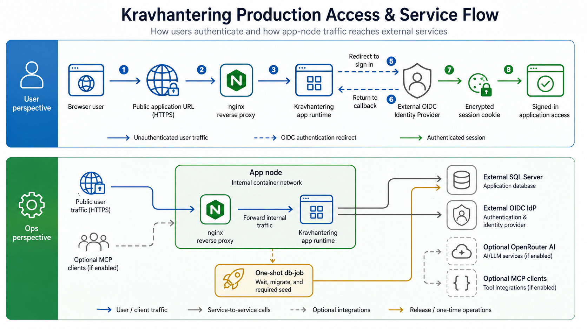

# RHEL 10 Production Deployment From Release Artifacts

<!-- cSpell:words coreutils datawriter firewalld fullchain nameserver privkey -->
<!-- cSpell:words ipv4 resolv -->

This guide describes how to install and upgrade Kravhantering on a clean
Red Hat Enterprise Linux 10 host from released artifacts only. The target host
does not need a repository clone, development dependencies, GitHub Actions
checkout, Playwright assets, or source-tree helper scripts.

This enterprise production topology is an app node that runs nginx and
`app-runtime` in a rootless Podman Compose network. SQL Server and the IdP are
external services.

For the controlled all-in-one internal topology where SQL Server and Keycloak
run on the same RHEL host, use
[rhel10-production-single-node-internal-deploy.md](./rhel10-production-single-node-internal-deploy.md).

<!-- markdownlint-disable MD013 -->

<!-- markdownlint-enable MD013 -->

## Release Inputs

The internal release repository must provide these files from the same release:

- `kravhantering-production-deploy-<version>.tar.gz`
- `kravhantering-production-deploy-<version>.tar.gz.sha256`
- `container-stack.lock.json`
- `public/build.json`
- `release-metadata.json`
- SBOM files for `app-runtime` and `db-job`

The internal container registry must contain digest-preserved mirrors for:

- `app-runtime`
- `db-job`
- nginx

Digest-preserved means the image digest in the internal registry is the same
`sha256:<digest>` value listed in `container-stack.lock.json`. Mirroring
mechanics are outside this guide; this guide assumes the internal repository
and registry already contain the approved release assets.

## Configuration BoM

Before editing templates, record these site values. The names below are
planning names; the later sections map them to the exact environment variables
and external IdP settings.

- `VERSION`: the release version to install, for example `1.2.3`.
- `APP_HOST`: the public DNS name without `https://`, for example
  `kravhantering.example.internal`. Use the same value in app URLs, IdP
  redirect/logout settings, IdP web origins, TLS certificate SANs and smoke
  checks.
- `SQLSERVER_HOST`, `DB_NAME`, `APP_DB_USER`, `APP_DB_PASSWORD`,
  `DB_JOB_USER` and `DB_JOB_PASSWORD`: the external SQL Server connection
  values from the DBA. The app runtime and db-job passwords must be different.
- `OIDC_ISSUER_URL`, `OIDC_CLIENT_ID` and `OIDC_CLIENT_SECRET`: the external
  IdP client values. `OIDC_CLIENT_SECRET` must match the confidential client
  secret configured in the IdP.
- `SESSION_COOKIE_PASSWORD`: a random value with at least 32 characters for
  encrypted browser sessions.
- `MCP_CLIENT_ID`: the service-account client id when MCP service tokens are
  used. The default is `kravhantering-mcp`.
- `OPENROUTER_API_KEY`, `OPENROUTER_MGMT_API_KEY` and
  `NEXT_PUBLIC_DEFAULT_MODEL`: optional AI values. Leave them empty unless AI
  requirement generation is approved for the environment.

### Generate Unique Secrets

Use the site's approved secret manager or password generator whenever possible.
Generate one value per secret and store each value in the deployment secret
store before editing `/etc/kravhantering`.

For OIDC client secrets, session-cookie passwords and optional MCP client
secrets, a good command-line fallback is:

```bash
openssl rand -base64 48
```

Run the command separately for each secret. Do not reuse one generated value
for unrelated settings.

For SQL Server login passwords, use the DBA-approved password generator and
the site's SQL Server password policy. If the operator must generate one on the
host, generate a long password and verify it contains uppercase, lowercase,
digit and symbol characters:

```bash
LC_ALL=C tr -dc 'A-Za-z0-9!%+=_.-' </dev/urandom | head -c 32
printf '\n'
```

Regenerate the SQL password if it contains the login name or does not satisfy
the site password policy.

## Clean RHEL 10 Host

Install the host as a minimal RHEL 10 server. Recommended baseline:

- 4 vCPU and 8 GiB RAM for an app node
- separate XFS-backed storage for container data and backups
- registered RHEL repositories
- outbound access to the internal release repository and internal registry
- inbound access only from the load balancer, admin network and approved
  monitoring systems

Install runtime packages as an administrator:

```bash
sudo dnf install -y podman podman-compose tar gzip coreutils jq
podman --version
PODMAN_COMPOSE_PROVIDER=podman-compose podman compose version
```

Create a dedicated rootless service user:

```bash
sudo useradd --create-home --shell /bin/bash kravhantering
sudo loginctl enable-linger kravhantering
```

Create immutable release and mutable configuration directories:

```bash
sudo install -d -o root -g root -m 0755 /opt/kravhantering/releases
sudo install -d -o root -g root -m 0755 /etc/kravhantering
sudo install -d -o root -g kravhantering -m 0750 /etc/kravhantering/tls
```

Release files live under `/opt/kravhantering/releases/<version>`.
Site-specific environment files and certificates live under `/etc/kravhantering`.

The bundled Compose files keep bind mounts read-only. Because the stack runs as
the rootless `kravhantering` user and the mounted files are root-owned under
`/opt` and `/etc`, apply SELinux labels as an administrator instead of relying
on Podman `:Z` relabeling at container start.

If this host terminates TLS directly on port 443, allow rootless Podman to bind
that port. Skip this step when the host only receives HTTP traffic from a
TLS-terminating load balancer:

```bash
printf '%s\n' 'net.ipv4.ip_unprivileged_port_start=443' \
  | sudo tee /etc/sysctl.d/90-kravhantering-rootless-ports.conf
sudo sysctl --system
```

When this host terminates TLS directly, also open HTTPS in the host firewall:

```bash
sudo firewall-cmd --add-service=https
sudo firewall-cmd --permanent --add-service=https
```

If the site requires a narrower allow-list, add a source-restricted rule
instead of the global HTTPS service. Replace `10.10.1.0/24` with the approved
load-balancer, admin or monitoring subnet:

```bash
HTTPS_SOURCE_CIDR=10.10.1.0/24
FIREWALL_HTTPS_RULE="rule family=\"ipv4\" source address=\"${HTTPS_SOURCE_CIDR}\""
FIREWALL_HTTPS_RULE="${FIREWALL_HTTPS_RULE} service name=\"https\" accept"

sudo firewall-cmd \
  --add-rich-rule="$FIREWALL_HTTPS_RULE"
sudo firewall-cmd \
  --permanent --add-rich-rule="$FIREWALL_HTTPS_RULE"
```

## Install a Release

Download the deployment bundle and checksum from the internal release
repository. Set `RELEASE_DOWNLOAD_URL` to the per-version directory that hosts
the approved release artifacts.

>[!NOTE]
>Sites should use the internal release repository by default. The official
>GitHub release is an explicit opt-in source when that is approved for the
>deployment. GitHub release tags use the `v${VERSION}` path segment.

```bash
VERSION=1.2.3

# Default: internal release repository.
RELEASE_DOWNLOAD_URL="https://release.example.internal/kravhantering/${VERSION}"

# Opt-in: official GitHub release.
# RELEASE_DOWNLOAD_URL="https://github.com/viscalyx/Kravhantering/releases/download/v${VERSION}"

mkdir -p "/tmp/kravhantering-${VERSION}"
cd "/tmp/kravhantering-${VERSION}"

curl -fLO "${RELEASE_DOWNLOAD_URL}/kravhantering-production-deploy-${VERSION}.tar.gz"
curl -fLO "${RELEASE_DOWNLOAD_URL}/kravhantering-production-deploy-${VERSION}.tar.gz.sha256"
sha256sum -c "kravhantering-production-deploy-${VERSION}.tar.gz.sha256"
```

Install the bundle:

```bash
sudo install -d -o root -g root -m 0755 \
  "/opt/kravhantering/releases/${VERSION}"
sudo tar -xzf "kravhantering-production-deploy-${VERSION}.tar.gz" \
  -C "/opt/kravhantering/releases/${VERSION}" \
  --strip-components=1
sudo ln -sfn "/opt/kravhantering/releases/${VERSION}" \
  /opt/kravhantering/current
```

Review the release manifest before creating local configuration:

```bash
less /opt/kravhantering/current/DEPLOYMENT-MANIFEST.json
less /opt/kravhantering/current/container-stack.lock.json
```

Copy templates into `/etc/kravhantering` on first install:

```bash
sudo install -o root -g kravhantering -m 0640 \
  /opt/kravhantering/current/env/release.env.template \
  /etc/kravhantering/release.env
sudo install -o root -g kravhantering -m 0640 \
  /opt/kravhantering/current/env/app.env.template \
  /etc/kravhantering/app.env
sudo install -o root -g kravhantering -m 0640 \
  /opt/kravhantering/current/env/db-job.env.template \
  /etc/kravhantering/db-job.env
```

Edit the copied files with environment-specific values. Do not edit files
under `/opt/kravhantering/current`; they are release artifacts.

Label the release-owned nginx configuration files for container bind mounts.
Run this once per installed release:

```bash
sudo chcon -R -t container_file_t \
  "/opt/kravhantering/releases/${VERSION}/nginx"
```

## Image References

Set image references in `/etc/kravhantering/release.env` to internal registry
refs that preserve the release digests from the installed release lock. First,
load the locked digest values:

```bash
LOCK_FILE=/opt/kravhantering/current/container-stack.lock.json
service_digest() {
  jq -r --arg name "$1" \
    '.services[] | select(.name == $name) | .digest' "$LOCK_FILE"
}

APP_RUNTIME_DIGEST="$(service_digest app-runtime)"
DB_JOB_DIGEST="$(service_digest db-job)"
NGINX_DIGEST="$(service_digest nginx)"

update_ref() {
  sudo sed -i "s#^${1}=.*#${1}=${2}#" /etc/kravhantering/release.env
}
```

Default: update `/etc/kravhantering/release.env` for the internal registry
mirror:

```bash
update_ref APP_RUNTIME_IMAGE_REF \
  "registry.example.internal/kravhantering-app-runtime@${APP_RUNTIME_DIGEST}"
update_ref DB_JOB_IMAGE_REF \
  "registry.example.internal/kravhantering-db-job@${DB_JOB_DIGEST}"
update_ref NGINX_IMAGE_REF \
  "registry.example.internal/nginx@${NGINX_DIGEST}"
```

Opt-in: if the site is explicitly approved to pull from public upstream
registries, the project images can use the official GHCR release packages.
nginx is a vendor image and should use the digest-locked upstream image ref
from the release lock:

```bash
update_ref APP_RUNTIME_IMAGE_REF \
  "ghcr.io/viscalyx/kravhantering-app-runtime@${APP_RUNTIME_DIGEST}"
update_ref DB_JOB_IMAGE_REF \
  "ghcr.io/viscalyx/kravhantering-db-job@${DB_JOB_DIGEST}"
update_ref NGINX_IMAGE_REF \
  "docker.io/library/nginx@${NGINX_DIGEST}"
```

Pull the images as the service user:

```bash
sudo -iu kravhantering
set -a
. /etc/kravhantering/release.env
set +a

podman pull "$APP_RUNTIME_IMAGE_REF"
podman pull "$DB_JOB_IMAGE_REF"
podman pull "$NGINX_IMAGE_REF"

exit
```

Set `NGINX_RESOLVER` in `/etc/kravhantering/release.env` to the Podman DNS
resolver that nginx should use for dynamic `app-runtime` lookups:

```env
NGINX_RESOLVER=10.89.0.1
```

The shown value is the common rootless Podman resolver. nginx uses it to
re-resolve the upstream app container after `app-runtime` restarts, instead of
keeping a stale container IP. If the deployment network uses a different
resolver, the startup flow below shows how to print the actual resolver from
inside the Compose network before nginx starts.

## External SQL Server Primary Path

The preferred production path is DBA-pre-provisioned SQL Server. The DBA or
database platform tooling must provide:

- database name, normally `kravhantering`
- app runtime login/user with `db_datareader` and `db_datawriter`
- db-job login/user with `db_owner`
- encrypted connection settings and trust configuration
- backup and restore procedure approved for the release window

The bundle includes `sqlserver/dba-provision.sql.template` for sites that want
a T-SQL starting point. Sites using provisioning tools can implement the same
contract without running the template.

Set `/etc/kravhantering/app.env` with the app runtime user:

```env
DB_HOST=sqlserver.example.internal
DB_PORT=1433
DB_NAME=kravhantering
DB_USER=kravhantering_app
DB_PASSWORD=<app-runtime-password>
DB_ENCRYPT=true
DB_TRUST_SERVER_CERTIFICATE=false
```

Set `/etc/kravhantering/db-job.env` with the migration/seed user:

```env
DB_HOST=sqlserver.example.internal
DB_PORT=1433
DB_NAME=kravhantering
DB_USER=kravhantering_job
DB_PASSWORD=<db-job-password>
DB_CONNECTION_TIMEOUT_MS=15000
DB_REQUEST_TIMEOUT_MS=30000
DB_ENCRYPT=true
DB_TRUST_SERVER_CERTIFICATE=false
```

`DB_CONNECTION_TIMEOUT_MS` is the time allowed to open each SQL Server
connection. Raise it when the external database is slow to accept connections
or the network path is occasionally slow. Lower it only if failed connection
attempts should return faster.

`DB_REQUEST_TIMEOUT_MS` is the time allowed for each SQL statement during
migrations and required seed. Raise it when schema changes or seed operations
legitimately take longer on the target database. Lower it only if stuck SQL
statements should fail faster.

Both values are db-job client settings. The shown values match the built-in
defaults and can be kept unless the site needs different timeout limits.

`DB_PASSWORD` in `db-job.env` is the password for the migration/seed login,
normally `kravhantering_job`. The DBA should provision this login with a unique
generated SQL Server password that satisfies the site password policy and does
not contain the login name. Do not reuse the app runtime password.

Do not keep `DB_BOOTSTRAP_*` values in `db-job.env` for the normal
DBA-pre-provisioned path.

## External IdP Primary Path

Register a confidential OIDC web client in the external IdP. The app requires:

- issuer URL reachable by app containers and browsers
- client id, normally `kravhantering-app`
- client secret
- redirect URI `https://<app-host>/api/auth/callback`
- post-logout redirect URI `https://<app-host>/`
- `roles` claim as a JSON array of strings
- `employeeHsaId` claim on ID token, access token and userinfo
- optional MCP service client audience for `kravhantering-app`

Provision at least one initial application administrator in the IdP before the
first sign-in. This is not an IdP platform administrator account; it is a
normal application user with a real `employeeHsaId` value and the
Kravhantering realm or group roles needed for launch. For the broad bootstrap
case, assign `Reviewer`, `Admin` and `PrivacyOfficer`, then reduce access
through the site's normal identity-governance process if needed.

Set `/etc/kravhantering/app.env`:

```env
NEXT_PUBLIC_SITE_URL=https://kravhantering.example.internal
AUTH_OIDC_ISSUER_URL=https://idp.example.internal/realms/kravhantering
AUTH_OIDC_CLIENT_ID=kravhantering-app
AUTH_OIDC_CLIENT_SECRET=<client-secret>
AUTH_OIDC_REDIRECT_URI=https://kravhantering.example.internal/api/auth/callback
AUTH_OIDC_POST_LOGOUT_REDIRECT_URI=https://kravhantering.example.internal/
AUTH_OIDC_ROLES_CLAIM=roles
AUTH_OIDC_SCOPES=openid profile email
AUTH_OIDC_API_AUDIENCE=kravhantering-app
AUTH_SESSION_COOKIE_NAME=kravhantering_session
AUTH_SESSION_COOKIE_PASSWORD=<at-least-32-random-characters>
AUTH_SESSION_TTL_SECONDS=28800
MCP_CLIENT_ID=kravhantering-mcp

NEXT_PUBLIC_DEFAULT_MODEL=
OPENROUTER_API_KEY=
OPENROUTER_MGMT_API_KEY=
```

The app only requires `AUTH_OIDC_CLIENT_SECRET` to be non-empty and to match
the client secret configured in the IdP. For production, use a high-entropy
IdP-generated secret or generate one with a command such as
`openssl rand -base64 48`. `AUTH_SESSION_COOKIE_PASSWORD` is separate and must
be at least 32 characters.

Keep `AUTH_OIDC_SCOPES=openid profile email` unless the IdP needs additional
scopes to release the required claims. `openid` must always be present. Keep
`AUTH_SESSION_COOKIE_NAME=kravhantering_session` unless this host must serve
another deployment on the same browser cookie scope. Changing the cookie name
signs out existing browser sessions.

Keep `AUTH_SESSION_TTL_SECONDS=28800` for an eight-hour absolute session-cookie
lifetime unless the site has approved another browser-session lifetime. It is
not an idle timeout; the shortest of this value, the IdP SSO session lifetime
and the access-token lifetime controls when the user must re-authenticate.

`MCP_CLIENT_ID=kravhantering-mcp` is used when issuing service-account tokens
for MCP clients. Keep it aligned with the IdP service-account client id, or
leave the default when MCP service tokens are not used. It is not a secret.

Leave `NEXT_PUBLIC_DEFAULT_MODEL`, `OPENROUTER_API_KEY` and
`OPENROUTER_MGMT_API_KEY` empty unless AI requirement generation is approved
for the environment. To enable AI, set `OPENROUTER_API_KEY` to the approved
OpenRouter API key. `NEXT_PUBLIC_DEFAULT_MODEL` is optional; leave it empty if
the deployment should not preselect a site default model. The UI will use a
saved favorite or the first available model, and backend calls that receive no
model fall back to the built-in default. Set `OPENROUTER_MGMT_API_KEY` only if
the app should display organization credit information.
`NEXT_PUBLIC_DEFAULT_MODEL` is public client configuration; do not put secrets
in it.

For Keycloak, the client must emit the realm roles and `hsaId` user attribute
as the `roles` and `employeeHsaId` claims. The bundle's
`keycloak/realm-kravhantering-production.template.json` shows the expected
mapper shape and declares `hsaId` as a managed Keycloak user-profile
attribute.

### Keycloak Appendix

When the external IdP is Keycloak, create or update a realm with:

- confidential client `kravhantering-app`
- client secret stored only in `/etc/kravhantering/app.env`
- standard authorization code flow enabled
- redirect URI `https://<app-host>/api/auth/callback`
- web origin `https://<app-host>`
- post-logout redirect URI `https://<app-host>/`
- realm roles `Reviewer`, `Admin` and `PrivacyOfficer`
- managed user-profile attribute `hsaId` with administrator view/edit
  permissions
- at least one initial application administrator user with a real `hsaId`
  attribute and the `Reviewer`, `Admin` and `PrivacyOfficer` realm roles
- mapper that emits realm roles as a multivalued `roles` claim
- mapper that emits the user `hsaId` attribute as `employeeHsaId`
- optional service-account client `kravhantering-mcp` with its own generated
  client secret and an audience mapper for `kravhantering-app`

For an already-initialized Keycloak realm, update the user-profile setting
through the Keycloak admin console or admin API. Replacing the realm template
and restarting Keycloak only affects a first import, not a live realm.

Do not import the release-smoke realm into production. The smoke-test realm
contains public test credentials.

## App Node With TLS on the Node

Use this when the RHEL app node terminates TLS itself.

Install the server certificate and private key:

```bash
sudo install -o root -g kravhantering -m 0640 fullchain.pem \
  /etc/kravhantering/tls/fullchain.pem
sudo install -o root -g kravhantering -m 0640 privkey.pem \
  /etc/kravhantering/tls/privkey.pem
sudo chcon -R -t container_file_t /etc/kravhantering/tls
```

Validate the external database and IdP, then run migration and required seed
once for the release:

```bash
sudo -iu kravhantering
cd /opt/kravhantering/current
set -a
. /etc/kravhantering/release.env
set +a

podman run --rm --env-file /etc/kravhantering/db-job.env \
  "$DB_JOB_IMAGE_REF" wait
podman run --rm --env-file /etc/kravhantering/db-job.env \
  "$DB_JOB_IMAGE_REF" migrate
podman run --rm --env-file /etc/kravhantering/db-job.env \
  "$DB_JOB_IMAGE_REF" seed:required
```

Start `app-runtime`, confirm the nginx resolver from inside the Compose
network, then start the app node:

```bash
APP_NODE_NETWORK=kravhantering-app-node_kravhantering-internal

podman compose --env-file /etc/kravhantering/release.env \
  -f compose/app-node-tls.compose.yml up -d app-runtime
podman run --rm --network "$APP_NODE_NETWORK" --entrypoint /bin/sh \
  "$NGINX_IMAGE_REF" -c "awk '/^nameserver / { print \$2; exit }' /etc/resolv.conf"

podman compose --env-file /etc/kravhantering/release.env \
  -f compose/app-node-tls.compose.yml up -d
```

If the printed resolver differs from `NGINX_RESOLVER`, update
`/etc/kravhantering/release.env`, reload it in the shell, and rerun
`podman compose up -d` before checking readiness.

Check readiness through nginx:

```bash
curl --fail --silent --show-error \
  https://kravhantering.example.internal/api/health
curl --fail --silent --show-error \
  https://kravhantering.example.internal/api/ready
```

If the host uses a self-signed certificate, or the operator workstation does
not yet trust the issuing CA, use `--insecure` for a manual readiness probe
only:

```bash
curl --insecure --fail --silent --show-error \
  https://kravhantering.example.internal/api/health
```

## App Node Behind a TLS-Terminating Load Balancer

Use this when an external load balancer terminates TLS and forwards HTTP to
the app-node nginx. Set the bind address in `/etc/kravhantering/release.env`:

```env
NGINX_HTTP_BIND=127.0.0.1:8080
```

Change the value when the load balancer connects over a dedicated private
network interface, for example `10.10.20.15:8080`.

Start with the HTTP Compose file:

```bash
sudo -iu kravhantering
cd /opt/kravhantering/current
set -a
. /etc/kravhantering/release.env
set +a

APP_NODE_NETWORK=kravhantering-app-node_kravhantering-internal

podman compose --env-file /etc/kravhantering/release.env \
  -f compose/app-node-http.compose.yml up -d app-runtime
podman run --rm --network "$APP_NODE_NETWORK" --entrypoint /bin/sh \
  "$NGINX_IMAGE_REF" -c "awk '/^nameserver / { print \$2; exit }' /etc/resolv.conf"

podman compose --env-file /etc/kravhantering/release.env \
  -f compose/app-node-http.compose.yml up -d
```

If the printed resolver differs from `NGINX_RESOLVER`, update
`/etc/kravhantering/release.env`, reload it in the shell, and rerun
`podman compose up -d`.

The app-facing public URLs in `app.env` must still use the external HTTPS
origin exposed by the load balancer.

## Operate Individual App-Node Services

Run day-2 service control as the rootless service user from the active release
directory. Use the TLS Compose file unless this node is behind a
TLS-terminating load balancer:

```bash
sudo -iu kravhantering
cd /opt/kravhantering/current
COMPOSE_FILE=compose/app-node-tls.compose.yml
# COMPOSE_FILE=compose/app-node-http.compose.yml

podman compose --env-file /etc/kravhantering/release.env \
  -f "$COMPOSE_FILE" ps
```

Restart an existing long-running container when only the process needs to
reload mounted files or reconnect to dependencies:

```bash
podman compose --env-file /etc/kravhantering/release.env \
  -f "$COMPOSE_FILE" restart app-runtime
podman compose --env-file /etc/kravhantering/release.env \
  -f "$COMPOSE_FILE" restart nginx
```

Use `restart` for cases such as reloading nginx after replacing mounted TLS
certificate files. Use `up -d --force-recreate SERVICE` instead when an env
file, image ref, bind mount, or Compose definition changed and the container
must be recreated:

```bash
podman compose --env-file /etc/kravhantering/release.env \
  -f "$COMPOSE_FILE" up -d --force-recreate app-runtime
podman compose --env-file /etc/kravhantering/release.env \
  -f "$COMPOSE_FILE" up -d --force-recreate nginx
```

Take down and bring up one service without stopping the whole app node:

```bash
podman compose --env-file /etc/kravhantering/release.env \
  -f "$COMPOSE_FILE" stop nginx
podman compose --env-file /etc/kravhantering/release.env \
  -f "$COMPOSE_FILE" up -d nginx
```

For app maintenance, stop nginx first to stop browser traffic, then stop or
recreate `app-runtime`:

```bash
podman compose --env-file /etc/kravhantering/release.env \
  -f "$COMPOSE_FILE" stop nginx app-runtime
podman compose --env-file /etc/kravhantering/release.env \
  -f "$COMPOSE_FILE" up -d app-runtime nginx
```

Stop and remove both app-node containers only for full-node maintenance:

```bash
podman compose --env-file /etc/kravhantering/release.env \
  -f "$COMPOSE_FILE" down
podman compose --env-file /etc/kravhantering/release.env \
  -f "$COMPOSE_FILE" up -d
```

Do not use `podman compose down -v` in production unless an approved procedure
explicitly calls for deleting Compose-managed volumes. The `db-job` image is
not a long-running service; run database jobs with the documented
`podman run --rm` commands.

## Optional User Systemd Wrapper

Manual `podman compose` is the primary operational workflow. If the site wants
user-systemd autostart, copy the template and adjust the Compose file name if
the HTTP variant is used:

```bash
sudo -iu kravhantering
mkdir -p ~/.config/systemd/user
cp /opt/kravhantering/current/systemd/kravhantering-compose.service \
  ~/.config/systemd/user/
systemctl --user daemon-reload
systemctl --user enable --now kravhantering-compose.service
```

The service runs `podman compose up -d` from `/opt/kravhantering/current` and
`podman compose down` on stop.

## Planned-Downtime Upgrade

Use planned downtime unless a future release explicitly documents rolling
compatibility.

1. Confirm the target release bundle, checksum and mirrored image digests.
2. Confirm a tested SQL Server backup or restore point.
3. Drain or disable traffic to all app nodes.
4. Stop the app nodes:

   ```bash
   sudo -iu kravhantering
   cd /opt/kravhantering/current
   podman compose --env-file /etc/kravhantering/release.env \
     -f compose/app-node-tls.compose.yml down
   ```

5. Install the new release bundle under `/opt/kravhantering/releases`.
6. Update `/opt/kravhantering/current` to the new release.
7. Update `/etc/kravhantering/release.env` image refs to the new digests.
8. Run `db-job migrate` and `seed:required` once.
9. Start the app nodes with the new release.
10. Check `/api/health`, `/api/ready`, sign-in and a read-only UI workflow.
11. Re-enable traffic.

## Troubleshooting Readiness

- If `/api/health` works from the host but not from a remote client, check the
  node firewall, load balancer and route rules. When this host terminates TLS,
  HTTPS on port 443 must be allowed from the approved source networks.
- If `/api/health` and `/api/ready` return `502` after restarting
  `app-runtime` on an older release, restart nginx so it resolves the new
  container IP. Current release packages render nginx with `NGINX_RESOLVER`
  and dynamic upstream `resolve` entries to avoid stale upstream IPs.

## Rollback

Rollback after a migration requires restoring the database backup or restore
point taken before the upgrade. The supported sequence is:

1. Disable traffic.
2. Stop app nodes.
3. Restore SQL Server to the pre-upgrade restore point.
4. Point `/opt/kravhantering/current` back to the previous release directory.
5. Restore the previous `/etc/kravhantering/release.env` image refs.
6. Start the previous app nodes.
7. Verify `/api/health`, `/api/ready` and sign-in before enabling traffic.

Do not rely on app-only image rollback after schema migration unless the
specific release notes explicitly say it is supported.

## Controlled Bootstrap Alternative

When DBA pre-provisioning is not available, `db-job bootstrap` can create the
database and SQL principals with temporary SQL admin credentials. Use this only
as a controlled operational exception:

```bash
sudo -iu kravhantering
cd /opt/kravhantering/current
set -a
. /etc/kravhantering/release.env
set +a

podman run --rm --env-file /etc/kravhantering/db-job.env \
  "$DB_JOB_IMAGE_REF" bootstrap
podman run --rm --env-file /etc/kravhantering/db-job.env \
  "$DB_JOB_IMAGE_REF" migrate
podman run --rm --env-file /etc/kravhantering/db-job.env \
  "$DB_JOB_IMAGE_REF" seed:required
```

After bootstrap, remove `DB_BOOTSTRAP_ADMIN_USER` and
`DB_BOOTSTRAP_ADMIN_PASSWORD` from `/etc/kravhantering/db-job.env`.

## Operational Evidence

Keep these files with the deployment record:

- deployment bundle checksum
- `DEPLOYMENT-MANIFEST.json`
- `container-stack.lock.json`
- `public/build.json`
- `release-metadata.json`
- SQL backup or restore-point reference
- final `/etc/kravhantering/release.env` image refs
- readiness check results

Do not archive `/etc/kravhantering/*.env`, private keys or raw container
inspect output in general release evidence stores.
