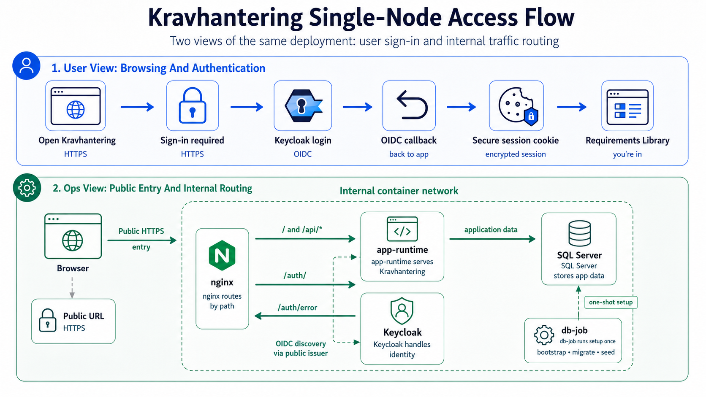

# RHEL 10 Self-Contained Single-Node Deployment From Release Artifacts

<!-- cSpell:words coreutils datawriter firewalld fullchain nameserver privkey -->
<!-- cSpell:words resolv -->
<!-- cSpell:words readlink -->
<!-- cSpell:words ipv4 -->
<!-- cSpell:words serverAuth subjectAltName -->
<!-- cSpell:words Mountpoint -->
<!-- cSpell:words fcontext graphroot restorecon semanage tempdb -->

This guide describes how to install and operate Kravhantering on one clean
Red Hat Enterprise Linux 10 host from released artifacts only, with nginx,
`app-runtime`, SQL Server, Keycloak and `db-job` in one rootless Podman Compose
network.

Use this topology when the production site must run without external SQL Server
or external IdP dependencies at runtime. For the enterprise topology with
external SQL Server and external IdP, use
[rhel10-production-deploy.md](./rhel10-production-deploy.md).
For upgrades and rollback, use
[rhel10-production-single-node-self-contained-upgrade.md](./rhel10-production-single-node-self-contained-upgrade.md).
To uninstall a first install of this topology, use
[rhel10-production-single-node-self-contained-uninstall.md](./rhel10-production-single-node-self-contained-uninstall.md).

>[!IMPORTANT]
>For offline deployment, first follow
>[rhel10-production-single-node-self-contained-offline.md](./rhel10-production-single-node-self-contained-offline.md).
>The offline guide prepares the transferable bundle before this deployment
>guide starts and tells you where to resume these regular deployment steps on
>the offline host.



## Release Inputs

The internal release repository must provide these files from the same release:

- `kravhantering-production-deploy-<version>.tar.gz`
- `kravhantering-production-deploy-<version>.tar.gz.sha256`
- `container-stack.lock.json`
- `public/build.json`
- `release-metadata.json`
- SBOM files for `app-runtime` and `db-job`

The site must provide approved runtime image refs for:

- `app-runtime`
- `db-job`
- nginx
- SQL Server
- Keycloak

The refs must use tag-style `image:tag` values that point at public upstream
registries or an internal registry mirror. Each configured ref must resolve to
the locked `imageId` in `container-stack.lock.json` when inspected with Podman.
For third-party images, prefer release-specific internal mirror tags instead
of moving public tags such as `stable-alpine` or `2025-latest`. The lock file,
not the tag text, is the source of truth; `bin/kravhantering-images.sh verify`
fails if a tag now resolves to another image ID.

## Configuration BoM

Before editing templates, record these site values. The table separates values
that must be planned from defaults or derived values that usually only need
verification.

<!-- markdownlint-disable MD013 -->
| Name | Applies to | Default / derived value | Plan or record when |
| --- | --- | --- | --- |
| `VERSION` | Release artifact names | No default | Always record the release version to install, for example `1.2.3`. |
| `APP_HOST` | `PUBLIC_HOSTNAME`, app URLs, `KC_HOSTNAME`, realm redirect/logout settings, realm web origins, TLS certificate SANs and smoke checks | No default | Always record the public DNS name without `https://`, for example `kravhantering.example.internal`. |
| `NEXT_PUBLIC_SITE_URL` | `NEXT_PUBLIC_SITE_URL` in `app.env` | `https://<APP_HOST>` | Verify after choosing `APP_HOST`; plan only if the public URL cannot use the normal scheme and host. |
| `KC_HOSTNAME` | `KC_HOSTNAME` in `keycloak.env` | `https://<APP_HOST>/auth` | Verify after choosing `APP_HOST`; plan only if Keycloak is deliberately exposed at another public URL. |
| `NGINX_RESOLVER` | `NGINX_RESOLVER` in `release.env` | `10.89.0.1` | Plan only if the rootless Podman network uses a different DNS resolver. |
| `MSSQL_SA_PASSWORD` | `MSSQL_SA_PASSWORD` in `sqlserver.env` and `DB_BOOTSTRAP_ADMIN_PASSWORD` in `db-job.env` | No default | Always generate a unique SQL Server `sa` password. Use the same value in both places and follow [Generate Unique Secrets](#generate-unique-secrets). |
| `DB_JOB_PASSWORD` | `DB_PASSWORD` in `db-job.env` | No default | Always generate a unique SQL Server password for the `kravhantering_job` migration/seed login. Follow [Generate Unique Secrets](#generate-unique-secrets). |
| `APP_DB_PASSWORD` | `DB_BOOTSTRAP_APP_PASSWORD` in `db-job.env` and `DB_PASSWORD` in `app.env` | No default | Always generate a unique SQL Server password for the `kravhantering_app` runtime login. Use the same value in both places and follow [Generate Unique Secrets](#generate-unique-secrets). |
| `DB_PASSWORD` | `app.env` and `db-job.env` | Maps to `DB_JOB_PASSWORD` in `db-job.env` and `APP_DB_PASSWORD` in `app.env` | No separate value to plan; verify each file receives the correct password. |
| `DB_PORT` | `DB_PORT` in `app.env` and `db-job.env` | `1433` | Plan only if the Compose network or SQL Server service changes. |
| `DB_ENCRYPT` | `DB_ENCRYPT` in `app.env` and `db-job.env` | `true` | Plan only if the SQL Server contract deliberately differs. |
| `DB_TRUST_SERVER_CERTIFICATE` | `DB_TRUST_SERVER_CERTIFICATE` in `app.env` and `db-job.env` | `true` | Plan only if the internal SQL Server container is replaced with a certificate trusted by the container trust store. |
| `DB_CONNECTION_TIMEOUT_MS` | `DB_CONNECTION_TIMEOUT_MS` in `db-job.env` | `15000` | Plan only if the host, storage or startup timing needs a different connection timeout. |
| `DB_REQUEST_TIMEOUT_MS` | `DB_REQUEST_TIMEOUT_MS` in `db-job.env` | `30000` | Plan only if bootstrap, migrations or required seed need a different SQL statement timeout. |
| `AUTH_OIDC_ISSUER_URL` | `AUTH_OIDC_ISSUER_URL` in `app.env` | `https://<APP_HOST>/auth/realms/kravhantering-production` | Verify after choosing `APP_HOST`; plan only if the realm or public auth path changes. |
| `AUTH_OIDC_CLIENT_ID` | `AUTH_OIDC_CLIENT_ID` in `app.env` and realm JSON app client id | `kravhantering-app` | Plan only if the realm app client id is deliberately changed. |
| `OIDC_APP_CLIENT_SECRET` | `AUTH_OIDC_CLIENT_SECRET` in `app.env` and realm JSON `kravhantering-app` client `secret` | No default | Always generate the app OIDC client secret. Paste the same value in `app.env` and the realm JSON, and follow [Generate Unique Secrets](#generate-unique-secrets). |
| `AUTH_OIDC_REDIRECT_URI` | `AUTH_OIDC_REDIRECT_URI` in `app.env` and realm JSON `redirectUris` | `https://<APP_HOST>/api/auth/callback` | Verify after choosing `APP_HOST`; plan only if the app callback URL changes. |
| `AUTH_OIDC_POST_LOGOUT_REDIRECT_URI` | `AUTH_OIDC_POST_LOGOUT_REDIRECT_URI` in `app.env` and realm JSON `post.logout.redirect.uris` | `https://<APP_HOST>/` | Verify after choosing `APP_HOST`; plan only if the post-logout URL changes. |
| `AUTH_OIDC_ROLES_CLAIM` | `AUTH_OIDC_ROLES_CLAIM` in `app.env` | `roles` | Plan only if the Keycloak mapper emits application roles in another claim. |
| `AUTH_OIDC_SCOPES` | `AUTH_OIDC_SCOPES` in `app.env` | `openid profile email` | Plan only if the realm needs additional scopes to release required claims. |
| `AUTH_OIDC_API_AUDIENCE` | `AUTH_OIDC_API_AUDIENCE` in `app.env` | `kravhantering-app` | Plan only if the app API audience differs from the client id. |
| `AUTH_SESSION_COOKIE_NAME` | `AUTH_SESSION_COOKIE_NAME` in `app.env` | `kravhantering_session` | Plan only if this host serves another deployment on the same browser cookie scope. |
| `SESSION_COOKIE_PASSWORD` | `AUTH_SESSION_COOKIE_PASSWORD` in `app.env` | No default | Always generate with the opaque-secret fallback in [Generate Unique Secrets](#generate-unique-secrets). |
| `AUTH_SESSION_TTL_SECONDS` | `AUTH_SESSION_TTL_SECONDS` in `app.env` | `28800` | Plan only if another absolute browser-session lifetime is approved. |
| `KEYCLOAK_ADMIN_USER` | `KEYCLOAK_ADMIN` in `keycloak.env` | No default | Always choose an approved Keycloak bootstrap administrator username. |
| `KEYCLOAK_ADMIN_PASSWORD` | `KEYCLOAK_ADMIN_PASSWORD` in `keycloak.env` | No default | Always generate a strong unique Keycloak bootstrap administrator password. Follow [Generate Unique Secrets](#generate-unique-secrets). |
| `MCP_CLIENT_ID` | `MCP_CLIENT_ID` in `app.env` and realm JSON service client id | `kravhantering-mcp` | Plan only if MCP service tokens use a different service-account client id. |
| `MCP_CLIENT_SECRET` | Realm JSON `kravhantering-mcp` client `secret` | No default | Plan only when MCP service tokens are used; generate a secret separate from `OIDC_APP_CLIENT_SECRET`. |
| `MCP_SERVICE_EMPLOYEE_HSA_ID` | Realm JSON MCP service-account user attribute | No default | Plan only when MCP service tokens are used; record the approved service-account `hsaId`. |
| `redirectUris` | Realm JSON `kravhantering-app` client `redirectUris` | `https://<APP_HOST>/api/auth/callback` | Verify it stays aligned with `AUTH_OIDC_REDIRECT_URI`. |
| `webOrigins` | Realm JSON `kravhantering-app` client `webOrigins` | `https://<APP_HOST>` | Verify it stays aligned with the browser origin. |
| `post.logout.redirect.uris` | Realm JSON `kravhantering-app` client attribute | `https://<APP_HOST>/` | Verify it stays aligned with `AUTH_OIDC_POST_LOGOUT_REDIRECT_URI`. |
| `INITIAL_APP_ADMIN` | Optional realm JSON `users` block or post-startup Keycloak user setup | No default | Plan before first sign-in if the site wants a pre-created app administrator; record username, email/name, real `hsaId`, one-time password and launch roles. |
| `OPENROUTER_API_KEY` | `OPENROUTER_API_KEY` in `app.env` | Empty | Plan only if AI requirement generation is approved. |
| `OPENROUTER_MGMT_API_KEY` | `OPENROUTER_MGMT_API_KEY` in `app.env` | Empty | Plan only if AI requirement generation and organization credit display are approved. |
| `NEXT_PUBLIC_DEFAULT_MODEL` | `NEXT_PUBLIC_DEFAULT_MODEL` in `app.env` | Empty | Plan only if the deployment should preselect a public default AI model. |
<!-- markdownlint-enable MD013 -->

### Generate Unique Secrets

Use the site's approved secret manager or password generator whenever possible.
Generate one value per secret and store each value in the deployment secret
store before editing `/etc/kravhantering`.

For OIDC client secrets, session-cookie passwords and optional MCP client
secrets, a good command-line fallback is:

```bash
openssl rand -base64 48
```

Run the command separately for each secret. Do not reuse one generated value
for unrelated settings.

For SQL Server login passwords and the Keycloak bootstrap admin password, use
the site's password policy. If the operator must generate one on the host, this
fallback creates a 32-character password with uppercase, lowercase, digit and
symbol characters:

```bash
printf 'S1q!%s\n' "$(openssl rand -hex 14)"
```

Regenerate the password if it contains the relevant user or login name, or if
the site password policy rejects it.

## Prepare RHEL 10 Host

Install the host as a minimal RHEL 10 server. Recommended baseline:

- 8 vCPU and 16 GiB RAM
- separate XFS-backed storage for container data and backups
- registered RHEL repositories
- outbound access to the internal release repository and internal registry
- inbound access only from the load balancer, admin network and approved
  monitoring systems

Install runtime packages as an administrator:

```bash
sudo dnf install -y podman podman-compose tar gzip coreutils jq
podman --version
PODMAN_COMPOSE_PROVIDER=podman-compose podman compose version
```

Create a dedicated rootless service user:

```bash
sudo useradd --create-home --shell /bin/bash kravhantering
sudo loginctl enable-linger kravhantering
```

Create immutable release and mutable configuration directories:

```bash
sudo install -d -o root -g root -m 0755 /opt/kravhantering/releases
sudo install -d -o root -g root -m 0755 /etc/kravhantering
sudo install -d -o root -g kravhantering -m 0750 /etc/kravhantering/tls
sudo install -d -o root -g kravhantering -m 0750 /etc/kravhantering/keycloak
```

Release files live under `/opt/kravhantering/releases/<version>`.
Site-specific environment files, certificates and realm files live under
`/etc/kravhantering`.

### Podman Volume Storage

The single-node Compose file stores SQL Server database files in the named
Podman volume `kravhantering-sqlserver-data`, mounted inside the SQL Server
container at `/var/opt/mssql`. Keycloak uses the separate
`kravhantering-keycloak-data` volume for its runtime state.

Because the stack runs as the rootless `kravhantering` user, default Podman
storage normally places the SQL Server volume data on the host at:

```text
/home/kravhantering/.local/share/containers/storage/volumes/kravhantering-sqlserver-data/_data
```

Confirm the actual path on each host after the volume has been created:

```bash
sudo -iu kravhantering
podman volume inspect kravhantering-sqlserver-data --format '{{ .Mountpoint }}'
exit
```

Treat the inspect output as authoritative when the host uses customized
rootless Podman storage or when `/home/kravhantering` is backed by separate
container storage. Include this location in the site's backup, restore and
volume-snapshot procedures.

#### Change the Rootless Storage Location

If `/home` is intentionally small, quota-limited or mounted with stronger
hardening than the database workload can tolerate, move the rootless Podman
storage root before creating the stack. This keeps the Compose volume name
unchanged while placing images, container layers and named volumes on a larger
site-approved filesystem.

Create and label the new storage root as an administrator. Replace
`/var/lib/kravhantering/podman-storage` with the approved XFS-backed mount
point for this host:

```bash
sudo install -d -o kravhantering -g kravhantering -m 0700 \
  /var/lib/kravhantering/podman-storage
sudo semanage fcontext -a -t container_var_lib_t \
  '/var/lib/kravhantering/podman-storage(/.*)?'
sudo restorecon -Rv /var/lib/kravhantering/podman-storage
```

Create a per-user Podman storage override for the `kravhantering` service
user before running `podman compose up` for the first time:

```bash
sudo -iu kravhantering
mkdir -p ~/.config/containers
printf '%s\n' \
  '[storage]' \
  'driver = "overlay"' \
  'graphroot = "/var/lib/kravhantering/podman-storage"' \
  > ~/.config/containers/storage.conf
podman info --format '{{ .Store.GraphRoot }}'
exit
```

The `podman info` output must show the new path before the stack creates
volumes. After first start, run `podman volume inspect` again and record the
actual SQL Server mountpoint from the new storage root. If SQL Server data
already exists, do not move only the `_data` directory; use a tested SQL Server
backup and restore, a volume snapshot restore or another approved storage
migration plan.

#### SQL Server Volume Sizing

For initial planning, a Requirements Library with 10,000 requirements and one
or two requirement versions per requirement should normally stay well below
1 GiB for application database rows and indexes when descriptions, acceptance
criteria and verification methods are ordinary short text. Size the filesystem
for SQL Server operations, not only for that logical row estimate: the volume
also holds database files, transaction logs, indexes, system databases and
`tempdb`.

Use 10 GiB as a practical floor for the SQL Server Podman volume on a
production host. Prefer 20-50 GiB when the site expects long version history,
many requirements specifications, local requirements, deviations, improvement
suggestions, action audit log rows or long growth periods between maintenance
windows. Keep SQL Server backups and volume snapshots on separate storage.

After a representative import or seed, measure the actual volume usage:

```bash
sudo -iu kravhantering
SQLSERVER_VOLUME_PATH=$(
  podman volume inspect kravhantering-sqlserver-data --format '{{ .Mountpoint }}'
)
du -sh "$SQLSERVER_VOLUME_PATH"
exit
```

The bundled Compose files keep bind mounts read-only. Because the stack runs as
the rootless `kravhantering` user and the mounted files are root-owned under
`/opt` and `/etc`, apply SELinux labels as an administrator instead of relying
on Podman `:Z` relabeling at container start.

If this host terminates TLS directly on port 443, allow rootless Podman to bind
that port:

```bash
printf '%s\n' 'net.ipv4.ip_unprivileged_port_start=443' \
  | sudo tee /etc/sysctl.d/90-kravhantering-rootless-ports.conf
sudo sysctl --system
```

Open HTTPS in the host firewall. Use this when any approved client, load
balancer or monitoring source may reach the application over HTTPS:

```bash
sudo firewall-cmd --add-service=https
sudo firewall-cmd --permanent --add-service=https
```

If the site requires a narrower allow-list, add a source-restricted rule
instead of the global HTTPS service. Replace `10.10.1.0/24` with the approved
load-balancer, admin or monitoring subnet:

```bash
HTTPS_SOURCE_CIDR=10.10.1.0/24
FIREWALL_HTTPS_RULE="rule family=\"ipv4\" source address=\"${HTTPS_SOURCE_CIDR}\""
FIREWALL_HTTPS_RULE="${FIREWALL_HTTPS_RULE} service name=\"https\" accept"

sudo firewall-cmd \
  --add-rich-rule="$FIREWALL_HTTPS_RULE"
sudo firewall-cmd \
  --permanent --add-rich-rule="$FIREWALL_HTTPS_RULE"
```

## Install a Release

Download the deployment bundle and checksum from the internal release
repository. Set `RELEASE_DOWNLOAD_URL` to the per-version directory that hosts
the approved release artifacts.

>[!NOTE]
>Sites should use the internal release repository by default. The official
>GitHub release is an explicit opt-in source when that is approved for the
>deployment. GitHub release tags use the `v${VERSION}` path segment.

```bash
VERSION=1.2.3 # Change to the version being deployed.

# Default: internal release repository.
RELEASE_DOWNLOAD_URL="https://release.example.internal/kravhantering/${VERSION}"

# Opt-in: official GitHub release.
# RELEASE_DOWNLOAD_URL="https://github.com/viscalyx/Kravhantering/releases/download/v${VERSION}"

mkdir -p "/tmp/kravhantering-${VERSION}"
cd "/tmp/kravhantering-${VERSION}"

curl -fLO "${RELEASE_DOWNLOAD_URL}/kravhantering-production-deploy-${VERSION}.tar.gz"
curl -fLO "${RELEASE_DOWNLOAD_URL}/kravhantering-production-deploy-${VERSION}.tar.gz.sha256"
sha256sum -c "kravhantering-production-deploy-${VERSION}.tar.gz.sha256"
```

Install the bundle:

```bash
sudo install -d -o root -g root -m 0755 \
  "/opt/kravhantering/releases/${VERSION}"
sudo tar -xzf "kravhantering-production-deploy-${VERSION}.tar.gz" \
  -C "/opt/kravhantering/releases/${VERSION}" \
  --strip-components=1
sudo ln -sfn "/opt/kravhantering/releases/${VERSION}" \
  /opt/kravhantering/current
```

Review the release manifest before creating local configuration:

```bash
less /opt/kravhantering/current/DEPLOYMENT-MANIFEST.json
less /opt/kravhantering/current/container-stack.lock.json
```

Copy templates into `/etc/kravhantering` on first install:

```bash
REALM_TEMPLATE=/opt/kravhantering/current/keycloak
REALM_TEMPLATE="${REALM_TEMPLATE}/realm-kravhantering-production.template.json"

sudo install -o root -g kravhantering -m 0640 \
  /opt/kravhantering/current/env/release.env.template \
  /etc/kravhantering/release.env
sudo install -o root -g kravhantering -m 0640 \
  /opt/kravhantering/current/env/app.env.template \
  /etc/kravhantering/app.env
sudo install -o root -g kravhantering -m 0640 \
  /opt/kravhantering/current/env/db-job.env.template \
  /etc/kravhantering/db-job.env
sudo install -o root -g kravhantering -m 0640 \
  /opt/kravhantering/current/env/sqlserver.env.template \
  /etc/kravhantering/sqlserver.env
sudo install -o root -g kravhantering -m 0640 \
  /opt/kravhantering/current/env/keycloak.env.template \
  /etc/kravhantering/keycloak.env
sudo install -o root -g kravhantering -m 0640 \
  "$REALM_TEMPLATE" \
  /etc/kravhantering/keycloak/realm-kravhantering-production.json
```

Edit the copied files with environment-specific values. Do not edit files
under `/opt/kravhantering/current`; they are release artifacts.

Label the release-owned nginx configuration files for container bind mounts.
Run this once per installed release:

```bash
sudo chcon -R -t container_file_t \
  "/opt/kravhantering/releases/${VERSION}/nginx"
```

## Image References

Set image references in `/etc/kravhantering/release.env` to the site's
approved runtime refs. Production runtime refs must use tag-style `image:tag`
values. Prefer release-specific internal mirror tags for third-party images.
For connected staging only, derive the public upstream refs from the release
lock and verify them immediately:

```bash
update_ref() {
  sudo sed -i "s#^${1}=.*#${1}=${2}#" /etc/kravhantering/release.env
}

LOCK_FILE=/opt/kravhantering/current/container-stack.lock.json
service_image() {
  jq -r --arg name "$1" \
    '.services[] | select(.name == $name) | .image' "$LOCK_FILE"
}
service_tag() {
  jq -r --arg name "$1" \
    '.services[] | select(.name == $name) | .tag' "$LOCK_FILE"
}
service_ref() {
  printf '%s:%s\n' "$(service_image "$1")" "$(service_tag "$1")"
}

update_ref APP_RUNTIME_IMAGE_REF \
  "$(service_ref app-runtime)"
update_ref DB_JOB_IMAGE_REF \
  "$(service_ref db-job)"
update_ref NGINX_IMAGE_REF \
  "$(service_ref nginx)"
update_ref SQLSERVER_IMAGE_REF \
  "$(service_ref sqlserver)"
update_ref KEYCLOAK_IMAGE_REF \
  "$(service_ref keycloak)"
```

If the site pulls from an internal registry mirror that preserves repository
paths, rewrite only the registry host while keeping the locked tags:

```bash
TARGET_IMAGE_REGISTRY=registry.example.internal
LOCK_FILE=/opt/kravhantering/current/container-stack.lock.json
service_image() {
  jq -r --arg name "$1" \
    '.services[] | select(.name == $name) | .image' "$LOCK_FILE"
}
service_tag() {
  jq -r --arg name "$1" \
    '.services[] | select(.name == $name) | .tag' "$LOCK_FILE"
}
mirror_ref() {
  local image
  image="$(service_image "$1")"
  printf '%s/%s:%s\n' \
    "$TARGET_IMAGE_REGISTRY" "${image#*/}" "$(service_tag "$1")"
}

update_ref APP_RUNTIME_IMAGE_REF \
  "$(mirror_ref app-runtime)"
update_ref DB_JOB_IMAGE_REF \
  "$(mirror_ref db-job)"
update_ref NGINX_IMAGE_REF \
  "$(mirror_ref nginx)"
update_ref SQLSERVER_IMAGE_REF \
  "$(mirror_ref sqlserver)"
update_ref KEYCLOAK_IMAGE_REF \
  "$(mirror_ref keycloak)"
```

If the internal mirror uses a custom repository layout, set the five
`*_IMAGE_REF` values manually to site-approved tag refs, then run the
verification below. Each ref must resolve to the locked `imageId`.

Pull and verify the images as the service user:

```bash
sudo -iu kravhantering
cd /opt/kravhantering/current
set -a
. /etc/kravhantering/release.env
set +a

podman pull "$APP_RUNTIME_IMAGE_REF"
podman pull "$DB_JOB_IMAGE_REF"
podman pull "$NGINX_IMAGE_REF"
podman pull "$SQLSERVER_IMAGE_REF"
podman pull "$KEYCLOAK_IMAGE_REF"

bin/kravhantering-images.sh --topology single-node \
  --lock-file container-stack.lock.json \
  --env-file /etc/kravhantering/release.env \
  verify

exit
```

## Configure Single-Node Services

Replace every placeholder secret, hostname and redirect URI in the copied
files. Keep `/opt/kravhantering/current` immutable; all site-specific values
belong under `/etc/kravhantering`. Run these edits from the administrator
shell, not from the `kravhantering` service-user shell used for image pulls.

### `/etc/kravhantering/release.env`

Set `PUBLIC_HOSTNAME` to the public DNS name without `https://`. This must be
the same hostname used by `NEXT_PUBLIC_SITE_URL`, `KC_HOSTNAME`, redirect URIs
and the TLS certificate SAN:

```env
PUBLIC_HOSTNAME=kravhantering.example.internal
```

`PUBLIC_HOSTNAME` is used by the single-node Compose file as an nginx network
alias so containers can resolve the browser-facing issuer URL internally.

Set `NGINX_RESOLVER` to the Podman DNS resolver that nginx should use for
dynamic `app-runtime` and Keycloak lookups:

```env
NGINX_RESOLVER=10.89.0.1
```

The shown value is the common rootless Podman resolver. nginx uses it to
re-resolve upstream container names after `app-runtime` or Keycloak restarts,
instead of keeping a stale container IP. If the deployment network uses a
different resolver, the startup flow below shows how to print the actual
resolver from inside the Compose network before nginx starts.

### `/etc/kravhantering/sqlserver.env`

Set the SQL Server administrator password and confirm the edition:

```env
ACCEPT_EULA=Y
MSSQL_PID=Standard
MSSQL_SA_PASSWORD=<strong-sqlserver-sa-password>
```

SQL Server requires a strong administrator password. Use at least 8 characters
from at least three of these categories: uppercase letters, lowercase letters,
numbers and non-alphanumeric symbols. Avoid the username, service name,
hostname, product name, dictionary words and reused operational passwords.

Do not keep `DB_CONNECTION_TIMEOUT_MS` or `DB_REQUEST_TIMEOUT_MS` in
`sqlserver.env`. The SQL Server container does not use them; they belong to
`db-job.env` if the site wants explicit client-side timeout values.

### `/etc/kravhantering/db-job.env`

Set `db-job` to connect to the internal SQL Server service and keep the
bootstrap values, because `db-bootstrap` creates the database and principals
through the SQL Server admin login:

```env
DB_HOST=sqlserver
DB_PORT=1433
DB_NAME=kravhantering
DB_CONNECTION_TIMEOUT_MS=15000
DB_REQUEST_TIMEOUT_MS=30000
DB_ENCRYPT=true
DB_TRUST_SERVER_CERTIFICATE=true
DB_USER=kravhantering_job
DB_PASSWORD=<db-job-password>
DB_BOOTSTRAP_ADMIN_USER=sa
DB_BOOTSTRAP_ADMIN_PASSWORD=<same-as-MSSQL_SA_PASSWORD>
DB_BOOTSTRAP_APP_USER=kravhantering_app
DB_BOOTSTRAP_APP_PASSWORD=<app-runtime-password>
```

`DB_CONNECTION_TIMEOUT_MS` is the time allowed to open each SQL Server
connection. Raise it when the SQL Server container is slow to accept
connections after start, or when the host/storage is under heavy load. Lower it
only if failed connection attempts should return faster.

`DB_REQUEST_TIMEOUT_MS` is the time allowed for each SQL statement during
bootstrap, migrations and seed. Raise it when schema changes or seed operations
legitimately take longer on the target host. Lower it only if stuck SQL
statements should fail faster.

Both values are db-job client settings, not SQL Server container settings. The
shown values match the built-in defaults and can be kept unless the site needs
different timeout limits.

`DB_PASSWORD` is the password for the `DB_USER` login, normally
`kravhantering_job`. Choose a unique generated SQL Server login password for
this job-only account. It must satisfy the same SQL Server password policy as
the administrator password and must not contain the login name
`kravhantering_job`. Do not reuse `MSSQL_SA_PASSWORD` or the app runtime
password.

`DB_BOOTSTRAP_APP_PASSWORD` is the password that `db-bootstrap` assigns to the
app runtime login `DB_BOOTSTRAP_APP_USER`, normally `kravhantering_app`. Set it
to a different unique generated SQL Server login password and use the same
value as `DB_PASSWORD` in `app.env`. It must satisfy the same SQL Server
password policy and must not contain the login name `kravhantering_app`.

For a fresh single-node SQL Server container, `sa` is the available admin
login, so `DB_BOOTSTRAP_ADMIN_PASSWORD` must be the same value as
`MSSQL_SA_PASSWORD` in `sqlserver.env`. If the site has deliberately
pre-created a different SQL Server admin login before running `db-bootstrap`,
set `DB_BOOTSTRAP_ADMIN_USER` and `DB_BOOTSTRAP_ADMIN_PASSWORD` to that login
instead.

### `/etc/kravhantering/app.env`

Set the app runtime to use the internal SQL Server service, the app principal
created by `db-bootstrap`, and the public Keycloak issuer through nginx:

```env
NEXT_PUBLIC_SITE_URL=https://kravhantering.example.internal
DB_HOST=sqlserver
DB_PORT=1433
DB_NAME=kravhantering
DB_USER=kravhantering_app
DB_PASSWORD=<same-as-DB_BOOTSTRAP_APP_PASSWORD>
DB_ENCRYPT=true
DB_TRUST_SERVER_CERTIFICATE=true
AUTH_OIDC_ISSUER_URL=https://kravhantering.example.internal/auth/realms/kravhantering-production
AUTH_OIDC_REDIRECT_URI=https://kravhantering.example.internal/api/auth/callback
AUTH_OIDC_POST_LOGOUT_REDIRECT_URI=https://kravhantering.example.internal/
AUTH_OIDC_CLIENT_ID=kravhantering-app
AUTH_OIDC_CLIENT_SECRET=<same-as-realm-kravhantering-app-secret>
AUTH_OIDC_ROLES_CLAIM=roles
AUTH_OIDC_SCOPES=openid profile email
AUTH_OIDC_API_AUDIENCE=kravhantering-app
AUTH_SESSION_COOKIE_NAME=kravhantering_session
AUTH_SESSION_COOKIE_PASSWORD=<at-least-32-random-characters>
AUTH_SESSION_TTL_SECONDS=28800
MCP_CLIENT_ID=kravhantering-mcp

NEXT_PUBLIC_DEFAULT_MODEL=
OPENROUTER_API_KEY=
OPENROUTER_MGMT_API_KEY=
```

Generate `AUTH_SESSION_COOKIE_PASSWORD` as described in
[Generate Unique Secrets](#generate-unique-secrets). Keep
`AUTH_OIDC_CLIENT_SECRET` equal to the `kravhantering-app` client `secret`
field in `/etc/kravhantering/keycloak/realm-kravhantering-production.json`.

The app only requires `AUTH_OIDC_CLIENT_SECRET` to be non-empty and to match
the realm client secret. For production, use a high-entropy generated secret,
as described in [Generate Unique Secrets](#generate-unique-secrets), and paste
the exact same value into `app.env` and the realm JSON. Use the same strength
for the optional `kravhantering-mcp` client secret, but generate a separate
value for that client.

Keep `AUTH_OIDC_SCOPES=openid profile email` unless the Keycloak realm needs
additional scopes to release required claims. `openid` must always be present.
Keep `AUTH_SESSION_COOKIE_NAME=kravhantering_session` unless this host must
serve another deployment on the same browser cookie scope. Changing the cookie
name signs out existing browser sessions.

Keep `AUTH_SESSION_TTL_SECONDS=28800` for an eight-hour absolute session-cookie
lifetime unless the site has approved another browser-session lifetime. It is
not an idle timeout; the shortest of this value, the Keycloak SSO session
lifetime and the access-token lifetime controls when the user must
re-authenticate.

`MCP_CLIENT_ID=kravhantering-mcp` is used when issuing service-account tokens
for MCP clients. Keep it aligned with the `kravhantering-mcp` client id in the
realm JSON, or leave the default when MCP service tokens are not used. It is not
a secret.

Leave `NEXT_PUBLIC_DEFAULT_MODEL`, `OPENROUTER_API_KEY` and
`OPENROUTER_MGMT_API_KEY` empty unless AI requirement generation is approved
for the environment. To enable AI, set `OPENROUTER_API_KEY` to the approved
OpenRouter API key. `NEXT_PUBLIC_DEFAULT_MODEL` is optional; leave it empty if
the deployment should not preselect a site default model. The UI will use a
saved favorite or the first available model, and backend calls that receive no
model fall back to the built-in default. Set `OPENROUTER_MGMT_API_KEY` only if
the app should display organization credit information.
`NEXT_PUBLIC_DEFAULT_MODEL` is public client configuration; do not put secrets
in it.

### `/etc/kravhantering/keycloak.env`

Set Keycloak's public hostname and administrator account:

```env
KC_HEALTH_ENABLED=true
KC_HOSTNAME=https://kravhantering.example.internal/auth
KC_HTTP_ENABLED=true
KC_HTTP_PORT=8080
KC_PROXY_HEADERS=xforwarded
KEYCLOAK_ADMIN=<keycloak-admin-user>
KEYCLOAK_ADMIN_PASSWORD=<keycloak-admin-password>
```

Keep the `KC_*` defaults unless the single-node network or nginx proxy setup
changes. They enable Keycloak health endpoints, keep Keycloak listening on HTTP
port 8080 inside the Podman network, and tell Keycloak to trust the
`X-Forwarded-*` headers sent by nginx. `KC_HOSTNAME` must stay on the same
public host as `PUBLIC_HOSTNAME`, with the `https://` scheme and `/auth` path.

`KEYCLOAK_ADMIN` and `KEYCLOAK_ADMIN_PASSWORD` create the bootstrap Keycloak
administrator when the Keycloak data volume is empty. The username is local to
Keycloak administration; it does not need to match an app user, SQL login or
realm role. Choose any approved admin username and a strong unique password,
store it in the deployment secret store, and do not leave the template
placeholder values in place.

After the stack is running, the bundled Keycloak admin console is available
through nginx at `https://kravhantering.example.internal/auth/admin/`. From the
application origin, the same console is reachable as `../auth/admin/`.
The exact application path `/auth/error` remains handled by the app runtime so
failed OIDC callbacks can show the Kravhantering error page even though the
rest of `/auth/` is proxied to Keycloak.

The only values that normally need site-specific changes are:

```env
KC_HOSTNAME=https://kravhantering.example.internal/auth
KEYCLOAK_ADMIN=<keycloak-admin-user>
KEYCLOAK_ADMIN_PASSWORD=<keycloak-admin-password>
```

### `/etc/kravhantering/keycloak/realm-kravhantering-production.json`

Update the imported realm before first Keycloak startup:

- Set the `kravhantering-app` client `secret` to the same value as
  `AUTH_OIDC_CLIENT_SECRET` in `app.env`.
- Set the `kravhantering-app` `redirectUris` entry to
  `https://kravhantering.example.internal/api/auth/callback`.
- Set the `kravhantering-app` `webOrigins` entry to
  `https://kravhantering.example.internal`.
- Set `post.logout.redirect.uris` to
  `https://kravhantering.example.internal/`.
- Set the `kravhantering-mcp` client `secret` to a separate generated secret if
  the MCP service client is used. Do not reuse `AUTH_OIDC_CLIENT_SECRET`.
- Review the hardcoded MCP `employeeHsaId` claim and replace it with the
  approved service identity if needed.

The production realm template already declares `hsaId` as a managed Keycloak
user-profile attribute. Keep that attribute named exactly `hsaId`, with
administrator view/edit permissions, so Keycloak can store it on application
users and the existing protocol mapper can emit it as the `employeeHsaId`
claim. In the Keycloak console, the setting is under **Realm settings**,
**User profile**; after it exists, edit each application user on the user
details page.

Optional: add an initial application administrator user before first Keycloak
startup. This is separate from the `KEYCLOAK_ADMIN` bootstrap account, which
only administers Keycloak. The application user must have a real
`hsaId` attribute and can be assigned all Kravhantering realm roles:

```json
{
  "users": [
    {
      "username": "ada.admin",
      "enabled": true,
      "email": "ada.admin@example.internal",
      "emailVerified": true,
      "firstName": "Ada",
      "lastName": "Admin",
      "attributes": {
        "hsaId": ["SE5560000001-admin1"]
      },
      "credentials": [
        {
          "type": "password",
          "value": "devpass",
          "temporary": false
        }
      ],
      "realmRoles": ["Reviewer", "Admin", "PrivacyOfficer"]
    }
  ]
}
```

Use a one-time password from the deployment secret store and replace it through
normal identity administration after first sign-in. Sites may also skip the
`users` block and create application users through the Keycloak admin console
at `../auth/admin/` after startup.

The realm must keep emitting realm roles as a multivalued `roles` claim and
the user `hsaId` attribute as `employeeHsaId`.

These are the realm JSON values that normally need site-specific changes:

```json
{
  "clients": [
    {
      "clientId": "kravhantering-app",
      "secret": "<same-as-AUTH_OIDC_CLIENT_SECRET>",
      "redirectUris": [
        "https://kravhantering.example.internal/api/auth/callback"
      ],
      "webOrigins": ["https://kravhantering.example.internal"],
      "attributes": {
        "post.logout.redirect.uris": "https://kravhantering.example.internal/"
      }
    },
    {
      "clientId": "kravhantering-mcp",
      "secret": "<production-mcp-client-secret>",
      "protocolMappers": [
        {
          "name": "mcp-service-hsa-id",
          "config": {
            "claim.value": "<approved-service-employeeHsaId>"
          }
        }
      ]
    }
  ]
}
```

### Optional Test and Development Demo Users

Use this only for disposable test or development environments. The release
bundle includes `keycloak/demo-users.not-for-production.json`, generated from
the repository's dev Keycloak realm so new documented test users are carried
into future release artifacts. The users use non-production credentials and
must never be imported into a production realm.

Keycloak imports the realm JSON only when the `keycloak-data` volume is empty.
Before first startup, or before intentionally recreating an empty Keycloak
volume, merge the generated demo users into the realm import file:

```bash
sudo cp \
  /etc/kravhantering/keycloak/realm-kravhantering-production.json \
  /tmp/realm-kravhantering-production.json
sudo chown kravhantering:kravhantering \
  /tmp/realm-kravhantering-production.json

sudo -iu kravhantering
cd /opt/kravhantering/current
set -a
. /etc/kravhantering/release.env
set +a

DEMO_USERS_FILE=$PWD/keycloak/demo-users.not-for-production.json
DEMO_USERS_TARGET=/workspace/keycloak/demo-users.not-for-production.json
SCRIPT_FILE=$PWD/scripts/keycloak-demo-users.mjs
SCRIPT_TARGET=/workspace/scripts/keycloak-demo-users.mjs
REALM_FILE=/tmp/realm-kravhantering-production.json
REALM_TARGET=/workspace/keycloak/realm-kravhantering-production.json

podman run --rm --pull=never --entrypoint node --user 0:0 \
  --volume "$SCRIPT_FILE:$SCRIPT_TARGET:ro" \
  --volume "$DEMO_USERS_FILE:$DEMO_USERS_TARGET:ro" \
  --volume "$REALM_FILE:$REALM_TARGET:rw" \
  "$DB_JOB_IMAGE_REF" \
  "$SCRIPT_TARGET" merge-file \
  --users "$DEMO_USERS_TARGET" \
  --realm-file "$REALM_TARGET"

exit

sudo install -o root -g kravhantering -m 0640 \
  /tmp/realm-kravhantering-production.json \
  /etc/kravhantering/keycloak/realm-kravhantering-production.json
sudo rm -f /tmp/realm-kravhantering-production.json
sudo chcon -R -t container_file_t /etc/kravhantering/keycloak
```

If the Keycloak volume already exists, changing the realm JSON is not enough.
After `keycloak` is running, reconcile the running Keycloak realm as the
`kravhantering` host user. The container reads the Keycloak admin credentials
from `/etc/kravhantering/keycloak.env`. The sync adds, updates and removes
generated demo users, adopts same-username users into the demo set and preserves
unrelated users:

```bash
sudo -iu kravhantering
cd /opt/kravhantering/current
set -a
. /etc/kravhantering/release.env
set +a

STACK_NETWORK=kravhantering-single-node_kravhantering-internal
DEMO_USERS_FILE=$PWD/keycloak/demo-users.not-for-production.json
DEMO_USERS_TARGET=/workspace/keycloak/demo-users.not-for-production.json
SCRIPT_FILE=$PWD/scripts/keycloak-demo-users.mjs
SCRIPT_TARGET=/workspace/scripts/keycloak-demo-users.mjs

podman run --rm --pull=never --network "$STACK_NETWORK" \
  --entrypoint node --user 0:0 \
  --env-file /etc/kravhantering/keycloak.env \
  --volume "$SCRIPT_FILE:$SCRIPT_TARGET:ro" \
  --volume "$DEMO_USERS_FILE:$DEMO_USERS_TARGET:ro" \
  "$DB_JOB_IMAGE_REF" \
  "$SCRIPT_TARGET" demo-users:sync \
  --users "$DEMO_USERS_TARGET" \
  --base-url http://keycloak:8080 \
  --realm kravhantering-production

exit
```

## TLS Materials

Install the server certificate, private key and issuing CA certificate:

```bash
sudo install -o root -g kravhantering -m 0640 fullchain.pem \
  /etc/kravhantering/tls/fullchain.pem
sudo install -o root -g kravhantering -m 0640 privkey.pem \
  /etc/kravhantering/tls/privkey.pem
sudo install -o root -g kravhantering -m 0644 ca.crt \
  /etc/kravhantering/tls/ca.crt
```

`fullchain.pem` and `privkey.pem` are mounted by nginx. `ca.crt` is mounted by
`app-runtime` through `NODE_EXTRA_CA_CERTS` so the app can trust the internal
Keycloak issuer through nginx. Keep `privkey.pem` restricted to `0640`.
Install `ca.crt` as `0644` because it is public trust material and the
non-root Node.js process inside `app-runtime` must be able to read it.

For a temporary isolated lab host, Appendix A shows how to create these files
with a local root CA. Do not use that local self-signed flow for a shared
production service unless the deployment explicitly approves the exception.

## SELinux Labels for Bind Mounts

The single-node stack bind-mounts the Keycloak realm file, TLS files and
release-owned nginx configuration into rootless containers. After editing the
realm JSON and installing TLS files, label those paths for container reads:

```bash
sudo chcon -R -t container_file_t /etc/kravhantering/keycloak
sudo chcon -R -t container_file_t /etc/kravhantering/tls
```

Repeat these commands after replacing the realm JSON or TLS files.

If `/api/ready` fails at OIDC discovery after replacing `ca.crt`, confirm the
CA file mode and restart `app-runtime` so Node.js reloads
`NODE_EXTRA_CA_CERTS`:

```bash
sudo chmod 0644 /etc/kravhantering/tls/ca.crt
sudo chcon -R -t container_file_t /etc/kravhantering/tls

sudo -iu kravhantering
cd /opt/kravhantering/current
podman compose --env-file /etc/kravhantering/release.env \
  -f compose/single-node.compose.yml restart app-runtime

exit
```

## Start the Single-Node Stack

Start SQL Server and Keycloak first, then run the database bootstrap,
migration and required seed jobs once for the release:

```bash
sudo -iu kravhantering
cd /opt/kravhantering/current
set -a
. /etc/kravhantering/release.env
set +a

STACK_NETWORK=kravhantering-single-node_kravhantering-internal

podman compose --env-file /etc/kravhantering/release.env \
  -f compose/single-node.compose.yml up -d sqlserver keycloak

podman run --rm --network "$STACK_NETWORK" --entrypoint /bin/sh \
  "$NGINX_IMAGE_REF" -c "awk '/^nameserver / { print \$2; exit }' /etc/resolv.conf"

podman run --rm --network "$STACK_NETWORK" \
  --env-file /etc/kravhantering/db-job.env \
  "$DB_JOB_IMAGE_REF" wait
podman run --rm --network "$STACK_NETWORK" \
  --env-file /etc/kravhantering/db-job.env \
  "$DB_JOB_IMAGE_REF" bootstrap
podman run --rm --network "$STACK_NETWORK" \
  --env-file /etc/kravhantering/db-job.env \
  "$DB_JOB_IMAGE_REF" migrate
podman run --rm --network "$STACK_NETWORK" \
  --env-file /etc/kravhantering/db-job.env \
  "$DB_JOB_IMAGE_REF" seed:required

exit
```

Optional, test and development only: run `seed:demo` before the first full
stack start when the database is disposable and should match the release's
current demo fixtures. This command is destructive: it removes all non-required
database rows before inserting bundled demo data. Skip it for production or any
database that contains data to keep.

```bash
sudo -iu kravhantering
cd /opt/kravhantering/current
set -a
. /etc/kravhantering/release.env
set +a

STACK_NETWORK=kravhantering-single-node_kravhantering-internal
DEMO=$PWD/demo-seed
TYPEORM=/workspace/typeorm
DOG=seed-dogfood.mjs
DOG_BUILD=seed-dogfood-build.mjs
RET_BUILD=seed-archiving-retention-build.mjs

podman run --rm --network "$STACK_NETWORK" \
  --env-file /etc/kravhantering/db-job.env \
  --volume "$DEMO/seed.mjs:$TYPEORM/seed.mjs:ro" \
  --volume "$DEMO/$DOG:$TYPEORM/$DOG:ro" \
  --volume "$DEMO/$DOG_BUILD:$TYPEORM/$DOG_BUILD:ro" \
  --volume "$DEMO/$RET_BUILD:$TYPEORM/$RET_BUILD:ro" \
  "$DB_JOB_IMAGE_REF" seed:demo

exit
```

The production `db-job` image still contains only migrations and required seed
code; demo seed files are mounted from the release bundle only for this
explicit command.

Start the long-running services:

```bash
sudo -iu kravhantering
cd /opt/kravhantering/current
podman compose --env-file /etc/kravhantering/release.env \
  -f compose/single-node.compose.yml up -d

exit
```

If the printed resolver differs from `NGINX_RESOLVER`, update
`/etc/kravhantering/release.env` and rerun the long-running-service start
command before checking readiness.

The Compose file intentionally contains only long-running services. The
database jobs are release operations run with `podman run --rm` against the
Compose network in the order shown. This keeps normal operations simple:

```bash
sudo -iu kravhantering
cd /opt/kravhantering/current
podman compose --env-file /etc/kravhantering/release.env \
  -f compose/single-node.compose.yml up -d
podman compose --env-file /etc/kravhantering/release.env \
  -f compose/single-node.compose.yml down

exit
```

Check readiness through nginx:

```bash
curl --fail --silent --show-error \
  https://kravhantering.example.internal/api/health
curl --fail --silent --show-error \
  https://kravhantering.example.internal/api/ready
```

If the host uses the temporary self-signed certificate from Appendix A, or the
operator workstation does not yet trust the issuing CA, use `--insecure` for a
manual readiness probe only:

```bash
curl --insecure --fail --silent --show-error \
  https://kravhantering.example.internal/api/health
```

## Operate Individual Services

Run day-2 service control as the rootless service user from the active release
directory:

```bash
sudo -iu kravhantering
cd /opt/kravhantering/current
COMPOSE_FILE=compose/single-node.compose.yml

podman compose --env-file /etc/kravhantering/release.env \
  -f "$COMPOSE_FILE" ps

exit
```

Restart an existing long-running container when only the process needs to
reload mounted files or reconnect to dependencies:

```bash
sudo -iu kravhantering
cd /opt/kravhantering/current
COMPOSE_FILE=compose/single-node.compose.yml

podman compose --env-file /etc/kravhantering/release.env \
  -f "$COMPOSE_FILE" restart app-runtime
podman compose --env-file /etc/kravhantering/release.env \
  -f "$COMPOSE_FILE" restart nginx

exit
```

Use `restart` for cases such as replacing `ca.crt` for `app-runtime` or
reloading nginx after replacing the mounted TLS certificate files. Use
`up -d --force-recreate SERVICE` instead when an env file, image ref, bind
mount, or Compose definition changed and the container must be recreated:

```bash
sudo -iu kravhantering
cd /opt/kravhantering/current
COMPOSE_FILE=compose/single-node.compose.yml

podman compose --env-file /etc/kravhantering/release.env \
  -f "$COMPOSE_FILE" up -d --force-recreate app-runtime
podman compose --env-file /etc/kravhantering/release.env \
  -f "$COMPOSE_FILE" up -d --force-recreate nginx

exit
```

Take down and bring up one service without stopping the whole stack:

```bash
sudo -iu kravhantering
cd /opt/kravhantering/current
COMPOSE_FILE=compose/single-node.compose.yml

podman compose --env-file /etc/kravhantering/release.env \
  -f "$COMPOSE_FILE" stop nginx
podman compose --env-file /etc/kravhantering/release.env \
  -f "$COMPOSE_FILE" up -d nginx

exit
```

For app maintenance, stop nginx first to stop browser traffic, then stop or
recreate `app-runtime`:

```bash
sudo -iu kravhantering
cd /opt/kravhantering/current
COMPOSE_FILE=compose/single-node.compose.yml

podman compose --env-file /etc/kravhantering/release.env \
  -f "$COMPOSE_FILE" stop nginx app-runtime
podman compose --env-file /etc/kravhantering/release.env \
  -f "$COMPOSE_FILE" up -d app-runtime nginx

exit
```

`sqlserver` and `keycloak` are stateful services in this topology. Restart or
recreate them only during a planned maintenance window. Stopping either one
makes login, readiness, and normal application traffic unavailable until the
service is healthy again:

```bash
sudo -iu kravhantering
cd /opt/kravhantering/current
COMPOSE_FILE=compose/single-node.compose.yml

podman compose --env-file /etc/kravhantering/release.env \
  -f "$COMPOSE_FILE" restart keycloak
podman compose --env-file /etc/kravhantering/release.env \
  -f "$COMPOSE_FILE" restart sqlserver

exit
```

The realm import file is mainly a first-start bootstrap input. On an initialized
Keycloak data volume, changing
`/etc/kravhantering/keycloak/realm-kravhantering-production.json` and
restarting Keycloak is not a general realm update mechanism; use the Keycloak
admin API or console for running realm changes unless release notes say
otherwise.

Stop and remove all long-running containers only for full-stack maintenance:

```bash
sudo -iu kravhantering
cd /opt/kravhantering/current
COMPOSE_FILE=compose/single-node.compose.yml

podman compose --env-file /etc/kravhantering/release.env \
  -f "$COMPOSE_FILE" down
podman compose --env-file /etc/kravhantering/release.env \
  -f "$COMPOSE_FILE" up -d

exit
```

Do not use `podman compose down -v` in production unless the approved procedure
explicitly calls for deleting the named SQL Server and Keycloak data volumes.
The `db-job` image is not a long-running service; run database jobs with the
documented `podman run --rm` commands.

## Optional User Systemd Wrapper

Manual `podman compose` is the primary operational workflow. If the site wants
user-systemd autostart, copy the template:

```bash
sudo -iu kravhantering
mkdir -p ~/.config/systemd/user
SERVICE_TEMPLATE=/opt/kravhantering/current/systemd
SERVICE_TEMPLATE="${SERVICE_TEMPLATE}/kravhantering-single-node-compose.service"
cp "$SERVICE_TEMPLATE" \
  ~/.config/systemd/user/kravhantering-compose.service
systemctl --user daemon-reload
systemctl --user enable --now kravhantering-compose.service

exit
```

The service runs `podman compose up -d` with `compose/single-node.compose.yml`
from `/opt/kravhantering/current` and `podman compose down` on stop.

## Upgrade And Rollback

Use the standalone
[RHEL 10 self-contained single-node planned-downtime upgrade guide](./rhel10-production-single-node-self-contained-upgrade.md)
to upgrade or roll back the self-contained single-node topology. This
deployment guide keeps the first-install and day-2 single-node operations in
one place.

Use
[RHEL 10 self-contained single-node uninstall](./rhel10-production-single-node-self-contained-uninstall.md)
to reverse a first install. Do not use the upgrade rollback checklist as an
uninstall procedure.

## Troubleshooting Readiness

- If `/api/health` works from the host but not from a remote client, check
  firewalld and confirm HTTPS is allowed on port 443 for the approved source
  networks.
- If `/api/ready` returns `503` and app logs show
  `NODE_EXTRA_CA_CERTS` permission denied, fix the CA trust mount:

  ```bash
  sudo chmod 0644 /etc/kravhantering/tls/ca.crt
  sudo chcon -R -t container_file_t /etc/kravhantering/tls

  sudo -iu kravhantering
  cd /opt/kravhantering/current
  podman compose --env-file /etc/kravhantering/release.env \
    -f compose/single-node.compose.yml restart app-runtime

  exit
  ```

- If `/api/health` and `/api/ready` return `502` after restarting
  `app-runtime` on an older release, restart nginx so it resolves the new
  container IP. Current release packages render nginx with `NGINX_RESOLVER`
  and dynamic upstream `resolve` entries to avoid stale upstream IPs.

## Operational Evidence

Keep these files with the deployment record:

- deployment bundle checksum
- `DEPLOYMENT-MANIFEST.json`
- `container-stack.lock.json`
- `public/build.json`
- `release-metadata.json`
- SQL backup, volume snapshot or restore-point reference
- final `/etc/kravhantering/release.env` image refs
- readiness check results

Do not archive `/etc/kravhantering/*.env`, private keys or raw container
inspect output in general release evidence stores.

## Appendix A: Local Self-Signed TLS Certificate

Use this appendix only for an isolated lab or temporary validation host where
an approved internal certificate is not available. Do not use a locally
self-signed certificate for a shared production service unless the deployment
has explicitly approved that exception.

The local root CA private key can issue certificates for internal names. Keep
it on the lab host only, restrict it to root, and delete it when the temporary
environment is retired.

The generated files match the single-node production Compose mounts:

- `/etc/kravhantering/tls/fullchain.pem`
- `/etc/kravhantering/tls/privkey.pem`
- `/etc/kravhantering/tls/ca.crt`

Create a local root CA:

```bash
APP_HOST=kravhantering.example.internal
TLS_DIR=/etc/kravhantering/tls
ROOT_CA_SUBJECT="/C=SE/O=Viscalyx/CN=Kravhantering Lab Root CA"

sudo install -d -o root -g kravhantering -m 0750 "$TLS_DIR"

sudo openssl genrsa -out "${TLS_DIR}/local-root-ca.key" 4096
sudo chmod 0600 "${TLS_DIR}/local-root-ca.key"

sudo openssl req -x509 -new -nodes -sha256 -days 3650 \
  -key "${TLS_DIR}/local-root-ca.key" \
  -out "${TLS_DIR}/local-root-ca.crt" \
  -subj "$ROOT_CA_SUBJECT"
sudo chmod 0644 "${TLS_DIR}/local-root-ca.crt"
```

Create the server certificate request. Set `APP_HOST` to the public DNS name
used by `NEXT_PUBLIC_SITE_URL`, redirect URIs and browser access. Add more
`DNS.N` or `IP.N` entries before generating the certificate if the same host
must be reached by additional approved names.

```bash
sudo tee "${TLS_DIR}/kravhantering.cnf" >/dev/null <<EOF
[req]
default_bits = 2048
prompt = no
default_md = sha256
distinguished_name = dn
req_extensions = req_ext

[dn]
C = SE
O = Viscalyx
CN = ${APP_HOST}

[req_ext]
subjectAltName = @alt_names
keyUsage = critical, digitalSignature, keyEncipherment
extendedKeyUsage = serverAuth

[alt_names]
DNS.1 = ${APP_HOST}
EOF

sudo openssl req -new -newkey rsa:2048 -nodes \
  -keyout "${TLS_DIR}/privkey.pem" \
  -out "${TLS_DIR}/kravhantering.csr" \
  -config "${TLS_DIR}/kravhantering.cnf"

sudo chown root:kravhantering "${TLS_DIR}/privkey.pem"
sudo chmod 0640 "${TLS_DIR}/privkey.pem"
```

Sign the server certificate with the local root CA. The `-extfile` and
`-extensions` flags copy the SAN values into the issued certificate.

```bash
sudo openssl x509 -req -sha256 -days 825 \
  -in "${TLS_DIR}/kravhantering.csr" \
  -CA "${TLS_DIR}/local-root-ca.crt" \
  -CAkey "${TLS_DIR}/local-root-ca.key" \
  -CAcreateserial \
  -extfile "${TLS_DIR}/kravhantering.cnf" \
  -extensions req_ext \
  -out "${TLS_DIR}/server.crt"

sudo chmod 0644 "${TLS_DIR}/server.crt"
```

Build the full chain for nginx and install the CA certificate used by the app
runtime trust mount:

```bash
sudo sh -c "cat '${TLS_DIR}/server.crt' \
  '${TLS_DIR}/local-root-ca.crt' > '${TLS_DIR}/fullchain.pem'"
sudo chown root:kravhantering "${TLS_DIR}/fullchain.pem"
sudo chmod 0640 "${TLS_DIR}/fullchain.pem"

sudo install -o root -g kravhantering -m 0644 \
  "${TLS_DIR}/local-root-ca.crt" "${TLS_DIR}/ca.crt"
```

Trust the local root CA on the RHEL host so local tools such as `curl`,
`openssl` and Node.js can verify the certificate:

```bash
sudo cp "${TLS_DIR}/local-root-ca.crt" \
  /etc/pki/ca-trust/source/anchors/kravhantering-local-root-ca.crt
sudo update-ca-trust extract
```

Review the certificate before starting the stack:

```bash
openssl x509 -in "${TLS_DIR}/fullchain.pem" \
  -noout -subject -issuer -dates -ext subjectAltName
openssl verify -CAfile "${TLS_DIR}/ca.crt" "${TLS_DIR}/server.crt"
```

After the stack is running, verify the TLS handshake from an internal client:

```bash
openssl s_client -connect "${APP_HOST}:443" \
  -servername "$APP_HOST" -showcerts </dev/null
```

Browsers and client operating systems that connect to the site will warn until
`local-root-ca.crt` is imported into their trust store:

- Windows: import it into Trusted Root Certification Authorities.
- macOS: add it to System Keychain and set it to Always Trust.
- RHEL or Fedora: copy it to `/etc/pki/ca-trust/source/anchors/` and run
  `update-ca-trust extract`.
- Debian or Ubuntu: copy it to `/usr/local/share/ca-certificates/` and run
  `update-ca-certificates`.
- Firefox: import it under Authorities in the Firefox certificate settings.
