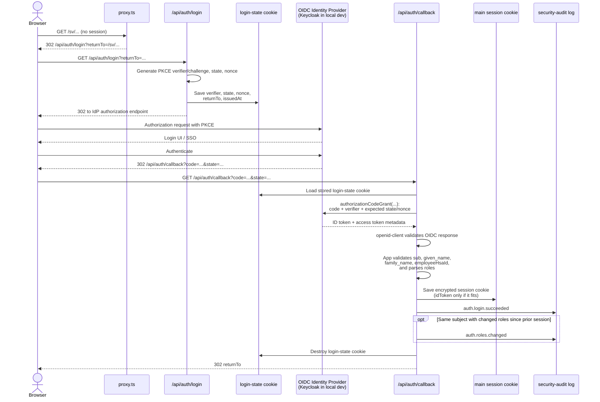

# How Auth Works

This guide is for developers and security reviewers tracing browser sessions,
MCP authentication, request protection, and security-audit evidence. Use it to
understand the trust boundaries and diagnose authentication failures.

For setup and related contracts:

- For local Keycloak, integration-test CI dependency, test setup, and
  env-var reference, see
  [auth-developer-workflow.md](../development/auth-developer-workflow.md).
- For application role and permission decisions, see
  [behörigheter.md](../governance/behörigheter.md).
- For the production OIDC provider integration contract, see
  [oidc-identity-provider-integration.md](../integrations/oidc-identity-provider-integration.md).
- For HSA-id syntax, see [hsa-id.md](../reference/hsa-id.md).

## Current auth architecture in the app

- [`proxy.ts`](../../proxy.ts) is the front door. Auth is always on, so it:
  allows public paths, redirects unauthenticated browser page requests to
  `/api/auth/login`, and returns `401` for unauthenticated REST requests. It
  passes `/api/mcp` to the route-owned enablement and Bearer boundary.
- Public REST operations are declared individually in
  `lib/http/route-security-policy.ts` and are limited to the implemented
  authentication operations, health and readiness probes, and anonymous CSP
  reporting. Production and prodlike Nginx edges additionally restrict
  readiness to configured probe
  networks; its application-level public classification supports direct local
  development and unauthenticated monitoring after that edge decision. An
  unknown URL under `/api/auth` is not implicitly public. The authentication
  error page, reviewed Next.js framework resources and metadata routes, and
  exact repository-owned public asset paths remain separate proxy bypasses. The
  proxy matcher itself skips only those framework, metadata, and exact public
  asset paths. All other paths, including dynamic page and API paths containing
  dots, enter the authentication boundary. The generated HSA Swagger files
  remain public assets. The public
  `/api-docs/hsa-person-lookup/` route redirects to the generated
  `index.html` without requiring a session.
- Browser sign-in uses two separate `iron-session` cookies:
  a short-lived login-state cookie from
  [`lib/auth/login-state.ts`](../../lib/auth/login-state.ts) and the main
  encrypted session cookie from
  [`lib/auth/session.ts`](../../lib/auth/session.ts).
- `/api/auth/login` and `/api/auth/callback` use
  [`openid-client`](https://github.com/panva/openid-client) for OIDC
  discovery, the authorization-code exchange, PKCE handling, and OIDC
  validation.
- `/api/auth/me` exposes only safe session fields to the UI. It never returns
  raw tokens, and expired browser sessions are reported as unauthenticated.
- `POST /api/auth/logout` destroys the local session and, when the discovered IdP
  advertises it, redirects through the IdP `end_session_endpoint`.
- `/api/mcp` uses Bearer JWTs instead of the browser session cookie. Token
  validation happens in [`lib/auth/mcp-token.ts`](../../lib/auth/mcp-token.ts).
- [`lib/auth/audit.ts`](../../lib/auth/audit.ts) writes structured security events
  to the process log stream.

### Browser login flow

<!-- markdownlint-disable MD013 -->

<!-- markdownlint-enable MD013 -->

- The redirect into `/api/auth/login` is usually triggered by `proxy.ts`, not
  by the page itself.
- The login-state cookie is separate from the main session cookie and has a
  much shorter lifetime. Its only job is to carry the PKCE verifier, `state`,
  `nonce`, `returnTo`, and `issuedAt` across the IdP round-trip.
- If `/api/auth/callback` cannot read that login-state cookie, browser
  navigations are redirected to `/auth/error` instead of seeing raw JSON.
  JSON clients that explicitly ask for `application/json` still receive a
  structured error. The server log includes sanitized diagnostics for TLS,
  Secure-cookie handling, callback host configuration, and the stable
  `login_state_cookie_missing` code.
- Browser error redirects use the public origin from `AUTH_OIDC_REDIRECT_URI`,
  not the inbound request URL. This keeps failed callback paths from exposing
  internal bind hosts such as `0.0.0.0:3000` when standalone Next.js runs
  behind nginx or another reverse proxy.
- In [`app/api/auth/callback/route.ts`](../../app/api/auth/callback/route.ts),
  the callback URL is rebuilt from the configured public redirect URI before
  the code exchange. This avoids host/origin mismatches when Next.js is
  running behind a proxy or under a different bind address.
- After `openid-client` validates the OIDC response, app code still requires
  `sub`, `given_name`, `family_name`, and `employeeHsaId`. Missing or invalid
  claims fail the login.
- Browser-role parsing uses `AUTH_OIDC_ROLES_CLAIM`, defaulting to `roles`.
  It retains and deduplicates exact `Reviewer`, `Admin`, and `PrivacyOfficer`
  entries in an array, ignoring unknown or malformed entries. A non-array
  grants no roles. For assignment-based authoring rights, see the
  [permission model](../governance/behörigheter.md).
- The stored session is intentionally small: `sub`, `hsaId`, name fields,
  verified email when available, roles, and `accessTokenExpiresAt`.
  The raw access token is not stored. The raw ID token is stored only when it
  fits within the cookie budget, because it is used only as an
  `id_token_hint` during logout.
- The main session cookie is `HttpOnly`, `SameSite=Lax`, scoped to `/`, and
  `Secure` in both `prod` and `local-prod`, with no `Domain` attribute.
  Both cookies use an effective `__Host-` name in these secure builds,
  following [OWASP cookie-prefix guidance](https://cheatsheetseries.owasp.org/cheatsheets/Session_Management_Cheat_Sheet.html#cookie-name-prefixes).
  The default session name is `__Host-kravhantering_session`; its login-state
  name is `__Host-kravhantering_session_login`. Custom unprefixed names receive
  `__Host-` automatically, including explicit values in existing deployments.
  An already-prefixed name is preserved. HTTP `dev` keeps the unprefixed
  default or a valid custom name that does not require Secure.

The browser session is stateless. There is no refresh-token flow, token
introspection, or front-channel or back-channel logout receiver. IdP account
or role changes therefore do not immediately invalidate the encrypted session.
A fresh login updates its claims. The callback derives `accessTokenExpiresAt`
from the token response's positive `expires_in`, falling back to five minutes
when unavailable; the cookie TTL can end the session earlier.

### Cookie-name migration

Only the effective cookie names are accepted for authentication and login
state. A differently named legacy cookie is never read as a fallback, copied,
or upgraded, even when both names arrive in the same request. Users whose
cookie name changes must complete a fresh OIDC login. A login already in
progress under the legacy name reaches `login_state_cookie_missing` and must
restart using the error page's retry link. An unchanged valid prefixed name
requires no additional name-based reset.

Legacy cookies expire naturally; the application does not refresh or delete
them. Session TTL is `AUTH_SESSION_TTL_SECONDS` (default eight hours),
and login-state TTL is five minutes. Browser Max-Age subtracts 60 seconds
from each TTL. Access-token expiry can end a session sooner.

Renaming does not revoke legacy cookies. An older instance may still accept
them during a mixed-version rollout or rollback. Coordinate the cutover
across every instance serving the host, drain older instances together, and
plan for renewed login and interrupted login retries. A rollback can restore
acceptance of unexpired legacy sessions; do not treat renaming as revocation.

### Session and logout flow

- [`components/AuthExpiryGuard.tsx`](../../components/AuthExpiryGuard.tsx)
  calls `/api/auth/me` on mount. It warns signed-in users two minutes before
  `expiresAt`, lets them authenticate again immediately, and redirects through
  `/api/auth/login?returnTo=<current-path>` when the session expires.
- `/api/auth/me` returns HTTP `200` with `authenticated: false` for a missing
  or expired session. For a valid session it returns `authenticated: true`,
  `sub`, `hsaId`, `givenName`, `familyName`, `name`, `email?`, `roles`, and
  `expiresAt`. It never returns the raw ID token or raw access token.
- `lib/http/api-fetch.ts` emits a browser auth-required event when same-origin
  API calls return `401`, so unexpected invalid-session responses use the same
  sign-in flow instead of leaving the user on a stale page.
- `POST /api/auth/logout` is the real logout operation. It:
  checks same-origin and `X-Requested-With`, records `auth.logout`,
  destroys the session cookie, discovers the IdP end-session URL when
  possible, and returns `{ redirectTo }` for clients requesting
  `application/json`, or a `302` redirect otherwise. If discovery or building
  the end-session URL fails, logout falls back to the configured post-logout
  URI; the local session is still destroyed.
- `AuthMenu` follows the redirect target only for successful logout responses.
  Failed logout attempts keep the user on the current page and show an inline
  alert.
- `GET /api/auth/logout` is intentionally non-destructive. It only redirects
  to the configured post-logout URI and does not clear the session.
- If a session cookie is present but past `accessTokenExpiresAt`,
  `proxy.ts` records `auth.session.expired` and treats the request as
  signed out. Invalid or unreadable cookies still record
  `auth.session.rejected`.

### MCP bearer-token flow

<!-- markdownlint-disable MD013 -->
```mermaid
sequenceDiagram
    actor Client
    participant Proxy as proxy.ts
    participant Route as /api/mcp
    participant Verify as verifyMcpBearerToken()
    participant JWKS as JWKS endpoint
    participant Audit as security-audit log
    participant Attach as attachVerifiedActor()
    participant DB as SQL Server
    participant Handler as MCP JSON-RPC handler

    Client->>Proxy: POST /api/mcp with Authorization Bearer JWT
    Proxy->>Route: Forward request
    Route->>Route: Resolve optional MCP configuration
    alt MCP is disabled
        Route-->>Client: Empty 404 without auth, audit, discovery, or database work
    else Invalid enabled MCP configuration
        Route->>Audit: auth.token.rejected
        Route-->>Client: Generic JSON-RPC 500 + WWW-Authenticate: Bearer
    else MCP is enabled and configured
        Route->>Verify: verifyMcpBearerToken(request)
        Verify->>Verify: Require Bearer header and valid auth configuration
        opt Header and configuration accepted
            Verify->>JWKS: Discover JWKS URI and fetch/cache signing keys
            JWKS-->>Verify: JWK set or dependency failure
            Verify->>Verify: Verify signature, issuer, audience and time bounds
            Verify->>Verify: Validate at+jwt, exp, sub, iat,<br/>client_id, optional azp, scope, HSA-id; parse roles
        end
        alt Missing or invalid token
            Verify->>Audit: auth.token.rejected
            Route-->>Client: JSON-RPC 401 + WWW-Authenticate: Bearer
        else Base auth configuration failure
            Verify->>Audit: auth.token.rejected with allowlisted reason
            Route-->>Client: Generic JSON-RPC 500 + WWW-Authenticate: Bearer
        else Discovery or remote JWKS unavailable
            Verify->>Audit: auth.token.rejected with allowlisted reason
            Route-->>Client: Generic JSON-RPC 503 + WWW-Authenticate: Bearer
        else Token accepted
            Verify->>Audit: auth.mcp.token.accepted
            Verify-->>Route: Verified actor
            Route->>Attach: attachVerifiedActor(request, actor)
            Route->>DB: Acquire request-scoped database
            Route->>Handler: Continue with JSON-RPC handling
            Handler-->>Client: JSON-RPC response
        end
    end
```
<!-- markdownlint-enable MD013 -->

- `MCP_CLIENT_ID` is the MCP enablement switch and the exact approved OAuth
  service-client identity. When it is empty, `/api/mcp` returns `404` before
  inspecting the Bearer header or reaching discovery, audit, runtime settings,
  SQL Server, MCP transport, or requirements-service work.
- Enabled MCP configuration is validated before database acquisition. Invalid
  configuration also fails readiness and uses the stable, redacted JSON-RPC
  authentication-configuration response.
- Missing or malformed Bearer headers return JSON-RPC `401` with
  `Missing Bearer token.`; rejected tokens return `Invalid Bearer token.`.
  Both use `WWW-Authenticate: Bearer`.
- The MCP authentication boundary maps invalid credentials to `401`, local
  authentication configuration failures to `500`, and unavailable discovery
  or remote JWKS dependencies to `503`. Every response uses a stable generic
  message and retains `WWW-Authenticate: Bearer`; underlying verifier, issuer,
  network, JWKS, and configuration messages remain server-side.
- `verifyMcpBearerToken()` uses OIDC discovery metadata to read the issuer's
  `jwks_uri` and caches the resulting `RemoteJWKSet`.
- JWT verification checks signature, issuer and audience with a 30-second
  clock tolerance. Production requires HTTPS JWKS; local build targets allow
  HTTP for the development provider. It also requires protected-header
  `typ: at+jwt`,
  numeric `exp` and `iat`, non-blank `sub`, and top-level `client_id` equal
  to `MCP_CLIENT_ID`. Optional `azp` must match too; it cannot substitute for
  `client_id`. The token must contain every scope in
  `AUTH_MCP_REQUIRED_SCOPES` in the top-level space-separated `scope` claim.
  Current age and declared `exp - iat` lifetime are bounded by
  `AUTH_MCP_TOKEN_MAX_AGE_SECONDS` (default `300`, allowed `60`–`900`).
- The required MCP identity is `employeeHsaId`. Values must match the HSA-id
  syntax documented in [hsa-id.md](../reference/hsa-id.md).
- The verifier reads MCP roles only from `AUTH_MCP_ROLES_CLAIM` (default
  `roles`). A missing or empty array grants no roles; any non-array, non-string,
  duplicate, or unknown entry makes the entire claim grant no roles. Browser
  role parsing is more permissive, as described above. On success the verifier records
  `auth.mcp.token.accepted`, attaches the verified actor, and only then permits
  database acquisition and requirements-service construction.

### Security controls and audit events

- Identity is derived only from the verified iron-session cookie (browser
  flow) or a verified `Authorization: Bearer` JWT (MCP flow). The app does
  not accept `x-user-id` or `x-user-roles` request headers as a stand-in
  for a logged-in user. `proxy.ts` strips both headers from requests it
  forwards to page and API handlers.
- Cookie-authenticated mutating requests go through the same-origin check in
  [`lib/auth/csrf.ts`](../../lib/auth/csrf.ts). They must present a same-origin
  `Origin` or `Referer` and `X-Requested-With: XMLHttpRequest`.
  `lib/auth/csrf.ts` and `proxy.ts` compare only the URL origin
  (scheme + host + port) of `AUTH_OIDC_REDIRECT_URI`; path and query values are
  ignored. `X-Forwarded-Proto` and `X-Forwarded-Host` are ignored for this
  check.
  `proxy.ts` enforces this centrally for mutating REST API requests after
  authentication has succeeded, excluding `/api/mcp`, which uses Bearer-token
  auth, and the dedicated anonymous CSP-report operation. For a mutating
  REST URL with a trailing slash, authentication runs
  first and returns `401` when required, then CSRF validation returns `403`
  when required, and only a request that passes both checks receives the
  canonical `308` redirect. The shared REST operation registry applies each
  operation's response cache policy to proxy-generated `401`, `403`, `405`, and
  `308` responses and to every approved wrapper exit. Unknown REST operations
  use the conservative session, mutation-CSRF, sensitive, `no-store` baseline
  before Next.js resolves the final status.
  Route-level checks remain as defense-in-depth through
  `lib/http/secure-mutation-route.ts`. App-owned `POST`, `PUT`, `PATCH`, and
  `DELETE` REST routes build `RequestContext`, require an authenticated actor,
  validate params and JSON bodies, run a declared `admin`, `requirements`, or
  `custom` authorization policy, and only then call route-specific handler
  work. `/api/auth/logout` uses
  `secureLogoutMutationRoute` because logout is an auth endpoint with CSRF and
  audit but no business authorization policy.
  `/api/mcp` uses Bearer JWT verification and MCP tool schemas instead of
  the REST mutation wrapper; anonymous CSP telemetry has its own wrapper.
- Authenticated page responses, including dynamic paths containing dots, get a
  per-request CSP nonce from `proxy.ts`.
- Authentication events include `auth.login.succeeded`, `auth.login.failed`,
  `auth.logout`, `auth.roles.changed`, `auth.session.expired`,
  `auth.session.rejected`, `auth.token.rejected`, and
  `auth.mcp.token.accepted`. CSRF and authorization failures use
  `auth.csrf.rejected` and `auth.authorization.denied`. The complete event
  vocabulary is defined by `SecurityEventName` in
  [`lib/auth/audit.ts`](../../lib/auth/audit.ts).
- Rejected MCP authentication events contain an allowlisted reason code only.
  They exclude token and claim values, issuer details, dependency text, and
  runtime error names.

### Audit event stream

- Auth audit events are emitted as one JSON object per line through
  `console.info(...)` in [`lib/auth/audit.ts`](../../lib/auth/audit.ts), tagged
  with `channel: "security-audit"`.
- Each record contains:
  `ts`, `event`, `outcome`, `actor`, `request`, and optional `detail`.
- `actor` identifies the source (`oidc`, `mcp`, or `anonymous`) and may also
  include `sub`, `hsaId`, and `clientId`.
- `request` includes the HTTP method and path without query strings or
  fragments, and may also include `requestId`, `userAgent`, and a validated
  `ip` when the trusted edge provides one. `ip` is derived only from the single
  `X-Kravhantering-Client-IP` value produced by the bundled Nginx boundary.
  The application ignores raw `Forwarded` and `X-Forwarded-For` input and
  rejects malformed values or lists. See
  [Access Logging and Client IP Trust](../operations/access-log-and-client-ip-trust.md).
- `detail` is optional and is redacted defensively so top-level fields such as
  tokens, secrets, authorization codes, PKCE verifiers, `state`, and `nonce`
  are not emitted. Callers must still exclude sensitive values themselves:
  the redactor checks top-level key names, not arbitrary text contents.
  Redaction breadcrumbs use the same `security-audit` channel
  and carry `breadcrumb: "detail-key-redacted"` instead of an audit `event`.
- Requirements authorization denials and sensitive business mutations use the
  same stream. Their `detail` payloads carry stable identifiers, counts, and
  action names only; free-text requirement content, motivations, and suggestion
  text are not emitted.
- Application action-log rows in `action_audit_events` are separate from
  this stream. They are database records for successful app-owned mutations and
  authorization denials, include request/correlation IDs and optional validated
  client IP, and can be viewed by Admins at `/{locale}/admin/audit-log`. See
  [Application Action Log](./audit-log.md) for scope and privacy handling.
- Authorization-denial rows are required evidence. When such a row cannot be
  persisted, protected work remains denied and REST or MCP returns only a
  generic internal error. The security stream also receives
  `auth.authorization.denied.audit_failed` with redacted operational
  diagnostics; that fallback does not replace the required database evidence.
- The audit writer is intentionally transport-free: it does not push directly
  to Kafka, a webhook, a SIEM, or a database. It writes structured events to
  the process log stream and does not buffer them in the app.
- To stream audit events to another system, configure your hosting platform's
  log pipeline to select records where `channel == "security-audit"` and
  forward them to the desired sink, for example a centralized log store, a
  SIEM, a message queue, or a dedicated audit pipeline.

## Network request limits

See [export and report admission](../operations/export-report-admission.md) for
covered routes, shared actor limits, distinct 429/503 reasons, English and
Swedish messages, privacy handling and coordinated operational tuning.

## Anonymous CSP telemetry

The registry admits native `POST /api/security/csp-reports` without reading a
session or requiring the application mutation header. Even attached cookies are
ignored for report identity. The dedicated wrapper accepts only this operation.
`security.csp.violation_reported` uses an anonymous actor and fixed request
metadata; `outcome: success` means accepted telemetry, not a successful attack.
Admin settings retain normal authorization and CSRF. See
[CSP reporting](../operations/csp-reporting.md).
