<!-- AUTO-GENERERAD — redigera inte manuellt. Kör: npm run generate:guide -->
# Kravhantering — Användarguide

> Guiden genererades automatiskt av Playwright 2026-06-25.
> Alla skärmdumpar visar det svenska gränssnittet.

## Innehållsförteckning

1. [Översikt och navigering](#översikt-och-navigering)
2. [Kravbiblioteket](#kravbiblioteket)
3. [Skapa ett nytt krav](#skapa-ett-nytt-krav)
4. [Kravdetaljer och statusövergångar](#kravdetaljer-och-statusövergångar)
5. [Kravunderlag](#kravunderlag)
6. [Avsteg](#avsteg)
7. [Import av krav](#import-av-krav)
8. [Förbättringsförslag](#förbättringsförslag)
9. [Administrationscenter](#administrationscenter)
10. [Taxonomi och statusar](#taxonomi-och-statusar)
11. [Rapporter](#rapporter)

## Översikt och navigering

### Startsida — Kravbiblioteket

Kravhantering öppnas i Kravbiblioteket som är programmets centrala nav. Härifrån
kan du söka, filtrera och hantera alla krav i systemet.

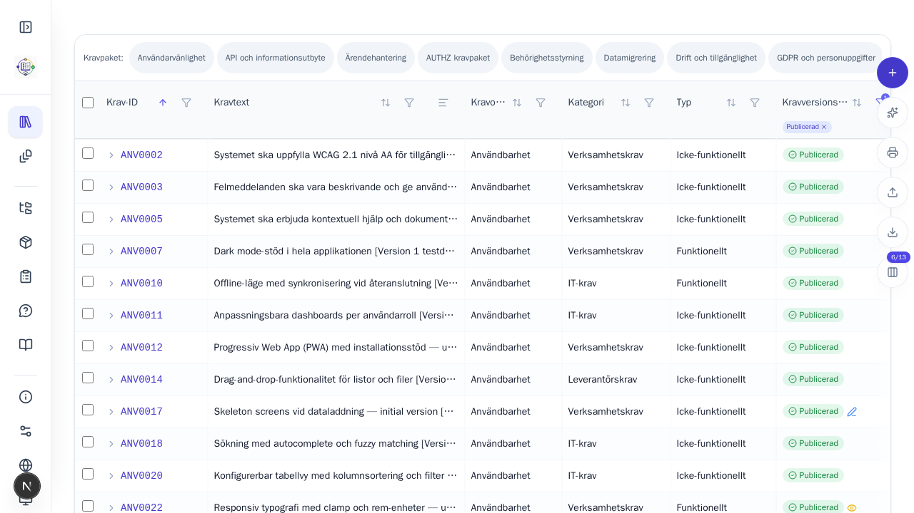

### Sidnavigering

Sidnavigeringen ger åtkomst till huvuddelarna: **Kravbiblioteket**,
**Kravunderlag**, verktygen i **Kravbiblioteksförvaltning**,
**Admininställningar**, språkväljare och tema (ljust/mörkt läge).

### Språkväljare

Applikationen stödjer svenska och engelska. I bilden har engelska valts, vilket
gör att alla gränssnittstexter — knappar, etiketter, rubriker och navigering —
visas på engelska. Observera att kravegenskaper som kravtext och
acceptanskriterier inte lokaliseras av systemet; dessa skrivs på det språk som
användaren själv väljer för varje krav.

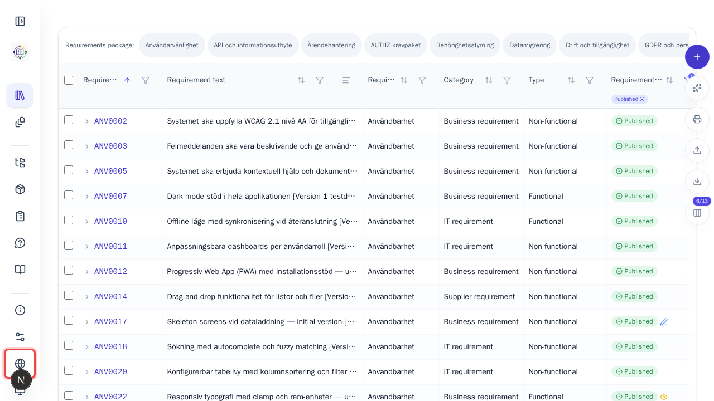

## Kravbiblioteket

### Kravbiblioteket — Översikt

Kravbiblioteket listar alla krav i en sorterbar och filtrerbar tabell. Varje rad
visar nyckeluppgifter som ID, kravtext, kravområde, status och risknivå.
Kolumnerna kan konfigureras efter behov.

### Kolumnkonfiguration

Klicka på kolumnväljaren (tabellikon) för att visa eller dölja kolumner. Du kan
anpassa vyn efter din arbetsprocess. Inställningarna sparas i webbläsaren.

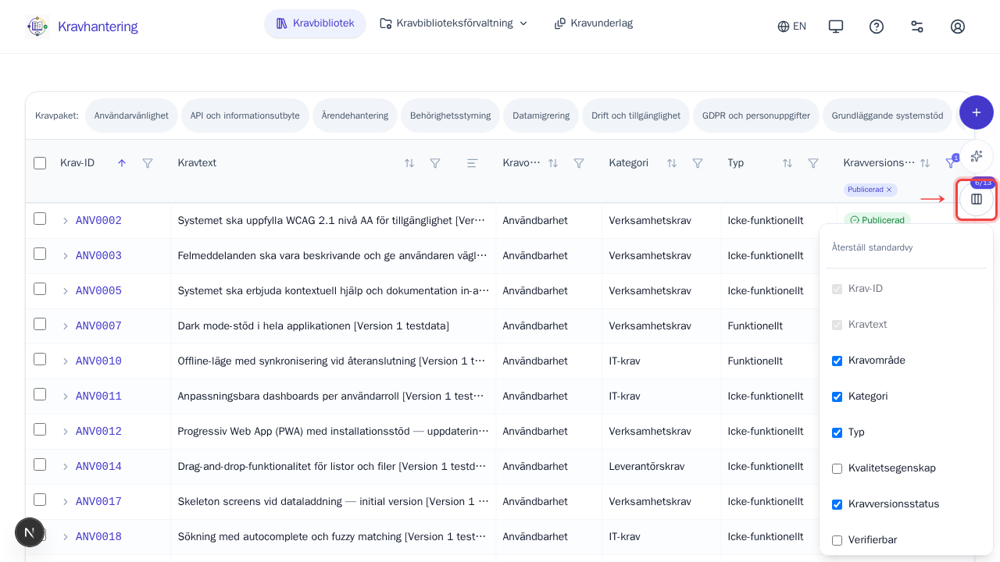

### Filtrering och sortering

Varje kolumn har en sorteringspil (↑↓) och en filterikon (▽) i kolumnrubriken.
Klicka på sorteringspilen för att växla mellan stigande och fallande ordning.
Klicka på filterikonen för att öppna ett textfält där du kan filtrera listan på
det kolumnens värde.

### Filtrering — sökfält ifyllt

Skriv in ett värde i filterfältet för att begränsa listan. Här filtreras på
Krav-ID "IDN0001" vilket visar enbart matchande krav. Tryck Enter eller klicka
utanför för att tillämpa filtret. Tryck Esc för att stänga filterfältet.

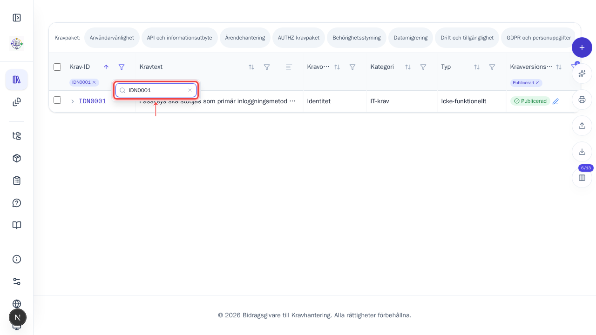

### Inline-detaljvy

Klicka på en rad i kravbiblioteket för att öppna inline-detaljvyn direkt i
tabellen. Detta är det primära arbetsflödet — du behöver inte lämna biblioteket
för att se eller hantera ett krav.

Du kan också öppna kravets detaljsida direkt via kravets stabila ID:
`http://localhost:3000/sv/requirements/IDN0001`. Lägg till versionsnumret efter
ID:t för att visa en specifik version:
`http://localhost:3000/sv/requirements/IDN0001/10`.

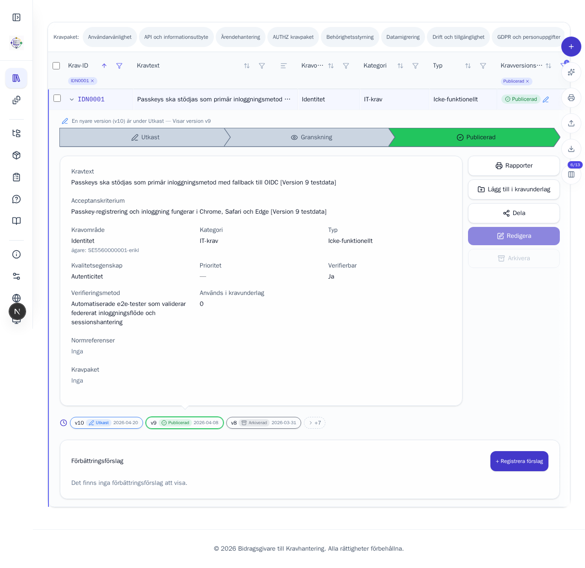

### Detaljpanelen — övre del

Varje krav har en uppsättning egenskaper som beskriver vad det ställer för krav,
hur det klassificeras och var det passar in i organisationens processer. Nedan
följer en översikt av varje egenskap och hur den stödjer kravets livscykel.

<!-- markdownlint-disable MD013 -->
| Egenskap | Beskrivning |
| --- | --- |
| **Krav-ID** | Genereras automatiskt utifrån kravområdets prefix och ett löpnummer. Det är den stabila identifieraren som används för spårbarhet i kravunderlag, rapporter och korsreferenser. Du kan inte redigera det direkt — det tilldelas när kravet skapas. |
| **Kravområde** | Grupperar krav efter domän, till exempel Integration eller Ärendehantering. Kravområdet styr ID-prefixet och avgör vilket team som ansvarar för kravet. Det måste anges när kravet skapas och kan inte ändras efteråt. |
| **Kravtext** | Den centrala beskrivningen av vad som ska uppfyllas. Det är huvudinnehållet som intressenter granskar under granskningsfasen och som blir bindande när kravet publiceras. Håll texten tydlig och testbar. |
| **Acceptanskriterier** | Mätbara villkor som måste vara uppfyllda för att kravet ska anses vara uppnått. De är viktiga vid verifiering och testning och hjälper kravgranskare att förstå den exakta avsikten bakom kravtexten. |
| **Kategori** | Klassificerar kravet som Verksamhet, IT eller Leverantör. Det underlättar filtrering i katalogen och gör det enklare att tilldela ansvar till rätt team eller intressentgrupp. |
| **Typ** | Anger om kravet är Funktionellt eller Icke-funktionellt. Båda typerna låser upp fältet för kvalitetsegenskap, men icke-funktionella krav erbjuder ett bredare urval av egenskaper från standarden ISO/IEC 25010 medan funktionella krav har en mindre delmängd. |
| **Kvalitetsegenskap** | Följer standarden ISO/IEC 25010 och låter dig klassificera krav med egenskaper som Säkerhet, Prestandaeffektivitet eller Användbarhet. Icke-funktionella krav har tillgång till hela uppsättningen egenskaper, medan funktionella krav erbjuder en mindre delmängd. Det hjälper till att prioritera och gruppera relaterade krav under granskning och implementeringsplanering. |
| **Prioritet** | Anger hur viktigt, angeläget eller kritiskt kravet är i förhållande till verksamhetens mål, nyttor, risker och intressenters behov. Högre prioritet signalerar att kravet bör granskas och följas upp noggrant. |
| **Verifierbar** | Anger om kravet kan testas. När du aktiverar detta måste du även ange en verifieringsmetod. Verifieringsmetoden används inom de kravunderlag där kravet ingår, till exempel i samband med en upphandling, ett införande eller förvaltning. |
| **Verifieringsmetod** | Beskriver exakt hur kravet ska verifieras — till exempel genom automatiserade tester, manuell inspektion eller användartester. Fältet är obligatoriskt när Verifierbar är aktiverat. Metoden tillämpas inom de kravunderlag där kravet används och ger konkret vägledning för hur verifieringen ska genomföras i varje sammanhang. |
| **Kravpaket** | Samlar krav för en specifik gruppering, till exempel mobil användning, datamigrering, integration med andra system, ärendehantering, användarvänlighet, molndrift, normal drift, hög belastning eller katastrofåterställning. Varje kravpaket har en ägare som ansvarar för kraven inom grupperingen. Kopplingen hjälper till att avgränsa kravunderlag och filtrera krav efter relevanta grupperingar. |
| **Normreferenser** | Kopplar kravet till externa standarder, lagar eller föreskrifter. Dessa kopplingar stödjer efterlevnadsrevision och gör det möjligt att spåra varje krav tillbaka till sitt rättsliga eller normativa ursprung. |
| **Kravversionsstatus** | Visar aktuell kravversionsstatus — Utkast, Granskning, Publicerad eller Arkiverad. Statusen hanteras automatiskt genom arbetsflödesåtgärder och styr vilka operationer som är tillgängliga. Se avsnitten Visuell processöversikt och Kravets process nedan för detaljer. |
<!-- markdownlint-enable MD013 -->

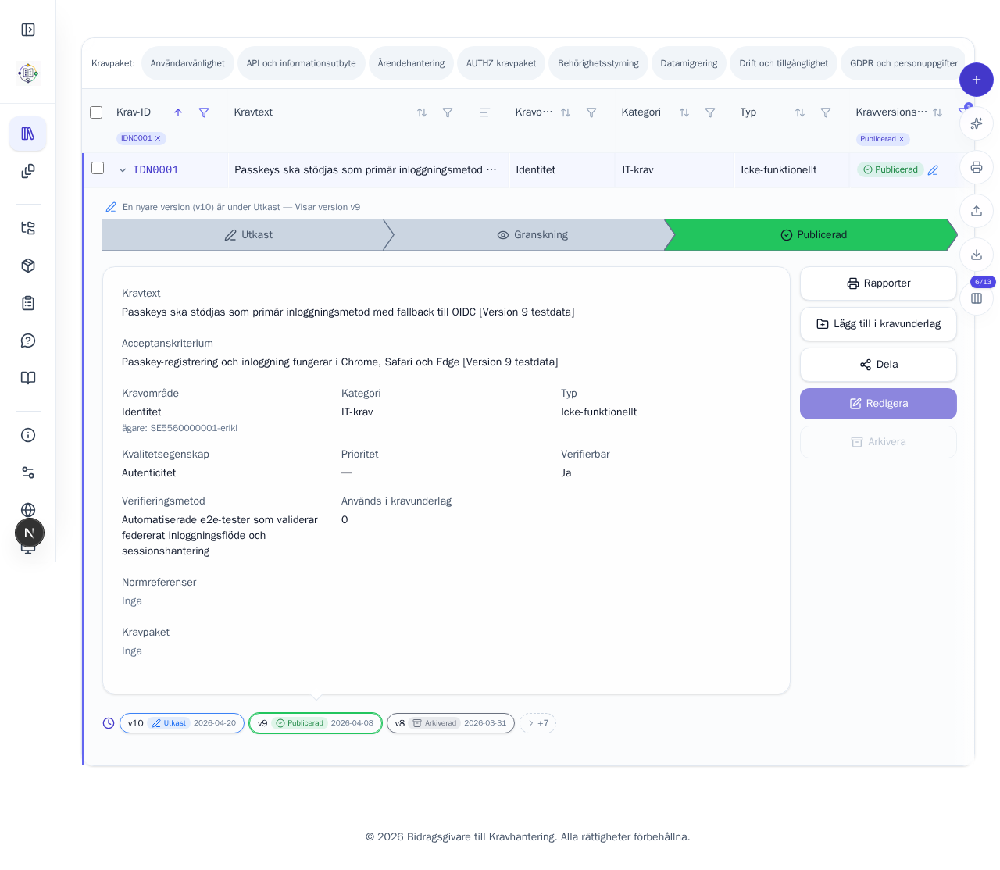

### Versionshistorik

Redigering av ett publicerat krav samt återskapande av ett arkiverat krav skapar
en ny version. Versionshistoriken visar alla versioner med tidsstämplar, status
och vem som gjorde ändringen. Du kan navigera till äldre versioner för att se
den historiska lydelsen.

När ett krav har fler versioner än vad som ryms i vyn visas en knapp med "+N"
som visar hur många dolda versioner det finns. Klicka på den för att expandera
och se alla versioner.

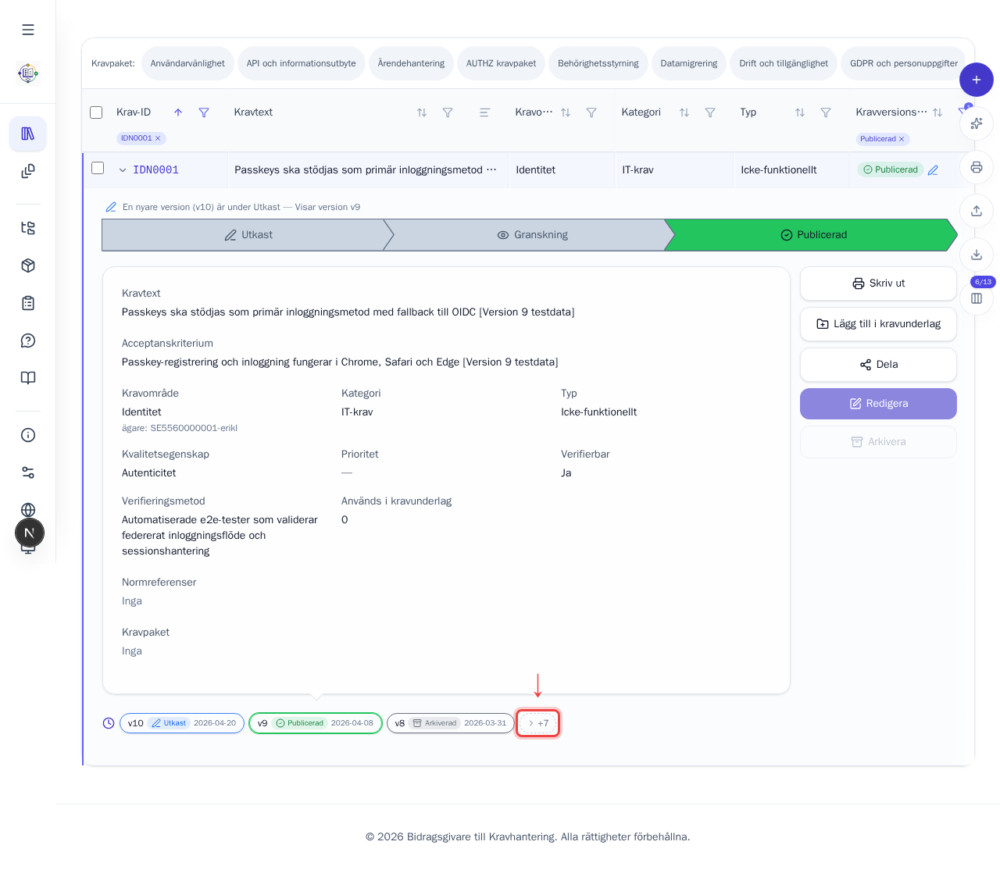

### Versionshistorik — expanderad lista

När versionshistoriken är expanderad visas alla versioner som versionspillar i
rad. Den aktuella versionen är markerad. Klicka på valfri pil för att navigera
till den versionen.

### Versionshistorik — historisk version

Klicka på en versionspil för att visa den versionen av kravet. Den valda
versionen markeras och kravtexten uppdateras för att visa hur kravet såg ut vid
det tillfället. Användbara för revision och spårbarhet.

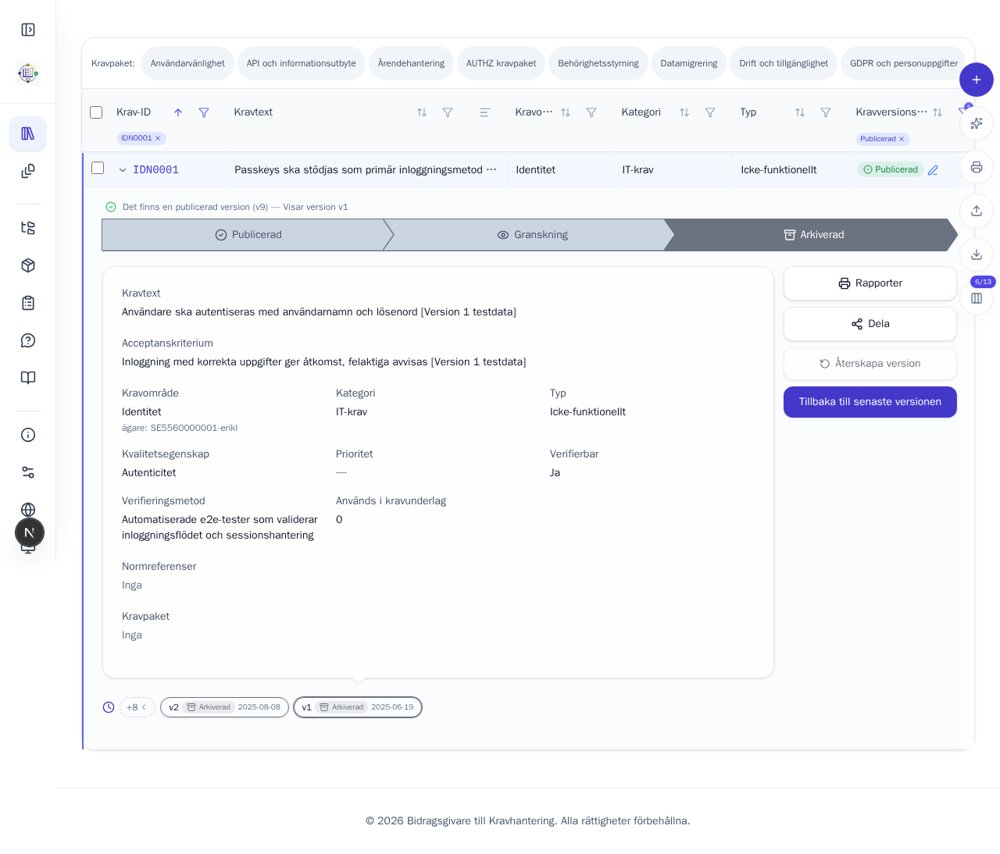

## Skapa ett nytt krav

### Skapa krav — tomt formulär

Navigera till "Skapa nytt krav" via knappen i kravbiblioteket. Formuläret
innehåller fält för alla kravegenskaper: kravtext, acceptanskriterier,
kravområde, kategori, typ, risknivå, kvalitetsegenskaper, verifieringsmetod,
normreferenser och kravpaket. När kravpaket visas i den interaktiva vyn kan du
hovra över namnet för att läsa kravpaketets syfte och avgränsning.

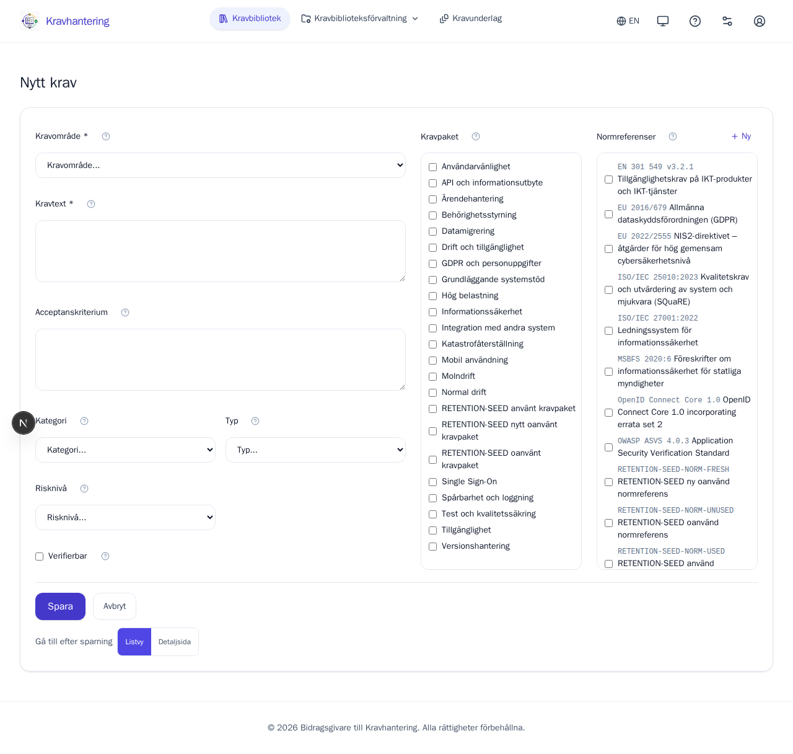

### Skapa krav — ifyllt formulär

Fyll i kravtext och acceptanskriterier. Välj sedan kravområde, kategori, typ och
risknivå i respektive rullgardinsmeny. Alla obligatoriska fält markeras med
asterisk (*) och formuläret visar en kort notis om markeringen. Klicka på
"Spara" när formuläret är komplett.

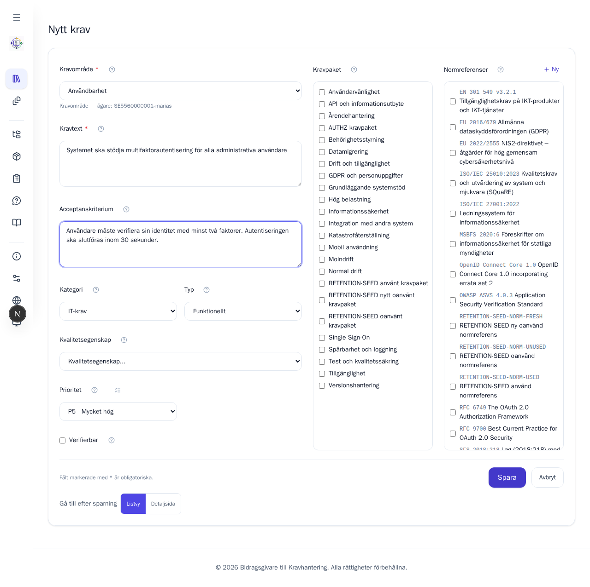

### Krav skapat

Efter att formuläret sparats återgår applikationen till kravbiblioteket med det
nyss skapade kravet öppet i inline-detaljvyn. Kravet startar i status
**Utkast**.

## Kravdetaljer och statusövergångar

### Statusstegare

Statusstegaren visar kravets position i livscykeln: **Utkast** → **Granskning**
→ **Publicerad** → **Arkiverad**. Den aktuella statusen är markerad. Knappar för
statusövergångar visas intill stegaren.

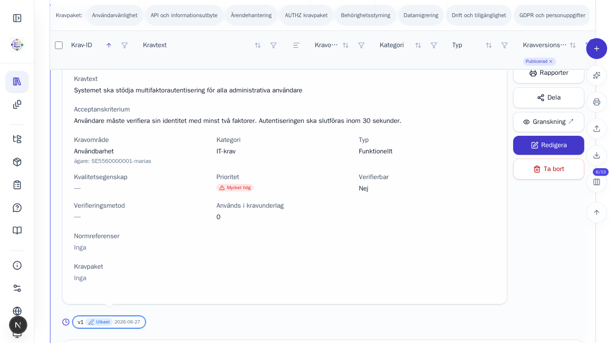

### Status: Utkast

Ett krav i **Utkast**-status har knappen "Granskning ↗" tillgänglig. Klicka på
den för att skicka kravet till granskning. Det innebär att kravet är klart för
kollegial granskning och godkännande.

### Status: Granskning

Kravet är nu i **Granskning**-status. Stegaren uppdateras för att reflektera
detta. En kravgranskare ser knappen "Publicera ↗" för att godkänna och publicera
kravet, och "← Utkast" för att återföra det till utkastläge om ändringar behövs.

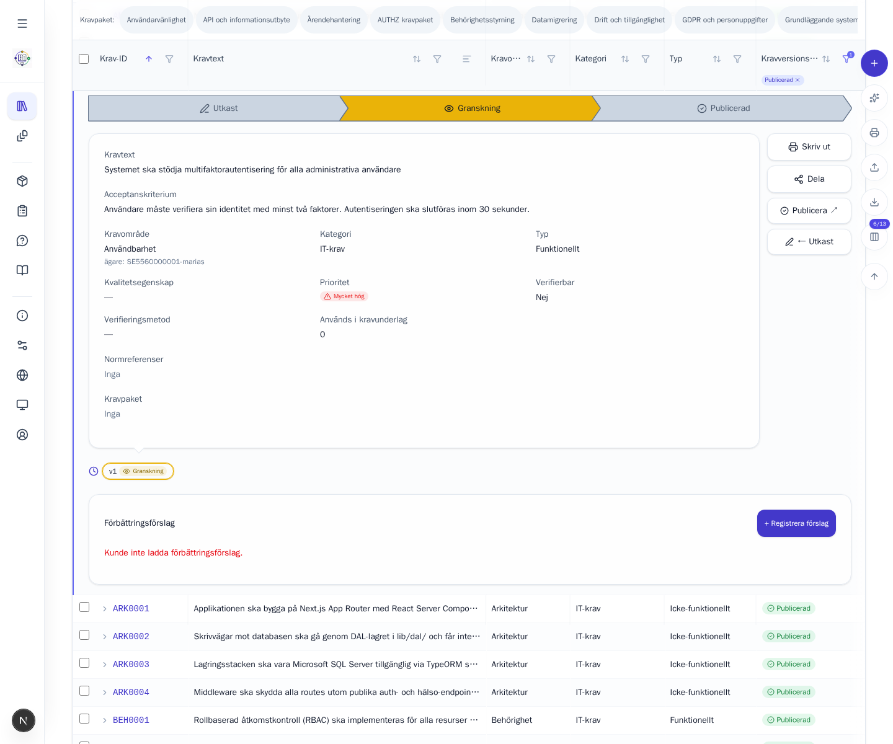

### Publicera — bekräftelsedialog

Innan kravet publiceras visas en bekräftelsedialog. Klicka på "Bekräfta" för att
slutföra publiceringen, eller "Avbryt" för att avbryta.

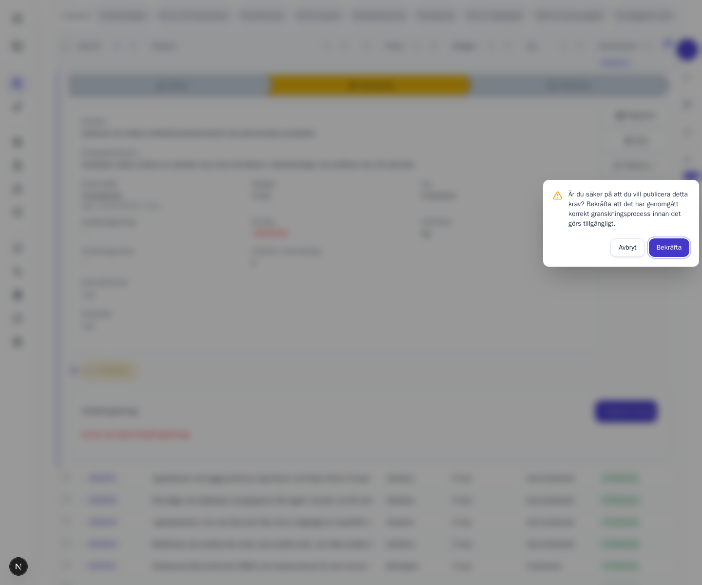

### Status: Publicerad

Kravet är nu **Publicerat** och utgör den aktiva, godkända versionen. Vid
redigering av ett Publicerat krav skapas en ny Utkast-version medan den
publicerade versionen förblir aktiv tills det nya utkastet genomgått
granskningsprocessen.

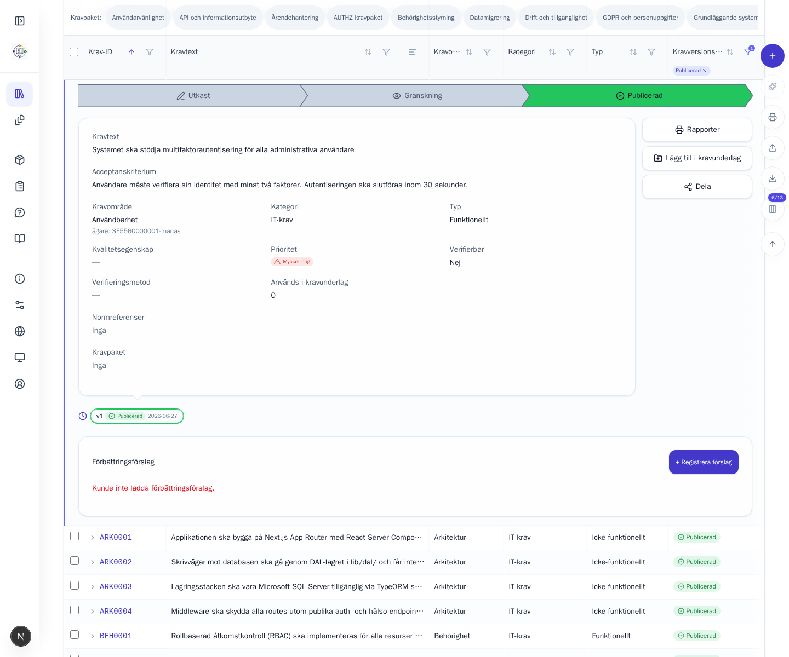

## Kravunderlag

Ett **kravunderlag** samlar en uppsättning krav som hör ihop inom ramen för ett
specifikt projekt, en leverans eller ett verksamhetsområde. Underlaget fungerar
som en spårbar enhet — du kan följa användningsstatus per krav, begära avsteg
och generera granskningsrapporter direkt från underlaget.

### Kravunderlagslista

Listan visar underlagens namn, ID, kravunderlagets livscykelstatus och
genomförandeform. Klicka på ett underlag för att se dess detaljer.

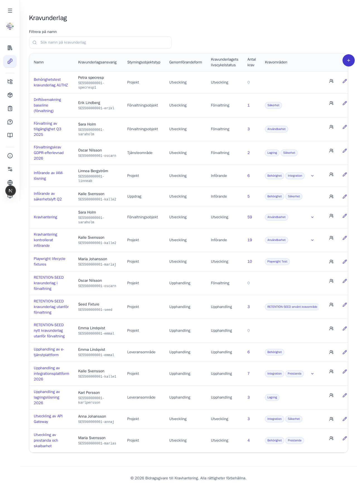

### Sökning bland kravunderlag

Filtrera kravunderlag genom att skriva i sökrutan. Listan uppdateras i realtid.

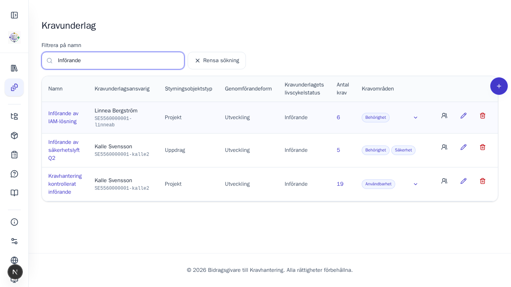

### Skapa nytt kravunderlag

Klicka på **"Nytt kravunderlag"** för att öppna dialogrutan för nytt
kravunderlag. Ange ett namn — ett unikt ID (slug) genereras automatiskt.
Kravunderlag används för att samla krav som hör till ett specifikt projekt eller
leverans.

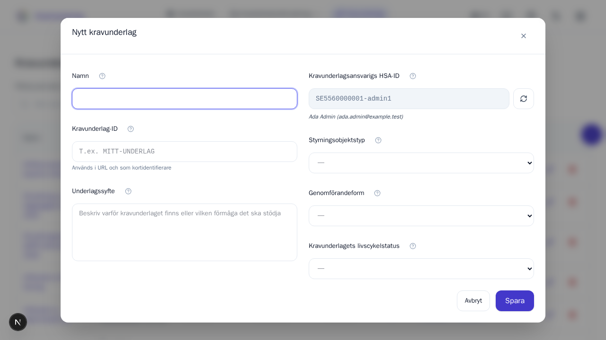

### Kravunderlagsdetalj — delad vy

Kravunderlagsdetaljsidan har en delad layout: **vänster panel** har tabbarna
**Krav i underlaget** och **Behovsreferenser** i listans rubrik, och **höger
panel** har tabbarna **Tillgängliga krav** och **Kravurvalsfrågor** i samma typ
av sticky rubrik. I tabben för krav visas både bibliotekskrav och eventuella
kravunderlagets unika krav med deras användningsstatus. Knapparna till höger i
rubriken byts när du växlar tabb: tabben för krav har kravtabellens verktyg,
medan tabben för behovsreferenser har åtgärden för att skapa en ny referens.
Knappen **"Nytt unikt krav"** skapar krav som bara finns i detta kravunderlag.
Klicka på en rad för att se kravets fullständiga detaljer.

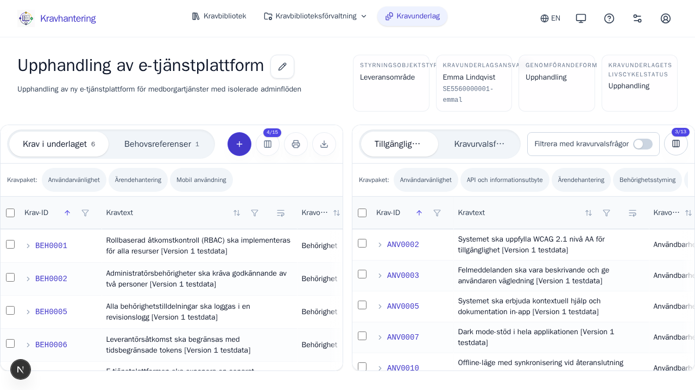

### Välj krav att lägga till

Markera ett eller flera krav i den högra panelen "Tillgängliga krav". Knappen
**"Lägg till valda (N)"** visas i panelens rubrik när minst ett krav är
markerat.

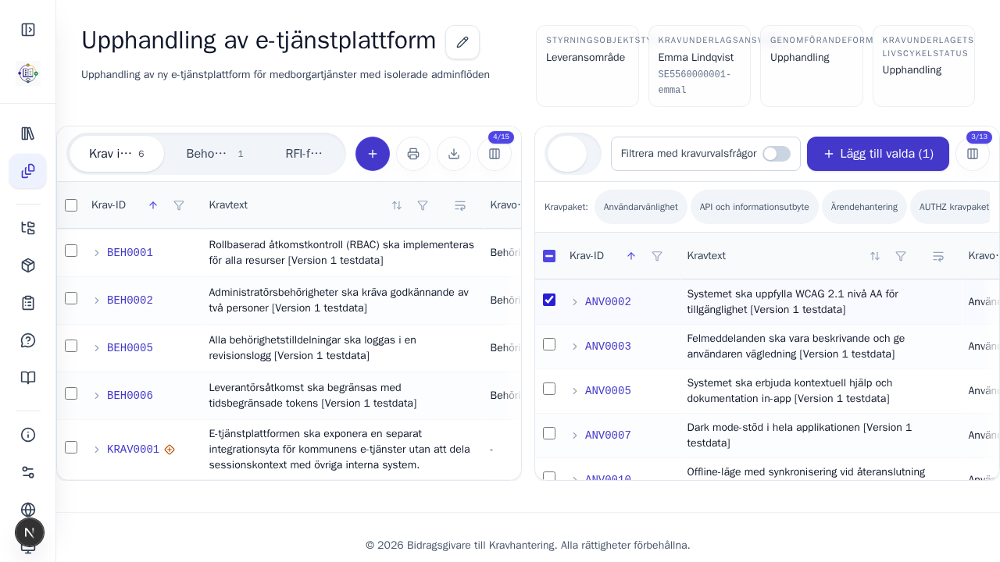

### Lägg till krav — behovsreferens

När du lägger till krav i ett kravunderlag kan du koppla en **behovsreferens**
till kravtillämpningen. En behovsreferens är en fritext som förklarar varför
kravet behövs i just det här kravunderlaget och kan ge stöd för när kravet ska
verifieras — t.ex. ett ärendenummer, ett mål eller ett avsnitt i ett
kravunderlag. Du kan välja en befintlig referens eller skriva en ny med valfri
beskrivning. I efter hand hanteras registret i tabben **Behovsreferenser**,
medan kolumnen **Behovsreferens** används för att välja eller rensa befintliga
referenser i tabellen.

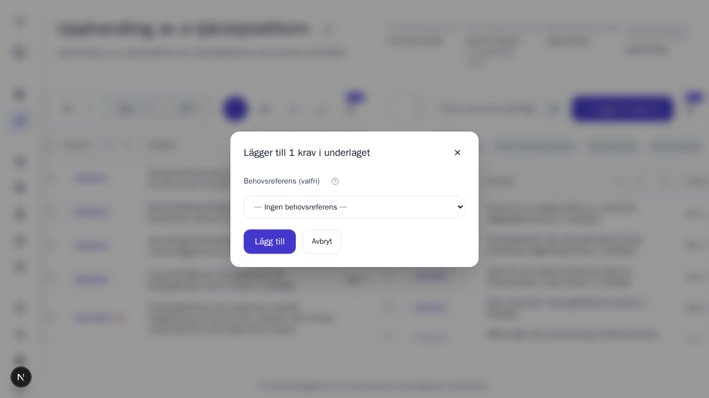

### Redigera kravunderlag

I dialogrutan kan du uppdatera underlagets namn, underlagssyfte, kravunderlagets
livscykelstatus, genomförandeform och styrningsobjektstyp. Klicka på "Spara" för
att tillämpa ändringarna.

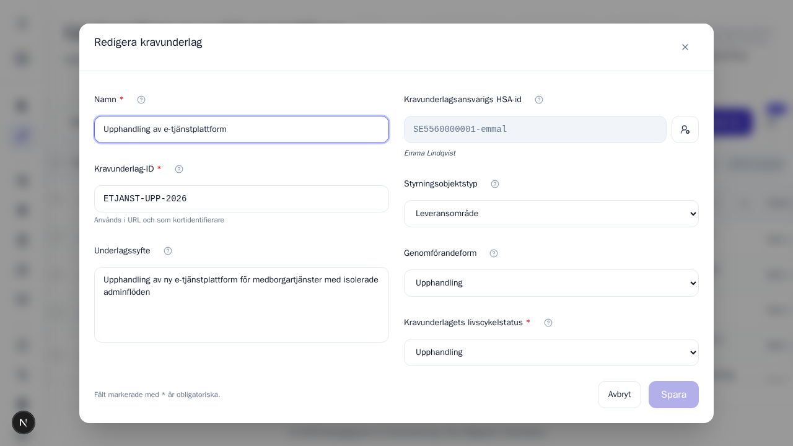

## Avsteg

Ett **avsteg** dokumenterar att ett krav i ett kravunderlag inte kan uppfyllas
fullt ut som specificerat, och varför. Avstegsprocessen är trestegsbaserad:
**Utkast** → **Granskning begärd** → **Beslutad** (godkänd eller avslagen).
Nedan visas varje steg i processen.

### Kravunderlag — avstegskontext

**Steg 1 — Navigera till kravunderlaget.** Avsteg hanteras i kontexten av ett
kravunderlag. Klicka på ett underlag för att öppna detaljvyn med listan "Krav i
underlaget".

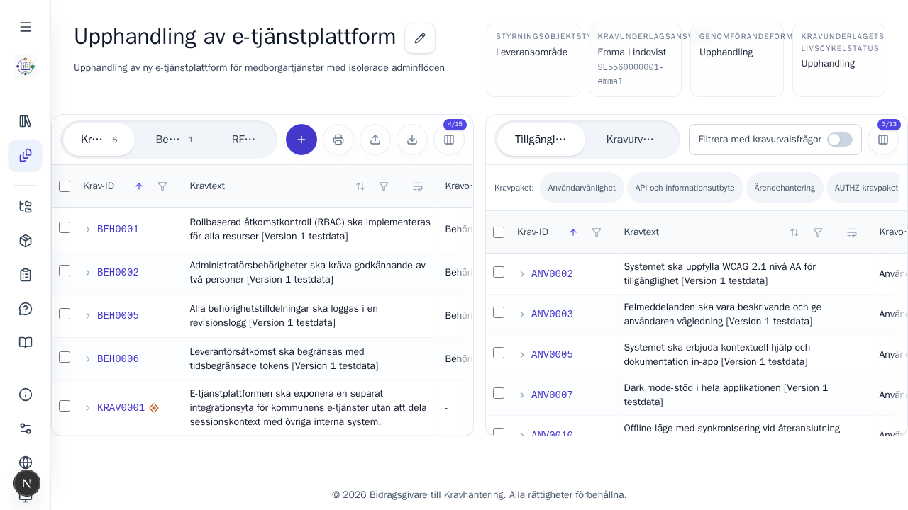

### Krav expanderat i underlagskontext

**Steg 2 — Expandera ett krav.** Klicka på en rad i listan för att öppna kravets
detaljpanel. Om inget aktivt avsteg finns visas knappen **"Begär ett avsteg"** —
klicka på den för att starta avstegsprocessen.

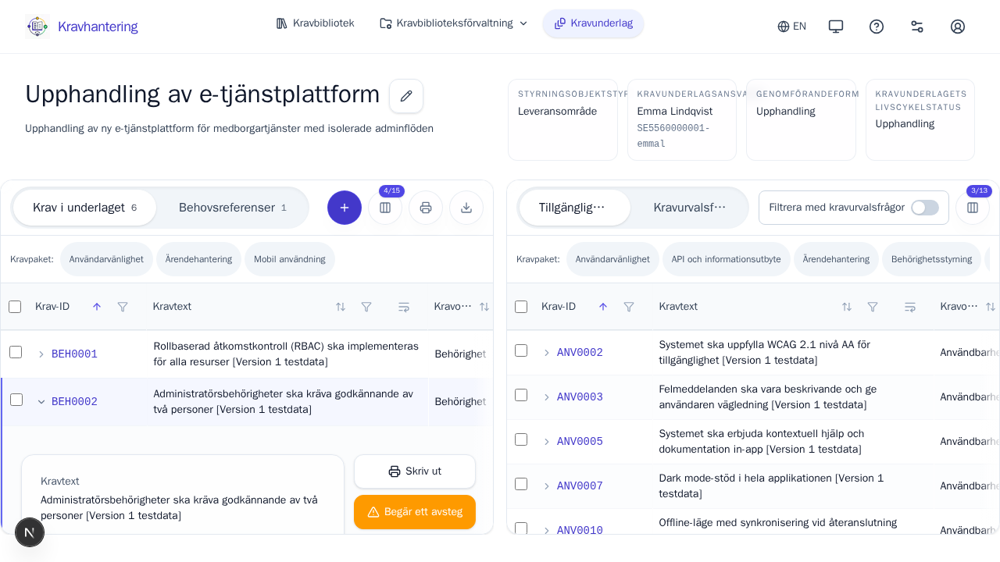

### Formulär för avstegsansökan

**Steg 3 — Fyll i avstegsformuläret.** Ange en motivering som förklarar varför
kravet inte kan uppfyllas som specificerat och vilka kompenserande åtgärder som
vidtas. Begärande användare registreras automatiskt.

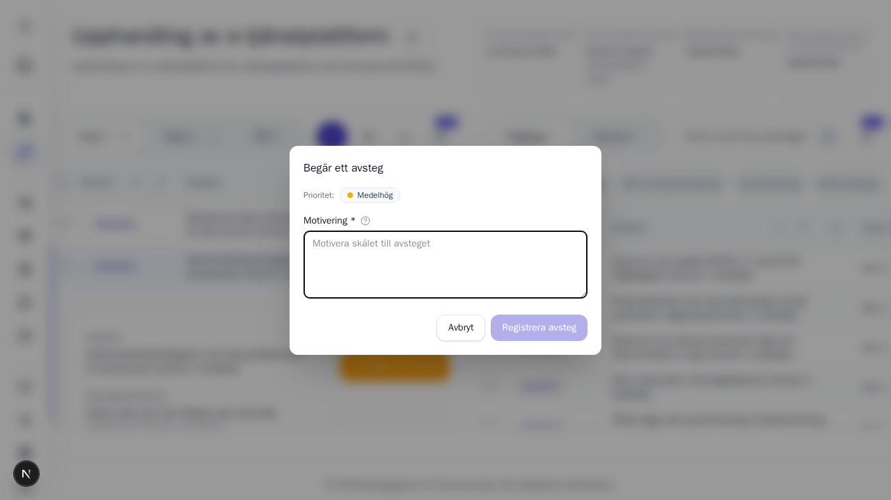

### Avstegsformulär ifyllt

Klicka på **"Registrera avsteg"** för att spara. Motiveringstexten ingår sedan i
avstegsgranskningsrapporten.

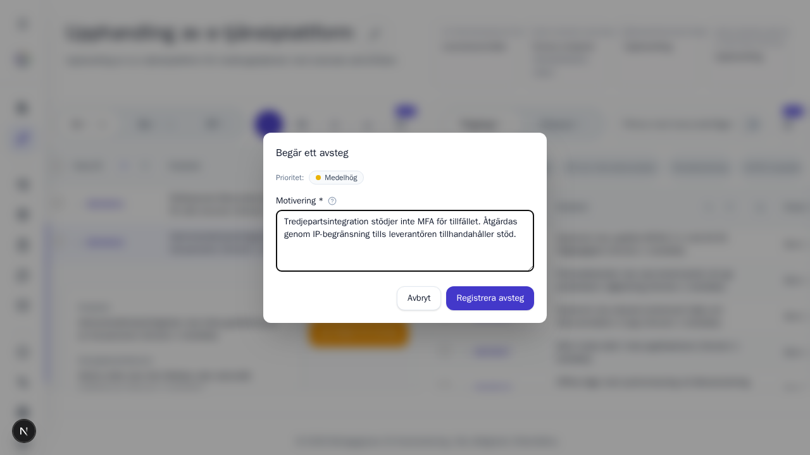

### Avsteg registrerat — Utkast

**Steg 4 — Utkastläge.** Avsteget visas nu i detaljpanelen med sin motivering. I
utkastläget kan det fortfarande redigeras eller tas bort. När det är klart,
klicka **"Granskning ↗"** för att skicka det till granskning.

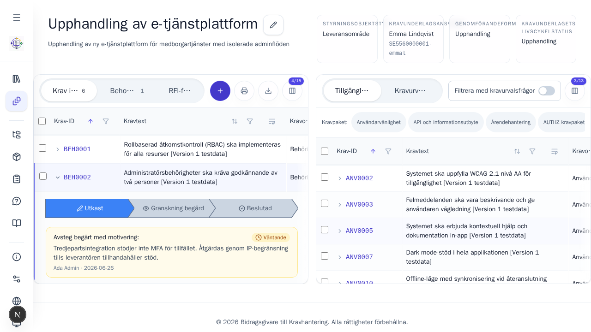

### Avsteg — granskning begärd

**Steg 5 — Granskning begärd.** Avsteget är nu låst för redigering och inväntar
beslut. En behörig kravgranskare klickar **"Beslutad ↗"** för att registrera ett
beslut, eller **"← Utkast"** för att återföra det om komplettering behövs.

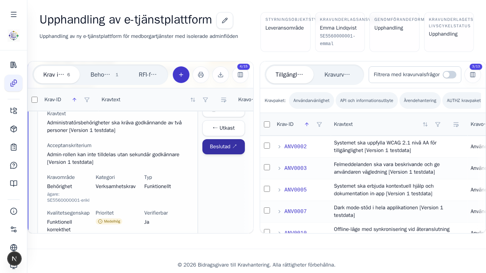

### Registrera beslut

**Steg 6 — Registrera beslut.** Kravgranskaren anger en **beslutsmotivering**,
vem som fattat beslutet och datum. Välj sedan **"Godkänn"** eller **"Avslå"**
för att slutföra beslutet.

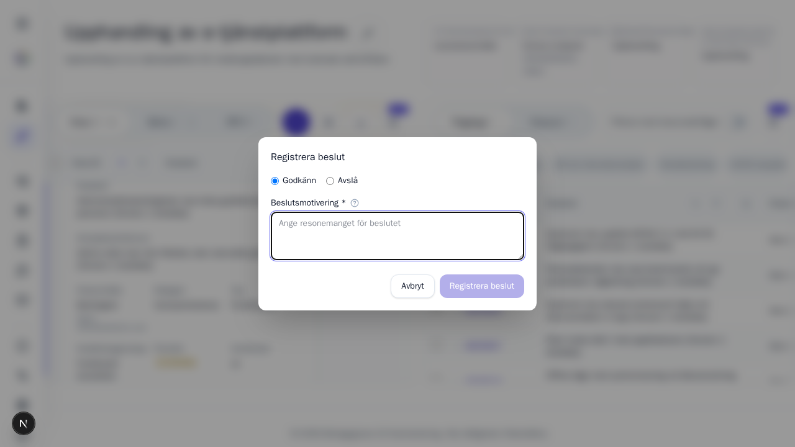

### Avsteg — granskningsrapport

**Steg 7 — Granskningsrapport.** När ett avsteg har skickats till granskning kan
du generera en **granskningsrapport** direkt från detaljpanelens rapportmeny.
Rapporten sammanställer kravets text, avstegets motivering och beslutsunderlag —
i ett format lämpligt för dokumentation och revision. Den kan skrivas ut eller
laddas ned som PDF.

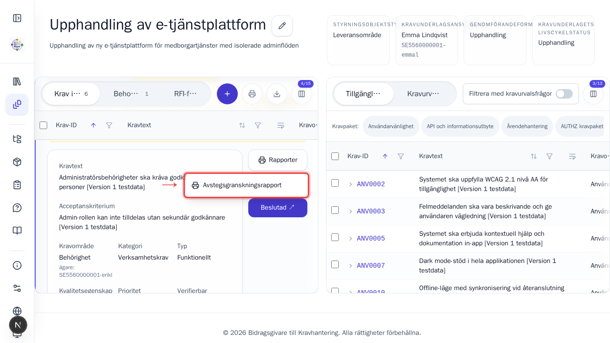

## Import av krav

Importfunktionen använder JSON enligt `requirement-import.v1` och finns i två
lägen: **kravbiblioteksimport** skapar nya utkast i kravbiblioteket, medan
**kravunderlagsimport** skapar unika krav direkt i ett kravunderlag. Importen
laddar först en granskning där rader, metadata och föreslagna normreferenser kan
kontrolleras innan något sparas.

### Kravbiblioteksimport — välj mål och importfil

Klicka på **"Importera krav"** i kravbiblioteket, välj kravområde och klistra in
eller välj en JSON-fil. Exemplet använder importfilen `/tmp/krav5.txt`, som
innehåller DICOM-krav och en föreslagen normreferens.

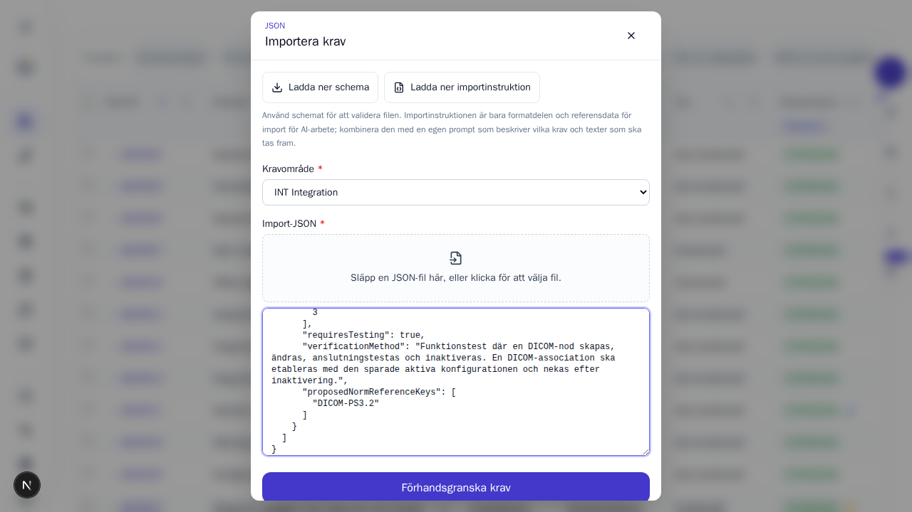

### Kravbiblioteksimport — granska krav

Efter förhandsgranskning visas varje kravrad som ett valt importutkast. Rader
kan expanderas för att justera kravtext, acceptanskriterier, kategori, typ,
kvalitetsegenskap, prioritet, normreferenser, kravpaket och
verifieringsuppgifter innan importen körs.

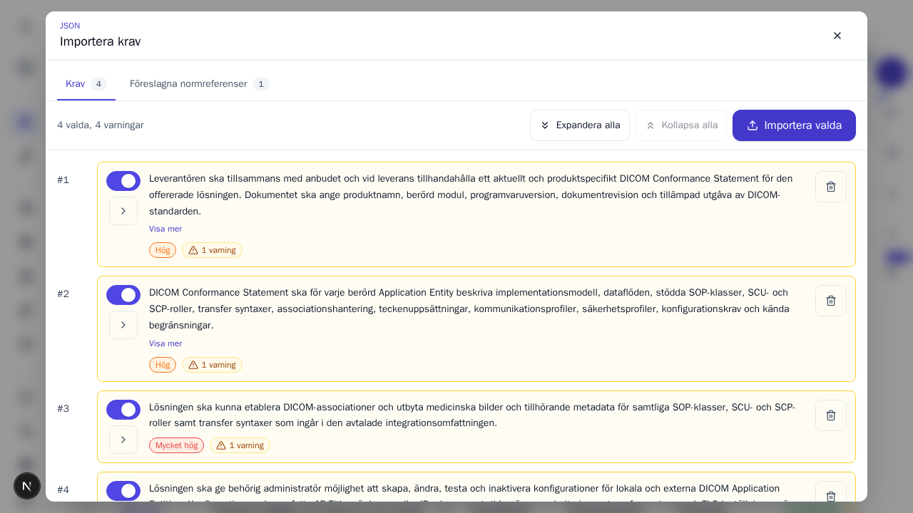

### Föreslagen normreferens

Importfilen kan innehålla **föreslagna normreferenser** för källor som ännu inte
finns i normbiblioteket. Förslaget kopplas till de kravrader som hänvisar till
samma nyckel, men sparas inte automatiskt.

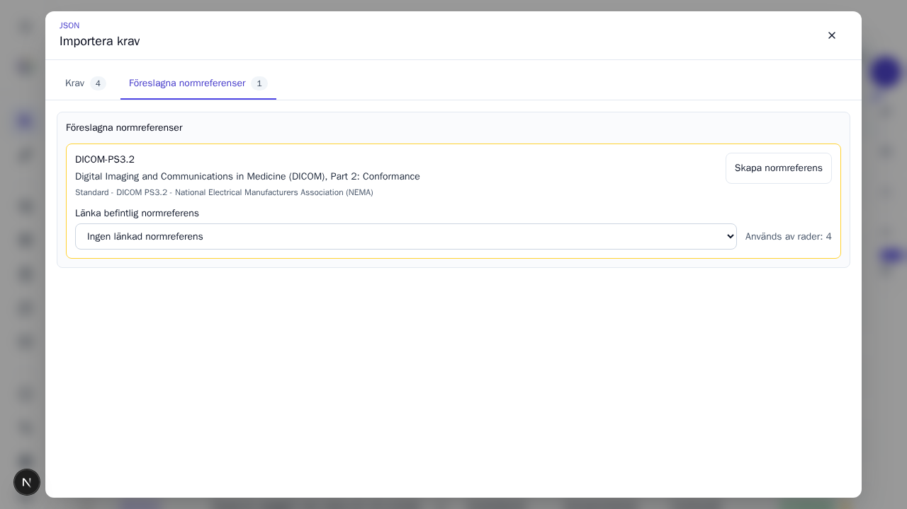

### Skapa normreferens från importförslag

Knappen **"Skapa normreferens"** öppnar samma formulär som normbiblioteket
använder. Fälten fylls i från importförslaget, så användaren kan kontrollera och
spara källan innan kraven importeras.

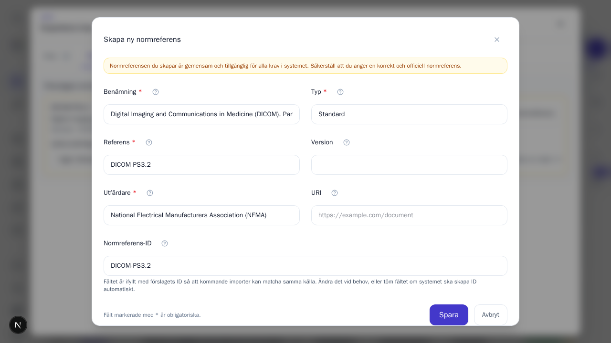

### Normreferens löst

När normreferensen har skapats markeras förslaget som **Löst** och importens
kravrader uppdateras så att den nya normreferensen följer med när raderna
importeras.

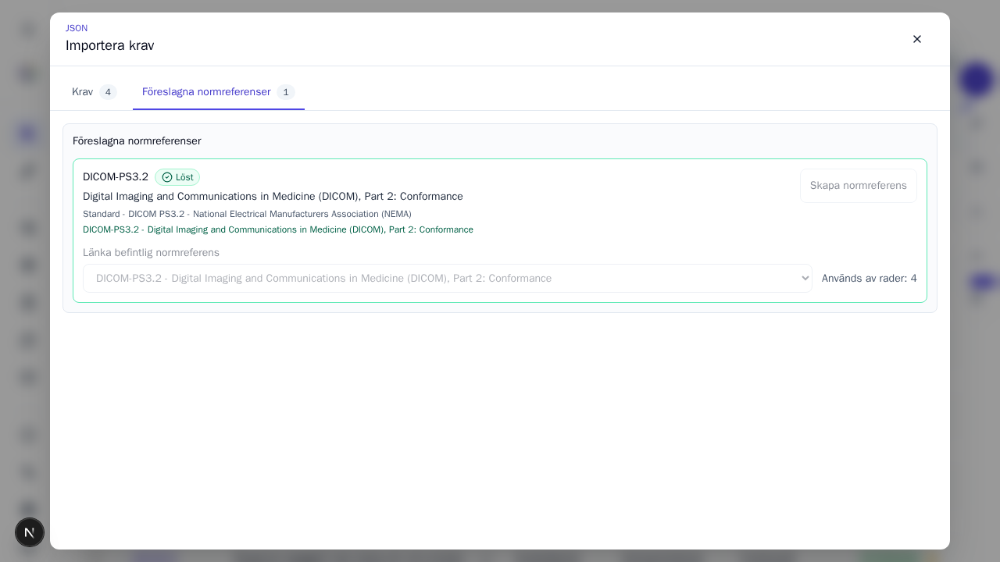

### Kravbiblioteksimport — importerade rader

När **"Importera valda"** körs skapas valda rader som nya utkast i
kravbiblioteket. Kvittonotisen visar hur många rader som skapades och
CSV-kvittot kan laddas ned vid behov.

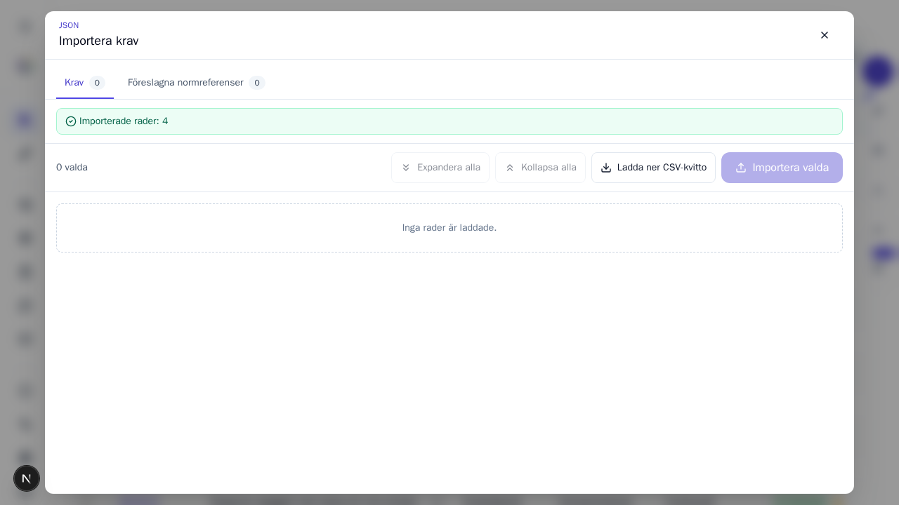

### Kravunderlagsimport — importfil

I ett kravunderlag använder knappen **"Importera unika krav"** samma
importfilformat, men målet är det aktuella kravunderlaget. Därför väljs inget
kravområde i dialogen.

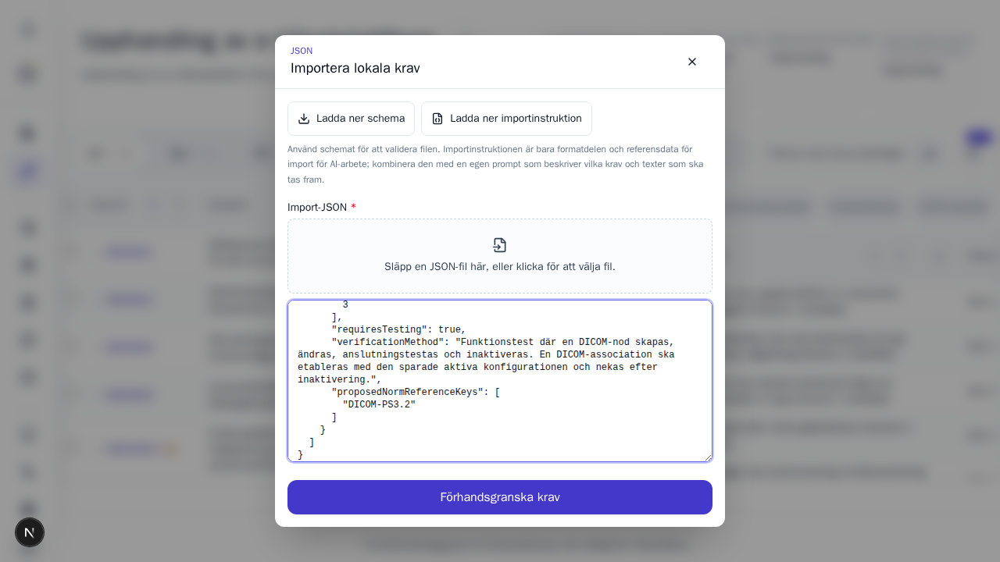

### Kravunderlagsimport — granska unika krav

Kravunderlagsimporten skapar **unika krav** som bara finns i detta kravunderlag.
Kravpaket används inte för lokala krav, medan normreferenser, prioritet,
verifierbarhet och behovsreferens kan granskas per rad.

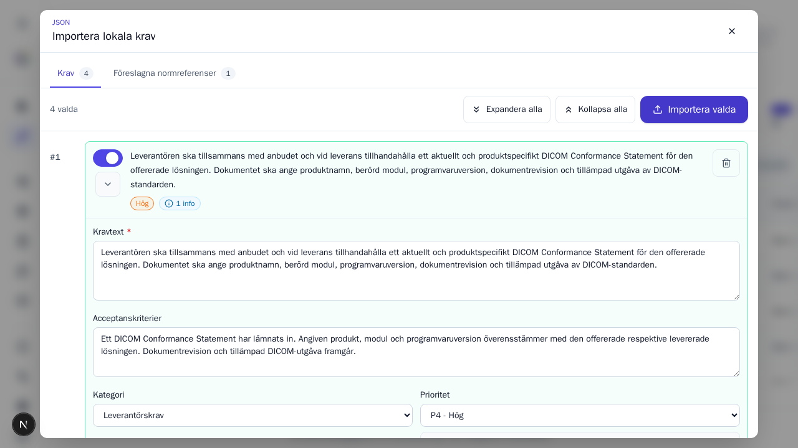

### Kravunderlagsimport — importerade unika krav

När importen körs skapas valda rader som kravunderlagslokala krav. Raderna tas
bort från granskningen efter lyckad import, och kvittot visar hur många unika
krav som skapades i kravunderlaget.

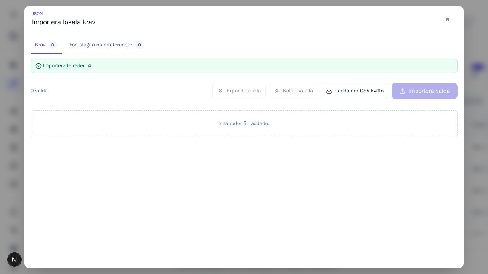

### Importerade unika krav i kravunderlag

Efter att dialogen stängs uppdateras kravunderlaget. De importerade kraven
hanteras som unika krav i underlaget och kan senare granskas, följas upp eller
lyftas till kravbiblioteket vid behov.

## Förbättringsförslag

### Förbättringsförslag — tom sektion

Längst ned i inline-detaljvyn finns sektionen **Förbättringsförslag**. En
kravunderlagsansvarig (upphandling, projekt, förvaltning) kan lämna ett förslag
på förbättring av kravet. Klicka på **"+ Registrera förslag"** för att öppna
formuläret.

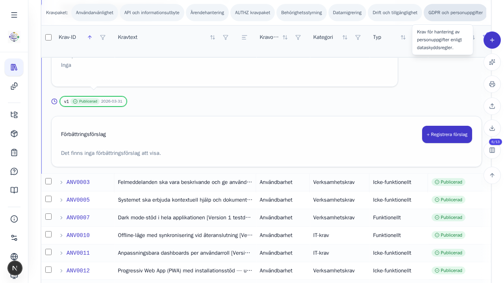

### Formulär för förbättringsförslag

Formuläret öppnas som en modal dialog. Ange förbättringsidén i textfältet och
valfritt ditt namn i "Registrerat av". Klicka på **"Spara"** för att registrera
förslaget.

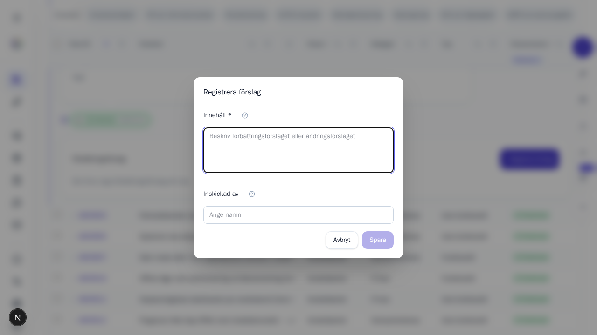

### Förbättringsförslag ifyllt

Förslagstexten beskriver en konkret förbättringsidé. Knappen **"Spara"**
aktiveras när innehållsfältet har text.

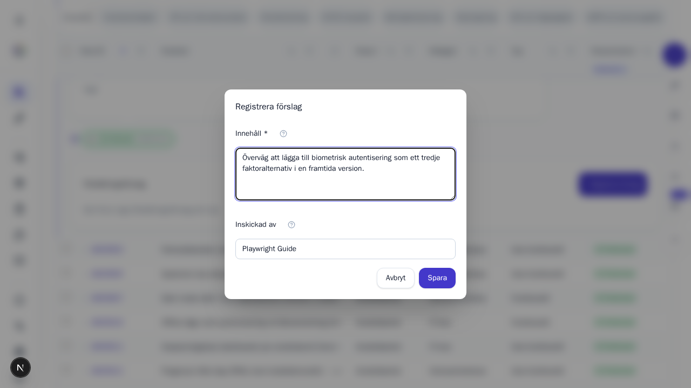

### Förbättringsförslag registrerat

Det registrerade förslaget visas i sektionen med sin arbetsflödesstatus:
**Utkast → Granskning begärd → Granskad**. Förslaget kan redigeras och skickas
för granskning via knappen **"Granskning ↗"**.

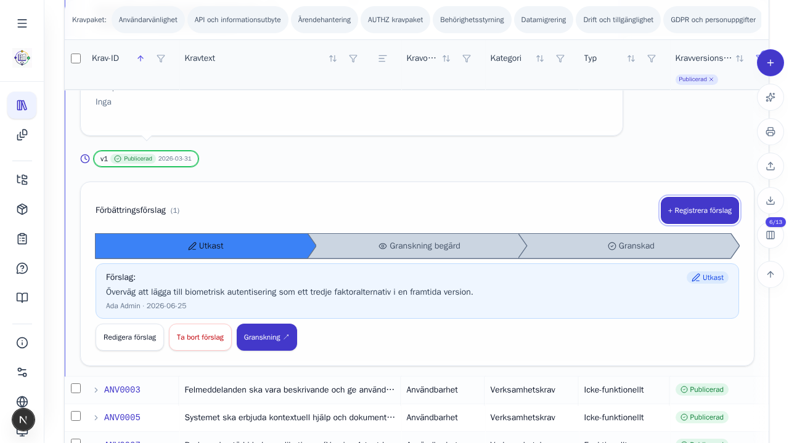

### Flera förbättringsförslag

Ett krav kan ha flera förbättringsförslag från olika intressenter. Varje förslag
hanteras individuellt genom sitt eget arbetsflöde. Listan ger en samlad bild av
alla inkomna synpunkter på kravet.

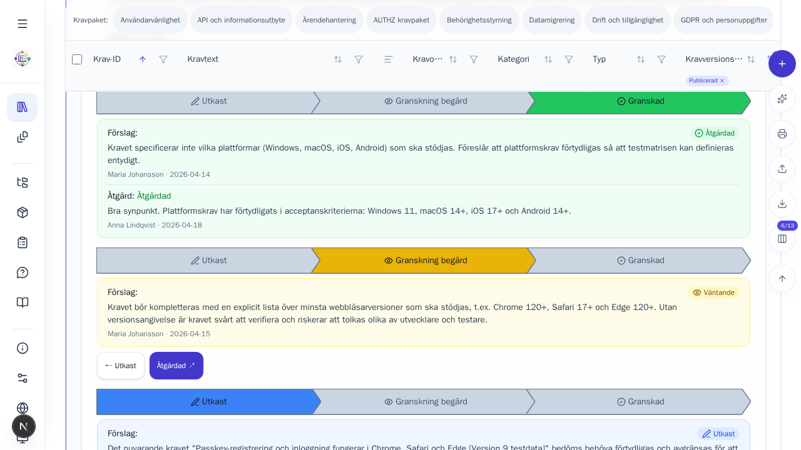

## Administrationscenter

### Admin — Kolumnhantering

Fliken **Kolumner** konfigurerar vilka kolumner som visas som standard i
kravbiblioteket och deras ordning. Ändringar gäller för alla användare. Du kan
också ange standardvyer för olika kontexter.

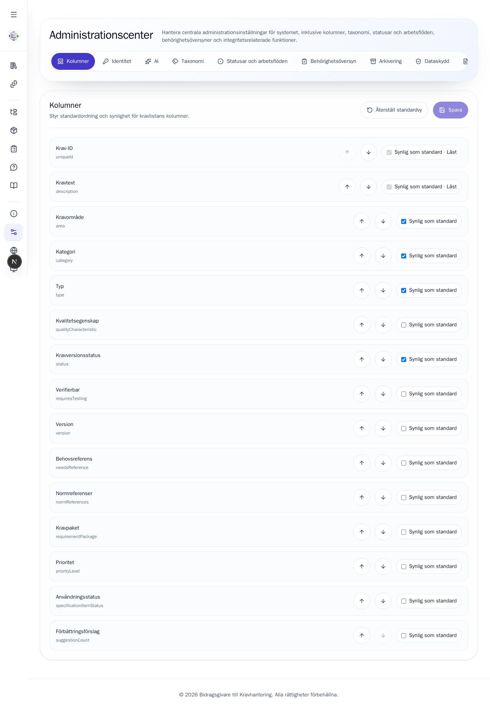

### Admin — Taxonomi

Fliken **Taxonomi** innehåller länkar till klassningar som används för
filtrering, rapportering och AI-stöd: kravområden, kategorier, typer,
prioritetsnivåer, kvalitetsegenskaper, styrningsobjektstyper och
genomförandeformer. Normreferenser hanteras i Normbibliotek under
Kravbiblioteksförvaltning.

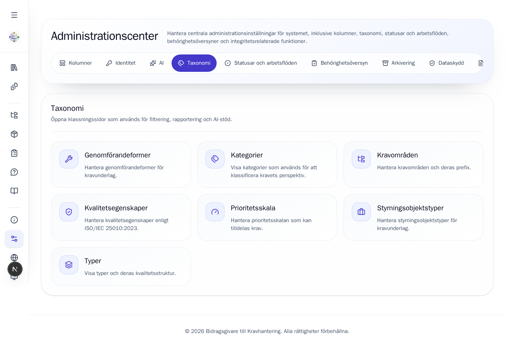

### Admin — Statusar och arbetsflöden

Fliken **Statusar och arbetsflöden** samlar statuskataloger för kravversioner,
kravunderlagets livscykel och användningsstatusar i kravunderlag. Taxonomi och
statusar hålls isär så att klassningar inte blandas ihop med livscykel- och
användningslägen.

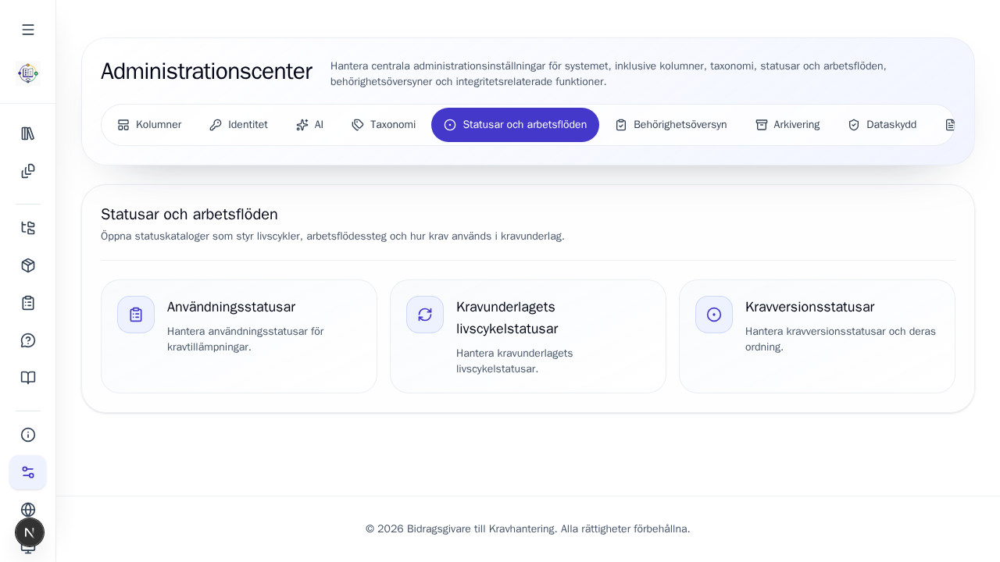

## Taxonomi och statusar

### Kravområden

Kravområden organiserar krav efter organisatorisk domän. Varje kravområde har en
ägare, ett prefix som används i krav-ID (t.ex. "SÄK" ger ID:n som "SÄK0001") och
en beskrivning.

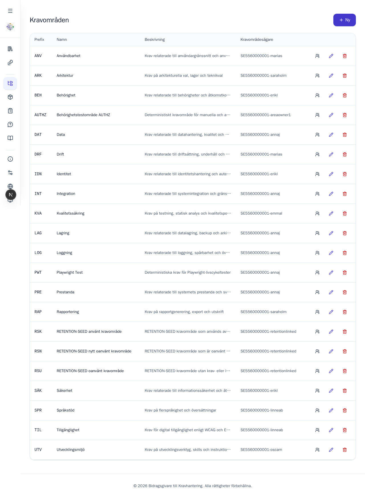

### Kategorier

Kategorier klassificerar kravets perspektiv, till exempel verksamhetskrav,
IT-krav och leverantörskrav. I administrationscentret visas kategorierna som en
skrivskyddad taxonomilista.

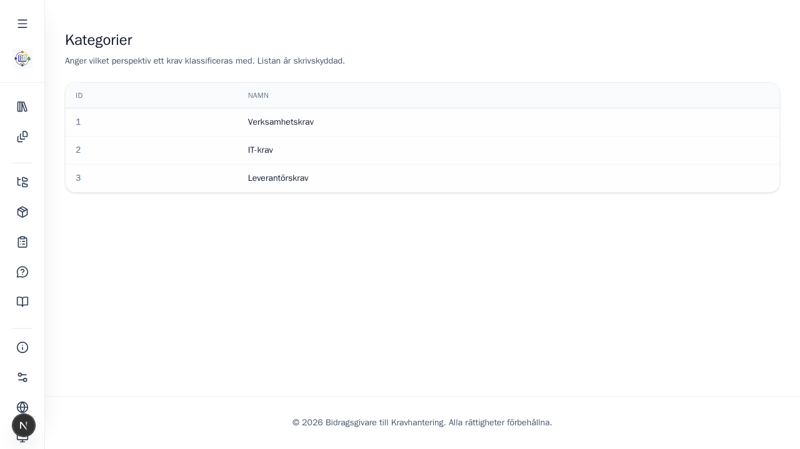

### Kravversionsstatusar

Kravversionsstatusar definierar kravversionens livscykelsteg. De fyra
systemstyrda kravversionsstatusarna (Utkast, Granskning, Publicerad, Arkiverad)
kan inte tas bort eller byta namn — de utgör ryggraden i arbetsflödet. Övriga
kravversionsstatusar kan anpassas.

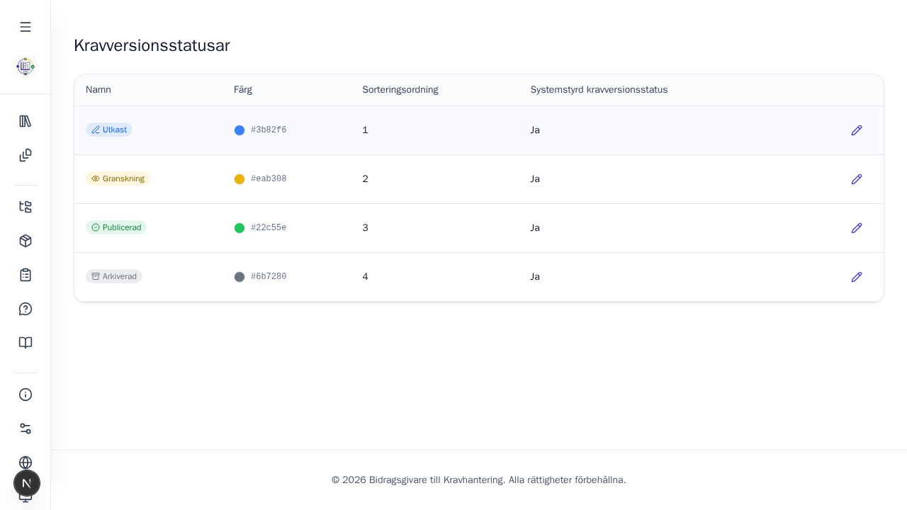

### Prioritetsskala

Prioritetsskalan klassificerar hur viktigt, angeläget eller kritiskt ett krav
är. Varje nivå har en P-kod, ett namn, en beskrivning, bedömningsgrunder och en
färg för visuell identifiering i kravbiblioteket och detaljvyer.

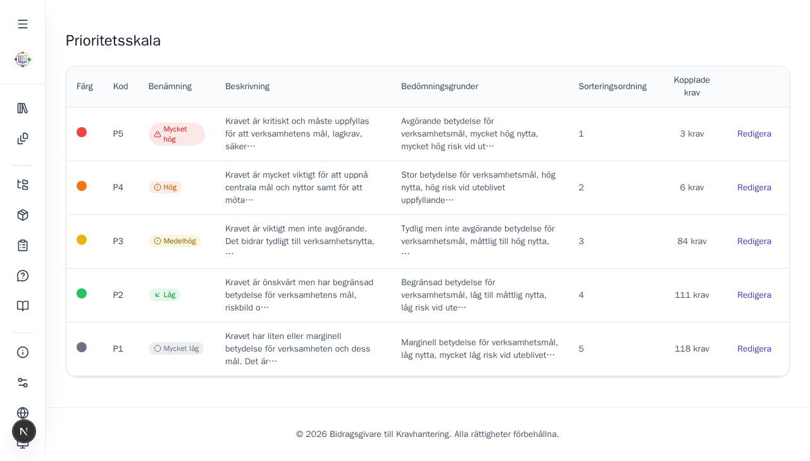

### Kravtyper

Kravtyper kategoriserar kravets karaktär (t.ex. funktionellt, icke-funktionellt,
säkerhetskrav). Typer används för filtrering, rapportering och för att
säkerställa rätt kvalitetsegenskaper kopplas till kravet.

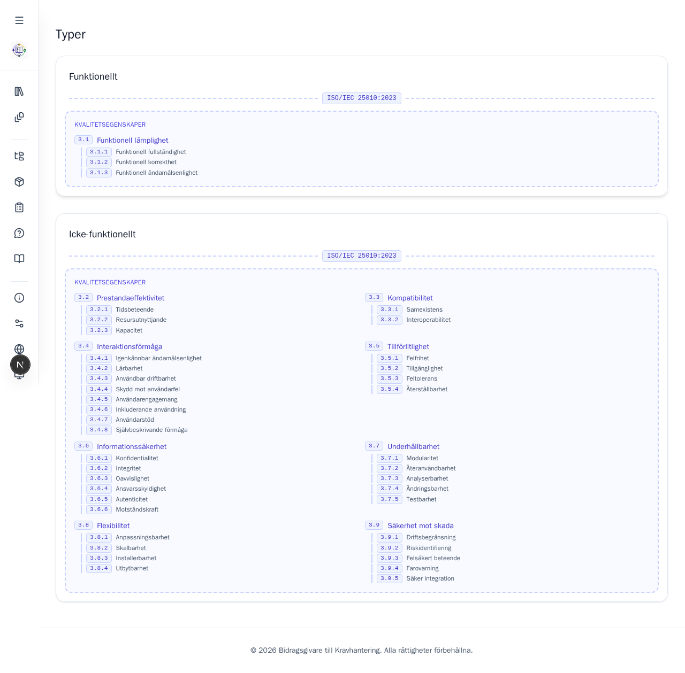

### Kvalitetsegenskaper

Kvalitetsegenskaper är ett hierarkiskt taxonomi som beskriver icke-funktionella
krav (t.ex. tillgänglighet, prestanda, säkerhet). Egenskaperna kopplas till krav
för att säkerställa täckning av kvalitetskraven.

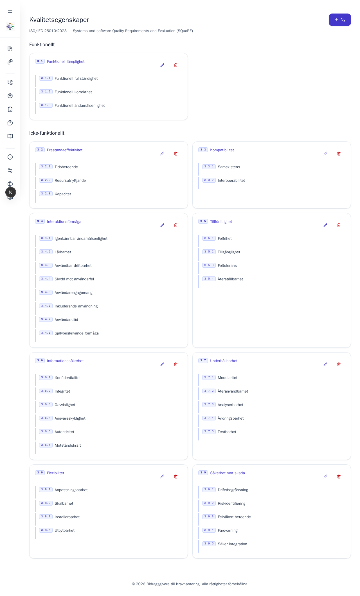

### Normbibliotek

Normbiblioteket samlar normreferenser till externa standarder och regelverk
(t.ex. ISO-standarder, GDPR). Krav kan referera till en eller flera
normreferenser för att tydliggöra vilka regelverk de härstammar från.

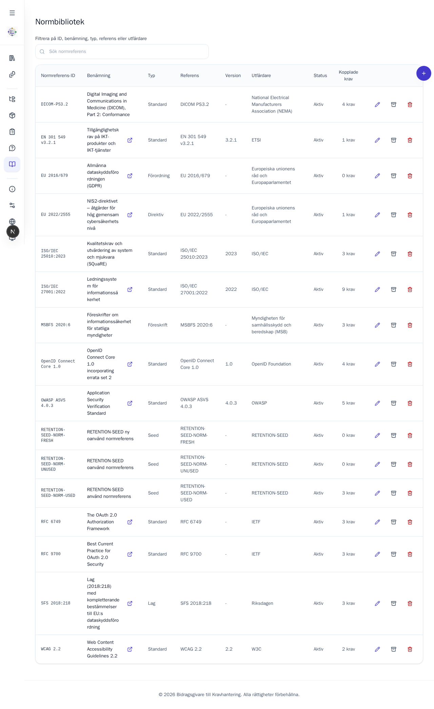

## Rapporter

Systemet erbjuder flera rapporttyper för granskning, spårbarhet och
beslutsunderlag. Rapporter kan genereras som **utskriftsvänliga HTML-sidor**
eller laddas ned som **PDF**. Nedan listas de tillgängliga rapporterna.

### Historikrapport

Visar tidslinjen för alla ändringar av ett enskilt krav. Rapporten listar varje
version i omvänd kronologisk ordning med status, författare, tidsstämplar och
utdrag ur kravtexten. Den publicerade versionen (om den finns) visas överst,
följd av opublicerade versioner markerade som utkast eller granskning.

**Åtkomst:** Rapportmenyn i kravdetaljvyn (alla kravversionsstatusar).

**Rutt:** `/requirements/reports/print/history/[id]` (utskrift) ·
`/requirements/reports/pdf/history/[id]` (PDF)

### Granskningsrapport

Jämför en version i **Granskning** med den senast publicerade eller arkiverade
versionen. Rapporten visar ord-för-ord-skillnader i kravtext och
acceptanskriterier samt förändringar i metadata (kategori, typ,
kvalitetsegenskaper, risknivå, normreferenser, kravpaket m.m.). Om ingen
publicerad/arkiverad version finns noteras detta.

**Åtkomst:** Rapportmenyn i kravdetaljvyn (visas enbart när kravet är i status
*Granskning*).

**Rutt:** `/requirements/reports/print/review/[id]` (utskrift) ·
`/requirements/reports/pdf/review/[id]` (PDF)

### Kombinerad granskningsrapport

En samlad rapport för flera krav som har status *Granskning*. Rapporten
genereras genom att markera flera krav i kravbiblioteket. Den innehåller en
innehållsförteckning med sidnummer, grupperad efter rapporttyp
(arkiveringsförfrågningar först, sedan granskningsändringar). Varje krav börjar
på en ny sida.

**Åtkomst:** Flytande verktygsfält i kravbiblioteket när minst ett markerat krav
har status *Granskning*.

**Rutt:** `/requirements/reports/print/review-combined?ids=...` (utskrift) ·
`/requirements/reports/pdf/review-combined?ids=...` (PDF)

### Granskningsrapport för avsteg

Granskar ett specifikt avsteg kopplat till ett krav i ett kravunderlag.
Rapporten visar den kravversion som är kopplad till underlaget, avstegets
motivering och kompletterande underlagskontext.

**Åtkomst:** Rapportmenyn i kravdetaljvyn i underlagskontexten (visas när
avsteget är i status *Granskning begärd* eller *Beslutad*).

**Rutt:**
`/requirements/reports/print/deviation-review/[id]?spec={slug}&item={itemId}`
(utskrift) · `.../pdf/...` (PDF)

### Kravlista

Skriver ut de krav som för närvarande visas i kravbiblioteket som en formaterad
tabell med Krav-ID, kravtext (trunkerad), kravområde och status. Rubriken visar
antal krav och tidsstämpel.

**Åtkomst:** Utskriftsknappen i kravbibliotekets verktygsfält (alltid
tillgänglig).

**Rutt:** `/requirements/reports/print/list?ids=...` (utskrift) ·
`/requirements/reports/pdf/list?ids=...` (PDF)

### Kravunderlagsrapporter

Skriver ut hela kravunderlaget med den rapportprofil som passar underlagets
livscykelstatus. `Kravbilaga för upphandling` visas för upphandling,
`Genomföranderapport` för införande och utveckling, och `Förvaltningsrapport`
för förvaltning. Alla profiler sorterar kraven på Krav-ID och använder den
kravversion som är kopplad till kravunderlaget.

**Åtkomst:** Utskriftsknappen i kravunderlagsdetaljvyns verktygsfält när
underlaget har en livscykelstatus med rapportprofil.

**Rutt:** `/specifications/[slug]/reports/print/[profile]` (utskrift) ·
`/specifications/[slug]/reports/pdf/[profile]` (PDF)

### Ändringsförslagshistorik

Listar alla förbättringsförslag grupperade per kravversion i fallande
versionsordning. Varje förslag visar status, innehåll, författare, datum och
eventuella beslutsmotiveringar. Statusfärger: *Utkast* (blå), *Granskning
begärd* (gul), *Beslutad* (grön), *Avvisad* (röd).

**Åtkomst:** Rapportmenyn i kravdetaljvyn eller underlagskravdetaljvyn.

**Rutt:** `/requirements/reports/print/suggestion-history/[id]` (utskrift) ·
`/requirements/reports/pdf/suggestion-history/[id]` (PDF)

### Rapportgenerering från kravbiblioteket

Markera ett eller flera krav i kravbiblioteket för att aktivera rapportknappar i
verktygsfältet. Du kan generera PDF-rapporter för granskningsunderlag,
avstegsöversikter, ändringshistorik och mer.

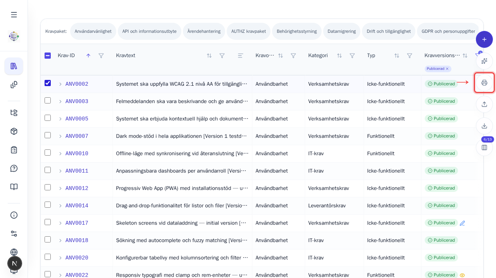

### Rapporter från kravdetaljsidan

Från kravdetaljsidan kan du öppna rapportmenyn för att ladda ned eller skriva
ut: **Ändringshistorik** (alla versioner), **Förbättringsförslagshistorik** och
granskningsunderlag. Rapporterna är formaterade för utskrift och PDF-export.

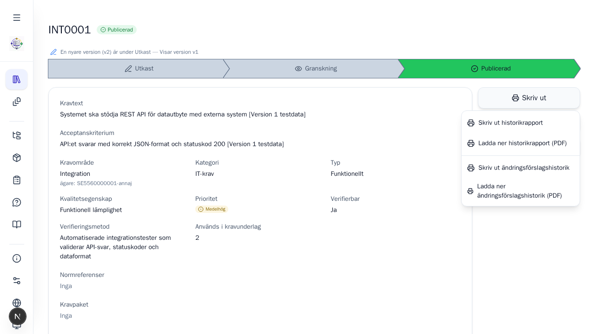
