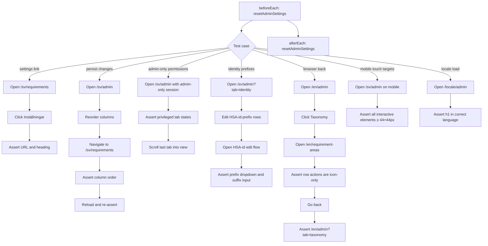
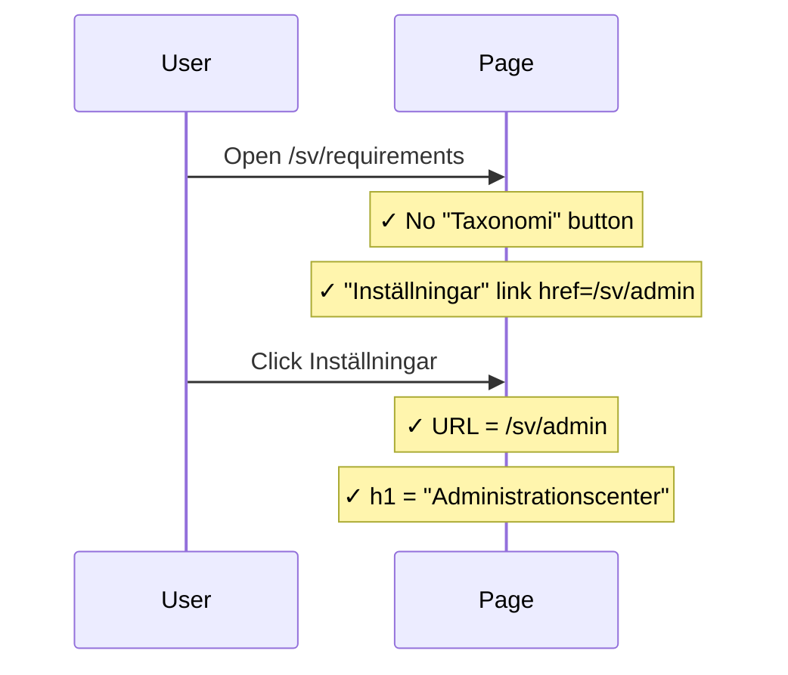
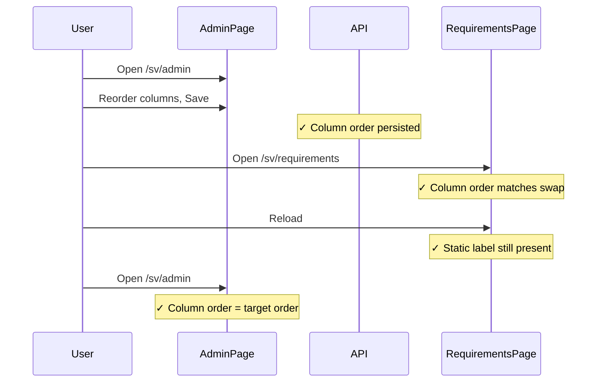
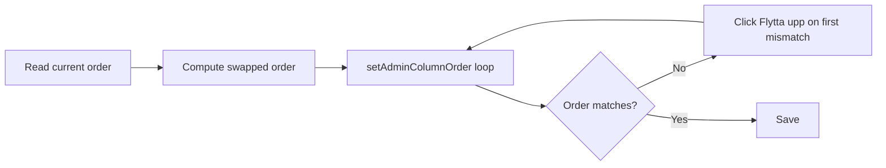
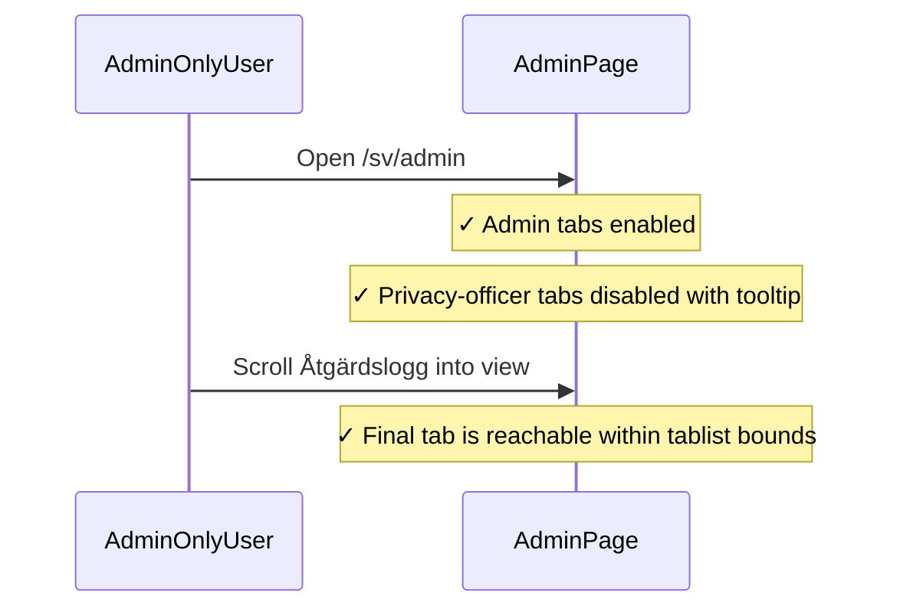
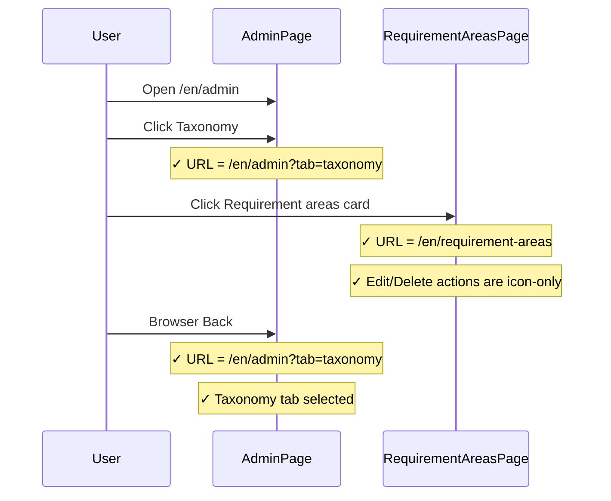
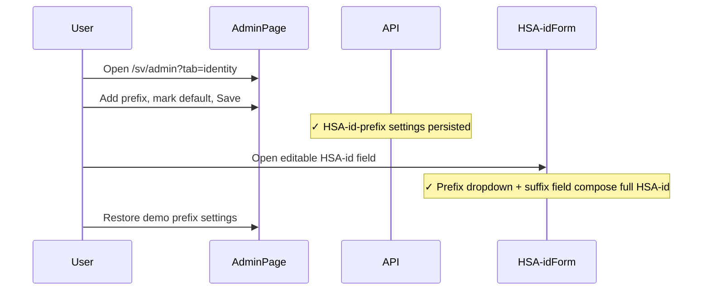
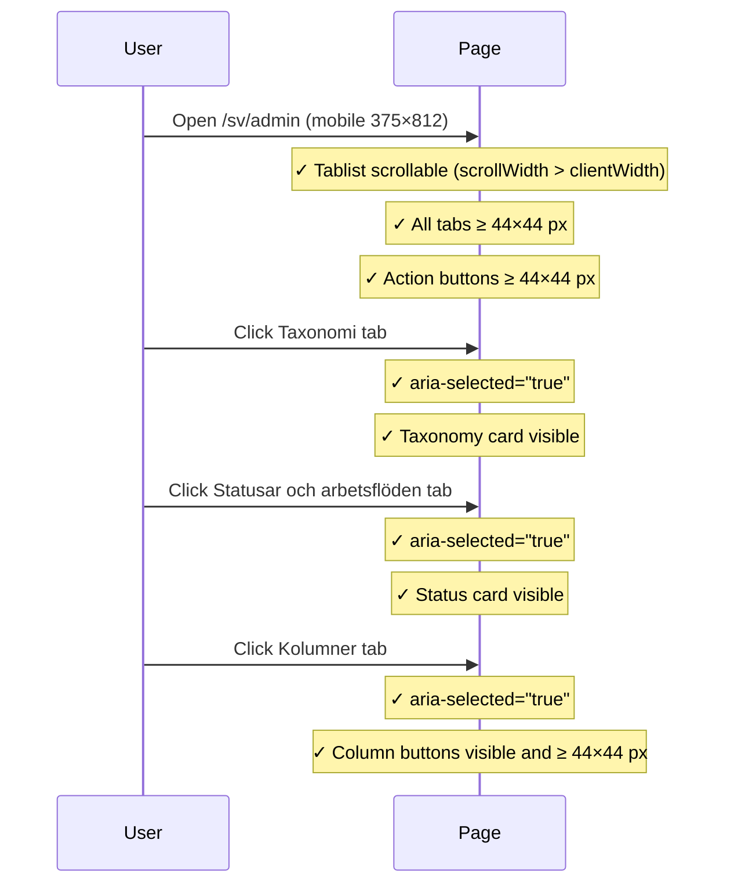
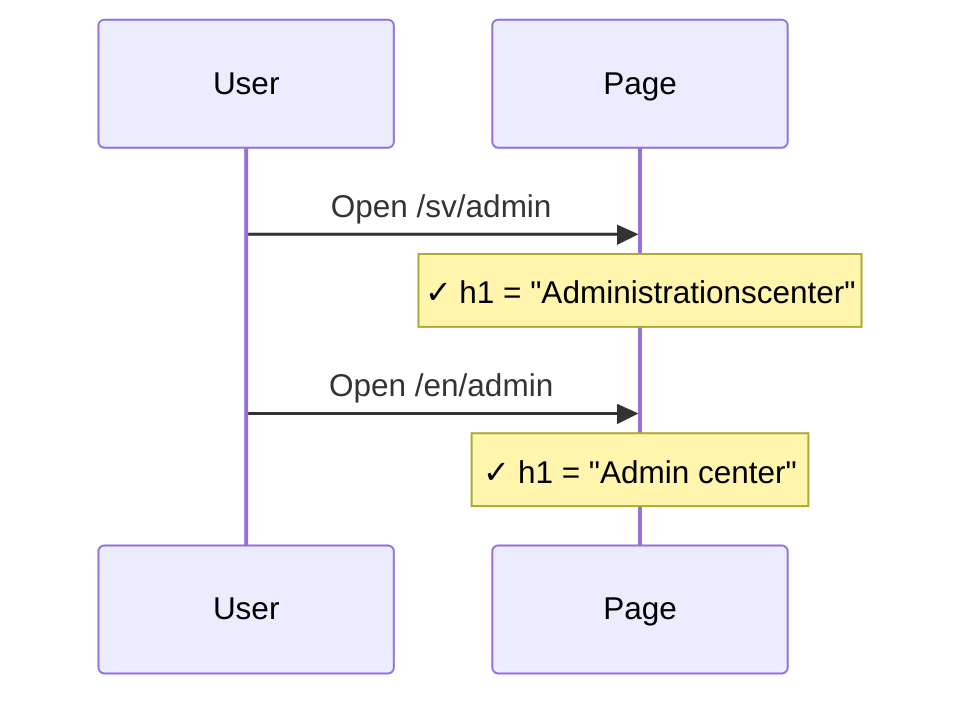

# Admin Entrypoint Integration Tests

> Test flow documentation for
> [`admin-entrypoint.spec.ts`](tests/integration/admin-entrypoint.spec.ts)

This suite verifies the administration centre entrypoint: navigating from the
requirements library, persisting column-order changes across page reloads,
administering HSA-id-prefixes, preserving the selected taxonomy tab in browser
history, checking requirement-area icon actions, admin-only tab permissions,
touch-target accessibility on mobile, and locale-specific page loads.

## Data Model

<!-- markdownlint-disable MD013 -->
| Item | Purpose |
| --- | --- |
| `DEFAULT_COLUMN_PAYLOAD` | Full set of requirement list column defaults. Reset via `PUT /api/admin/requirement-columns`. |
| `DEFAULT_HSA_ID_PREFIX_PAYLOAD` | Demo HSA-id-prefix settings. Reset via `PUT /api/admin/hsa-id-prefixes`. |
| `[data-testid^="admin-column-row-"]` | Drag-sortable column rows in the Kolumner tab. |
| `[data-testid^="hsa-id-prefix-row-"]` | Editable HSA-id-prefix rows in the Identitet tab. |
| `?tab=taxonomy` | URL state that restores the Taxonomy tab when browser history returns to `/admin`. |
<!-- markdownlint-enable MD013 -->

## Overview Flowchart

## Test Setup

- `test.describe.configure({ mode: 'serial' })` runs all tests sequentially to
  avoid concurrent writes to shared admin state.
- `beforeEach` and `afterEach` both call `resetAdminSettings`, which issues
  `PUT` requests to `/api/admin/requirement-columns` and
  `/api/admin/hsa-id-prefixes` with default demo values.
- Helper functions:
  - `assertOkResponse` — throws with status and body text if a reset request
    fails.
  - `resetAdminSettings` — calls the column and HSA-id-prefix PUT resets and
    delegates to `assertOkResponse`.
  - `getAdminColumnOrder` — reads the current drag-row order from
    `[data-testid^="admin-column-row-"]` elements.
  - `setAdminColumnOrder` — clicks "Flytta upp" buttons iteratively until the
    target order is reached; throws if it cannot converge.
  - `swapColumns` — returns a new order array with two column IDs exchanged.
  - `expectTouchTargetSize` — asserts a locator's bounding box is at least
    44×44 px.
- The suite iterates over `desktop` (`1280×720`) and `mobile` (`375×812`)
  viewports for most tests. The mobile-touch-target test is desktop-skipped.
- The locale-load tests are viewport-independent and loop over `['sv', 'en']`.

## header settings link opens the Swedish admin center

### Purpose

Verifies that the "Inställningar" link in the requirements page header is
present, points to `/sv/admin`, and successfully navigates there, rendering the
Swedish admin heading.

### Step-by-Step Flow

1. Navigate to `/sv/requirements`.
1. Assert the "Taxonomi" button is absent (not an admin context).
1. Assert the "Inställningar" link is visible with `href="/sv/admin"`.
1. Click the link.
1. Assert the URL is `/sv/admin`.
1. Assert the `h1` text is `"Administrationscenter"`.

### Sequence Diagram

## persists column changes through library reloads

### Purpose: Persist Changes

Confirms that reordering columns in the admin centre is immediately reflected
in the requirements library and survives a hard page reload.

### Step-by-Step Flow: Persist Changes

1. Navigate to `/sv/admin`.
1. Read the current column order.
1. Compute a target order that swaps `area` and `category`.
1. Assert "Spara" is disabled before any column change.
1. Apply the target order via `setAdminColumnOrder`, and click "Spara". Assert
   "Sparat" appears.
1. Navigate to `/sv/requirements`.
1. Assert the column index of "Kategori" is before or after "Kravområde"
   consistent with the swapped order.
1. Reload the page.
1. Assert "Kategori" is still in `<thead>`.
1. Navigate back to `/sv/admin` and assert the column order matches the target.

### Sequence Diagram: Persist Changes

### Supplementary Flowchart: Column Reorder

## keeps Swedish admin tabs reachable in the header

### Purpose: Admin-Only Permissions

Confirms that an Admin-only user can use the admin tabs they are permitted to
open, sees privacy-officer-only tabs disabled with explanatory tooltips, and can
reach the final tab in the horizontally scrollable desktop tab strip.

### Step-by-Step Flow: Admin-Only Permissions

1. Navigate to `/sv/admin` with the `admin-only` storage state.
1. Assert `Behörighetsöversyn` and `Åtgärdslogg` are enabled.
1. Assert `Arkivering` and `Dataskydd` are disabled and explain that the
   `Dataskyddshandläggare` role is required.
1. Assert the tablist has measurable width and scrollable content.
1. Scroll `Åtgärdslogg` into view and assert it fits inside the tablist bounds.

### Sequence Diagram: Admin-Only Permissions

## browser back returns to the taxonomy tab after opening a taxonomy page

### Purpose: Browser History

Confirms that selecting Taxonomy is stored in the admin URL before a taxonomy
card opens a child admin page. Browser Back should therefore return to
`/en/admin?tab=taxonomy`, with the Taxonomy tab still
selected.

### Step-by-Step Flow: Browser History

1. Navigate to `/en/admin`.
1. Click the "Taxonomy" tab.
1. Assert the URL is `/en/admin?tab=taxonomy`.
1. Click the "Requirement areas" taxonomy card.
1. Assert the URL is `/en/requirement-areas`.
1. Assert the requirement-area list row actions expose accessible `Edit` and
   `Delete` names while rendering as icon-only buttons.
1. Use browser Back.
1. Assert the URL is `/en/admin?tab=taxonomy`.
1. Assert the Taxonomy tab has `aria-selected="true"` and the Requirement areas
   card is visible.

### Sequence Diagram: Browser History

## administers HSA-id prefixes and uses them in HSA-id fields

### Purpose: HSA-id Prefixes

Confirms that the Admin Center Identitet tab can change the visible/default
HSA-id-prefix list and that an editable HSA-id form uses the configured prefix
dropdown plus suffix input.

### Step-by-Step Flow: HSA-id Prefixes

1. Navigate to `/sv/admin?tab=identity`.
1. Assert the `Identitet` tab is selected and `SE5560000001` is visible.
1. Add a disposable prefix, mark it visible and default, and save.
1. Open an editable HSA-id flow, such as changing a requirement-area owner.
1. Assert the prefix dropdown has the disposable prefix selected and the suffix
   textbox remains labelled by the HSA-id field label.
1. Return to `/sv/admin?tab=identity`, restore `SE5560000001` as default, save,
   and remove the disposable prefix if unused.

### Sequence Diagram: HSA-id Prefixes

## keeps admin tabs and actions usable on mobile

### Purpose: Mobile Touch Targets

Confirms that all interactive controls on the admin centre mobile layout meet
the 44×44 px minimum touch-target requirement and that tab switching works
correctly.

### Step-by-Step Flow: Mobile Touch Targets

1. Navigate to `/sv/admin` on the `375×812` mobile viewport.
1. Locate the Kolumner, Identitet, Taxonomi, and Statusar och arbetsflöden tabs
   and the tablist.
1. Assert the tablist `scrollWidth` exceeds its `clientWidth` (tabs overflow
   horizontally and are scrollable).
1. Assert the removed Swedish tab label and old "English" toggle are absent.
1. Assert the remaining tabs meet the 44×44 px touch-target minimum.
1. Assert the "Återställ standardvy" button meets the minimum.
1. Assert the "Spara" button meets the minimum.
1. Click the Taxonomi tab. Assert it has `aria-selected="true"` and the
   taxonomy card is visible.
1. Click the Statusar och arbetsflöden tab. Assert it has
   `aria-selected="true"` and the status card is visible.
1. Click the Kolumner tab. Assert it has `aria-selected="true"`.
1. Assert the column-section "Återställ standardvy" and "Spara" buttons are
   visible and meet the minimum.

### Sequence Diagram: Mobile Touch Targets

## admin page loads for sv / admin page loads for en

### Purpose: Locale Load

Smoke-checks that the admin centre renders the correct `h1` heading for both
the Swedish (`/sv/admin`) and English (`/en/admin`) locales.

### Step-by-Step Flow: Locale Load

1. Navigate to `/{locale}/admin`.
1. Assert the `h1` text is `"Administrationscenter"` for `sv` or
   `"Admin center"` for `en`.

### Sequence Diagram: Locale Load

