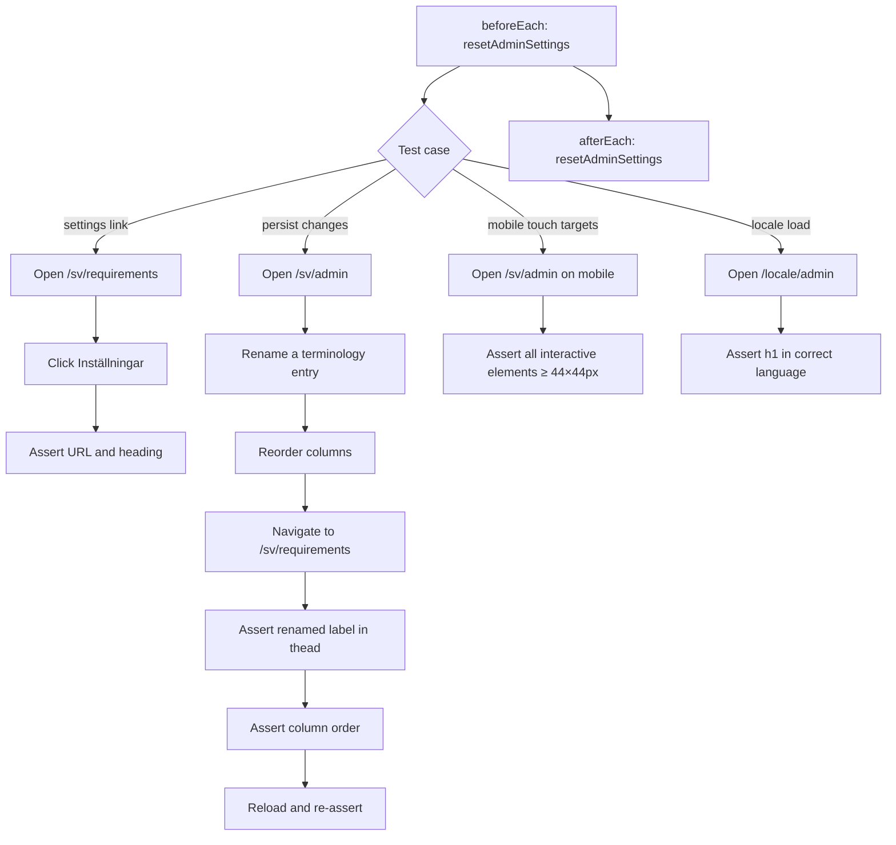
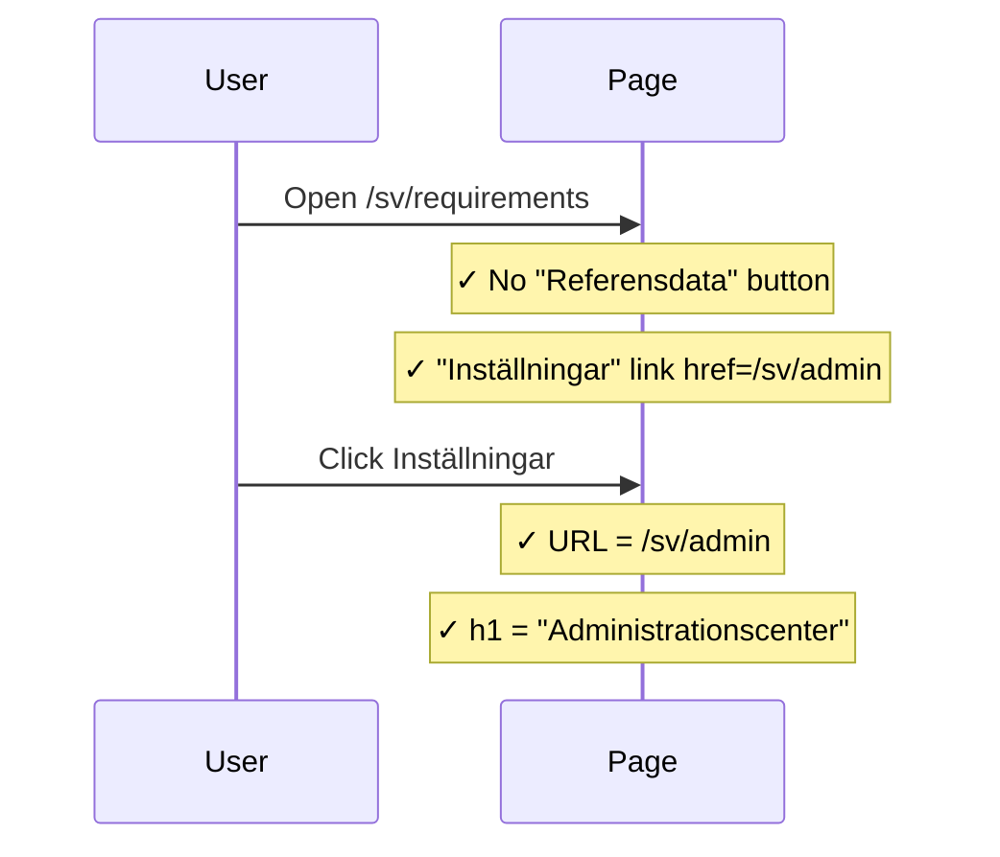
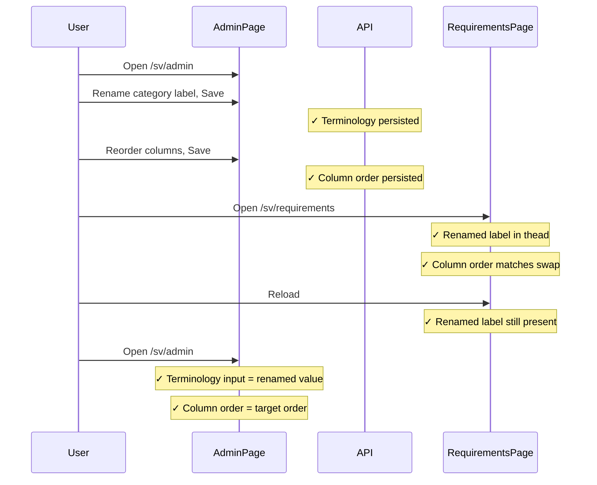
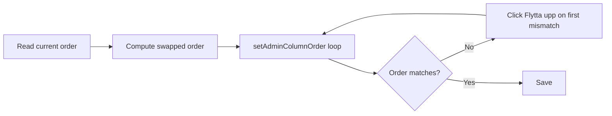
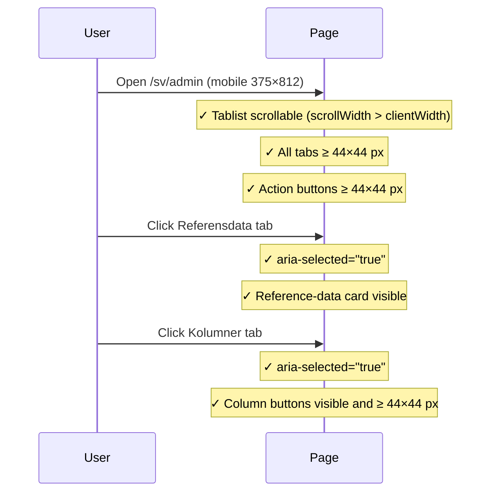
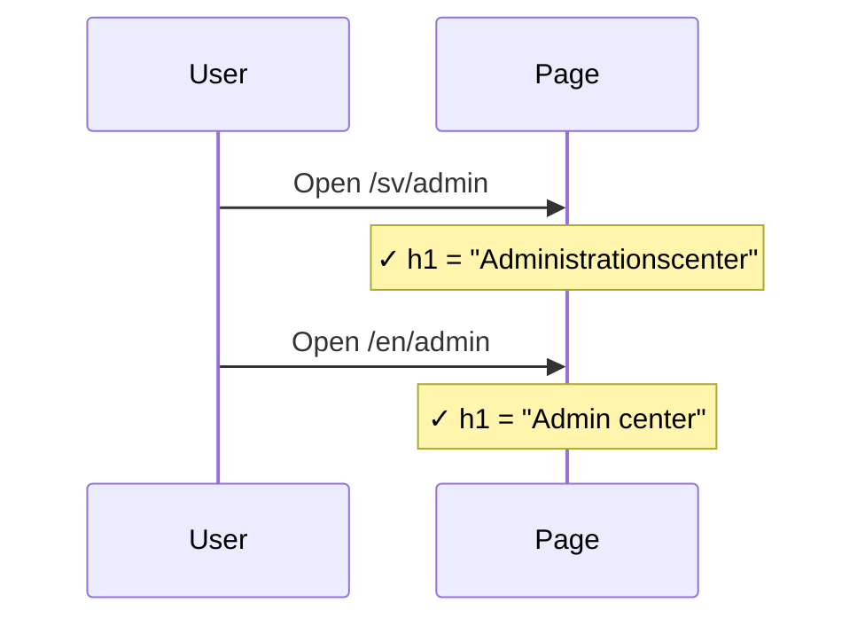

# Admin Entrypoint Integration Tests

> Test flow documentation for
> [`admin-entrypoint.spec.ts`](tests/integration/admin-entrypoint.spec.ts)

This suite verifies the administration centre entrypoint: navigating from the
requirements catalogue, persisting terminology and column-order changes across
page reloads, touch-target accessibility on mobile, and locale-specific page
loads.

## Data Model

<!-- markdownlint-disable MD013 -->
| Item | Purpose |
| --- | --- |
| `DEFAULT_TERMINOLOGY_PAYLOAD` | Full set of UI terminology keys with default values. Reset via `PUT /api/admin/terminology`. |
| `DEFAULT_COLUMN_PAYLOAD` | Full set of requirement list column defaults. Reset via `PUT /api/admin/requirement-columns`. |
| `[data-testid^="admin-column-row-"]` | Drag-sortable column rows in the Kolumner tab. |
<!-- markdownlint-enable MD013 -->

## Overview Flowchart

## Test Setup

- `test.describe.configure({ mode: 'serial' })` runs all tests sequentially to
  avoid concurrent writes to shared admin state.
- `beforeEach` and `afterEach` both call `resetAdminSettings`, which issues
  `PUT` requests to `/api/admin/terminology` and `/api/admin/requirement-columns`
  with their default values.
- Helper functions:
  - `assertOkResponse` — throws with status and body text if a reset request
    fails.
  - `resetAdminSettings` — calls both PUT resets and delegates to
    `assertOkResponse`.
  - `getAdminColumnOrder` — reads the current drag-row order from
    `[data-testid^="admin-column-row-"]` elements.
  - `setAdminColumnOrder` — clicks "Flytta upp" buttons iteratively until the
    target order is reached; throws if it cannot converge.
  - `swapColumns` — returns a new order array with two column IDs exchanged.
  - `expectTouchTargetSize` — asserts a locator's bounding box is at least
    44×44 px.
- The suite iterates over `desktop` (`1280×720`) and `mobile` (`375×812`)
  viewports for most tests. The mobile-touch-target test is desktop-skipped.
- The locale-load tests are viewport-independent and loop over `['sv', 'en']`.

## header settings link opens the Swedish admin center

### Purpose

Verifies that the "Inställningar" link in the requirements page header is
present, points to `/sv/admin`, and successfully navigates there, rendering the
Swedish admin heading.

### Step-by-Step Flow

1. Navigate to `/sv/requirements`.
1. Assert the "Referensdata" button is absent (not an admin context).
1. Assert the "Inställningar" link is visible with `href="/sv/admin"`.
1. Click the link.
1. Assert the URL is `/sv/admin`.
1. Assert the `h1` text is `"Administrationscenter"`.

### Sequence Diagram

## persists terminology and column changes through catalog reloads

### Purpose: Persist Changes

Confirms that renaming a terminology entry and reordering columns in the admin
centre are immediately reflected in the requirements catalogue and survive a
hard page reload.

### Step-by-Step Flow: Persist Changes

1. Navigate to `/sv/admin`.
1. Read the current singular label for "Kategorier".
1. Switch to the Kolumner tab and read the current column order.
1. Compute a target order that swaps `area` and `category`.
1. Switch to the Benämningar tab, append `" test"` to the category label,
   and click "Spara". Assert "Sparat" appears.
1. Switch to the Kolumner tab, apply the target order via `setAdminColumnOrder`,
   and click "Spara". Assert "Sparat" appears.
1. Navigate to `/sv/requirements`.
1. Assert the renamed label appears in `<thead>`.
1. Assert the column index of the renamed label is before or after "Område"
   consistent with the swapped order.
1. Reload the page.
1. Assert the renamed label is still in `<thead>`.
1. Navigate back to `/sv/admin` and assert the terminology input still holds
    the renamed value and the column order matches the target.

### Sequence Diagram: Persist Changes

### Supplementary Flowchart: Column Reorder

## keeps admin tabs and actions usable on mobile

### Purpose: Mobile Touch Targets

Confirms that all interactive controls on the admin centre mobile layout meet
the 44×44 px minimum touch-target requirement and that tab switching works
correctly.

### Step-by-Step Flow: Mobile Touch Targets

1. Navigate to `/sv/admin` on the `375×812` mobile viewport.
1. Locate the Benämningar, Kolumner, and Referensdata tabs and the tablist.
1. Assert the tablist `scrollWidth` exceeds its `clientWidth` (tabs overflow
   horizontally and are scrollable).
1. Assert each of the three tabs meets the 44×44 px touch-target minimum.
1. Assert the "English" and "Återställ standardvy" buttons meet the minimum.
1. Assert the "Spara" button meets the minimum.
1. Click the Referensdata tab. Assert it has `aria-selected="true"` and the
   reference-data card is visible.
1. Click the Kolumner tab. Assert it has `aria-selected="true"`.
1. Assert the column-section "Återställ standardvy" and "Spara" buttons are
   visible and meet the minimum.

### Sequence Diagram: Mobile Touch Targets

## admin page loads for sv / admin page loads for en

### Purpose: Locale Load

Smoke-checks that the admin centre renders the correct `h1` heading for both
the Swedish (`/sv/admin`) and English (`/en/admin`) locales.

### Step-by-Step Flow: Locale Load

1. Navigate to `/{locale}/admin`.
1. Assert the `h1` text is `"Administrationscenter"` for `sv` or
   `"Admin center"` for `en`.

### Sequence Diagram: Locale Load

