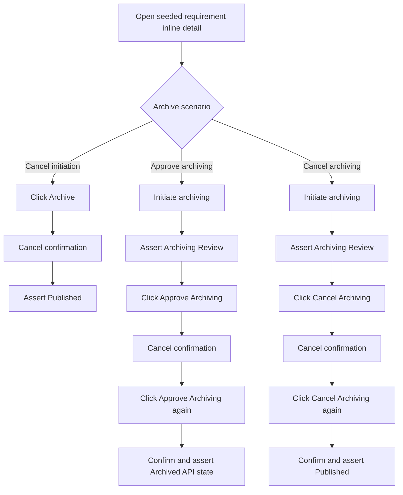
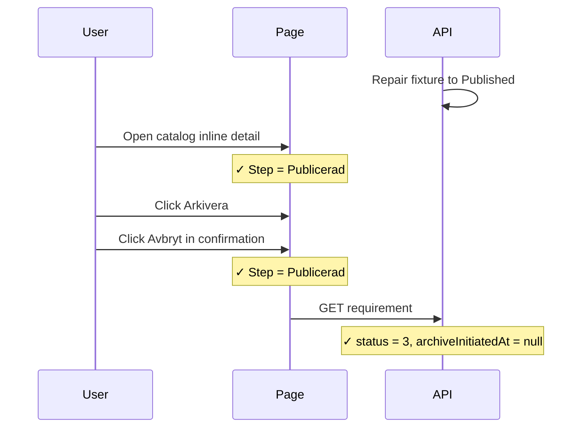
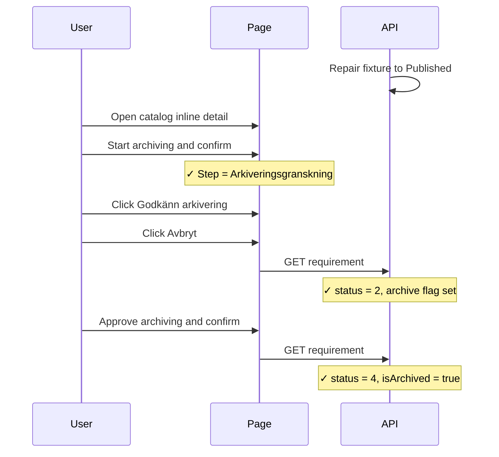
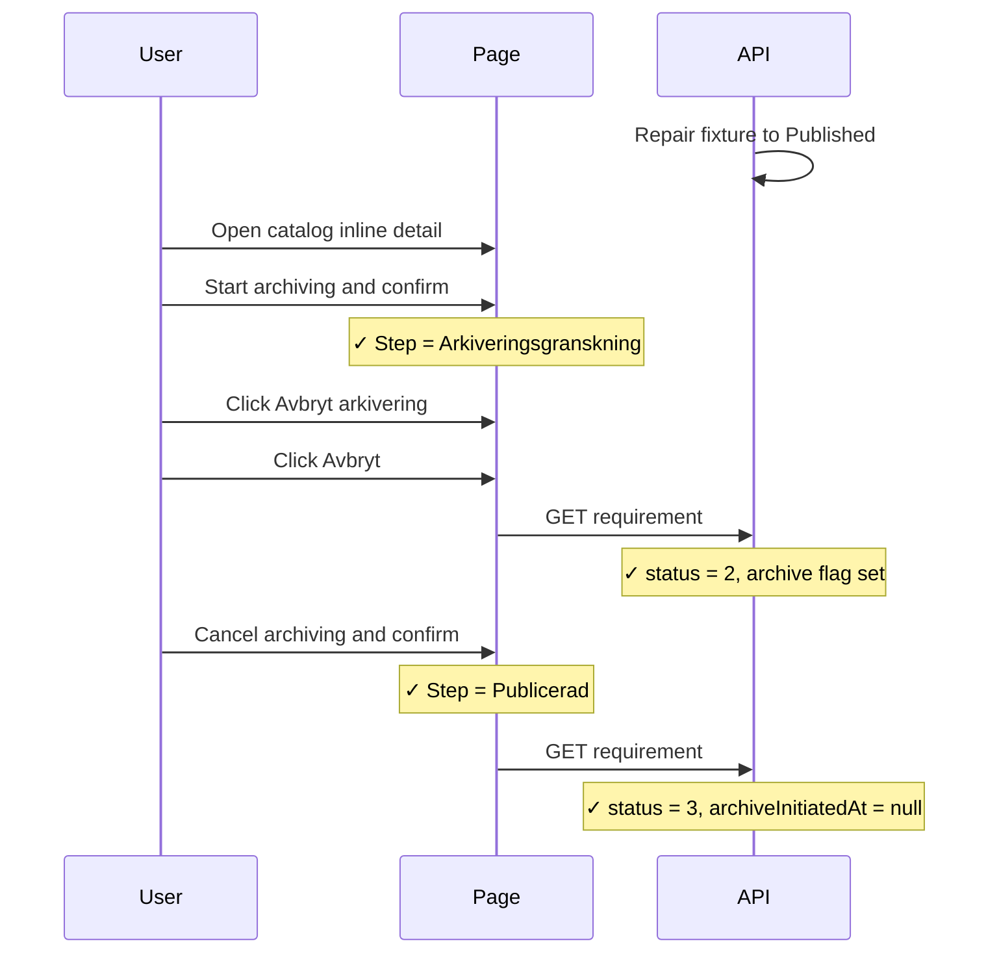

# Archive Lifecycle Integration Tests

> Test flow documentation for
> [`archive-lifecycle.spec.ts`](tests/integration/archive-lifecycle.spec.ts)

This suite verifies the requirement archive workflow in the real UI. It covers
cancelling archive initiation, approving archiving after an approval-dialog
cancel, and cancelling archiving after a cancellation-dialog cancel.

## Data Model

<!-- markdownlint-disable MD013 -->
| Fixture | Purpose |
| --- | --- |
| `PWT0005` / `PWT0006` | Approve-archiving fixtures for desktop and mobile. |
| `PWT0007` / `PWT0008` | Cancel-archiving fixtures for desktop and mobile. |
| `PWT0009` / `PWT0010` | Archive-initiation cancel fixtures for desktop and mobile. |
<!-- markdownlint-enable MD013 -->

Each fixture starts from a seeded Published version. The local-rerun helper
repairs mutated fixtures through public app APIs only:

```json
{
  "isArchived": false,
  "versions": [
    {
      "archiveInitiatedAt": null,
      "status": 3,
      "versionNumber": 1
    }
  ]
}
```

## Overview Flowchart



## Test Setup

- The suite runs at mobile (`375x812`) and desktop (`1280x720`) viewports.
- The tests open requirements through `/sv/requirements?selected={uniqueId}`
  so the catalog inline detail stays actionable when a Published version enters
  archiving review.
- `ensurePublishedRequirement()` repairs local reruns by cancelling an
  archiving review, restoring archived requirements, or completing draft and
  review states back to Published.
- `selectLatestVersion()` keeps assertions on the newest version after archive
  initiation when a rerun fixture also has older archived history.
- `assertActiveStepperStep()` verifies the active requirement lifecycle step
  via `[aria-current="step"]`.
- Final state is asserted through `/api/requirements/{uniqueId}`.

## cancels archive initiation without changing Published state

### Purpose: Initiation Cancel

Validates that dismissing the initial archive confirmation leaves the
requirement Published and does not set `archiveInitiatedAt`.

### Step-by-Step Flow: Initiation Cancel

1. Repair the fixture to Published if a previous local run mutated it.
2. Open `PWT0009` on desktop or `PWT0010` on mobile in the catalog inline
   detail.
3. Assert the active lifecycle step is "Publicerad".
4. Click "Arkivera".
5. Assert the confirmation text asks to start the archive process.
6. Click "Avbryt".
7. Assert the active lifecycle step is still "Publicerad".
8. Assert the API state is Published, not archived, and has no archive flag.

### Sequence Diagram: Initiation Cancel



## approves archiving after cancelling the approval once

### Purpose: Archive Approval

Validates the two-step archive happy path and proves that cancelling the first
approval confirmation leaves the requirement in archiving review.

### Step-by-Step Flow: Archive Approval

1. Repair the fixture to Published if needed.
2. Open `PWT0005` on desktop or `PWT0006` on mobile in the catalog inline
   detail.
3. Click "Arkivera" and confirm.
4. Assert the active lifecycle step is "Arkiveringsgranskning".
5. Click "Godkänn arkivering".
6. Click "Avbryt" in the confirmation.
7. Assert the requirement is still in archiving review through UI and API.
8. Click "Godkänn arkivering" again and confirm.
9. Assert the inline detail closes after the archived requirement leaves the
   active list.
10. Assert the API state is Archived and no archive flag remains.

### Sequence Diagram: Archive Approval



## cancels archiving after cancelling the cancellation once

### Purpose: Archive Cancellation

Validates that cancelling the cancellation dialog keeps archiving review active,
then confirms the user can return the requirement to Published.

### Step-by-Step Flow: Archive Cancellation

1. Repair the fixture to Published if needed.
2. Open `PWT0007` on desktop or `PWT0008` on mobile in the catalog inline
   detail.
3. Click "Arkivera" and confirm.
4. Assert the active lifecycle step is "Arkiveringsgranskning".
5. Click "Avbryt arkivering".
6. Click "Avbryt" in the confirmation.
7. Assert the requirement is still in archiving review through UI and API.
8. Click "Avbryt arkivering" again and confirm.
9. Assert the active lifecycle step returns to "Publicerad".
10. Assert the API state is Published, not archived, and has no archive flag.

### Sequence Diagram: Archive Cancellation


