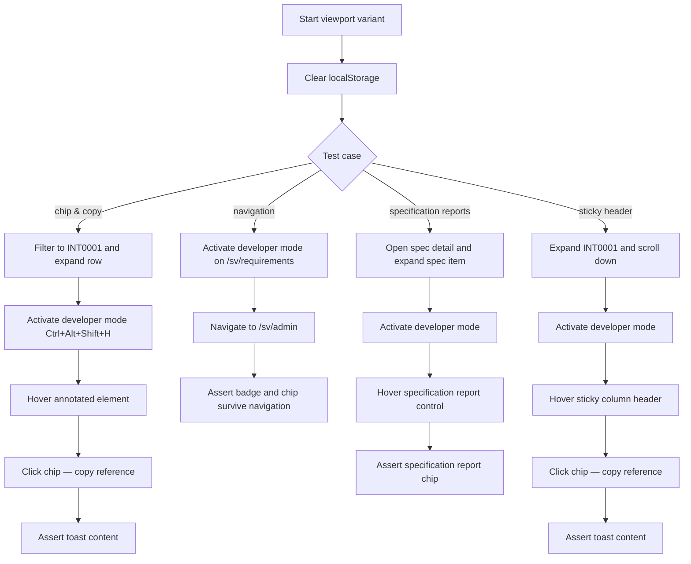
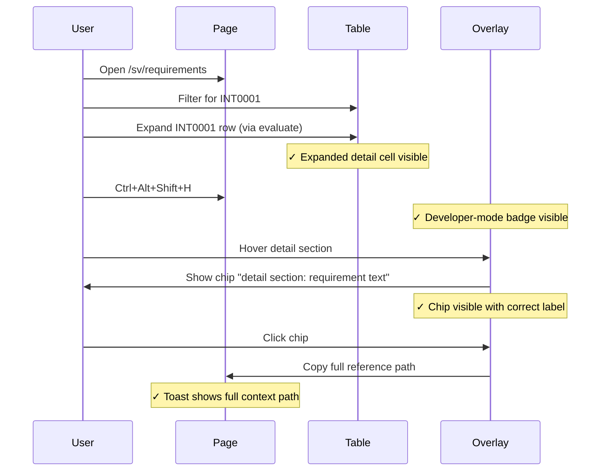
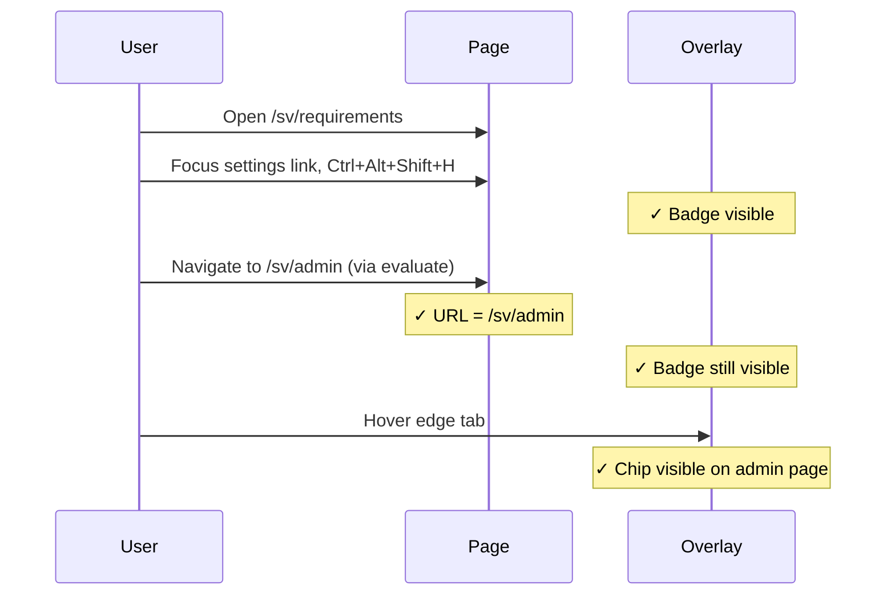
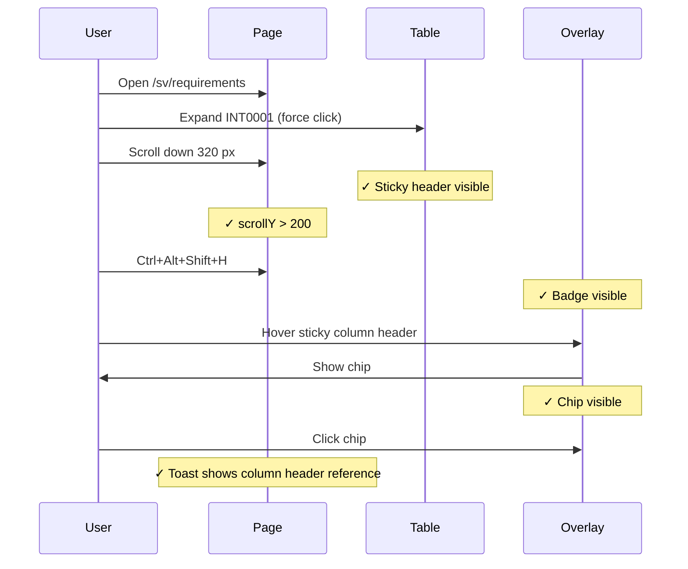

# Developer Mode Overlay Integration Tests

> Test flow documentation for
> [`developer-mode-overlay.spec.ts`](tests/integration/developer-mode-overlay.spec.ts)

This suite verifies the developer-mode overlay feature: the keyboard shortcut
that activates it, the hover chip that appears over annotated elements, the
clipboard copy behaviour, and the persistence of developer mode across client-
side navigation. It also confirms that specification-context report controls and
sticky table headers remain annotated and referenceable.

## Overview Flowchart

## Test Setup

- `test.beforeEach` clears `localStorage` via `page.addInitScript` so developer
  mode is always off at test start.
- The suite iterates over `mobile` (`375×812`) and `desktop` (`1280×720`)
  viewports so all three tests run at both sizes.
- Developer mode is toggled with the keyboard shortcut `Control+Alt+Shift+H`.
- The overlay badge is located with `[data-testid="developer-mode-badge"]`.
- Hover chips are located with `[data-developer-mode-overlay-chip="true"]`.
- The copy toast is located with `[data-developer-mode-toast="true"]`.

## shows chip on hover and copies a contextual reference

### Purpose

Confirms that once developer mode is active, hovering over an annotated element
shows a chip with its context path and that clicking the chip copies a fully-
qualified reference string to the clipboard (surfaced via the toast).

### Step-by-Step Flow

1. Navigate to `/sv/requirements`.
2. Click the Krav-ID filter and search for `INT0001`.
3. Expand the INT0001 row using `evaluate()` (sticky header overlaps the
   button; see inline comment in the spec).
4. Wait for the expanded detail cell to become visible.
5. Focus the INT0001 button and press `Control+Alt+Shift+H`.
6. Assert the developer-mode badge is visible.
7. Hover over the detail section annotated with
   `data-developer-mode-value="requirement text"`.
8. Assert the overlay chip is visible and contains
   `"detail section: requirement text"`.
9. Click the chip.
10. Assert the toast contains the full path
    `"requirements table > inline detail pane: INT0001 > detail section:`
    `requirement text"`.

### Sequence Diagram

## keeps developer mode active across client navigation into admin

### Purpose: Navigation Persistence

Verifies that developer mode survives a client-side route transition so that
engineers can inspect elements on pages they navigate to without re-activating
the shortcut.

### Step-by-Step Flow: Navigation Persistence

1. Navigate to `/sv/requirements` and wait for the first table row.
2. Focus the "Inställningar" link and press `Control+Alt+Shift+H`.
3. Assert the developer-mode badge is visible.
4. Trigger navigation to `/sv/admin` via `evaluate()` (sticky header overlap).
5. Assert the URL is `/sv/admin`.
6. Assert the developer-mode badge is still visible.
7. Hover over an element annotated with `data-developer-mode-name="edge tab"`.
8. Assert the overlay chip appears on the admin page.

### Sequence Diagram: Navigation Persistence

## exposes specification report controls in developer mode

### Purpose: Specification Report Reference

Verifies that the report trigger inside a specification-context inline requirement
detail has a curated Developer Mode marker instead of relying on fallback
scanning.

### Step-by-Step Flow: Specification Report Reference

1. Navigate to `/sv/specifications/ETJANST-UPP-2026`.
2. Locate the specification item table panel.
3. Expand the first specification item row.
4. Find the specification report trigger marked as
   `data-developer-mode-value="specification reports"`.
5. Focus that trigger and activate Developer Mode.
6. Hover over the specification report trigger.
7. Assert the chip contains `"report print button: specification reports"`.

## keeps sticky table headers referenceable in developer mode

### Purpose: Sticky Header Reference

Confirms that sticky `<th>` elements remain annotated and produce a chip when
hovered after the page has been scrolled down, ensuring developer mode works
with the sticky header layout.

### Step-by-Step Flow: Sticky Header Reference

1. Navigate to `/sv/requirements` and wait for the first row.
2. Expand the INT0001 row with `click({ force: true })` (sticky header
   overlap; see inline comment in the spec).
3. Scroll down 320 px with `page.mouse.wheel`.
4. Assert the sticky `<th>` for "requirement id" is visible.
5. Assert `window.scrollY` is greater than 200.
6. Press `Control+Alt+Shift+H` to activate developer mode.
7. Assert the developer-mode badge is visible.
8. Hover over the sticky column header.
9. Assert the chip is visible.
10. Click the chip.
11. Assert the toast contains
    `"requirements table > column header: requirement id"`.

### Sequence Diagram: Sticky Header Reference

