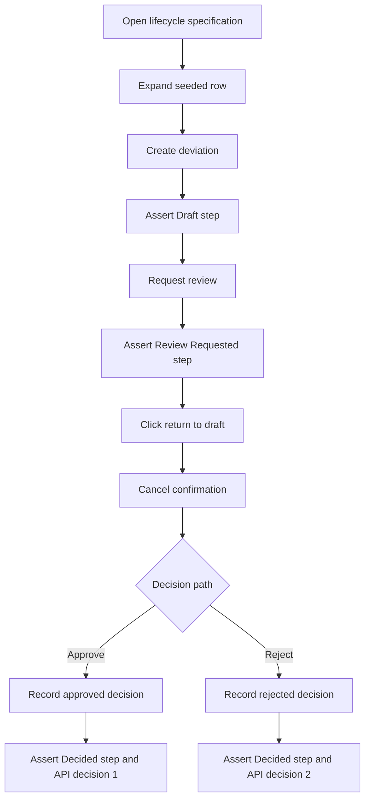
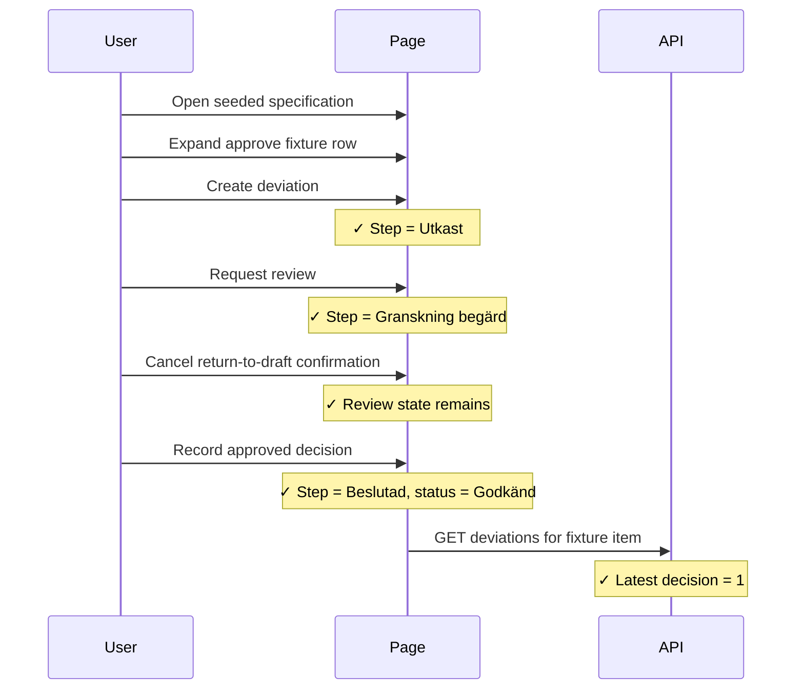

# Deviation Lifecycle Integration Tests

> Test flow documentation for
> [`deviation-lifecycle.spec.ts`](tests/integration/deviation-lifecycle.spec.ts)

This suite verifies the specification-item deviation workflow in the real UI.
It covers creating a draft deviation, requesting review, cancelling a return to
draft, and recording approved and rejected decisions.

## Data Model

<!-- markdownlint-disable MD013 -->
| Fixture | Item ref | Purpose |
| --- | --- | --- |
| `PWT0001` / `PWT0002` | `lib:39` / `lib:40` | Approve-path fixtures for desktop and mobile. |
| `PWT0003` / `PWT0004` | `lib:41` / `lib:42` | Reject-path fixtures for desktop and mobile. |
| `PLAYWRIGHT-LIFECYCLE-2026` | n/a | Seeded specification containing the deviation fixtures. |
<!-- markdownlint-enable MD013 -->

The tests read persisted state through
`/api/specification-item-deviations/{itemRef}` and assert the latest deviation:

```json
{
  "decision": 1,
  "decisionMotivation": "PWT0001 desktop approve decision",
  "isReviewRequested": 1,
  "motivation": "PWT0001 desktop approve deviation"
}
```

## Overview Flowchart



## Test Setup

- The suite runs at mobile (`375x812`) and desktop (`1280x720`) viewports.
- `closeLatestPendingDeviation()` closes a pending latest deviation before a
  local rerun by requesting review when needed and recording a rejected cleanup
  decision.
- `openSpecificationFixtureRow()` navigates to the seeded specification and
  expands the row matching the fixture `uniqueId`.
- `expectLatestDeviationState()` waits for each persisted lifecycle change,
  then the test reopens the exact fixture row so mobile rerenders cannot leave
  assertions attached to a collapsed inline detail.
- `assertActiveStepperStep()` verifies the active deviation workflow step via
  `[aria-current="step"]`.

## can approve a deviation after review is requested

### Purpose: Approval

Validates the happy path where a draft deviation is submitted for review and
approved after the return-to-draft confirmation is dismissed once.

### Step-by-Step Flow: Approval

1. Close any pending latest deviation for the fixture item.
2. Open `/sv/specifications/PLAYWRIGHT-LIFECYCLE-2026`.
3. Expand `PWT0001` on desktop or `PWT0002` on mobile.
4. Click "Begär ett avsteg".
5. Fill the motivation, then click "Registrera avsteg".
6. Wait for the API latest deviation to match the draft and reopen the row.
7. Assert the active deviation step is "Utkast".
8. Click "Granskning", wait for persisted review state, and reopen the row.
9. Assert "Granskning begärd".
10. Click the return-to-draft action, then click "Avbryt".
11. Assert the active step is still "Granskning begärd".
12. Open "Registrera beslut", choose "Godkänn", fill decision fields, and
    submit.
13. Wait for the API latest deviation to match the approved decision and
    reopen the row.
14. Assert the active step is "Beslutad" and the pill says "Godkänd".

### Sequence Diagram: Approval



## can reject a deviation after review is requested

### Purpose: Rejection

Validates the rejection path where a draft deviation is submitted for review
and rejected after the return-to-draft confirmation is dismissed once.

### Step-by-Step Flow: Rejection

1. Close any pending latest deviation for the fixture item.
2. Open `/sv/specifications/PLAYWRIGHT-LIFECYCLE-2026`.
3. Expand `PWT0003` on desktop or `PWT0004` on mobile.
4. Click "Begär ett avsteg".
5. Fill the motivation, then click "Registrera avsteg".
6. Wait for the API latest deviation to match the draft and reopen the row.
7. Assert the active deviation step is "Utkast".
8. Click "Granskning", wait for persisted review state, and reopen the row.
9. Assert "Granskning begärd".
10. Click the return-to-draft action, then click "Avbryt".
11. Assert the active step is still "Granskning begärd".
12. Open "Registrera beslut", choose "Avslå", fill decision fields, and
    submit.
13. Wait for the API latest deviation to match the rejected decision and reopen
    the row.
14. Assert the active step is "Beslutad" and the pill says "Avslagen".

### Sequence Diagram: Rejection


