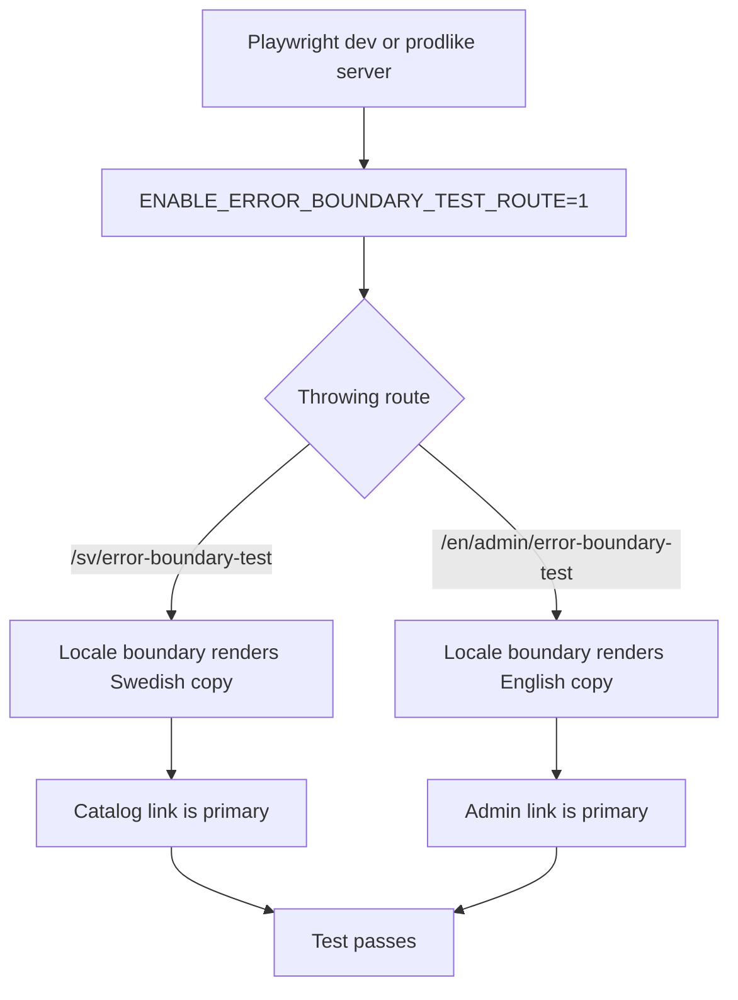
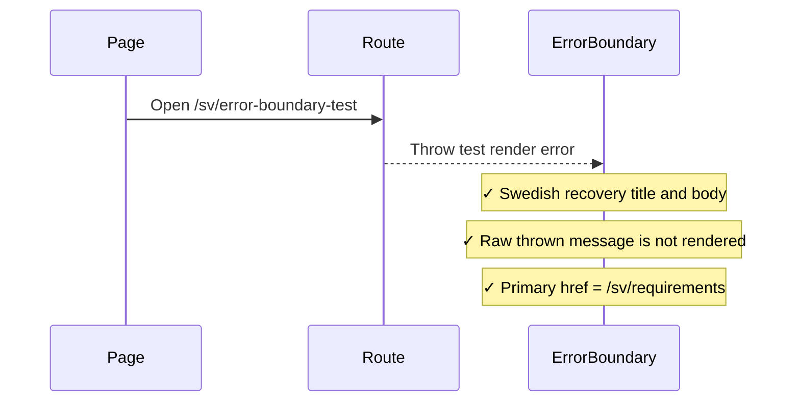
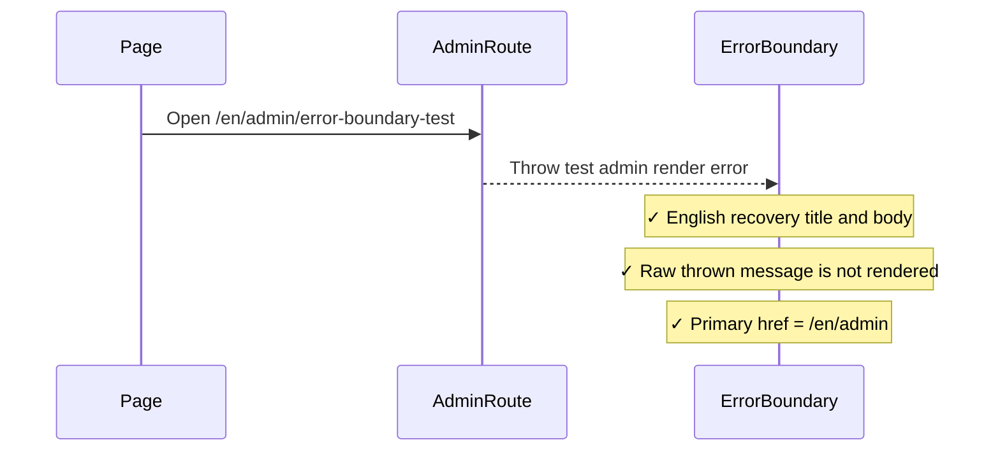

# Error Boundary Smoke Integration Tests

> Test flow documentation for
> [`error-boundary-smoke.spec.ts`](./error-boundary-smoke.spec.ts)

This suite verifies that unexpected App Router render failures show a localized
recovery surface instead of raw framework output. It covers the catalog default
path and the admin/reference-data path, including retry affordances, safe
navigation links, and suppression of raw technical error messages.

## Overview Flowchart

## Test Setup

- The Playwright dev-server and prodlike integration configurations set
  `ENABLE_ERROR_BOUNDARY_TEST_ROUTE=1`; the prodlike CI job also passes it to
  the build and externally managed pruned server.
- The test-only pages are force-dynamic and read request headers before checking
  the environment gate, so the pruned prodlike server evaluates the gate at
  request time instead of reusing a static build-time result.
- The test-only routes return `notFound()` when that environment variable is
  not set, so normal development and production builds do not expose these
  throw triggers.
- The standard integration `storageState` supplies the authenticated admin
  session; no additional login steps are needed.
- Assertions are scoped to the `role="alert"` recovery surface so the suite
  checks the actual fallback UI instead of unrelated navigation chrome.

## shows Swedish catalog recovery for a locale route render failure

### Purpose: Catalog Recovery

Verifies that a non-admin route failure under `/sv` renders Swedish recovery
copy, hides the raw thrown message, exposes a retry button, and prioritizes the
requirements catalog as the safe destination.

### Step-by-Step Flow: Catalog Recovery

1. Navigate to `/sv/error-boundary-test`.
1. Locate the error recovery alert.
1. Assert Swedish title and body copy are present.
1. Assert the raw test error message is absent from the alert.
1. Assert the retry button is present.
1. Assert the first recovery link is `/sv/requirements`.
1. Assert the second recovery link is `/sv/admin`.

### Sequence Diagram: Catalog Recovery

## shows English admin recovery for an admin route render failure

### Purpose: Admin Recovery

Verifies that an admin-route failure under `/en` renders English recovery copy,
hides the raw thrown message, exposes a retry button, and prioritizes the admin
overview as the safe destination.

### Step-by-Step Flow: Admin Recovery

1. Navigate to `/en/admin/error-boundary-test`.
1. Locate the error recovery alert.
1. Assert English title and body copy are present.
1. Assert the raw test error message is absent from the alert.
1. Assert the retry button is present.
1. Assert the first recovery link is `/en/admin`.
1. Assert the second recovery link is `/en/requirements`.

### Sequence Diagram: Admin Recovery

