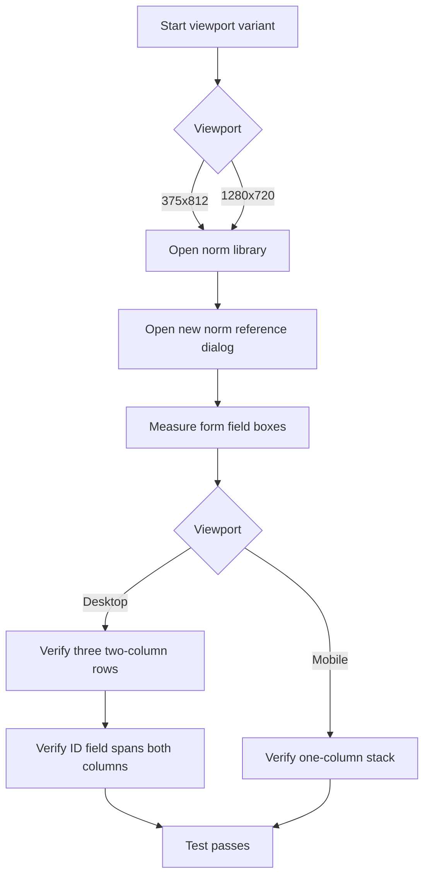
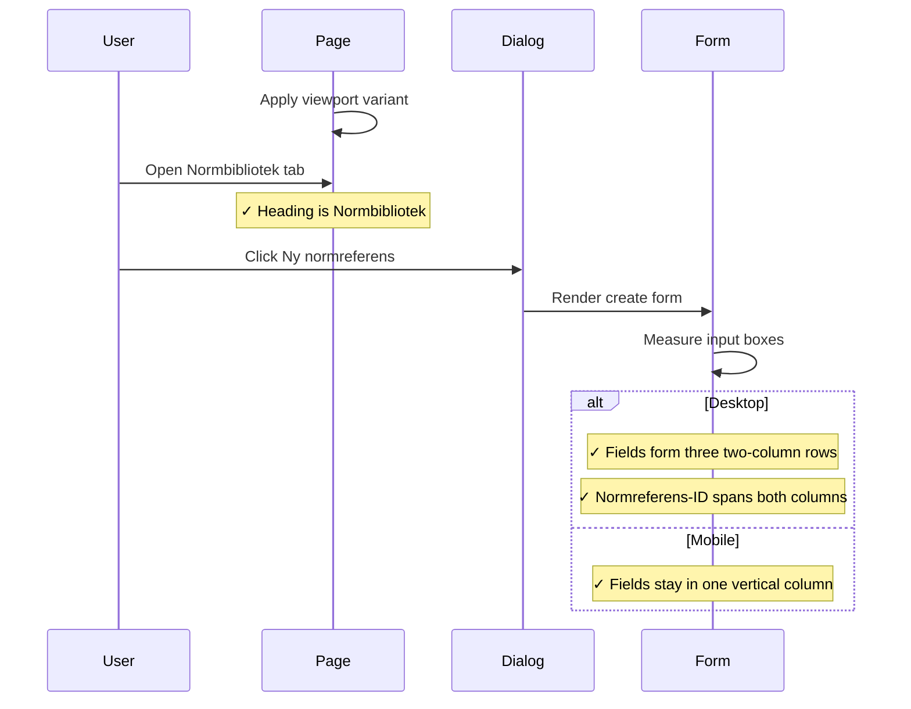

# Norm Reference Create Layout Integration Tests

> Test flow documentation for
> [`norm-reference-create-layout.spec.ts`](./norm-reference-create-layout.spec.ts)

This suite verifies that the new norm-reference form stays compact on
desktop by using two columns, while remaining a single readable column on
mobile.

## Data Model

| Item | Purpose |
| --- | --- |
| Viewport matrix | Runs at `375x812` and `1280x720`. |
| Field boxes | Browser bounding boxes for the create-form inputs. |
| Row checks | Compare field positions to verify column layout. |
| Width checks | Confirm the ID override field spans the desktop form. |

## Overview Flowchart

## Test Setup

- The standard Playwright storage state supplies the authenticated admin
  session.
- The same test runs once per viewport variant through Playwright
  `test.use({ viewport })`.
- The test opens `/sv/requirements/stewardship?tab=norms` directly so it
  starts on the Normbibliotek tab.
- No fixed wait is used. The test waits through Playwright role and text
  assertions before measuring the input positions.

## lays out the new norm reference form responsively

### Purpose

This test validates that the create dialog grows horizontally on desktop
instead of only becoming taller, and that the same form remains a safe
single-column layout on mobile.

### Step-by-Step Flow

1. Start the current viewport variant.
2. Open `/sv/requirements/stewardship?tab=norms`.
3. Assert that the page heading is `Normbibliotek`.
4. Click `Ny normreferens`.
5. Assert that the `Ny normreferens` dialog opens once.
6. Measure the input boxes for Benämning, Typ, Referens, Version,
   Utfärdare, URI, and Normreferens-ID.
7. On desktop, assert that Benämning/Typ, Referens/Version, and
   Utfärdare/URI share rows.
8. On desktop, assert that Normreferens-ID sits below the three rows and
   spans wider than one ordinary column.
9. On mobile, assert that every field aligns with Benämning on the same
   x-axis and appears in vertical order.

### Sequence Diagram

