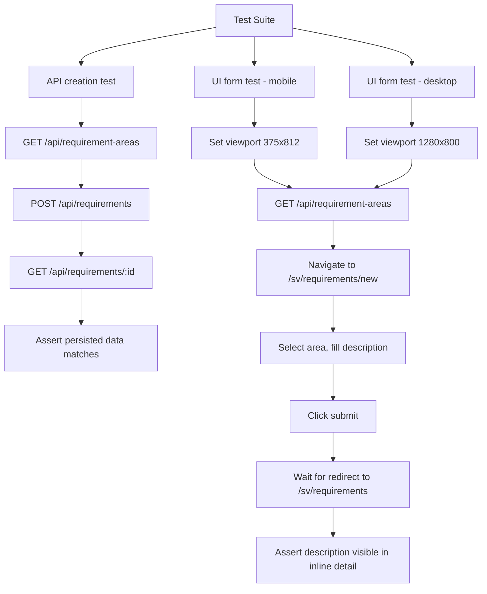
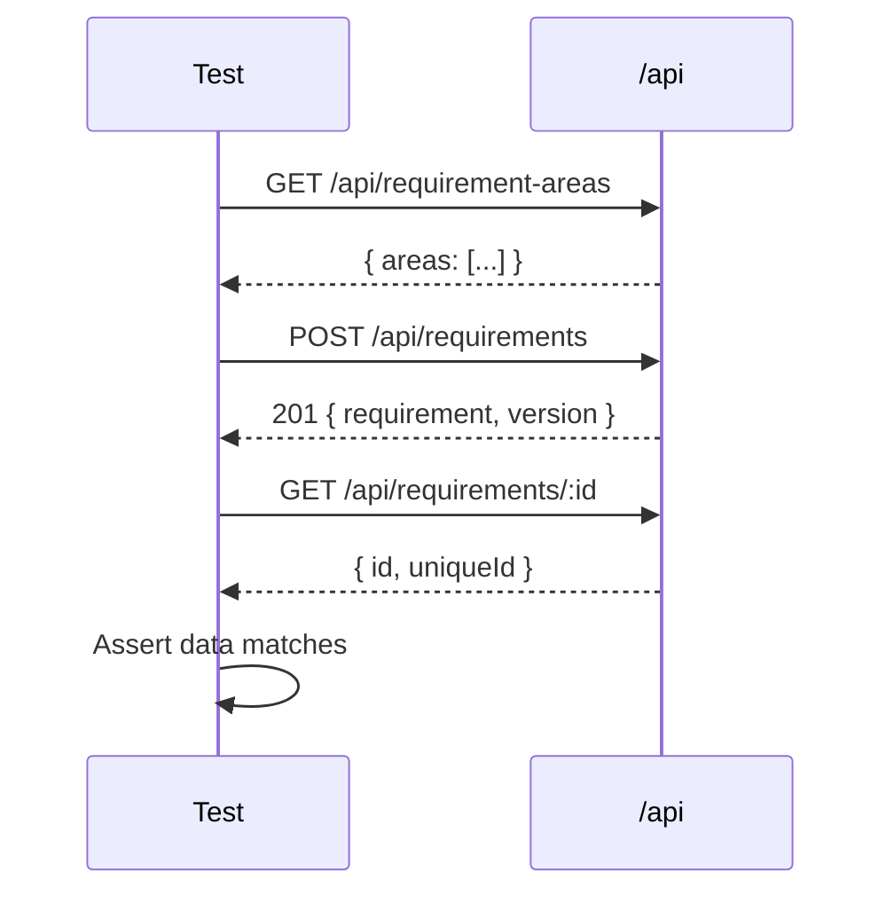
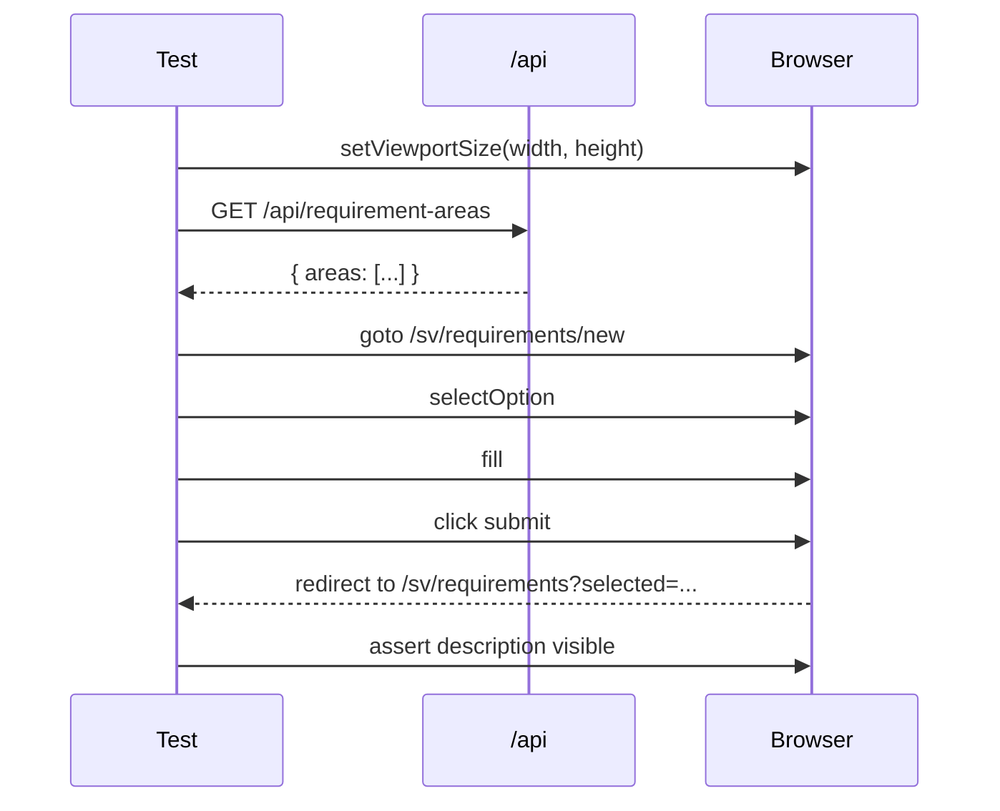

# Requirement Creation Integration Tests

> Test flow documentation for
> [`requirement-create.spec.ts`](requirement-create.spec.ts)

Validates that new requirements can be created via both the REST API and the
browser UI form, and that the resulting data persists correctly.

## Overview Flowchart

## Test Setup

- No shared `beforeEach` hooks; each test fetches its own area list.
- The API test uses Playwright's `request` context for direct HTTP calls.
- The UI tests use Playwright's `page` context and set viewport size per
  iteration.

## Test Cases

### POST /api/requirements persists a new requirement

**Purpose**: Verify the REST API create endpoint works end-to-end.

**Steps**:

1. `GET /api/requirement-areas` — retrieve available areas.
2. `POST /api/requirements` with `{ areaId, description, requiresTesting }`.
3. Assert `201` status and response contains `requirement.id`,
   `requirement.uniqueId`, `version.description`.
4. `GET /api/requirements/:id` — fetch the created requirement back.
5. Assert fetched `id` and `uniqueId` match the creation response.

### Form submit redirects to list with inline detail open (mobile / desktop)

**Purpose**: Verify the browser form creates a requirement and redirects to the
list view with the inline detail panel showing the new requirement. Runs at both
mobile (375 x 812) and desktop (1280 x 800) viewports.

**Steps**:

1. Set viewport to the target size.
2. `GET /api/requirement-areas` — retrieve available areas.
3. Navigate to `/sv/requirements/new`.
4. `selectOption('#areaId', areaId)` — pick the first area.
5. `fill('#description', 'Playwright UI test requirement')`.
6. `click('button[type="submit"]')`.
7. `waitForURL(/\/sv\/requirements(?:\?|$)/)` — confirm redirect.
8. Assert URL does not contain `undefined`.
9. Assert text *"Playwright UI test requirement"* is visible (inline detail
   panel).

