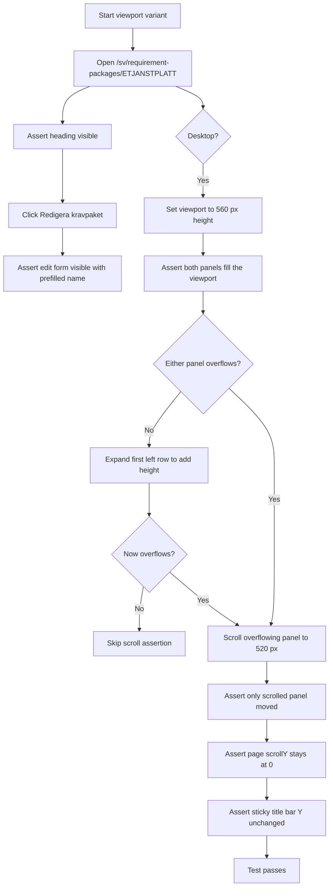
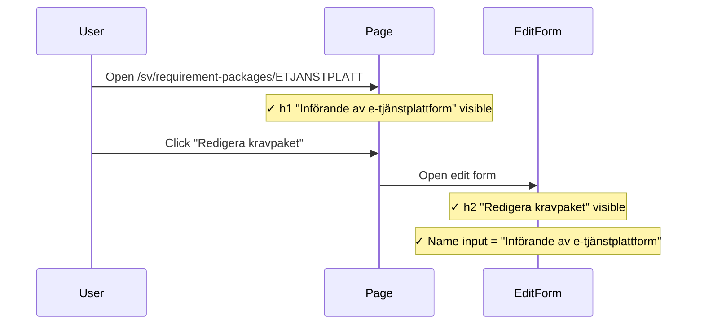
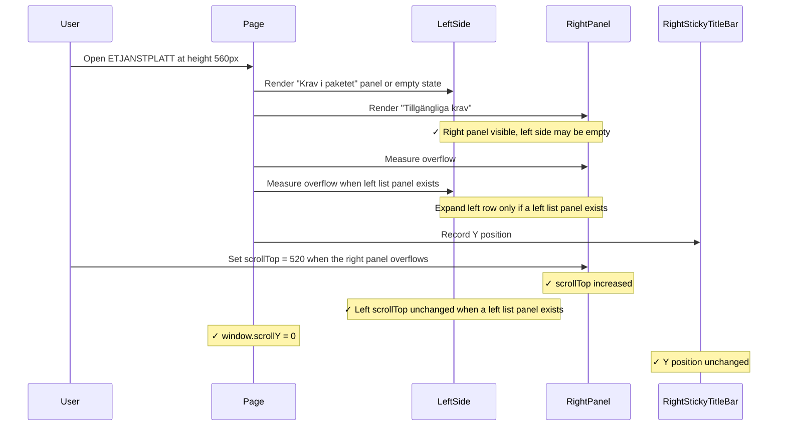
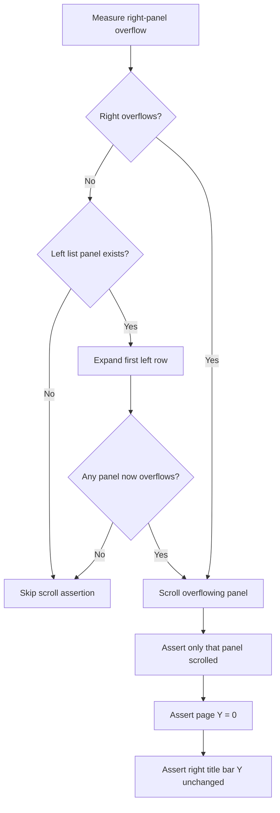

# Requirement Package Detail Integration Tests

> Test flow documentation for
> [`requirement-package-detail.spec.ts`](tests/integration/requirement-package-detail.spec.ts)

This suite verifies the requirement package detail page: that the edit form
opens from the title action and that the two side-by-side requirement lists
("Krav i paketet" and "Tillgängliga krav") scroll independently without moving
the page, while keeping the sticky title bar fixed at the top of each panel.

## Data Model

<!-- markdownlint-disable MD013 -->
| Locator | Description |
| --- | --- |
| `[data-package-detail-list-panel="items"]` | Left panel — requirements already in the package. |
| `[data-package-detail-list-panel="available"]` | Right panel — requirements available to add. |
| `[data-requirements-sticky-top-bar="true"]` | Sticky title bar inside each panel. |
| `[data-column-picker-trigger="true"]` | Column-picker pill inside each panel. |
| `[data-requirement-header-label="uniqueId"]` | Krav-ID column header label. |
| `[data-expanded-detail-cell="true"]` | Inline detail pane expanded inside a row. |
<!-- markdownlint-enable MD013 -->

## Overview Flowchart

## Test Setup

- No `beforeEach` hooks. Each test navigates independently.
- The suite iterates over `mobile` (`375×812`) and `desktop` (`1280×720`)
  viewports.
- The independent-scroll test is desktop-only and reduces the viewport height
  to 560 px after navigation to create overflow conditions.
- Overflow is detected by comparing `scrollHeight` with `clientHeight + 50`.
  If neither panel overflows even after expanding a row, the scroll-sync
  assertion is skipped (see inline comment in the spec).

## opens the package edit view from the title action

### Purpose

Verifies that clicking "Redigera kravpaket" opens the edit form and pre-fills
the package name, confirming the edit action is correctly wired to the detail
page title.

### Step-by-Step Flow

1. Navigate to `/sv/requirement-packages/ETJANSTPLATT`.
2. Assert the `h1` "Införande av e-tjänstplattform" heading is visible.
3. Click "Redigera kravpaket".
4. Assert the `h2` "Redigera kravpaket" heading is visible.
5. Assert the name text input has value `"Införande av e-tjänstplattform"`.

### Sequence Diagram

## lets the package-detail lists scroll independently and keeps the title bar sticky

### Purpose: Independent Panel Scroll

Confirms that the left and right panels each scroll their own content without
scrolling the page or the other panel, and that the sticky title bar stays
fixed at the same vertical position while the panel scrolls beneath it.

### Step-by-Step Flow: Independent Panel Scroll

1. Navigate to `/sv/requirement-packages/ETJANSTPLATT` at 560 px height.
2. Assert the available-requirements panel, its sticky bar, trigger, title,
   and Krav-ID header are visible, and `scrollY` is 0.
3. Assert the left side shows either the `items` list panel with its own
   sticky controls or the empty-state heading/message when the package has no
   linked requirements.
4. Measure initial overflow, starting with the available-requirements panel.
5. If neither side overflows and the left list panel exists, expand the first
   left row to add content height and re-measure.
6. If still no overflow, skip the scroll assertions.
7. Record initial `scrollTop` values and the visible panel bounding boxes.
8. Assert the right panel ends near the right viewport edge (within 8 px).
9. Assert the visible split-panel cards fit within the viewport height.
10. Programmatically set `scrollTop` to 520 on the overflowing panel.
11. Assert the scrolled panel's `scrollTop` increased.
12. If the left list panel exists and the right panel was scrolled, assert the
    left panel's `scrollTop` is unchanged.
13. Assert `window.scrollY` is still 0.
14. Assert the right sticky top bar, column-picker trigger, title, and
    Krav-ID header are still visible.
15. Assert the right sticky top bar's `y` position is the same before and
    after scrolling.

### Sequence Diagram: Independent Panel Scroll

### Supplementary Flowchart

