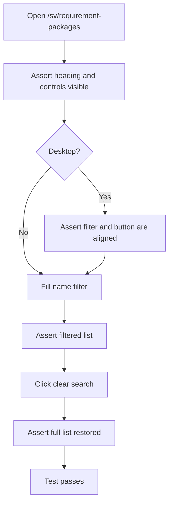
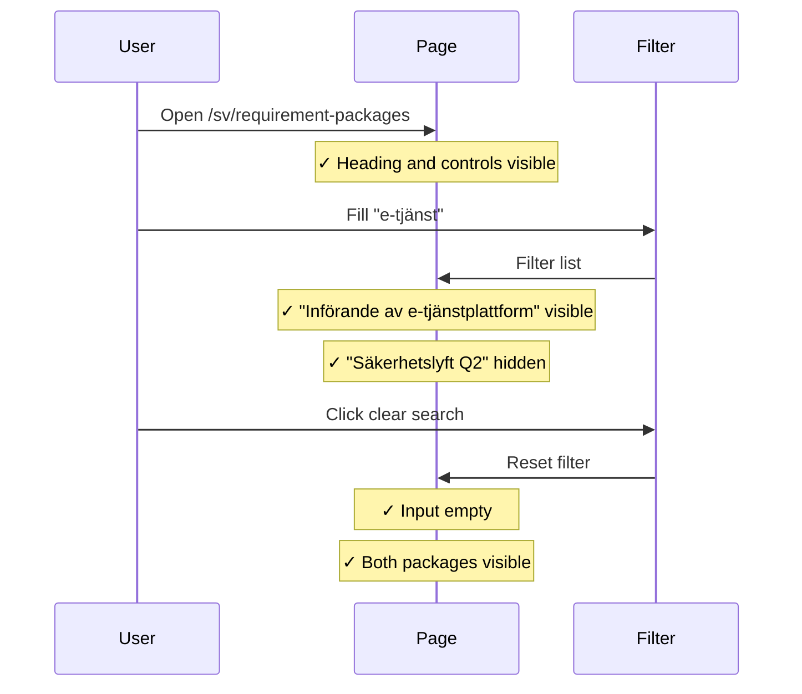
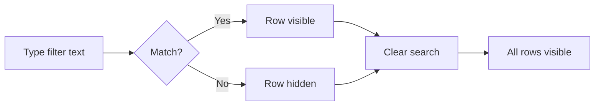

# Requirement Packages List Integration Tests

> Test flow documentation for
> [`requirement-packages-list.spec.ts`](tests/integration/requirement-packages-list.spec.ts)

This suite verifies that the requirement packages list page renders correctly,
that the name filter narrows the visible packages, and that the clear-search
action restores the full list. On desktop it additionally asserts that the
filter field and the create button are horizontally aligned.

## Overview Flowchart

## Test Setup

No `beforeEach` hooks. The suite iterates over two viewport definitions
(`375×812` mobile and `1280×720` desktop) so the same scenario runs at both
sizes.

## filters the table by package name and clears the search

### Purpose

Confirms that typing in the name filter hides non-matching packages and that
clicking the clear button restores all packages. On desktop it also verifies
that the filter input and the "Nytt kravpaket" button share the same row.

### Step-by-Step Flow

1. Navigate to `/sv/requirement-packages`.
1. Assert the `h1` "Kravpaket" heading is visible.
1. Assert the name-filter text input and "Nytt kravpaket" button are visible.
1. *(Desktop only)* Assert that the bottom edges of the filter and button are
   within 6 px of each other and that the button starts to the right of the
   filter.
1. Type `e-tjänst` into the name filter.
1. Assert "Införande av e-tjänstplattform" link is visible.
1. Assert "Säkerhetslyft Q2" link is hidden.
1. Click "Rensa sökning".
1. Assert the filter input value is empty.
1. Assert "Införande av e-tjänstplattform" is visible again.
1. Verify "Säkerhetslyft Q2" is visible again.

### Sequence Diagram

### Supplementary Flowchart

