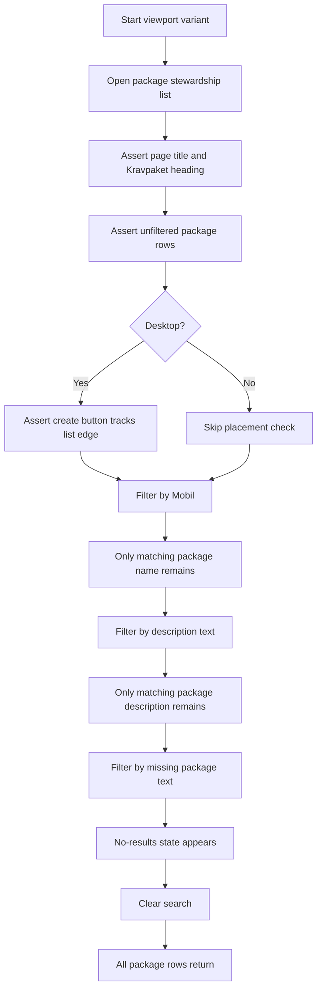
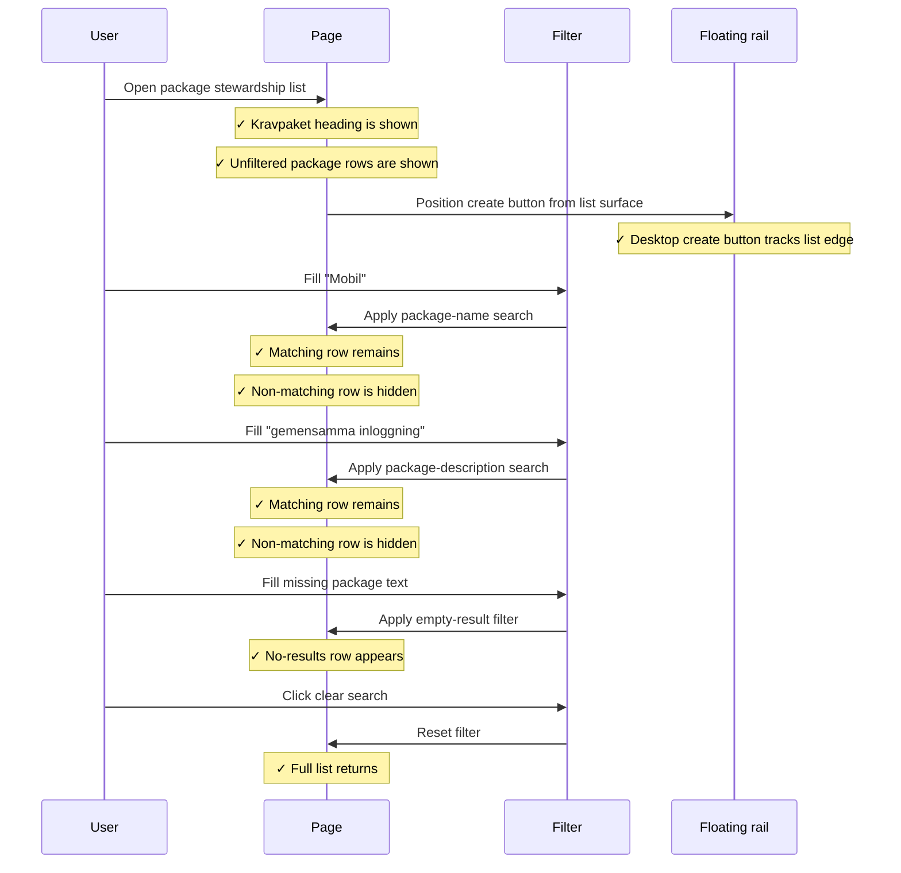
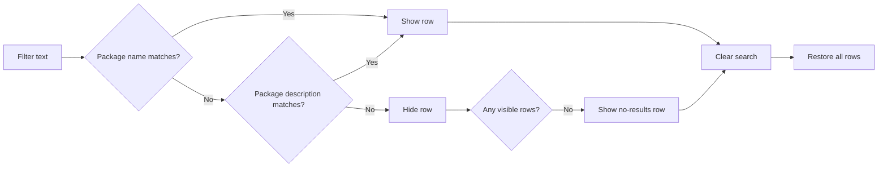

# Requirement Packages List Integration Tests

> Test flow documentation for
> [`requirement-packages-list.spec.ts`](./requirement-packages-list.spec.ts)

This suite verifies that the requirement packages list supports name or
description filtering, shows the no-results state for unmatched searches, clears
the search back to the full list, and keeps the floating `Nytt kravpaket` create
button anchored to the right side of the package list rather than to the search
field.

## Overview Flowchart

## Test Setup

- The suite runs the same scenario for mobile (`375x812`) and desktop
  (`1280x720`) viewports.
- The standard Playwright global setup provides an authenticated admin session.
- The desktop variant measures the floating create button and package-list
  surface to prevent regressions where the button follows the search field
  instead of the list.
- No fixed waits are used; all assertions rely on Playwright auto-retrying
  locators or direct measurements after visible elements are present.

## filters the table by package name or description and clears the search

### Purpose

Confirms that users can narrow the requirement packages list by package name or
description, recover from an empty result, and clear the filter. The desktop
placement check protects the expected list-edge position of the floating create
action.

### Step-by-Step Flow

1. Navigate to `/sv/requirements/stewardship?tab=packages`.
1. Assert the page title contains `Kravbiblioteksförvaltning`.
1. Assert the page heading is `Kravpaket`.
1. Assert the filter input is empty.
1. Assert both `Mobil användning` and `Single Sign-On` are present.
1. On desktop, assert `Nytt kravpaket` is positioned at the right edge of the
   package list.
1. Type `Mobil` into `Filtrera på namn eller beskrivning`.
1. Assert `Mobil användning` remains and `Single Sign-On` is hidden.
1. Type `gemensamma inloggning`.
1. Assert `Single Sign-On` remains and `Mobil användning` is hidden.
1. Type `paket som saknas`.
1. Assert `Inga resultat hittades` appears and package rows are hidden.
1. Click `Rensa sökning`.
1. Assert the filter is empty and both package rows are visible again.

### Sequence Diagram

### Supplementary Flowchart

