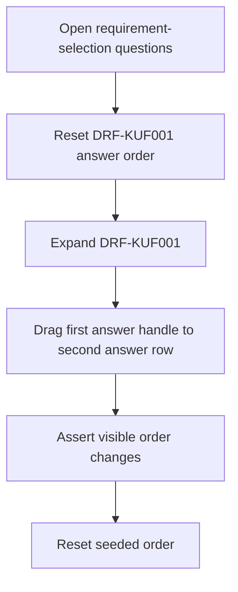
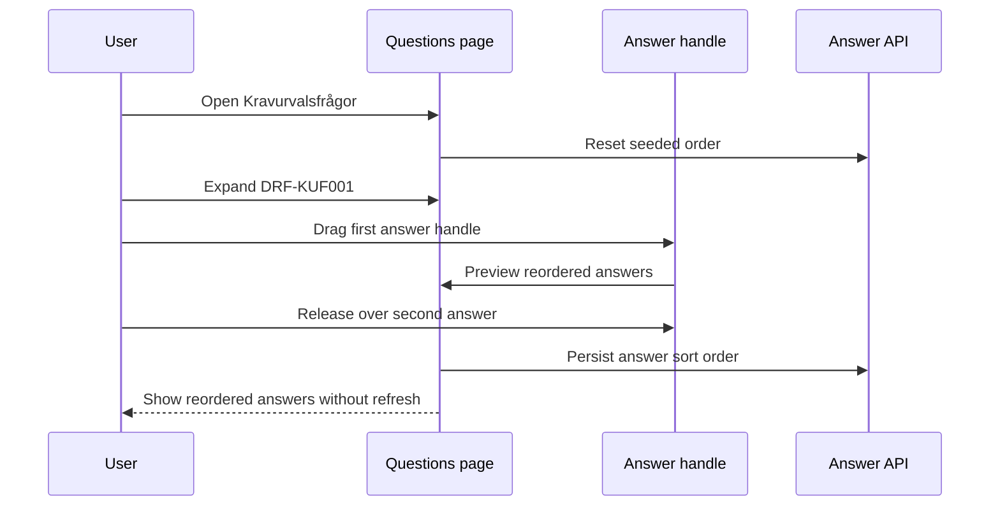

# Requirement Selection Answer Drag-and-Drop Integration Tests

> Test flow documentation for
> [`requirement-selection-answer-dnd.spec.ts`](./requirement-selection-answer-dnd.spec.ts)

This suite verifies that expanded requirement-selection answers can be reordered
from their drag handle in Chromium and that the order is persisted without a page
refresh.

## Overview Flowchart

## Test Setup

- The standard Playwright global setup provides an authenticated admin session.
- The test uses the seeded `DRF-KUF001` question and its four operational-mode
  answers.
- The seeded order is reset before and after the test through the same answer
  update API used by the UI.
- The drag uses a real mouse sequence in Chromium so the expanded answer handle
  behavior is covered at browser level.

## reorders expanded requirement-selection answers by dragging the answer handle

### Purpose

Protects the regression where the answer drag handle could receive focus or hover
feedback while the expanded answer still could not be dragged.

### Step-by-Step Flow

1. Navigate to `/sv/requirements/stewardship?tab=questions`.
1. Assert the `Kravurvalsfrågor` heading is present.
1. Reset `DRF-KUF001` answers to the seeded order.
1. Reload the page and expand `DRF-KUF001`.
1. Assert `Egen drift/on-premises` is first and `Molndrift` is second.
1. Drag the first answer handle to the second answer row with Playwright mouse
   events.
1. Assert `Molndrift` is first and `Egen drift/on-premises` is second.
1. Reset `DRF-KUF001` answers back to the seeded order.

### Sequence Diagram

