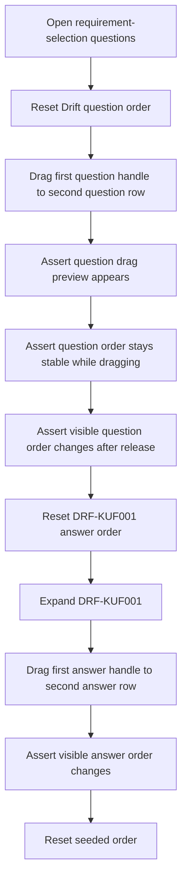
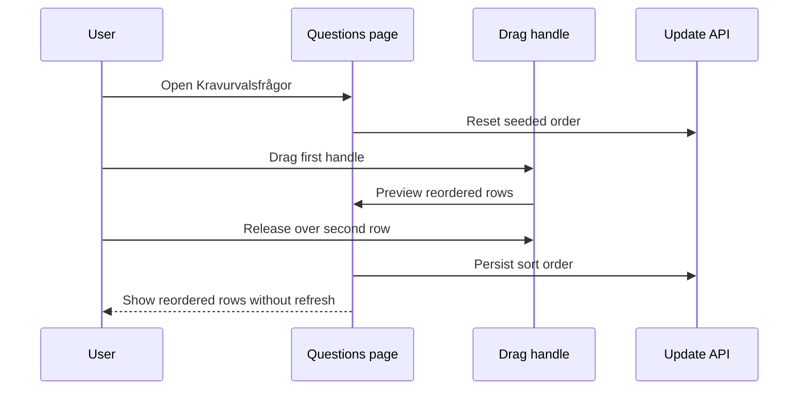

# Requirement Selection Drag-and-Drop Integration Tests

> Test flow documentation for
> [`requirement-selection-answer-dnd.spec.ts`](./requirement-selection-answer-dnd.spec.ts)

This suite verifies that requirement-selection questions and expanded answers can
be reordered from their drag handles in Chromium, that question drag shows a
visible floating row preview and stable drop target while moving, and that the
order is persisted without a page refresh.

## Overview Flowchart

## Test Setup

- The standard Playwright global setup provides an authenticated admin session.
- The tests use the seeded Drift (`DRF`) questions and the seeded `DRF-KUF001`
  operational-mode answers.
- Seeded question and answer orders are reset through the same update APIs used
  by the UI.
- The suite runs serially because it temporarily mutates shared seeded order.
- The drags use real mouse sequences in Chromium so handle behavior is covered
  at browser level.

## reorders collapsed requirement-selection questions by dragging the question handle

### Question Purpose

Protects the regression where a collapsed question handle could show active
feedback without actually moving the question row.

### Question Flow

1. Navigate to `/sv/requirements/stewardship?tab=questions`.
1. Assert the `Kravurvalsfrågor` heading is present.
1. Reset Drift questions to the seeded order.
1. Reload the page.
1. Assert `DRF-KUF001` is first and `DRF-KUF002` is second.
1. Drag the first question handle to the second question row with Playwright
   mouse events.
1. Assert the floating drag preview is visible and shows `DRF-KUF001`.
1. Assert `DRF-KUF001` remains first and `DRF-KUF002` remains second while the
   pointer is still down.
1. Assert `DRF-KUF002` is first and `DRF-KUF001` is second.
1. Reset Drift questions back to the seeded order.

## reorders expanded requirement-selection answers by dragging the answer handle

### Answer Purpose

Protects the regression where the answer drag handle could receive focus or hover
feedback while the expanded answer still could not be dragged.

### Answer Flow

1. Navigate to `/sv/requirements/stewardship?tab=questions`.
1. Assert the `Kravurvalsfrågor` heading is present.
1. Reset `DRF-KUF001` answers to the seeded order.
1. Reload the page and expand `DRF-KUF001`.
1. Assert `Egen drift/on-premises` is first and `Molndrift` is second.
1. Drag the first answer handle to the second answer row with Playwright mouse
   events.
1. Assert `Molndrift` is first and `Egen drift/on-premises` is second.
1. Reset `DRF-KUF001` answers back to the seeded order.

### Sequence Diagram

