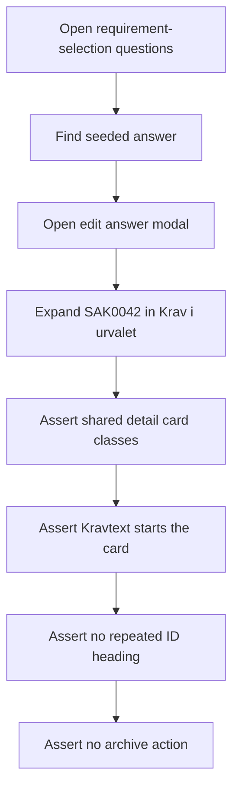
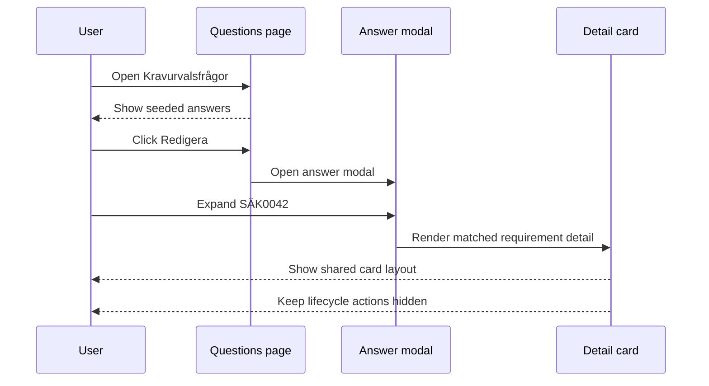
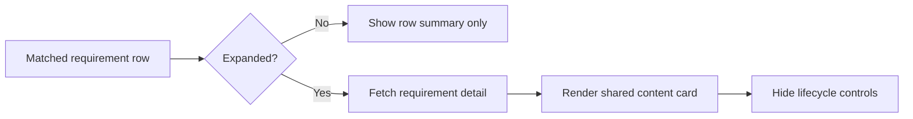

# Requirement Selection Questions Detail Integration Tests

> Test flow documentation for
> [`requirement-selection-questions-detail.spec.ts`](./requirement-selection-questions-detail.spec.ts)

This suite verifies that a requirement opened from `Krav i urvalet` in the
requirement-selection answer modal uses the same content-card layout as the
requirements library inline detail, while staying read-only inside the modal.

## Overview Flowchart

## Test Setup

- The standard Playwright global setup provides an authenticated admin session.
- The test uses the seeded `SÄK-KUF001` question and the
  `Grundskydd för intern information` answer.
- The linked `SÄK0042` requirement is expanded from the answer modal preview.
- Assertions use web-first locators and Developer Mode attributes already
  present on the read-only preview detail.

## opens a library-style read-only requirement detail card from the answer modal

### Purpose

Protects the visual contract that answer-modal requirement details reuse the
library inline detail card spacing and typography without bringing lifecycle
actions into the answer editing workflow.

### Step-by-Step Flow

1. Navigate to `/sv/requirements/stewardship?tab=questions`.
1. Assert the `Kravurvalsfrågor` heading is present.
1. Locate the seeded `Grundskydd för intern information` answer row.
1. Click `Redigera` for that answer.
1. Assert the `Redigera kravurvalsvar` dialog is open.
1. Click `Öppna kravdetaljer SÄK0042`.
1. Assert the row reports `aria-expanded="true"`.
1. Assert the detail card has `rounded-2xl`, `p-6`, `space-y-5`, and
   `bg-white/80`.
1. Assert the card sits inside an inset with `px-6` and `py-4`.
1. Assert the first detail section exposes `Kravtext`.
1. Assert there is no repeated `SÄK0042` heading in the card.
1. Assert no `Arkivera` action is present in the dialog.

### Sequence Diagram

### Supplementary Flowchart

