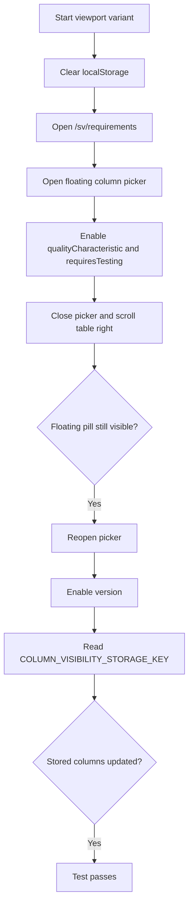
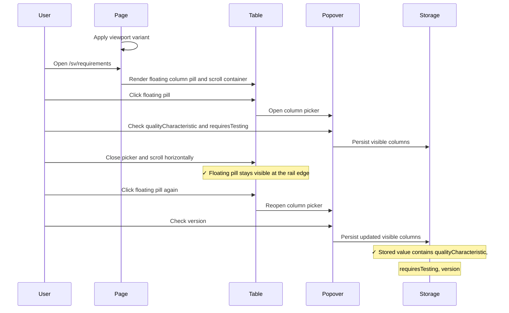
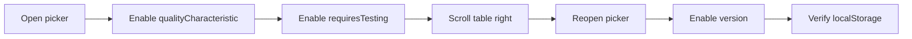

# Requirements Table Column Picker Integration Tests

> Test flow documentation for [`requirements-table-column-picker.spec.ts`](tests/integration/requirements-table-column-picker.spec.ts)

This suite verifies that the floating column-picker pill stays visible while
the requirements table scrolls horizontally and that column toggles persist to
browser storage on both mobile and desktop layouts.

## Data Model

<!-- markdownlint-disable MD013 -->
| Item | Purpose |
| --- | --- |
| `COLUMN_VISIBILITY_STORAGE_KEY` | Persists the visible column list in `localStorage`. |
| Floating pill trigger | Opens and closes the column picker popover. |
| Scroll container | Horizontal overflow region used to verify pill placement while scrolled. |
| Viewport matrix | Repeats the same scenario at `375x667` and `1280x720`. |
<!-- markdownlint-enable MD013 -->

```json
[
  "uniqueId",
  "description",
  "area",
  "category",
  "type",
  "status",
  "qualityCharacteristic",
  "requiresTesting",
  "version"
]
```

## Overview Flowchart



## Test Setup

- `test.beforeEach` clears `localStorage` with `page.addInitScript(...)` so
  persisted column choices do not leak between runs.
- The suite iterates over `viewportVariants`, so the same interaction runs for
  both the mobile and desktop viewport definitions in the spec.
- Each test locates the floating trigger with
  `[data-column-picker-trigger="true"]` and the horizontal overflow region with
  `[data-requirements-scroll-container="true"]`.
- Storage assertions read `COLUMN_VISIBILITY_STORAGE_KEY` directly from
  `localStorage` after the final toggle sequence.

## keeps the floating pill visible during horizontal scroll and still toggles columns

### Purpose

This test confirms that the floating column-picker pill remains reachable after
the table is scrolled horizontally and that toggling additional columns still
persists the expected visible-column list.

### Step-by-Step Flow

1. Start the current viewport variant from `viewportVariants`.
2. Clear browser storage before navigation.
3. Open `/sv/requirements`.
4. Locate the floating column-picker trigger and the scroll container.
5. Open the popover with the floating trigger.
6. Ensure the `qualityCharacteristic` and `requiresTesting` checkboxes are enabled.
7. Close the popover from the trigger.
8. Scroll the requirements container all the way to the right.
9. Assert that the floating trigger is still visible and aligned with the
   scroll container edge.
10. Reopen the popover from the floating trigger.
11. Enable the `version` checkbox.
12. Close the popover and read `COLUMN_VISIBILITY_STORAGE_KEY` from
    `localStorage`.
13. Assert that the stored value contains `qualityCharacteristic`,
    `requiresTesting`, and `version`.

### Sequence Diagram



### Supplementary Flowchart


