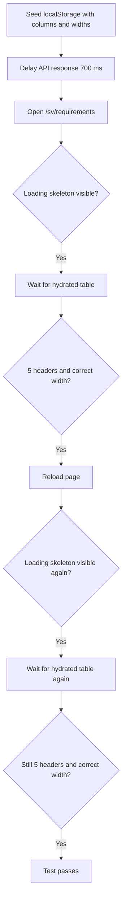
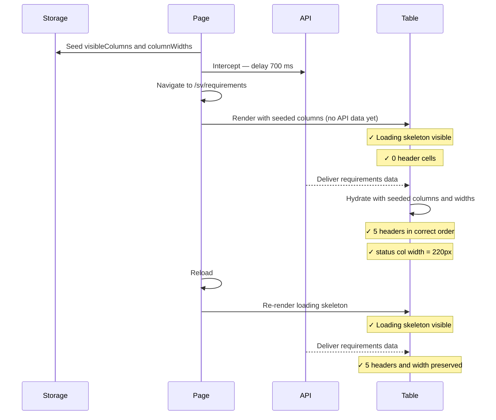

# Requirements Table Hydration Integration Tests

> Test flow documentation for
> [`requirements-table-hydration.spec.ts`](tests/integration/requirements-table-hydration.spec.ts)

This suite verifies that the requirements table reads persisted column
visibility and column-width settings from `localStorage` on the very first
render — before the API response arrives — and that the same state is restored
after a full page reload.

## Data Model

<!-- markdownlint-disable MD013 -->
| Key | Purpose |
| --- | --- |
| `COLUMN_VISIBILITY_STORAGE_KEY` (`requirements.visibleColumns.v3`) | Stores the list of visible column IDs. |
| `COLUMN_WIDTHS_STORAGE_KEY` (`requirements.columnWidths.v3.sv`) | Stores per-column widths keyed by column ID. |
<!-- markdownlint-enable MD013 -->

Seed values used in the test:

```json
{
  "visibleColumns": ["area", "status"],
  "columnWidths": { "status": 220 }
}
```

Expected hydrated column set (checkbox + fixed columns + seeded extras):

```json
["", "Krav-ID", "Kravtext", "Område", "Status"]
```

## Overview Flowchart



## Test Setup

- No `beforeEach` hook; setup is inlined in the test via `page.addInitScript`.
- `addInitScript` seeds `localStorage` before navigation so the app reads the
  values on first paint.
- The API route `**/api/requirements?*` is delayed by 700 ms via
  `page.route(...)` to create a reliable loading-skeleton window.
- The suite iterates over `desktop` (`1280×720`) and `mobile` (`375×812`)
  viewport configurations.
- Two helper functions keep the test concise:
  - `expectInitialLoadingState` — asserts the loading text is visible, no
    "Inga resultat hittades" message, and zero header cells.
  - `expectHydratedTable` — asserts exactly 5 header cells with the expected
    labels and that the `status` column `<col>` element has `width: 220px`.

## uses persisted columns and widths on the first visible render and after reload

### Purpose

Validates that the table avoids a flash of default columns by reading
`localStorage` synchronously before the first render and that persisted state
survives a hard reload.

### Step-by-Step Flow

1. Seed `localStorage` with `["area","status"]` as visible columns and
   `{"status":220}` as column widths.
2. Intercept the requirements API to add a 700 ms delay.
3. Navigate to `/sv/requirements`.
4. Assert the loading skeleton is shown (loading text visible, no header cells).
5. Wait for the hydrated table: assert 5 header cells (`""`, `Krav-ID`,
   `Kravtext`, `Område`, `Status`) and the status `<col>` width of `220px`.
6. Reload the page.
7. Assert the loading skeleton reappears.
8. Assert the hydrated table again with the same 5 headers and column width.

### Sequence Diagram


