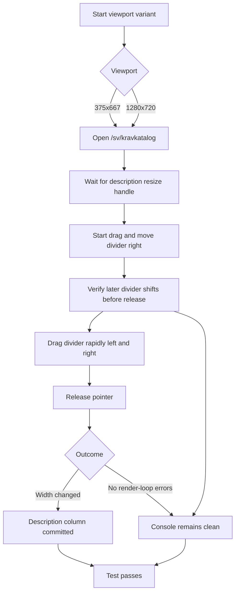
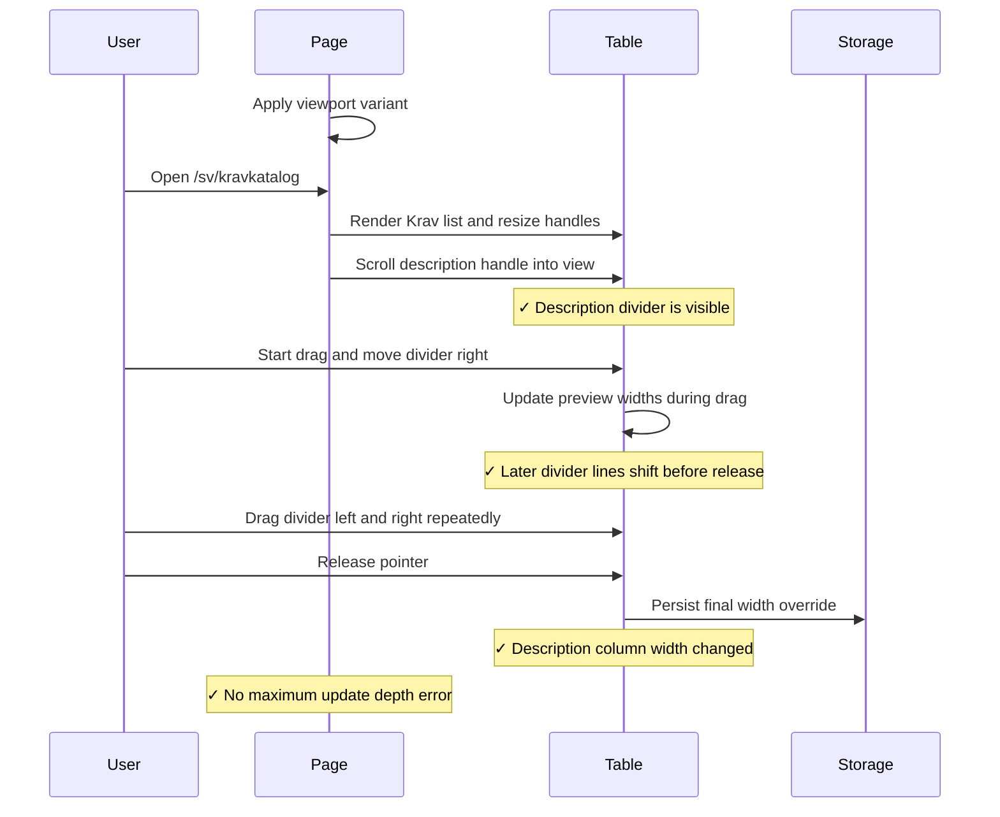

# Requirements Table Column Resizing Integration Tests

> Test flow documentation for [`requirements-table-resize.spec.ts`](/workspace/tests/integration/requirements-table-resize.spec.ts)

This suite verifies that the Krav list keeps resizing responsive under
rapid pointer dragging on both mobile and desktop layouts and does not
fall into a React render loop while persisting the final width.

## Data Model

|Item|Purpose|
|---|---|
|Storage key constant|Swedish width override key.|
|`description` resize handle|Divider for `Beskrivning` resize.|
|`area` resize handle|Later divider used to verify live divider movement.|
|Viewport matrix|Runs at `375x667` and `1280x720`.|

Keep the storage key constant in sync with
`getRequirementColumnWidthsStorageKey('sv')`.

```json
{
  "description": 520
}
```

## Overview Flowchart



## Test Setup

- Each test clears `localStorage` with `page.addInitScript(...)` so
  persisted manual widths from previous runs do not affect the baseline.
- The suite reruns the same interaction in nested Playwright `describe`
  blocks for `375x667` and `1280x720` screen sizes.
- The test scrolls the `description` resize handle into view before
  measuring it so the drag path works in the horizontal overflow layout.
- The test subscribes to both browser `console` errors and uncaught
  `pageerror` events before loading the page.
- The drag uses the full-height description divider rendered by the
  table, so the test exercises the same pointer path as a user resizing
  the list.
- The test also samples the `area` divider during an active drag to
  confirm later divider lines move with the previewed columns before the
  resize is committed.
- No fixed wait is used for the commit. The assertions poll the DOM
  width and `localStorage` until the committed resize appears.

## resizes the description column during rapid dragging without render-loop errors

### Purpose

This test validates the failure mode reported in the browser: repeated
left-right dragging of the `Beskrivning` divider must still resize the
table, move the later visible divider lines during the live preview, and
must not trigger React's "Maximum update depth exceeded" error in both
the mobile and desktop layouts.

### Step-by-Step Flow

1. Start the current viewport variant (`375x667` or `1280x720`).
2. Clear browser storage before navigation.
3. Start capturing console and page-level errors.
4. Open `/sv/kravkatalog`.
5. Scroll the `description` resize handle into view and record the
   initial description column width.
6. Record the initial position of the later `area` divider.
7. Begin the drag and move the description divider right once.
8. Assert that the `area` divider has already shifted right before mouse
   up.
9. Continue dragging back and forth with alternating left and right
   deltas.
10. Release the pointer to commit the resize.
11. Assert that the description column width differs from the starting
   value.
12. Assert that the Swedish column-width storage entry now contains a
   `description` override.
13. Assert that no captured error contains the render-loop signatures.

### Sequence Diagram


