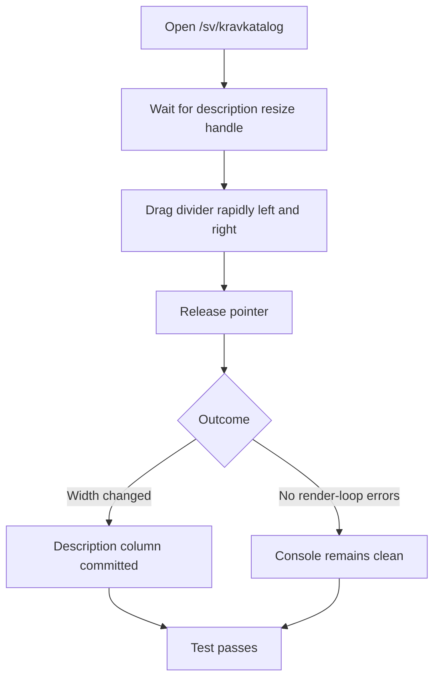
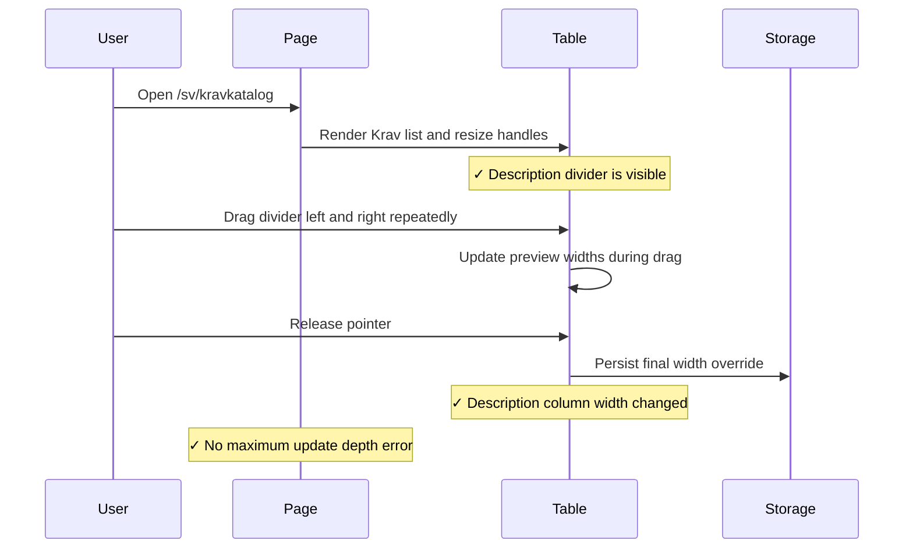

# Requirements Table Column Resizing Integration Tests

> Test flow documentation for [`requirements-table-resize.spec.ts`](/workspace/tests/integration/requirements-table-resize.spec.ts)

This suite verifies that the Krav list keeps resizing responsive under
rapid pointer dragging and does not fall into a React render loop while
persisting the final width.

## Data Model

|Item|Purpose|
|---|---|
|`kravkatalog.columnWidths.v2.sv`|Swedish width override key.|
|`description` resize handle|Divider for `Beskrivning` resize.|

```json
{
  "description": 520
}
```

## Overview Flowchart



## Test Setup

- Each test clears `localStorage` with `page.addInitScript(...)` so
  persisted manual widths from previous runs do not affect the baseline.
- The test subscribes to both browser `console` errors and uncaught
  `pageerror` events before loading the page.
- The drag uses the full-height description divider rendered by the
  table, so the test exercises the same pointer path as a user resizing
  the list.
- No fixed wait is used for the commit. The assertions poll the DOM
  width and `localStorage` until the committed resize appears.

## resizes the description column during rapid dragging without render-loop errors

### Purpose

This test validates the failure mode reported in the browser: repeated
left-right dragging of the `Beskrivning` divider must still resize the
table and must not trigger React's "Maximum update depth exceeded"
error.

### Step-by-Step Flow

1. Clear browser storage before navigation.
2. Start capturing console and page-level errors.
3. Open `/sv/kravkatalog`.
4. Wait for the `description` resize handle and record the initial
   description column width.
5. Drag the divider back and forth several times with alternating left
   and right deltas.
6. Release the pointer to commit the resize.
7. Assert that the description column width differs from the starting
   value.
8. Assert that the Swedish column-width storage entry now contains a
   `description` override.
9. Assert that no captured error contains the render-loop signatures.

### Sequence Diagram


