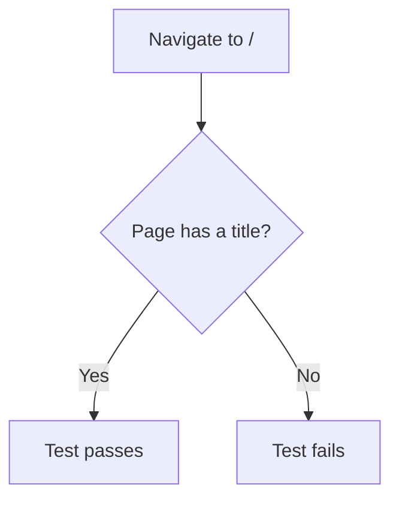
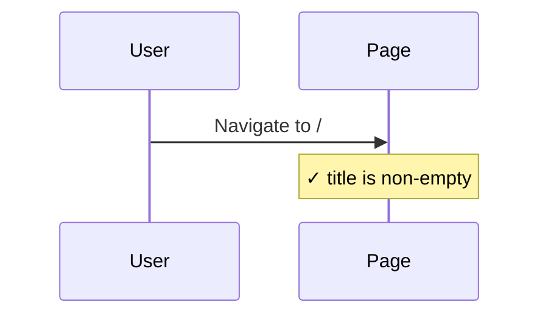

# Smoke Integration Tests

> Test flow documentation for
> [`smoke.spec.ts`](tests/integration/smoke.spec.ts)

This suite provides a single sanity check that the application server is
running and the root route returns a page with a non-empty title.

## Overview Flowchart

## Test Setup

No `beforeEach` hooks. No storage manipulation. The test navigates directly to
`/` on each run.

## homepage loads

### Purpose

Confirms that the root URL responds with a rendered page whose `<title>` is
non-empty. Catches build or server startup regressions before longer suites run.

### Step-by-Step Flow

1. Navigate to `/`.
2. Assert that the page title matches a non-empty string.

### Sequence Diagram

