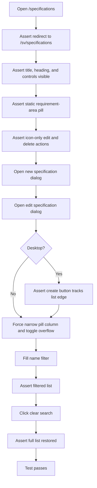
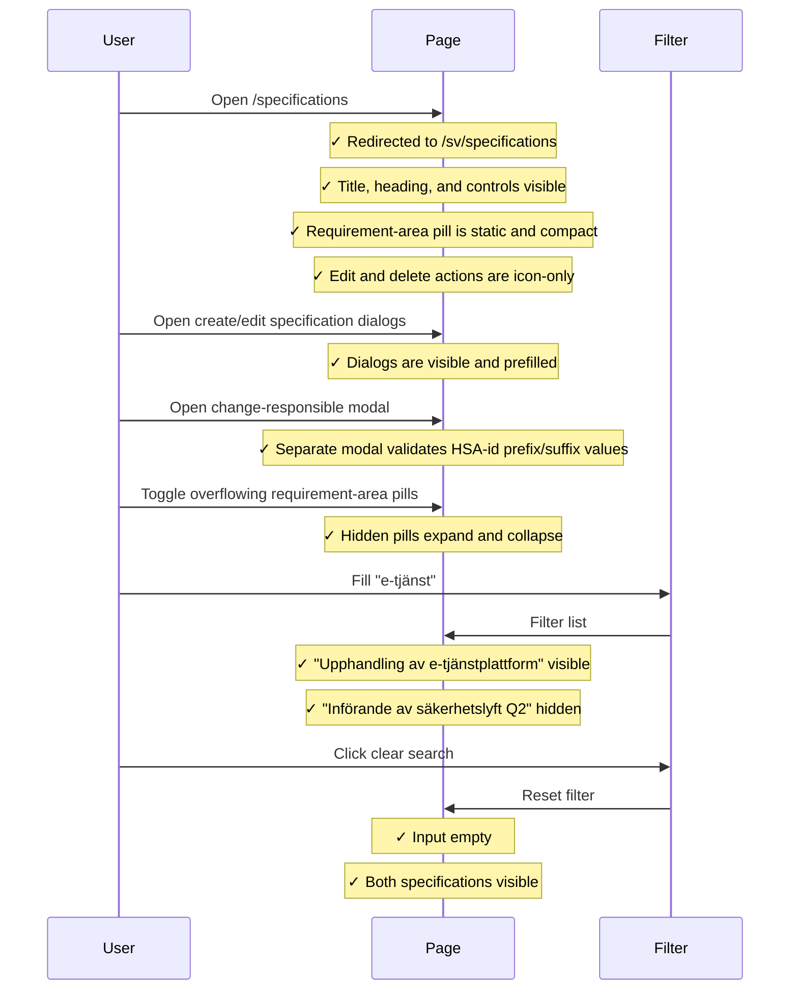
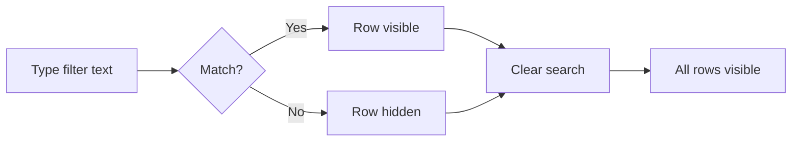

# Requirements specifications list integration tests

> Test flow documentation for
> [`specifications-list.spec.ts`](tests/integration/specifications-list.spec.ts)

This suite verifies that the requirements specifications list page renders correctly,
that compact static requirement-area pills are present, that the create and edit
workflows open modal dialogs, that the name filter narrows the visible
specifications, that row actions render as icon-only buttons, that overflowing
requirement-area pills can be expanded on demand, and that the clear-search
action restores the full list. On desktop it additionally asserts that the
floating create button is anchored to the right side of the list.

## Overview Flowchart

## Test Setup

No `beforeEach` hooks. The suite iterates over two viewport definitions
(`375×812` mobile and `1280×720` desktop) so the same scenario runs at both
sizes.

## filters the table by specification name and clears the search

### Purpose

Confirms that typing in the name filter hides non-matching specifications and that
clicking the clear button restores all specifications. The same flow opens the
create and edit dialogs and verifies that the responsible-person controls stay
inside those modal forms. On desktop it also verifies that the "Nytt
kravunderlag" button stays in the fixed floating rail beside the list.

### Step-by-Step Flow

1. Navigate to `/specifications`.
1. Assert the browser is on `/sv/specifications`.
1. Assert the page title contains "Kravunderlag".
1. Assert the `h1` "Kravunderlag" heading is visible.
1. Assert the name-filter text input and "Nytt kravunderlag" button are visible.
1. Assert the first requirement-area pill is a compact static `span`, not a
   link.
1. Assert the row edit/delete actions are icon-only buttons with accessible
   names.
1. Open "Nytt kravunderlag" and assert the modal dialog shows a two-column
   desktop-capable form with the signed-in user as `Kravunderlagsansvarig`.
1. Open "Redigera" for `Upphandling av e-tjänstplattform` and assert the modal
   dialog is prefilled.
1. Open `Byt kravunderlagsansvarig` from the edit dialog and assert the separate
   change modal validates current and new HSA-id values through its editable
   prefix and suffix controls.
1. *(Desktop only)* Assert that `Nytt kravunderlag` is positioned at the right
   edge of the list in the fixed floating rail.
1. Force a narrow requirement-area pill list and assert the chevron toggle
   expands and collapses the hidden pills.
1. Type `e-tjänst` into the name filter.
1. Assert "Upphandling av e-tjänstplattform" link is visible.
1. Assert "Införande av säkerhetslyft Q2" link is hidden.
1. Click "Rensa sökning".
1. Assert the filter input value is empty.
1. Assert "Upphandling av e-tjänstplattform" is visible again.
1. Verify "Införande av säkerhetslyft Q2" is visible again.

### Sequence Diagram

### Supplementary Flowchart

